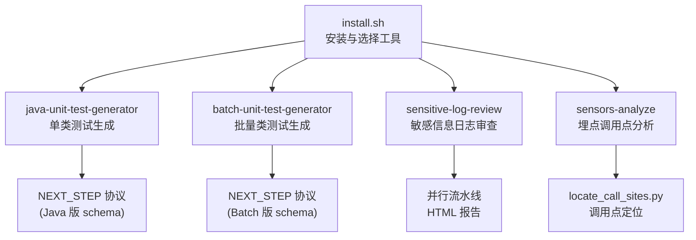
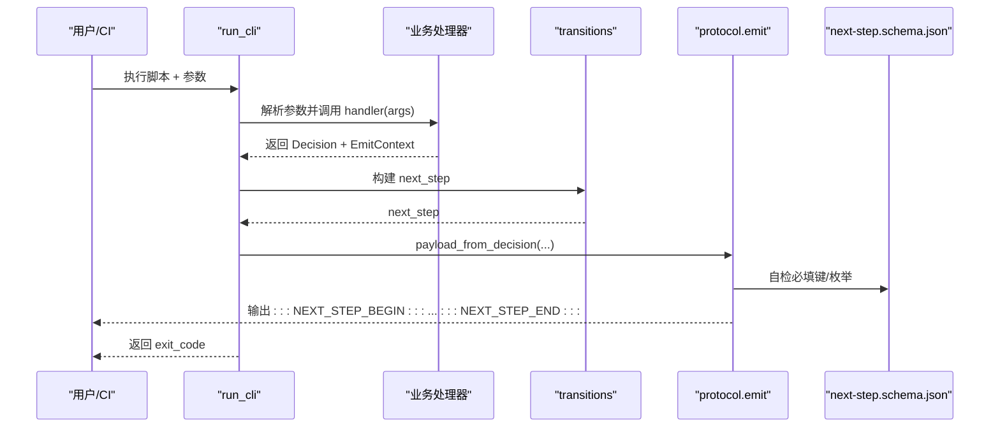
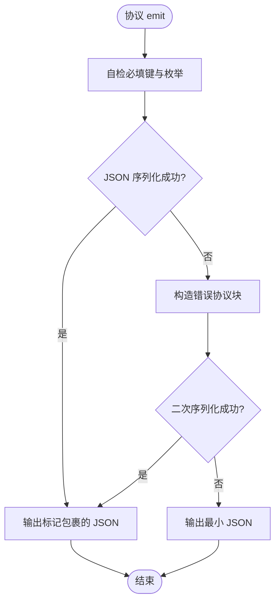
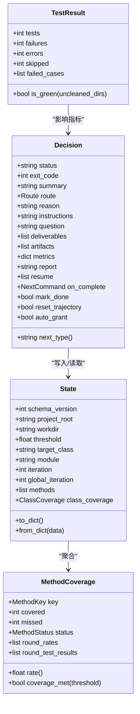
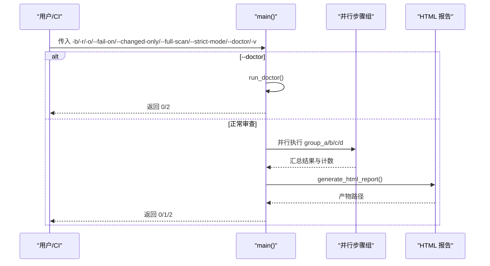
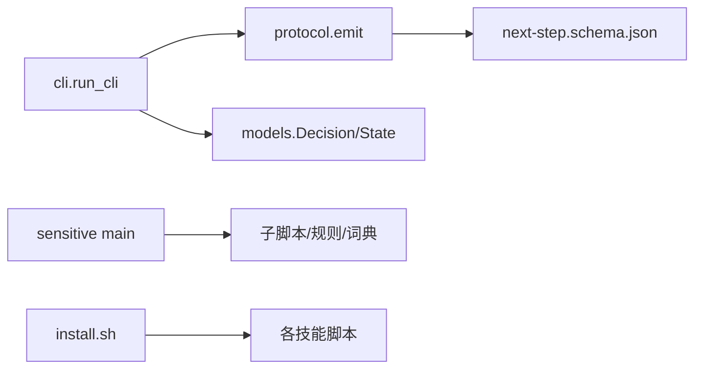

# API 参考

<cite>
**本文引用的文件**
- [AGENTS.md](file://AGENTS.md)
- [install.sh](file://install.sh)
- [java-unit-test-generator/scripts/jaut/cli.py](file://java-unit-test-generator/scripts/jaut/cli.py)
- [batch-unit-test-generator/scripts/jaut/cli.py](file://batch-unit-test-generator/scripts/jaut/cli.py)
- [java-unit-test-generator/scripts/jaut/protocol.py](file://java-unit-test-generator/scripts/jaut/protocol.py)
- [batch-unit-test-generator/scripts/jaut/protocol.py](file://batch-unit-test-generator/scripts/jaut/protocol.py)
- [java-unit-test-generator/scripts/jaut/models.py](file://java-unit-test-generator/scripts/jaut/models.py)
- [batch-unit-test-generator/scripts/jaut/models.py](file://batch-unit-test-generator/scripts/jaut/models.py)
- [java-unit-test-generator/protocol/next-step.schema.json](file://java-unit-test-generator/protocol/next-step.schema.json)
- [batch-unit-test-generator/protocol/next-step.schema.json](file://batch-unit-test-generator/protocol/next-step.schema.json)
- [sensitive-log-review/scripts/main.py](file://sensitive-log-review/scripts/main.py)
- [sensitive-log-review/scripts/common/errors.py](file://sensitive-log-review/scripts/common/errors.py)
- [sensors-analyze/scripts/locate_call_sites.py](file://sensors-analyze/scripts/locate_call_sites.py)
</cite>

## 目录
1. [简介](#简介)
2. [项目结构](#项目结构)
3. [核心组件](#核心组件)
4. [架构总览](#架构总览)
5. [详细组件分析](#详细组件分析)
6. [依赖关系分析](#依赖关系分析)
7. [性能考虑](#性能考虑)
8. [故障排查指南](#故障排查指南)
9. [结论](#结论)
10. [附录](#附录)

## 简介
本参考文档面向 ping-skills 仓库中的四个“技能”（skills），统一记录其对外暴露的接口与协议：
- Python CLI 接口：各脚本的命令行参数、退出码约定、日志与产物位置。
- 进程间通信协议：NEXT_STEP 协议（stdout 标记包裹的 JSON 负载），用于脚本与编排器（LLM/调度器）之间的契约。
- 编排与流水线接口：敏感信息日志审查主流程的并行步骤编排、产物汇总与 HTML 报告生成。
- 辅助工具接口：埋点调用点定位脚本等。

本项目不包含传统意义上的 RESTful 或 WebSocket 服务；所有外部交互均通过 CLI 与 NEXT_STEP 协议完成。安装与集成由 install.sh 提供。

## 项目结构
仓库由多个独立技能组成，每个技能自包含 SKILL.md、references/、protocol/、scripts/、tests/。顶层 install.sh 负责将技能安装到目标工程。

图表来源
- [install.sh:29-92](file://install.sh#L29-L92)
- [java-unit-test-generator/protocol/next-step.schema.json:1-195](file://java-unit-test-generator/protocol/next-step.schema.json#L1-L195)
- [batch-unit-test-generator/protocol/next-step.schema.json:1-195](file://batch-unit-test-generator/protocol/next-step.schema.json#L1-L195)
- [sensitive-log-review/scripts/main.py:1-800](file://sensitive-log-review/scripts/main.py#L1-L800)
- [sensors-analyze/scripts/locate_call_sites.py:1-125](file://sensors-analyze/scripts/locate_call_sites.py#L1-L125)

章节来源
- [AGENTS.md:1-28](file://AGENTS.md#L1-L28)
- [install.sh:29-92](file://install.sh#L29-L92)

## 核心组件
- 统一 CLI 脚手架（run_cli）：收敛参数解析、工作目录解析、异常转协议块、路由决策、协议输出与退出码返回。
- NEXT_STEP 协议：定义脚本与编排器之间的负载结构与校验规则，确保可被稳定解析。
- 领域模型（models）：类型化的状态、覆盖率、决策、批处理条目等数据结构。
- 错误体系（errors）：结构化错误码与修复建议模板，统一 stderr 输出。
- 编排主流程（main）：多链路并行执行、产物汇总、HTML 报告生成与环境诊断。

章节来源
- [java-unit-test-generator/scripts/jaut/cli.py:1-128](file://java-unit-test-generator/scripts/jaut/cli.py#L1-L128)
- [batch-unit-test-generator/scripts/jaut/cli.py:1-128](file://batch-unit-test-generator/scripts/jaut/cli.py#L1-L128)
- [java-unit-test-generator/scripts/jaut/protocol.py:1-105](file://java-unit-test-generator/scripts/jaut/protocol.py#L1-L105)
- [batch-unit-test-generator/scripts/jaut/protocol.py:1-105](file://batch-unit-test-generator/scripts/jaut/protocol.py#L1-L105)
- [java-unit-test-generator/scripts/jaut/models.py:1-499](file://java-unit-test-generator/scripts/jaut/models.py#L1-L499)
- [batch-unit-test-generator/scripts/jaut/models.py:1-693](file://batch-unit-test-generator/scripts/jaut/models.py#L1-L693)
- [sensitive-log-review/scripts/common/errors.py:1-100](file://sensitive-log-review/scripts/common/errors.py#L1-L100)
- [sensitive-log-review/scripts/main.py:1-800](file://sensitive-log-review/scripts/main.py#L1-L800)

## 架构总览
整体交互以 CLI 为入口，脚本内部通过 run_cli 统一处理参数与异常，产出 NEXT_STEP 协议负载并通过 stdout 输出。编排器读取协议负载后决定下一步动作（继续运行脚本、写代码、询问用户或结束）。

图表来源
- [java-unit-test-generator/scripts/jaut/cli.py:95-128](file://java-unit-test-generator/scripts/jaut/cli.py#L95-L128)
- [batch-unit-test-generator/scripts/jaut/cli.py:95-128](file://batch-unit-test-generator/scripts/jaut/cli.py#L95-L128)
- [java-unit-test-generator/scripts/jaut/protocol.py:28-105](file://java-unit-test-generator/scripts/jaut/protocol.py#L28-L105)
- [batch-unit-test-generator/scripts/jaut/protocol.py:28-105](file://batch-unit-test-generator/scripts/jaut/protocol.py#L28-L105)
- [java-unit-test-generator/protocol/next-step.schema.json:1-195](file://java-unit-test-generator/protocol/next-step.schema.json#L1-L195)
- [batch-unit-test-generator/protocol/next-step.schema.json:1-195](file://batch-unit-test-generator/protocol/next-step.schema.json#L1-L195)

## 详细组件分析

### Python CLI 接口（统一脚手架）
- 入口函数：run_cli(script_name, add_arguments, handler, argv)
  - 职责：创建 ArgumentParser，注册共享参数，解析参数，调用 handler，捕获 StepError 与通用异常，初始化日志，构建 next_step，组装协议负载并输出，最后返回 exit_code。
  - 共享参数：--workdir、--project-root（二选一解析 workdir）。
  - 错误分类：StepError（可预期错误，携带 Decision）、Exception（内部错误，统一转为 failed + ask_user，exit 2）。
  - 返回值：进程退出码取自 Decision.exit_code。

- 关键行为
  - require_workdir：缺失时抛出 state_error（exit 3）。
  - _internal_error_decision：构造失败决策，便于协议层输出 ask_user 提示。

章节来源
- [java-unit-test-generator/scripts/jaut/cli.py:25-128](file://java-unit-test-generator/scripts/jaut/cli.py#L25-L128)
- [batch-unit-test-generator/scripts/jaut/cli.py:25-128](file://batch-unit-test-generator/scripts/jaut/cli.py#L25-L128)

### NEXT_STEP 协议接口（stdout 协议）
- 负载字段（必填）：protocol_version、script、status、exit_code、summary、artifacts、next_step。
- next_step.type 取值：run_script、write_code、ask_user、finish。
- 运行时校验：emit 前进行轻量自检（必填键、枚举值），不合法仅告警不阻断；序列化失败会降级输出错误协议块，避免调用方无限等待。
- 版本与约束：schema 中 protocol_version 固定为 "1.0"；不同技能的 schema 对 finish 是否必须 report 有细微差异。

图表来源
- [java-unit-test-generator/scripts/jaut/protocol.py:59-105](file://java-unit-test-generator/scripts/jaut/protocol.py#L59-L105)
- [batch-unit-test-generator/scripts/jaut/protocol.py:59-105](file://batch-unit-test-generator/scripts/jaut/protocol.py#L59-L105)
- [java-unit-test-generator/protocol/next-step.schema.json:1-195](file://java-unit-test-generator/protocol/next-step.schema.json#L1-L195)
- [batch-unit-test-generator/protocol/next-step.schema.json:1-195](file://batch-unit-test-generator/protocol/next-step.schema.json#L1-L195)

章节来源
- [java-unit-test-generator/scripts/jaut/protocol.py:1-105](file://java-unit-test-generator/scripts/jaut/protocol.py#L1-L105)
- [batch-unit-test-generator/scripts/jaut/protocol.py:1-105](file://batch-unit-test-generator/scripts/jaut/protocol.py#L1-L105)
- [java-unit-test-generator/protocol/next-step.schema.json:1-195](file://java-unit-test-generator/protocol/next-step.schema.json#L1-L195)
- [batch-unit-test-generator/protocol/next-step.schema.json:1-195](file://batch-unit-test-generator/protocol/next-step.schema.json#L1-L195)

### 领域模型与状态（models）
- 覆盖率原语：coverage_rate(covered, missed)，抽象/接口方法视为达标。
- 方法/类覆盖率：MethodCoverage、ClassCoverage，支持轨迹记录与阈值判定。
- 测试结果：TestResult、FailedCase，is_green 采用 fail-closed 策略。
- 决策产物：Decision（含 route、instructions、question、deliverables、artifacts、metrics、report、resume、on_complete 等）。
- 持久化状态：State（兼容旧 state.json，新增 global_iteration、batch_mode 等字段）。
- 批量模式：BatchClassEntry、BatchState（支持方法分组、进度推进、排序策略）。

图表来源
- [java-unit-test-generator/scripts/jaut/models.py:282-499](file://java-unit-test-generator/scripts/jaut/models.py#L282-L499)
- [batch-unit-test-generator/scripts/jaut/models.py:286-693](file://batch-unit-test-generator/scripts/jaut/models.py#L286-L693)

章节来源
- [java-unit-test-generator/scripts/jaut/models.py:1-499](file://java-unit-test-generator/scripts/jaut/models.py#L1-L499)
- [batch-unit-test-generator/scripts/jaut/models.py:1-693](file://batch-unit-test-generator/scripts/jaut/models.py#L1-L693)

### 敏感信息日志审查（主流程与错误体系）
- 主流程 main：
  - 支持 --doctor 环境诊断（只检查不执行），逐项检查 Python/java/git/checkstyle jar/规则与词典文件/输出目录可写性/编码设置。
  - 四链路并行执行：扫描日志输出、变更日志检查、@ToString 注解检查、字段提取审计、敏感词检查、POJO 注释检查、深度敏感性分析。
  - 产物汇总与 HTML 报告生成，统计门禁项（violation/sensitive/unqualified/tostring/tostring_sensitive/analyze/miss_comments/low）。
  - 退出码：0=通过；1=触发门禁；2=执行错误。
- 错误体系 errors：
  - 统一错误码枚举（E001-E007），附带标题与分步修复建议。
  - print_error 输出结构化错误到 stderr，不改变既有退出码契约。

图表来源
- [sensitive-log-review/scripts/main.py:1-800](file://sensitive-log-review/scripts/main.py#L1-L800)
- [sensitive-log-review/scripts/common/errors.py:1-100](file://sensitive-log-review/scripts/common/errors.py#L1-L100)

章节来源
- [sensitive-log-review/scripts/main.py:1-800](file://sensitive-log-review/scripts/main.py#L1-L800)
- [sensitive-log-review/scripts/common/errors.py:1-100](file://sensitive-log-review/scripts/common/errors.py#L1-L100)

### 埋点调用点定位（sensors-analyze）
- locate_call_sites.py：按 entry.txt 的正则定位代码库内埋点调用点，写入 call_sites.json；支持排除 wrapper/hook 封装实现体范围；默认扫描多种语言后缀。
- 输入：entry.txt（正则列表）、可选 sensors_path（paradigms 配置）。
- 输出：call_sites.json（去重后的调用点集合）。

章节来源
- [sensors-analyze/scripts/locate_call_sites.py:1-125](file://sensors-analyze/scripts/locate_call_sites.py#L1-L125)

## 依赖关系分析
- CLI 脚手架依赖协议模块与模型模块，负责将业务决策转换为协议负载。
- 协议模块依赖配置与日志工具，负责负载构建与自检输出。
- 模型模块仅依赖标准库与配置，保证低耦合与可测试性。
- 敏感信息审查主流程依赖多个子脚本与规则/词典文件，使用线程池并行执行。
- 安装脚本提供工具选择与交互式菜单，支持 all/逗号/空格分隔的选择方式。

图表来源
- [java-unit-test-generator/scripts/jaut/cli.py:95-128](file://java-unit-test-generator/scripts/jaut/cli.py#L95-L128)
- [batch-unit-test-generator/scripts/jaut/cli.py:95-128](file://batch-unit-test-generator/scripts/jaut/cli.py#L95-L128)
- [java-unit-test-generator/scripts/jaut/protocol.py:28-105](file://java-unit-test-generator/scripts/jaut/protocol.py#L28-L105)
- [batch-unit-test-generator/scripts/jaut/protocol.py:28-105](file://batch-unit-test-generator/scripts/jaut/protocol.py#L28-L105)
- [sensitive-log-review/scripts/main.py:1-800](file://sensitive-log-review/scripts/main.py#L1-L800)
- [install.sh:29-92](file://install.sh#L29-L92)

章节来源
- [java-unit-test-generator/scripts/jaut/cli.py:1-128](file://java-unit-test-generator/scripts/jaut/cli.py#L1-L128)
- [batch-unit-test-generator/scripts/jaut/cli.py:1-128](file://batch-unit-test-generator/scripts/jaut/cli.py#L1-L128)
- [sensitive-log-review/scripts/main.py:1-800](file://sensitive-log-review/scripts/main.py#L1-L800)
- [install.sh:29-92](file://install.sh#L29-L92)

## 性能考虑
- 并行执行：敏感信息审查采用 ThreadPoolExecutor 并行四条链路，目标全流程 <60s。
- 增量扫描：--changed-only 模式仅处理变更文件清单，减少 IO 与计算量。
- 产物缓存：JaCoCo 配置探测缓存避免重复解析 pom 等耗时操作。
- 协议自检：emit 前轻量校验，避免无效负载阻塞调用方。

[本节为通用指导，不直接分析具体文件]

## 故障排查指南
- 环境变量与依赖：
  - Python >= 3.10；Windows 下建议设置 PYTHONIOENCODING=utf-8 避免乱码。
  - java、git、checkstyle jar 可用性检查；jar SHA256 基线校验。
- 常见错误码与修复建议：
  - E001：-r 指向的目录不是 git 仓库。
  - E002：找不到 java 命令（仅影响 POJO 注释检查）。
  - E003：分支名非法或不存在。
  - E004：规则 JSON 文件损坏。
  - E005：run-id 含非法字符。
  - E006：输出目录不可写。
  - E007：checkstyle jar SHA256 校验不符。
- 协议问题：
  - 若 emit 序列化失败，会输出错误协议块；检查日志与脚本输出，确保无额外打印干扰协议块。
  - 确认 next_step.type 与 required 字段符合 schema 约束。

章节来源
- [sensitive-log-review/scripts/common/errors.py:18-100](file://sensitive-log-review/scripts/common/errors.py#L18-L100)
- [java-unit-test-generator/scripts/jaut/protocol.py:59-105](file://java-unit-test-generator/scripts/jaut/protocol.py#L59-L105)
- [batch-unit-test-generator/scripts/jaut/protocol.py:59-105](file://batch-unit-test-generator/scripts/jaut/protocol.py#L59-L105)

## 结论
ping-skills 通过统一的 CLI 脚手架与 NEXT_STEP 协议实现了脚本与编排器的解耦协作。各技能聚焦特定任务（单元测试生成、敏感信息审查、埋点分析），通过标准化协议与类型化模型保障稳定性与可维护性。建议在集成时严格遵循协议 schema、关注退出码与错误码，并结合 --changed-only 与并行执行优化性能。

[本节为总结，不直接分析具体文件]

## 附录

### 安装与集成
- 使用 install.sh 选择并安装技能至目标工程；支持 all、逗号/空格分隔的多选方式。
- 安装后可在各技能目录下运行 pytest 套件验证。

章节来源
- [install.sh:29-92](file://install.sh#L29-L92)
- [AGENTS.md:16-28](file://AGENTS.md#L16-L28)

### 版本与兼容性
- NEXT_STEP 协议版本固定为 "1.0"；不同技能的 schema 在 finish 是否必须 report 上存在细微差异。
- State 模型 from_dict 对缺失键容错，兼容旧 state.json；git_baseline 从 list[str] 向后兼容为 dict[str, str]。

章节来源
- [java-unit-test-generator/protocol/next-step.schema.json:1-195](file://java-unit-test-generator/protocol/next-step.schema.json#L1-L195)
- [batch-unit-test-generator/protocol/next-step.schema.json:1-195](file://batch-unit-test-generator/protocol/next-step.schema.json#L1-L195)
- [java-unit-test-generator/scripts/jaut/models.py:458-499](file://java-unit-test-generator/scripts/jaut/models.py#L458-L499)
- [batch-unit-test-generator/scripts/jaut/models.py:474-517](file://batch-unit-test-generator/scripts/jaut/models.py#L474-L517)