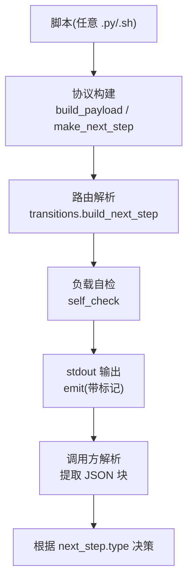
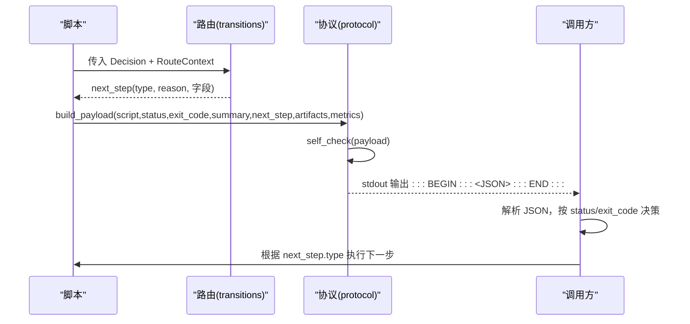
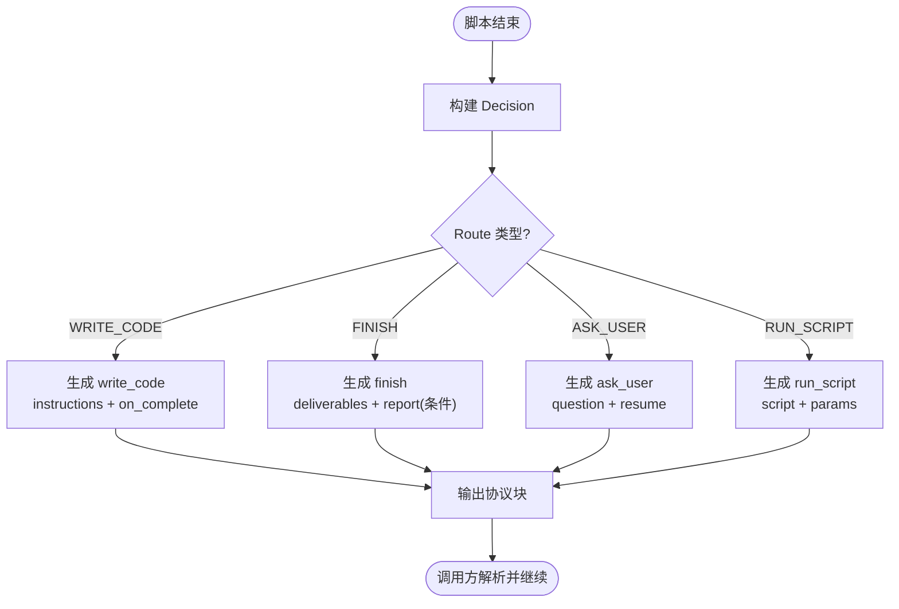
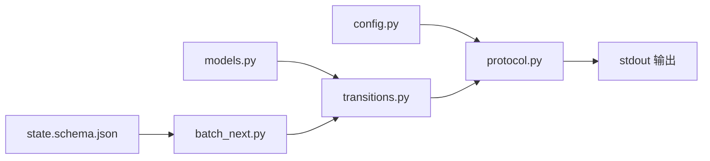

# NEXT_STEP 协议

<cite>
**本文引用的文件**
- [next-step.schema.json](file://batch-unit-test-generator/protocol/next-step.schema.json)
- [next-step.schema.json](file://java-unit-test-generator/protocol/next-step.schema.json)
- [config.py](file://batch-unit-test-generator/scripts/jaut/config.py)
- [config.py](file://java-unit-test-generator/scripts/jaut/config.py)
- [protocol.py](file://batch-unit-test-generator/scripts/jaut/protocol.py)
- [protocol.py](file://java-unit-test-generator/scripts/jaut/protocol.py)
- [transitions.py](file://batch-unit-test-generator/scripts/jaut/transitions.py)
- [transitions.py](file://java-unit-test-generator/scripts/jaut/transitions.py)
- [batch_next.py](file://batch-unit-test-generator/scripts/batch_next.py)
- [state.schema.json](file://batch-unit-test-generator/protocol/state.schema.json)
- [state.schema.json](file://java-unit-test-generator/protocol/state.schema.json)
- [fast-single-cov.sh](file://java-unit-test-generator/scripts/jacoco/fast-single-cov.sh)
</cite>

## 目录
1. [简介](#简介)
2. [项目结构](#项目结构)
3. [核心组件](#核心组件)
4. [架构总览](#架构总览)
5. [详细组件分析](#详细组件分析)
6. [依赖关系分析](#依赖关系分析)
7. [性能考虑](#性能考虑)
8. [故障排查指南](#故障排查指南)
9. [结论](#结论)
10. [附录](#附录)

## 简介
NEXT_STEP 协议是脚本与调用方（LLM/编排器）之间的唯一契约，用于在脚本执行结束时以标准 JSON 块表达“当前状态 + 下一步动作”。协议通过固定标记包裹输出到 stdout，调用方仅解析该 JSON 块。协议版本、字段定义、状态码、next_step 类型及条件约束均以 JSON Schema 为准；运行时由脚本进行轻量自检并安全输出。

## 项目结构
- 协议定义位于各子项目的 protocol 目录下，包含 next-step.schema.json 与 state.schema.json。
- 脚本侧的协议实现集中在 scripts/jaut/protocol.py 与 scripts/jaut/transitions.py，负责负载构建、路由解析与 stdout 输出。
- 配置常量（协议版本、标记、状态枚举、退出码等）集中在 scripts/jaut/config.py。
- 批量流程入口 batch-next 阶段脚本位于 scripts/batch_next.py。
- Java 覆盖率工具脚本 fast-single-cov.sh 作为产物产出者之一，体现 artifacts 的使用场景。

图表来源
- [protocol.py:28-43](file://batch-unit-test-generator/scripts/jaut/protocol.py#L28-L43)
- [transitions.py:41-68](file://batch-unit-test-generator/scripts/jaut/transitions.py#L41-L68)
- [protocol.py:59-104](file://batch-unit-test-generator/scripts/jaut/protocol.py#L59-L104)

章节来源
- [next-step.schema.json:1-195](file://batch-unit-test-generator/protocol/next-step.schema.json#L1-L195)
- [config.py:32-48](file://batch-unit-test-generator/scripts/jaut/config.py#L32-L48)
- [protocol.py:1-105](file://batch-unit-test-generator/scripts/jaut/protocol.py#L1-L105)
- [transitions.py:1-128](file://batch-unit-test-generator/scripts/jaut/transitions.py#L1-L128)

## 核心组件
- 协议负载构建：统一字段顺序与缺省值，支持可选 metrics。
- 路由解析：将 Decision.route 转换为具体 next_step 对象，补全脚本绝对路径与参数。
- 自检与输出：运行期轻量校验必填键与枚举，失败不阻断但告警；异常时降级输出错误协议块。
- 配置常量：协议版本、标记、status/next_step.type 枚举、退出码语义。

章节来源
- [protocol.py:22-43](file://batch-unit-test-generator/scripts/jaut/protocol.py#L22-L43)
- [transitions.py:41-68](file://batch-unit-test-generator/scripts/jaut/transitions.py#L41-L68)
- [config.py:32-48](file://batch-unit-test-generator/scripts/jaut/config.py#L32-L48)

## 架构总览
NEXT_STEP 协议贯穿脚本生命周期：
- 脚本执行产生结果与指标，构造 Decision。
- transitions 将 Decision 转为 next_step 对象（run_script/write_code/ask_user/finish）。
- protocol 组装完整 payload，自检后以 :::NEXT_STEP_BEGIN:::/:::NEXT_STEP_END::: 包裹输出。
- 调用方解析 JSON，依据 status 与 exit_code 决定继续、重试或终止，并按 next_step.type 驱动下一步。

图表来源
- [transitions.py:41-68](file://batch-unit-test-generator/scripts/jaut/transitions.py#L41-L68)
- [protocol.py:28-43](file://batch-unit-test-generator/scripts/jaut/protocol.py#L28-L43)
- [protocol.py:59-104](file://batch-unit-test-generator/scripts/jaut/protocol.py#L59-L104)

## 详细组件分析

### 协议版本与消息格式
- 协议版本：固定为字符串 "1.0"。
- 顶层必填字段：protocol_version、script、status、exit_code、summary、artifacts、next_step。
- 可选字段：metrics（量化指标对象）。
- 标记包裹：stdout 中协议 JSON 被 :::NEXT_STEP_BEGIN::: 与 :::NEXT_STEP_END::: 包裹，调用方只解析该块。

章节来源
- [next-step.schema.json:1-195](file://batch-unit-test-generator/protocol/next-step.schema.json#L1-L195)
- [config.py:32-37](file://batch-unit-test-generator/scripts/jaut/config.py#L32-L37)

### 字段定义与约束
- protocol_version: 固定 "1.0"。
- script: 产出本协议块的脚本文件名。
- status: 枚举 ["success", "empty", "failed", "needs_input"]。
- exit_code: 枚举 [0, 1, 2, 3]，含义：
  - 0：正常完成
  - 1：需要继续处理
  - 2：脚本执行错误
  - 3：状态/协议错误
- summary: 面向调用方的一句话结论。
- artifacts: 产物数组，每项需 path 与 kind（如 worktree、coverage、mvn_log、surefire_report、test_file）。
- metrics: 可选对象，记录覆盖率、轮次、测试计数等。
- next_step: 必需对象，至少含 type 与 reason；type 不同则附加字段不同（见下节）。

章节来源
- [next-step.schema.json:17-65](file://batch-unit-test-generator/protocol/next-step.schema.json#L17-L65)
- [config.py:39-48](file://batch-unit-test-generator/scripts/jaut/config.py#L39-L48)

### next_step 对象与类型
- 通用字段：
  - type: 枚举 ["run_script", "write_code", "ask_user", "finish"]
  - reason: 原因说明
- run_script:
  - 必需：script（下一个脚本的绝对路径）、params（命令行参数数组）
  - 可选：instructions（附加指令）
- write_code:
  - 必需：instructions（交给 LLM 的完整提示词）、on_complete（完成后命令，含 script 与 params）
- ask_user:
  - 必需：question（向用户提出的问题）
  - 可选：resume（用户选项恢复指引数组），每项含 option、label，以及可选 note、script、params；terminate 选项无 script/params
- finish:
  - 可选：deliverables（交付物路径列表）、report（收尾报告）
  - 条件约束：当 script 非 select_worktree.py、batch_diff.py、batch_init.py 且 type=finish 时，必须携带 report

章节来源
- [next-step.schema.json:66-177](file://batch-unit-test-generator/protocol/next-step.schema.json#L66-L177)
- [transitions.py:41-68](file://batch-unit-test-generator/scripts/jaut/transitions.py#L41-L68)

### 状态转换与生命周期
- 脚本执行结束 → 构造 Decision（status、exit_code、summary、route、artifacts、metrics 等）
- transitions 将 route 解析为 next_step：
  - WRITE_CODE → write_code（附带 instructions 与 on_complete）
  - FINISH → finish（附带 deliverables 与可选 report）
  - ASK_USER → ask_user（附带 question 与 resume）
  - 其他 → run_script（补全脚本绝对路径与 params）
- protocol 构建 payload 并输出；调用方依据 status/exit_code 与 next_step.type 驱动下一轮。

图表来源
- [transitions.py:41-68](file://batch-unit-test-generator/scripts/jaut/transitions.py#L41-L68)
- [protocol.py:28-43](file://batch-unit-test-generator/scripts/jaut/protocol.py#L28-L43)

章节来源
- [transitions.py:41-68](file://batch-unit-test-generator/scripts/jaut/transitions.py#L41-L68)
- [protocol.py:28-43](file://batch-unit-test-generator/scripts/jaut/protocol.py#L28-L43)

### 错误处理策略
- 自检失败：仅记录警告，不阻断输出。
- 序列化失败：尝试构造错误协议块（status=failed，exit_code=EXIT_ERROR，next_step=ask_user），若仍失败则输出最小 JSON。
- 路由参数缺失：workdir 为空或 None 时抛出 ValueError，避免无效 --workdir 参数。
- 终验 finish 报告：除 select_worktree.py、batch_diff.py、batch_init.py 外，finish 必须携带 report，否则 Schema 校验失败。

章节来源
- [protocol.py:59-104](file://batch-unit-test-generator/scripts/jaut/protocol.py#L59-L104)
- [transitions.py:109-128](file://batch-unit-test-generator/scripts/jaut/transitions.py#L109-L128)
- [next-step.schema.json:179-193](file://batch-unit-test-generator/protocol/next-step.schema.json#L179-L193)

### 调试技巧与最佳实践
- 使用日志：所有自检与异常均通过模块日志输出，便于定位问题。
- 最小化负载：仅在必要时携带 metrics、resume、report，减少传输开销。
- 严格遵循 Schema：优先使用 JSON Schema 验证，确保条件分支正确（如 finish 的 report）。
- 保持 stdout 纯净：emit 之后不应再打印任何内容，避免污染协议块。
- 参数安全：对 shell 命令拼接使用安全转义（参考 fast-single-cov.sh 的参数解析与检查）。

章节来源
- [protocol.py:59-104](file://batch-unit-test-generator/scripts/jaut/protocol.py#L59-L104)
- [fast-single-cov.sh:20-80](file://java-unit-test-generator/scripts/jacoco/fast-single-cov.sh#L20-L80)

## 依赖关系分析
- config.py 提供协议版本、标记、状态枚举、退出码等常量。
- transitions.py 依赖 models（Decision、Route、State、NextCommand）与 protocol.make_next_step。
- protocol.py 依赖 config 与 logutil，并在 emit 前调用 self_check。
- batch_next.py 作为批量流程入口，读取 batch_state.json 并输出 ask_user 委派指令或 run_script batch_finish.py。
- state.schema.json 描述断点续跑状态文档，供状态持久化与迁移。

图表来源
- [config.py:32-48](file://batch-unit-test-generator/scripts/jaut/config.py#L32-L48)
- [transitions.py:1-28](file://batch-unit-test-generator/scripts/jaut/transitions.py#L1-L28)
- [protocol.py:1-16](file://batch-unit-test-generator/scripts/jaut/protocol.py#L1-L16)
- [batch_next.py:1-22](file://batch-unit-test-generator/scripts/batch_next.py#L1-L22)
- [state.schema.json:1-18](file://batch-unit-test-generator/protocol/state.schema.json#L1-L18)

章节来源
- [config.py:32-48](file://batch-unit-test-generator/scripts/jaut/config.py#L32-L48)
- [transitions.py:1-28](file://batch-unit-test-generator/scripts/jaut/transitions.py#L1-L28)
- [protocol.py:1-16](file://batch-unit-test-generator/scripts/jaut/protocol.py#L1-L16)
- [batch_next.py:1-22](file://batch-unit-test-generator/scripts/batch_next.py#L1-L22)
- [state.schema.json:1-18](file://batch-unit-test-generator/protocol/state.schema.json#L1-L18)

## 性能考虑
- 轻量自检：避免引入第三方 jsonschema，降低运行时开销。
- 最小化输出：仅在必要时携带 metrics、resume、report，减少网络与解析成本。
- 进程超时与进度：Maven 执行配置了超时与进度输出，防止主 Agent 误判无响应。
- 原子写入：状态文件采用临时文件 + 替换的方式保证一致性。

章节来源
- [protocol.py:1-6](file://batch-unit-test-generator/scripts/jaut/protocol.py#L1-L6)
- [config.py:83-97](file://batch-unit-test-generator/scripts/jaut/config.py#L83-L97)
- [batch_next.py:162-170](file://batch-unit-test-generator/scripts/batch_next.py#L162-L170)

## 故障排查指南
- 协议块未解析：确认 stdout 中是否存在 :::NEXT_STEP_BEGIN:::/:::NEXT_STEP_END::: 包裹的 JSON。
- 字段缺失：检查必填键是否齐全，尤其是 next_step 的条件字段（如 run_script 的 script/params）。
- 状态非法：核对 status 是否在允许枚举内。
- 路由参数错误：确保 RouteContext.workdir 有效，避免空参数。
- 终验报告缺失：非 select_worktree.py、batch_diff.py、batch_init.py 的 finish 必须携带 report。

章节来源
- [protocol.py:59-104](file://batch-unit-test-generator/scripts/jaut/protocol.py#L59-L104)
- [transitions.py:109-128](file://batch-unit-test-generator/scripts/jaut/transitions.py#L109-L128)
- [next-step.schema.json:179-193](file://batch-unit-test-generator/protocol/next-step.schema.json#L179-L193)

## 结论
NEXT_STEP 协议通过严格的 Schema 与轻量自检，确保了脚本与调用方之间的高效、可靠通信。结合路由解析与错误降级机制，能够在复杂工作流中稳定驱动脚本执行、状态转换与完成流程。建议在生产环境中始终启用 Schema 验证与日志记录，以提升可观测性与可维护性。

## 附录

### JSON Schema 验证规则与示例消息
- 基础成功 finish（select_worktree 场景，无需 report）：
  - 包含 protocol_version="1.0"、script="select_worktree.py"、status="success"、exit_code=0、summary、artifacts=[]、next_step={type:"finish",reason:"..."}
- 非 select_worktree 的 finish（需 report）：
  - 同上，但 next_step 必须包含 report 字段
- run_script：
  - next_step 必须包含 script（绝对路径）与 params（数组）
- write_code：
  - next_step 必须包含 instructions 与 on_complete（script+params）
- ask_user：
  - next_step 必须包含 question；可选 resume（每项含 option、label，terminate 无 script/params）

章节来源
- [next-step.schema.json:1-195](file://batch-unit-test-generator/protocol/next-step.schema.json#L1-L195)
- [test_next_step_schema.py:41-65](file://batch-unit-test-generator/tests/test_next_step_schema.py#L41-L65)

### 状态文档（state.json）要点
- 关键字段：schema_version、project_root、threshold、target_class、module、iteration、global_iteration、methods
- 覆盖率轨迹：class_coverage、methods[].round_rates、methods[].round_test_results
- 终验相关：final_checked、final_check_fail_streak、final_test_summary
- 批量模式：batch_mode、class_round_used

章节来源
- [state.schema.json:1-161](file://batch-unit-test-generator/protocol/state.schema.json#L1-L161)

### 批量认领与委派（batch_next）
- 读取 batch_state.json，优先处理 in_progress（断点续跑），否则取首个 pending/recheck
- 输出 ask_user 委派指令（包含 worktree/FQCN/类 workdir/scripts/门槛/预算）
- 无待认领类时，输出 run_script batch_finish.py

章节来源
- [batch_next.py:1-22](file://batch-unit-test-generator/scripts/batch_next.py#L1-L22)
- [batch_next.py:53-159](file://batch-unit-test-generator/scripts/batch_next.py#L53-L159)