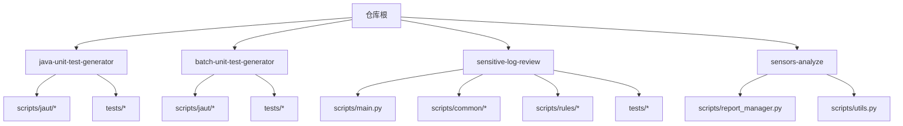
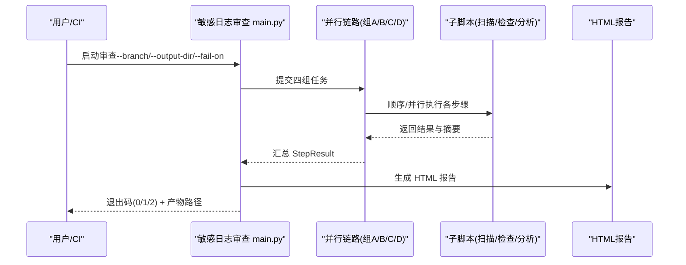
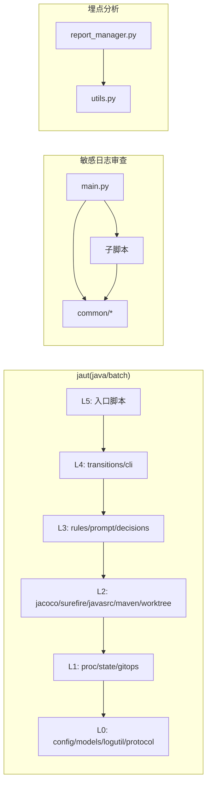

# Python API 参考

<cite>
**本文引用的文件**
- [README.md](file://README.md)
- [AGENTS.md](file://AGENTS.md)
- [CLAUDE.md](file://CLAUDE.md)
- [SKILL.md](file://sensitive-log-review/SKILL.md)
- [main.py](file://sensitive-log-review/scripts/main.py)
- [errors.py](file://sensitive-log-review/scripts/common/errors.py)
- [report_manager.py](file://sensors-analyze/scripts/report_manager.py)
- [utils.py](file://sensors-analyze/scripts/utils.py)
- [__init__.py（java-unit-test-generator）](file://java-unit-test-generator/scripts/jaut/__init__.py)
- [cli.py（java-unit-test-generator）](file://java-unit-test-generator/scripts/jaut/cli.py)
- [models.py（java-unit-test-generator）](file://java-unit-test-generator/scripts/jaut/models.py)
- [javasrc.py（java-unit-test-generator）](file://java-unit-test-generator/scripts/jaut/javasrc.py)
- [__init__.py（batch-unit-test-generator）](file://batch-unit-test-generator/scripts/jaut/__init__.py)
- [cli.py（batch-unit-test-generator）](file://batch-unit-test-generator/scripts/jaut/cli.py)
- [models.py（batch-unit-test-generator）](file://batch-unit-test-generator/scripts/jaut/models.py)
- [javasrc.py（batch-unit-test-generator）](file://batch-unit-test-generator/scripts/jaut/javasrc.py)
</cite>

## 目录
1. [简介](#简介)
2. [项目结构](#项目结构)
3. [核心组件](#核心组件)
4. [架构总览](#架构总览)
5. [详细组件分析](#详细组件分析)
6. [依赖关系分析](#依赖关系分析)
7. [性能与并发](#性能与并发)
8. [故障排查指南](#故障排查指南)
9. [结论](#结论)
10. [附录：API 参考速查](#附录api-参考速查)

## 简介
本仓库包含四个独立的“技能”（agent skills），每个技能自包含脚本、规则与测试，安装到目标项目中运行。它们分别用于：
- Java 单元测试生成（单类/批量）
- 敏感信息日志审查（Java 变更审计 + HTML 报告）
- 埋点分析（sensors.csv 归档与差异比对）

所有脚本遵循“仅标准库”约束（测试阶段除外），并通过统一的退出码契约与协议块进行编排。

**章节来源**
- [AGENTS.md:5-14](file://AGENTS.md#L5-L14)
- [CLAUDE.md:5-14](file://CLAUDE.md#L5-L14)

## 项目结构
仓库按“技能”划分顶层目录，每个技能内部组织为：
- scripts/：Python 驱动脚本与共享模块
- references/ 或 rules/：规则、词典、配置
- protocol/：协议 JSON Schema（部分技能）
- tests/：pytest 用例

**图表来源**
- [AGENTS.md:5-14](file://AGENTS.md#L5-L14)
- [CLAUDE.md:5-14](file://CLAUDE.md#L5-L14)

**章节来源**
- [AGENTS.md:5-14](file://AGENTS.md#L5-L14)
- [CLAUDE.md:5-14](file://CLAUDE.md#L5-L14)

## 核心组件
- 统一 CLI 脚手架（两个单元测试技能共用）：负责参数解析、工作目录解析、日志初始化、异常转协议块、输出 NEXT_STEP 负载并返回退出码。
- 领域模型（dataclass）：覆盖率、方法/类状态、决策产物 Decision、持久化 State、批量计划等。
- 敏感日志审查主流程：四链路并行执行步骤，汇总计数，生成 HTML 报告与环境诊断。
- 埋点报告管理器：CSV 归档、版本差异比对、差异报告输出。

**章节来源**
- [cli.py（java-unit-test-generator）:1-129](file://java-unit-test-generator/scripts/jaut/cli.py#L1-L129)
- [models.py（java-unit-test-generator）:1-499](file://java-unit-test-generator/scripts/jaut/models.py#L1-L499)
- [main.py:1-800](file://sensitive-log-review/scripts/main.py#L1-L800)
- [report_manager.py:1-336](file://sensors-analyze/scripts/report_manager.py#L1-L336)

## 架构总览
整体由“入口脚本 → 子步骤/工具 → 产物/报告”的流水线构成；单元测试技能通过 NEXT_STEP 协议与 LLM/调用方交互，敏感日志审查采用多线程并行链路，埋点分析提供 CSV 归档与差异报告。

**图表来源**
- [main.py:187-298](file://sensitive-log-review/scripts/main.py#L187-L298)
- [main.py:353-505](file://sensitive-log-review/scripts/main.py#L353-L505)

**章节来源**
- [main.py:187-298](file://sensitive-log-review/scripts/main.py#L187-L298)
- [main.py:353-505](file://sensitive-log-review/scripts/main.py#L353-L505)

## 详细组件分析

### 统一 CLI 脚手架（java-unit-test-generator / batch-unit-test-generator）
职责
- 统一参数解析（--workdir / --project-root）
- 工作目录解析与校验
- 日志初始化（失败不影响协议输出）
- 捕获 StepError 与未捕获异常，转换为 Decision 并输出 NEXT_STEP 负载
- 返回进程退出码（对齐 SKILL 约定）

关键接口
- run_cli(script_name, add_arguments, handler, argv=None) -> int
  - 参数：
    - script_name: str，脚本名（不含扩展名）
    - add_arguments: Callable[[ArgumentParser], None]，注册参数
    - handler: Callable[[Namespace], tuple[Decision, EmitContext]]，业务处理
    - argv: Optional[list[str]]，命令行参数
  - 返回：int，退出码
- add_common_args(parser) -> None
- require_workdir(args) -> Path
- resolve_workdir(args) -> Optional[Path]

错误处理
- StepError.state_error(summary, question=None) -> StepError：状态/协议错误（exit 3）
- StepError.exec_error(summary, question=None, artifacts=None) -> StepError：执行错误（exit 2）
- 未捕获异常统一转为 failed + ask_user（exit 2）

使用示例（概念性）
- 在入口脚本中定义 add_arguments(parser) 与 handler(args)，调用 run_cli("your_script", add_arguments, handler) 即可。

**章节来源**
- [cli.py（java-unit-test-generator）:1-129](file://java-unit-test-generator/scripts/jaut/cli.py#L1-L129)
- [cli.py（batch-unit-test-generator）:1-129](file://batch-unit-test-generator/scripts/jaut/cli.py#L1-L129)

### 领域模型（models.py）
类型与职责
- coverage_rate(covered, missed) -> float：行覆盖率计算，抽象/接口方法视为达标
- MethodKey / MethodCoverage / ClassCoverage：方法与类覆盖率跟踪
- TestOutcome / FailedCase / TestResult：surefire 测试结果聚合与判定
- Decision / Route / ResumeOption / NextCommand：决策产物与路由
- State：state.json 的类型化表示，支持 from_dict/to_dict 向后兼容
- BatchClassEntry / BatchState：批量模式下的类级计划与总态

复杂度与行为要点
- is_green() 采用 fail-closed 策略：报告缺失/不可解析/清理失败/存在失败用例均视为不绿
- failure_count_for_trajectory() 保证 errors-only 轮也计入连续失败计数
- State.from_dict() 对旧格式字段（如 git_baseline list）做兼容转换

**章节来源**
- [models.py（java-unit-test-generator）:1-499](file://java-unit-test-generator/scripts/jaut/models.py#L1-L499)
- [models.py（batch-unit-test-generator）:1-693](file://batch-unit-test-generator/scripts/jaut/models.py#L1-L693)

### Java 源码解析（javasrc.py）
关键函数
- private_method_names(source, stripped=None) -> set[str]
  - 输入：source: str（Java 源码），stripped: Optional[str]（可选，已剥离注释和字符串的文本）
  - 输出：set[str]，本类 private 方法声明名集合
  - 说明：在净化文本上扫描，排除字符串/注释中的伪声明、字段初始化式与 new 构造调用点
- extract_with_helpers(source, method_name, arity=None) -> tuple[list[str], list[str]]
  - 输入：source: str，method_name: str，arity: Optional[int]
  - 输出：(主方法源码块列表, 被调用的本类 private 方法源码块列表)

注意
- 该模块位于 L2（解析构建层），供上层编排调用，避免重复剥离文本以提升性能。

**章节来源**
- [javasrc.py（java-unit-test-generator）:247-271](file://java-unit-test-generator/scripts/jaut/javasrc.py#L247-L271)
- [javasrc.py（batch-unit-test-generator）:247-271](file://batch-unit-test-generator/scripts/jaut/javasrc.py#L247-L271)

### 敏感日志审查（main.py）
入口与参数
- main() -> int：主流程，解析参数、准备环境、执行四链路、汇总计数、生成报告
- parse_arguments() -> Namespace：参数定义
  - --branch, --root, --output-dir, --run-id, --fail-on, --changed-only/--full-scan, --strict-mode, --doctor, -v/--verbose

并行链路
- group_a: 步骤1 扫描日志输出 → 步骤2 检查变更文件日志
- group_b: 步骤3 @ToString 注解检查
- group_c: 步骤4 提取 Java 字段 → 步骤5 检查敏感词
- group_d: 步骤6 POJO 注释检查 → 步骤7 深度敏感性分析

报告生成
- generate_html_report(ctx, counts, gate_triggered, duration, failed_lines=None) -> StepResult
  - 读取中间产物，渲染 HTML，写入报告文件

环境诊断
- run_doctor(args) -> int：逐项检查运行环境（Python/java/git/jar/规则/词典/输出目录），全部通过返回 0，任一失败返回 2

退出码契约
- 0：通过（--fail-on 指定项均为 0）
- 1：触发门禁（--fail-on 任一 > 0）
- 2：执行错误（关键步骤失败或环境/参数问题）

**章节来源**
- [main.py:1-800](file://sensitive-log-review/scripts/main.py#L1-L800)

### 埋点报告管理器（report_manager.py）
职责
- 将 sensors.csv 归档为带时间戳的文件
- 查找上一次归档的 CSV，比对差异（新增/删除/修改）
- 输出差异报告，必要时提示人工复核

关键接口
- load_csv_rows(csv_path) -> list[dict]
- diff_csv(old_rows, new_rows) -> dict{added, deleted, modified}
- write_diff_report(diff, out_path) -> list[str]
- main() -> int：CLI 入口，支持 --csv, --reports-dir, --diff-only, --log, --out

退出码
- 0：成功（无差异或首次归档）
- 1：执行异常
- 2：存在差异需人工复核

**章节来源**
- [report_manager.py:1-336](file://sensors-analyze/scripts/report_manager.py#L1-L336)

### 共享工具（utils.py）
- setup_logging(name, log_path) -> Logger：配置日志文件，重定向 stderr，失败时回退
- next_step(msg) -> None：唯一 stdout 输出（供调用方解析）
- original_stderr()：获取原始 stderr（日志文件打开失败时的回退通道）
- check_rg_available() -> bool：检测 ripgrep 是否可用

**章节来源**
- [utils.py:1-51](file://sensors-analyze/scripts/utils.py#L1-L51)

## 依赖关系分析
分层与单向依赖
- java/batch 单元测试技能 jaut 包：
  - L0 基础：config, models, logutil, protocol
  - L1 基础设施：proc, state, gitops
  - L2 解析构建：jacoco, surefire, javasrc, maven, worktree
  - L3 领域：rules, prompt, decisions
  - L4 编排：transitions, cli
  - L5 入口：scripts/ 下瘦 CLI 脚本
- 敏感日志审查：main.py 编排多个子脚本，common/ 提供共享能力（paths, dictionary, errors, failures, git_utils, pojo_config, java_lexer）
- 埋点分析：report_manager.py 依赖 utils.py

**图表来源**
- [__init__.py（java-unit-test-generator）:1-23](file://java-unit-test-generator/scripts/jaut/__init__.py#L1-L23)
- [__init__.py（batch-unit-test-generator）:1-23](file://batch-unit-test-generator/scripts/jaut/__init__.py#L1-L23)
- [main.py:41-75](file://sensitive-log-review/scripts/main.py#L41-L75)

**章节来源**
- [__init__.py（java-unit-test-generator）:1-23](file://java-unit-test-generator/scripts/jaut/__init__.py#L1-L23)
- [__init__.py（batch-unit-test-generator）:1-23](file://batch-unit-test-generator/scripts/jaut/__init__.py#L1-L23)
- [main.py:41-75](file://sensitive-log-review/scripts/main.py#L41-L75)

## 性能与并发
- 敏感日志审查采用 ThreadPoolExecutor 并行执行四条链路，目标全流程 <60s。
- 变更文件清单缓存与增量扫描减少 I/O 与解析开销。
- Java 源码解析复用净化文本避免重复剥离，降低 CPU 消耗。
- 报告差异比对基于全列签名与 Counter 计数，正确处理重复行与同调用点多行场景。

建议
- CI 中使用 --run-id 隔离并行输出目录，避免竞争写。
- 大仓库优先使用 --changed-only，减少扫描范围。
- 合理设置 --fail-on 以控制门禁强度，避免误报过多导致频繁中断。

**章节来源**
- [main.py:777-786](file://sensitive-log-review/scripts/main.py#L777-L786)
- [javasrc.py（java-unit-test-generator）:247-271](file://java-unit-test-generator/scripts/jaut/javasrc.py#L247-L271)
- [report_manager.py:103-166](file://sensors-analyze/scripts/report_manager.py#L103-L166)

## 故障排查指南
结构化错误码（敏感日志审查）
- E001：非 git 仓库
- E002：找不到 java
- E003：分支名非法或不存在
- E004：规则 JSON 损坏
- E005：run-id 非法字符
- E006：输出目录不可写
- E007：checkstyle jar SHA256 校验不符

常见定位
- 使用 --doctor 快速检查运行环境与依赖完整性
- 查看输出目录中的失败文件清单与 HTML 报告
- 检查规则与词典文件的版本头与内容完整性

**章节来源**
- [errors.py:18-100](file://sensitive-log-review/scripts/common/errors.py#L18-L100)
- [main.py:582-702](file://sensitive-log-review/scripts/main.py#L582-L702)

## 结论
本仓库提供了面向 Java 工程的多套自动化能力：单元测试生成、敏感信息日志审查与埋点分析。通过统一的 CLI 脚手架、类型化领域模型、严格的退出码契约与协议块，实现了可编排、可恢复、可观测的工作流。建议在 CI 中结合 --changed-only、--fail-on 与 --run-id 实现高效且稳定的质量门禁。

## 附录：API 参考速查

### 统一 CLI（jaut）
- run_cli(script_name, add_arguments, handler, argv=None) -> int
  - 参数：script_name: str; add_arguments: Callable[[ArgumentParser], None]; handler: Callable[[Namespace], tuple[Decision, EmitContext]]; argv: Optional[list[str]]
  - 返回：int（退出码）
- add_common_args(parser) -> None
- require_workdir(args) -> Path
- resolve_workdir(args) -> Optional[Path]

### 领域模型（models）
- coverage_rate(covered: int, missed: int) -> float
- Decision(status: str, exit_code: int, summary: str, route: Route, reason: str, ...)
- State(...): to_dict() -> dict; from_dict(data: dict) -> State
- BatchState(...): to_dict() -> dict; from_dict(data: dict) -> BatchState

### 源码解析（javasrc）
- private_method_names(source: str, stripped: Optional[str] = None) -> set[str]
- extract_with_helpers(source: str, method_name: str, arity: Optional[int] = None) -> tuple[list[str], list[str]]

### 敏感日志审查（main）
- main() -> int
- parse_arguments() -> argparse.Namespace
- generate_html_report(ctx, counts, gate_triggered, duration, failed_lines=None) -> StepResult
- run_doctor(args) -> int

### 埋点报告（report_manager）
- load_csv_rows(csv_path: Path) -> list[dict]
- diff_csv(old_rows: list[dict], new_rows: list[dict]) -> dict
- write_diff_report(diff: dict, out_path: Path) -> list[str]
- main() -> int

### 工具（utils）
- setup_logging(name: str, log_path: Path) -> logging.Logger
- next_step(msg: str) -> None
- original_stderr()
- check_rg_available() -> bool

**章节来源**
- [cli.py（java-unit-test-generator）:1-129](file://java-unit-test-generator/scripts/jaut/cli.py#L1-L129)
- [models.py（java-unit-test-generator）:1-499](file://java-unit-test-generator/scripts/jaut/models.py#L1-L499)
- [javasrc.py（java-unit-test-generator）:247-271](file://java-unit-test-generator/scripts/jaut/javasrc.py#L247-L271)
- [main.py:1-800](file://sensitive-log-review/scripts/main.py#L1-L800)
- [report_manager.py:1-336](file://sensors-analyze/scripts/report_manager.py#L1-L336)
- [utils.py:1-51](file://sensors-analyze/scripts/utils.py#L1-L51)