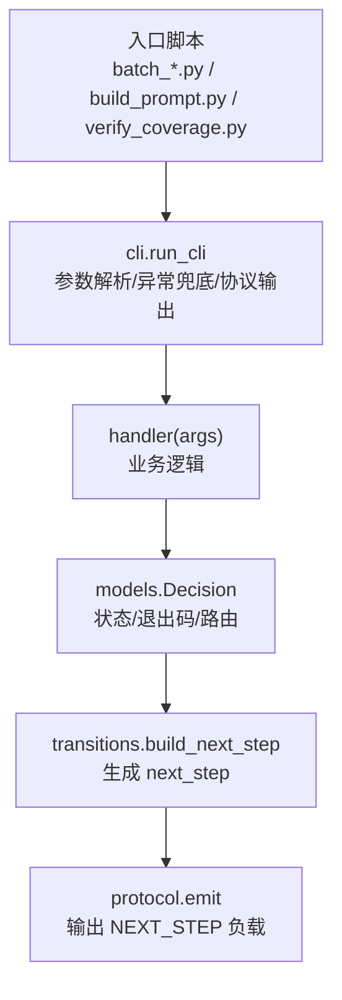
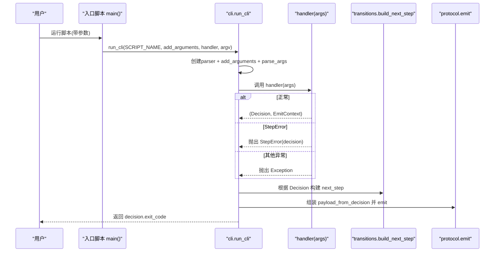
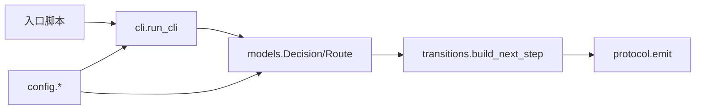

# 命令行接口

<cite>
**本文引用的文件**
- [batch-unit-test-generator/scripts/jaut/cli.py](file://batch-unit-test-generator/scripts/jaut/cli.py)
- [batch-unit-test-generator/scripts/batch_diff.py](file://batch-unit-test-generator/scripts/batch_diff.py)
- [batch-unit-test-generator/scripts/batch_init.py](file://batch-unit-test-generator/scripts/batch_init.py)
- [batch-unit-test-generator/scripts/batch_next.py](file://batch-unit-test-generator/scripts/batch_next.py)
- [batch-unit-test-generator/scripts/batch_finish.py](file://batch-unit-test-generator/scripts/batch_finish.py)
- [batch-unit-test-generator/scripts/build_prompt.py](file://batch-unit-test-generator/scripts/build_prompt.py)
- [batch-unit-test-generator/scripts/verify_coverage.py](file://batch-unit-test-generator/scripts/verify_coverage.py)
- [batch-unit-test-generator/scripts/jaut/config.py](file://batch-unit-test-generator/scripts/jaut/config.py)
- [batch-unit-test-generator/scripts/jaut/models.py](file://batch-unit-test-generator/scripts/jaut/models.py)
- [batch-unit-test-generator/scripts/jaut/protocol.py](file://batch-unit-test-generator/scripts/jaut/protocol.py)
</cite>

## 目录
1. [简介](#简介)
2. [项目结构](#项目结构)
3. [核心组件](#核心组件)
4. [架构总览](#架构总览)
5. [详细命令与参数说明](#详细命令与参数说明)
6. [依赖分析](#依赖分析)
7. [性能与执行特性](#性能与执行特性)
8. [故障排除指南](#故障排除指南)
9. [结论](#结论)
10. [附录](#附录)

## 简介
本仓库提供一套面向 Java 单元测试覆盖率提升的批量自动化 CLI。所有脚本通过统一的 run_cli 框架进行参数解析、日志初始化、异常兜底、协议输出与退出码管理。用户只需调用 batch_* 系列脚本，即可驱动“差异分析 → 基线构建 → 认领委派 → 迭代验证 → 终验收尾”的完整流程。

## 项目结构
- 统一 CLI 框架位于 jaut/cli.py，封装 argparse、工作目录解析、日志、异常到协议块的转换、next_step 路由与 emit。
- 各入口脚本（batch_diff、batch_init、batch_next、batch_finish、build_prompt、verify_coverage）实现 add_arguments 与 handler，并委托 run_cli 完成统一执行。
- 配置与模型集中在 jaut/config.py 与 jaut/models.py；协议输出在 jaut/protocol.py。

**图表来源**
- [batch-unit-test-generator/scripts/jaut/cli.py:95-128](file://batch-unit-test-generator/scripts/jaut/cli.py#L95-L128)
- [batch-unit-test-generator/scripts/jaut/protocol.py:28-56](file://batch-unit-test-generator/scripts/jaut/protocol.py#L28-L56)

**章节来源**
- [batch-unit-test-generator/scripts/jaut/cli.py:1-129](file://batch-unit-test-generator/scripts/jaut/cli.py#L1-L129)
- [batch-unit-test-generator/scripts/jaut/protocol.py:1-105](file://batch-unit-test-generator/scripts/jaut/protocol.py#L1-L105)

## 核心组件
- run_cli：统一入口，负责创建 parser、调用 add_arguments、解析参数、执行 handler、捕获 StepError 与通用异常、初始化日志、构建 next_step、组装协议负载并输出，返回 exit_code。
- StepError：可预期错误，携带 Decision，用于状态缺失、参数缺失、环境缺失、操作失败等场景。
- EmitContext：emit 阶段所需上下文（workdir、state、scripts_dir）。
- Decision/Route：决策产物与路由枚举，决定 next_step.type 与后续动作。
- config：全局常量与环境变量（如 mvn 超时、阈值、预算、路径模板、退出码等）。
- protocol：NEXT_STEP 协议负载构建与 stdout 输出，含轻量自检。

**章节来源**
- [batch-unit-test-generator/scripts/jaut/cli.py:25-128](file://batch-unit-test-generator/scripts/jaut/cli.py#L25-L128)
- [batch-unit-test-generator/scripts/jaut/config.py:44-109](file://batch-unit-test-generator/scripts/jaut/config.py#L44-L109)
- [batch-unit-test-generator/scripts/jaut/models.py:43-75](file://batch-unit-test-generator/scripts/jaut/models.py#L43-L75)
- [batch-unit-test-generator/scripts/jaut/protocol.py:17-56](file://batch-unit-test-generator/scripts/jaut/protocol.py#L17-L56)

## 架构总览
CLI 执行主流程如下：

**图表来源**
- [batch-unit-test-generator/scripts/jaut/cli.py:95-128](file://batch-unit-test-generator/scripts/jaut/cli.py#L95-L128)
- [batch-unit-test-generator/scripts/jaut/protocol.py:46-105](file://batch-unit-test-generator/scripts/jaut/protocol.py#L46-L105)

## 详细命令与参数说明

### 通用参数
- --workdir：指定工作目录。若未提供，可通过 --project-root 间接定位 workdir。
- --project-root：指定项目根目录。未提供 --workdir 时，将基于 project_root 计算默认 workdir。
- 共享参数注册函数：add_common_args(parser)。

注意：不同脚本对 --project-root 是否必填有不同要求，详见各命令。

**章节来源**
- [batch-unit-test-generator/scripts/jaut/cli.py:63-86](file://batch-unit-test-generator/scripts/jaut/cli.py#L63-L86)

### batch_diff（差异分析）
- 功能：基于 git diff 扫描变更源文件，过滤测试类/接口/枚举/注解及 jacoco 排除项，产出候选类清单，触发 ask_user 确认范围与门槛。
- 前置条件：
  - 存在 git 仓库且可解析目标分支（auto 探测 master/main/develop）。
  - 项目包含 src/main/java 源码。
- 参数：
  - --project-root：必填，项目根目录。
  - --target：目标分支，默认 auto。
  - --diff-mode：差异模式，可选 auto/three/two，默认 auto。
  - --exclude-glob：排除 glob 模式（可重复）。
  - --sort-policy：排序策略，可选 module-coverage/coverage/diff-size，默认 module-coverage。
  - --workdir：可选工作目录。
- 输出：
  - 有候选类：needs_input，route=ask_user，question 展示候选清单与选择方式。
  - 无候选类：success，route=finish。
- 示例：
  - python scripts/batch_diff.py --project-root /path/to/project
  - python scripts/batch_diff.py --project-root /path/to/project --target develop --diff-mode three --exclude-glob "**/dto/**" --sort-policy diff-size

**章节来源**
- [batch-unit-test-generator/scripts/batch_diff.py:283-292](file://batch-unit-test-generator/scripts/batch_diff.py#L283-L292)
- [batch-unit-test-generator/scripts/batch_diff.py:295-442](file://batch-unit-test-generator/scripts/batch_diff.py#L295-L442)

### batch_init（批量基线）
- 功能：读取候选清单，记录 git 基线，一次性 install 与按需 mvn，聚合 jacoco/surefire，为每个确认类生成 state.json 与 batch_state.json，并进入认领委派。
- 前置条件：
  - 存在 batch_candidates.json（由 batch_diff 生成）。
  - 存在 mvn 且可执行。
- 参数：
  - --project-root：必填。
  - --classes：范围 all/top:N/FQCN,...，默认 all。
  - --threshold：覆盖率门槛，默认 80.0。
  - --target：目标分支，默认 auto。
  - --coverage-exclude：覆盖率排除模式（可重复）。
  - --jacoco-version：JaCoCo 版本，默认 0.8.12。
  - --workdir：可选工作目录。
- 输出：
  - 成功：success，route=batch_next，附带 mvn.log 与 batch_state.json 作为 artifacts。
  - 无待补类：success，route=finish。
  - 环境/执行失败：failed，route=ask_user，exit_code=2。
- 示例：
  - python scripts/batch_init.py --project-root /path/to/project --classes top:10 --threshold 85 --jacoco-version 0.8.12

**章节来源**
- [batch-unit-test-generator/scripts/batch_init.py:50-59](file://batch-unit-test-generator/scripts/batch_init.py#L50-L59)
- [batch-unit-test-generator/scripts/batch_init.py:62-318](file://batch-unit-test-generator/scripts/batch_init.py#L62-L318)

### batch_next（认领委派）
- 功能：从 batch_state.json 中认领下一个 pending/recheck 类，标记 in_progress，输出 write_code 型委派指令，子代理据此从 make_plan 开始类内迭代。
- 前置条件：
  - 存在 batch_state.json。
- 参数：
  - --project-root：必填。
  - --reset-claim：复位指定类的 in_progress 为 pending。
  - --workdir：可选工作目录。
- 输出：
  - 有待认领类：needs_input，route=ask_user，question 包含子代理委派要件与 make_plan 命令。
  - 无待认领类：success，route=batch_finish。
- 示例：
  - python scripts/batch_next.py --project-root /path/to/project
  - python scripts/batch_next.py --project-root /path/to/project --reset-claim com.example.Foo

**章节来源**
- [batch-unit-test-generator/scripts/batch_next.py:46-50](file://batch-unit-test-generator/scripts/batch_next.py#L46-L50)
- [batch-unit-test-generator/scripts/batch_next.py:53-159](file://batch-unit-test-generator/scripts/batch_next.py#L53-L159)

### build_prompt（提示词构建）
- 功能：读取当前方法的 state，组装 LLM 编写测试所需的提示词，输出 write_code 决策。
- 前置条件：
  - 通过 --workdir 或 --project-root 定位 workdir。
  - state.json 存在且 current_method 已设置。
- 参数：
  - --workdir 或 --project-root：二选一。
- 输出：
  - success，route=write_code，instructions 为完整提示词，artifacts 包含测试类文件路径。
- 示例：
  - python scripts/build_prompt.py --workdir /path/to/workdir
  - python scripts/build_prompt.py --project-root /path/to/project

**章节来源**
- [batch-unit-test-generator/scripts/build_prompt.py:42-44](file://batch-unit-test-generator/scripts/build_prompt.py#L42-L44)
- [batch-unit-test-generator/scripts/build_prompt.py:47-87](file://batch-unit-test-generator/scripts/build_prompt.py#L47-L87)

### verify_coverage（覆盖率验证）
- 功能：定向复跑测试并采集覆盖率，解析 surefire 与 jacoco，记录本轮观测，依据规则判定下一步（make_plan/build_prompt/ask_user）。
- 前置条件：
  - 通过 --workdir 或 --project-root 定位 workdir。
  - state.json 存在且 current_method 已设置。
  - 存在 mvn 与 JaCoCo 报告。
- 参数：
  - --workdir 或 --project-root：二选一。
- 输出：
  - 达标：success，route=make_plan。
  - 未达标：success，route=build_prompt。
  - 升级/环境问题：needs_input/failed，route=ask_user，exit_code=2。
- 示例：
  - python scripts/verify_coverage.py --workdir /path/to/workdir

**章节来源**
- [batch-unit-test-generator/scripts/verify_coverage.py:53-55](file://batch-unit-test-generator/scripts/verify_coverage.py#L53-L55)
- [batch-unit-test-generator/scripts/verify_coverage.py:58-200](file://batch-unit-test-generator/scripts/verify_coverage.py#L58-L200)

### batch_finish（批量终验）
- 功能：对所有非 skipped 类进行一次全量 mvn，聚合 jacoco/surefire，刷新覆盖率与测试结果，达标则 done，否则 recheck 重新入队；全部通过后输出最终报告。
- 前置条件：
  - 存在 batch_state.json。
- 参数：
  - --project-root：必填。
  - --skip-mvn：跳过 mvn（用于测试）。
  - --workdir：可选工作目录。
- 输出：
  - 有 recheck：success，route=batch_next。
  - 全部通过：success，route=finish，携带批量最终报告。
- 示例：
  - python scripts/batch_finish.py --project-root /path/to/project
  - python scripts/batch_finish.py --project-root /path/to/project --skip-mvn

**章节来源**
- [batch-unit-test-generator/scripts/batch_finish.py:43-47](file://batch-unit-test-generator/scripts/batch_finish.py#L43-L47)
- [batch-unit-test-generator/scripts/batch_finish.py:50-198](file://batch-unit-test-generator/scripts/batch_finish.py#L50-L198)

## 依赖分析
- 入口脚本均依赖 jaut.cli.run_cli 统一执行；业务逻辑通过 models.Decision 与 Route 表达意图；transitions 将 route 映射为 next_step；protocol 负责协议负载输出。
- 配置集中于 jaut/config.py，包括退出码、阈值、预算、mvn 超时、路径模板等。
- 数据模型集中于 jaut/models.py，包括 MethodCoverage、ClassCoverage、State、BatchState 等。

**图表来源**
- [batch-unit-test-generator/scripts/jaut/cli.py:95-128](file://batch-unit-test-generator/scripts/jaut/cli.py#L95-L128)
- [batch-unit-test-generator/scripts/jaut/models.py:43-75](file://batch-unit-test-generator/scripts/jaut/models.py#L43-L75)
- [batch-unit-test-generator/scripts/jaut/config.py:44-109](file://batch-unit-test-generator/scripts/jaut/config.py#L44-L109)
- [batch-unit-test-generator/scripts/jaut/protocol.py:46-105](file://batch-unit-test-generator/scripts/jaut/protocol.py#L46-L105)

**章节来源**
- [batch-unit-test-generator/scripts/jaut/models.py:35-75](file://batch-unit-test-generator/scripts/jaut/models.py#L35-L75)
- [batch-unit-test-generator/scripts/jaut/config.py:14-31](file://batch-unit-test-generator/scripts/jaut/config.py#L14-L31)

## 性能与执行特性
- mvn 超时：可通过环境变量 JAVA_UT_MVN_TIMEOUT 覆盖，默认 1800 秒；非法值回退默认。
- 进度报告：mvn 执行期间按间隔输出进度，防止主 Agent 误判进程无响应。
- 清理与聚合：init/verify/finish 阶段会清理旧报告并聚合多模块 jacoco/surefire，减少冗余 I/O。
- 大类拆分：当 pending 方法数或 diff 行数超过阈值时自动分组处理，降低单次任务复杂度。

**章节来源**
- [batch-unit-test-generator/scripts/jaut/config.py:83-97](file://batch-unit-test-generator/scripts/jaut/config.py#L83-L97)
- [batch-unit-test-generator/scripts/jaut/config.py:147-168](file://batch-unit-test-generator/scripts/jaut/config.py#L147-L168)

## 故障排除指南
- 退出码含义：
  - 0：脚本正常完成。
  - 1：需要继续处理（未达标等正常流转）。
  - 2：脚本执行错误（mvn 失败/环境缺失/内部错误）。
  - 3：状态/协议错误（state 缺失/参数缺失）。
- 常见问题：
  - 缺少 --workdir 或 --project-root：使用 require_workdir 校验，缺失将抛状态错误（exit 3）。
  - 无法确定目标分支：batch_diff 自动探测失败时需显式指定 --target。
  - mvn 未找到：需安装 mvn 或加入 PATH。
  - 覆盖率报告缺失：verify_coverage 阶段检查 jacoco XML 是否存在。
  - 编译失败：verify_coverage 检测到编译错误将路由到 write_code 自愈，并在 instructions 中列出错误摘要。
- 日志与工件：
  - 各阶段会生成 mvn.log、surefire-reports、batch_state.json 等工件，便于排查。
  - 协议块序列化失败时会输出最小错误协议，避免调用方无限等待。

**章节来源**
- [batch-unit-test-generator/scripts/jaut/config.py:44-48](file://batch-unit-test-generator/scripts/jaut/config.py#L44-L48)
- [batch-unit-test-generator/scripts/jaut/cli.py:80-92](file://batch-unit-test-generator/scripts/jaut/cli.py#L80-L92)
- [batch-unit-test-generator/scripts/batch_diff.py:295-310](file://batch-unit-test-generator/scripts/batch_diff.py#L295-L310)
- [batch-unit-test-generator/scripts/verify_coverage.py:100-149](file://batch-unit-test-generator/scripts/verify_coverage.py#L100-L149)
- [batch-unit-test-generator/scripts/jaut/protocol.py:74-105](file://batch-unit-test-generator/scripts/jaut/protocol.py#L74-L105)

## 结论
本 CLI 以 run_cli 为核心，将参数解析、日志、异常、协议输出与退出码统一管理，使各脚本专注于业务逻辑。通过 batch_diff/init/next/finish 与 build_prompt/verify_coverage 的组合，形成完整的“差异分析 → 基线构建 → 认领委派 → 迭代验证 → 终验收尾”闭环，支持批量与单类两种模式，具备完善的错误处理与可观测性。

## 附录

### run_cli 框架使用方法
- 入口脚本需提供：
  - add_arguments(parser)：注册脚本专属参数。
  - handler(args)：实现业务逻辑，返回 (Decision, EmitContext)。
- 常见模式：
  - 使用 add_common_args(parser) 添加 --workdir/--project-root。
  - 使用 require_workdir(args) 校验 workdir 存在。
  - 通过 StepError.state_error/exec_error 抛出可预期错误。
  - 通过 Decision(route, status, exit_code, summary, reason, artifacts, metrics) 表达意图。
  - 通过 EmitContext(workdir, state, scripts_dir) 传递 emit 上下文。

**章节来源**
- [batch-unit-test-generator/scripts/jaut/cli.py:63-128](file://batch-unit-test-generator/scripts/jaut/cli.py#L63-L128)
- [batch-unit-test-generator/scripts/build_prompt.py:42-87](file://batch-unit-test-generator/scripts/build_prompt.py#L42-L87)
- [batch-unit-test-generator/scripts/verify_coverage.py:53-87](file://batch-unit-test-generator/scripts/verify_coverage.py#L53-L87)

### 环境变量与默认值
- JAVA_UT_MVN_TIMEOUT：mvn 超时秒数，默认 1800。
- JAVA_UT_BATCH_CLASS_ROUND_BUDGET：类级总预算轮数，默认 30。
- DEFAULT_THRESHOLD：覆盖率门槛，默认 80.0。
- DEFAULT_JACOCO_VERSION：JaCoCo 版本，默认 0.8.12。
- 其他路径与协议常量见 config.py。

**章节来源**
- [batch-unit-test-generator/scripts/jaut/config.py:53-109](file://batch-unit-test-generator/scripts/jaut/config.py#L53-L109)
- [batch-unit-test-generator/scripts/jaut/config.py:147-168](file://batch-unit-test-generator/scripts/jaut/config.py#L147-L168)

### 配置文件与状态文件
- state.json：单个类的状态与覆盖率历史，字段由 State 定义。
- batch_state.json：批量计划总态，字段由 BatchState 定义。
- 参考 schema：protocol/next-step.schema.json 与 protocol/state.schema.json。

**章节来源**
- [batch-unit-test-generator/scripts/jaut/models.py:353-517](file://batch-unit-test-generator/scripts/jaut/models.py#L353-L517)
- [batch-unit-test-generator/scripts/jaut/models.py:635-693](file://batch-unit-test-generator/scripts/jaut/models.py#L635-L693)