# 工具模块

<cite>
**本文引用的文件**
- [sensitive-log-review/scripts/common/__init__.py](file://sensitive-log-review/scripts/common/__init__.py)
- [sensitive-log-review/scripts/common/text.py](file://sensitive-log-review/scripts/common/text.py)
- [sensitive-log-review/scripts/common/paths.py](file://sensitive-log-review/scripts/common/paths.py)
- [sensitive-log-review/scripts/common/errors.py](file://sensitive-log-review/scripts/common/errors.py)
- [sensitive-log-review/scripts/common/git_utils.py](file://sensitive-log-review/scripts/common/git_utils.py)
- [sensitive-log-review/scripts/common/java_lexer.py](file://sensitive-log-review/scripts/common/java_lexer.py)
- [sensitive-log-review/scripts/common/dictionary.py](file://sensitive-log-review/scripts/common/dictionary.py)
- [sensitive-log-review/scripts/common/pojo_config.py](file://sensitive-log-review/scripts/common/pojo_config.py)
- [batch-unit-test-generator/scripts/jaut/logutil.py](file://batch-unit-test-generator/scripts/jaut/logutil.py)
- [batch-unit-test-generator/scripts/jaut/config.py](file://batch-unit-test-generator/scripts/jaut/config.py)
- [batch-unit-test-generator/scripts/jaut/proc.py](file://batch-unit-test-generator/scripts/jaut/proc.py)
- [batch-unit-test-generator/scripts/jaut/worktree.py](file://batch-unit-test-generator/scripts/jaut/worktree.py)
- [sensors-analyze/scripts/utils.py](file://sensors-analyze/scripts/utils.py)
</cite>

## 目录
1. [简介](#简介)
2. [项目结构](#项目结构)
3. [核心组件](#核心组件)
4. [架构总览](#架构总览)
5. [详细组件分析](#详细组件分析)
6. [依赖关系分析](#依赖关系分析)
7. [性能考虑](#性能考虑)
8. [故障排查指南](#故障排查指南)
9. [结论](#结论)
10. [附录：API 速查与最佳实践](#附录api-速查与最佳实践)

## 简介
本文档面向“工具模块”的 API 与使用，覆盖跨脚本共享的通用能力：文本处理、文件与路径管理、日志记录、子进程执行、Git 操作封装、Java 词法分析、词典加载与分类、POJO 配置解析等。文档同时给出设计原则、扩展点、兼容性考量（跨平台、编码、资源管理）、性能优化建议与常见陷阱规避，并提供具体调用示例与最佳实践。

## 项目结构
仓库包含多个独立工具域，其中与“工具模块”最相关的代码集中在以下三个位置：
- sensitive-log-review/scripts/common：统一公共能力（路径、文本、错误、Git、Java 词法、词典、POJO 配置）
- batch-unit-test-generator/scripts/jaut：测试生成流程中的工具（日志、配置、子进程、worktree）
- sensors-analyze/scripts/utils：轻量级日志与 next_step 输出工具

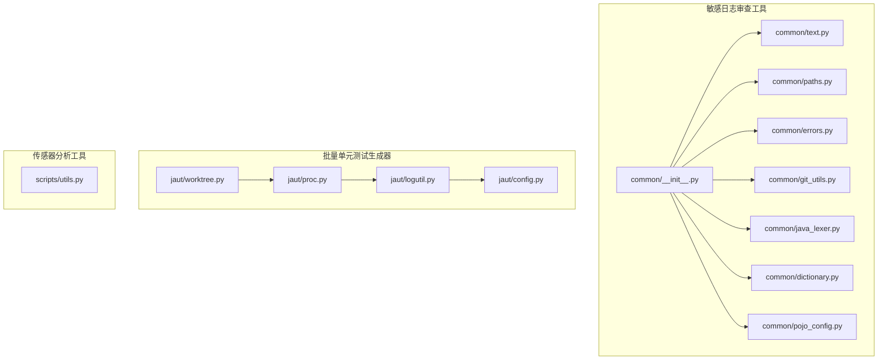

图表来源
- [sensitive-log-review/scripts/common/__init__.py:1-11](file://sensitive-log-review/scripts/common/__init__.py#L1-L11)
- [batch-unit-test-generator/scripts/jaut/logutil.py:1-76](file://batch-unit-test-generator/scripts/jaut/logutil.py#L1-L76)
- [batch-unit-test-generator/scripts/jaut/config.py:1-181](file://batch-unit-test-generator/scripts/jaut/config.py#L1-L181)
- [batch-unit-test-generator/scripts/jaut/proc.py:1-347](file://batch-unit-test-generator/scripts/jaut/proc.py#L1-L347)
- [batch-unit-test-generator/scripts/jaut/worktree.py:1-333](file://batch-unit-test-generator/scripts/jaut/worktree.py#L1-L333)

章节来源
- [sensitive-log-review/scripts/common/__init__.py:1-11](file://sensitive-log-review/scripts/common/__init__.py#L1-L11)

## 核心组件
- 文本处理：字段名拆分、路径规范化、清单行解析
- 路径与产物：跨平台输出目录解析、产物文件名集中定义、run-id 隔离
- 错误处理：结构化错误码与修复建议模板、统一 stderr 输出
- Git 工具：安全分支名校验、变更文件/新增行提取、缓存与线程安全
- Java 词法：注释/字面量屏蔽、字段/类迭代、注解提取与校验
- 词典系统：分层加载、mtime 缓存、敏感级别判定
- POJO 配置：唯一解析器、POJO 文件判定、扫描入口
- 日志系统：按脚本隔离的文件日志、next_step 协议输出、stderr 回退
- 子进程执行：命令执行、超时与两段式终止、流式日志、进度报告
- Worktree：容器化工作树创建、清理、冲突检测与基线重置

章节来源
- [sensitive-log-review/scripts/common/text.py:1-95](file://sensitive-log-review/scripts/common/text.py#L1-L95)
- [sensitive-log-review/scripts/common/paths.py:1-69](file://sensitive-log-review/scripts/common/paths.py#L1-L69)
- [sensitive-log-review/scripts/common/errors.py:1-100](file://sensitive-log-review/scripts/common/errors.py#L1-L100)
- [sensitive-log-review/scripts/common/git_utils.py:1-124](file://sensitive-log-review/scripts/common/git_utils.py#L1-L124)
- [sensitive-log-review/scripts/common/java_lexer.py:1-654](file://sensitive-log-review/scripts/common/java_lexer.py#L1-L654)
- [sensitive-log-review/scripts/common/dictionary.py:1-143](file://sensitive-log-review/scripts/common/dictionary.py#L1-L143)
- [sensitive-log-review/scripts/common/pojo_config.py:1-127](file://sensitive-log-review/scripts/common/pojo_config.py#L1-L127)
- [batch-unit-test-generator/scripts/jaut/logutil.py:1-76](file://batch-unit-test-generator/scripts/jaut/logutil.py#L1-L76)
- [batch-unit-test-generator/scripts/jaut/config.py:1-181](file://batch-unit-test-generator/scripts/jaut/config.py#L1-L181)
- [batch-unit-test-generator/scripts/jaut/proc.py:1-347](file://batch-unit-test-generator/scripts/jaut/proc.py#L1-L347)
- [batch-unit-test-generator/scripts/jaut/worktree.py:1-333](file://batch-unit-test-generator/scripts/jaut/worktree.py#L1-L333)
- [sensors-analyze/scripts/utils.py:1-51](file://sensors-analyze/scripts/utils.py#L1-L51)

## 架构总览
工具模块围绕“可复用、可测试、可观测”的原则组织：
- 输入与配置：CLI 参数、环境变量、配置文件（pojo.config、词典文件）
- 处理管线：文本/路径/字典/Java 词法/Git/子进程/Worktree
- 输出与协议：产物清单、HTML 报告、next_step 协议块、结构化日志
- 错误与诊断：统一错误码、stderr 输出、进度文件、超时与终止策略

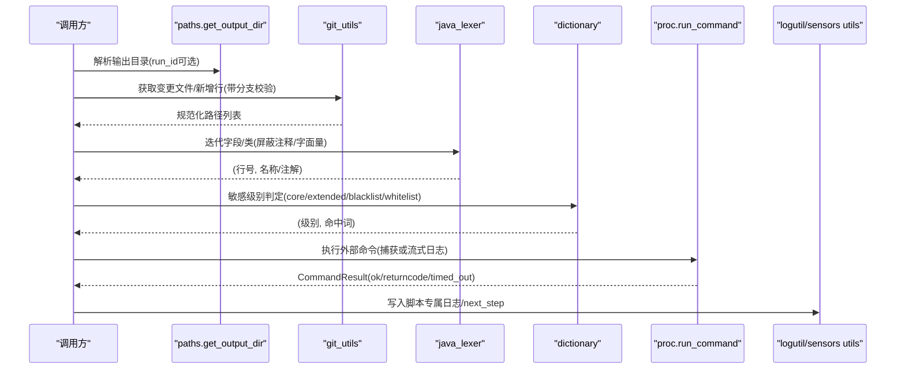

图表来源
- [sensitive-log-review/scripts/common/paths.py:44-69](file://sensitive-log-review/scripts/common/paths.py#L44-L69)
- [sensitive-log-review/scripts/common/git_utils.py:26-124](file://sensitive-log-review/scripts/common/git_utils.py#L26-L124)
- [sensitive-log-review/scripts/common/java_lexer.py:180-654](file://sensitive-log-review/scripts/common/java_lexer.py#L180-L654)
- [sensitive-log-review/scripts/common/dictionary.py:80-143](file://sensitive-log-review/scripts/common/dictionary.py#L80-L143)
- [batch-unit-test-generator/scripts/jaut/proc.py:151-347](file://batch-unit-test-generator/scripts/jaut/proc.py#L151-L347)
- [batch-unit-test-generator/scripts/jaut/logutil.py:24-76](file://batch-unit-test-generator/scripts/jaut/logutil.py#L24-L76)
- [sensors-analyze/scripts/utils.py:16-51](file://sensors-analyze/scripts/utils.py#L16-L51)

## 详细组件分析

### 文本处理（text.py）
- 字段名拆分：支持下划线、数字、驼峰命名拆分，返回小写单词列表
- 路径规范化：处理 git 输出的连续双点情况；统一反斜杠为正斜杠用于匹配
- 清单行解析：兼容新旧格式，返回路径、行号、标签、内容

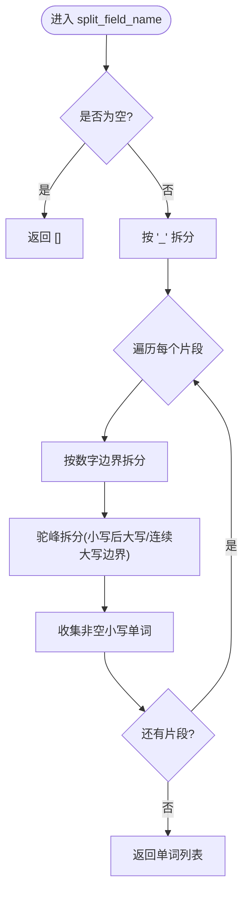

图表来源
- [sensitive-log-review/scripts/common/text.py:13-43](file://sensitive-log-review/scripts/common/text.py#L13-L43)

章节来源
- [sensitive-log-review/scripts/common/text.py:1-95](file://sensitive-log-review/scripts/common/text.py#L1-L95)

### 路径与产物管理（paths.py）
- 输出目录优先级：CLI > 环境变量 SLR_OUTPUT_DIR > 系统临时目录下的 sensitive-log-review
- run-id 隔离：仅允许安全字符集，防止路径穿越
- 产物文件名集中定义：消除散布字面量，便于下游兼容

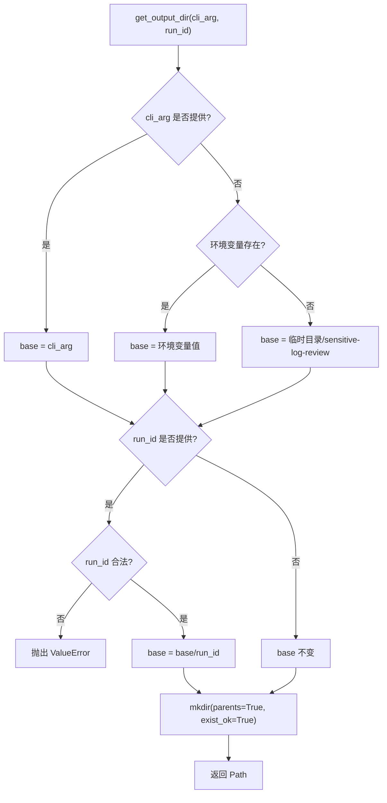

图表来源
- [sensitive-log-review/scripts/common/paths.py:44-69](file://sensitive-log-review/scripts/common/paths.py#L44-L69)

章节来源
- [sensitive-log-review/scripts/common/paths.py:1-69](file://sensitive-log-review/scripts/common/paths.py#L1-L69)

### 错误处理（errors.py）
- 错误码枚举：E001-E007，涵盖环境/参数/依赖问题
- 格式化输出：标题 + 位置 + 详情 + 分步修复建议
- 统一 stderr 输出：不改变既有退出码契约

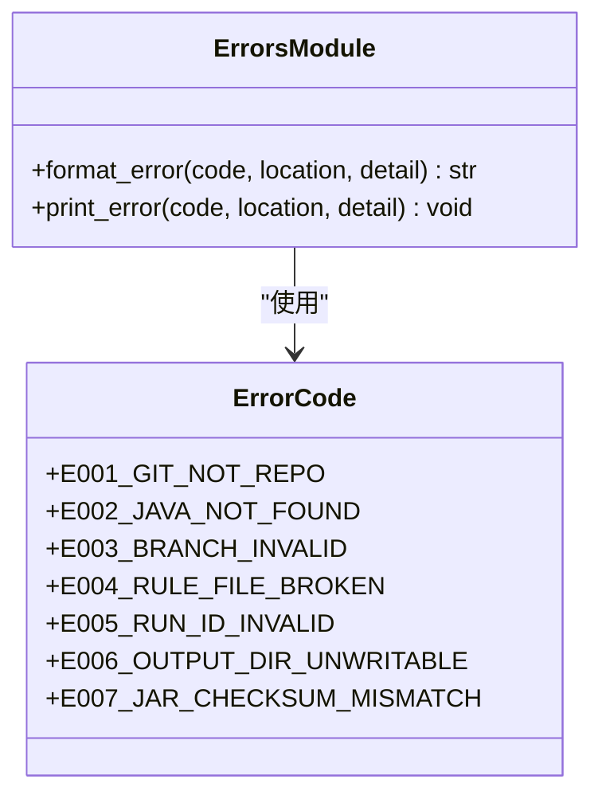

图表来源
- [sensitive-log-review/scripts/common/errors.py:18-100](file://sensitive-log-review/scripts/common/errors.py#L18-L100)

章节来源
- [sensitive-log-review/scripts/common/errors.py:1-100](file://sensitive-log-review/scripts/common/errors.py#L1-L100)

### Git 工具（git_utils.py）
- 分支名校验：拒绝以“-”开头、含“..”的引用，防选项注入
- 统一 git -C 调用：确保任意工作目录行为一致
- 变更文件/新增行：规范化路径，避免重复 fork 进程（AddedLinesCache）
- 仓库解析：验证是否为 git 仓库并结构化报错

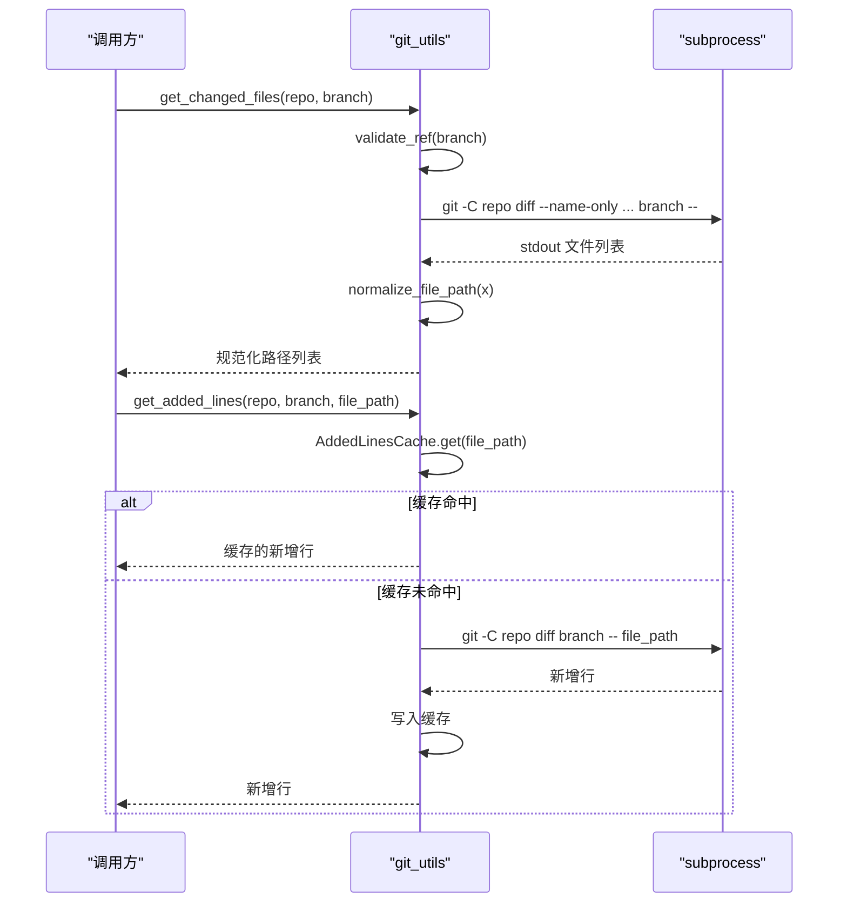

图表来源
- [sensitive-log-review/scripts/common/git_utils.py:26-124](file://sensitive-log-review/scripts/common/git_utils.py#L26-L124)

章节来源
- [sensitive-log-review/scripts/common/git_utils.py:1-124](file://sensitive-log-review/scripts/common/git_utils.py#L1-L124)

### Java 词法分析（java_lexer.py）
- 注释/字面量屏蔽：状态机替换为空格，保持行号准确
- 字段迭代：支持 record 组件、枚举常量、匿名类、多字段声明
- 类声明迭代：提取前置注解、类型 kind（class/interface/enum/record）
- @ToString 校验：检查 of 属性是否存在

```mermaid
flowchart TD
S(["iter_fields(path)"]) --> R["读取 UTF-8-SIG 源文件"]
R --> M["_mask_comments_and_literals()"]
M --> P["构建行起始索引表"]
P --> T["遍历字符维护花括号上下文"]
T --> |遇到 '{' | CT["识别类型体/枚举常量体/匿名类体/普通块"]
T --> |遇到 '}' | CC["弹出上下文/恢复语句起点"]
T --> |遇到 ';' 且位于类型体 | F["提取字段名/枚举常量名"]
F --> Y["yield (行号, 字段名)"]
```

图表来源
- [sensitive-log-review/scripts/common/java_lexer.py:84-290](file://sensitive-log-review/scripts/common/java_lexer.py#L84-L290)

章节来源
- [sensitive-log-review/scripts/common/java_lexer.py:1-654](file://sensitive-log-review/scripts/common/java_lexer.py#L1-L654)

### 词典系统（dictionary.py）
- 分层词典：core（高置信）、extended（低置信）、blacklist（最高优先级）、whitelist（豁免）
- 文件缓存：基于 mtime 的模块级缓存，修改后自动失效
- 分类判定：对一组拆分后的单词进行敏感级别判定

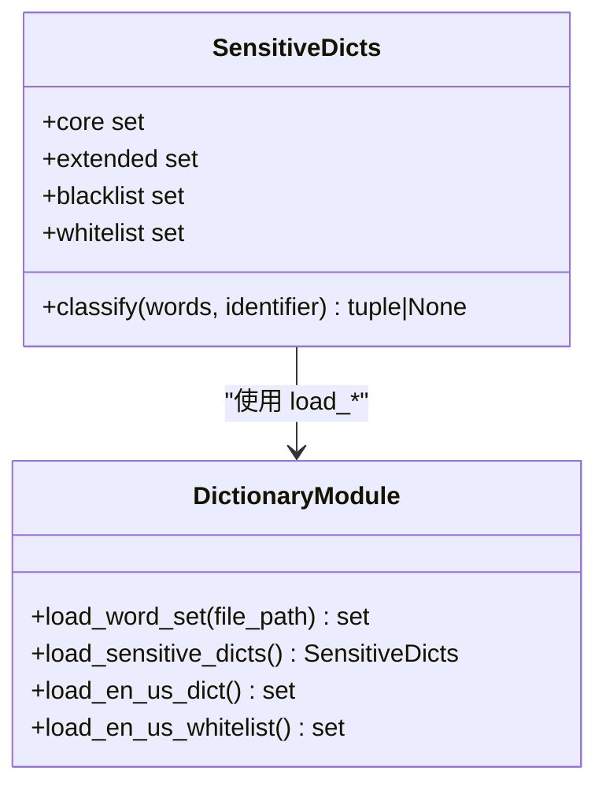

图表来源
- [sensitive-log-review/scripts/common/dictionary.py:38-143](file://sensitive-log-review/scripts/common/dictionary.py#L38-L143)

章节来源
- [sensitive-log-review/scripts/common/dictionary.py:1-143](file://sensitive-log-review/scripts/common/dictionary.py#L1-L143)

### POJO 配置（pojo_config.py）
- 唯一解析器：缺失/空节回退默认值；文件名后缀 endswith 匹配
- POJO 判定：限定在 src/main/java 之后路径段；目录名或后缀命中即视为 POJO
- 扫描入口：递归查找并去重排序

章节来源
- [sensitive-log-review/scripts/common/pojo_config.py:1-127](file://sensitive-log-review/scripts/common/pojo_config.py#L1-L127)

### 日志系统（logutil.py / sensors utils.py）
- 脚本专属日志：按脚本与工作目录隔离，FileHandler-only，stdout 仅保留协议输出
- 模块级兜底 logger：防止未 setup 时直接调用报错
- next_step 输出：统一向 stdout 输出，stderr 可回退到原始句柄

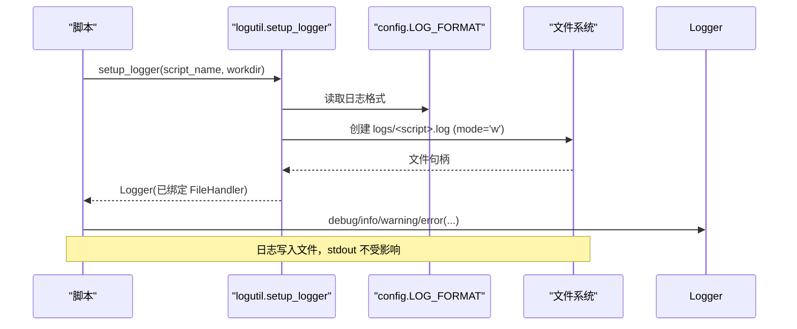

图表来源
- [batch-unit-test-generator/scripts/jaut/logutil.py:24-76](file://batch-unit-test-generator/scripts/jaut/logutil.py#L24-L76)
- [batch-unit-test-generator/scripts/jaut/config.py:121-126](file://batch-unit-test-generator/scripts/jaut/config.py#L121-L126)
- [sensors-analyze/scripts/utils.py:16-51](file://sensors-analyze/scripts/utils.py#L16-L51)

章节来源
- [batch-unit-test-generator/scripts/jaut/logutil.py:1-76](file://batch-unit-test-generator/scripts/jaut/logutil.py#L1-L76)
- [sensors-analyze/scripts/utils.py:1-51](file://sensors-analyze/scripts/utils.py#L1-L51)

### 子进程执行（proc.py）
- 命令执行：仅接受 list/tuple（shell=False），禁止 stdout 回显
- 两种模式：capture=True 收集文本；capture=False 流式写入日志文件
- 超时与终止：POSIX 两段式 SIGTERM -> 宽限 -> SIGKILL；Windows taskkill 回退
- 进度报告：守护线程定期输出进度，更新进度文件，防止误判无响应

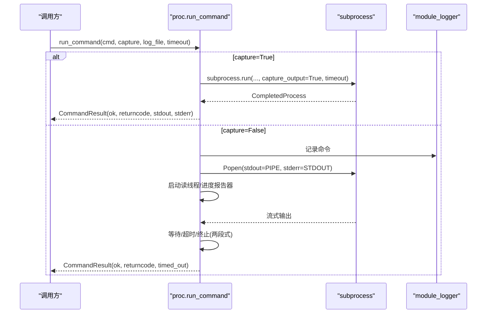

图表来源
- [batch-unit-test-generator/scripts/jaut/proc.py:151-347](file://batch-unit-test-generator/scripts/jaut/proc.py#L151-L347)

章节来源
- [batch-unit-test-generator/scripts/jaut/proc.py:1-347](file://batch-unit-test-generator/scripts/jaut/proc.py#L1-L347)

### Worktree 管理（worktree.py）
- 预检：base ref 校验、目标路径存在性、分支检出冲突检测
- 创建：根据分支是否存在与 base_ref 选择不同策略（强制重置/复用/新建）
- 清理：强制移除历史 worktree，prune 陈旧元数据，兜底删除野目录
- 变更检测：git status --porcelain 检查工作区未提交变更

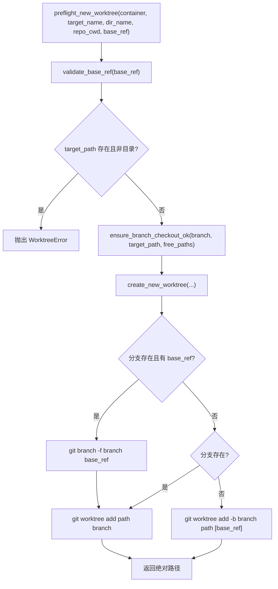

图表来源
- [batch-unit-test-generator/scripts/jaut/worktree.py:157-257](file://batch-unit-test-generator/scripts/jaut/worktree.py#L157-L257)

章节来源
- [batch-unit-test-generator/scripts/jaut/worktree.py:1-333](file://batch-unit-test-generator/scripts/jaut/worktree.py#L1-L333)

## 依赖关系分析
- common 包内部耦合：
  - git_utils 依赖 text.normalize_file_path/normalize_for_matching 与 errors.print_error
  - java_lexer 独立，被上层脚本调用
  - dictionary 独立，提供 SensitiveDicts 分类
  - pojo_config 独立，提供 POJO 判定与扫描
- jaut 工具链：
  - logutil 依赖 config 的日志格式与命名空间
  - proc 依赖 logutil 的 module_logger
  - worktree 依赖 proc 的统一命令执行
- sensors 工具：
  - utils 提供最小化的日志与 next_step 输出，供脚本快速接入

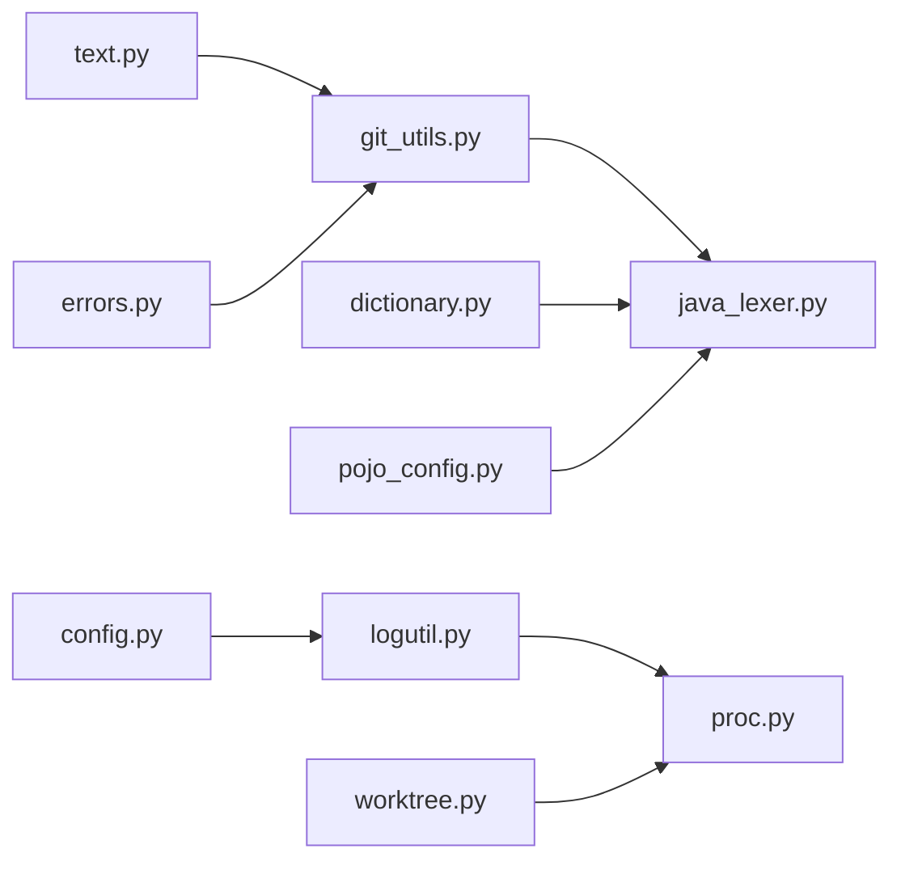

图表来源
- [sensitive-log-review/scripts/common/git_utils.py:10-17](file://sensitive-log-review/scripts/common/git_utils.py#L10-L17)
- [batch-unit-test-generator/scripts/jaut/logutil.py:14-17](file://batch-unit-test-generator/scripts/jaut/logutil.py#L14-L17)
- [batch-unit-test-generator/scripts/jaut/proc.py:25-27](file://batch-unit-test-generator/scripts/jaut/proc.py#L25-L27)
- [batch-unit-test-generator/scripts/jaut/worktree.py:19-21](file://batch-unit-test-generator/scripts/jaut/worktree.py#L19-L21)

章节来源
- [sensitive-log-review/scripts/common/git_utils.py:1-124](file://sensitive-log-review/scripts/common/git_utils.py#L1-L124)
- [batch-unit-test-generator/scripts/jaut/logutil.py:1-76](file://batch-unit-test-generator/scripts/jaut/logutil.py#L1-L76)
- [batch-unit-test-generator/scripts/jaut/proc.py:1-347](file://batch-unit-test-generator/scripts/jaut/proc.py#L1-L347)
- [batch-unit-test-generator/scripts/jaut/worktree.py:1-333](file://batch-unit-test-generator/scripts/jaut/worktree.py#L1-L333)

## 性能考虑
- 正则预编译：text.py 中预编译常用正则，减少热路径开销
- 词典缓存：dictionary.py 基于 mtime 的模块级缓存，避免重复 IO
- Git 增量缓存：git_utils.AddedLinesCache 按文件缓存新增行，减少 fork
- 子进程流式日志：proc.py 单写者不变式，避免并发写竞争
- 超时与优雅终止：proc.py 两段式终止，避免僵尸进程与资源泄漏
- 路径规范化：text.normalize_for_matching 统一分隔符，提升匹配效率

[本节为通用指导，无需特定文件来源]

## 故障排查指南
- Git 仓库无效：使用 errors.print_error(E001)，检查 -r 指向根目录
- Java 不可用：errors.E002，安装 JDK/JRE 并加入 PATH
- 分支非法：errors.E003，核对 --branch 拼写与存在性
- 规则 JSON 损坏：errors.E004，使用 json.tool 验证
- run-id 非法：errors.E005，仅允许字母数字/._-，首字符必须字母或数字
- 输出目录不可写：errors.E006，检查权限与磁盘空间
- checkstyle jar 校验失败：errors.E007，重新获取或同步 sha256 基线
- 子进程无法执行：proc.resolve_tool 提示未找到可执行程序
- Worktree 冲突：worktree.ensure_branch_checkout_ok 抛出 WorktreeError，释放冲突检出或调整目标路径

章节来源
- [sensitive-log-review/scripts/common/errors.py:18-100](file://sensitive-log-review/scripts/common/errors.py#L18-L100)
- [batch-unit-test-generator/scripts/jaut/proc.py:332-347](file://batch-unit-test-generator/scripts/jaut/proc.py#L332-L347)
- [batch-unit-test-generator/scripts/jaut/worktree.py:125-144](file://batch-unit-test-generator/scripts/jaut/worktree.py#L125-L144)

## 结论
该工具模块通过统一的文本、路径、错误、Git、Java 词法、词典、POJO 配置、日志与子进程执行能力，为多个脚本提供了稳定、可观测、可扩展的基础设施。其设计强调跨平台兼容、编码安全、资源管理与性能优化，适合在生产环境中大规模使用。

[本节为总结，无需特定文件来源]

## 附录：API 速查与最佳实践

### 文本处理（text.py）
- split_field_name(field_name): 将标识符拆分为单词列表
- normalize_file_path(file_path): 规范化 git 输出路径（处理 ..）
- normalize_for_matching(path): 统一反斜杠为正斜杠
- parse_list_line(line): 解析清单行，返回 (path, line, tags, content)

使用示例
- 字段名拆分：split_field_name("getUserID") -> ["get","user","id"]
- 路径匹配键：normalize_for_matching("a\\b\\c") -> "a/b/c"

章节来源
- [sensitive-log-review/scripts/common/text.py:13-95](file://sensitive-log-review/scripts/common/text.py#L13-L95)

### 路径与产物（paths.py）
- get_output_dir(cli_arg=None, run_id=None): 解析输出目录并确保存在
- artifact(out_dir, name): 返回产物完整路径

使用示例
- 设置输出目录：get_output_dir("/tmp/out", "run-2024_01.01")
- 构造产物路径：artifact(out_dir, "log-print-ok.list")

章节来源
- [sensitive-log-review/scripts/common/paths.py:44-69](file://sensitive-log-review/scripts/common/paths.py#L44-L69)

### 错误处理（errors.py）
- format_error(code, location="", detail=""): 格式化结构化错误信息
- print_error(code, location="", detail=""): 输出到 stderr

使用示例
- print_error(ErrorCode.E001_GIT_NOT_REPO, location="/repo", detail="缺少 .git")

章节来源
- [sensitive-log-review/scripts/common/errors.py:84-100](file://sensitive-log-review/scripts/common/errors.py#L84-L100)

### Git 工具（git_utils.py）
- validate_ref(ref): 校验分支/引用名合法性
- git(repo, *args, check=False): 在指定仓库执行 git 命令
- get_changed_files(repo, branch): 获取变更文件列表
- get_added_lines(repo, branch, file_path): 获取新增行内容
- AddedLinesCache(repo, branch).get(file_path): 缓存新增行
- resolve_repo(cli_repo): 解析并验证仓库目录

使用示例
- get_changed_files(Path("/repo"), "feature/x")
- AddedLinesCache(Path("/repo"), "main").get("src/Main.java")

章节来源
- [sensitive-log-review/scripts/common/git_utils.py:26-124](file://sensitive-log-review/scripts/common/git_utils.py#L26-L124)

### Java 词法（java_lexer.py）
- iter_fields(path, on_error=None): 迭代字段（行号, 字段名）
- iter_classes(path, on_error=None): 迭代类声明（行号, 类名, 注解, kind）
- check_tostring_annotation(annotations): 校验 @ToString(of=...)

使用示例
- for line_no, name in iter_fields(Path("src/Main.java")): ...
- ok, reason = check_tostring_annotation(["@ToString(of = {\"x\"})"])

章节来源
- [sensitive-log-review/scripts/common/java_lexer.py:180-654](file://sensitive-log-review/scripts/common/java_lexer.py#L180-L654)

### 词典系统（dictionary.py）
- load_word_set(file_path): 加载词表为小写集合（带 mtime 缓存）
- load_sensitive_dicts(): 加载 core/extended/blacklist/whitelist
- SensitiveDicts.classify(words, identifier=""): 敏感级别判定

使用示例
- dicts = load_sensitive_dicts()
- result = dicts.classify({"user","id"}, "userId")

章节来源
- [sensitive-log-review/scripts/common/dictionary.py:52-143](file://sensitive-log-review/scripts/common/dictionary.py#L52-L143)

### POJO 配置（pojo_config.py）
- load_pojo_config(config_path): 解析 pojo.config，缺失回退默认
- is_pojo_file(path, project_root, directories, suffixes): 判定 POJO 文件
- find_java_files(project_root, directories, suffixes): 扫描全部 POJO Java 文件

使用示例
- dirs, suffixes = load_pojo_config(Path("pojo.config"))
- files = find_java_files(Path("src"), dirs, suffixes)

章节来源
- [sensitive-log-review/scripts/common/pojo_config.py:27-127](file://sensitive-log-review/scripts/common/pojo_config.py#L27-L127)

### 日志系统（logutil.py / sensors utils.py）
- setup_logger(script_name, workdir): 创建/复用脚本专属文件 logger
- get_logger(script_name): 取已初始化 logger
- module_logger(): 模块级兜底 logger
- setup_logging(name, log_path): sensors 的日志配置
- next_step(msg): 唯一向 stdout 输出的内容

使用示例
- logger = setup_logger("build_prompt", "/workdir")
- next_step("finish")

章节来源
- [batch-unit-test-generator/scripts/jaut/logutil.py:24-76](file://batch-unit-test-generator/scripts/jaut/logutil.py#L24-L76)
- [sensors-analyze/scripts/utils.py:16-51](file://sensors-analyze/scripts/utils.py#L16-L51)

### 子进程执行（proc.py）
- run_command(cmd, cwd=None, timeout=None, capture=True, log_file=None): 执行命令并返回 CommandResult
- resolve_tool(name): 定位可执行程序
- ensure_parent_dir(path): 确保父目录存在

使用示例
- res = run_command(["mvn", "test"], timeout=1800, capture=False, log_file="logs/mvn.log")
- if not res.ok: handle_failure(res)

章节来源
- [batch-unit-test-generator/scripts/jaut/proc.py:151-347](file://batch-unit-test-generator/scripts/jaut/proc.py#L151-L347)

### Worktree 管理（worktree.py）
- preflight_new_worktree(container, target_name, dir_name, repo_cwd, base_ref, logger): 预检
- create_new_worktree(container, target_name, dir_name, repo_cwd, logger, base_ref=None): 创建
- clear_all_worktrees(container, repo_cwd, logger): 清理历史 worktree
- has_uncommitted_changes(repo_cwd, logger): 检查工作区变更

使用示例
- target = preflight_new_worktree(container, "my-worktree", "project", "/repo", None, logger)
- created = create_new_worktree(container, "my-worktree", "project", "/repo", logger, base_ref="v1.0")

章节来源
- [batch-unit-test-generator/scripts/jaut/worktree.py:157-333](file://batch-unit-test-generator/scripts/jaut/worktree.py#L157-L333)

### 设计原则与扩展点
- 单一事实源：配置集中于 config.py，错误码集中于 errors.py，产物文件名集中于 paths.py
- 可观测性：脚本专属日志、next_step 协议、进度文件、结构化错误
- 可扩展性：词典分层、Java 词法迭代器、子进程抽象
- 兼容性：跨平台路径与命令、UTF-8 编码、安全字符校验
- 资源管理：文件句柄关闭、进程组终止、缓存失效

[本节为概念性说明，无需特定文件来源]

### 常见陷阱与避免
- 不要直接向 stdout 输出调试信息（会破坏 next_step 协议）
- 不要拼接用户输入到 git 命令（使用 validate_ref 与 git -C）
- 不要忽略超时与进程终止（使用 proc 的两段式终止）
- 不要硬编码路径分隔符（使用 normalize_for_matching）
- 不要原地修改词典集合（load_word_set 返回缓存共享集合）

[本节为通用指导，无需特定文件来源]