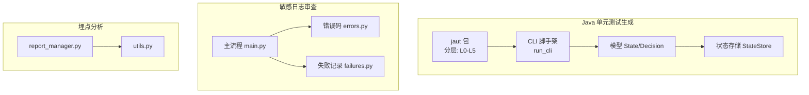
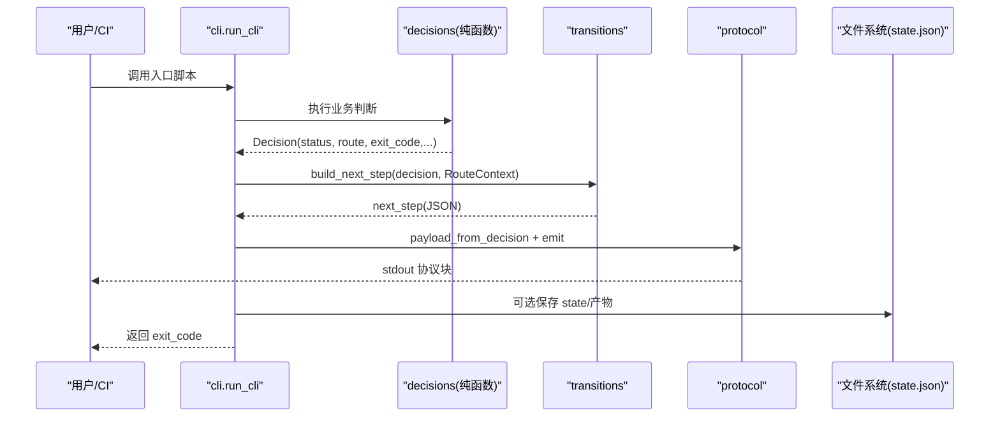
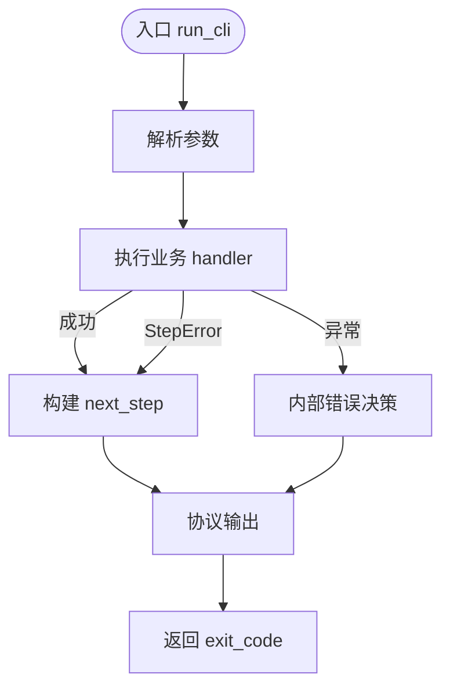
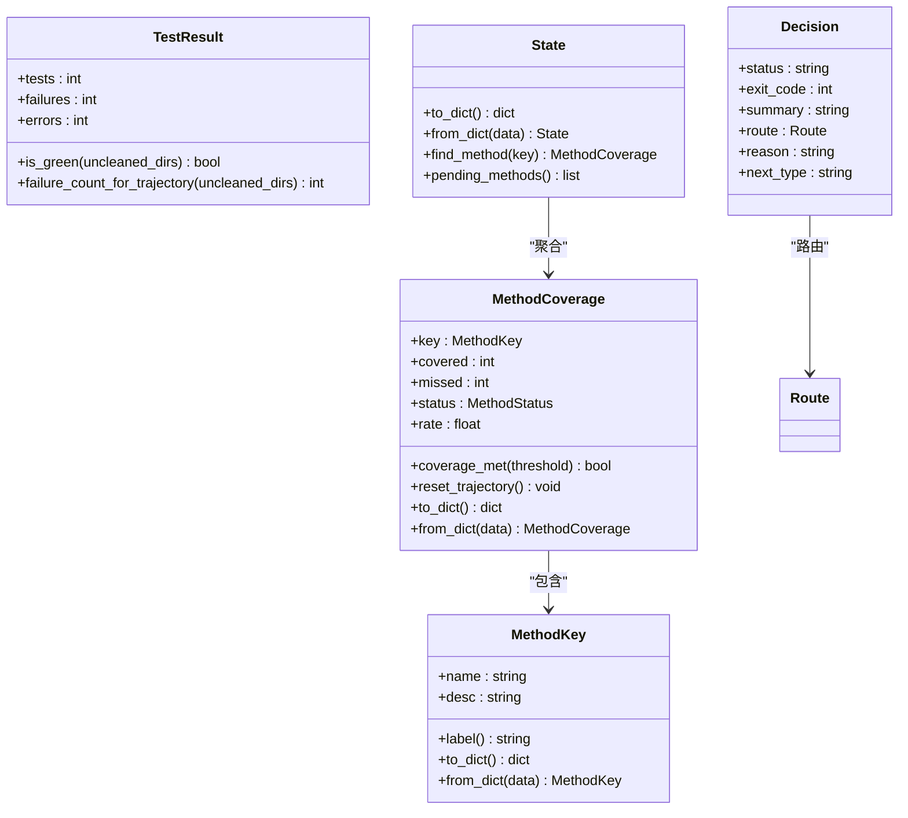
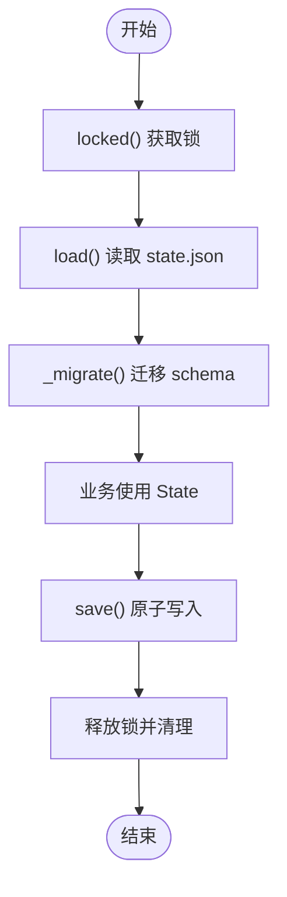
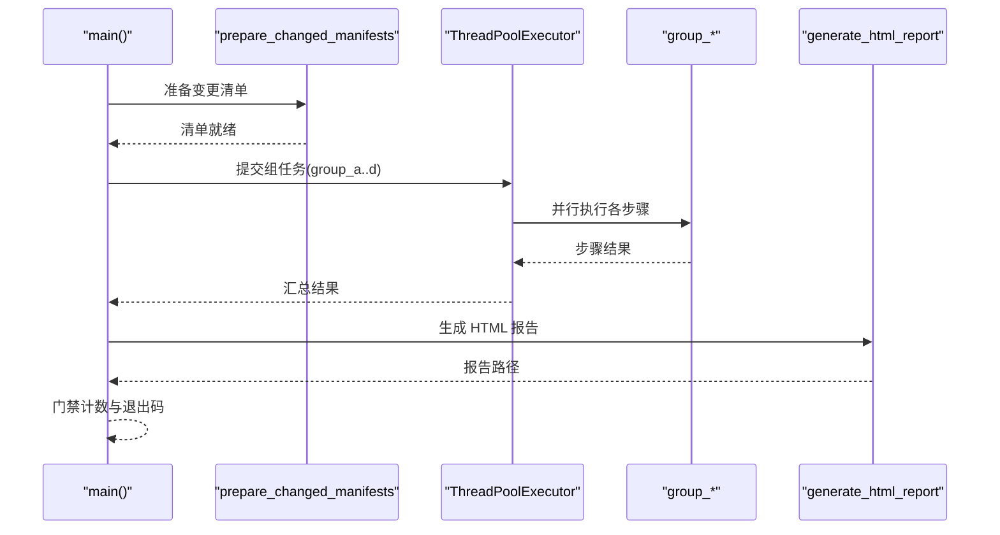
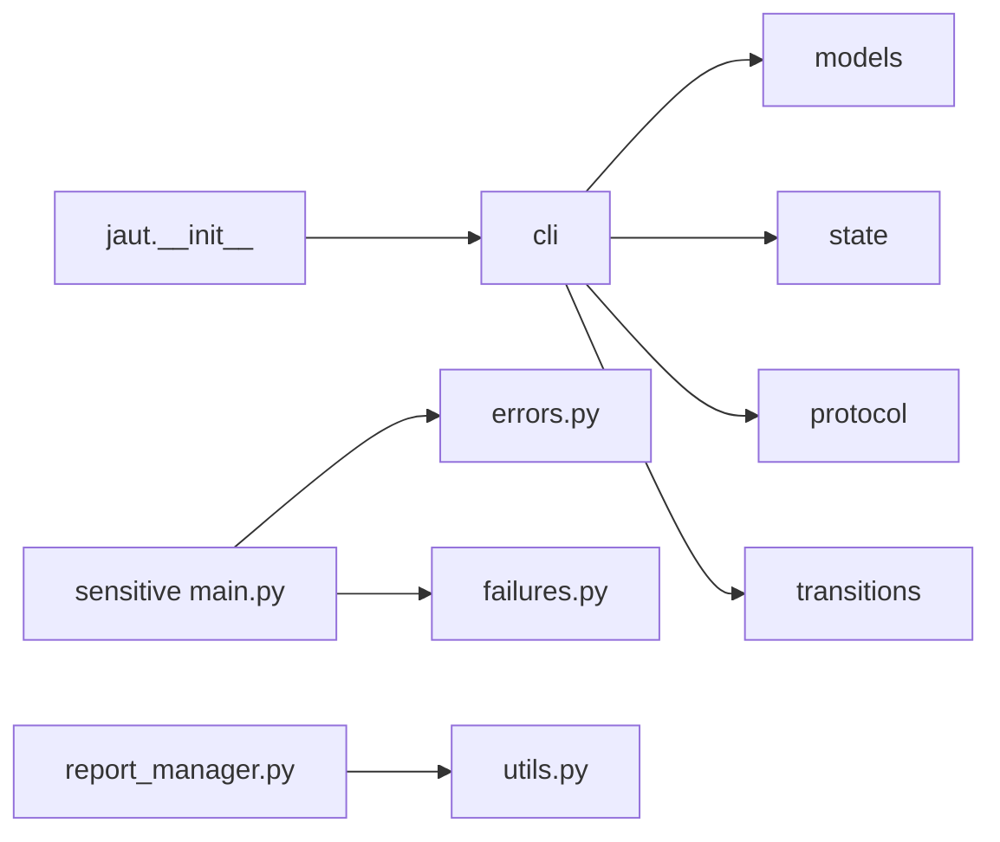

# 核心模块

<cite>
**本文引用的文件**
- [README.md](file://README.md)
- [AGENTS.md](file://AGENTS.md)
- [CLAUDE.md](file://CLAUDE.md)
- [java-unit-test-generator/scripts/jaut/__init__.py](file://java-unit-test-generator/scripts/jaut/__init__.py)
- [batch-unit-test-generator/scripts/jaut/__init__.py](file://batch-unit-test-generator/scripts/jaut/__init__.py)
- [java-unit-test-generator/scripts/jaut/cli.py](file://java-unit-test-generator/scripts/jaut/cli.py)
- [batch-unit-test-generator/scripts/jaut/cli.py](file://batch-unit-test-generator/scripts/jaut/cli.py)
- [java-unit-test-generator/scripts/jaut/models.py](file://java-unit-test-generator/scripts/jaut/models.py)
- [batch-unit-test-generator/scripts/jaut/models.py](file://batch-unit-test-generator/scripts/jaut/models.py)
- [java-unit-test-generator/scripts/jaut/state.py](file://java-unit-test-generator/scripts/jaut/state.py)
- [sensitive-log-review/scripts/main.py](file://sensitive-log-review/scripts/main.py)
- [sensitive-log-review/scripts/common/errors.py](file://sensitive-log-review/scripts/common/errors.py)
- [sensitive-log-review/scripts/common/failures.py](file://sensitive-log-review/scripts/common/failures.py)
- [sensors-analyze/scripts/report_manager.py](file://sensors-analyze/scripts/report_manager.py)
- [sensors-analyze/scripts/utils.py](file://sensors-analyze/scripts/utils.py)
</cite>

## 目录
1. [简介](#简介)
2. [项目结构](#项目结构)
3. [核心组件](#核心组件)
4. [架构总览](#架构总览)
5. [详细组件分析](#详细组件分析)
6. [依赖关系分析](#依赖关系分析)
7. [性能与并发](#性能与并发)
8. [故障排查指南](#故障排查指南)
9. [结论](#结论)
10. [附录：集成模式与示例](#附录：集成模式与示例)

## 简介
本仓库包含四个“技能”（agent skills），每个技能自包含脚本、协议与测试，用于在目标项目中安装并驱动工作流。核心模块包括：
- Java 单元测试生成引擎（单类/批量）：基于 NEXT_STEP 协议编排 LLM 与构建工具链，维护状态与覆盖率目标。
- 敏感信息日志审查：多步骤并行流水线，产出 HTML 报告与门禁退出码。
- 埋点分析：CSV 归档与版本差异比对，辅助人工复核。

本 API 文档聚焦上述核心模块的关键类、方法、属性、错误处理、重试机制、线程安全、内存管理与性能优化，并提供类图、时序图与流程图等可视化说明。

## 项目结构
- 统一分层约束（L0-L5）：基础模型 → 基础设施 → 解析构建 → 领域逻辑 → 编排 → 入口脚本。
- 两个单元测试技能各自携带一份 jaut 引擎副本，存在差异；修改共享逻辑需同时对比两套实现并运行对应测试套件。
- 敏感日志审查采用四链路并行执行，汇总后生成 HTML 报告。
- 埋点分析提供 CSV 归档与差异报告能力。

**图表来源**
- [java-unit-test-generator/scripts/jaut/__init__.py:1-23](file://java-unit-test-generator/scripts/jaut/__init__.py#L1-L23)
- [java-unit-test-generator/scripts/jaut/cli.py:1-129](file://java-unit-test-generator/scripts/jaut/cli.py#L1-L129)
- [java-unit-test-generator/scripts/jaut/models.py:1-499](file://java-unit-test-generator/scripts/jaut/models.py#L1-L499)
- [java-unit-test-generator/scripts/jaut/state.py:1-165](file://java-unit-test-generator/scripts/jaut/state.py#L1-L165)
- [sensitive-log-review/scripts/main.py:1-800](file://sensitive-log-review/scripts/main.py#L1-L800)
- [sensitive-log-review/scripts/common/errors.py:1-100](file://sensitive-log-review/scripts/common/errors.py#L1-L100)
- [sensitive-log-review/scripts/common/failures.py:1-101](file://sensitive-log-review/scripts/common/failures.py#L1-L101)
- [sensors-analyze/scripts/report_manager.py:1-336](file://sensors-analyze/scripts/report_manager.py#L1-L336)
- [sensors-analyze/scripts/utils.py:1-51](file://sensors-analyze/scripts/utils.py#L1-L51)

**章节来源**
- [AGENTS.md:1-50](file://AGENTS.md#L1-L50)
- [CLAUDE.md:1-65](file://CLAUDE.md#L1-L65)

## 核心组件
- CLI 脚手架（统一入口）：封装参数解析、异常到协议块转换、next_step 输出与退出码约定。
- 领域模型（State/Decision/Route）：类型化数据载体，支持序列化/反序列化、向后兼容与迁移。
- 状态存储（StateStore）：原子写入、跨进程锁、schema 迁移。
- 敏感日志审查主流程：四链路并行、产物汇总、HTML 报告、门禁退出码。
- 错误与失败记录：结构化错误码、分片合并、幂等清理。
- 埋点报告管理器：CSV 归档、版本差异比对、人工复核提示。

**章节来源**
- [java-unit-test-generator/scripts/jaut/cli.py:1-129](file://java-unit-test-generator/scripts/jaut/cli.py#L1-L129)
- [java-unit-test-generator/scripts/jaut/models.py:1-499](file://java-unit-test-generator/scripts/jaut/models.py#L1-L499)
- [java-unit-test-generator/scripts/jaut/state.py:1-165](file://java-unit-test-generator/scripts/jaut/state.py#L1-L165)
- [sensitive-log-review/scripts/main.py:1-800](file://sensitive-log-review/scripts/main.py#L1-L800)
- [sensitive-log-review/scripts/common/errors.py:1-100](file://sensitive-log-review/scripts/common/errors.py#L1-L100)
- [sensitive-log-review/scripts/common/failures.py:1-101](file://sensitive-log-review/scripts/common/failures.py#L1-L101)
- [sensors-analyze/scripts/report_manager.py:1-336](file://sensors-analyze/scripts/report_manager.py#L1-L336)
- [sensors-analyze/scripts/utils.py:1-51](file://sensors-analyze/scripts/utils.py#L1-L51)

## 架构总览
NEXT_STEP 协议驱动的闭环：脚本执行 → 决策 → 路由 → 协议输出 → 调用方继续或终止。

**图表来源**
- [java-unit-test-generator/scripts/jaut/cli.py:95-129](file://java-unit-test-generator/scripts/jaut/cli.py#L95-L129)
- [java-unit-test-generator/scripts/jaut/models.py:310-348](file://java-unit-test-generator/scripts/jaut/models.py#L310-L348)

## 详细组件分析

### 组件A：CLI 脚手架（run_cli）
职责
- 统一参数解析、工作目录解析、日志初始化。
- 将 StepError 与未捕获异常转换为 failed 协议块，确保稳定输出。
- 通过 transitions 生成 next_step，由 protocol 输出至 stdout，并返回 exit_code。

关键方法与行为
- run_cli(script_name, add_arguments, handler, argv): 统一执行框架，返回进程退出码。
- require_workdir(args): 校验 --workdir/--project-root，缺失时抛出状态错误（exit 3）。
- StepError.state_error/exec_error: 构造可预期错误的 Decision，分别对应状态/协议错误与执行错误。

输入验证
- 参数合法性检查（如 workdir 解析）。
- 异常兜底：任何未捕获异常转为 ask_user 的 failed 协议块。

输出处理
- 仅允许协议块与显式计划摘要输出到 stdout；过程日志写文件。
- 返回 exit_code 遵循约定：0=完成，1=继续，2=脚本错误，3=状态/协议错误。

线程安全与内存管理
- 无共享可变状态；日志初始化失败不影响协议输出。
- 避免在 handler 中持有大对象引用过久，减少内存占用。

性能优化
- 最小化 I/O；仅在必要时初始化 logger。
- 使用轻量级数据结构传递上下文。

**图表来源**
- [java-unit-test-generator/scripts/jaut/cli.py:95-129](file://java-unit-test-generator/scripts/jaut/cli.py#L95-L129)

**章节来源**
- [java-unit-test-generator/scripts/jaut/cli.py:1-129](file://java-unit-test-generator/scripts/jaut/cli.py#L1-L129)
- [batch-unit-test-generator/scripts/jaut/cli.py:1-129](file://batch-unit-test-generator/scripts/jaut/cli.py#L1-L129)

### 组件B：领域模型（State/Decision/Route）
职责
- 定义覆盖率原语、方法/类覆盖率、测试结果、决策产物与持久化状态。
- 提供 to_dict/from_dict 与向后兼容迁移。

关键类与方法
- coverage_rate(covered, missed): 计算行覆盖率，抽象/接口方法视为达标。
- MethodCoverage.coverage_met(threshold): 判定是否达到阈值。
- TestResult.is_green(): fail-closed 唯一实现，报告缺失/不可解析/清理失败/存在失败用例均不绿。
- Decision.next_type: 根据 Route 映射 next_step.type。
- State.to_dict()/from_dict(): 序列化/反序列化，兼容旧 schema_version。

输入验证
- from_dict 对缺失键填充默认值，保证健壮加载。

输出处理
- 仅输出必要字段，保持 state.json 形态一致。

线程安全与内存管理
- 数据类为不可变或受控可变；避免在热路径创建过多临时对象。

性能优化
- 延迟计算 rate；缓存配置探测结果（jacoco_config_cache）。

**图表来源**
- [java-unit-test-generator/scripts/jaut/models.py:77-176](file://java-unit-test-generator/scripts/jaut/models.py#L77-L176)
- [java-unit-test-generator/scripts/jaut/models.py:240-277](file://java-unit-test-generator/scripts/jaut/models.py#L240-L277)
- [java-unit-test-generator/scripts/jaut/models.py:310-348](file://java-unit-test-generator/scripts/jaut/models.py#L310-L348)
- [java-unit-test-generator/scripts/jaut/models.py:347-499](file://java-unit-test-generator/scripts/jaut/models.py#L347-L499)

**章节来源**
- [java-unit-test-generator/scripts/jaut/models.py:1-499](file://java-unit-test-generator/scripts/jaut/models.py#L1-L499)
- [batch-unit-test-generator/scripts/jaut/models.py:1-693](file://batch-unit-test-generator/scripts/jaut/models.py#L1-L693)

### 组件C：状态存储（StateStore）
职责
- 原子读写 state.json，跨进程锁保护，schema 迁移。

关键方法与行为
- locked(): 获取独占文件锁（POSIX fcntl / Windows msvcrt），保护 load→修改→save。
- load(): 读取并反序列化，损坏或缺失返回 None。
- save(): 原子写入（临时文件 + os.replace + fsync）。
- _migrate(): 顺序迁移 schema_version 至当前版本。

输入验证
- 非对象 JSON 视为非法；读取失败降级为缺失。

输出处理
- 覆盖写入 .tmp 后替换，避免半截状态。

线程安全与内存管理
- 独立 .lock 文件避免与 state.json 替换冲突；残留锁检测与告警。

性能优化
- 最小化磁盘 IO；仅在必要时创建临时文件。

**图表来源**
- [java-unit-test-generator/scripts/jaut/state.py:77-165](file://java-unit-test-generator/scripts/jaut/state.py#L77-L165)

**章节来源**
- [java-unit-test-generator/scripts/jaut/state.py:1-165](file://java-unit-test-generator/scripts/jaut/state.py#L1-L165)

### 组件D：敏感日志审查主流程（main.py）
职责
- 四链路并行执行（P1-6），汇总计数，生成 HTML 报告，门禁退出码。

关键方法与行为
- group_a/b/c/d(): 分组步骤，串行或并行执行。
- prepare_changed_manifests(): 计算变更清单（--changed-only）。
- generate_html_report(): 读取产物、渲染 HTML、写入报告。
- run_doctor(): 环境诊断（Python/java/git/checkstyle jar/规则/词典/输出目录）。

输入验证
- 分支名校验、run-id 合法性、输出目录可写性。

输出处理
- 产物文件清单打印；HTML 报告包含摘要与详情折叠。

线程安全与内存管理
- ThreadPoolExecutor(max_workers=4) 并行链路；子进程调用外部脚本。
- 失败记录分片合并，避免并发写竞争。

性能优化
- 变更扫描优先；全量扫描作为回退；HTML 预览+详情展开减少渲染开销。

**图表来源**
- [sensitive-log-review/scripts/main.py:276-323](file://sensitive-log-review/scripts/main.py#L276-L323)
- [sensitive-log-review/scripts/main.py:353-505](file://sensitive-log-review/scripts/main.py#L353-L505)
- [sensitive-log-review/scripts/main.py:732-800](file://sensitive-log-review/scripts/main.py#L732-L800)

**章节来源**
- [sensitive-log-review/scripts/main.py:1-800](file://sensitive-log-review/scripts/main.py#L1-L800)

### 组件E：错误与失败记录（errors.py / failures.py）
职责
- 统一错误码与修复建议模板；分片化失败记录与合并。

关键方法与行为
- print_error(code, location, detail): 结构化错误输出到 stderr。
- FailureRecorder.record/flush: 单步骤失败收集与分片写出。
- clear_failure_shards/merge_failure_shards: 清理与合并分片。

输入验证
- 原因摘要压缩为单行，防止破坏行格式。

输出处理
- 合并后写入 failed-files.list；仅保留完整行。

线程安全与内存管理
- 分片天然无竞争；合并阶段排序遍历。

性能优化
- 增量合并；失败记录内存累积后一次性落盘。

**章节来源**
- [sensitive-log-review/scripts/common/errors.py:1-100](file://sensitive-log-review/scripts/common/errors.py#L1-L100)
- [sensitive-log-review/scripts/common/failures.py:1-101](file://sensitive-log-review/scripts/common/failures.py#L1-L101)

### 组件F：埋点报告管理器（report_manager.py）
职责
- CSV 归档带时间戳文件名，查找上一版本比对差异，输出差异报告。

关键方法与行为
- find_previous_csv(reports_dir, base): 按时间戳排序查找最近归档。
- diff_csv(old_rows, new_rows): 全列签名做主键，正确处理重复行与同 file 下的变化。
- write_diff_report(diff, out_path): 写差异报告并返回行列表。
- main(): 命令行入口，归档与比对，next_step 输出。

输入验证
- CSV 表头校验（兼容旧表头）；行空白清理。

输出处理
- 差异报告文本；next_step 消息提示人工复核。

线程安全与内存管理
- 单进程顺序执行；内存中构建签名映射。

性能优化
- Counter 计数重复行；按 file 分组快速定位变化。

**章节来源**
- [sensors-analyze/scripts/report_manager.py:1-336](file://sensors-analyze/scripts/report_manager.py#L1-L336)
- [sensors-analyze/scripts/utils.py:1-51](file://sensors-analyze/scripts/utils.py#L1-L51)

## 依赖关系分析
- jaut 包分层单向依赖（禁止反向）：L0→L1→L2→L3→L4→L5。
- CLI 依赖 models、config、protocol、transitions、logutil、state。
- 敏感日志审查依赖 common/errors、common/failures、common/git_utils、common/pojo_config。
- 埋点分析依赖 utils（日志与 next_step）。

**图表来源**
- [java-unit-test-generator/scripts/jaut/__init__.py:1-23](file://java-unit-test-generator/scripts/jaut/__init__.py#L1-L23)
- [java-unit-test-generator/scripts/jaut/cli.py:1-129](file://java-unit-test-generator/scripts/jaut/cli.py#L1-L129)
- [sensitive-log-review/scripts/main.py:1-800](file://sensitive-log-review/scripts/main.py#L1-L800)
- [sensors-analyze/scripts/report_manager.py:1-336](file://sensors-analyze/scripts/report_manager.py#L1-L336)

**章节来源**
- [java-unit-test-generator/scripts/jaut/__init__.py:1-23](file://java-unit-test-generator/scripts/jaut/__init__.py#L1-L23)
- [batch-unit-test-generator/scripts/jaut/__init__.py:1-23](file://batch-unit-test-generator/scripts/jaut/__init__.py#L1-L23)

## 性能与并发
- 并行策略：敏感日志审查使用线程池并行四链路；每步可能启动子进程执行外部脚本。
- 原子性与锁：state.json 原子写入；跨进程文件锁保护状态读写。
- 资源控制：限制线程数；避免在热路径进行大量 I/O。
- 内存优化：分片失败记录内存累积后落盘；CSV 差异比对使用 Counter 与签名映射。
- 网络/外部依赖：谨慎调用外部命令（java/git/checkstyle），失败快速失败并给出结构化错误。

[本节为通用指导，无需特定文件来源]

## 故障排查指南
- 退出码约定：
  - 单元测试技能：0=完成，1=继续，2=脚本错误，3=状态/协议错误。
  - 敏感日志审查：0=通过，1=触发门禁，2=执行错误。
  - 埋点报告：0=成功，1=执行异常，2=存在差异需人工复核。
- 常见错误与修复建议：
  - 分支名非法、输出目录不可写、checkstyle jar SHA256 不符等，参考结构化错误码与修复建议。
- 日志与产物：
  - 过程日志写文件；stdout 仅协议块或 next_step 消息。
  - 失败记录分片合并；HTML 报告包含详情折叠。

**章节来源**
- [java-unit-test-generator/scripts/jaut/cli.py:25-47](file://java-unit-test-generator/scripts/jaut/cli.py#L25-L47)
- [sensitive-log-review/scripts/common/errors.py:18-100](file://sensitive-log-review/scripts/common/errors.py#L18-L100)
- [sensitive-log-review/scripts/main.py:732-800](file://sensitive-log-review/scripts/main.py#L732-L800)
- [sensors-analyze/scripts/report_manager.py:243-331](file://sensors-analyze/scripts/report_manager.py#L243-L331)

## 结论
本核心模块以清晰的层次化设计与协议驱动的工作流，实现了高内聚、低耦合的可扩展系统。CLI 脚手架统一了错误处理与协议输出；领域模型与状态存储保证了数据的正确性与可恢复性；敏感日志审查通过并行流水线提升效率；埋点报告管理器提供了可靠的版本比对能力。整体设计兼顾性能、可靠性与可维护性。

[本节为总结，无需特定文件来源]

## 附录：集成模式与示例
- 单元测试技能集成：
  - 选择工作树 → 初始化覆盖率 → 制定计划 → 构建提示 → LLM 写代码 → 验证规则 → 验证覆盖率（循环直至达标）。
  - 批量模式：diff → 批量初始化 → 批量下一步 → 批量更新 → 批量完成。
- 敏感日志审查集成：
  - 传入项目根、目标分支、输出目录；可选择仅变更文件或全量扫描；启用严格模式可将解析失败视为错误。
- 埋点分析集成：
  - 从 sensors.json 提取入口候选 → 人工确认 → 定位调用点 → 生成 CSV → 归档与差异比对。

[本节为概念性内容，无需特定文件来源]