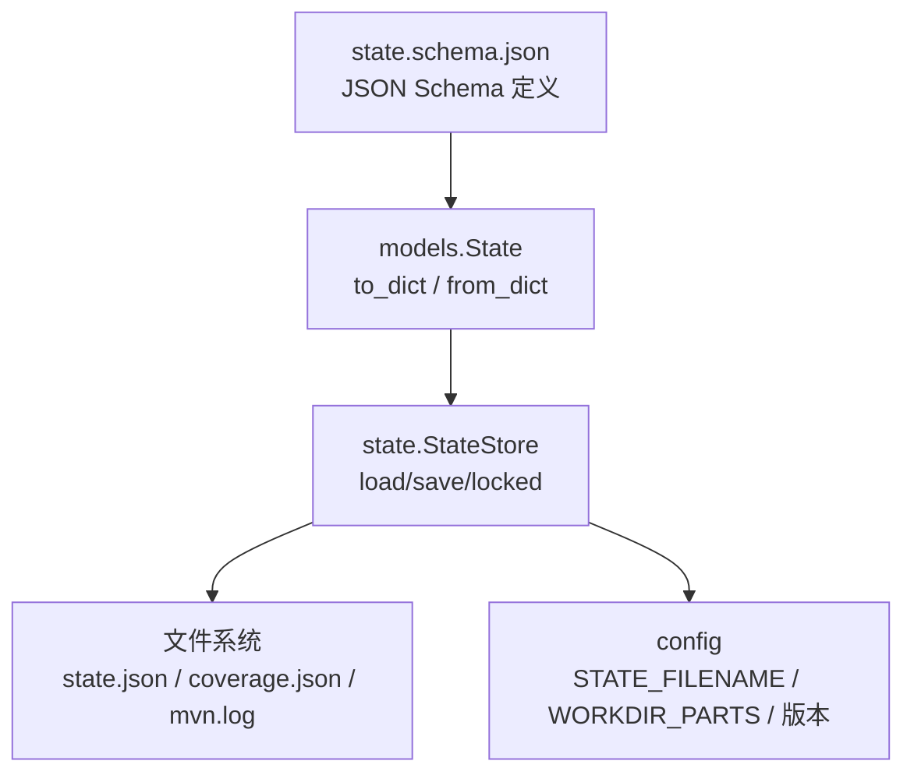
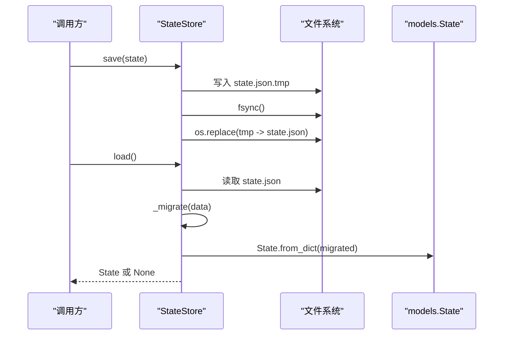
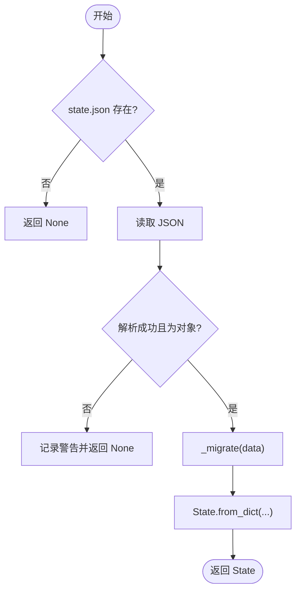
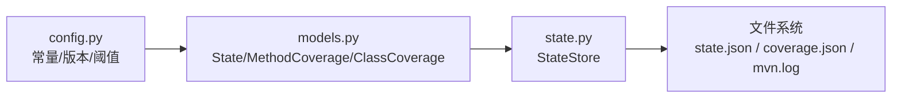

# 状态存储 Schema

<cite>
**本文引用的文件**
- [batch-unit-test-generator/protocol/state.schema.json](file://batch-unit-test-generator/protocol/state.schema.json)
- [java-unit-test-generator/protocol/state.schema.json](file://java-unit-test-generator/protocol/state.schema.json)
- [batch-unit-test-generator/scripts/jaut/models.py](file://batch-unit-test-generator/scripts/jaut/models.py)
- [java-unit-test-generator/scripts/jaut/models.py](file://java-unit-test-generator/scripts/jaut/models.py)
- [batch-unit-test-generator/scripts/jaut/state.py](file://batch-unit-test-generator/scripts/jaut/state.py)
- [java-unit-test-generator/scripts/jaut/state.py](file://java-unit-test-generator/scripts/jaut/state.py)
- [batch-unit-test-generator/scripts/jaut/config.py](file://batch-unit-test-generator/scripts/jaut/config.py)
- [java-unit-test-generator/scripts/jaut/config.py](file://java-unit-test-generator/scripts/jaut/config.py)
- [batch-unit-test-generator/tests/test_state.py](file://batch-unit-test-generator/tests/test_state.py)
- [java-unit-test-generator/tests/test_state.py](file://java-unit-test-generator/tests/test_state.py)
</cite>

## 目录
1. [简介](#简介)
2. [项目结构](#项目结构)
3. [核心组件](#核心组件)
4. [架构总览](#架构总览)
5. [详细组件分析](#详细组件分析)
6. [依赖关系分析](#依赖关系分析)
7. [性能与一致性](#性能与一致性)
8. [故障排查指南](#故障排查指南)
9. [结论](#结论)
10. [附录：字段参考与示例](#附录字段参考与示例)

## 简介
本文件为“状态存储 Schema”的权威 API 文档，覆盖状态对象完整结构、持久化机制、版本兼容与迁移策略、序列化/反序列化示例、验证规则、错误处理与调试方法，以及状态文件位置、命名约定与生命周期管理。该 Schema 用于在断点续跑中持久化流程进度、覆盖率轨迹与迭代预算计数，确保跨进程、跨轮次的一致性。

## 项目结构
- 协议定义位于各技能的 protocol 目录下的 state.schema.json，描述 state.json 的结构与约束。
- 运行时模型位于 scripts/jaut/models.py，提供类型化的 State、MethodCoverage、ClassCoverage 等数据类及 to_dict/from_dict。
- 持久化实现位于 scripts/jaut/state.py，提供 StateStore 原子读写、工作目录解析、锁机制与迁移管道。
- 配置常量位于 scripts/jaut/config.py，包含文件名、默认阈值、预算上限、Schema 版本等。
- 单测位于 tests/test_state.py，覆盖往返序列化、缺失键容错、原子写入与锁行为。

**图表来源**
- [batch-unit-test-generator/protocol/state.schema.json:1-161](file://batch-unit-test-generator/protocol/state.schema.json#L1-L161)
- [java-unit-test-generator/protocol/state.schema.json:1-151](file://java-unit-test-generator/protocol/state.schema.json#L1-L151)
- [batch-unit-test-generator/scripts/jaut/models.py:353-517](file://batch-unit-test-generator/scripts/jaut/models.py#L353-L517)
- [java-unit-test-generator/scripts/jaut/models.py:347-499](file://java-unit-test-generator/scripts/jaut/models.py#L347-L499)
- [batch-unit-test-generator/scripts/jaut/state.py:77-165](file://batch-unit-test-generator/scripts/jaut/state.py#L77-L165)
- [java-unit-test-generator/scripts/jaut/state.py:77-165](file://java-unit-test-generator/scripts/jaut/state.py#L77-L165)
- [batch-unit-test-generator/scripts/jaut/config.py:14-27,171-173:14-27](file://batch-unit-test-generator/scripts/jaut/config.py#L14-L27)
- [java-unit-test-generator/scripts/jaut/config.py:14-27,162-164:14-27](file://java-unit-test-generator/scripts/jaut/config.py#L14-L27)

**章节来源**
- [batch-unit-test-generator/protocol/state.schema.json:1-161](file://batch-unit-test-generator/protocol/state.schema.json#L1-L161)
- [java-unit-test-generator/protocol/state.schema.json:1-151](file://java-unit-test-generator/protocol/state.schema.json#L1-L151)
- [batch-unit-test-generator/scripts/jaut/config.py:14-27,171-173:14-27](file://batch-unit-test-generator/scripts/jaut/config.py#L14-L27)
- [java-unit-test-generator/scripts/jaut/config.py:14-27,162-164:14-27](file://java-unit-test-generator/scripts/jaut/config.py#L14-L27)

## 核心组件
- State（状态对象）：承载工作目录信息、目标类与方法、覆盖率、历史轨迹、预算与校验计数等。
- MethodCoverage（方法覆盖率）：记录每个方法的 covered/missed/status 与历轮覆盖率、测试结果轨迹。
- ClassCoverage（类覆盖率）：聚合类级行覆盖率。
- StateStore（状态存储）：负责 state.json 的原子读写、并发锁、路径解析与迁移。
- 迁移管道：按 schema_version 顺序升级旧状态到当前版本。

**章节来源**
- [batch-unit-test-generator/scripts/jaut/models.py:353-517](file://batch-unit-test-generator/scripts/jaut/models.py#L353-L517)
- [java-unit-test-generator/scripts/jaut/models.py:347-499](file://java-unit-test-generator/scripts/jaut/models.py#L347-L499)
- [batch-unit-test-generator/scripts/jaut/state.py:77-165](file://batch-unit-test-generator/scripts/jaut/state.py#L77-L165)
- [java-unit-test-generator/scripts/jaut/state.py:77-165](file://java-unit-test-generator/scripts/jaut/state.py#L77-L165)

## 架构总览
状态存储由“Schema + 模型 + 存储”三层构成：
- Schema 层：JSON Schema 声明必填字段、类型与取值范围，保证数据结构稳定。
- 模型层：dataclass 提供强类型、默认值与 to_dict/from_dict，支持缺失键容错与向后兼容。
- 存储层：StateStore 使用临时文件 + os.replace + fsync 实现原子写入；通过 .lock 文件进行跨进程互斥；加载时执行迁移并构造 State。

**图表来源**
- [batch-unit-test-generator/scripts/jaut/state.py:130-156](file://batch-unit-test-generator/scripts/jaut/state.py#L130-L156)
- [java-unit-test-generator/scripts/jaut/state.py:130-156](file://java-unit-test-generator/scripts/jaut/state.py#L130-L156)
- [batch-unit-test-generator/scripts/jaut/models.py:426-517](file://batch-unit-test-generator/scripts/jaut/models.py#L426-L517)
- [java-unit-test-generator/scripts/jaut/models.py:415-499](file://java-unit-test-generator/scripts/jaut/models.py#L415-L499)

## 详细组件分析

### 状态对象 State 字段规范
- 工作目录与项目信息
  - project_root: 字符串，选定工作树根目录绝对路径。
  - workdir: 字符串，技能专属工作目录绝对路径（如 .agent/batch-unit-test-generator 或 .agent/java-unit-test-generator）。
  - module: 字符串，Maven 模块标识，根模块为 "."。
  - target_class: 字符串，目标类 FQCN。
  - target_method: 字符串或空，限定单个方法名（method 模式）。
  - source_file: 字符串或空，目标类源文件绝对路径。
  - jacoco_version: 字符串，pom 未配置 JaCoCo 时挂载的插件版本。
  - coverage_excludes: 字符串数组，覆盖率排除模式（fnmatch），对完整类名匹配，命中类不进入方法表与类级统计。
  - mvn_log: 字符串，最近一次 mvn 执行日志绝对路径。
  - git_baseline: 对象，init 时快照的 src/main/java 既有变更 {相对路径: SHA-256}；旧版 list[str] 兼容。
- 迭代与预算
  - iteration: 整数，当前方法迭代轮次（切换方法时清零）。
  - global_iteration: 整数，全局迭代轮次（永不重置），支撑全局预算。
  - method_round_bonus: 整数，单方法预算追加窗口（make_plan --grant-rounds 落地；切换方法时清零）。
  - global_round_bonus: 整数，全局预算追加窗口（终验延续）。
  - validate_fail_streak: 整数，validate_rules 连续违规计数（通过/切换方法/用户决策落地时清零）。
- 覆盖率与轨迹
  - class_coverage: 对象，{covered, missed, rate}。
  - methods: 数组，元素为 MethodCoverage。
  - coverage_history: 数组，历次覆盖率快照。
  - test_history: 数组，历次测试汇总快照。
  - final_checked: 布尔，仅终验真正通过（含测试全绿）才置 true。
  - final_check_fail_streak: 整数，终验连续不绿计数，防死循环。
- 运行上下文
  - current_method: 对象或空，{name, desc}，作为方法唯一键。
  - worktree_branch: 字符串或空，工作树所在分支（detached HEAD 或 git 不可用为空）。
  - final_test_summary: 对象或空，达标轮的 surefire 汇总 {tests, failures, errors, skipped}。
  - test_class_file: 字符串，测试类文件绝对路径。
  - test_class_simple: 字符串，测试类简单名。
  - plan: 对象或空，计划内容。
  - jacoco_config_cache: 对象或空，JaCoCo 配置探测缓存。
  - batch_mode: 布尔，是否批量模式（影响路由）。
  - class_round_used: 整数，类级已耗轮次（供升级判定）。
  - exploration_mode: 布尔，探索模式（大类拆分时预算翻倍，批量专用）。

数据类型与约束
- 数值型字段均有最小值限制（如 >= 0），rate 在 0..100 之间。
- 枚举 status 取值为 pending/done/skipped。
- 可选字段仅在赋值时写出，避免污染旧格式。

**章节来源**
- [batch-unit-test-generator/protocol/state.schema.json:18-111](file://batch-unit-test-generator/protocol/state.schema.json#L18-L111)
- [java-unit-test-generator/protocol/state.schema.json:18-101](file://java-unit-test-generator/protocol/state.schema.json#L18-L101)
- [batch-unit-test-generator/scripts/jaut/models.py:353-517](file://batch-unit-test-generator/scripts/jaut/models.py#L353-L517)
- [java-unit-test-generator/scripts/jaut/models.py:347-499](file://java-unit-test-generator/scripts/jaut/models.py#L347-L499)

### 方法覆盖率 MethodCoverage
- name/desc: 方法名与参数描述，共同构成唯一键。
- covered/missed: 行覆盖数，非负整数。
- status: 枚举，pending/done/skipped。
- initial_rate: 浮点数，init 基线快照的方法行覆盖率（finish 报告 before 值）。
- round_rates: 浮点数数组，本方法历轮覆盖率轨迹。
- round_test_results: 数组，元素为 {failures, errors}，用于连续失败升级判定。

**章节来源**
- [batch-unit-test-generator/protocol/state.schema.json:123-158](file://batch-unit-test-generator/protocol/state.schema.json#L123-L158)
- [java-unit-test-generator/protocol/state.schema.json:113-148](file://java-unit-test-generator/protocol/state.schema.json#L113-L148)
- [batch-unit-test-generator/scripts/jaut/models.py:123-179](file://batch-unit-test-generator/scripts/jaut/models.py#L123-L179)
- [java-unit-test-generator/scripts/jaut/models.py:119-175](file://java-unit-test-generator/scripts/jaut/models.py#L119-L175)

### 类覆盖率 ClassCoverage
- covered/missed: 非负整数。
- rate: 0..100 浮点数。

**章节来源**
- [batch-unit-test-generator/protocol/state.schema.json:113-122](file://batch-unit-test-generator/protocol/state.schema.json#L113-L122)
- [java-unit-test-generator/protocol/state.schema.json:103-112](file://java-unit-test-generator/protocol/state.schema.json#L103-L112)
- [batch-unit-test-generator/scripts/jaut/models.py:182-205](file://batch-unit-test-generator/scripts/jaut/models.py#L182-L205)
- [java-unit-test-generator/scripts/jaut/models.py:178-201](file://java-unit-test-generator/scripts/jaut/models.py#L178-L201)

### 状态存储 StateStore
- 路径与文件
  - path(): 返回 state.json 路径。
  - coverage_path(): 返回 coverage.json 路径。
  - mvn_log_path(): 返回 mvn.log 路径。
- 原子写入
  - save(state): 先写 .tmp，fsync 后 os.replace 替换，确保断电/崩溃不产生半截状态。
- 并发控制
  - locked(): 基于独立 .lock 文件的独占锁（POSIX fcntl.flock / Windows msvcrt.locking），保护 load→修改→save 的原子性；检测残留锁并告警。
- 加载与迁移
  - load(): 读取 JSON，捕获异常视为缺失；若结构非法则丢弃；迁移后构造 State。
  - _migrate(): 根据 config.STATE_SCHEMA_VERSION 顺序执行迁移函数，将旧版本升级到当前版本。

**图表来源**
- [batch-unit-test-generator/scripts/jaut/state.py:130-145](file://batch-unit-test-generator/scripts/jaut/state.py#L130-L145)
- [java-unit-test-generator/scripts/jaut/state.py:130-145](file://java-unit-test-generator/scripts/jaut/state.py#L130-L145)

**章节来源**
- [batch-unit-test-generator/scripts/jaut/state.py:77-165](file://batch-unit-test-generator/scripts/jaut/state.py#L77-L165)
- [java-unit-test-generator/scripts/jaut/state.py:77-165](file://java-unit-test-generator/scripts/jaut/state.py#L77-L165)

### 版本兼容性与迁移策略
- Schema 版本：config.STATE_SCHEMA_VERSION 为当前版本；旧文件无 schema_version 视为 v1。
- 迁移注册表：_MIGRATIONS 字典维护 v(N-1) → vN 的迁移函数；缺失迁移会抛出 ValueError。
- 向后兼容：from_dict 对缺失键填充默认值；git_baseline 兼容旧 list[str] 转为 dict。
- 升级实践：新增结构变更时递增 STATE_SCHEMA_VERSION 并追加迁移函数，逐步升级。

**章节来源**
- [batch-unit-test-generator/scripts/jaut/config.py:171-173](file://batch-unit-test-generator/scripts/jaut/config.py#L171-L173)
- [java-unit-test-generator/scripts/jaut/config.py:162-164](file://java-unit-test-generator/scripts/jaut/config.py#L162-L164)
- [batch-unit-test-generator/scripts/jaut/state.py:48-74](file://batch-unit-test-generator/scripts/jaut/state.py#L48-L74)
- [java-unit-test-generator/scripts/jaut/state.py:48-74](file://java-unit-test-generator/scripts/jaut/state.py#L48-L74)
- [batch-unit-test-generator/scripts/jaut/models.py:474-517](file://batch-unit-test-generator/scripts/jaut/models.py#L474-L517)
- [java-unit-test-generator/scripts/jaut/models.py:458-499](file://java-unit-test-generator/scripts/jaut/models.py#L458-L499)

### 序列化和反序列化示例
- 序列化：调用 State.to_dict() 生成字典，随后由 StateStore.save 写入 state.json。
- 反序列化：调用 StateStore.load() 读取 state.json，执行迁移后通过 State.from_dict() 构建对象。
- 往返测试：tests/test_state.py 覆盖了基本字段、预算窗口字段、完成报告字段等的往返一致性与缺失键默认值。

提示：具体代码片段请参考以下路径：
- 序列化与反序列化入口：[models.State.to_dict/from_dict:426-517](file://batch-unit-test-generator/scripts/jaut/models.py#L426-L517)
- 原子保存与加载：[state.StateStore.save/load:130-156](file://batch-unit-test-generator/scripts/jaut/state.py#L130-L156)
- 单元测试示例：[test_state.py:34-105](file://batch-unit-test-generator/tests/test_state.py#L34-L105)

**章节来源**
- [batch-unit-test-generator/scripts/jaut/models.py:426-517](file://batch-unit-test-generator/scripts/jaut/models.py#L426-L517)
- [batch-unit-test-generator/scripts/jaut/state.py:130-156](file://batch-unit-test-generator/scripts/jaut/state.py#L130-L156)
- [batch-unit-test-generator/tests/test_state.py:34-105](file://batch-unit-test-generator/tests/test_state.py#L34-L105)

### 状态验证规则与错误处理
- 必填字段：schema_version、project_root、threshold、target_class、module、iteration、global_iteration、methods。
- 类型与范围：rate ∈ [0,100]；covered/missed ≥ 0；status ∈ {pending,done,skipped}。
- 缺失键容错：from_dict 对缺失键填充默认值，保障旧状态可加载。
- 加载失败：文件不存在、JSON 解析失败、结构非法均返回 None，由调用方按状态错误流转。
- 并发安全：使用 .lock 文件独占锁，避免多进程同时写入导致竞争。

**章节来源**
- [batch-unit-test-generator/protocol/state.schema.json:8-17](file://batch-unit-test-generator/protocol/state.schema.json#L8-L17)
- [batch-unit-test-generator/scripts/jaut/state.py:130-145](file://batch-unit-test-generator/scripts/jaut/state.py#L130-L145)
- [batch-unit-test-generator/scripts/jaut/models.py:474-517](file://batch-unit-test-generator/scripts/jaut/models.py#L474-L517)

### 状态文件位置、命名约定与生命周期
- 位置：workdir 下，默认路径为 <project-root>/.agent/<skill>/state.json。
- 命名约定：
  - state.json：主状态文件。
  - coverage.json：覆盖率快照。
  - mvn.log：最近一次 Maven 执行日志。
  - state.json.lock：独占锁文件（运行时创建，释放后删除）。
- 生命周期：
  - init：创建 workdir，写入初始 state.json 与覆盖率基线。
  - 迭代：每轮 verify_coverage 更新 methods/class_coverage/history。
  - 终验：final_checked 置位并记录 final_test_summary。
  - 清理：任务完成后保留 state.json 以支持断点续跑；必要时手动清理 workdir。

**章节来源**
- [batch-unit-test-generator/scripts/jaut/config.py:14-27](file://batch-unit-test-generator/scripts/jaut/config.py#L14-L27)
- [java-unit-test-generator/scripts/jaut/config.py:14-27](file://java-unit-test-generator/scripts/jaut/config.py#L14-L27)
- [batch-unit-test-generator/scripts/jaut/state.py:83-91](file://batch-unit-test-generator/scripts/jaut/state.py#L83-L91)
- [java-unit-test-generator/scripts/jaut/state.py:83-91](file://java-unit-test-generator/scripts/jaut/state.py#L83-L91)

## 依赖关系分析
- models 依赖 config 获取默认阈值、状态码、Schema 版本等。
- state 依赖 models 进行反序列化，依赖 config 获取文件名与工作目录片段。
- Schema 与 models 双向对齐：Schema 定义约束，models 提供实现与默认值。

**图表来源**
- [batch-unit-test-generator/scripts/jaut/config.py:14-27,171-173:14-27](file://batch-unit-test-generator/scripts/jaut/config.py#L14-L27)
- [batch-unit-test-generator/scripts/jaut/models.py:353-517](file://batch-unit-test-generator/scripts/jaut/models.py#L353-L517)
- [batch-unit-test-generator/scripts/jaut/state.py:77-165](file://batch-unit-test-generator/scripts/jaut/state.py#L77-L165)

**章节来源**
- [batch-unit-test-generator/scripts/jaut/config.py:14-27,171-173:14-27](file://batch-unit-test-generator/scripts/jaut/config.py#L14-L27)
- [batch-unit-test-generator/scripts/jaut/models.py:353-517](file://batch-unit-test-generator/scripts/jaut/models.py#L353-L517)
- [batch-unit-test-generator/scripts/jaut/state.py:77-165](file://batch-unit-test-generator/scripts/jaut/state.py#L77-L165)

## 性能与一致性
- 原子写入：临时文件 + fsync + os.replace，避免部分写入导致的损坏。
- 并发控制：独占锁防止竞态；检测残留锁并告警，便于人工干预。
- 增量轨迹：round_rates 与 round_test_results 仅追加，避免全量重建。
- 可选字段省略：to_dict 仅写出已赋值字段，减小状态文件大小。

[本节为通用指导，无需特定文件引用]

## 故障排查指南
- 状态文件损坏或缺失
  - 现象：load() 返回 None。
  - 处理：检查 state.json 是否存在且为合法 JSON；查看日志中的警告信息。
- 并发冲突
  - 现象：多次写入竞争或锁文件残留。
  - 处理：确认没有其他进程占用；若存在残留锁超过 24 小时，可手动删除后重试。
- 迁移失败
  - 现象：缺少迁移函数抛出 ValueError。
  - 处理：检查 _MIGRATIONS 注册表是否完整，补齐对应版本的迁移函数。
- 覆盖率/测试结果为空
  - 现象：methods 为空或 history 未更新。
  - 处理：确认 verify_coverage 与 build_prompt 流程正常执行；检查 coverage.json 与 mvn.log。

**章节来源**
- [batch-unit-test-generator/scripts/jaut/state.py:103-128](file://batch-unit-test-generator/scripts/jaut/state.py#L103-L128)
- [batch-unit-test-generator/scripts/jaut/state.py:130-145](file://batch-unit-test-generator/scripts/jaut/state.py#L130-L145)
- [batch-unit-test-generator/scripts/jaut/state.py:48-74](file://batch-unit-test-generator/scripts/jaut/state.py#L48-L74)

## 结论
状态存储 Schema 通过严格的 JSON Schema 约束、类型化模型与原子持久化机制，实现了高可靠的状态管理与断点续跑能力。配合版本迁移与缺失键容错，系统具备良好的向后兼容性与可维护性。建议在生产环境中结合日志与监控，关注锁文件与迁移过程，确保状态一致性。

[本节为总结性内容，无需特定文件引用]

## 附录：字段参考与示例
- 字段参考
  - 工作目录与项目：project_root、workdir、module、target_class、target_method、source_file、jacoco_version、coverage_excludes、mvn_log、git_baseline。
  - 迭代与预算：iteration、global_iteration、method_round_bonus、global_round_bonus、validate_fail_streak。
  - 覆盖率与轨迹：class_coverage、methods、coverage_history、test_history、final_checked、final_check_fail_streak。
  - 运行上下文：current_method、worktree_branch、final_test_summary、test_class_file、test_class_simple、plan、jacoco_config_cache、batch_mode、class_round_used、exploration_mode。
- 示例路径
  - 序列化/反序列化：[models.State.to_dict/from_dict:426-517](file://batch-unit-test-generator/scripts/jaut/models.py#L426-L517)
  - 原子保存/加载：[state.StateStore.save/load:130-156](file://batch-unit-test-generator/scripts/jaut/state.py#L130-L156)
  - 单元测试示例：[test_state.py:34-105](file://batch-unit-test-generator/tests/test_state.py#L34-L105)

**章节来源**
- [batch-unit-test-generator/scripts/jaut/models.py:426-517](file://batch-unit-test-generator/scripts/jaut/models.py#L426-L517)
- [batch-unit-test-generator/scripts/jaut/state.py:130-156](file://batch-unit-test-generator/scripts/jaut/state.py#L130-L156)
- [batch-unit-test-generator/tests/test_state.py:34-105](file://batch-unit-test-generator/tests/test_state.py#L34-L105)