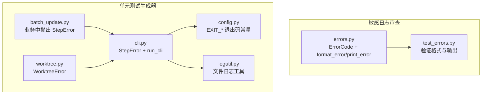
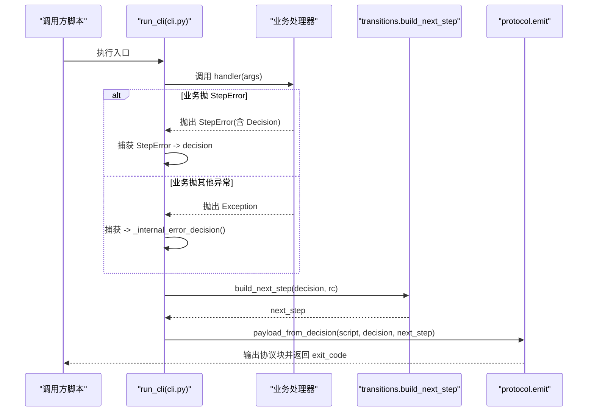
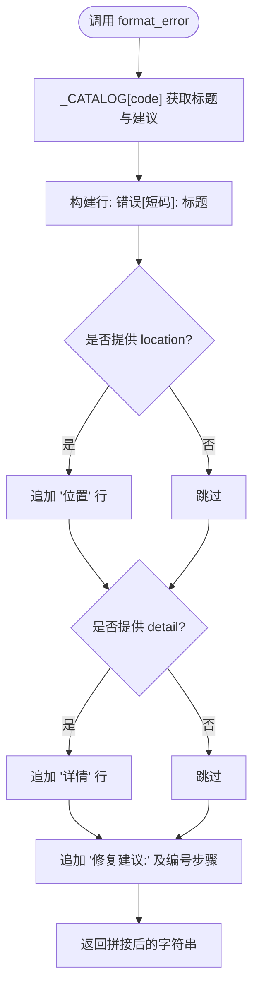
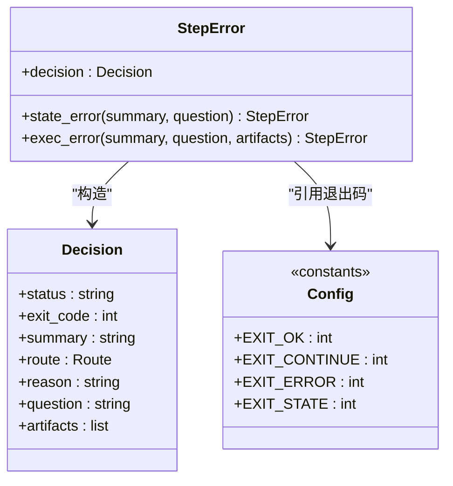
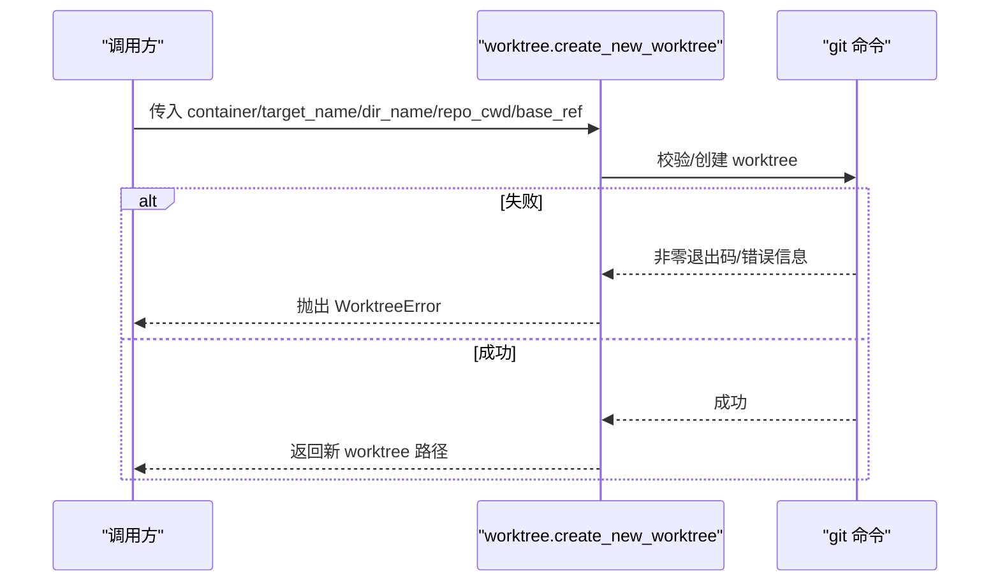
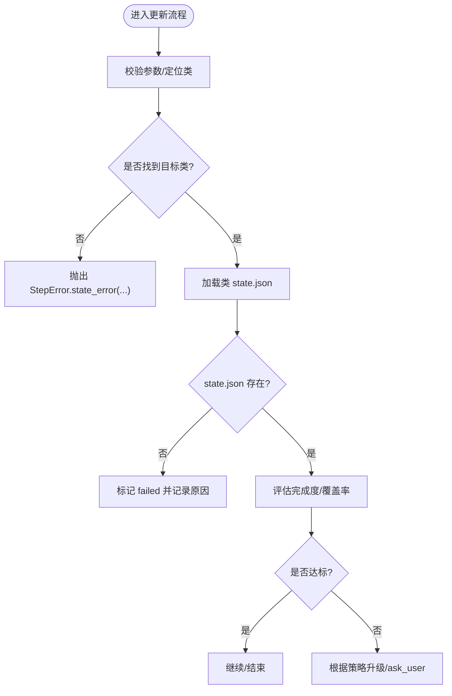
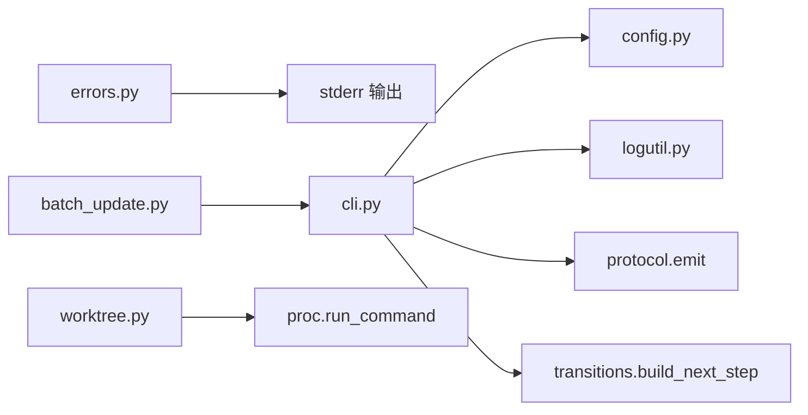

# 错误处理接口

<cite>
**本文引用的文件**
- [scripts/common/errors.py](file://sensitive-log-review/scripts/common/errors.py)
- [tests/test_errors.py](file://sensitive-log-review/tests/test_errors.py)
- [scripts/jaut/cli.py](file://batch-unit-test-generator/scripts/jaut/cli.py)
- [scripts/jaut/config.py](file://batch-unit-test-generator/scripts/jaut/config.py)
- [scripts/jaut/logutil.py](file://batch-unit-test-generator/scripts/jaut/logutil.py)
- [scripts/jaut/worktree.py](file://batch-unit-test-generator/scripts/jaut/worktree.py)
- [scripts/batch_update.py](file://batch-unit-test-generator/scripts/batch_update.py)
</cite>

## 目录
1. [简介](#简介)
2. [项目结构](#项目结构)
3. [核心组件](#核心组件)
4. [架构总览](#架构总览)
5. [详细组件分析](#详细组件分析)
6. [依赖关系分析](#依赖关系分析)
7. [性能与内存考虑](#性能与内存考虑)
8. [故障排查指南](#故障排查指南)
9. [结论](#结论)
10. [附录：错误码与消息规范](#附录错误码与消息规范)

## 简介
本文件为仓库中的“错误处理接口”提供系统化 API 文档，覆盖以下方面：
- 统一错误码、异常类与错误层次结构
- 错误捕获、处理与恢复的最佳实践
- 错误日志记录、错误报告生成与错误统计收集
- 自定义错误类型的创建方法与错误消息格式化
- 错误处理的性能影响与内存管理注意事项

该仓库包含两套互补的错误处理机制：
- 脚本级结构化错误输出（敏感日志审查工具）：通过 ErrorCode 枚举与 format_error/print_error 提供一致的用户提示。
- 协议化 CLI 错误模型（单元测试生成器）：通过 StepError 将可预期错误映射到统一的 Decision/next_step 协议，并配合退出码契约进行流程控制。

## 项目结构
错误处理相关代码主要分布在两个子项目中：
- sensitive-log-review：提供通用错误码与格式化输出，面向用户可见的 stderr 提示。
- batch-unit-test-generator/java-unit-test-generator：提供统一的 CLI 脚手架与协议化错误模型，用于自动化工作流的状态流转与上报。

图表来源
- [scripts/common/errors.py:18-99](file://sensitive-log-review/scripts/common/errors.py#L18-L99)
- [tests/test_errors.py:10-56](file://sensitive-log-review/tests/test_errors.py#L10-L56)
- [scripts/jaut/cli.py:25-129](file://batch-unit-test-generator/scripts/jaut/cli.py#L25-L129)
- [scripts/jaut/config.py:44-48](file://batch-unit-test-generator/scripts/jaut/config.py#L44-L48)
- [scripts/jaut/logutil.py:24-44](file://batch-unit-test-generator/scripts/jaut/logutil.py#L24-L44)
- [scripts/jaut/worktree.py:23-24](file://batch-unit-test-generator/scripts/jaut/worktree.py#L23-L24)
- [scripts/batch_update.py:64-110](file://batch-unit-test-generator/scripts/batch_update.py#L64-L110)

章节来源
- [scripts/common/errors.py:1-100](file://sensitive-log-review/scripts/common/errors.py#L1-L100)
- [scripts/jaut/cli.py:1-129](file://batch-unit-test-generator/scripts/jaut/cli.py#L1-L129)
- [scripts/jaut/config.py:1-181](file://batch-unit-test-generator/scripts/jaut/config.py#L1-L181)
- [scripts/jaut/logutil.py:1-75](file://batch-unit-test-generator/scripts/jaut/logutil.py#L1-L75)
- [scripts/jaut/worktree.py:1-333](file://batch-unit-test-generator/scripts/jaut/worktree.py#L1-L333)
- [scripts/batch_update.py:64-110](file://batch-unit-test-generator/scripts/batch_update.py#L64-L110)

## 核心组件
- 统一错误码与格式化输出（敏感日志审查）
  - ErrorCode 枚举：集中定义对外展示的错误短码。
  - format_error(code, location="", detail="")：组装“错误码+位置+详情+分步修复建议”的结构化文本。
  - print_error(code, location="", detail="")：将结构化错误输出至 stderr，不改变调用方退出码契约。
- 协议化 CLI 错误模型（单元测试生成器）
  - StepError：可预期错误的异常类型，内部携带 Decision，便于直接生成 next_step 协议块。
  - run_cli：统一入口，捕获 StepError 与未捕获 Exception，转换为协议块并输出，返回退出码。
  - EXIT_* 常量：标准化退出码（0/1/2/3），区分成功、继续、执行错误、状态/协议错误。
- 领域异常（git worktree）
  - WorktreeError：可预期的操作失败（参数非法、git 失败等），由上层统一转为 failed 协议块。
- 日志工具
  - logutil.setup_logger：按脚本名与工作目录创建/复用文件 logger，确保 stdout 仅承载协议输出。

章节来源
- [scripts/common/errors.py:18-99](file://sensitive-log-review/scripts/common/errors.py#L18-L99)
- [scripts/jaut/cli.py:25-129](file://batch-unit-test-generator/scripts/jaut/cli.py#L25-L129)
- [scripts/jaut/config.py:44-48](file://batch-unit-test-generator/scripts/jaut/config.py#L44-L48)
- [scripts/jaut/logutil.py:24-44](file://batch-unit-test-generator/scripts/jaut/logutil.py#L24-L44)
- [scripts/jaut/worktree.py:23-24](file://batch-unit-test-generator/scripts/jaut/worktree.py#L23-L24)

## 架构总览
错误处理在两条路径上协作：
- 用户可见的错误提示：通过 ErrorCode + format_error/print_error 输出结构化信息，便于 CI 日志解析与人工修复。
- 自动化工作流的状态流转：通过 StepError 将错误语义化为 Decision，再由 run_cli 统一产出 next_step 协议块，驱动后续步骤或请求用户输入。

图表来源
- [scripts/jaut/cli.py:95-129](file://batch-unit-test-generator/scripts/jaut/cli.py#L95-L129)

章节来源
- [scripts/jaut/cli.py:95-129](file://batch-unit-test-generator/scripts/jaut/cli.py#L95-L129)

## 详细组件分析

### 组件一：统一错误码与格式化（敏感日志审查）
- 设计要点
  - ErrorCode 枚举：每个成员对应一个对外短码（如 E001）。
  - 模板目录：_CATALOG 将错误码映射到“标题 + 分步修复建议”。
  - format_error：组合“错误[短码]: 标题”，可选“位置/详情”，以及“修复建议”列表。
  - print_error：将结果写入 stderr，保持纯文本，利于 CI 日志。
- 使用示例（以测试断言为依据）
  - 包含错误码、位置、详情、修复建议；可选部分缺失时自动省略。
  - 特定错误（规则 JSON 损坏）会提示使用 json.tool 校验。

图表来源
- [scripts/common/errors.py:31-94](file://sensitive-log-review/scripts/common/errors.py#L31-L94)

章节来源
- [scripts/common/errors.py:18-99](file://sensitive-log-review/scripts/common/errors.py#L18-L99)
- [tests/test_errors.py:10-56](file://sensitive-log-review/tests/test_errors.py#L10-L56)

### 组件二：协议化 CLI 错误模型（单元测试生成器）
- 设计要点
  - StepError：封装 Decision，支持 state_error（exit 3）与 exec_error（exit 2）。
  - run_cli：统一捕获 StepError 与未捕获异常，生成 next_step 协议块，输出后返回 exit_code。
  - EXIT_* 常量：明确退出码语义，便于上层编排。
- 错误分类与处理
  - 可预期错误：通过 StepError.state_error/exec_error 显式表达，附带 question/artifacts 等上下文。
  - 内部错误：任何未捕获异常被兜底转换为 ask_user 的 failed 决策。
  - 路由异常：build_next_step 的异常也被兜底为 ask_user，保证协议输出稳定。

图表来源
- [scripts/jaut/cli.py:25-47](file://batch-unit-test-generator/scripts/jaut/cli.py#L25-L47)
- [scripts/jaut/config.py:44-48](file://batch-unit-test-generator/scripts/jaut/config.py#L44-L48)

章节来源
- [scripts/jaut/cli.py:25-129](file://batch-unit-test-generator/scripts/jaut/cli.py#L25-L129)
- [scripts/jaut/config.py:44-48](file://batch-unit-test-generator/scripts/jaut/config.py#L44-L48)

### 组件三：领域异常 WorktreeError
- 设计要点
  - WorktreeError：表示 git worktree 操作的预期失败（参数非法、分支冲突、命令失败等）。
  - 调用方（如 select_worktree 等）在预检失败时抛出，由上层统一转为 failed 协议块。
- 典型场景
  - base_ref 无效、目标路径冲突、分支已被检出、git 命令不可用等。

图表来源
- [scripts/jaut/worktree.py:23-24](file://batch-unit-test-generator/scripts/jaut/worktree.py#L23-L24)
- [scripts/jaut/worktree.py:195-257](file://batch-unit-test-generator/scripts/jaut/worktree.py#L195-L257)

章节来源
- [scripts/jaut/worktree.py:23-24](file://batch-unit-test-generator/scripts/jaut/worktree.py#L23-L24)
- [scripts/jaut/worktree.py:195-257](file://batch-unit-test-generator/scripts/jaut/worktree.py#L195-L257)

### 组件四：业务层错误抛出模式（以 batch_update 为例）
- 设计要点
  - 业务逻辑在参数校验、状态查找失败等场景下抛出 StepError.state_error/exec_error。
  - 通过统一入口 run_cli 捕获并转化为协议块，保证上层流程一致性。
- 常见用例
  - 未找到 in_progress 类、未找到指定类、状态缺失等。

图表来源
- [scripts/batch_update.py:64-110](file://batch-unit-test-generator/scripts/batch_update.py#L64-L110)

章节来源
- [scripts/batch_update.py:64-110](file://batch-unit-test-generator/scripts/batch_update.py#L64-L110)

## 依赖关系分析
- 模块耦合
  - errors.py：独立模块，无外部依赖，仅依赖标准库 enum/sys。
  - cli.py：依赖 config、protocol、transitions、logutil、models。
  - worktree.py：依赖 config、proc，并通过上层捕获转为协议错误。
  - logutil.py：依赖 config，提供文件日志能力，避免污染 stdout。
- 外部集成点
  - protocol.emit：输出 next_step 协议块，供上层编排。
  - transitions.build_next_step：基于 Decision 计算下一步动作。
  - git/maven 等外部命令：通过 proc.run_command 执行，失败时转为领域异常或 StepError。

图表来源
- [scripts/jaut/cli.py:95-129](file://batch-unit-test-generator/scripts/jaut/cli.py#L95-L129)
- [scripts/jaut/logutil.py:24-44](file://batch-unit-test-generator/scripts/jaut/logutil.py#L24-L44)
- [scripts/jaut/worktree.py:195-257](file://batch-unit-test-generator/scripts/jaut/worktree.py#L195-L257)
- [scripts/batch_update.py:64-110](file://batch-unit-test-generator/scripts/batch_update.py#L64-L110)

章节来源
- [scripts/jaut/cli.py:95-129](file://batch-unit-test-generator/scripts/jaut/cli.py#L95-L129)
- [scripts/jaut/logutil.py:24-44](file://batch-unit-test-generator/scripts/jaut/logutil.py#L24-L44)
- [scripts/jaut/worktree.py:195-257](file://batch-unit-test-generator/scripts/jaut/worktree.py#L195-L257)
- [scripts/batch_update.py:64-110](file://batch-unit-test-generator/scripts/batch_update.py#L64-L110)

## 性能与内存考虑
- 日志 I/O
  - 文件日志采用 FileHandler，按脚本名与工作目录缓存 logger，避免重复创建 handler，减少 I/O 开销。
  - 禁止传播到根 logger，确保 stdout 仅承载协议输出，降低控制台输出干扰。
- 错误格式化
  - format_error 使用简单字符串拼接，复杂度 O(n)，n 为建议步骤数，通常很小，性能可忽略。
- 异常对象
  - StepError 仅持有 Decision 引用，内存占用低；避免在异常中携带大对象。
- 外部命令
  - worktree 与 maven/git 调用通过 proc.run_command 执行，注意超时与进程组清理，避免僵尸进程与资源泄漏。

章节来源
- [scripts/jaut/logutil.py:24-44](file://batch-unit-test-generator/scripts/jaut/logutil.py#L24-L44)
- [scripts/common/errors.py:84-94](file://sensitive-log-review/scripts/common/errors.py#L84-L94)
- [scripts/jaut/worktree.py:195-257](file://batch-unit-test-generator/scripts/jaut/worktree.py#L195-L257)

## 故障排查指南
- 常见问题与定位
  - 环境变量/依赖缺失：使用 StepError.exec_error 抛出，question 字段给出修复指引（如安装 mvn）。
  - 状态/协议错误：使用 StepError.state_error 抛出，exit_code=3，便于上层识别需要用户输入。
  - 规则文件损坏：使用 ErrorCode.E004_RULE_FILE_BROKEN，format_error 会提示使用 json.tool 校验。
  - 输出目录不可写：使用 ErrorCode.E006_OUTPUT_DIR_UNWRITABLE，提示权限与空间检查。
- 日志与报告
  - 日志文件位于 <workdir>/logs/<script>.log，便于回溯运行细节。
  - 协议块通过 stdout 输出，上层可据此判断下一步动作。
- 恢复策略
  - 对可预期错误：补充 question 与 artifacts，指导用户修正后再试。
  - 对内部错误：统一转为 ask_user，避免静默失败。

章节来源
- [scripts/jaut/cli.py:25-129](file://batch-unit-test-generator/scripts/jaut/cli.py#L25-L129)
- [scripts/common/errors.py:31-99](file://sensitive-log-review/scripts/common/errors.py#L31-L99)
- [scripts/jaut/logutil.py:24-44](file://batch-unit-test-generator/scripts/jaut/logutil.py#L24-L44)

## 结论
本仓库提供了两套互补的错误处理机制：
- 面向用户的结构化错误提示（ErrorCode + format_error/print_error），适合 CI 日志与人工修复。
- 面向自动化工作流的协议化错误模型（StepError + run_cli），将错误语义化为 Decision，驱动 next_step 流程。
结合统一的退出码契约与文件日志，可实现稳定的错误捕获、处理与恢复，同时兼顾性能与可维护性。

## 附录：错误码与消息规范
- 错误码清单（来自 ErrorCode 枚举）
  - E001_GIT_NOT_REPO：指向目录不是 git 仓库
  - E002_JAVA_NOT_FOUND：找不到 java 命令
  - E003_BRANCH_INVALID：分支名非法或不存在
  - E004_RULE_FILE_BROKEN：规则 JSON 文件损坏
  - E005_RUN_ID_INVALID：run-id 含非法字符
  - E006_OUTPUT_DIR_UNWRITABLE：输出目录不可写
  - E007_JAR_CHECKSUM_MISMATCH：checkstyle jar SHA256 校验不符
- 消息格式规范
  - 固定前缀：“错误[短码]: 标题”
  - 可选字段：“位置”、“详情”
  - 必选后缀：“修复建议:” 及编号步骤列表
- 最佳实践
  - 优先使用 ErrorCode 与 format_error/print_error 输出用户可见错误。
  - 在自动化流程中使用 StepError.state_error/exec_error 表达可预期错误，并附带 question/artifacts。
  - 避免在异常中携带大对象，必要时通过 artifacts 传递必要上下文。
  - 日志写入文件，stdout 仅输出协议块，便于上层解析。

章节来源
- [scripts/common/errors.py:18-99](file://sensitive-log-review/scripts/common/errors.py#L18-L99)
- [tests/test_errors.py:10-56](file://sensitive-log-review/tests/test_errors.py#L10-L56)
- [scripts/jaut/cli.py:25-129](file://batch-unit-test-generator/scripts/jaut/cli.py#L25-L129)
- [scripts/jaut/config.py:44-48](file://batch-unit-test-generator/scripts/jaut/config.py#L44-L48)