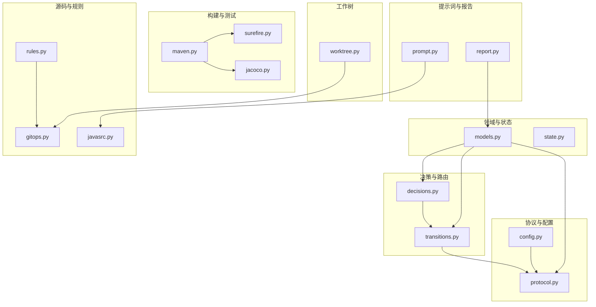
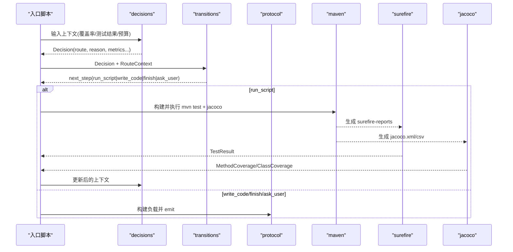
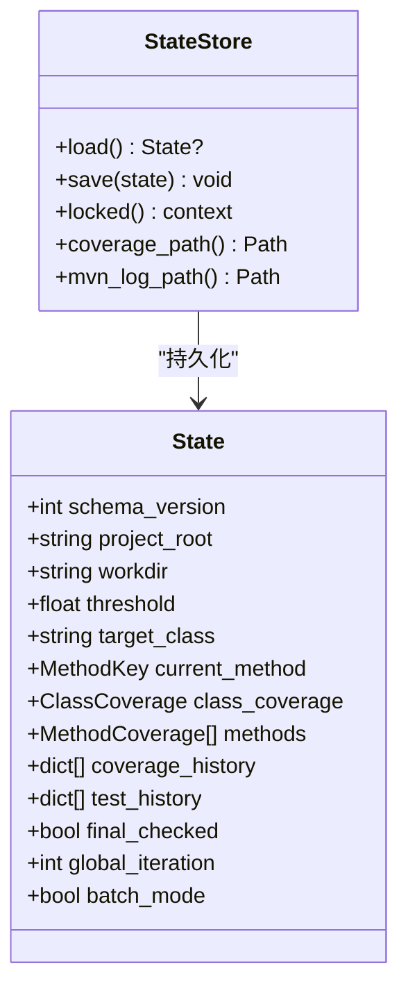
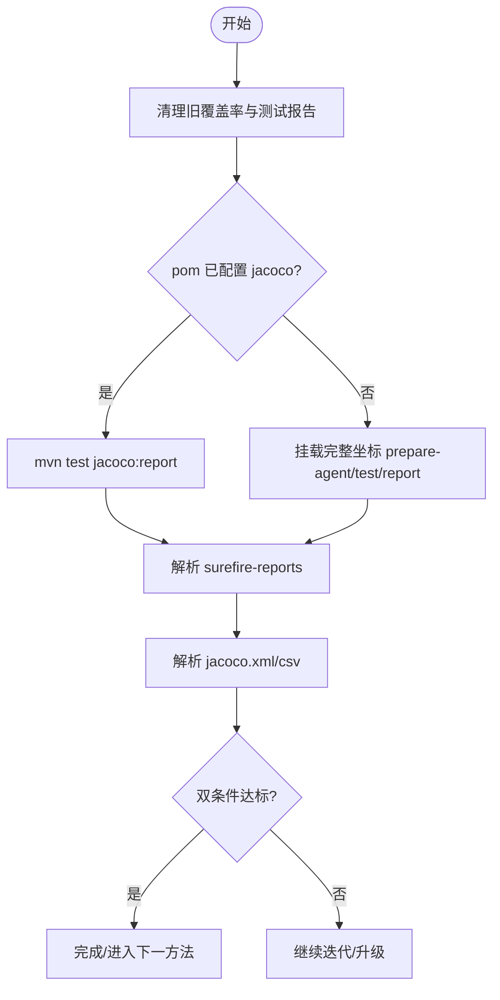
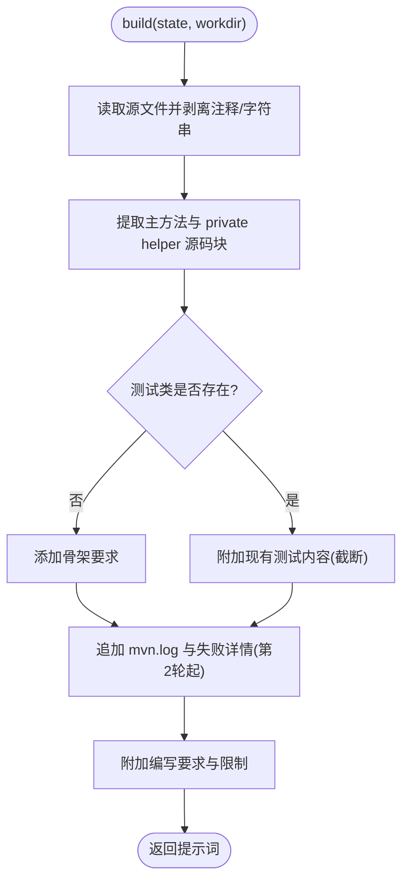
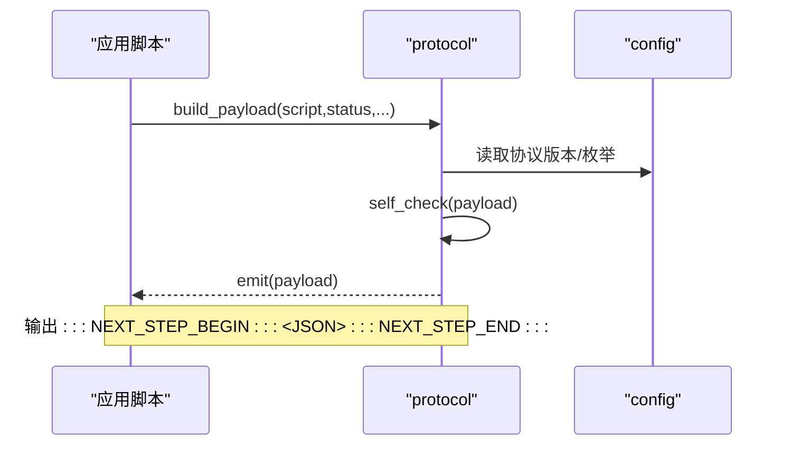
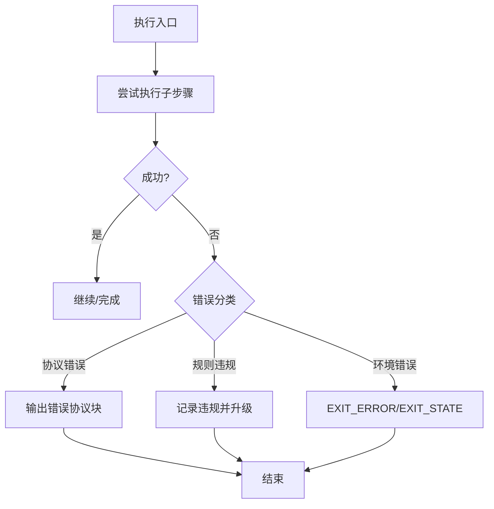
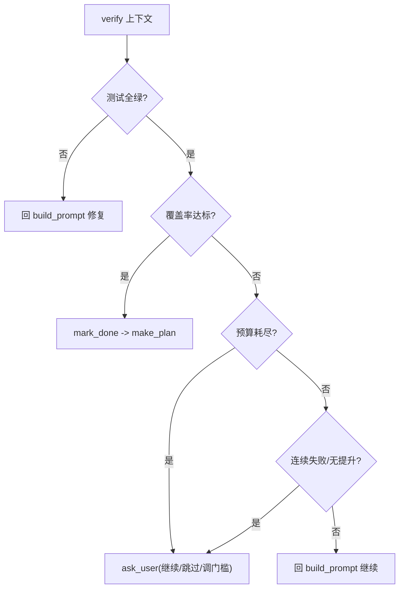
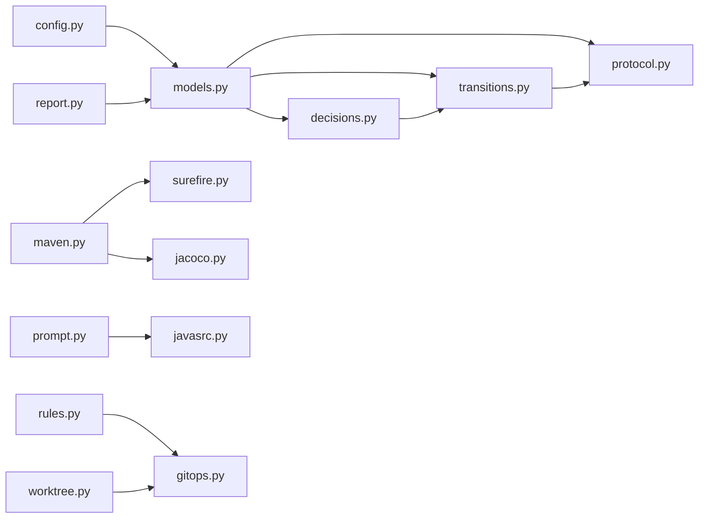

# JAut 引擎架构

<cite>
**本文引用的文件**
- [state.py](file://batch-unit-test-generator/scripts/jaut/state.py)
- [protocol.py](file://batch-unit-test-generator/scripts/jaut/protocol.py)
- [transitions.py](file://batch-unit-test-generator/scripts/jaut/transitions.py)
- [prompt.py](file://batch-unit-test-generator/scripts/jaut/prompt.py)
- [maven.py](file://batch-unit-test-generator/scripts/jaut/maven.py)
- [models.py](file://batch-unit-test-generator/scripts/jaut/models.py)
- [surefire.py](file://batch-unit-test-generator/scripts/jaut/surefire.py)
- [jacoco.py](file://batch-unit-test-generator/scripts/jaut/jacoco.py)
- [config.py](file://batch-unit-test-generator/scripts/jaut/config.py)
- [rules.py](file://batch-unit-test-generator/scripts/jaut/rules.py)
- [decisions.py](file://batch-unit-test-generator/scripts/jaut/decisions.py)
- [report.py](file://batch-unit-test-generator/scripts/jaut/report.py)
- [worktree.py](file://batch-unit-test-generator/scripts/jaut/worktree.py)
- [javasrc.py](file://batch-unit-test-generator/scripts/jaut/javasrc.py)
- [gitops.py](file://batch-unit-test-generator/scripts/jaut/gitops.py)
</cite>

## 目录
1. [简介](#简介)
2. [项目结构](#项目结构)
3. [核心组件](#核心组件)
4. [架构总览](#架构总览)
5. [详细组件分析](#详细组件分析)
6. [依赖关系分析](#依赖关系分析)
7. [性能考量](#性能考量)
8. [故障排查指南](#故障排查指南)
9. [结论](#结论)
10. [附录：扩展开发指南](#附录扩展开发指南)

## 简介
本技术文档面向 JAut 引擎，系统性阐述其状态机模式、Maven/Surefire/JaCoCo 集成、提示词构建器、协议层（NEXT_STEP）、错误处理策略与数据流。文档以代码级为依据，提供架构图、类图、时序图与流程图，帮助开发者理解并扩展该引擎。

## 项目结构
JAut 引擎位于 batch-unit-test-generator/scripts/jaut 目录下，采用“领域模块 + 工具模块”的清晰分层：
- 领域模型与状态：models.py、state.py
- 决策与路由：decisions.py、transitions.py
- 协议与输出：protocol.py、config.py
- 构建与测试：maven.py、surefire.py、jacoco.py
- 源码与规则：javasrc.py、rules.py、gitops.py
- 提示词构建：prompt.py
- 报告渲染：report.py
- 工作树隔离：worktree.py

图表来源
- [models.py:1-693](file://batch-unit-test-generator/scripts/jaut/models.py#L1-L693)
- [state.py:1-165](file://batch-unit-test-generator/scripts/jaut/state.py#L1-L165)
- [decisions.py:1-672](file://batch-unit-test-generator/scripts/jaut/decisions.py#L1-L672)
- [transitions.py:1-128](file://batch-unit-test-generator/scripts/jaut/transitions.py#L1-L128)
- [protocol.py:1-105](file://batch-unit-test-generator/scripts/jaut/protocol.py#L1-L105)
- [config.py:1-181](file://batch-unit-test-generator/scripts/jaut/config.py#L1-L181)
- [maven.py:1-641](file://batch-unit-test-generator/scripts/jaut/maven.py#L1-L641)
- [surefire.py:1-170](file://batch-unit-test-generator/scripts/jaut/surefire.py#L1-L170)
- [jacoco.py:1-248](file://batch-unit-test-generator/scripts/jaut/jacoco.py#L1-L248)
- [javasrc.py:1-397](file://batch-unit-test-generator/scripts/jaut/javasrc.py#L1-L397)
- [rules.py:1-190](file://batch-unit-test-generator/scripts/jaut/rules.py#L1-L190)
- [gitops.py:1-176](file://batch-unit-test-generator/scripts/jaut/gitops.py#L1-L176)
- [prompt.py:1-209](file://batch-unit-test-generator/scripts/jaut/prompt.py#L1-L209)
- [report.py:1-219](file://batch-unit-test-generator/scripts/jaut/report.py#L1-L219)
- [worktree.py:1-333](file://batch-unit-test-generator/scripts/jaut/worktree.py#L1-L333)

章节来源
- [config.py:12-31](file://batch-unit-test-generator/scripts/jaut/config.py#L12-L31)
- [state.py:1-165](file://batch-unit-test-generator/scripts/jaut/state.py#L1-L165)

## 核心组件
- 状态机与持久化：StateStore 原子读写 state.json，支持 schema 迁移与跨进程锁；State 承载方法覆盖率、迭代预算、历史轨迹等。
- 决策与路由：decisions 纯函数产出 Decision；transitions 将 Route 解析为 next_step（run_script/write_code/finish/ask_user）。
- 协议层：protocol 统一构建 NEXT_STEP 负载并通过 stdout 标记输出，具备轻量自检与失败兜底。
- 构建与测试：maven 负责命令构建、清理与执行；surefire 解析测试结果；jacoco 解析覆盖率。
- 提示词构建：prompt.PromptBuilder 按 state 动态组装 LLM 提示词，包含规则引用、源码片段与失败信息。
- 规则校验：rules 实现硬规则 c/d，基于正则与 git 基线判定违规。
- 工作树隔离：worktree 管理 git worktree 生命周期，避免并发冲突。

章节来源
- [state.py:77-165](file://batch-unit-test-generator/scripts/jaut/state.py#L77-L165)
- [models.py:353-517](file://batch-unit-test-generator/scripts/jaut/models.py#L353-L517)
- [decisions.py:183-343](file://batch-unit-test-generator/scripts/jaut/decisions.py#L183-L343)
- [transitions.py:41-128](file://batch-unit-test-generator/scripts/jaut/transitions.py#L41-L128)
- [protocol.py:22-105](file://batch-unit-test-generator/scripts/jaut/protocol.py#L22-L105)
- [maven.py:248-414](file://batch-unit-test-generator/scripts/jaut/maven.py#L248-L414)
- [surefire.py:45-93](file://batch-unit-test-generator/scripts/jaut/surefire.py#L45-L93)
- [jacoco.py:74-181](file://batch-unit-test-generator/scripts/jaut/jacoco.py#L74-L181)
- [prompt.py:20-62](file://batch-unit-test-generator/scripts/jaut/prompt.py#L20-L62)
- [rules.py:79-180](file://batch-unit-test-generator/scripts/jaut/rules.py#L79-L180)
- [worktree.py:157-257](file://batch-unit-test-generator/scripts/jaut/worktree.py#L157-L257)

## 架构总览
JAut 引擎围绕“状态机 + 决策 + 协议”的闭环运行：
- 入口脚本读取 State，调用 decisions 生成 Decision，再由 transitions 转换为 next_step。
- run_script 路由触发 maven/surefire/jacoco 流程，结果回写 State 并再次决策。
- write_code/finish/ask_user 路由直接驱动 LLM 或用户交互。
- protocol 将最终负载通过 stdout 输出给编排器/LLM。

图表来源
- [decisions.py:183-343](file://batch-unit-test-generator/scripts/jaut/decisions.py#L183-L343)
- [transitions.py:41-128](file://batch-unit-test-generator/scripts/jaut/transitions.py#L41-L128)
- [protocol.py:22-105](file://batch-unit-test-generator/scripts/jaut/protocol.py#L22-L105)
- [maven.py:248-414](file://batch-unit-test-generator/scripts/jaut/maven.py#L248-L414)
- [surefire.py:45-93](file://batch-unit-test-generator/scripts/jaut/surefire.py#L45-L93)
- [jacoco.py:74-181](file://batch-unit-test-generator/scripts/jaut/jacoco.py#L74-L181)

## 详细组件分析

### 状态机模式：State 模型定义、转换规则与持久化
- State 模型集中表达目标类、阈值、当前方法、覆盖率轨迹、预算与批量模式字段，并提供 to_dict/from_dict 兼容旧版本。
- StateStore 提供原子写入（临时文件 + os.replace + fsync）与跨进程独占锁（POSIX fcntl / Windows msvcrt），确保断点续跑安全。
- Schema 迁移管道：_migrate 按 STATE_SCHEMA_VERSION 顺序升级，缺失迁移函数会抛出明确错误。

图表来源
- [models.py:353-517](file://batch-unit-test-generator/scripts/jaut/models.py#L353-L517)
- [state.py:77-165](file://batch-unit-test-generator/scripts/jaut/state.py#L77-L165)

章节来源
- [state.py:55-74](file://batch-unit-test-generator/scripts/jaut/state.py#L55-L74)
- [state.py:93-128](file://batch-unit-test-generator/scripts/jaut/state.py#L93-L128)
- [state.py:130-165](file://batch-unit-test-generator/scripts/jaut/state.py#L130-L165)
- [models.py:353-517](file://batch-unit-test-generator/scripts/jaut/models.py#L353-L517)

### Maven/Surefire/JaCoCo 集成：构建流程控制、测试监控与覆盖率解析
- 构建命令：根据 pom 是否内置 jacoco-maven-plugin 选择不同策略；多模块时加 -pl/-am；始终附加忽略测试失败的标志以保证覆盖率产出。
- 快速路径：fast-single-cov.sh 优先执行；失败时依据日志关键字判断是否降级到 mvn test jacoco:report。
- 报告清理：每次执行前清理 target/site/jacoco 与 target/surefire-reports，防止陈旧数据污染。
- 结果解析：surefire 解析 XML/txt，fail-closed 语义保证不可信报告视为失败；jacoco 解析 XML/CSV，聚合内部类并按 excludes 过滤。

图表来源
- [maven.py:248-414](file://batch-unit-test-generator/scripts/jaut/maven.py#L248-L414)
- [maven.py:601-641](file://batch-unit-test-generator/scripts/jaut/maven.py#L601-L641)
- [surefire.py:45-93](file://batch-unit-test-generator/scripts/jaut/surefire.py#L45-L93)
- [jacoco.py:74-181](file://batch-unit-test-generator/scripts/jaut/jacoco.py#L74-L181)

章节来源
- [maven.py:248-414](file://batch-unit-test-generator/scripts/jaut/maven.py#L248-L414)
- [maven.py:601-641](file://batch-unit-test-generator/scripts/jaut/maven.py#L601-L641)
- [surefire.py:45-93](file://batch-unit-test-generator/scripts/jaut/surefire.py#L45-L93)
- [jacoco.py:74-181](file://batch-unit-test-generator/scripts/jaut/jacoco.py#L74-L181)

### 提示词构建器：动态生成优化的 AI 提示
PromptBuilder 按分节组装提示词：
- 标题与门槛：目标类与方法、轮次、当前覆盖率。
- 规则引用：references/UnitTestRules.md 绝对路径与关键规则摘要。
- 源码抽取：主方法与被调用的 private 方法源码块（宁多勿漏）。
- 现有测试与骨架：若测试类不存在则给出骨架要求；第2轮起附带上一轮 mvn.log 与失败详情。
- 编写约束：仅修改测试文件、异常用 assertThrows、禁止容器测试等。

图表来源
- [prompt.py:20-62](file://batch-unit-test-generator/scripts/jaut/prompt.py#L20-L62)
- [prompt.py:69-187](file://batch-unit-test-generator/scripts/jaut/prompt.py#L69-L187)
- [javasrc.py:198-294](file://batch-unit-test-generator/scripts/jaut/javasrc.py#L198-L294)

章节来源
- [prompt.py:20-62](file://batch-unit-test-generator/scripts/jaut/prompt.py#L20-L62)
- [prompt.py:69-187](file://batch-unit-test-generator/scripts/jaut/prompt.py#L69-L187)
- [javasrc.py:198-294](file://batch-unit-test-generator/scripts/jaut/javasrc.py#L198-L294)

### 协议层：NEXT_STEP 协议的遵循与扩展机制
- 负载构建：build_payload 统一字段顺序与缺省值；payload_from_decision 由 Decision 组装。
- 轻量自检：self_check 校验必填键与枚举取值，非法仅告警不阻断。
- 输出规范：emit 在 stdout 输出标记包裹的 JSON 块；序列化失败时输出错误协议块，避免调用方无限等待。
- 扩展点：config.NEXT_STEP_TYPES/NEXT_STEP_STATUSES 集中声明类型与状态；新增类型需在 transitions 中映射。

图表来源
- [protocol.py:22-105](file://batch-unit-test-generator/scripts/jaut/protocol.py#L22-L105)
- [config.py:35-48](file://batch-unit-test-generator/scripts/jaut/config.py#L35-L48)

章节来源
- [protocol.py:22-105](file://batch-unit-test-generator/scripts/jaut/protocol.py#L22-L105)
- [config.py:35-48](file://batch-unit-test-generator/scripts/jaut/config.py#L35-L48)

### 错误处理策略：StepError 分类与统一恢复
- 退出码契约：EXIT_OK/EXIT_CONTINUE/EXIT_ERROR/EXIT_STATE 明确脚本执行语义。
- 协议错误兜底：emit 序列化失败时输出最小错误协议块，避免死循环。
- 规则违规：rules 将违规抽象为 Violation，run_hard_rules 汇总；入口脚本可据此升级或终止。
- 工作树错误：WorktreeError 封装 git 操作失败，入口脚本将其转为 failed 协议块。

图表来源
- [config.py:44-48](file://batch-unit-test-generator/scripts/jaut/config.py#L44-L48)
- [protocol.py:74-105](file://batch-unit-test-generator/scripts/jaut/protocol.py#L74-L105)
- [rules.py:39-190](file://batch-unit-test-generator/scripts/jaut/rules.py#L39-L190)
- [worktree.py:23-27](file://batch-unit-test-generator/scripts/jaut/worktree.py#L23-L27)

章节来源
- [config.py:44-48](file://batch-unit-test-generator/scripts/jaut/config.py#L44-L48)
- [protocol.py:74-105](file://batch-unit-test-generator/scripts/jaut/protocol.py#L74-L105)
- [rules.py:39-190](file://batch-unit-test-generator/scripts/jaut/rules.py#L39-L190)
- [worktree.py:23-27](file://batch-unit-test-generator/scripts/jaut/worktree.py#L23-L27)

### 决策与路由：状态机转换规则
- decide_after_init：基线/终验门槛判定，决定 finish/make_plan/ask_user。
- decide_after_plan：队列推进、终验与收尾。
- decide_after_verify：单方法迭代双条件（覆盖率+测试全绿）判定与升级策略（预算耗尽/连续失败/无提升）。
- transitions：将 Route 解析为 next_step，补全脚本绝对路径与参数（含 --workdir）。

图表来源
- [decisions.py:183-343](file://batch-unit-test-generator/scripts/jaut/decisions.py#L183-L343)
- [transitions.py:41-128](file://batch-unit-test-generator/scripts/jaut/transitions.py#L41-L128)

章节来源
- [decisions.py:183-343](file://batch-unit-test-generator/scripts/jaut/decisions.py#L183-L343)
- [transitions.py:41-128](file://batch-unit-test-generator/scripts/jaut/transitions.py#L41-L128)

## 依赖关系分析
- 低耦合高内聚：models 仅依赖 config；其他模块通过 models 传递领域对象，避免散落 dict。
- 外部依赖：maven/surefire/jacoco 通过命令行与文件系统交互；git 通过 proc.run_command 调用。
- 潜在循环：decisions 与 transitions 解耦（Decision 纯数据，transitions 解析），避免循环依赖。

图表来源
- [config.py:1-181](file://batch-unit-test-generator/scripts/jaut/config.py#L1-L181)
- [models.py:1-693](file://batch-unit-test-generator/scripts/jaut/models.py#L1-L693)
- [decisions.py:1-672](file://batch-unit-test-generator/scripts/jaut/decisions.py#L1-L672)
- [transitions.py:1-128](file://batch-unit-test-generator/scripts/jaut/transitions.py#L1-L128)
- [protocol.py:1-105](file://batch-unit-test-generator/scripts/jaut/protocol.py#L1-L105)
- [maven.py:1-641](file://batch-unit-test-generator/scripts/jaut/maven.py#L1-L641)
- [surefire.py:1-170](file://batch-unit-test-generator/scripts/jaut/surefire.py#L1-L170)
- [jacoco.py:1-248](file://batch-unit-test-generator/scripts/jaut/jacoco.py#L1-L248)
- [prompt.py:1-209](file://batch-unit-test-generator/scripts/jaut/prompt.py#L1-L209)
- [javasrc.py:1-397](file://batch-unit-test-generator/scripts/jaut/javasrc.py#L1-L397)
- [rules.py:1-190](file://batch-unit-test-generator/scripts/jaut/rules.py#L1-L190)
- [gitops.py:1-176](file://batch-unit-test-generator/scripts/jaut/gitops.py#L1-L176)
- [report.py:1-219](file://batch-unit-test-generator/scripts/jaut/report.py#L1-L219)
- [worktree.py:1-333](file://batch-unit-test-generator/scripts/jaut/worktree.py#L1-L333)

章节来源
- [models.py:1-693](file://batch-unit-test-generator/scripts/jaut/models.py#L1-L693)
- [config.py:1-181](file://batch-unit-test-generator/scripts/jaut/config.py#L1-L181)

## 性能考量
- Maven 超时与进度：mvn_timeout() 支持环境变量覆盖；MVN_PROGRESS_INTERVAL_SECONDS 定期输出进度，避免误判无响应。
- 缓存 JaCoCo 配置：parse_jacoco_config 使用 pom.xml mtime 缓存，减少全树扫描开销。
- 快速覆盖率路径：fast-single-cov.sh 优先执行，失败时智能降级，兼顾速度与鲁棒性。
- 报告清理：clean_jacoco_dirs/clean_surefire_dirs 避免陈旧数据导致的重复计算与误判。

章节来源
- [config.py:82-97](file://batch-unit-test-generator/scripts/jaut/config.py#L82-L97)
- [maven.py:167-197](file://batch-unit-test-generator/scripts/jaut/maven.py#L167-L197)
- [maven.py:326-414](file://batch-unit-test-generator/scripts/jaut/maven.py#L326-L414)
- [maven.py:601-641](file://batch-unit-test-generator/scripts/jaut/maven.py#L601-L641)

## 故障排查指南
- 协议输出问题：检查 emit 是否被后续打印干扰；确认 NEXT_STEP 标记完整。
- 覆盖率数据异常：确认 clean_jacoco_dirs 是否成功；检查 jacoco.xml/csv 是否存在；excludes 是否误匹配。
- 测试报告不可信：surefire 报告缺失/解析失败计入 parse_errors；清理失败时按不绿计。
- 规则违规：查看 Violation 列表，定位 catch/裸 try 或 src/main/java 变更；必要时调整基线或使用豁免。
- 工作树冲突：预检分支检出冲突；清理历史 worktree 后重试。

章节来源
- [protocol.py:74-105](file://batch-unit-test-generator/scripts/jaut/protocol.py#L74-L105)
- [jacoco.py:74-181](file://batch-unit-test-generator/scripts/jaut/jacoco.py#L74-L181)
- [surefire.py:45-93](file://batch-unit-test-generator/scripts/jaut/surefire.py#L45-L93)
- [rules.py:79-190](file://batch-unit-test-generator/scripts/jaut/rules.py#L79-L190)
- [worktree.py:157-257](file://batch-unit-test-generator/scripts/jaut/worktree.py#L157-L257)

## 结论
JAut 引擎通过清晰的状态机设计、严格的协议约束与健壮的构建/测试/覆盖率链路，实现了自动化单元测试生成的闭环。决策与路由解耦、错误处理兜底完善、性能优化到位，便于扩展新规则与新工具链。

## 附录：扩展开发指南
- 添加新的检查规则：
  - 在 rules.py 中实现 Rule 协议（id + check），注册到 HARD_RULES。
  - 如需 git 基线对比，复用 gitops.git_changed_paths/file_content_hash。
  - 入口 validate_rules 无需改动即可生效新规则。
- 集成新的工具链：
  - 在 maven.py 中新增命令构建与执行逻辑，遵循 MVN_ALWAYS_FLAGS 与超时策略。
  - 若工具输出格式不同，新增解析器并接入 decisions/surefire/jacoco 的数据模型。
  - 在 transitions 中新增 Route 映射，并在 _ROUTE_SCRIPT/_params_for 中补充脚本与参数。
- 扩展 NEXT_STEP 协议：
  - 在 config 中新增类型/状态；在 transitions 中映射；在 protocol.self_check 中增加校验。
- 工作树扩展：
  - 复用 worktree.preflight_new_worktree/create_new_worktree/clear_all_worktrees，确保预检与清理顺序正确。

章节来源
- [rules.py:69-190](file://batch-unit-test-generator/scripts/jaut/rules.py#L69-L190)
- [gitops.py:25-156](file://batch-unit-test-generator/scripts/jaut/gitops.py#L25-L156)
- [maven.py:248-414](file://batch-unit-test-generator/scripts/jaut/maven.py#L248-L414)
- [transitions.py:22-128](file://batch-unit-test-generator/scripts/jaut/transitions.py#L22-L128)
- [config.py:35-48](file://batch-unit-test-generator/scripts/jaut/config.py#L35-L48)
- [worktree.py:157-257](file://batch-unit-test-generator/scripts/jaut/worktree.py#L157-L257)