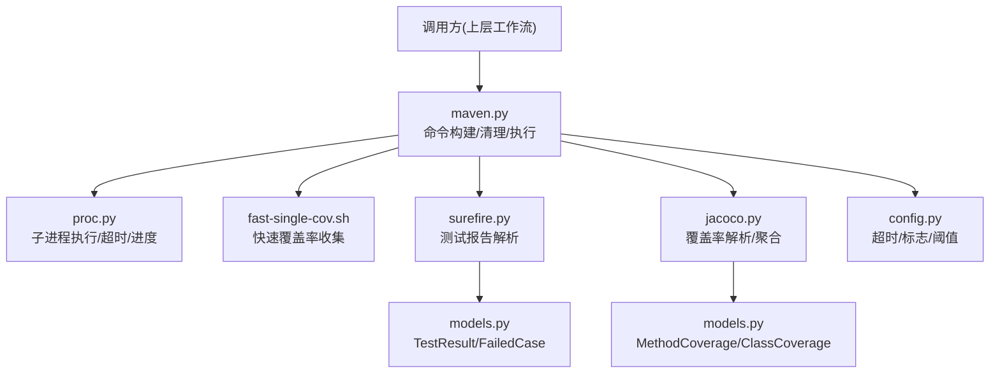
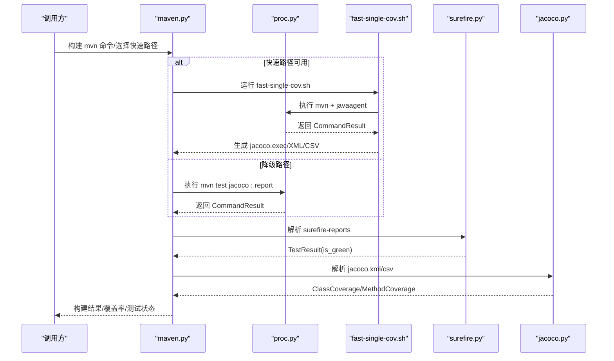
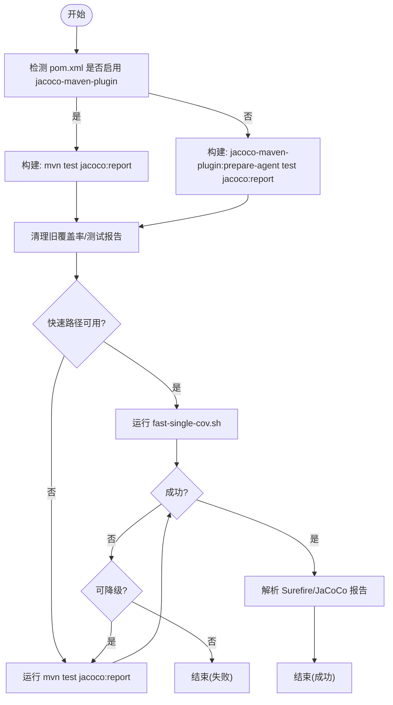
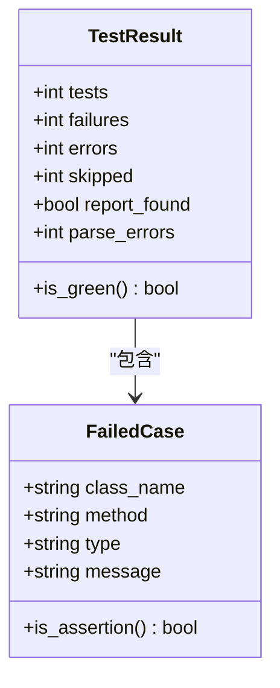
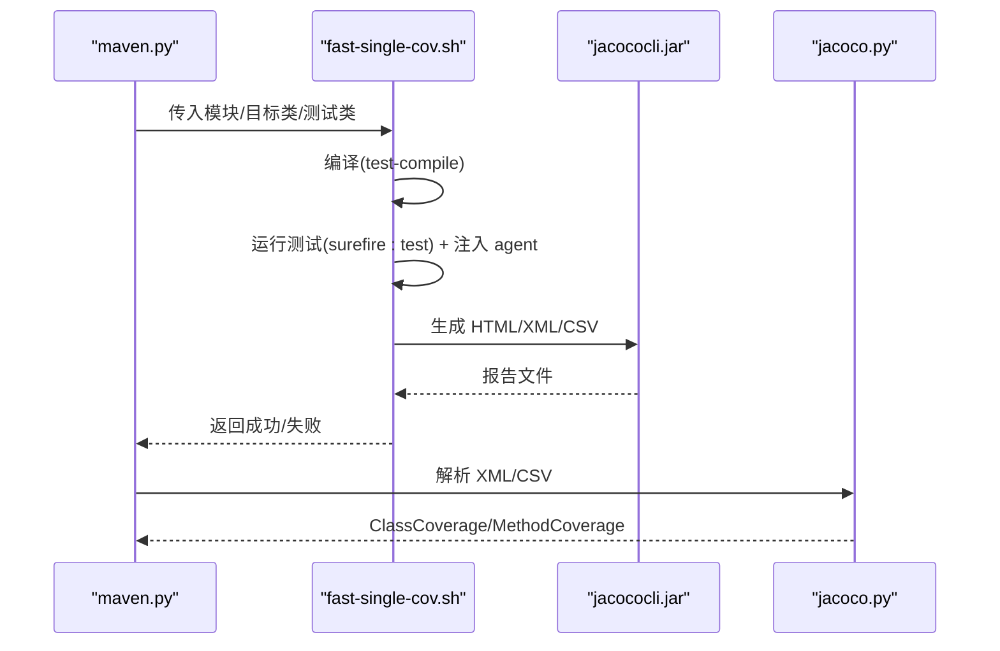
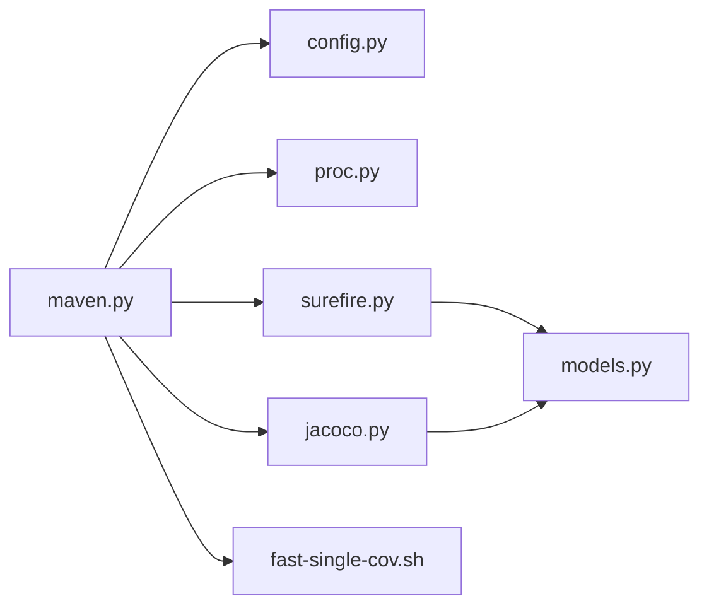

# Maven 集成层

<cite>
**本文引用的文件**
- [maven.py](file://batch-unit-test-generator/scripts/jaut/maven.py)
- [surefire.py](file://batch-unit-test-generator/scripts/jaut/surefire.py)
- [jacoco.py](file://batch-unit-test-generator/scripts/jaut/jacoco.py)
- [config.py](file://batch-unit-test-generator/scripts/jaut/config.py)
- [proc.py](file://batch-unit-test-generator/scripts/jaut/proc.py)
- [fast-single-cov.sh](file://batch-unit-test-generator/scripts/jacoco/fast-single-cov.sh)
- [models.py](file://batch-unit-test-generator/scripts/jaut/models.py)
</cite>

## 目录
1. [简介](#简介)
2. [项目结构](#项目结构)
3. [核心组件](#核心组件)
4. [架构总览](#架构总览)
5. [详细组件分析](#详细组件分析)
6. [依赖关系分析](#依赖关系分析)
7. [性能考虑](#性能考虑)
8. [故障排查指南](#故障排查指南)
9. [结论](#结论)
10. [附录](#附录)

## 简介
本技术文档面向 JAut 引擎的 Maven 集成层，系统性说明构建流程自动化控制、Surefire 测试执行与结果判定、JaCoCo 覆盖率采集与分析、环境配置管理、错误处理策略以及性能优化建议。目标是帮助读者在不深入源码的情况下，理解从命令构建到报告产出的完整链路，并掌握关键调优与排错方法。

## 项目结构
JAut 的 Maven 集成层由 Python 模块与辅助脚本组成：
- maven.py：Maven 命令构建、多模块探测、Jacoco/Surefire 清理、降级执行等。
- surefire.py：解析 Surefire 测试结果（XML/TXT），聚合多模块结果，提供“失败即不通过”的判定。
- jacoco.py：解析 JaCoCo XML/CSV，计算类级与方法级覆盖率，支持排除规则与多模块聚合。
- config.py：全局常量与配置（超时、默认参数、阈值、路径模板等）。
- proc.py：子进程统一执行入口，负责流式日志、超时终止、进度上报。
- fast-single-cov.sh：快速单类覆盖率脚本，直接调用 JaCoCo agent 与 CLI 生成报告。
- models.py：领域模型（覆盖率原语、方法/类覆盖率、测试轮次结果等）。

图表来源
- [maven.py:248-323](file://batch-unit-test-generator/scripts/jaut/maven.py#L248-L323)
- [proc.py:151-255](file://batch-unit-test-generator/scripts/jaut/proc.py#L151-L255)
- [fast-single-cov.sh:121-187](file://batch-unit-test-generator/scripts/jacoco/fast-single-cov.sh#L121-L187)
- [surefire.py:45-93](file://batch-unit-test-generator/scripts/jaut/surefire.py#L45-L93)
- [jacoco.py:71-181](file://batch-unit-test-generator/scripts/jaut/jacoco.py#L71-L181)
- [config.py:81-118](file://batch-unit-test-generator/scripts/jaut/config.py#L81-L118)
- [models.py:24-29](file://batch-unit-test-generator/scripts/jaut/models.py#L24-L29)

章节来源
- [maven.py:1-10](file://batch-unit-test-generator/scripts/jaut/maven.py#L1-L10)
- [config.py:81-118](file://batch-unit-test-generator/scripts/jaut/config.py#L81-L118)

## 核心组件
- Maven 命令构建与执行
  - 自动检测 pom.xml 是否已启用 jacoco-maven-plugin；未启用则通过完整坐标挂载 prepare-agent/report。
  - 支持单模块与多模块（-pl/-am）；强制附加 MVN_ALWAYS_FLAGS 保证失败仍产出覆盖率。
  - 提供 run_mvn_test_with_jacoco 降级方案，当快速路径失败时回退到标准 Maven 流程。
- Surefire 测试报告解析
  - 优先解析 TEST-*.xml，回退 *.txt；聚合多模块结果；fail-closed 语义确保缺失/不可解析/存在失败均视为不通过。
- JaCoCo 覆盖率解析
  - 解析 jacoco.xml（方法级行覆盖率）与 jacoco.csv（类级行覆盖率，含内部类聚合）；支持 excludes 模式匹配。
  - 提供多模块聚合能力，统一输出 ClassCoverage/MethodCoverage。
- 子进程执行与超时控制
  - 统一 run_command 接口；capture=False 流式写日志；两段式终止（SIGTERM -> 宽限 -> SIGKILL）；进度文件定期更新。
- 配置与环境
  - 集中定义超时、默认参数、阈值、路径模板；mvn_timeout 可由环境变量覆盖。

章节来源
- [maven.py:248-323](file://batch-unit-test-generator/scripts/jaut/maven.py#L248-L323)
- [surefire.py:45-93](file://batch-unit-test-generator/scripts/jaut/surefire.py#L45-L93)
- [jacoco.py:71-181](file://batch-unit-test-generator/scripts/jaut/jacoco.py#L71-L181)
- [proc.py:151-255](file://batch-unit-test-generator/scripts/jaut/proc.py#L151-L255)
- [config.py:81-118](file://batch-unit-test-generator/scripts/jaut/config.py#L81-L118)

## 架构总览
下图展示从命令构建到报告产出的端到端流程，包括快速路径与降级路径、Surefire 与 JaCoCo 的报告生成与解析。

图表来源
- [maven.py:326-414](file://batch-unit-test-generator/scripts/jaut/maven.py#L326-L414)
- [proc.py:151-255](file://batch-unit-test-generator/scripts/jaut/proc.py#L151-L255)
- [fast-single-cov.sh:121-187](file://batch-unit-test-generator/scripts/jacoco/fast-single-cov.sh#L121-L187)
- [surefire.py:45-93](file://batch-unit-test-generator/scripts/jaut/surefire.py#L45-L93)
- [jacoco.py:71-181](file://batch-unit-test-generator/scripts/jaut/jacoco.py#L71-L181)

## 详细组件分析

### Maven 命令构建与执行
- 命令构建规则
  - 若 pom.xml 已启用 jacoco-maven-plugin，则使用 test + jacoco:report；否则通过完整坐标挂载 prepare-agent + report。
  - 必须指定 -Dtest=...；多模块且指定模块时加 -pl <module>，可选 -am 编译依赖。
  - 始终附加 MVN_ALWAYS_FLAGS，确保即使测试失败也产出覆盖率，最终以 Surefire 结果为唯一判定依据。
- 清理旧产物
  - 执行前清理 target/site/jacoco 与 target/jacoco.exec，避免读取历史数据导致误判。
  - 清理 target/surefire-reports，防止上一轮陈旧测试结果影响本轮判定。
- 快速路径与降级
  - 优先使用 fast-single-cov.sh 获取单类覆盖率；失败时根据日志关键字判断是否值得降级。
  - 降级方案：run_mvn_test_with_jacoco，构造 mvn test jacoco:report 并执行。

图表来源
- [maven.py:248-323](file://batch-unit-test-generator/scripts/jaut/maven.py#L248-L323)
- [maven.py:326-414](file://batch-unit-test-generator/scripts/jaut/maven.py#L326-L414)
- [maven.py:601-640](file://batch-unit-test-generator/scripts/jaut/maven.py#L601-L640)

章节来源
- [maven.py:248-323](file://batch-unit-test-generator/scripts/jaut/maven.py#L248-L323)
- [maven.py:326-414](file://batch-unit-test-generator/scripts/jaut/maven.py#L326-L414)
- [maven.py:601-640](file://batch-unit-test-generator/scripts/jaut/maven.py#L601-L640)

### Surefire 测试发现、执行监控与结果收集
- 报告解析
  - 优先解析 TEST-*.xml（testsuite 计数属性 + testcase 的 failure/error），无 XML 时回退 *.txt。
  - 无法解析的报告计入 parse_errors，按失败计（fail-closed）。
- 多模块聚合
  - aggregate_surefire_reports 遍历各模块 surefire-reports，合并为全模块 TestResult。
- 判定策略
  - is_green() 采用 fail-closed：报告缺失/不可解析/存在失败用例一律按不绿计，防止绕过双条件闸门。

图表来源
- [surefire.py:45-93](file://batch-unit-test-generator/scripts/jaut/surefire.py#L45-L93)
- [surefire.py:96-170](file://batch-unit-test-generator/scripts/jaut/surefire.py#L96-L170)
- [models.py:103-120](file://batch-unit-test-generator/scripts/jaut/models.py#L103-L120)

章节来源
- [surefire.py:45-93](file://batch-unit-test-generator/scripts/jaut/surefire.py#L45-L93)
- [surefire.py:96-170](file://batch-unit-test-generator/scripts/jaut/surefire.py#L96-L170)
- [models.py:103-120](file://batch-unit-test-generator/scripts/jaut/models.py#L103-L120)

### JaCoCo 覆盖率数据采集、分析与报告生成
- 数据采集
  - 快速路径：fast-single-cov.sh 使用绝对路径的 jacocoagent.jar 注入 JVM，运行测试后生成 jacoco.exec。
  - 降级路径：通过 jacoco-maven-plugin 自动注入 agent，执行 mvn test jacoco:report。
- 报告生成
  - 快速路径：java -jar jacococli.jar report 生成 HTML/XML/CSV。
  - 降级路径：Maven 插件生成相同产物。
- 覆盖率解析
  - 解析 jacoco.xml（方法级行覆盖率）与 jacoco.csv（类级行覆盖率，含内部类聚合）。
  - 支持 excludes 模式匹配（fnmatchcase），在内部类聚合之前按完整类名匹配。
  - 多模块聚合：aggregate_class_coverage/aggregate_jacoco_xml 汇总各模块数据。

图表来源
- [fast-single-cov.sh:121-187](file://batch-unit-test-generator/scripts/jacoco/fast-single-cov.sh#L121-L187)
- [jacoco.py:71-181](file://batch-unit-test-generator/scripts/jaut/jacoco.py#L71-L181)
- [maven.py:326-414](file://batch-unit-test-generator/scripts/jaut/maven.py#L326-L414)

章节来源
- [fast-single-cov.sh:121-187](file://batch-unit-test-generator/scripts/jacoco/fast-single-cov.sh#L121-L187)
- [jacoco.py:71-181](file://batch-unit-test-generator/scripts/jaut/jacoco.py#L71-L181)
- [maven.py:326-414](file://batch-unit-test-generator/scripts/jaut/maven.py#L326-L414)

### 构建过程的环境配置管理
- Java/Maven 版本检测
  - 通过 resolve_tool("mvn") 定位 Maven；若不存在记录错误并返回 None。
- Maven 参数优化
  - 始终附加 MVN_ALWAYS_FLAGS：忽略测试失败、允许无测试、禁用因无指定测试而失败。
  - 多模块场景按需添加 -pl/-am；预装依赖后可跳过 -am 提升性能。
- 内存与超时配置
  - mvn_timeout 可通过 JAVA_UT_MVN_TIMEOUT 环境变量覆盖；默认 1800 秒。
  - 两段式终止：SIGTERM 宽限 MVN_KILL_GRACE_SECONDS 秒后升级为 SIGKILL。
  - POST_EOF_WAIT_SECONDS 等待进程退出，避免孤儿进程。

章节来源
- [proc.py:332-339](file://batch-unit-test-generator/scripts/jaut/proc.py#L332-L339)
- [config.py:81-118](file://batch-unit-test-generator/scripts/jaut/config.py#L81-L118)

### 错误处理策略
- 构建失败重试
  - 快速路径失败时，根据日志关键字判断是否值得降级；可恢复失败（如 exec 未生成）将回退到标准 Maven 流程。
- 超时控制
  - 统一通过 run_command 设置 timeout；超时后两段式终止并写入 [TIMEOUT] 标记。
- 日志收集机制
  - capture=False 流式写日志文件；失败时备份快速路径日志（.fast-single-cov.log）便于排查。
  - 进度文件 mvn_progress.json 定期更新，防止主 Agent 误判进程无响应。

章节来源
- [maven.py:427-533](file://batch-unit-test-generator/scripts/jaut/maven.py#L427-L533)
- [proc.py:151-255](file://batch-unit-test-generator/scripts/jaut/proc.py#L151-L255)

### 性能优化建议
- 并行构建
  - 多模块场景可使用 -pl m1,m2 -am 一次性安装/测试多个模块，减少多次启动开销。
- 增量编译
  - 预装依赖模块（install -DskipTests）后，后续构建可跳过 -am，仅编译当前模块。
- 缓存策略
  - jacoco 配置缓存：基于 pom.xml 修改时间（mtime）失效检测，避免重复扫描。
  - 清理旧产物：执行前清理 target/site/jacoco 与 target/jacoco.exec，避免误读历史数据。

章节来源
- [maven.py:87-197](file://batch-unit-test-generator/scripts/jaut/maven.py#L87-L197)
- [maven.py:539-594](file://batch-unit-test-generator/scripts/jaut/maven.py#L539-L594)
- [maven.py:601-640](file://batch-unit-test-generator/scripts/jaut/maven.py#L601-L640)

## 依赖关系分析
- 模块耦合
  - maven.py 依赖 config（超时/标志）、proc（执行）、surefire/jacoco（报告解析）。
  - surefire.py/jacoco.py 依赖 models（领域模型）与 config（阈值/状态）。
  - fast-single-cov.sh 作为外部脚本被 maven.py 调用，独立生成覆盖率报告。
- 外部依赖
  - Maven、Java、JaCoCo agent/cli；通过 resolve_tool 与脚本内路径检查确保可用性。
- 潜在循环依赖
  - 当前实现为单向依赖：maven.py -> proc/surefire/jacoco；无循环引用。

图表来源
- [maven.py:22-25](file://batch-unit-test-generator/scripts/jaut/maven.py#L22-L25)
- [surefire.py:17-18](file://batch-unit-test-generator/scripts/jaut/surefire.py#L17-L18)
- [jacoco.py:24-25](file://batch-unit-test-generator/scripts/jaut/jacoco.py#L24-L25)

章节来源
- [maven.py:22-25](file://batch-unit-test-generator/scripts/jaut/maven.py#L22-L25)
- [surefire.py:17-18](file://batch-unit-test-generator/scripts/jaut/surefire.py#L17-L18)
- [jacoco.py:24-25](file://batch-unit-test-generator/scripts/jaut/jacoco.py#L24-L25)

## 性能考虑
- 快速路径优先：fast-single-cov.sh 直接注入 agent 并生成报告，避免 Maven 插件加载开销。
- 多模块批量操作：使用 -pl 列表一次性处理多个模块，减少进程启动次数。
- 预装依赖：先 install -DskipTests 安装依赖模块，后续构建跳过 -am 提升速度。
- 缓存配置：基于 pom.xml mtime 的 jacoco 配置缓存，减少重复扫描。
- 清理旧产物：执行前清理 target/site/jacoco 与 target/jacoco.exec，避免误读历史数据。

[本节为通用性能指导，无需特定文件来源]

## 故障排查指南
- 常见问题定位
  - 快速路径失败：查看 .fast-single-cov.log 备份日志，确认是否因 argLine 写死或工具缺失导致。
  - 测试未执行：检查 Surefire 日志中是否出现 “No tests were executed”，确认测试类名与 @Test 方法。
  - 覆盖率数据缺失：确认 jacoco.exec 是否生成；若未生成，尝试降级到标准 Maven 流程。
- 超时与进程管理
  - 检查 mvn_progress.json 确认进程状态；若长时间无响应，确认是否触发两段式终止。
  - 查看日志中的 [TIMEOUT] 标记，确认是否因超时被终止。
- 报告解析失败
  - Surefire XML/TXT 不可读会计入 parse_errors，按失败计；检查文件权限与编码。
  - JaCoCo CSV/XML 缺失时会回退解析；确认报告目录是否存在。

章节来源
- [maven.py:427-533](file://batch-unit-test-generator/scripts/jaut/maven.py#L427-L533)
- [proc.py:151-255](file://batch-unit-test-generator/scripts/jaut/proc.py#L151-L255)
- [surefire.py:45-93](file://batch-unit-test-generator/scripts/jaut/surefire.py#L45-L93)
- [jacoco.py:71-181](file://batch-unit-test-generator/scripts/jaut/jacoco.py#L71-L181)

## 结论
JAut 的 Maven 集成层通过快速路径与降级策略、严格的 Surefire 判定、健壮的 JaCoCo 覆盖率解析与聚合、完善的子进程管理与超时控制，实现了高可靠、高性能的构建与测试自动化。结合缓存、批量操作与预装依赖等优化手段，可在复杂多模块项目中稳定运行并提供准确的测试与覆盖率反馈。

[本节为总结性内容，无需特定文件来源]

## 附录
- 关键配置项
  - JAVA_UT_MVN_TIMEOUT：Maven 超时秒数（默认 1800）。
  - MVN_ALWAYS_FLAGS：始终附加的 Maven 参数，确保失败仍产出覆盖率。
  - DEFAULT_JACOCO_VERSION：默认 JaCoCo 版本（0.8.12）。
- 常用路径
  - Surefire 报告：target/surefire-reports
  - JaCoCo 报告：target/site/jacoco（HTML/XML/CSV）
  - 覆盖率执行数据：target/jacoco.exec

[本节为参考信息，无需特定文件来源]