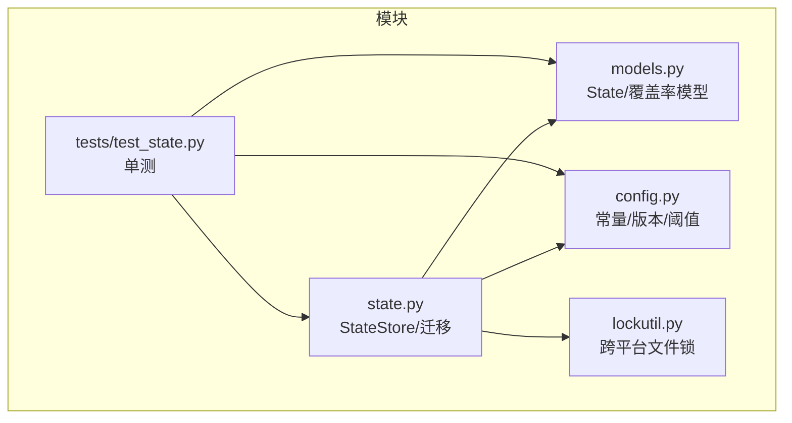
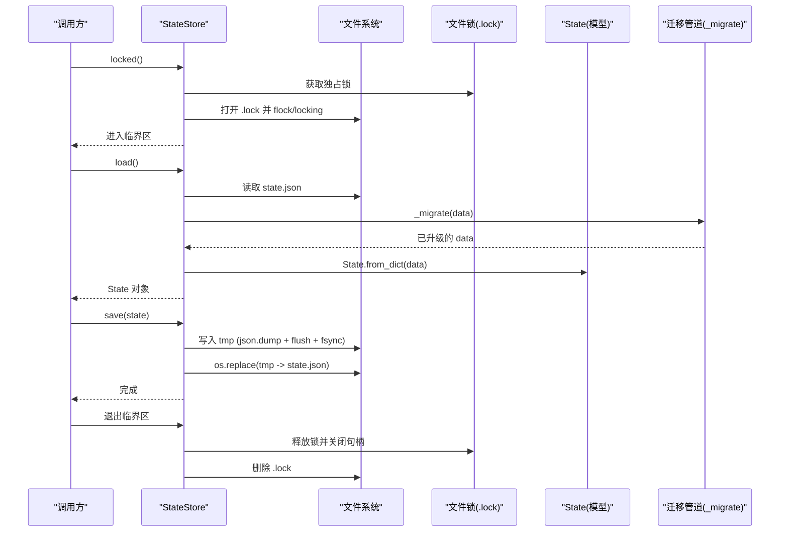
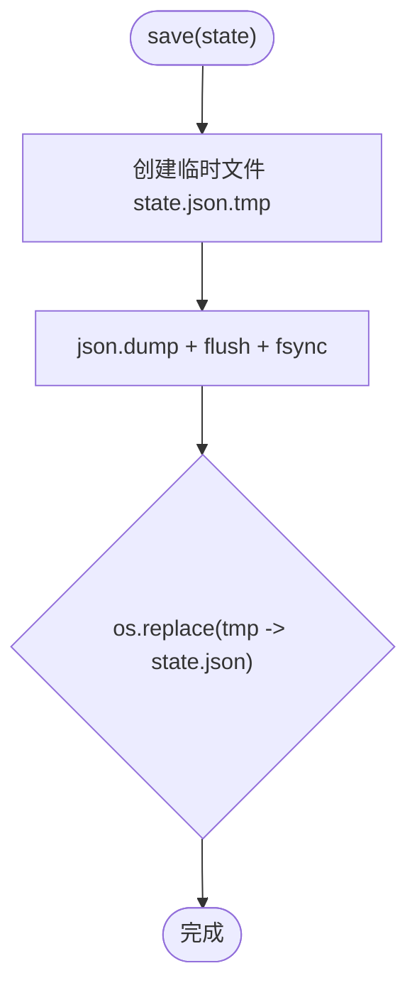
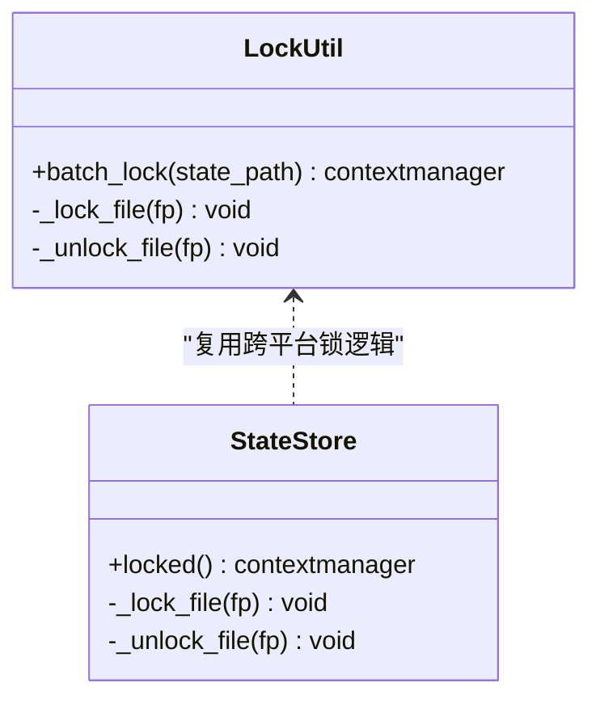
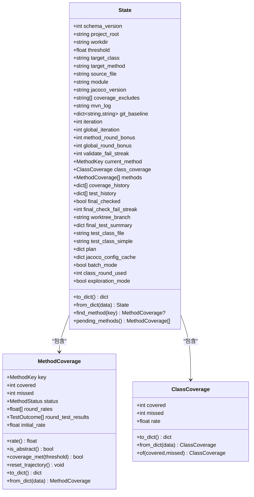
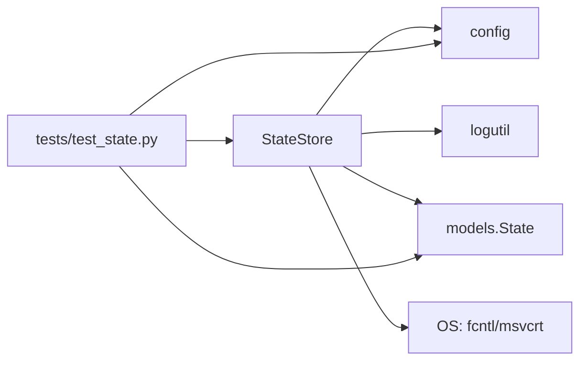

# 状态管理机制

<cite>
**本文引用的文件**
- [state.py](file://batch-unit-test-generator/scripts/jaut/state.py)
- [state.py](file://java-unit-test-generator/scripts/jaut/state.py)
- [models.py](file://batch-unit-test-generator/scripts/jaut/models.py)
- [models.py](file://java-unit-test-generator/scripts/jaut/models.py)
- [config.py](file://batch-unit-test-generator/scripts/jaut/config.py)
- [config.py](file://java-unit-test-generator/scripts/jaut/config.py)
- [lockutil.py](file://batch-unit-test-generator/scripts/jaut/lockutil.py)
- [test_state.py](file://batch-unit-test-generator/tests/test_state.py)
- [test_state.py](file://java-unit-test-generator/tests/test_state.py)
</cite>

## 目录
1. [简介](#简介)
2. [项目结构](#项目结构)
3. [核心组件](#核心组件)
4. [架构总览](#架构总览)
5. [详细组件分析](#详细组件分析)
6. [依赖关系分析](#依赖关系分析)
7. [性能考量](#性能考量)
8. [故障恢复与排障指南](#故障恢复与排障指南)
9. [结论](#结论)

## 简介
本技术文档聚焦 JAut 引擎的状态管理机制，围绕 StateStore 类的设计与实现展开，重点解释：
- 原子文件写入机制（临时文件 + os.replace + fsync）如何确保状态数据的完整性与可恢复性。
- 跨进程文件锁的实现原理，包括 POSIX 的 fcntl.flock 与 Windows 的 msvcrt.locking 差异处理。
- 状态迁移管道的设计，包括 schema_version 管理、迁移函数注册表与向后兼容性保证。
- State 模型的数据结构设计，包括字段定义、默认值处理与版本兼容策略。
- 并发访问控制、错误处理与性能优化实践。
- 状态持久化的最佳实践与故障恢复策略。

## 项目结构
JAut 的状态管理相关代码主要分布在两个子项目中（batch-unit-test-generator 与 java-unit-test-generator），其结构与职责高度一致：
- state.py：StateStore 实现，负责 state.json 的原子读写、跨进程锁、schema 迁移。
- models.py：State、MethodCoverage、ClassCoverage、TestOutcome、Decision 等数据模型，提供 to_dict/from_dict 序列化与默认值容错。
- config.py：全局常量与配置，包含 STATE_SCHEMA_VERSION、文件名、阈值、预算等。
- lockutil.py：通用跨平台文件锁工具（用于批量任务场景）。
- tests/test_state.py：覆盖状态序列化往返、原子读写、锁行为等用例。



图表来源
- [state.py:77-156](file://batch-unit-test-generator/scripts/jaut/state.py#L77-L156)
- [models.py:347-517](file://batch-unit-test-generator/scripts/jaut/models.py#L347-L517)
- [config.py:171-173](file://batch-unit-test-generator/scripts/jaut/config.py#L171-L173)
- [lockutil.py:34-55](file://batch-unit-test-generator/scripts/jaut/lockutil.py#L34-L55)
- [test_state.py:116-150](file://batch-unit-test-generator/tests/test_state.py#L116-L150)

章节来源
- [state.py:77-156](file://batch-unit-test-generator/scripts/jaut/state.py#L77-L156)
- [models.py:347-517](file://batch-unit-test-generator/scripts/jaut/models.py#L347-L517)
- [config.py:171-173](file://batch-unit-test-generator/scripts/jaut/config.py#L171-L173)
- [lockutil.py:34-55](file://batch-unit-test-generator/scripts/jaut/lockutil.py#L34-L55)
- [test_state.py:116-150](file://batch-unit-test-generator/tests/test_state.py#L116-L150)

## 核心组件
- StateStore：封装 state.json 的加载、保存、覆盖快照以及独占锁上下文。
- State 模型：类型化状态对象，提供 to_dict/from_dict，对缺失键填充默认值以兼容旧版本。
- 迁移管道：基于 schema_version 的顺序迁移，通过 _MIGRATIONS 注册表驱动升级。
- 跨平台文件锁：POSIX 使用 fcntl.flock，Windows 使用 msvcrt.locking，统一为 locked() 上下文。
- 配置常量：STATE_FILENAME、COVERAGE_FILENAME、STATE_SCHEMA_VERSION 等集中管理。

章节来源
- [state.py:77-156](file://batch-unit-test-generator/scripts/jaut/state.py#L77-L156)
- [models.py:347-517](file://batch-unit-test-generator/scripts/jaut/models.py#L347-L517)
- [config.py:171-173](file://batch-unit-test-generator/scripts/jaut/config.py#L171-L173)

## 架构总览
下图展示了状态管理的整体交互：调用方通过 StateStore 获取锁、读取/修改/保存状态；加载时经过迁移管道将旧 schema 升级到当前版本；保存时使用临时文件 + fsync + os.replace 保证原子性。



图表来源
- [state.py:93-156](file://batch-unit-test-generator/scripts/jaut/state.py#L93-L156)
- [state.py:55-74](file://batch-unit-test-generator/scripts/jaut/state.py#L55-L74)
- [models.py:474-517](file://batch-unit-test-generator/scripts/jaut/models.py#L474-L517)

## 详细组件分析

### StateStore：原子写入与跨进程锁
- 原子写入：
  - 先写入临时文件（state.json.tmp），执行 json.dump、flush、fsync，确保数据落盘。
  - 使用 os.replace 原子替换目标文件，避免部分写入导致的损坏。
- 跨进程锁：
  - 使用独立的 .lock 文件，避免与 state.json 的 os.replace 冲突。
  - POSIX 系统使用 fcntl.flock 获取独占锁；Windows 使用 msvcrt.locking。
  - 上下文管理器在 finally 中释放锁、关闭句柄并尝试删除锁文件。
  - 检测残留锁文件（超过 24 小时）并记录警告，便于人工干预。
- 覆盖快照：
  - write_coverage 写出 coverage.json，便于外部查看或报告生成。



图表来源
- [state.py:147-156](file://batch-unit-test-generator/scripts/jaut/state.py#L147-L156)

章节来源
- [state.py:93-156](file://batch-unit-test-generator/scripts/jaut/state.py#L93-L156)

### 跨平台文件锁实现
- POSIX：
  - 使用 fcntl.flock(fd, LOCK_EX) 获取独占锁，LOCK_UN 释放。
- Windows：
  - 使用 msvcrt.locking(fd, LK_LOCK, 1) 锁定，LK_UNLCK 解锁。
- 统一接口：
  - _lock_file / _unlock_file 根据 sys.platform 选择实现。
  - batch_lock 提供通用的上下文管理器，自动清理锁文件。



图表来源
- [lockutil.py:34-55](file://batch-unit-test-generator/scripts/jaut/lockutil.py#L34-L55)
- [state.py:20-35](file://batch-unit-test-generator/scripts/jaut/state.py#L20-L35)

章节来源
- [lockutil.py:34-55](file://batch-unit-test-generator/scripts/jaut/lockutil.py#L34-L55)
- [state.py:20-35](file://batch-unit-test-generator/scripts/jaut/state.py#L20-L35)

### 状态迁移管道：schema_version 与向后兼容
- 版本管理：
  - config.STATE_SCHEMA_VERSION 表示当前 schema 版本。
  - state.json 中的 schema_version 标识该状态的版本。
- 迁移流程：
  - _migrate 从旧版本顺序升级到当前版本，每次一步 v -> v+1。
  - 迁移函数注册表 _MIGRATIONS 映射 next_ver -> migrator(data)。
  - 若缺少迁移函数则抛出 ValueError，提示补全注册表。
- 向后兼容：
  - 旧 state.json 无 schema_version 视为 v1。
  - State.from_dict 对缺失键填充默认值，如 git_baseline 由 list[str] 转为 dict[str, str]。

```mermaid
flowchart TD
Load(["load()"]) --> Read["读取 state.json"]
Read --> Migrate["_migrate(data)"]
Migrate --> CheckVer{"ver < current?"}
CheckVer --|是| GetMigrator["查找 _MIGRATIONS[next_ver]"]
GetMigrator --> Apply["执行迁移函数(data)"]
Apply --> UpdateVer["data['schema_version'] = next_ver"]
UpdateVer --> CheckVer
CheckVer --|否| ToModel["State.from_dict(data)"]
ToModel --> Return(["返回 State"])
```

图表来源
- [state.py:55-74](file://batch-unit-test-generator/scripts/jaut/state.py#L55-L74)
- [models.py:474-517](file://batch-unit-test-generator/scripts/jaut/models.py#L474-L517)
- [config.py:171-173](file://batch-unit-test-generator/scripts/jaut/config.py#L171-L173)

章节来源
- [state.py:55-74](file://batch-unit-test-generator/scripts/jaut/state.py#L55-L74)
- [models.py:474-517](file://batch-unit-test-generator/scripts/jaut/models.py#L474-L517)
- [config.py:171-173](file://batch-unit-test-generator/scripts/jaut/config.py#L171-L173)

### State 模型数据结构与默认值处理
- 字段设计：
  - 基础信息：project_root、workdir、threshold、target_class、target_method、source_file、module、jacoco_version。
  - 覆盖率：class_coverage、methods（列表）、coverage_history、test_history。
  - 迭代与预算：iteration、global_iteration、method_round_bonus、global_round_bonus、validate_fail_streak。
  - 可选字段：worktree_branch、final_test_summary、coverage_excludes、test_class_file、test_class_simple、plan、jacoco_config_cache、batch_mode、class_round_used、exploration_mode。
- 默认值与兼容：
  - from_dict 对缺失键填充默认值，如 threshold 使用 DEFAULT_THRESHOLD，git_baseline 兼容旧 list[str]。
  - to_dict 仅写出非空可选字段，保持与旧脚本一致的 state.json 形态。
- 便捷方法：
  - find_method、pending_methods 辅助查询。
  - MethodCoverage.reset_trajectory 支持升级后复位轨迹。



图表来源
- [models.py:347-517](file://batch-unit-test-generator/scripts/jaut/models.py#L347-L517)
- [models.py:119-179](file://batch-unit-test-generator/scripts/jaut/models.py#L119-L179)
- [models.py:178-204](file://batch-unit-test-generator/scripts/jaut/models.py#L178-L204)

章节来源
- [models.py:347-517](file://batch-unit-test-generator/scripts/jaut/models.py#L347-L517)
- [models.py:119-179](file://batch-unit-test-generator/scripts/jaut/models.py#L119-L179)
- [models.py:178-204](file://batch-unit-test-generator/scripts/jaut/models.py#L178-L204)

### 并发访问控制与错误处理
- 并发控制：
  - 使用 .lock 文件 + 独占锁保护 load → 修改 → save 的原子性。
  - 独立锁文件避免与 state.json 的 os.replace 冲突。
- 错误处理：
  - load 捕获 OSError/ValueError，记录警告并返回 None，由调用方按状态错误流转。
  - 非法 JSON 或非对象结构会记录警告并返回 None。
  - 迁移缺失函数时抛出 ValueError，要求补全 _MIGRATIONS。
  - 残留锁文件检测并告警，便于人工清理。

章节来源
- [state.py:130-156](file://batch-unit-test-generator/scripts/jaut/state.py#L130-L156)
- [state.py:55-74](file://batch-unit-test-generator/scripts/jaut/state.py#L55-L74)

### 性能优化
- 原子写入减少 I/O 风险：
  - 临时文件 + fsync + os.replace 确保一致性，降低崩溃恢复成本。
- 最小化锁持有时间：
  - 仅在临界区内进行 load/save，避免长时间持锁。
- 选择性写出可选字段：
  - to_dict 仅写出非空可选字段，减小 state.json 体积。
- 缓存与增量：
  - jacoco_config_cache 避免重复探测配置开销。
  - round_rates、round_test_results 仅记录必要轨迹，控制增长。

章节来源
- [state.py:147-156](file://batch-unit-test-generator/scripts/jaut/state.py#L147-L156)
- [models.py:426-472](file://batch-unit-test-generator/scripts/jaut/models.py#L426-L472)

## 依赖关系分析
- StateStore 依赖：
  - config：文件名、工作目录、schema 版本。
  - logutil：日志记录。
  - models：State 模型的序列化/反序列化。
- 跨平台锁：
  - 根据 sys.platform 动态导入 fcntl 或 msvcrt。
- 测试依赖：
  - tests/test_state.py 验证原子读写、锁行为、序列化往返。



图表来源
- [state.py:16-18](file://batch-unit-test-generator/scripts/jaut/state.py#L16-L18)
- [state.py:20-35](file://batch-unit-test-generator/scripts/jaut/state.py#L20-L35)
- [test_state.py:116-150](file://batch-unit-test-generator/tests/test_state.py#L116-L150)

章节来源
- [state.py:16-18](file://batch-unit-test-generator/scripts/jaut/state.py#L16-L18)
- [state.py:20-35](file://batch-unit-test-generator/scripts/jaut/state.py#L20-L35)
- [test_state.py:116-150](file://batch-unit-test-generator/tests/test_state.py#L116-L150)

## 性能考量
- 原子写入与 fsync 确保数据一致性，但会增加磁盘 I/O；建议在批处理中合并多次更新以减少写放大。
- 锁粒度应尽量小，仅包裹关键读改写路径，避免阻塞其他进程。
- 可选字段按需写出，减少 JSON 大小与解析开销。
- 迁移函数应轻量且幂等，避免复杂计算影响启动速度。
- 覆盖率历史与测试历史建议限制长度或使用滚动窗口，防止状态膨胀。

[本节为通用指导，不直接分析具体文件]

## 故障恢复与排障指南
- 状态文件损坏：
  - load 捕获异常并返回 None，调用方可按“缺失状态”流程处理（如重新初始化）。
  - 检查 state.json 是否为合法 JSON 且为对象结构。
- 残留锁文件：
  - 若检测到超过 24 小时的 .lock 文件，记录警告；确认无其他进程后可手动删除。
- 迁移失败：
  - 若 _MIGRATIONS 缺少对应迁移函数，抛出 ValueError；需补充迁移逻辑并递增 STATE_SCHEMA_VERSION。
- 断点续跑：
  - 利用原子写入与迁移管道，确保崩溃后重启能恢复到一致状态。
- 并发冲突：
  - 使用 locked() 上下文确保临界区互斥；避免多个进程同时修改同一 workdir 的状态。

章节来源
- [state.py:130-156](file://batch-unit-test-generator/scripts/jaut/state.py#L130-L156)
- [state.py:103-128](file://batch-unit-test-generator/scripts/jaut/state.py#L103-L128)
- [state.py:55-74](file://batch-unit-test-generator/scripts/jaut/state.py#L55-L74)

## 结论
JAut 的状态管理机制通过 StateStore 实现了高可靠的状态持久化：
- 原子写入结合 fsync 与 os.replace，确保状态文件的完整性与可恢复性。
- 跨平台文件锁提供跨进程互斥，避免并发写入导致的数据竞争。
- 迁移管道基于 schema_version 与注册表，保证向后兼容与平滑升级。
- State 模型通过默认值与可选字段设计，兼顾灵活性与兼容性。
- 完善的错误处理与故障恢复策略，提升了系统的鲁棒性。

在实际使用中，建议遵循以下最佳实践：
- 始终通过 locked() 上下文进行状态读写，确保临界区安全。
- 谨慎维护 _MIGRATIONS 注册表，确保每次结构变更都有对应迁移函数。
- 合理设置预算与阈值，避免无限迭代；利用 reset_trajectory 控制升级节奏。
- 监控锁文件与状态文件大小，及时清理残留资源。

[本节为总结性内容，不直接分析具体文件]