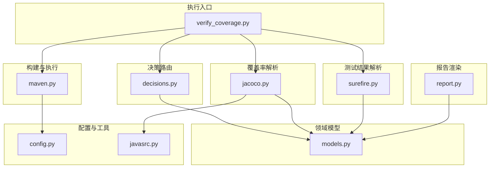
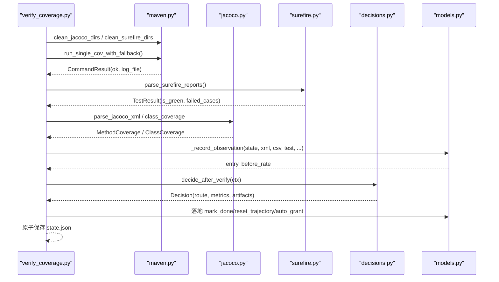
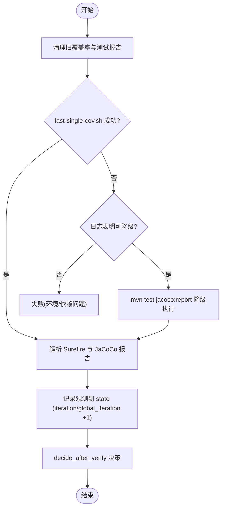
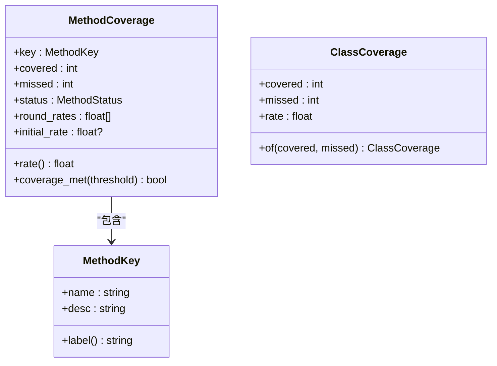
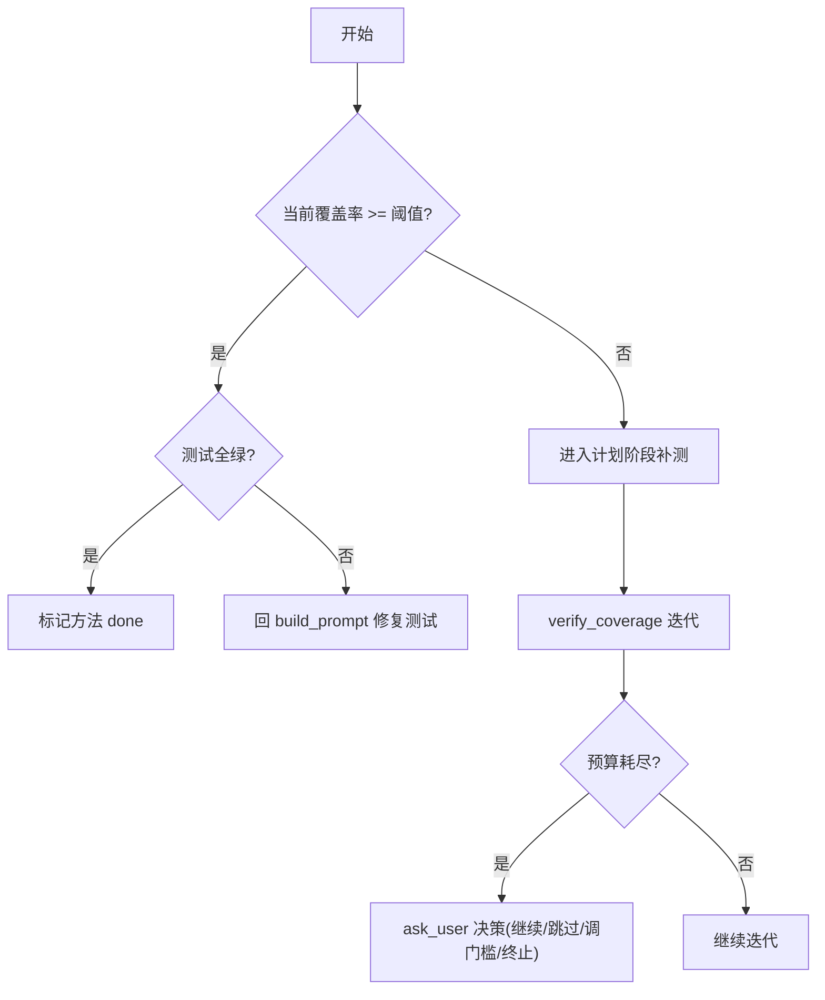
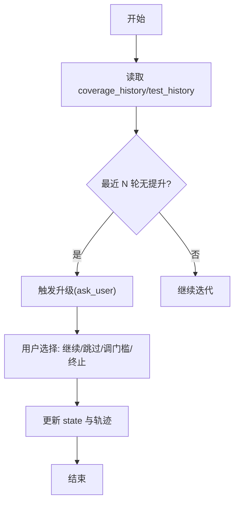
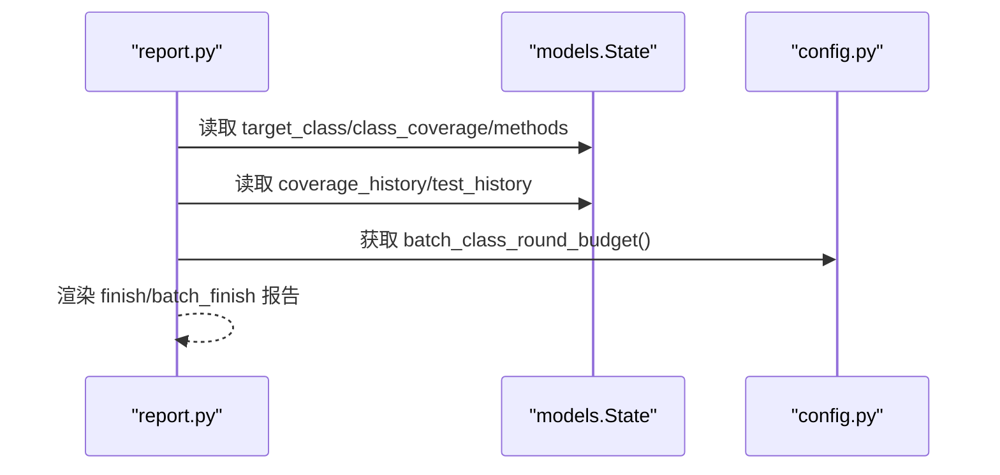
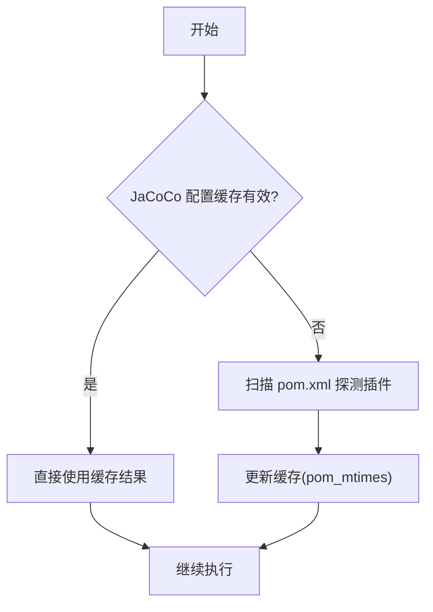
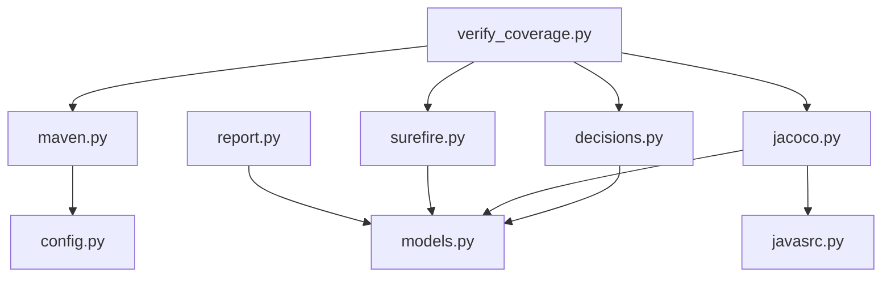

# 覆盖率分析系统

<cite>
**本文引用的文件**
- [jacoco.py](file://batch-unit-test-generator/scripts/jaut/jacoco.py)
- [surefire.py](file://batch-unit-test-generator/scripts/jaut/surefire.py)
- [maven.py](file://batch-unit-test-generator/scripts/jaut/maven.py)
- [models.py](file://batch-unit-test-generator/scripts/jaut/models.py)
- [decisions.py](file://batch-unit-test-generator/scripts/jaut/decisions.py)
- [report.py](file://batch-unit-test-generator/scripts/jaut/report.py)
- [config.py](file://batch-unit-test-generator/scripts/jaut/config.py)
- [javasrc.py](file://batch-unit-test-generator/scripts/jaut/javasrc.py)
- [verify_coverage.py](file://batch-unit-test-generator/scripts/verify_coverage.py)
</cite>

## 目录
1. [简介](#简介)
2. [项目结构](#项目结构)
3. [核心组件](#核心组件)
4. [架构总览](#架构总览)
5. [详细组件分析](#详细组件分析)
6. [依赖关系分析](#依赖关系分析)
7. [性能与优化](#性能与优化)
8. [故障排查指南](#故障排查指南)
9. [结论](#结论)
10. [附录](#附录)

## 简介
本技术文档围绕 JAut 引擎的覆盖率分析系统，系统化阐述 JaCoCo 工具的集成架构与完整流程：从覆盖率数据采集、解析、决策判定到报告生成与持久化。重点覆盖以下方面：
- 覆盖率数据模型与计算逻辑（行覆盖率、方法覆盖率、类覆盖率）
- 阈值配置与管理（全局阈值、类级别阈值、动态调整策略）
- 历史数据对比、趋势分析与回归检测
- 报告生成与展示（HTML/XML 及自定义文本报告）
- 增量分析、缓存机制与性能调优方案

## 项目结构
JAut 覆盖率子系统位于 batch-unit-test-generator/scripts/jaut 包中，采用分层职责清晰的模块化设计：
- maven：构建与执行 Maven/JaCoCo/Surefire，命令构建、清理与降级策略
- jacoco：JaCoCo XML/CSV 解析与聚合，方法级与类级覆盖率提取
- surefire：Surefire 测试报告解析，fail-closed 绿灯判定
- models：领域模型（MethodCoverage、ClassCoverage、State、Decision 等）
- decisions：纯函数决策核心（init/plan/verify 阶段的路由与升级策略）
- report：收尾报告渲染（单类完成报告、批量最终报告）
- config：全局常量与阈值、预算、超时等配置
- javasrc：Java 源码静态分析辅助（描述符可读化、方法抽取等）
- verify_coverage：迭代核心脚本，串联采集、解析、记录与决策

图表来源
- [verify_coverage.py:58-205](file://batch-unit-test-generator/scripts/verify_coverage.py#L58-L205)
- [maven.py:248-375](file://batch-unit-test-generator/scripts/jaut/maven.py#L248-L375)
- [jacoco.py:74-181](file://batch-unit-test-generator/scripts/jaut/jacoco.py#L74-L181)
- [surefire.py:45-93](file://batch-unit-test-generator/scripts/jaut/surefire.py#L45-L93)
- [models.py:123-205](file://batch-unit-test-generator/scripts/jaut/models.py#L123-L205)
- [decisions.py:183-343](file://batch-unit-test-generator/scripts/jaut/decisions.py#L183-L343)
- [report.py:81-219](file://batch-unit-test-generator/scripts/jaut/report.py#L81-L219)
- [config.py:51-181](file://batch-unit-test-generator/scripts/jaut/config.py#L51-L181)
- [javasrc.py:34-68](file://batch-unit-test-generator/scripts/jaut/javasrc.py#L34-L68)

章节来源
- [verify_coverage.py:1-281](file://batch-unit-test-generator/scripts/verify_coverage.py#L1-L281)
- [maven.py:1-641](file://batch-unit-test-generator/scripts/jaut/maven.py#L1-L641)
- [jacoco.py:1-248](file://batch-unit-test-generator/scripts/jaut/jacoco.py#L1-L248)
- [surefire.py:1-170](file://batch-unit-test-generator/scripts/jaut/surefire.py#L1-L170)
- [models.py:1-693](file://batch-unit-test-generator/scripts/jaut/models.py#L1-L693)
- [decisions.py:1-672](file://batch-unit-test-generator/scripts/jaut/decisions.py#L1-L672)
- [report.py:1-219](file://batch-unit-test-generator/scripts/jaut/report.py#L1-L219)
- [config.py:1-181](file://batch-unit-test-generator/scripts/jaut/config.py#L1-L181)
- [javasrc.py:1-397](file://batch-unit-test-generator/scripts/jaut/javasrc.py#L1-L397)

## 核心组件
- 覆盖率采集与执行（maven.py）
  - 自动探测 pom.xml 是否已配置 jacoco-maven-plugin；未配置则通过完整坐标挂载 prepare-agent + report
  - 支持多模块 -pl/-am 参数；提供 fast-single-cov.sh 快速路径与 mvn test jacoco:report 降级方案
  - 每次执行前清理 target/site/jacoco 与 target/surefire-reports，避免陈旧数据干扰
- 覆盖率解析（jacoco.py）
  - 解析 jacoco.xml 得到方法级行覆盖率；解析 jacoco.csv 得到类级行覆盖率（含内部类聚合）
  - 支持 excludes 模式匹配（fnmatch），对内部类 '$' 聚合前进行排除
  - 提供多模块聚合能力（aggregate_jacoco_xml / aggregate_class_coverage）
- 测试结果解析（surefire.py）
  - 优先解析 TEST-*.xml，回退 *.txt；fail-closed 语义：报告缺失/不可解析/存在失败用例一律不绿
  - 统计 tests/failures/errors/skipped，并收集 failed_cases
- 领域模型（models.py）
  - MethodCoverage：方法覆盖率、轨迹（round_rates）、测试结果轨迹（round_test_results）、初始基线 initial_rate
  - ClassCoverage：类级行覆盖率（covered/missed/rate）
  - State：持久化状态（threshold、coverage_history、test_history、class_coverage、methods 等）
  - Decision/Route：决策产物与路由映射
- 决策核心（decisions.py）
  - decide_after_init：基线/终验门槛判定
  - decide_after_plan：方法队列推进/终验/收尾
  - decide_after_verify：单方法迭代双条件判定 + 预算/升级（覆盖率达标+测试全绿 -> done；否则按优先级触发 ask_user 或回 build_prompt）
- 报告渲染（report.py）
  - render_finish_report：SKILL.md §8 格式收尾报告（before→after、方法明细、测试汇总、收尾提醒）
  - render_batch_finish_report：批量最终报告（各类 before→after、达标/跳过/失败清单、总轮次）
- 配置（config.py）
  - 默认阈值 DEFAULT_THRESHOLD=80.0；抽象/接口方法视为 100%
  - 预算与升级：METHOD_ROUND_BUDGET=8、GLOBAL_ROUND_BUDGET=30、NO_IMPROVEMENT_ROUNDS=3、TEST_FAIL_STREAK_ROUNDS=3
  - 批量模式预算：BATCH_CLASS_ROUND_BUDGET（环境变量覆盖）、EXPLORATION_MODE_MULTIPLIER
- Java 源码工具（javasrc.py）
  - JVM 描述符可读化、注释/字符串剥离、方法抽取与私有方法调用链收集

章节来源
- [maven.py:100-375](file://batch-unit-test-generator/scripts/jaut/maven.py#L100-L375)
- [jacoco.py:54-181](file://batch-unit-test-generator/scripts/jaut/jacoco.py#L54-L181)
- [surefire.py:45-93](file://batch-unit-test-generator/scripts/jaut/surefire.py#L45-L93)
- [models.py:24-205](file://batch-unit-test-generator/scripts/jaut/models.py#L24-L205)
- [decisions.py:183-343](file://batch-unit-test-generator/scripts/jaut/decisions.py#L183-L343)
- [report.py:81-219](file://batch-unit-test-generator/scripts/jaut/report.py#L81-L219)
- [config.py:51-181](file://batch-unit-test-generator/scripts/jaut/config.py#L51-L181)
- [javasrc.py:34-68](file://batch-unit-test-generator/scripts/jaut/javasrc.py#L34-L68)

## 架构总览
覆盖率分析系统以 verify_coverage 为迭代核心，串联 Maven 执行、JaCoCo 覆盖率采集、Surefire 结果解析、状态记录与决策路由。整体流程如下：

图表来源
- [verify_coverage.py:58-205](file://batch-unit-test-generator/scripts/verify_coverage.py#L58-L205)
- [maven.py:464-533](file://batch-unit-test-generator/scripts/jaut/maven.py#L464-L533)
- [surefire.py:45-93](file://batch-unit-test-generator/scripts/jaut/surefire.py#L45-L93)
- [jacoco.py:74-181](file://batch-unit-test-generator/scripts/jaut/jacoco.py#L74-L181)
- [models.py:208-264](file://batch-unit-test-generator/scripts/jaut/models.py#L208-L264)
- [decisions.py:183-343](file://batch-unit-test-generator/scripts/jaut/decisions.py#L183-L343)

## 详细组件分析

### JaCoCo 集成与覆盖率数据采集
- 快速路径：fast-single-cov.sh 负责编译、运行测试、注入 JaCoCo agent 并生成 XML/CSV/HTML 报告至 target/site/jacoco
- 降级路径：当快速路径失败且日志表明可恢复（如 exec 未生成），回退到 mvn test jacoco:report
- 清理策略：每次执行前删除 target/site/jacoco 与 target/surefire-reports，确保数据新鲜
- 多模块支持：根据 is_multi_module 决定是否使用 -pl/-am；支持批量安装依赖以提升后续构建性能

图表来源
- [maven.py:326-533](file://batch-unit-test-generator/scripts/jaut/maven.py#L326-L533)
- [verify_coverage.py:93-170](file://batch-unit-test-generator/scripts/verify_coverage.py#L93-L170)

章节来源
- [maven.py:100-375](file://batch-unit-test-generator/scripts/jaut/maven.py#L100-L375)
- [maven.py:464-533](file://batch-unit-test-generator/scripts/jaut/maven.py#L464-L533)
- [verify_coverage.py:93-170](file://batch-unit-test-generator/scripts/verify_coverage.py#L93-L170)

### 覆盖率数据模型与计算逻辑
- 行覆盖率：coverage_rate(covered, missed)，当 covered+missed==0（抽象/接口方法）视为 100%
- 方法覆盖率：MethodCoverage 包含 key(name+desc)、covered/missed、status、round_rates、initial_rate
- 类覆盖率：ClassCoverage 聚合 CSV 的 LINE_COVERED/LINE_MISSED（含内部类 $ 聚合），XML 兜底
- 排除规则：is_excluded 使用 fnmatchcase 匹配完整类名（含 $），在内部类聚合前生效
- 多模块聚合：aggregate_jacoco_xml 合并各模块方法级覆盖率；aggregate_class_coverage 合并类级覆盖率

图表来源
- [models.py:81-205](file://batch-unit-test-generator/scripts/jaut/models.py#L81-L205)
- [jacoco.py:74-181](file://batch-unit-test-generator/scripts/jaut/jacoco.py#L74-L181)

章节来源
- [models.py:24-205](file://batch-unit-test-generator/scripts/jaut/models.py#L24-L205)
- [jacoco.py:54-181](file://batch-unit-test-generator/scripts/jaut/jacoco.py#L54-L181)

### 阈值配置与管理
- 全局阈值：DEFAULT_THRESHOLD=80.0，可通过 make_plan --set-threshold 动态调整
- 类级别阈值：同一阈值应用于类级与单方法判定；抽象/接口方法视为 100%
- 动态调整策略：
  - 预算耗尽时 ask_user 提供“继续/跳过/调整门槛/终止”选项
  - 批量模式下预算内自动继续（auto_grant），追加 method_round_bonus/global_round_bonus
  - 探索模式（大类拆分）预算翻倍（EXPLORATION_MODE_MULTIPLIER）

图表来源
- [decisions.py:183-343](file://batch-unit-test-generator/scripts/jaut/decisions.py#L183-L343)
- [config.py:51-181](file://batch-unit-test-generator/scripts/jaut/config.py#L51-L181)

章节来源
- [decisions.py:183-343](file://batch-unit-test-generator/scripts/jaut/decisions.py#L183-L343)
- [config.py:51-181](file://batch-unit-test-generator/scripts/jaut/config.py#L51-L181)

### 历史数据对比、趋势分析与回归检测
- 历史数据：state.coverage_history 记录每轮 before/after；state.test_history 记录测试失败轨迹
- 趋势分析：no_improvement(round_rates, limit=3) 判断连续 3 轮非递增且未接近门槛
- 回归检测：final_check_fail_streak 累计终验不绿次数，达到 FINAL_CHECK_FAIL_STREAK_LIMIT 触发 ask_user
- 基线快照：MethodCoverage.initial_rate 用于 finish 报告的 before 值；coverage_history 首个含 class_rate 的条目作为类级基线

图表来源
- [decisions.py:46-70](file://batch-unit-test-generator/scripts/jaut/decisions.py#L46-L70)
- [report.py:38-43](file://batch-unit-test-generator/scripts/jaut/report.py#L38-L43)
- [models.py:391-400](file://batch-unit-test-generator/scripts/jaut/models.py#L391-L400)

章节来源
- [decisions.py:46-70](file://batch-unit-test-generator/scripts/jaut/decisions.py#L46-L70)
- [report.py:38-43](file://batch-unit-test-generator/scripts/jaut/report.py#L38-L43)
- [models.py:391-400](file://batch-unit-test-generator/scripts/jaut/models.py#L391-L400)

### 覆盖率报告生成与展示
- HTML/XML 报告：JaCoCo 自动生成 target/site/jacoco 下的 HTML 与 XML 报告
- 自定义文本报告：
  - render_finish_report：目标类、初始/最终 Line Coverage、方法明细、测试汇总、收尾提醒
  - render_batch_finish_report：批量最终报告（各类 before→after、达标/跳过/失败清单、总轮次）
- 数据来源：state.json 中的 coverage_history、class_coverage、final_test_summary 等

图表来源
- [report.py:81-219](file://batch-unit-test-generator/scripts/jaut/report.py#L81-L219)
- [models.py:353-517](file://batch-unit-test-generator/scripts/jaut/models.py#L353-L517)
- [config.py:147-156](file://batch-unit-test-generator/scripts/jaut/config.py#L147-L156)

章节来源
- [report.py:81-219](file://batch-unit-test-generator/scripts/jaut/report.py#L81-L219)
- [models.py:353-517](file://batch-unit-test-generator/scripts/jaut/models.py#L353-L517)

### 增量分析与缓存机制
- JaCoCo 配置缓存：parse_jacoco_config 基于 pom.xml mtime 缓存探测结果，避免重复扫描
- 依赖预装：build_install_cmd 预先安装依赖模块，后续构建可跳过 -am 提升性能
- 快速路径：fast-single-cov.sh 替代完整 mvn 流程，减少启动开销
- 清理策略：每次执行前清理 target/site/jacoco 与 target/surefire-reports，确保增量数据准确

图表来源
- [maven.py:100-197](file://batch-unit-test-generator/scripts/jaut/maven.py#L100-L197)

章节来源
- [maven.py:100-197](file://batch-unit-test-generator/scripts/jaut/maven.py#L100-L197)

## 依赖关系分析
- 模块耦合：
  - verify_coverage 依赖 maven、surefire、jacoco、decisions、models
  - decisions 依赖 models、config
  - jacoco 依赖 models、javasrc
  - surefire 依赖 models
  - report 依赖 models、config
- 外部依赖：
  - Maven 可执行程序（mvn）
  - JaCoCo 工具（jacocoagent.jar、jacococli.jar）
  - Git（工作树管理，见 worktree.py，但不在本次分析范围）

图表来源
- [verify_coverage.py:44-48](file://batch-unit-test-generator/scripts/verify_coverage.py#L44-L48)
- [decisions.py:31-41](file://batch-unit-test-generator/scripts/jaut/decisions.py#L31-L41)
- [jacoco.py:24-26](file://batch-unit-test-generator/scripts/jaut/jacoco.py#L24-L26)
- [surefire.py:17-18](file://batch-unit-test-generator/scripts/jaut/surefire.py#L17-L18)
- [report.py:25-26](file://batch-unit-test-generator/scripts/jaut/report.py#L25-L26)

章节来源
- [verify_coverage.py:44-48](file://batch-unit-test-generator/scripts/verify_coverage.py#L44-L48)
- [decisions.py:31-41](file://batch-unit-test-generator/scripts/jaut/decisions.py#L31-L41)
- [jacoco.py:24-26](file://batch-unit-test-generator/scripts/jaut/jacoco.py#L24-L26)
- [surefire.py:17-18](file://batch-unit-test-generator/scripts/jaut/surefire.py#L17-L18)
- [report.py:25-26](file://batch-unit-test-generator/scripts/jaut/report.py#L25-L26)

## 性能与优化
- 增量分析：
  - 仅针对当前目标测试类执行覆盖率采集，避免全量构建
  - 依赖模块预装后跳过 -am，减少重复编译
- 缓存机制：
  - JaCoCo 配置缓存基于 pom.xml mtime，避免重复扫描
  - Surefire 报告解析优先 XML，回退 txt，减少解析开销
- 快速路径：
  - fast-single-cov.sh 直接编译+测试+覆盖率，比完整 mvn 流程更快
- 清理策略：
  - 每次执行前清理 target/site/jacoco 与 target/surefire-reports，避免陈旧数据影响
- 超时与进程管理：
  - mvn 超时 configurable via JAVA_UT_MVN_TIMEOUT，支持两段式终止（SIGTERM + SIGKILL）
  - POST_EOF_WAIT_SECONDS 等待进程退出，防止僵尸进程

[本节为通用性能指导，无需特定文件引用]

## 故障排查指南
- 编译失败：
  - verify_coverage 检测到编译错误时，记录观测并路由到 write_code 自愈，附带错误清单
  - 参考 parse_compile_errors 与 _NON_FALLBACKABLE_PATTERNS 判断是否值得降级
- 测试失败：
  - surefire 解析失败或报告缺失按 fail-closed 处理，计入 parse_errors
  - 失败用例清单通过 FailedCase.summary_line 生成，便于定位
- 覆盖率报告缺失：
  - 若 jacoco.xml 不存在，抛出 StepError.exec_error，附带 mvn.log 路径
- 目录清理失败：
  - surefire/jacoco 目录清理失败会记录警告，并影响本轮测试结果可信度
- 环境/依赖问题：
  - fast-single-cov.sh 失败且不可降级时，抛出 StepError.exec_error，需检查依赖与环境

章节来源
- [verify_coverage.py:103-149](file://batch-unit-test-generator/scripts/verify_coverage.py#L103-L149)
- [surefire.py:96-103](file://batch-unit-test-generator/scripts/jaut/surefire.py#L96-L103)
- [maven.py:427-461](file://batch-unit-test-generator/scripts/jaut/maven.py#L427-L461)
- [maven.py:601-640](file://batch-unit-test-generator/scripts/jaut/maven.py#L601-L640)

## 结论
JAut 覆盖率分析系统通过模块化设计与严格的状态管理，实现了从覆盖率采集、解析、决策到报告生成的完整闭环。其核心优势包括：
- 灵活的 JaCoCo 集成（快速路径 + 降级方案）
- 精确的覆盖率数据模型（方法级/类级行覆盖率）
- 健壮的决策机制（双条件判定 + 预算/升级策略）
- 完善的报告体系（HTML/XML + 自定义文本报告）
- 高效的性能优化（增量分析、缓存机制、清理策略）

该系统适用于单体与多模块 Maven 项目，支持批量模式与探索模式，能够有效提升单元测试覆盖率与质量。

[本节为总结性内容，无需特定文件引用]

## 附录
- 关键配置项说明：
  - DEFAULT_THRESHOLD：默认覆盖率门槛（80%）
  - METHOD_ROUND_BUDGET：单方法最大迭代轮数（8）
  - GLOBAL_ROUND_BUDGET：全局最大迭代轮数（30）
  - NO_IMPROVEMENT_ROUNDS：连续无提升轮数（3）
  - TEST_FAIL_STREAK_ROUNDS：连续失败轮数（3）
  - BATCH_CLASS_ROUND_BUDGET：批量模式类级预算（环境变量覆盖）
  - EXPLORATION_MODE_MULTIPLIER：探索模式预算倍数（2）

[本节为配置说明，无需特定文件引用]