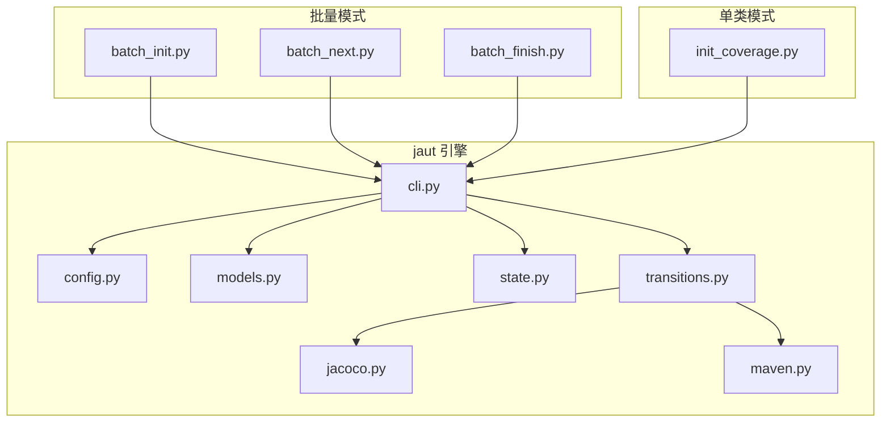
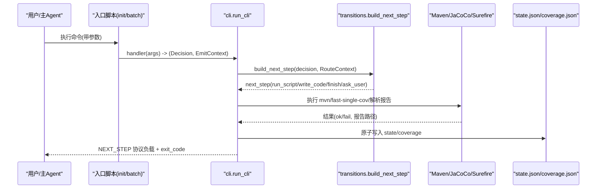
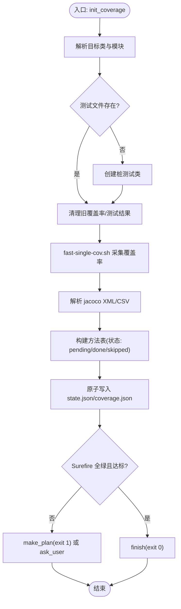
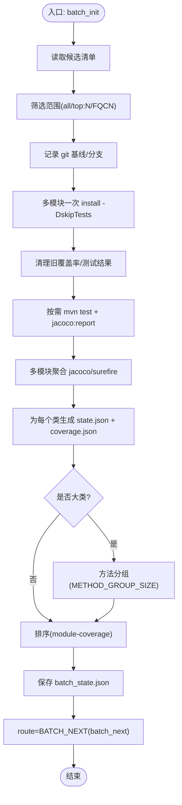
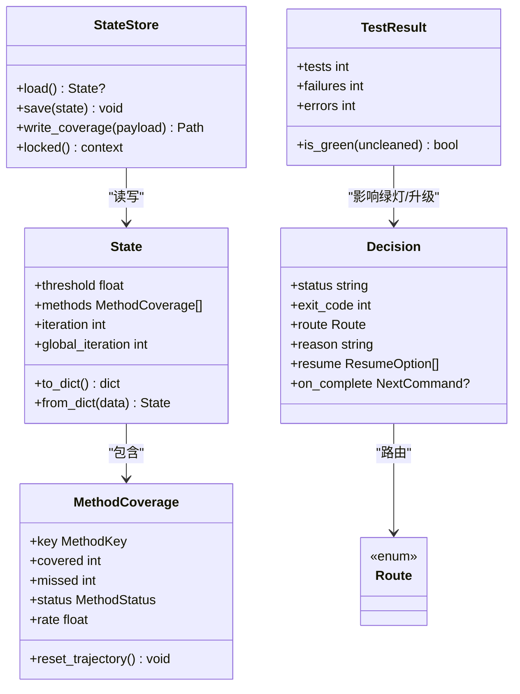
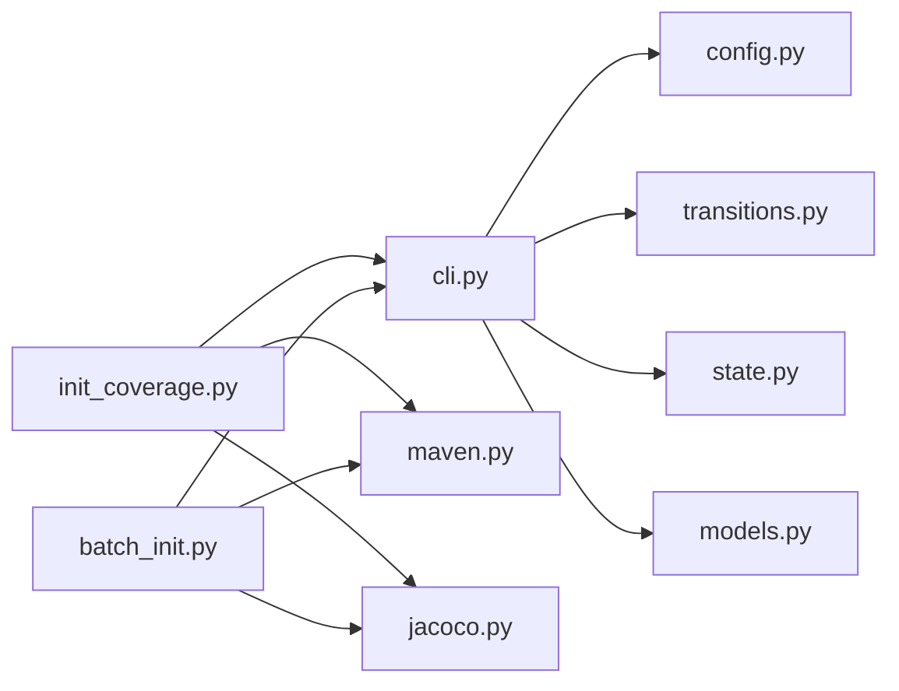

# 单元测试生成器

<cite>
**本文引用的文件**
- [README.md](file://README.md)
- [batch-unit-test-generator/scripts/jaut/cli.py](file://batch-unit-test-generator/scripts/jaut/cli.py)
- [java-unit-test-generator/scripts/jaut/cli.py](file://java-unit-test-generator/scripts/jaut/cli.py)
- [batch-unit-test-generator/scripts/jaut/config.py](file://batch-unit-test-generator/scripts/jaut/config.py)
- [java-unit-test-generator/scripts/jaut/config.py](file://java-unit-test-generator/scripts/jaut/config.py)
- [batch-unit-test-generator/scripts/jaut/state.py](file://batch-unit-test-generator/scripts/jaut/state.py)
- [java-unit-test-generator/scripts/jaut/state.py](file://java-unit-test-generator/scripts/jaut/state.py)
- [batch-unit-test-generator/scripts/jaut/models.py](file://batch-unit-test-generator/scripts/jaut/models.py)
- [java-unit-test-generator/scripts/jaut/models.py](file://java-unit-test-generator/scripts/jaut/models.py)
- [batch-unit-test-generator/scripts/jaut/transitions.py](file://batch-unit-test-generator/scripts/jaut/transitions.py)
- [batch-unit-test-generator/scripts/batch_init.py](file://batch-unit-test-generator/scripts/batch_init.py)
- [java-unit-test-generator/scripts/init_coverage.py](file://java-unit-test-generator/scripts/init_coverage.py)
- [batch-unit-test-generator/scripts/jaut/jacoco.py](file://batch-unit-test-generator/scripts/jaut/jacoco.py)
- [java-unit-test-generator/scripts/jaut/jacoco.py](file://java-unit-test-generator/scripts/jaut/jacoco.py)
- [batch-unit-test-generator/scripts/jaut/maven.py](file://batch-unit-test-generator/scripts/jaut/maven.py)
</cite>

## 目录
1. [简介](#简介)
2. [项目结构](#项目结构)
3. [核心组件](#核心组件)
4. [架构总览](#架构总览)
5. [详细组件分析](#详细组件分析)
6. [依赖关系分析](#依赖关系分析)
7. [性能考虑](#性能考虑)
8. [故障排除指南](#故障排除指南)
9. [结论](#结论)
10. [附录：CLI 命令参考与使用示例](#附录cli-命令参考与使用示例)

## 简介
本仓库提供两类单元测试生成能力：
- 单类测试生成器：针对单个目标类，自动采集覆盖率、制定补测计划、驱动迭代直至达标或升级。
- 批量测试生成器：对一批候选类进行基线构建、一次性多模块安装与全量覆盖率采集，随后逐类委派子代理推进。

系统以 jaut 引擎为核心，统一了状态管理、Maven/Surefire/JaCoCo 集成、提示词构建器、决策路由与协议输出。覆盖率驱动的迭代机制通过“初始化基线 → 方法级补测 → 验证 → 终验”的闭环实现；阈值、预算与升级策略集中在配置中心，便于统一治理。

## 项目结构
- batch-unit-test-generator：批量模式脚本与 jaut 库（含 CLI、配置、模型、状态、工作流路由、JaCoCo/Maven 集成等）。
- java-unit-test-generator：单类模式脚本与相同结构的 jaut 库（与批量版保持接口一致，便于复用）。
- scripts/jaut：核心库，包含 CLI 脚手架、配置常量、领域模型、状态存储、工作流路由、覆盖率解析、Maven 执行封装等。
- references/protocol：NEXT_STEP 协议 schema，用于主 Agent 与子代理之间的结构化通信。
- tests：覆盖 CLI、配置、决策、Maven、Surefire、JaCoCo、状态、工作树等模块的测试。

图表来源
- [batch-unit-test-generator/scripts/batch_init.py:1-446](file://batch-unit-test-generator/scripts/batch_init.py#L1-L446)
- [java-unit-test-generator/scripts/init_coverage.py:1-466](file://java-unit-test-generator/scripts/init_coverage.py#L1-L466)
- [batch-unit-test-generator/scripts/jaut/cli.py:1-129](file://batch-unit-test-generator/scripts/jaut/cli.py#L1-L129)
- [batch-unit-test-generator/scripts/jaut/transitions.py:1-128](file://batch-unit-test-generator/scripts/jaut/transitions.py#L1-L128)
- [batch-unit-test-generator/scripts/jaut/jacoco.py:1-248](file://batch-unit-test-generator/scripts/jaut/jacoco.py#L1-L248)
- [batch-unit-test-generator/scripts/jaut/maven.py:1-641](file://batch-unit-test-generator/scripts/jaut/maven.py#L1-L641)

章节来源
- [README.md:1-1](file://README.md#L1-L1)

## 核心组件
- CLI 脚手架：统一参数解析、日志初始化、异常到协议块转换、next_step 路由与 emit。
- 配置中心：集中阈值、预算、超时、路径模板、协议枚举、批量专用常量。
- 领域模型：MethodKey、MethodCoverage、ClassCoverage、TestResult、Decision、State、BatchState 等类型化数据结构。
- 状态存储：state.json 原子读写、跨进程锁、schema 迁移、coverage.json 快照。
- 工作流路由：将 Decision.route 映射为具体 next_step（run_script/write_code/finish/ask_user），注入脚本路径与参数。
- JaCoCo 集成：XML/CSV 解析、内部类聚合、排除模式、多模块聚合。
- Maven 集成：命令构建（含 jacoco-maven-plugin 探测与降级）、清理报告、fast-single-cov.sh 快速路径与回退、批量命令构建。
- 提示词构建器：build_prompt 等脚本负责构造 LLM 提示词（由 transitions 路由调用）。

章节来源
- [batch-unit-test-generator/scripts/jaut/cli.py:1-129](file://batch-unit-test-generator/scripts/jaut/cli.py#L1-L129)
- [batch-unit-test-generator/scripts/jaut/config.py:1-181](file://batch-unit-test-generator/scripts/jaut/config.py#L1-L181)
- [batch-unit-test-generator/scripts/jaut/models.py:1-693](file://batch-unit-test-generator/scripts/jaut/models.py#L1-L693)
- [batch-unit-test-generator/scripts/jaut/state.py:1-165](file://batch-unit-test-generator/scripts/jaut/state.py#L1-L165)
- [batch-unit-test-generator/scripts/jaut/transitions.py:1-128](file://batch-unit-test-generator/scripts/jaut/transitions.py#L1-L128)
- [batch-unit-test-generator/scripts/jaut/jacoco.py:1-248](file://batch-unit-test-generator/scripts/jaut/jacoco.py#L1-L248)
- [batch-unit-test-generator/scripts/jaut/maven.py:1-641](file://batch-unit-test-generator/scripts/jaut/maven.py#L1-L641)

## 架构总览
系统采用“入口脚本 + jaut 引擎 + 外部工具（Maven/Surefire/JaCoCo）”的分层架构：
- 入口脚本负责业务编排（如 init_coverage、batch_init），调用 jaut 各模块完成数据采集、解析与决策。
- jaut 引擎提供统一的 CLI 框架、状态持久化、领域模型与工作流路由。
- 外部工具通过 maven.py 封装，确保命令构建、清理、执行与结果解析的一致性。

图表来源
- [batch-unit-test-generator/scripts/jaut/cli.py:95-129](file://batch-unit-test-generator/scripts/jaut/cli.py#L95-L129)
- [batch-unit-test-generator/scripts/jaut/transitions.py:41-68](file://batch-unit-test-generator/scripts/jaut/transitions.py#L41-L68)
- [batch-unit-test-generator/scripts/jaut/maven.py:319-375](file://batch-unit-test-generator/scripts/jaut/maven.py#L319-L375)
- [batch-unit-test-generator/scripts/jaut/state.py:130-165](file://batch-unit-test-generator/scripts/jaut/state.py#L130-L165)

## 详细组件分析

### 单类测试生成器（init_coverage）
职责边界：
- 目标定位与模块探测：javasrc.resolve_target、maven.find_module_for_source。
- 覆盖率采集：clean_jacoco_dirs/clean_surefire_dirs → fast-single-cov.sh → 解析 jacoco.xml/csv。
- 方法表构建与状态持久化：_build_method_entries → StateStore.save/write_coverage。
- 门槛判定与路由：decisions.decide_after_init → finish/make_plan/ask_user。

关键流程要点：
- 若测试文件不存在，自动创建最小桩测试类以保证 JaCoCo 产出覆盖率。
- 终验模式(--final-check)延续既有进度，仅刷新覆盖率/测试数据并复核完成条件。
- Surefire 结果为绿灯唯一依据（fail-closed），mvn 退出码不单独作为通过标准。

图表来源
- [java-unit-test-generator/scripts/init_coverage.py:122-341](file://java-unit-test-generator/scripts/init_coverage.py#L122-L341)
- [java-unit-test-generator/scripts/jaut/maven.py:326-375](file://java-unit-test-generator/scripts/jaut/maven.py#L326-L375)
- [java-unit-test-generator/scripts/jaut/jacoco.py:71-179](file://java-unit-test-generator/scripts/jaut/jacoco.py#L71-L179)

章节来源
- [java-unit-test-generator/scripts/init_coverage.py:1-466](file://java-unit-test-generator/scripts/init_coverage.py#L1-L466)

### 批量测试生成器（batch_init）
职责边界：
- 读取候选清单 → 记录 git 基线 → 一次 install → 清理旧报告 → 一次全量 mvn → 多模块聚合 jacoco/surefire。
- 为每个确认类生成独立 workdir 下的 state.json（batch_mode=True），并生成 batch_state.json。
- 大类检测与拆分：按 diff_add 与 pending 方法数阈值触发分组，提升可管理性。
- 首个认领由 batch_next 承接，进入逐类委派流程。

图表来源
- [batch-unit-test-generator/scripts/batch_init.py:62-318](file://batch-unit-test-generator/scripts/batch_init.py#L62-L318)
- [batch-unit-test-generator/scripts/jaut/maven.py:539-594](file://batch-unit-test-generator/scripts/jaut/maven.py#L539-L594)
- [batch-unit-test-generator/scripts/jaut/jacoco.py:187-248](file://batch-unit-test-generator/scripts/jaut/jacoco.py#L187-L248)

章节来源
- [batch-unit-test-generator/scripts/batch_init.py:1-446](file://batch-unit-test-generator/scripts/batch_init.py#L1-L446)

### jaut 引擎核心：状态管理与协议路由
- 状态存储：StateStore 提供 load/save/locked，保证并发安全与断点续跑；支持 schema_version 迁移。
- 领域模型：MethodCoverage.round_rates/round_test_results 记录轨迹；TestResult.is_green 实现 fail-closed 绿灯判定。
- 路由：transitions.build_next_step 将 Decision.route 转为具体 next_step，并为 run_script 注入脚本绝对路径与 --workdir。

图表来源
- [batch-unit-test-generator/scripts/jaut/state.py:77-165](file://batch-unit-test-generator/scripts/jaut/state.py#L77-L165)
- [batch-unit-test-generator/scripts/jaut/models.py:347-517](file://batch-unit-test-generator/scripts/jaut/models.py#L347-L517)
- [batch-unit-test-generator/scripts/jaut/models.py:240-277](file://batch-unit-test-generator/scripts/jaut/models.py#L240-L277)
- [batch-unit-test-generator/scripts/jaut/models.py:309-342](file://batch-unit-test-generator/scripts/jaut/models.py#L309-L342)
- [batch-unit-test-generator/scripts/jaut/transitions.py:41-68](file://batch-unit-test-generator/scripts/jaut/transitions.py#L41-L68)

章节来源
- [batch-unit-test-generator/scripts/jaut/state.py:1-165](file://batch-unit-test-generator/scripts/jaut/state.py#L1-L165)
- [batch-unit-test-generator/scripts/jaut/models.py:1-693](file://batch-unit-test-generator/scripts/jaut/models.py#L1-L693)
- [batch-unit-test-generator/scripts/jaut/transitions.py:1-128](file://batch-unit-test-generator/scripts/jaut/transitions.py#L1-L128)

### 覆盖率驱动的迭代机制与阈值配置
- 阈值：DEFAULT_THRESHOLD=80.0；抽象/接口方法(covered+missed==0)视为达标 100%。
- 预算与升级：
  - 单方法轮次上限：method_round_budget()（环境变量覆盖）。
  - 全局轮次上限：global_round_budget()（环境变量覆盖）。
  - 连续无提升/失败轮数达到阈值时触发 ask_user 升级。
  - 批量模式下支持探索模式预算翻倍与自动继续（BATCH_AUTO_GRANT）。
- 终验：FINAL_CHECK_FAIL_STREAK_LIMIT 控制连续不绿且无待修复方法的升级阈值。

章节来源
- [batch-unit-test-generator/scripts/jaut/config.py:50-79](file://batch-unit-test-generator/scripts/jaut/config.py#L50-L79)
- [java-unit-test-generator/scripts/jaut/config.py:50-100](file://java-unit-test-generator/scripts/jaut/config.py#L50-L100)
- [batch-unit-test-generator/scripts/jaut/models.py:24-29](file://batch-unit-test-generator/scripts/jaut/models.py#L24-L29)

### 提示词构建器与智能依赖解析
- 提示词构建：build_prompt 脚本在 make_plan 阶段根据当前 state、覆盖率与方法表生成 LLM 提示词，指导测试生成。
- 智能依赖解析：
  - Maven 插件探测：parse_jacoco_config 扫描 pom.xml 实际启用的 jacoco-maven-plugin，未配置则用完整坐标挂载。
  - 多模块识别：is_multi_module/get_maven_modules 决定 -pl/-am 参数。
  - 源文件定位：find_module_for_source 向上查找最近含 pom.xml 的目录确定模块。

章节来源
- [batch-unit-test-generator/scripts/jaut/maven.py:113-197](file://batch-unit-test-generator/scripts/jaut/maven.py#L113-L197)
- [batch-unit-test-generator/scripts/jaut/maven.py:200-245](file://batch-unit-test-generator/scripts/jaut/maven.py#L200-L245)

### Mock 对象自动生成与智能依赖解析
- 仓库中未发现显式的 Mock 对象自动生成逻辑。测试生成主要由 LLM 基于提示词与上下文完成，Mock 通常由生成的测试代码引入。
- 智能依赖解析体现在 Maven/JaCoCo 集成层（见上节），确保构建与覆盖率采集的稳定与高效。

章节来源
- [batch-unit-test-generator/scripts/jaut/maven.py:248-285](file://batch-unit-test-generator/scripts/jaut/maven.py#L248-L285)
- [batch-unit-test-generator/scripts/jaut/jacoco.py:187-248](file://batch-unit-test-generator/scripts/jaut/jacoco.py#L187-L248)

## 依赖关系分析
- CLI 依赖 config、protocol、transitions、logutil、models、state。
- 入口脚本依赖 jaut 各模块（maven、jacoco、surefire、gitops、javasrc、decisions、report）。
- transitions 集中解耦 run_script 路由与脚本路径，避免硬编码。
- maven 与 jacoco 模块被多个入口脚本复用，保证行为一致性。

图表来源
- [batch-unit-test-generator/scripts/jaut/cli.py:19-22](file://batch-unit-test-generator/scripts/jaut/cli.py#L19-L22)
- [java-unit-test-generator/scripts/init_coverage.py:46-50](file://java-unit-test-generator/scripts/init_coverage.py#L46-L50)
- [batch-unit-test-generator/scripts/batch_init.py:38-45](file://batch-unit-test-generator/scripts/batch_init.py#L38-L45)

章节来源
- [batch-unit-test-generator/scripts/jaut/cli.py:1-129](file://batch-unit-test-generator/scripts/jaut/cli.py#L1-L129)
- [java-unit-test-generator/scripts/init_coverage.py:1-466](file://java-unit-test-generator/scripts/init_coverage.py#L1-L466)
- [batch-unit-test-generator/scripts/batch_init.py:1-446](file://batch-unit-test-generator/scripts/batch_init.py#L1-L446)

## 性能考虑
- 单次安装与全量采集：批量模式先 install 一次，再一次性 mvn 采集所有候选类的覆盖率，减少重复构建开销。
- fast-single-cov.sh 快速路径：优先使用脚本获取单类覆盖率，失败时自动降级到 mvn test jacoco:report。
- 报告清理：每次执行前清理 target/site/jacoco 与 target/surefire-reports，避免陈旧数据干扰。
- 超时与终止：mvn 超时可通过 JAVA_UT_MVN_TIMEOUT 配置；两段式终止（SIGTERM→宽限→SIGKILL）防止僵尸进程。
- 缓存：jacoco 配置探测支持缓存（pom.xml mtime 校验），减少重复扫描。

章节来源
- [batch-unit-test-generator/scripts/jaut/maven.py:326-533](file://batch-unit-test-generator/scripts/jaut/maven.py#L326-L533)
- [batch-unit-test-generator/scripts/jaut/config.py:81-118](file://batch-unit-test-generator/scripts/jaut/config.py#L81-L118)
- [batch-unit-test-generator/scripts/jaut/maven.py:601-641](file://batch-unit-test-generator/scripts/jaut/maven.py#L601-L641)

## 故障排除指南
常见问题与处理建议：
- 未找到 mvn：检查 PATH 或安装 Maven；错误会返回 StepError.exec_error 并附带 artifacts（mvn.log）。
- 覆盖率报告缺失：fast-single-cov.sh 失败时备份日志并尝试降级；若仍失败，查看 mvn.log 末尾 30 行。
- Surefire 报告不可解析：清理 target/surefire-reports 后重试；解析错误计入 TestResult.parse_errors，按失败计。
- 目标类未被编译或被排除：检查 jacoco excludes 是否命中目标类本身；若未命中任何方法，检查 --method 拼写与候选方法名列表。
- 状态文件损坏或缺失：StateStore.load 返回 None，调用方按状态错误流转；必要时删除 state.json 重新运行。
- 残留锁文件：若 .lock 超过 24 小时，警告后可手动删除；确保无其他进程运行。

章节来源
- [batch-unit-test-generator/scripts/jaut/cli.py:25-46](file://batch-unit-test-generator/scripts/jaut/cli.py#L25-L46)
- [java-unit-test-generator/scripts/init_coverage.py:170-186](file://java-unit-test-generator/scripts/init_coverage.py#L170-L186)
- [batch-unit-test-generator/scripts/jaut/maven.py:417-461](file://batch-unit-test-generator/scripts/jaut/maven.py#L417-L461)
- [batch-unit-test-generator/scripts/jaut/state.py:103-128](file://batch-unit-test-generator/scripts/jaut/state.py#L103-L128)

## 结论
本方案通过 jaut 引擎统一了单类与批量模式的测试生成流程，结合覆盖率驱动的迭代机制与严格的阈值/预算控制，实现了稳定、可追溯、可中断续跑的自动化测试补全。Maven/Surefire/JaCoCo 的深度集成确保了构建与采集的一致性与鲁棒性；CLI 脚手架与协议路由使主 Agent 与子代理协作清晰可控。对于大规模项目，批量模式的大类拆分与探索模式预算翻倍进一步提升了效率与可管理性。

## 附录：CLI 命令参考与使用示例

### 通用参数
- --workdir：指定工作目录（默认 <project-root>/.agent/<skill-name>）。
- --project-root：指定项目根目录（与 --workdir 二选一）。
- --threshold：覆盖率门槛（默认 80%）。
- --jacoco-version：JaCoCo 版本（默认 0.8.12）。
- --coverage-exclude：覆盖率排除模式（fnmatch，可重复）。

### 单类模式（init_coverage）
- 基本用法：
  - 指定项目根与目标类，建立基线并判定是否达标。
  - 未达标则路由到 make_plan 进行方法级补测。
- 限定单方法：
  - 使用 --method 限定某个方法名，便于聚焦调试。
- 终验模式：
  - 使用 --final-check 进行全量终验，延续既有进度并复核完成条件。
  - 可使用 --override-threshold 覆盖沿用 init 时的门槛。

示例（示意）：
- 单类基线：python scripts/init_coverage.py --project-root /path/to/project --class com.example.Foo --threshold 80
- 单方法补测：python scripts/init_coverage.py --project-root /path/to/project --class com.example.Foo --method bar --threshold 80
- 全量终验：python scripts/init_coverage.py --project-root /path/to/project --class com.example.Foo --final-check

章节来源
- [java-unit-test-generator/scripts/init_coverage.py:55-78](file://java-unit-test-generator/scripts/init_coverage.py#L55-L78)
- [java-unit-test-generator/scripts/init_coverage.py:122-341](file://java-unit-test-generator/scripts/init_coverage.py#L122-L341)

### 批量模式（batch_init）
- 基本用法：
  - 指定项目根与候选范围（all/top:N/FQCN,...），一次性安装依赖并采集全量覆盖率。
  - 为每个确认类生成独立 state.json，并输出 batch_state.json。
- 后续流程：
  - 首个认领由 batch_next 承接，逐类委派子代理推进。
  - 大类自动拆分，提升可管理性。

示例（示意）：
- 批量基线：python scripts/batch_init.py --project-root /path/to/project --classes all --threshold 80
- 指定范围：python scripts/batch_init.py --project-root /path/to/project --classes top:10 --threshold 80
- 指定类列表：python scripts/batch_init.py --project-root /path/to/project --classes com.a.C1,com.b.C2 --threshold 80

章节来源
- [batch-unit-test-generator/scripts/batch_init.py:50-59](file://batch-unit-test-generator/scripts/batch_init.py#L50-L59)
- [batch-unit-test-generator/scripts/batch_init.py:62-318](file://batch-unit-test-generator/scripts/batch_init.py#L62-L318)

### 环境变量与阈值配置
- JAVA_UT_MVN_TIMEOUT：mvn 超时秒数（默认 1800）。
- JAVA_UT_METHOD_ROUND_BUDGET：单方法轮次上限（默认 8）。
- JAVA_UT_GLOBAL_ROUND_BUDGET：全局轮次上限（默认 30）。
- JAVA_UT_BATCH_CLASS_ROUND_BUDGET：批量类级总预算（默认 30）。

章节来源
- [batch-unit-test-generator/scripts/jaut/config.py:81-118](file://batch-unit-test-generator/scripts/jaut/config.py#L81-L118)
- [java-unit-test-generator/scripts/jaut/config.py:75-100](file://java-unit-test-generator/scripts/jaut/config.py#L75-L100)