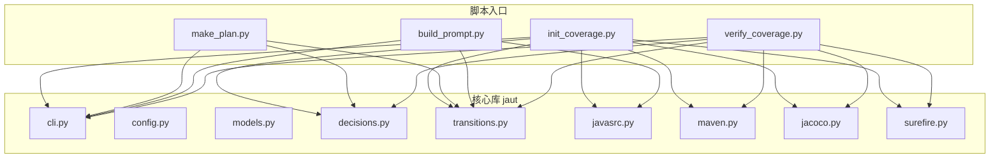
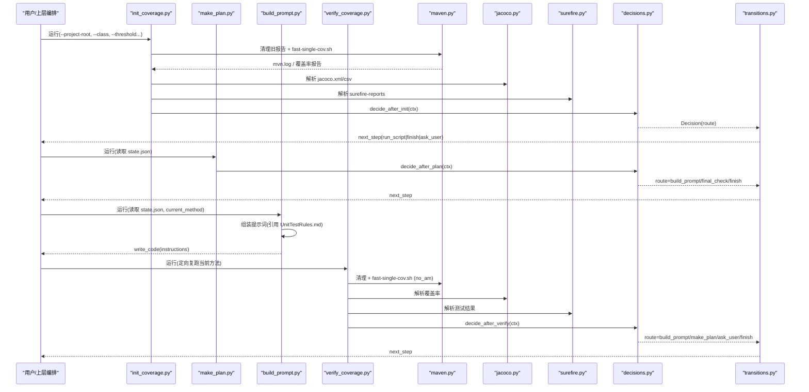
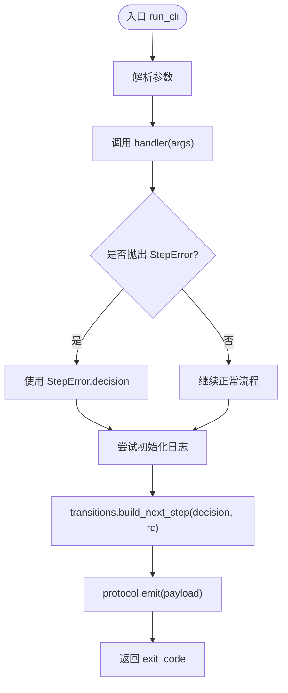
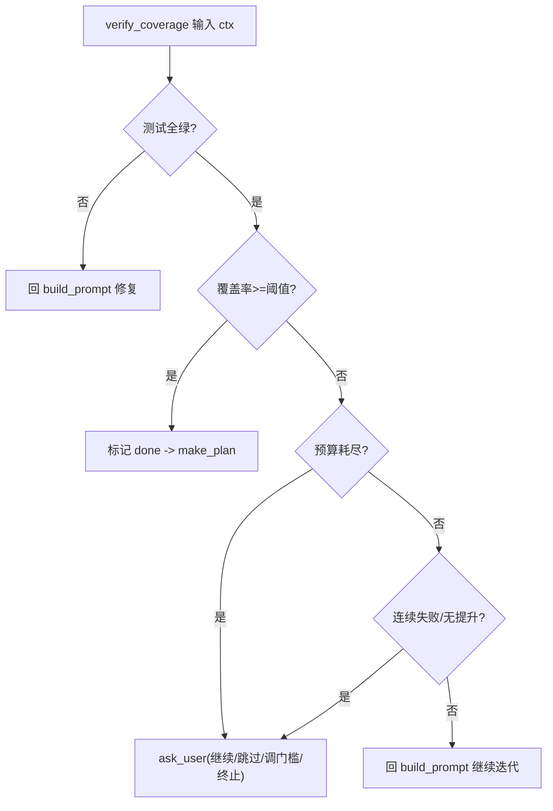
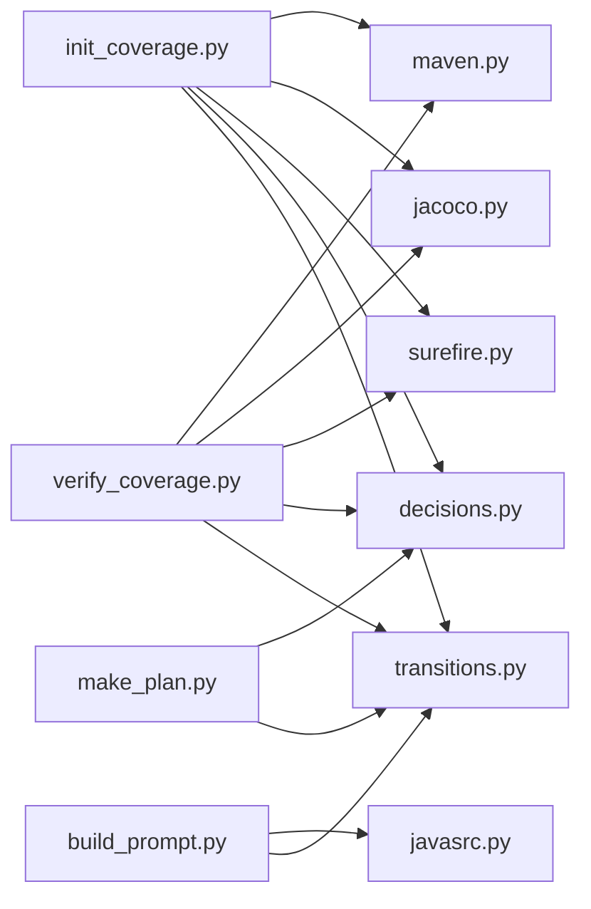

# 单类测试生成器

<cite>
**本文引用的文件**
- [cli.py](file://java-unit-test-generator/scripts/jaut/cli.py)
- [config.py](file://java-unit-test-generator/scripts/jaut/config.py)
- [models.py](file://java-unit-test-generator/scripts/jaut/models.py)
- [decisions.py](file://java-unit-test-generator/scripts/jaut/decisions.py)
- [transitions.py](file://java-unit-test-generator/scripts/jaut/transitions.py)
- [javasrc.py](file://java-unit-test-generator/scripts/jaut/javasrc.py)
- [maven.py](file://java-unit-test-generator/scripts/jaut/maven.py)
- [jacoco.py](file://java-unit-test-generator/scripts/jaut/jacoco.py)
- [surefire.py](file://java-unit-test-generator/scripts/jaut/surefire.py)
- [init_coverage.py](file://java-unit-test-generator/scripts/init_coverage.py)
- [build_prompt.py](file://java-unit-test-generator/scripts/build_prompt.py)
- [verify_coverage.py](file://java-unit-test-generator/scripts/verify_coverage.py)
- [make_plan.py](file://java-unit-test-generator/scripts/make_plan.py)
- [workflow-details.md](file://java-unit-test-generator/references/workflow-details.md)
</cite>

## 目录
1. [简介](#简介)
2. [项目结构](#项目结构)
3. [核心组件](#核心组件)
4. [架构总览](#架构总览)
5. [详细组件分析](#详细组件分析)
6. [依赖关系分析](#依赖关系分析)
7. [性能与覆盖率驱动迭代](#性能与覆盖率驱动迭代)
8. [故障排除指南](#故障排除指南)
9. [结论](#结论)
10. [附录：CLI 命令与配置示例](#附录cli-命令与配置示例)

## 简介
本工具为“单类测试生成器”，面向单个 Java 类，提供从类选择、依赖分析、Mock 上下文构建、覆盖率采集到覆盖率驱动的迭代闭环的完整自动化流程。其核心能力包括：
- 智能类与方法选择：基于 JaCoCo 方法级覆盖率与失败用例归属，自动排序并推进当前待测方法。
- 依赖分析与构建：自动探测 Maven 多模块结构、JaCoCo 插件配置，必要时降级执行策略，确保覆盖率报告稳定产出。
- Mock 与提示词组装：将目标方法及其调用的私有辅助方法源码抽取，结合规则文档生成 LLM 编写测试的提示词。
- 覆盖率验证与迭代：以 surefire 测试结果与 JaCoCo 覆盖率为双条件判定，配合预算与升级机制，自动重试直至达标或进入人工决策。
- CLI 工作流：通过一组脚本（init_coverage、make_plan、build_prompt、verify_coverage、final-check）串联，输出标准 NEXT_STEP 协议供上层编排。

该文档既适合初学者快速上手，也为高级用户提供深入配置与优化建议。

## 项目结构
- scripts/jaut：核心库，包含 CLI 框架、模型、决策、路由、Maven/JaCoCo/Surefire 解析、Java 源码静态分析等。
- scripts/*.py：工作流入口脚本，负责编排各阶段任务与状态持久化。
- references：参考文档与工作流细节说明。
- protocol：NEXT_STEP 协议 schema。

**图表来源**
- [init_coverage.py:122-341](file://java-unit-test-generator/scripts/init_coverage.py#L122-L341)
- [make_plan.py:65-103](file://java-unit-test-generator/scripts/make_plan.py#L65-L103)
- [build_prompt.py:47-87](file://java-unit-test-generator/scripts/build_prompt.py#L47-L87)
- [verify_coverage.py:58-198](file://java-unit-test-generator/scripts/verify_coverage.py#L58-L198)
- [cli.py:95-128](file://java-unit-test-generator/scripts/jaut/cli.py#L95-L128)
- [transitions.py:39-66](file://java-unit-test-generator/scripts/jaut/transitions.py#L39-L66)

**章节来源**
- [workflow-details.md:36-55](file://java-unit-test-generator/references/workflow-details.md#L36-L55)
- [cli.py:95-128](file://java-unit-test-generator/scripts/jaut/cli.py#L95-L128)

## 核心组件
- CLI 框架：统一参数解析、日志初始化、异常到协议块转换、路由与 next_step 组装。
- 配置中心：阈值、超时、预算、Maven 必带参数、退出码等集中管理。
- 领域模型：覆盖率原语、方法/类覆盖率、测试结果、决策产物 Decision、状态 State。
- 决策引擎：纯函数实现 init/plan/verify 三处分叉的优先级判定与升级策略。
- 路由系统：将 Route 映射为具体 next_step（run_script/write_code/finish/ask_user），补全路径与参数。
- 源码分析：剥离注释/字符串、定位方法体、抽取 private 辅助方法、FQCN 定位源文件。
- 构建与覆盖率：Maven 命令构建、fast-single-cov.sh 快速采集、Surefire 报告解析、JaCoCo XML/CSV 解析。

**章节来源**
- [config.py:44-118](file://java-unit-test-generator/scripts/jaut/config.py#L44-L118)
- [models.py:24-31](file://java-unit-test-generator/scripts/jaut/models.py#L24-L31)
- [models.py:310-342](file://java-unit-test-generator/scripts/jaut/models.py#L310-L342)
- [decisions.py:178-266](file://java-unit-test-generator/scripts/jaut/decisions.py#L178-L266)
- [transitions.py:39-66](file://java-unit-test-generator/scripts/jaut/transitions.py#L39-L66)
- [javasrc.py:198-294](file://java-unit-test-generator/scripts/jaut/javasrc.py#L198-L294)
- [maven.py:248-316](file://java-unit-test-generator/scripts/jaut/maven.py#L248-L316)
- [jacoco.py:71-179](file://java-unit-test-generator/scripts/jaut/jacoco.py#L71-L179)
- [surefire.py:45-69](file://java-unit-test-generator/scripts/jaut/surefire.py#L45-L69)

## 架构总览
整体工作流由四个阶段组成：
1) 初始化基线与门槛判定（init_coverage）
2) 计划与推进（make_plan）
3) 提示词组装（build_prompt）
4) 覆盖率验证与迭代（verify_coverage）
5) 终验（init_coverage --final-check）

**图表来源**
- [init_coverage.py:122-341](file://java-unit-test-generator/scripts/init_coverage.py#L122-L341)
- [make_plan.py:65-103](file://java-unit-test-generator/scripts/make_plan.py#L65-L103)
- [build_prompt.py:47-87](file://java-unit-test-generator/scripts/build_prompt.py#L47-L87)
- [verify_coverage.py:58-198](file://java-unit-test-generator/scripts/verify_coverage.py#L58-L198)
- [decisions.py:389-488](file://java-unit-test-generator/scripts/jaut/decisions.py#L389-L488)
- [transitions.py:39-66](file://java-unit-test-generator/scripts/jaut/transitions.py#L39-L66)

## 详细组件分析

### CLI 框架与错误处理
- 统一入口 run_cli：解析参数、调用 handler、捕获 StepError 与未捕获异常，转换为 Decision，再经 transitions.build_next_step 生成 next_step，最后 emit 协议块。
- 共享参数：--workdir 与 --project-root 二选一；缺失时抛出状态错误（exit 3）。
- 日志：在 EmitContext.workdir 存在时初始化日志，失败不影响协议输出。

**图表来源**
- [cli.py:95-128](file://java-unit-test-generator/scripts/jaut/cli.py#L95-L128)

**章节来源**
- [cli.py:25-47](file://java-unit-test-generator/scripts/jaut/cli.py#L25-L47)
- [cli.py:63-86](file://java-unit-test-generator/scripts/jaut/cli.py#L63-L86)
- [cli.py:95-128](file://java-unit-test-generator/scripts/jaut/cli.py#L95-L128)

### 配置与常量
- 默认覆盖率阈值：80%。
- Maven 超时：可环境变量覆盖，默认 1800 秒。
- 迭代预算：单方法默认 8 轮，全局默认 30 轮，支持追加窗口。
- 连续失败/无提升阈值：均为 3 轮触发 ask_user。
- Maven 必带参数：忽略测试失败以保证失败轮仍产出覆盖率报告，由 surefire 做唯一判定。

**章节来源**
- [config.py:53-73](file://java-unit-test-generator/scripts/jaut/config.py#L53-L73)
- [config.py:75-99](file://java-unit-test-generator/scripts/jaut/config.py#L75-L99)
- [config.py:104-118](file://java-unit-test-generator/scripts/jaut/config.py#L104-L118)

### 领域模型
- 覆盖率原语 coverage_rate：covered+missed==0 视为抽象/接口方法，按 100% 计。
- MethodCoverage：记录 covered/missed、status、round_rates、round_test_results、initial_rate。
- TestResult：fail-closed 绿灯判定，报告缺失/不可解析/存在失败用例一律不绿。
- Decision：携带 route、reason、instructions、artifacts、metrics、resume、on_complete、mark_done、reset_trajectory。
- State：持久化 state.json，含 threshold、target_class/module、methods、coverage_history、test_history、final_checked 等。

**章节来源**
- [models.py:24-31](file://java-unit-test-generator/scripts/jaut/models.py#L24-L31)
- [models.py:119-176](file://java-unit-test-generator/scripts/jaut/models.py#L119-L176)
- [models.py:239-277](file://java-unit-test-generator/scripts/jaut/models.py#L239-L277)
- [models.py:310-342](file://java-unit-test-generator/scripts/jaut/models.py#L310-L342)
- [models.py:347-499](file://java-unit-test-generator/scripts/jaut/models.py#L347-L499)

### 决策引擎
- decide_after_init：基线/终验门槛判定，优先 finish，其次 ask_user（终验连续不绿且无可修复方法），否则回 make_plan。
- decide_after_plan：有 pending -> build_prompt；队列为空且已终验 -> finish；否则 final-check。
- decide_after_verify：单方法迭代双条件判定（覆盖率达标 + 测试全绿），否则按预算耗尽/连续失败/无提升/测试不绿/覆盖率未达标分流。

**图表来源**
- [decisions.py:178-266](file://java-unit-test-generator/scripts/jaut/decisions.py#L178-L266)

**章节来源**
- [decisions.py:389-488](file://java-unit-test-generator/scripts/jaut/decisions.py#L389-L488)
- [decisions.py:583-610](file://java-unit-test-generator/scripts/jaut/decisions.py#L583-L610)

### 路由与协议
- transitions.build_next_step：根据 Decision.route 生成 next_step 对象，run_script 路由补全脚本绝对路径与参数；write_code/finish/ask_user 直接组装。
- resume 条目：语义级 ResumeOption 在此补全 scripts/ 绝对路径与 --workdir，调用方可逐字执行。

**章节来源**
- [transitions.py:39-66](file://java-unit-test-generator/scripts/jaut/transitions.py#L39-L66)
- [transitions.py:69-104](file://java-unit-test-generator/scripts/jaut/transitions.py#L69-L104)
- [transitions.py:107-126](file://java-unit-test-generator/scripts/jaut/transitions.py#L107-L126)

### 源码静态分析
- strip_comments_and_strings：严格保长度，下标与原串一一对应，供规则校验与方法抽取共用。
- extract_with_helpers：主方法源码块 + 被调用的本类 private 方法源码块，宁多勿漏。
- locate_source_file：按 FQCN 在 src/main/java 下定位源文件，支持模块优先搜索。

**章节来源**
- [javasrc.py:73-144](file://java-unit-test-generator/scripts/jaut/javasrc.py#L73-L144)
- [javasrc.py:198-294](file://java-unit-test-generator/scripts/jaut/javasrc.py#L198-L294)
- [javasrc.py:300-355](file://java-unit-test-generator/scripts/jaut/javasrc.py#L300-L355)

### Maven 与覆盖率采集
- build_mvn_cmd：检测 pom 是否配置 jacoco-maven-plugin，未配置则用完整坐标挂载 prepare-agent/report；始终使用 -Dtest 指定测试类。
- run_fast_single_cov：使用 fast-single-cov.sh 获取单类覆盖率；失败时根据日志判断是否值得降级到 mvn test jacoco:report。
- clean_jacoco_dirs/clean_surefire_dirs：每次执行前清理旧覆盖率与测试报告，防止误读历史结果。

**章节来源**
- [maven.py:248-316](file://java-unit-test-generator/scripts/jaut/maven.py#L248-L316)
- [maven.py:326-414](file://java-unit-test-generator/scripts/jaut/maven.py#L326-L414)
- [maven.py:469-508](file://java-unit-test-generator/scripts/jaut/maven.py#L469-L508)

### JaCoCo 与 Surefire 解析
- parse_jacoco_xml：解析方法级行覆盖率，内部类聚合到外部类 FQCN，合成方法过滤。
- parse_jacoco_csv：类级行覆盖率（含内部类聚合），excludes 模式一致生效。
- parse_surefire_reports：优先解析 TEST-*.xml，回退 *.txt；无法解析的报告计入 parse_errors，按失败计。

**章节来源**
- [jacoco.py:71-179](file://java-unit-test-generator/scripts/jaut/jacoco.py#L71-L179)
- [surefire.py:45-69](file://java-unit-test-generator/scripts/jaut/surefire.py#L45-L69)
- [surefire.py:72-146](file://java-unit-test-generator/scripts/jaut/surefire.py#L72-L146)

### 工作流脚本
- init_coverage：建立覆盖率基线并做门槛判定；自动创建桩测试类；支持终验模式；原子写入 state.json 与 coverage.json。
- make_plan：读取 state.json，生成/推进单方法测试计划；落地用户决策（跳过/调门槛/追加预算）。
- build_prompt：读取 state.json，组装提示词（引用 UnitTestRules.md），输出 write_code 决策。
- verify_coverage：定向复跑当前方法，记录本轮观测，交 decisions 决策；编译失败路由到 write_code 自愈。

**章节来源**
- [init_coverage.py:122-341](file://java-unit-test-generator/scripts/init_coverage.py#L122-L341)
- [make_plan.py:65-103](file://java-unit-test-generator/scripts/make_plan.py#L65-L103)
- [build_prompt.py:47-87](file://java-unit-test-generator/scripts/build_prompt.py#L47-L87)
- [verify_coverage.py:58-198](file://java-unit-test-generator/scripts/verify_coverage.py#L58-L198)

## 依赖关系分析
- 低耦合高内聚：jaut 包提供纯函数与数据模型，脚本层只做编排与 I/O。
- 关键依赖链：
  - init_coverage -> maven/jacoco/surefire -> decisions -> transitions
  - make_plan -> decisions -> transitions
  - build_prompt -> javasrc/prompt -> transitions
  - verify_coverage -> maven/jacoco/surefire -> decisions -> transitions

**图表来源**
- [init_coverage.py:122-341](file://java-unit-test-generator/scripts/init_coverage.py#L122-L341)
- [make_plan.py:65-103](file://java-unit-test-generator/scripts/make_plan.py#L65-L103)
- [build_prompt.py:47-87](file://java-unit-test-generator/scripts/build_prompt.py#L47-L87)
- [verify_coverage.py:58-198](file://java-unit-test-generator/scripts/verify_coverage.py#L58-L198)

**章节来源**
- [decisions.py:178-266](file://java-unit-test-generator/scripts/jaut/decisions.py#L178-L266)
- [transitions.py:39-66](file://java-unit-test-generator/scripts/jaut/transitions.py#L39-L66)

## 性能与覆盖率驱动迭代
- 覆盖率阈值：默认 80%，可通过 --threshold 调整；终验模式默认沿用 init 轮门槛，需加 --override-threshold 才生效。
- 迭代预算：单方法默认 8 轮，全局默认 30 轮；支持 --grant-rounds 追加窗口，避免假死循环。
- 连续失败/无提升：均 3 轮触发 ask_user，提供继续/跳过/调门槛/终止选项。
- 快速采集：优先使用 fast-single-cov.sh，失败时根据日志判断是否降级到 mvn test jacoco:report。
- 报告清理：每次执行前清理 target/site/jacoco 与 target/surefire-reports，防止陈旧数据影响判定。
- fail-closed 绿灯：surefire 报告缺失/不可解析/存在失败用例一律不绿，保证双条件闸门严谨。

**章节来源**
- [config.py:53-73](file://java-unit-test-generator/scripts/jaut/config.py#L53-L73)
- [config.py:75-99](file://java-unit-test-generator/scripts/jaut/config.py#L75-L99)
- [maven.py:469-508](file://java-unit-test-generator/scripts/jaut/maven.py#L469-L508)
- [surefire.py:45-69](file://java-unit-test-generator/scripts/jaut/surefire.py#L45-L69)
- [decisions.py:178-266](file://java-unit-test-generator/scripts/jaut/decisions.py#L178-L266)

## 故障排除指南
- Maven 构建失败：
  - 检查 mvn 是否在 PATH，或安装 Maven。
  - 查看 mvn.log，区分编译错误与环境/依赖问题；编译错误路由到 write_code 自愈，环境问题 ask_user。
  - 多模块项目先执行 install -DskipTests 确保依赖模块已安装。
- JaCoCo 集成问题：
  - 若 pom 未配置 jacoco-maven-plugin，工具会自动用完整坐标挂载 prepare-agent/report。
  - fast-single-cov.sh 失败时，根据日志判断是否值得降级到 mvn test jacoco:report。
  - 清理 target/site/jacoco 与 target/jacoco.exec，防止陈旧数据导致虚假达标。
- Surefire 报告问题：
  - 确保 -Dtest 指定了正确的测试类名；报告缺失按失败计。
  - 报告无法解析计入 parse_errors，按失败计。
- 覆盖率未达标：
  - 检查 --coverage-exclude 是否命中目标类本身（会报错）；确认目标类已被编译。
  - 查看 jacoco.xml/csv 中是否存在目标类方法记录。
- 状态/协议错误：
  - 确保先运行 init_coverage.py 生成 state.json，再运行 make_plan.py。
  - 检查 --workdir 或 --project-root 是否正确传入。

**章节来源**
- [maven.py:248-316](file://java-unit-test-generator/scripts/jaut/maven.py#L248-L316)
- [maven.py:326-414](file://java-unit-test-generator/scripts/jaut/maven.py#L326-L414)
- [surefire.py:45-69](file://java-unit-test-generator/scripts/jaut/surefire.py#L45-L69)
- [init_coverage.py:122-341](file://java-unit-test-generator/scripts/init_coverage.py#L122-L341)
- [verify_coverage.py:58-198](file://java-unit-test-generator/scripts/verify_coverage.py#L58-L198)

## 结论
单类测试生成器通过清晰的阶段划分、纯函数决策与健壮的路由机制，实现了从类选择、依赖分析、提示词组装到覆盖率验证的完整闭环。其覆盖率驱动的迭代机制结合预算与升级策略，有效避免了无限循环与假死场景。对于复杂依赖与异常路径，提供了降级方案与自愈路由，确保流程稳健推进。

## 附录：CLI 命令与配置示例
- 初始化基线：
  - python scripts/init_coverage.py --project-root <worktree> --class <FQCN 或源文件路径> [--method <方法名>] [--threshold N] [--workdir <wd>] [--jacoco-version V] [--coverage-exclude PATTERN ...]
- 计划与推进：
  - python scripts/make_plan.py --workdir <wd> [--skip-current] [--set-threshold N] [--grant-rounds N]
- 提示词组装：
  - python scripts/build_prompt.py --workdir <wd>
- 覆盖率验证：
  - python scripts/verify_coverage.py --workdir <wd>
- 终验：
  - python scripts/init_coverage.py --project-root <worktree> --class <FQCN> --final-check [--override-threshold]

- 覆盖率阈值与预算：
  - 默认阈值 80%；单方法预算 8 轮，全局预算 30 轮；可通过环境变量 JAVA_UT_METHOD_ROUND_BUDGET、JAVA_UT_GLOBAL_ROUND_BUDGET 覆盖。
- 复杂依赖处理：
  - 多模块项目先执行 install -DskipTests；fast-single-cov.sh 失败时自动降级到 mvn test jacoco:report。
- 异常路径测试生成：
  - 通过 build_prompt 组装提示词，包含目标方法及其调用的 private 辅助方法源码，引导 LLM 生成覆盖异常分支的测试。

**章节来源**
- [workflow-details.md:36-55](file://java-unit-test-generator/references/workflow-details.md#L36-L55)
- [config.py:75-99](file://java-unit-test-generator/scripts/jaut/config.py#L75-L99)
- [maven.py:248-316](file://java-unit-test-generator/scripts/jaut/maven.py#L248-L316)
- [build_prompt.py:47-87](file://java-unit-test-generator/scripts/build_prompt.py#L47-L87)