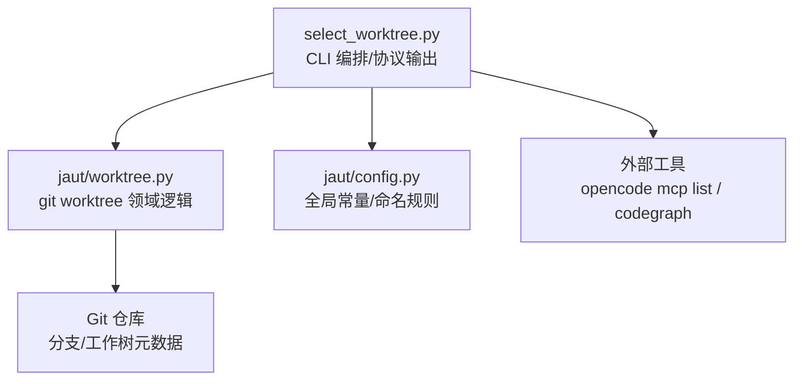
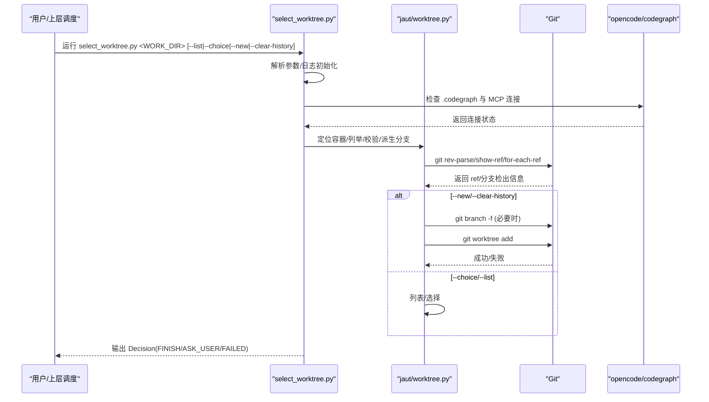
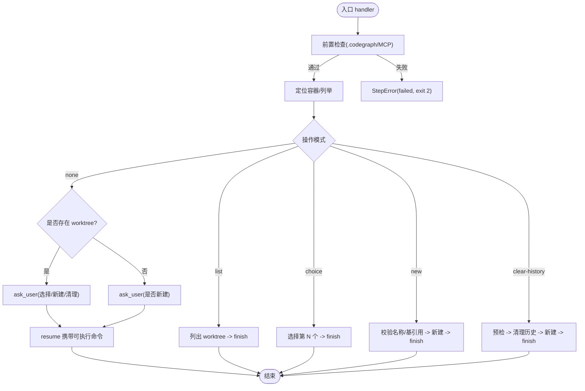
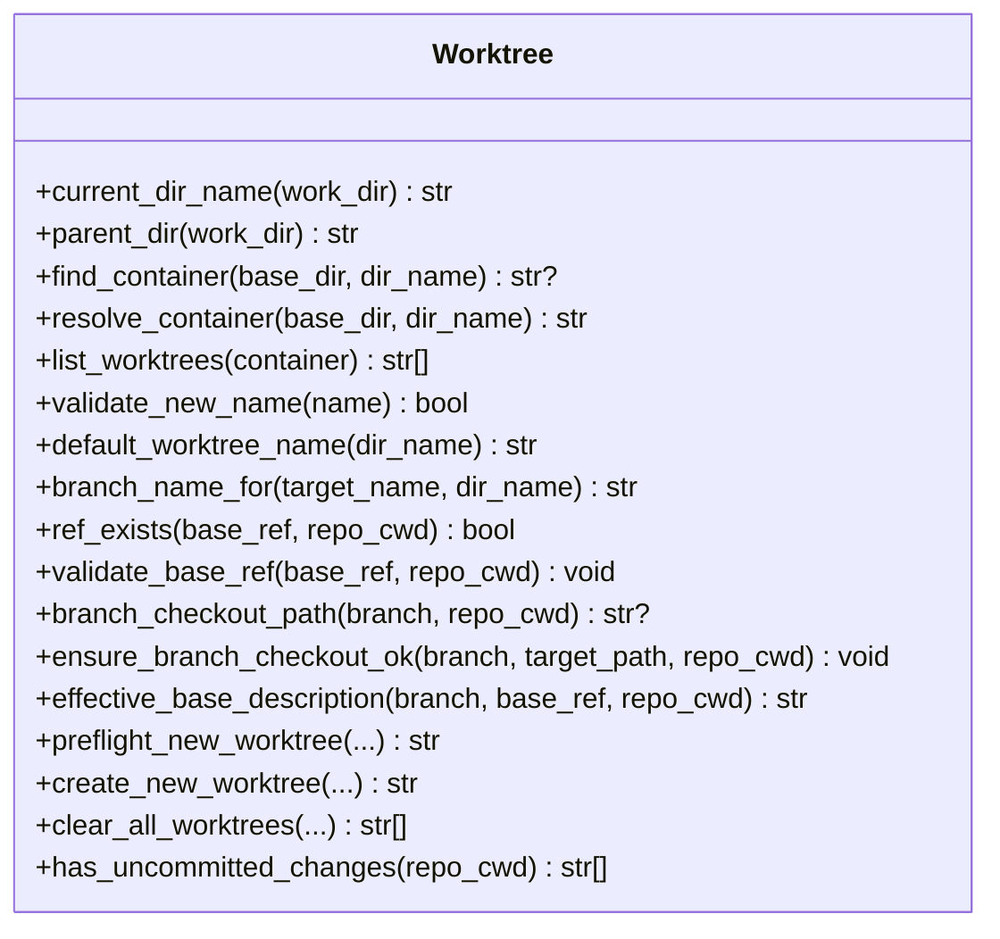
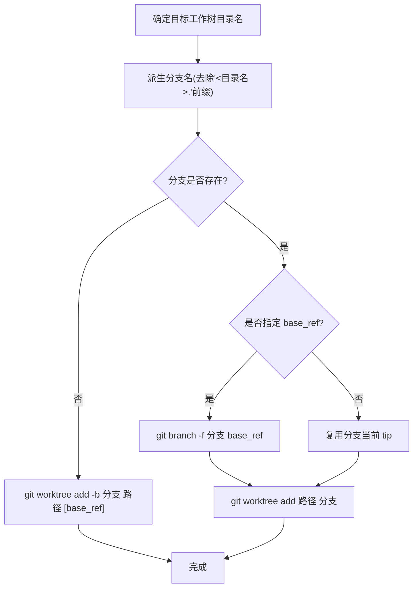
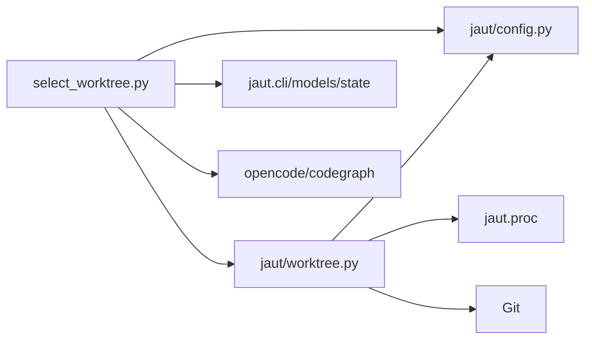

# 工作树隔离管理

<cite>
**本文引用的文件**
- [select_worktree.py](file://batch-unit-test-generator/scripts/select_worktree.py)
- [worktree.py](file://batch-unit-test-generator/scripts/jaut/worktree.py)
- [config.py](file://batch-unit-test-generator/scripts/jaut/config.py)
- [test_select_worktree_handler.py](file://batch-unit-test-generator/tests/test_select_worktree_handler.py)
- [test_worktree.py](file://batch-unit-test-generator/tests/test_worktree.py)
</cite>

## 目录
1. [简介](#简介)
2. [项目结构](#项目结构)
3. [核心组件](#核心组件)
4. [架构总览](#架构总览)
5. [详细组件分析](#详细组件分析)
6. [依赖关系分析](#依赖关系分析)
7. [性能与资源优化](#性能与资源优化)
8. [故障排除指南](#故障排除指南)
9. [结论](#结论)

## 简介
本文件系统性说明工作树隔离管理机制，覆盖以下内容：
- 工作树如何避免不同任务间的干扰（并行构建、测试互不污染）
- 工作树的创建、配置与管理策略
- select_worktree 命令的工作原理与智能选择逻辑
- 工作树命名约定、目录结构与文件组织方式
- 工作树与 Git 分支的映射关系
- 在工作树中独立执行 Maven 构建与测试的方式
- 磁盘空间管理与清理策略
- 常见冲突与资源竞争问题的排查方法

## 项目结构
围绕工作树的核心代码位于两个脚本与一个领域模块：
- 入口脚本：select_worktree.py（负责 CLI 编排、协议输出、前置检查与分派）
- 领域模块：jaut/worktree.py（封装 git worktree 操作、预检、清理、名称校验等）
- 配置常量：jaut/config.py（定义容器后缀、命名规则、禁用字符等）

图表来源
- [select_worktree.py:249-281](file://batch-unit-test-generator/scripts/select_worktree.py#L249-L281)
- [worktree.py:157-257](file://batch-unit-test-generator/scripts/jaut/worktree.py#L157-L257)
- [config.py:133-139](file://batch-unit-test-generator/scripts/jaut/config.py#L133-L139)

章节来源
- [select_worktree.py:1-487](file://batch-unit-test-generator/scripts/select_worktree.py#L1-L487)
- [worktree.py:1-333](file://batch-unit-test-generator/scripts/jaut/worktree.py#L1-L333)
- [config.py:1-181](file://batch-unit-test-generator/scripts/jaut/config.py#L1-L181)

## 核心组件
- select_worktree.py
  - 职责：解析参数、前置检查（CodeGraph 索引与 MCP 连接）、定位容器、按模式分派（--list/--choice/--new/--clear-history/无参数），输出 NEXT_STEP 协议决策。
  - 关键流程：handler -> _dispatch -> 调用 worktree 领域函数；失败时转为 StepError 并输出 failed + ask_user。
- jaut/worktree.py
  - 职责：工作树领域逻辑，包括容器查找/列举、名称校验、默认名生成、分支派生、base_ref 校验、分支检出冲突检测、新建/清理工作树、未提交变更检测。
  - 关键函数：preflight_new_worktree、create_new_worktree、clear_all_worktrees、branch_name_for、validate_base_ref、has_uncommitted_changes。
- jaut/config.py
  - 职责：集中定义工作树相关常量（容器后缀、命名后缀、禁用字符、哨兵值等）。

章节来源
- [select_worktree.py:68-84](file://batch-unit-test-generator/scripts/select_worktree.py#L68-L84)
- [worktree.py:23-20](file://batch-unit-test-generator/scripts/jaut/worktree.py#L23-L20)
- [config.py:133-139](file://batch-unit-test-generator/scripts/jaut/config.py#L133-L139)

## 架构总览
整体流程从入口脚本开始，经过前置检查与容器定位，再进入具体工作树操作。所有 git 操作统一通过 proc.run_command 执行，错误被捕获并转换为可预期的 WorktreeError，再由入口脚本转为协议错误。

图表来源
- [select_worktree.py:249-281](file://batch-unit-test-generator/scripts/select_worktree.py#L249-L281)
- [worktree.py:99-154](file://batch-unit-test-generator/scripts/jaut/worktree.py#L99-L154)
- [worktree.py:195-257](file://batch-unit-test-generator/scripts/jaut/worktree.py#L195-L257)

## 详细组件分析

### select_worktree 命令工作原理
- 前置检查
  - 要求工程根存在 .codegraph 索引，否则终止并提示执行 codegraph init。
  - 要求 opencode 的 codegraph MCP 已连接，否则终止并提示执行 codegraph install。
- 容器定位
  - 在 WORK_DIR 的上级目录查找或计算 '<目录名>.worktrees' 容器路径。
- 操作模式
  - --list：仅列出已有 worktree（信息型 finish）。
  - --choice N：选择第 N 个已有 worktree（1-based）。
  - --new [NAME]：新建 worktree（省略名称使用默认名），支持 --base REF。
  - --clear-history：预检通过后清理全部历史 worktree（分支保留），再新建默认名。
  - 无参数：若存在已有 worktree 则 ask_user 选择；否则 ask_user 确认是否新建。
- 脏工作区处理
  - 当主工作区有未提交变更且未带 --force 时，ask_user 询问继续或取消，resume 携带可逐字执行的命令。
- 协议输出
  - 成功：finish，deliverables/artifacts 包含选定/新建的工作树绝对路径。
  - 需要输入：ask_user，question 提供选项与 resume。
  - 失败：failed，exit_code=2，resume 仅 terminate。

图表来源
- [select_worktree.py:249-281](file://batch-unit-test-generator/scripts/select_worktree.py#L249-L281)
- [select_worktree.py:284-470](file://batch-unit-test-generator/scripts/select_worktree.py#L284-L470)

章节来源
- [select_worktree.py:161-246](file://batch-unit-test-generator/scripts/select_worktree.py#L161-L246)
- [select_worktree.py:284-470](file://batch-unit-test-generator/scripts/select_worktree.py#L284-L470)
- [test_select_worktree_handler.py:46-173](file://batch-unit-test-generator/tests/test_select_worktree_handler.py#L46-L173)

### 工作树领域逻辑（jaut/worktree.py）
- 命名与派生
  - 默认工作树名：<目录名>.worktree<yyyyMMdd>。
  - 分支名派生：剔除 '<目录名>.' 前缀，例如 'repo.worktree20260903' -> 'worktree20260903'。
  - 名称校验：禁止路径分隔符、'.'/'..'以及配置中的禁用字符集合。
- 预检（preflight_new_worktree）
  - 校验 base_ref 有效性。
  - 目标路径存在且非目录时报错。
  - 检测分支是否已被检出到非允许路径（容器内将被 clear 释放的路径视为允许）。
- 新建工作树（create_new_worktree）
  - 分支存在 + base_ref：强制重置该分支到 base_ref，再 worktree add。
  - 分支存在 + 无 base_ref：复用已有分支 tip。
  - 分支不存在 + base_ref：worktree add -b 基于指定 ref。
  - 分支不存在 + 无 base_ref：worktree add -b 基于当前 HEAD。
- 清理历史工作树（clear_all_worktrees）
  - 始终 git worktree remove --force（历史树几乎必脏，不做脏树询问）。
  - 移除后执行 git worktree prune 清理陈旧元数据。
  - 对非有效注册的残留目录，prune 重试后兜底 rmtree。
- 未提交变更检测（has_uncommitted_changes）
  - 通过 git status --porcelain 判断是否有 staged/unstaged/untracked 变更。

图表来源
- [worktree.py:27-154](file://batch-unit-test-generator/scripts/jaut/worktree.py#L27-L154)
- [worktree.py:157-257](file://batch-unit-test-generator/scripts/jaut/worktree.py#L157-L257)
- [worktree.py:260-333](file://batch-unit-test-generator/scripts/jaut/worktree.py#L260-L333)

章节来源
- [worktree.py:70-97](file://batch-unit-test-generator/scripts/jaut/worktree.py#L70-L97)
- [worktree.py:99-154](file://batch-unit-test-generator/scripts/jaut/worktree.py#L99-L154)
- [worktree.py:195-257](file://batch-unit-test-generator/scripts/jaut/worktree.py#L195-L257)
- [worktree.py:260-333](file://batch-unit-test-generator/scripts/jaut/worktree.py#L260-L333)
- [test_worktree.py:23-63](file://batch-unit-test-generator/tests/test_worktree.py#L23-L63)
- [test_worktree.py:115-155](file://batch-unit-test-generator/tests/test_worktree.py#L115-L155)
- [test_worktree.py:158-234](file://batch-unit-test-generator/tests/test_worktree.py#L158-L234)
- [test_worktree.py:236-339](file://batch-unit-test-generator/tests/test_worktree.py#L236-L339)

### 工作树与 Git 分支的映射关系
- 每个工作树对应一个派生分支，分支名由工作树目录名派生而来。
- 当分支已存在且指定 base_ref 时，会强制重置该分支到指定 ref 后再检出，确保工作树落在期望提交上。
- 分支未被任何工作树检出时才允许在新路径创建；若已在其他路径检出，将报错阻止创建。

图表来源
- [worktree.py:89-97](file://batch-unit-test-generator/scripts/jaut/worktree.py#L89-L97)
- [worktree.py:195-257](file://batch-unit-test-generator/scripts/jaut/worktree.py#L195-L257)

章节来源
- [worktree.py:89-97](file://batch-unit-test-generator/scripts/jaut/worktree.py#L89-L97)
- [worktree.py:195-257](file://batch-unit-test-generator/scripts/jaut/worktree.py#L195-L257)

### 工作树命名约定、目录结构与文件组织
- 容器目录：在 WORK_DIR 的上级目录下，名为 '<目录名>.worktrees'。
- 单个工作树目录：默认 '<目录名>.worktree<yyyyMMdd>'，也可自定义名称（需通过 validate_new_name 校验）。
- 文件组织：后续所有脚本以选定的工作树为 <project-root>，测试代码、覆盖率报告、state.json 等产物均落在工作树内，与主工作区隔离。
- 配置常量：容器后缀、命名后缀、禁用字符、哨兵值均在 config.py 中统一定义。

章节来源
- [config.py:133-139](file://batch-unit-test-generator/scripts/jaut/config.py#L133-L139)
- [worktree.py:37-47](file://batch-unit-test-generator/scripts/jaut/worktree.py#L37-L47)
- [worktree.py:70-87](file://batch-unit-test-generator/scripts/jaut/worktree.py#L70-L87)
- [select_worktree.py:5-7](file://batch-unit-test-generator/scripts/select_worktree.py#L5-L7)

### 在工作树中独立执行 Maven 构建与测试
- 工作流约定：技能第一步总是运行 select_worktree 确认/选择工作树；后续所有脚本以选定工作树为 <project-root>。
- 这意味着 Maven 构建与测试将在工作树内进行，不会污染主工作区，也不会与其他任务共享同一工作目录。
- 超时与进度控制等 Maven 相关配置集中在 config.py（如 MVN_TIMEOUT、MVN_ALWAYS_FLAGS、进度文件等），可在环境或配置中调整。

章节来源
- [select_worktree.py:5-7](file://batch-unit-test-generator/scripts/select_worktree.py#L5-L7)
- [config.py:81-118](file://batch-unit-test-generator/scripts/jaut/config.py#L81-L118)

## 依赖关系分析
- select_worktree.py 依赖：
  - jaut.config：读取工作树相关常量。
  - jaut.worktree：调用领域函数进行容器定位、列举、预检、新建、清理。
  - jaut.cli/models/state：协议输出、路由、状态与工作目录。
- worktree.py 依赖：
  - jaut.config：常量。
  - jaut.proc：统一执行 git 命令。
- 外部依赖：
  - Git：用于 worktree、分支、ref 等操作。
  - opencode/codegraph：前置检查 MCP 连接与索引。

图表来源
- [select_worktree.py:57-63](file://batch-unit-test-generator/scripts/select_worktree.py#L57-L63)
- [worktree.py:19-20](file://batch-unit-test-generator/scripts/jaut/worktree.py#L19-L20)

章节来源
- [select_worktree.py:57-63](file://batch-unit-test-generator/scripts/select_worktree.py#L57-L63)
- [worktree.py:19-20](file://batch-unit-test-generator/scripts/jaut/worktree.py#L19-L20)

## 性能与资源优化
- 磁盘空间管理
  - 定期使用 --clear-history 清理历史工作树，释放磁盘空间；清理会删除历史工作树未提交内容（不可恢复），但保留分支。
  - 清理后自动执行 git worktree prune，清除陈旧元数据。
- 并发与隔离
  - 每个任务使用独立工作树，避免构建缓存、临时文件、测试结果相互污染。
  - 通过分支派生与 preflight 检查，防止同一分支在多路径检出导致的冲突。
- 超时与健壮性
  - Git 命令设置超时（config.GIT_COMMAND_TIMEOUT_SECONDS），防止 NFS/网络挂起导致阻塞。
  - Maven 超时与进程终止策略在 config 中集中管理，避免长时间占用资源。
- 建议策略
  - 自动化流水线中优先使用 --clear-history --force 重建干净工作树，减少累积开销。
  - 合理设置 base_ref，确保工作树基于稳定版本，降低重复构建成本。
  - 监控工作树数量与磁盘使用，及时清理不再需要的历史树。

[本节为通用指导，不直接分析具体文件]

## 故障排除指南
- 缺少 CodeGraph 索引
  - 现象：任务中止，提示执行 codegraph init。
  - 原因：工程根目录不存在 .codegraph。
  - 解决：在工程根目录执行 codegraph init 后重新运行。
- CodeGraph MCP 未连接
  - 现象：任务中止，提示执行 codegraph install。
  - 原因：opencode mcp list 未检测到 codegraph.*connected。
  - 解决：执行 codegraph install 完成 MCP 配置后重新运行。
- 分支已被检出到其他路径
  - 现象：创建工作树失败，提示分支已在某路径检出。
  - 原因：派生分支在其他位置被检出，precheck 阻止冲突。
  - 解决：切换到其他分支或移除冲突检出路径后再试。
- base_ref 无效
  - 现象：预检失败，提示 base_ref 不存在或无效。
  - 原因：指定的 ref 无法解析。
  - 解决：修正 base_ref 指向有效的分支/标签/提交。
- 目标路径不是目录
  - 现象：预检失败，提示目标路径已存在但不是目录。
  - 原因：同名文件占用了预期目录。
  - 解决：删除文件或重命名目标。
- 历史清理失败
  - 现象：git worktree remove 失败。
  - 原因：非有效注册或权限问题。
  - 解决：先执行 git worktree prune 重试；仍失败则手动删除残留目录。

章节来源
- [select_worktree.py:161-246](file://batch-unit-test-generator/scripts/select_worktree.py#L161-L246)
- [worktree.py:106-112](file://batch-unit-test-generator/scripts/jaut/worktree.py#L106-L112)
- [worktree.py:125-144](file://batch-unit-test-generator/scripts/jaut/worktree.py#L125-L144)
- [worktree.py:260-307](file://batch-unit-test-generator/scripts/jaut/worktree.py#L260-L307)
- [test_select_worktree_handler.py:190-228](file://batch-unit-test-generator/tests/test_select_worktree_handler.py#L190-L228)
- [test_select_worktree_handler.py:267-304](file://batch-unit-test-generator/tests/test_select_worktree_handler.py#L267-L304)

## 结论
工作树隔离机制通过独立的目录与分支映射，确保多个任务并行执行时互不干扰。select_worktree 提供健壮的 CLI 与协议输出，结合 preflight 检查、base_ref 控制与历史清理策略，既保证了安全性又提升了可维护性。配合合理的命名约定与资源管理策略，可在大规模并行构建与测试场景中稳定运行。