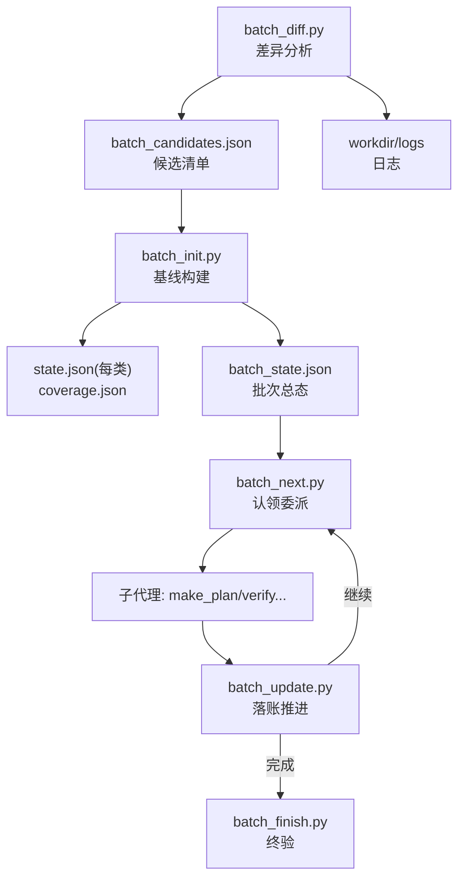
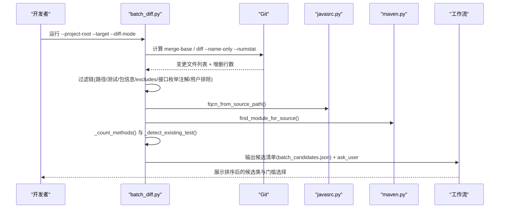
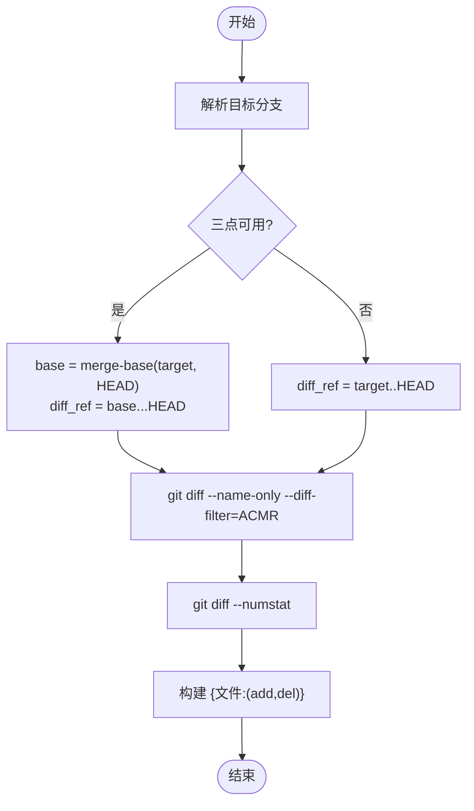
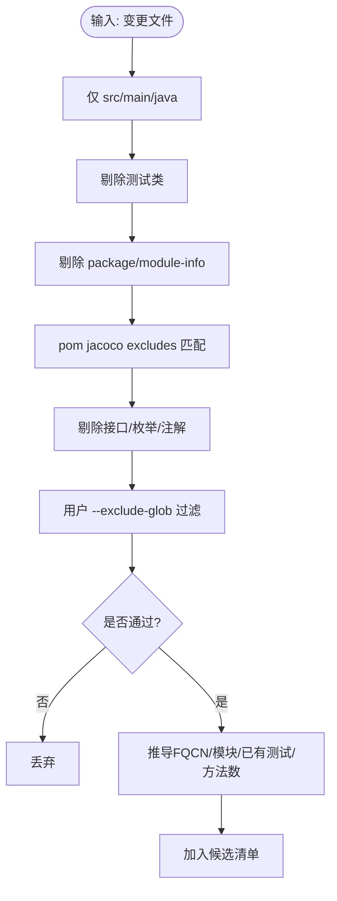
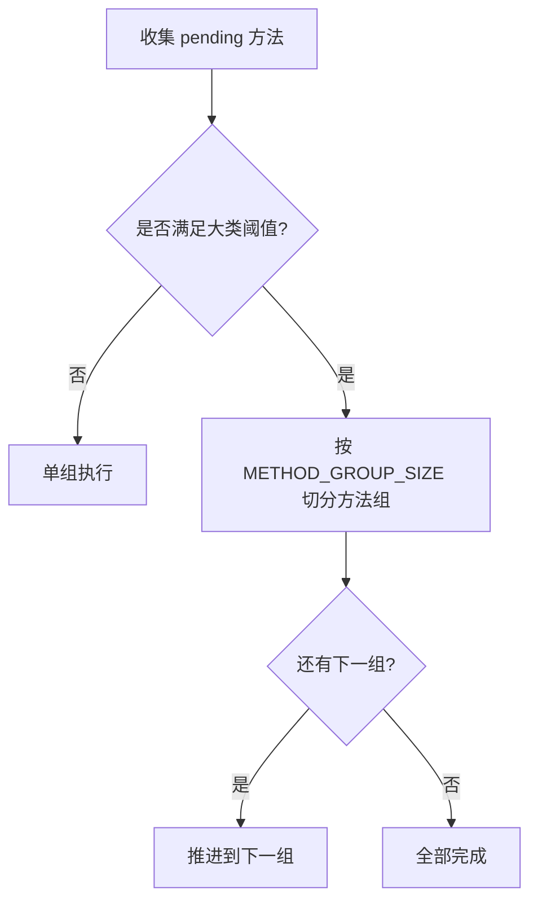
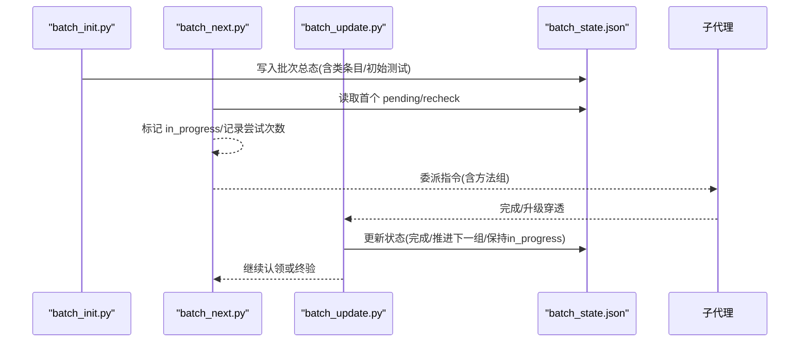
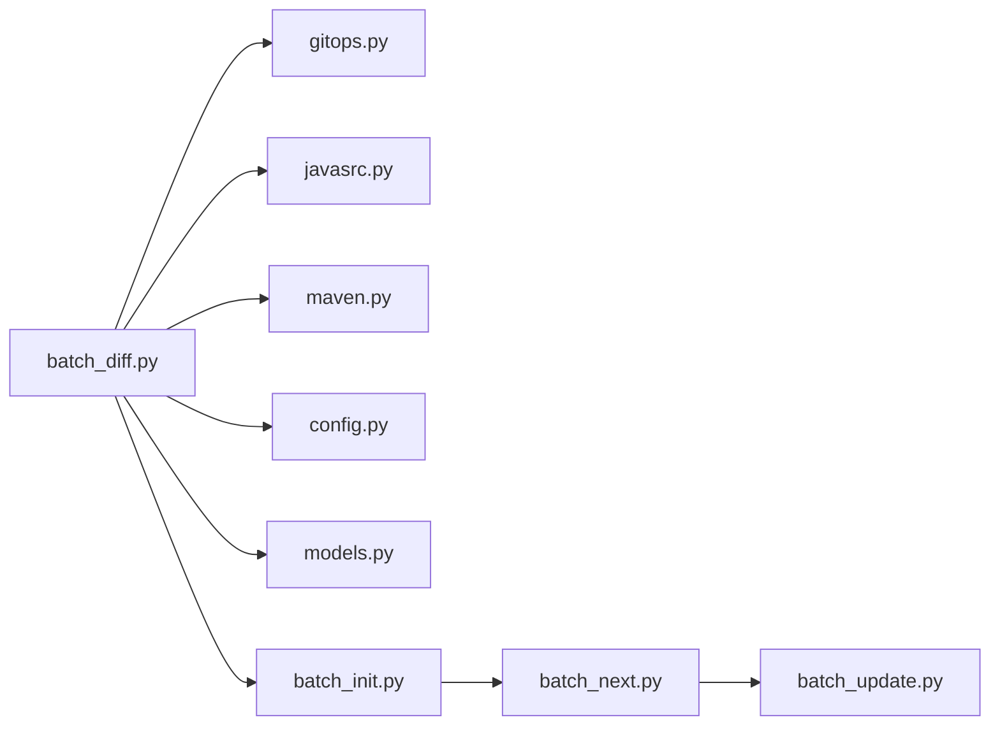

# 差异分析与候选类筛选

<cite>
**本文引用的文件**
- [batch_diff.py](file://batch-unit-test-generator/scripts/batch_diff.py)
- [diff-analysis.md](file://batch-unit-test-generator/references/diff-analysis.md)
- [gitops.py](file://batch-unit-test-generator/scripts/jaut/gitops.py)
- [javasrc.py](file://batch-unit-test-generator/scripts/jaut/javasrc.py)
- [maven.py](file://batch-unit-test-generator/scripts/jaut/maven.py)
- [config.py](file://batch-unit-test-generator/scripts/jaut/config.py)
- [models.py](file://batch-unit-test-generator/scripts/jaut/models.py)
- [batch_init.py](file://batch-unit-test-generator/scripts/batch_init.py)
- [batch_next.py](file://batch-unit-test-generator/scripts/batch_next.py)
- [batch_update.py](file://batch-unit-test-generator/scripts/batch_update.py)
</cite>

## 目录
1. [简介](#简介)
2. [项目结构](#项目结构)
3. [核心组件](#核心组件)
4. [架构总览](#架构总览)
5. [详细组件分析](#详细组件分析)
6. [依赖关系分析](#依赖关系分析)
7. [性能考虑](#性能考虑)
8. [故障排查指南](#故障排查指南)
9. [结论](#结论)
10. [附录](#附录)

## 简介
本文件聚焦“差异分析与候选类筛选”的完整实现与策略，覆盖 Git 分支差异采集、Java 源文件过滤、FQCN 推导、模块定位、已有测试探测、排序策略、大类检测与方法组拆分，以及 batch_diff.py 如何生成候选清单与差异统计。文档还解释 three-way/two-way 差异模式的选择逻辑与适用场景，并提供大仓库增量优化建议与复杂变更案例的处理思路。

## 项目结构
该能力位于批量单元测试生成技能中，关键脚本与工具如下：
- 差异分析入口：batch_diff.py
- 基线与覆盖率初始化：batch_init.py
- 认领委派与推进：batch_next.py
- 交付落账与状态推进：batch_update.py
- 通用工具：gitops.py（Git 操作）、javasrc.py（Java 源码静态分析）、maven.py（Maven/JaCoCo/Surefire 集成）、config.py（全局配置）、models.py（领域模型）

图表来源
- [batch_diff.py:295-442](file://batch-unit-test-generator/scripts/batch_diff.py#L295-L442)
- [batch_init.py:62-318](file://batch-unit-test-generator/scripts/batch_init.py#L62-L318)
- [batch_next.py:53-159](file://batch-unit-test-generator/scripts/batch_next.py#L53-L159)
- [batch_update.py:55-209](file://batch-unit-test-generator/scripts/batch_update.py#L55-L209)

章节来源
- [batch_diff.py:295-442](file://batch-unit-test-generator/scripts/batch_diff.py#L295-L442)
- [batch_init.py:62-318](file://batch-unit-test-generator/scripts/batch_init.py#L62-L318)

## 核心组件
- 差异采集与过滤链：基于 git diff 获取变更文件，按 src/main/java、测试类、package/module-info、jacoco excludes、接口/枚举/注解、用户排除等顺序过滤。
- 源路径到 FQCN 与模块定位：复用 javasrc.fqcn_from_source_path 与 maven.find_module_for_source。
- 已有测试探测：扫描 src/test/java 下常见命名规则。
- 复杂度评估：源码方法数统计用于预筛与标记“大类”。
- 排序策略：module-coverage（默认）、coverage、diff-size。
- 大类检测与方法组拆分：依据 pending 方法数与 diff_add 阈值，将方法切分为若干组，降低单次任务复杂度。

章节来源
- [batch_diff.py:46-193](file://batch-unit-test-generator/scripts/batch_diff.py#L46-L193)
- [batch_diff.py:217-277](file://batch-unit-test-generator/scripts/batch_diff.py#L217-L277)
- [javasrc.py:328-337](file://batch-unit-test-generator/scripts/jaut/javasrc.py#L328-L337)
- [maven.py:232-246](file://batch-unit-test-generator/scripts/jaut/maven.py#L232-L246)
- [diff-analysis.md:9-49](file://batch-unit-test-generator/references/diff-analysis.md#L9-L49)
- [diff-analysis.md:50-83](file://batch-unit-test-generator/references/diff-analysis.md#L50-L83)

## 架构总览
差异分析阶段以批处理工作流组织，核心流程如下：

图表来源
- [batch_diff.py:217-277](file://batch-unit-test-generator/scripts/batch_diff.py#L217-L277)
- [batch_diff.py:295-442](file://batch-unit-test-generator/scripts/batch_diff.py#L295-L442)
- [javasrc.py:328-337](file://batch-unit-test-generator/scripts/jaut/javasrc.py#L328-L337)
- [maven.py:232-246](file://batch-unit-test-generator/scripts/jaut/maven.py#L232-L246)

## 详细组件分析

### 差异采集与三种模式（three-way/two-way/auto）
- 目标分支自动探测：优先 master > main > develop，失败则要求显式指定。
- 基准选择：
  - three-way：使用 merge-base(target, HEAD) 作为基准，diff 为 base...HEAD，适合 PR 合并前对比共同祖先。
  - two-way：直接 target..HEAD，适合从某固定提交或分支头开始的两点比较。
  - auto：若三点可用则用三点，否则回退两点。
- 变更文件与统计：先 name-only 获取变更集，再 numstat 汇总每个文件的增删行数。

图表来源
- [batch_diff.py:198-277](file://batch-unit-test-generator/scripts/batch_diff.py#L198-L277)

章节来源
- [batch_diff.py:198-277](file://batch-unit-test-generator/scripts/batch_diff.py#L198-L277)
- [diff-analysis.md:3-7](file://batch-unit-test-generator/references/diff-analysis.md#L3-L7)

### 过滤链与候选类识别
过滤顺序与规则：
1. 仅保留 src/main/java 下的 Java 源文件。
2. 剔除测试相关文件（路径含 /src/test/ 或类名符合 Test/Tests/TestCase/Test*）。
3. 剔除 package-info.java、module-info.java。
4. 解析所有 pom.xml 中的 jacoco-maven-plugin excludes，按 ant 风格语义匹配并排除。
5. 通过源码启发式剔除接口/枚举/注解（净化注释字符串后扫描声明关键字）。
6. 支持用户 --exclude-glob 进一步排除。

对每个通过的文件：
- 推导 FQCN：从 src/main/java 之后的相对路径反推。
- 定位模块：向上查找最近包含 pom.xml 的目录。
- 探测已有测试：在对应测试目录下搜索常见命名。
- 复杂度估算：统计 public/protected 方法数（不含构造器与抽象方法）。

图表来源
- [batch_diff.py:46-193](file://batch-unit-test-generator/scripts/batch_diff.py#L46-L193)
- [batch_diff.py:327-384](file://batch-unit-test-generator/scripts/batch_diff.py#L327-L384)
- [javasrc.py:328-337](file://batch-unit-test-generator/scripts/jaut/javasrc.py#L328-L337)
- [maven.py:232-246](file://batch-unit-test-generator/scripts/jaut/maven.py#L232-L246)

章节来源
- [batch_diff.py:46-193](file://batch-unit-test-generator/scripts/batch_diff.py#L46-L193)
- [batch_diff.py:327-384](file://batch-unit-test-generator/scripts/batch_diff.py#L327-L384)
- [diff-analysis.md:9-18](file://batch-unit-test-generator/references/diff-analysis.md#L9-L18)

### 排序策略与候选清单输出
- 排序策略：
  - module-coverage（默认）：按模块聚类，同模块内按差异行数降序。
  - coverage：按 FQCN 字母序（占位，实际覆盖率在后续阶段获得）。
  - diff-size：按差异行数降序。
- 输出：
  - 写入 workdir/batch_candidates.json，包含 target_branch、candidates、sort_policy。
  - 通过 ask_user 呈现候选清单与门槛选择（all/top N/classes），进入下一步。

章节来源
- [batch_diff.py:394-442](file://batch-unit-test-generator/scripts/batch_diff.py#L394-L442)
- [diff-analysis.md:32-49](file://batch-unit-test-generator/references/diff-analysis.md#L32-L49)

### 大类检测与方法组拆分
- 检测阈值：
  - LARGE_CLASS_DIFF_THRESHOLD：diff_add 达到阈值视为大类。
  - LARGE_CLASS_METHOD_THRESHOLD：pending 方法数达到阈值视为大类。
- 两阶段口径：
  - batch_diff 预筛：使用源码方法数进行预筛与标记“[大类]”。
  - batch_init 确认：使用 JaCoCo 报告中的 pending 方法数作为最终判定依据。
- 方法组拆分：当满足大类条件时，将 pending 方法按 METHOD_GROUP_SIZE 切分为多组，逐组执行，降低单次任务复杂度；探索模式下预算翻倍。

图表来源
- [diff-analysis.md:50-83](file://batch-unit-test-generator/references/diff-analysis.md#L50-L83)
- [config.py:165-168](file://batch-unit-test-generator/scripts/jaut/config.py#L165-L168)
- [batch_init.py:210-264](file://batch-unit-test-generator/scripts/batch_init.py#L210-L264)

章节来源
- [diff-analysis.md:50-83](file://batch-unit-test-generator/references/diff-analysis.md#L50-L83)
- [config.py:165-168](file://batch-unit-test-generator/scripts/jaut/config.py#L165-L168)
- [batch_init.py:210-264](file://batch-unit-test-generator/scripts/batch_init.py#L210-L264)

### 与 batch_init/batch_next/batch_update 的协作
- batch_init：读取候选清单，记录一次 git 基线，执行一次 install 与按需 mvn，聚合 JaCoCo/Surefire 报告，为每个确认类生成 state.json 与 coverage.json，剔除无待补方法的类，生成 batch_state.json 并交由 batch_next 认领。
- batch_next：从 batch_state.json 中取首个 pending/recheck 类，标记 in_progress，输出委派指令（含方法组信息），驱动子代理执行类内迭代。
- batch_update：子代理完成后落账，判定是否完成或推进到下一方法组；若无剩余类则进入 batch_finish。

图表来源
- [batch_init.py:62-318](file://batch-unit-test-generator/scripts/batch_init.py#L62-L318)
- [batch_next.py:53-159](file://batch-unit-test-generator/scripts/batch_next.py#L53-L159)
- [batch_update.py:55-209](file://batch-unit-test-generator/scripts/batch_update.py#L55-L209)

章节来源
- [batch_init.py:62-318](file://batch-unit-test-generator/scripts/batch_init.py#L62-L318)
- [batch_next.py:53-159](file://batch-unit-test-generator/scripts/batch_next.py#L53-L159)
- [batch_update.py:55-209](file://batch-unit-test-generator/scripts/batch_update.py#L55-L209)

## 依赖关系分析
- batch_diff.py 依赖：
  - gitops：当前分支、命令执行封装。
  - javasrc：FQCN 推导、源码净化与方法抽取辅助。
  - maven：模块定位、Maven 命令构建（在后续阶段使用）。
  - config：阈值、超时、默认分支等全局常量。
  - models：决策产物、状态模型（在后续阶段使用）。
- 数据流向：
  - Git → 差异文件 → 过滤链 → 候选类 → 候选清单 → 基线 → 覆盖率 → 认领委派 → 落账推进。

图表来源
- [batch_diff.py:29-35](file://batch-unit-test-generator/scripts/batch_diff.py#L29-L35)
- [batch_init.py:38-45](file://batch-unit-test-generator/scripts/batch_init.py#L38-L45)
- [batch_next.py:36-41](file://batch-unit-test-generator/scripts/batch_next.py#L36-L41)
- [batch_update.py:34-39](file://batch-unit-test-generator/scripts/batch_update.py#L34-L39)

章节来源
- [batch_diff.py:29-35](file://batch-unit-test-generator/scripts/batch_diff.py#L29-L35)
- [batch_init.py:38-45](file://batch-unit-test-generator/scripts/batch_init.py#L38-L45)
- [batch_next.py:36-41](file://batch-unit-test-generator/scripts/batch_next.py#L36-L41)
- [batch_update.py:34-39](file://batch-unit-test-generator/scripts/batch_update.py#L34-L39)

## 性能考虑
- 大仓库处理：
  - 使用三点 diff（auto/three）减少无关变更影响，避免全量两点 diff 带来的噪音。
  - 仅在 src/main/java 范围内处理，跳过测试与无关目录。
  - 解析 jacoco excludes 时遍历 pom 但剪枝非相关目录（PRUNE_DIRS）。
- 增量分析策略：
  - 利用 merge-base 锁定共同祖先，只关注自共同祖先以来的变更。
  - 在 batch_init 阶段一次性 install 与 mvn，减少重复构建开销。
  - 清理旧覆盖率与测试报告，避免历史数据干扰。
- 大类拆分：
  - 将复杂类的方法分组执行，降低单次任务复杂度与超时风险。
  - 探索模式下预算翻倍，提升复杂类的通过率。

章节来源
- [batch_diff.py:217-277](file://batch-unit-test-generator/scripts/batch_diff.py#L217-L277)
- [maven.py:601-641](file://batch-unit-test-generator/scripts/jaut/maven.py#L601-L641)
- [config.py:30](file://batch-unit-test-generator/scripts/jaut/config.py#L30)
- [diff-analysis.md:50-83](file://batch-unit-test-generator/references/diff-analysis.md#L50-L83)

## 故障排查指南
- 无法确定目标分支：
  - 现象：自动探测 master/main/develop 均失败。
  - 处理：通过 --target 显式指定目标分支。
- 候选类为空：
  - 可能原因：差异为空、过滤链过严（jacoco excludes、接口/枚举/注解、用户排除）。
  - 处理：检查 jacoco excludes 与 --exclude-glob，必要时放宽过滤。
- 无待补方法被剔除：
  - 现象：batch_init 阶段发现类无 pending 方法，自动剔除。
  - 处理：确认覆盖率阈值与排除模式，或调整 threshold。
- Maven 执行失败：
  - 现象：install 或 mvn 失败。
  - 处理：查看 install.log/mvn.log，修复编译/依赖问题；必要时降级到 mvn test jacoco:report。
- 断点续跑 with in_progress：
  - 现象：存在僵死 in_progress 类。
  - 处理：使用 --reset-claim 复位为 pending，重新认领。

章节来源
- [batch_diff.py:306-325](file://batch-unit-test-generator/scripts/batch_diff.py#L306-L325)
- [batch_init.py:114-154](file://batch-unit-test-generator/scripts/batch_init.py#L114-L154)
- [batch_next.py:71-80](file://batch-unit-test-generator/scripts/batch_next.py#L71-L80)

## 结论
本方案通过严谨的差异采集与多级过滤链，精准识别新增与修改的 Java 类，结合模块定位、已有测试探测与复杂度评估，形成高质量候选清单。配合 three-way/two-way 差异模式与大类拆分策略，既保证准确性又兼顾效率。后续通过 batch_init/batch_next/batch_update 的协作，实现批量化的基线构建、认领委派与落账推进，形成闭环的自动化补测流程。

## 附录
- 差异模式选择建议：
  - three-way：适用于 PR 合并前对比共同祖先，避免引入基线之外的噪声。
  - two-way：适用于从固定提交或分支头开始的明确范围比较。
  - auto：智能选择，优先三点，不可用时回退两点。
- 复杂变更场景示例：
  - 跨模块重构：通过模块定位与多模块安装，确保依赖正确构建。
  - 大量接口变更：接口/枚举/注解会被过滤，聚焦可测试的实现类。
  - 大型类拆分：按方法组分批执行，降低单次复杂度，提高成功率。