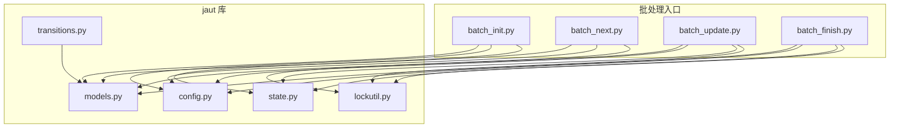
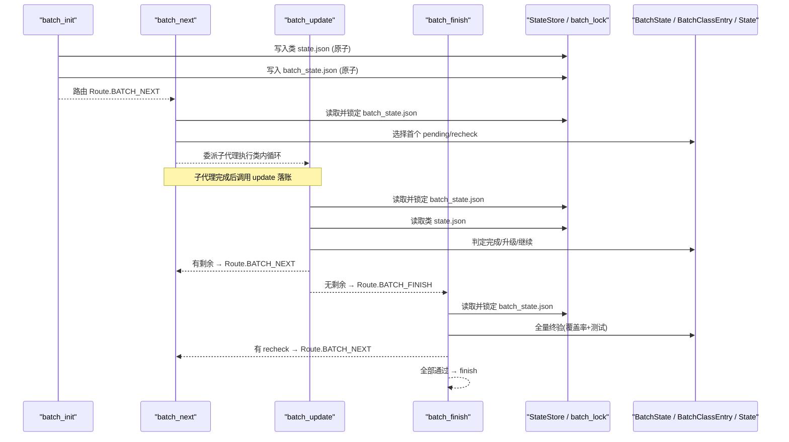
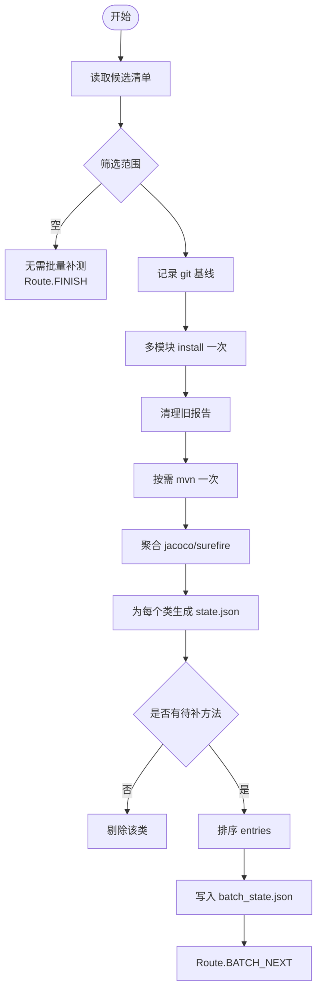
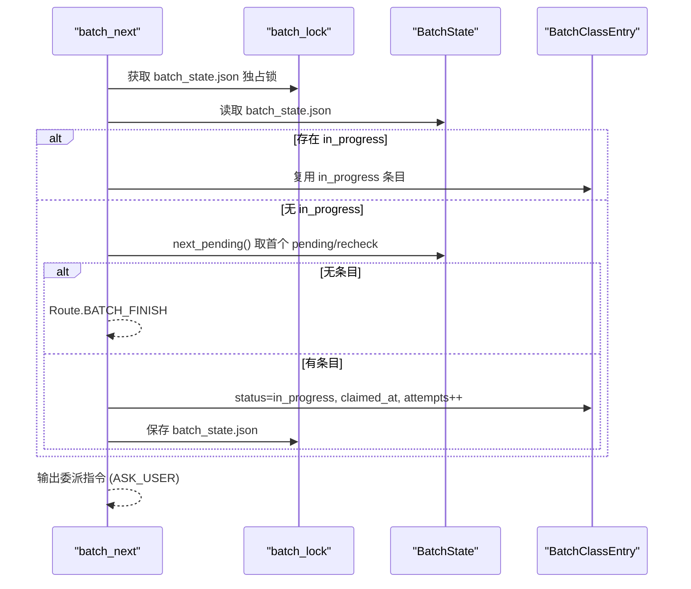
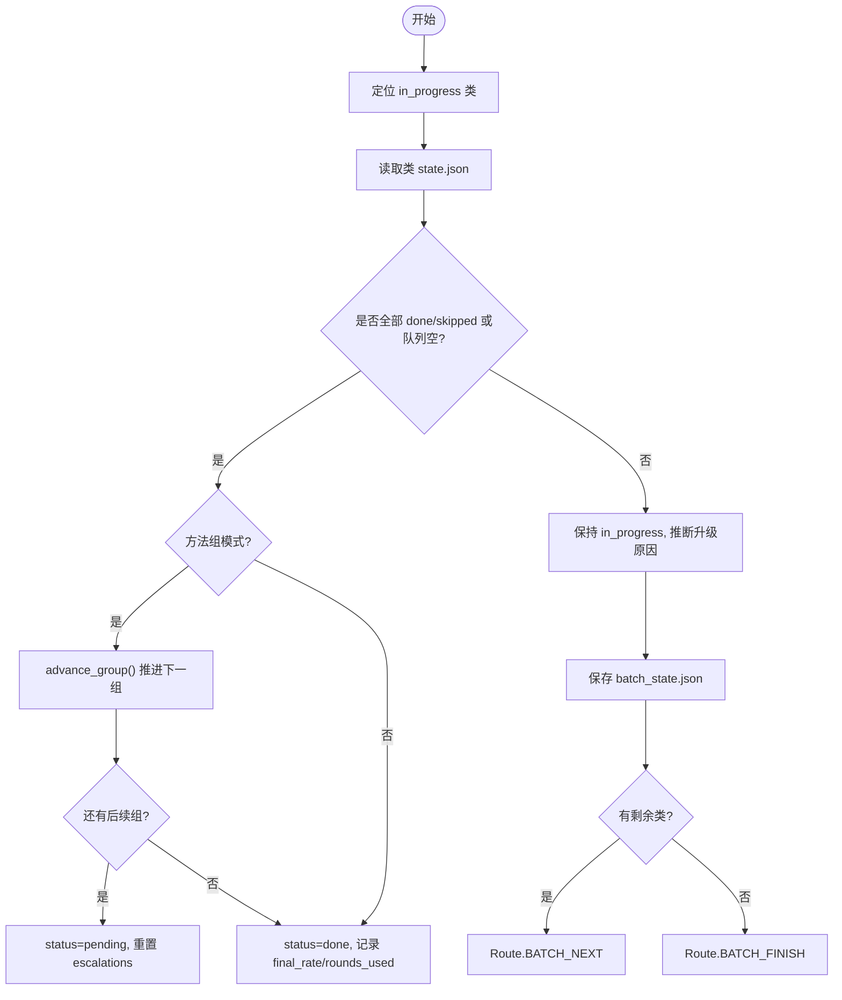
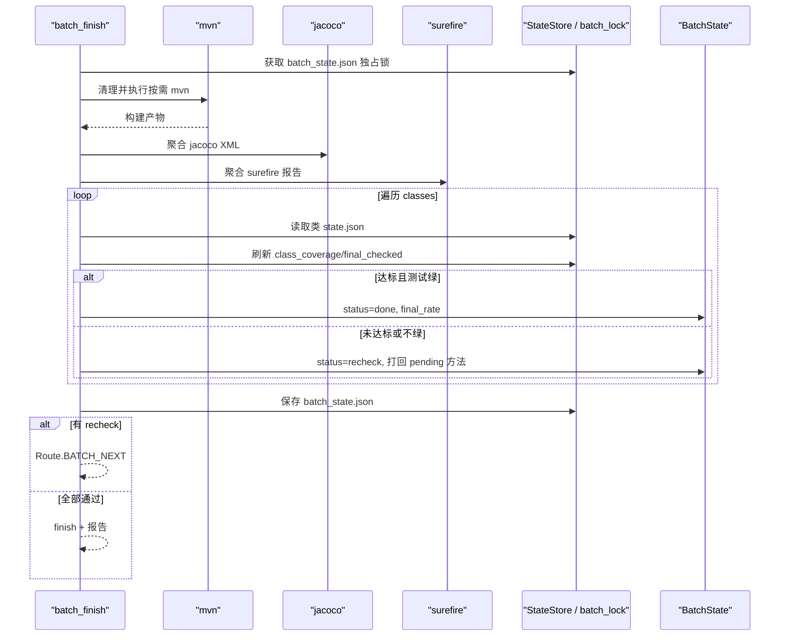
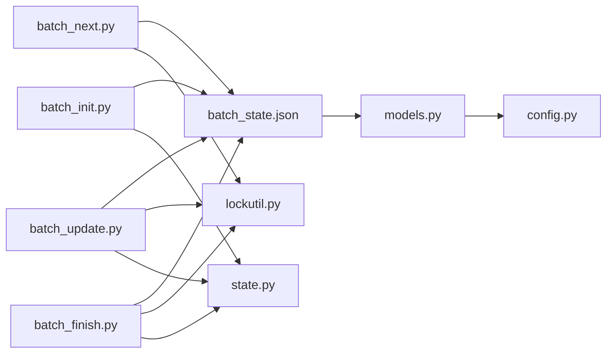

# 批处理生命周期管理

<cite>
**本文引用的文件**
- [batch_init.py](file://batch-unit-test-generator/scripts/batch_init.py)
- [batch_next.py](file://batch-unit-test-generator/scripts/batch_next.py)
- [batch_update.py](file://batch-unit-test-generator/scripts/batch_update.py)
- [batch_finish.py](file://batch-unit-test-generator/scripts/batch_finish.py)
- [models.py](file://batch-unit-test-generator/scripts/jaut/models.py)
- [config.py](file://batch-unit-test-generator/scripts/jaut/config.py)
- [state.py](file://batch-unit-test-generator/scripts/jaut/state.py)
- [lockutil.py](file://batch-unit-test-generator/scripts/jaut/lockutil.py)
- [transitions.py](file://batch-unit-test-generator/scripts/jaut/transitions.py)
- [test_batch.py](file://batch-unit-test-generator/tests/test_batch.py)
</cite>

## 目录
1. [简介](#简介)
2. [项目结构](#项目结构)
3. [核心组件](#核心组件)
4. [架构总览](#架构总览)
5. [详细组件分析](#详细组件分析)
6. [依赖关系分析](#依赖关系分析)
7. [性能与并发特性](#性能与并发特性)
8. [故障排查指南](#故障排查指南)
9. [结论](#结论)
10. [附录：使用示例与恢复流程](#附录使用示例与恢复流程)

## 简介
本文件面向“批量单元测试生成”的完整生命周期，围绕四个阶段展开：
- batch-init 初始化：构建基线、聚合覆盖率、生成每个类的 state.json 与批次计划 batch_state.json。
- batch-next 认领委派：从批次计划中认领下一个待处理类，输出子代理委派指令，驱动类内迭代。
- batch-update 增量更新：子代理完成类内迭代后落账，判定是否继续或进入终验。
- batch-finish 完成清理：全量终验，达标且测试通过则确认 done；否则打回 recheck 重新入队。

文档将详细说明各阶段的职责、输入输出、状态转换、错误处理、持久化存储、并发控制与资源管理，并提供数据流转图与状态机图，以及实际使用示例和异常恢复策略。

## 项目结构
批处理脚本位于 scripts 目录下，核心逻辑集中在四个入口脚本与 jaut 库模块中：
- 入口脚本：batch_init.py、batch_next.py、batch_update.py、batch_finish.py
- 领域模型与配置：models.py、config.py
- 状态存储与锁：state.py、lockutil.py
- 路由与协议：transitions.py
- 测试用例：tests/test_batch.py（覆盖 BatchState 操作与报告渲染）

图表来源
- [batch_init.py:1-446](file://batch-unit-test-generator/scripts/batch_init.py#L1-L446)
- [batch_next.py:1-178](file://batch-unit-test-generator/scripts/batch_next.py#L1-L178)
- [batch_update.py:1-301](file://batch-unit-test-generator/scripts/batch_update.py#L1-L301)
- [batch_finish.py:1-254](file://batch-unit-test-generator/scripts/batch_finish.py#L1-L254)
- [models.py:1-693](file://batch-unit-test-generator/scripts/jaut/models.py#L1-L693)
- [config.py:1-181](file://batch-unit-test-generator/scripts/jaut/config.py#L1-L181)
- [state.py:1-165](file://batch-unit-test-generator/scripts/jaut/state.py#L1-L165)
- [lockutil.py:1-56](file://batch-unit-test-generator/scripts/jaut/lockutil.py#L1-L56)
- [transitions.py:1-128](file://batch-unit-test-generator/scripts/jaut/transitions.py#L1-L128)

章节来源
- [batch_init.py:1-446](file://batch-unit-test-generator/scripts/batch_init.py#L1-L446)
- [batch_next.py:1-178](file://batch-unit-test-generator/scripts/batch_next.py#L1-L178)
- [batch_update.py:1-301](file://batch-unit-test-generator/scripts/batch_update.py#L1-L301)
- [batch_finish.py:1-254](file://batch-unit-test-generator/scripts/batch_finish.py#L1-L254)
- [models.py:1-693](file://batch-unit-test-generator/scripts/jaut/models.py#L1-L693)
- [config.py:1-181](file://batch-unit-test-generator/scripts/jaut/config.py#L1-L181)
- [state.py:1-165](file://batch-unit-test-generator/scripts/jaut/state.py#L1-L165)
- [lockutil.py:1-56](file://batch-unit-test-generator/scripts/jaut/lockutil.py#L1-L56)
- [transitions.py:1-128](file://batch-unit-test-generator/scripts/jaut/transitions.py#L1-L128)

## 核心组件
- 批次计划与条目
  - BatchState：批次总态，包含目标分支、阈值、排序策略、初始测试统计、类条目列表等。
  - BatchClassEntry：单个类的计划条目，记录 FQCN、模块、工作目录、状态、差异行数、基线覆盖率、轮次、升级次数、方法组拆分信息等。
- 类级状态
  - State：单类 state.json 的类型化表示，包含覆盖率、方法表、历史轨迹、最终检查标记、批量模式标志等。
- 覆盖率与测试
  - MethodCoverage、ClassCoverage、TestResult：方法/类覆盖率与 surefire 测试结果聚合。
- 配置常量
  - config.py：集中定义阈值、预算、超时、路径模板、批量专用常量（如 BATCH_STATE_FILENAME、CLASSES_SUBDIR、大类拆分阈值等）。
- 状态存储与并发
  - StateStore：原子读写 state.json，提供 locked() 上下文管理器保护 load→修改→save 的原子性。
  - lockutil.batch_lock：对 batch_state.json 加独占锁，避免多进程并发写冲突。
- 路由与协议
  - transitions.py：将 Decision.route 解析为 next_step，统一 run_script 参数注入与 ask_user resume 命令补全。

章节来源
- [models.py:1-693](file://batch-unit-test-generator/scripts/jaut/models.py#L1-L693)
- [config.py:1-181](file://batch-unit-test-generator/scripts/jaut/config.py#L1-L181)
- [state.py:1-165](file://batch-unit-test-generator/scripts/jaut/state.py#L1-L165)
- [lockutil.py:1-56](file://batch-unit-test-generator/scripts/jaut/lockutil.py#L1-L56)
- [transitions.py:1-128](file://batch-unit-test-generator/scripts/jaut/transitions.py#L1-L128)

## 架构总览
批处理生命周期由四个阶段顺序协作，配合“类内循环”（make_plan → build_prompt → verify_coverage → final_check）形成闭环。

图表来源
- [batch_init.py:1-446](file://batch-unit-test-generator/scripts/batch_init.py#L1-L446)
- [batch_next.py:1-178](file://batch-unit-test-generator/scripts/batch_next.py#L1-L178)
- [batch_update.py:1-301](file://batch-unit-test-generator/scripts/batch_update.py#L1-L301)
- [batch_finish.py:1-254](file://batch-unit-test-generator/scripts/batch_finish.py#L1-L254)
- [models.py:1-693](file://batch-unit-test-generator/scripts/jaut/models.py#L1-L693)
- [state.py:1-165](file://batch-unit-test-generator/scripts/jaut/state.py#L1-L165)
- [lockutil.py:1-56](file://batch-unit-test-generator/scripts/jaut/lockutil.py#L1-L56)

## 详细组件分析

### batch-init 初始化阶段
- 职责
  - 读取候选清单，筛选范围（all/top:N/FQCN），记录 git 基线。
  - 多模块 install 一次，按需 mvn 一次，聚合 jacoco/surefire。
  - 为每个确认类生成独立 workdir 下的 state.json，记录方法表、覆盖率、历史。
  - 剔除无待补方法的类，按模块-覆盖率排序，生成 batch_state.json。
  - 输出 NEXT_STEP 路由至 batch_next。
- 输入
  - --project-root（必填）、--classes、--threshold、--target、--coverage-exclude、--jacoco-version、--workdir。
- 输出
  - 成功：Decision(route=BATCH_NEXT)，携带 mvn.log、batch_state.json 工件。
  - 环境失败：StepError.exec_error（未找到 mvn、install 失败）。
  - 无待补类：Route.FINISH。
- 状态转换
  - 创建类 state.json（batch_mode=True），写入 coverage.json。
  - 生成 BatchState.classes 列表，写入 batch_state.json。
- 错误处理
  - 候选清单缺失：StepError.state_error。
  - batch_state.json 已存在：防止重复初始化。
  - mvn/install 失败：记录日志并抛出 StepError.exec_error。
- 数据流
  - 候选清单 → 筛选 → 基线记录 → 安装/构建 → 覆盖率聚合 → 类 state.json → 批次计划。

图表来源
- [batch_init.py:1-446](file://batch-unit-test-generator/scripts/batch_init.py#L1-L446)
- [models.py:1-693](file://batch-unit-test-generator/scripts/jaut/models.py#L1-L693)
- [config.py:1-181](file://batch-unit-test-generator/scripts/jaut/config.py#L1-L181)

章节来源
- [batch_init.py:1-446](file://batch-unit-test-generator/scripts/batch_init.py#L1-L446)
- [models.py:1-693](file://batch-unit-test-generator/scripts/jaut/models.py#L1-L693)
- [config.py:1-181](file://batch-unit-test-generator/scripts/jaut/config.py#L1-L181)

### batch-next 认领委派阶段
- 职责
  - 读取并锁定 batch_state.json，支持断点续跑（优先 in_progress）。
  - 取首个 pending/recheck，标记 in_progress，计算剩余预算。
  - 输出委派指令（worktree、FQCN、类 workdir、scripts 目录、门槛、预算、认领序号、方法组信息）。
  - 若无待认领类，路由至 batch_finish。
- 输入
  - --project-root（必填）、--reset-claim <FQCN>、--workdir。
- 输出
  - 有待认领类：Decision(route=ASK_USER)，question 包含委派指令与 make_plan 命令。
  - 无待认领类：Decision(route=BATCH_FINISH)。
- 状态转换
  - pending/in_progress/recheck → in_progress（记录 claimed_at、attempts）。
  - reset-claim：in_progress → pending。
- 错误处理
  - batch_state.json 缺失：StepError.state_error。
  - reset-claim 指定类不存在：StepError.state_error。
- 数据流
  - 批次计划 → 选择条目 → 标记认领 → 委派子代理。

图表来源
- [batch_next.py:1-178](file://batch-unit-test-generator/scripts/batch_next.py#L1-L178)
- [models.py:1-693](file://batch-unit-test-generator/scripts/jaut/models.py#L1-L693)
- [lockutil.py:1-56](file://batch-unit-test-generator/scripts/jaut/lockutil.py#L1-L56)

章节来源
- [batch_next.py:1-178](file://batch-unit-test-generator/scripts/batch_next.py#L1-L178)
- [models.py:1-693](file://batch-unit-test-generator/scripts/jaut/models.py#L1-L693)
- [lockutil.py:1-56](file://batch-unit-test-generator/scripts/jaut/lockutil.py#L1-L56)

### batch-update 增量更新阶段
- 职责
  - 定位当前 in_progress 类（或显式 --fqcn），读取其 state.json。
  - 判定交付状态：全部 done/skipped 或队列空 → done；仍有 pending → 保持 in_progress 并转述升级原因。
  - 落账 final_rate、rounds_used、escalations；方法组模式推进下一组。
  - 有剩余 → Route.BATCH_NEXT；无剩余 → Route.BATCH_FINISH。
- 输入
  - --project-root（必填）、--fqcn、--skip-class、--reason、--mark-failed、--workdir。
- 输出
  - 落账成功：继续或终验。
  - 升级穿透：ask_user（转述升级问题，用户决策后主流程落地）。
- 状态转换
  - done/skipped/failed：直接落账。
  - recheck：方法组推进或保持 in_progress。
  - skip/mark-failed：用户干预。
- 错误处理
  - 未找到 in_progress 且未指定 --fqcn：StepError.state_error。
  - state.json 不存在：标记 failed。
- 升级原因推断
  - 类级轮次耗尽、方法轮次耗尽、连续测试失败不收敛、连续覆盖率无提升。

图表来源
- [batch_update.py:1-301](file://batch-unit-test-generator/scripts/batch_update.py#L1-L301)
- [models.py:1-693](file://batch-unit-test-generator/scripts/jaut/models.py#L1-L693)

章节来源
- [batch_update.py:1-301](file://batch-unit-test-generator/scripts/batch_update.py#L1-L301)
- [models.py:1-693](file://batch-unit-test-generator/scripts/jaut/models.py#L1-L693)

### batch-finish 完成清理阶段
- 职责
  - 全量终验：清理旧报告、按需 mvn、聚合 jacoco/surefire。
  - 对每个非 skipped 类刷新覆盖率与测试，达标且测试绿 → done；否则 → recheck。
  - 打回 pending 方法（final-check 语义刷新），保存 batch_state.json。
  - 有 recheck → Route.BATCH_NEXT；全部通过 → finish 携带批量最终报告。
- 输入
  - --project-root（必填）、--skip-mvn（测试用）、--workdir。
- 输出
  - 有 recheck：继续认领委派。
  - 全部通过：finish 报告（LLM 逐字转述）。
- 错误处理
  - mvn 执行失败：StepError.exec_error。
  - 报告缺失/不可解析：视为不绿。
- 数据流
  - 活跃类集合 → 全量构建 → 聚合结果 → 逐类判定 → 重入队或完成。

图表来源
- [batch_finish.py:1-254](file://batch-unit-test-generator/scripts/batch_finish.py#L1-L254)
- [models.py:1-693](file://batch-unit-test-generator/scripts/jaut/models.py#L1-L693)
- [state.py:1-165](file://batch-unit-test-generator/scripts/jaut/state.py#L1-L165)
- [lockutil.py:1-56](file://batch-unit-test-generator/scripts/jaut/lockutil.py#L1-L56)

章节来源
- [batch_finish.py:1-254](file://batch-unit-test-generator/scripts/batch_finish.py#L1-L254)
- [models.py:1-693](file://batch-unit-test-generator/scripts/jaut/models.py#L1-L693)
- [state.py:1-165](file://batch-unit-test-generator/scripts/jaut/state.py#L1-L165)
- [lockutil.py:1-56](file://batch-unit-test-generator/scripts/jaut/lockutil.py#L1-L56)

## 依赖关系分析
- 脚本间耦合
  - batch_init 产出 batch_state.json，作为 batch_next/batch_update/batch_finish 的共同输入。
  - batch_next 依赖 BatchState.next_pending() 选择条目，输出 ASK_USER 委派。
  - batch_update 依赖 State.pending_methods() 与 BatchClassEntry.advance_group() 推进方法组。
  - batch_finish 依赖 jacoco/surefire 聚合与 StateStore.locked() 原子更新。
- 模型与配置
  - models.py 提供类型化数据结构，config.py 提供阈值与预算常量。
  - transitions.py 将 Decision.route 映射到具体脚本与参数。
- 并发与持久化
  - lockutil.batch_lock 保证 batch_state.json 的互斥访问。
  - StateStore.locked() 保证类 state.json 的原子读写。

图表来源
- [batch_init.py:1-446](file://batch-unit-test-generator/scripts/batch_init.py#L1-L446)
- [batch_next.py:1-178](file://batch-unit-test-generator/scripts/batch_next.py#L1-L178)
- [batch_update.py:1-301](file://batch-unit-test-generator/scripts/batch_update.py#L1-L301)
- [batch_finish.py:1-254](file://batch-unit-test-generator/scripts/batch_finish.py#L1-L254)
- [models.py:1-693](file://batch-unit-test-generator/scripts/jaut/models.py#L1-L693)
- [config.py:1-181](file://batch-unit-test-generator/scripts/jaut/config.py#L1-L181)
- [state.py:1-165](file://batch-unit-test-generator/scripts/jaut/state.py#L1-L165)
- [lockutil.py:1-56](file://batch-unit-test-generator/scripts/jaut/lockutil.py#L1-L56)

章节来源
- [batch_init.py:1-446](file://batch-unit-test-generator/scripts/batch_init.py#L1-L446)
- [batch_next.py:1-178](file://batch-unit-test-generator/scripts/batch_next.py#L1-L178)
- [batch_update.py:1-301](file://batch-unit-test-generator/scripts/batch_update.py#L1-L301)
- [batch_finish.py:1-254](file://batch-unit-test-generator/scripts/batch_finish.py#L1-L254)
- [models.py:1-693](file://batch-unit-test-generator/scripts/jaut/models.py#L1-L693)
- [config.py:1-181](file://batch-unit-test-generator/scripts/jaut/config.py#L1-L181)
- [state.py:1-165](file://batch-unit-test-generator/scripts/jaut/state.py#L1-L165)
- [lockutil.py:1-56](file://batch-unit-test-generator/scripts/jaut/lockutil.py#L1-L56)

## 性能与并发特性
- 并发控制
  - batch_state.json 使用文件锁（.lock）实现跨进程互斥，避免竞态条件。
  - 类 state.json 使用 StateStore.locked() 上下文管理器，确保 load→修改→save 的原子性。
- 资源管理
  - 多模块 install 与 mvn 仅执行一次，减少重复开销。
  - 清理旧报告（jacoco/surefire）避免脏数据影响。
- 性能优化
  - 大类拆分：pending 方法数超阈值时自动分组，降低单次任务复杂度。
  - 探索模式：大类预算倍数提升，提高通过率。
  - 覆盖率排除：启发式排除 Lombok/MapStruct 生成类，减少无效覆盖。

[本节为通用指导，不直接分析具体文件]

## 故障排查指南
- 常见错误
  - 候选清单缺失：请先运行 batch_diff.py 生成候选清单。
  - batch_state.json 已存在：续跑请使用 batch_next.py；如需重新开始请先删除 batch_state.json。
  - mvn 未找到：请安装 mvn 或加入 PATH。
  - state.json 不存在：标记为 failed，需检查类工作目录。
- 恢复策略
  - 断点续跑：batch_next 优先处理 in_progress 类；若僵死可使用 --reset-claim 复位。
  - 跳过/失败：batch_update 支持 --skip-class/--mark-failed 进行人工干预。
  - 终验不通过：recheck 类打回 pending 方法，重新认领委派。
- 诊断要点
  - 查看 mvn.log、batch-mvn.log 定位构建问题。
  - 检查 coverage.json 与方法轨迹 round_rates、round_test_results。
  - 使用 test_batch.py 中的断言验证 BatchState 操作与报告渲染。

章节来源
- [batch_init.py:1-446](file://batch-unit-test-generator/scripts/batch_init.py#L1-L446)
- [batch_next.py:1-178](file://batch-unit-test-generator/scripts/batch_next.py#L1-L178)
- [batch_update.py:1-301](file://batch-unit-test-generator/scripts/batch_update.py#L1-L301)
- [batch_finish.py:1-254](file://batch-unit-test-generator/scripts/batch_finish.py#L1-L254)
- [test_batch.py:1-280](file://batch-unit-test-generator/tests/test_batch.py#L1-L280)

## 结论
批处理生命周期通过四个阶段协同工作，实现了从基线构建、认领委派、增量更新到终验完成的完整闭环。借助类型化模型、原子状态存储与文件锁机制，系统在并发环境下具备强一致性与可恢复性。大类拆分与探索模式提升了复杂类的处理能力，覆盖率排除与一次性构建优化了整体性能。通过明确的错误处理与恢复策略，系统能够应对异常中断与人工干预场景。

[本节为总结，不直接分析具体文件]

## 附录：使用示例与恢复流程
- 完整流程示例
  - 初始化：python scripts/batch_init.py --project-root <worktree> --classes all --threshold 80
  - 认领委派：python scripts/batch_next.py --project-root <worktree>
  - 子代理执行类内循环后落账：python scripts/batch_update.py --project-root <worktree>
  - 终验：python scripts/batch_finish.py --project-root <worktree>
- 异常情况处理
  - 僵死 in_progress：python scripts/batch_next.py --project-root <worktree> --reset-claim <FQCN>
  - 跳过类：python scripts/batch_update.py --project-root <worktree> --skip-class <FQCN> --reason "用户跳过"
  - 标记失败：python scripts/batch_update.py --project-root <worktree> --mark-failed <FQCN> --reason "编译失败"
- 恢复要点
  - 检查 batch_state.json 与类 state.json 的一致性。
  - 查看 mvn.log 与 coverage.json 定位问题。
  - 使用 test_batch.py 验证 BatchState 操作与报告渲染。

章节来源
- [batch_init.py:1-446](file://batch-unit-test-generator/scripts/batch_init.py#L1-L446)
- [batch_next.py:1-178](file://batch-unit-test-generator/scripts/batch_next.py#L1-L178)
- [batch_update.py:1-301](file://batch-unit-test-generator/scripts/batch_update.py#L1-L301)
- [batch_finish.py:1-254](file://batch-unit-test-generator/scripts/batch_finish.py#L1-L254)
- [test_batch.py:1-280](file://batch-unit-test-generator/tests/test_batch.py#L1-L280)