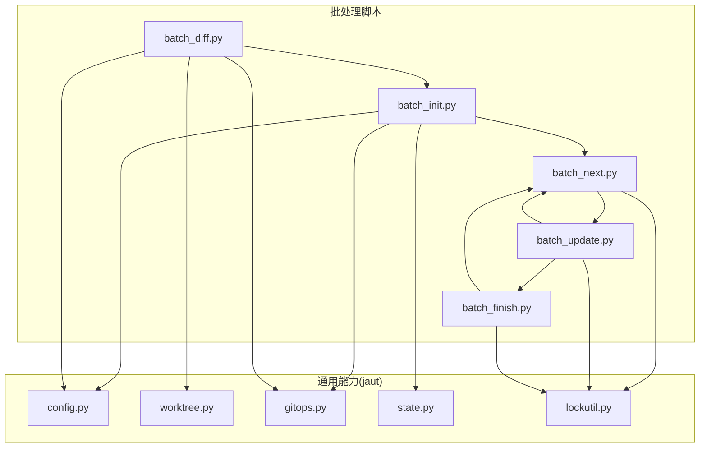
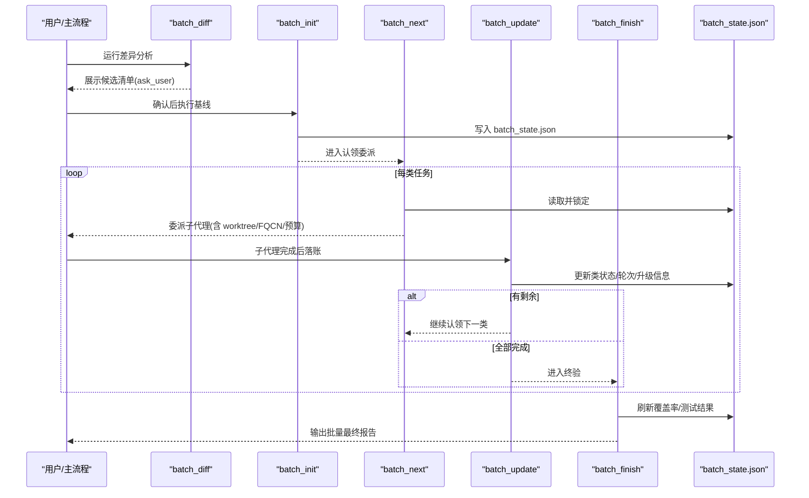
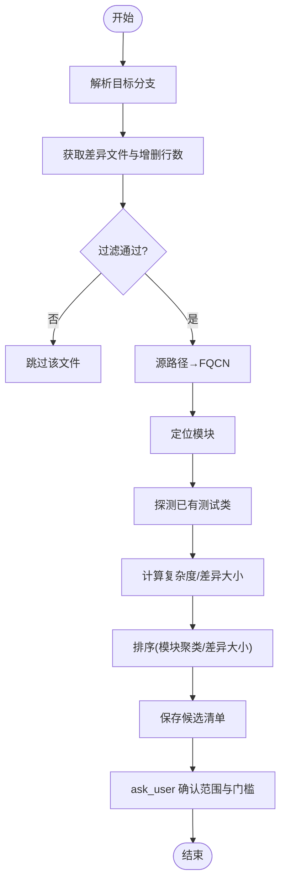
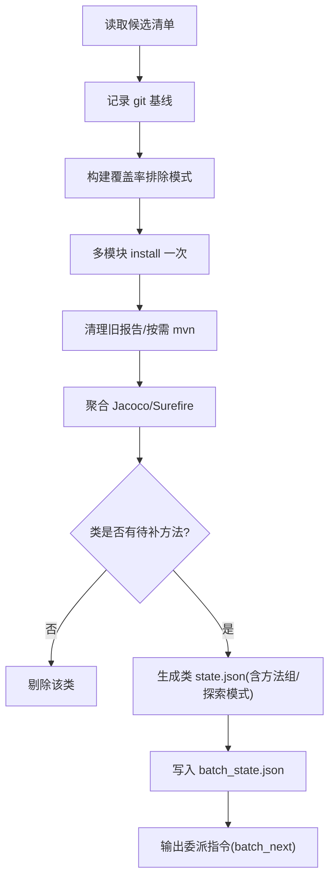
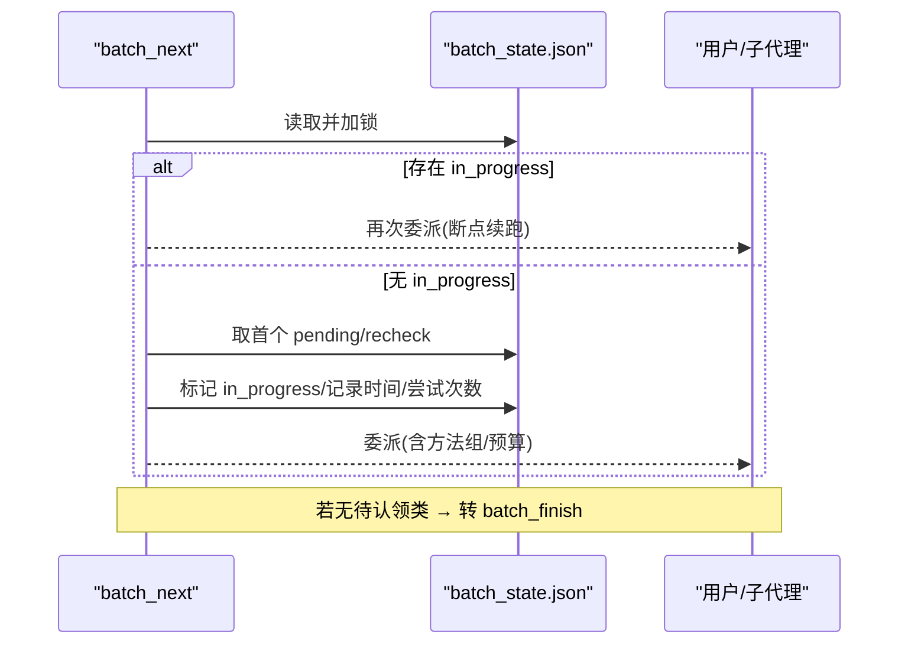
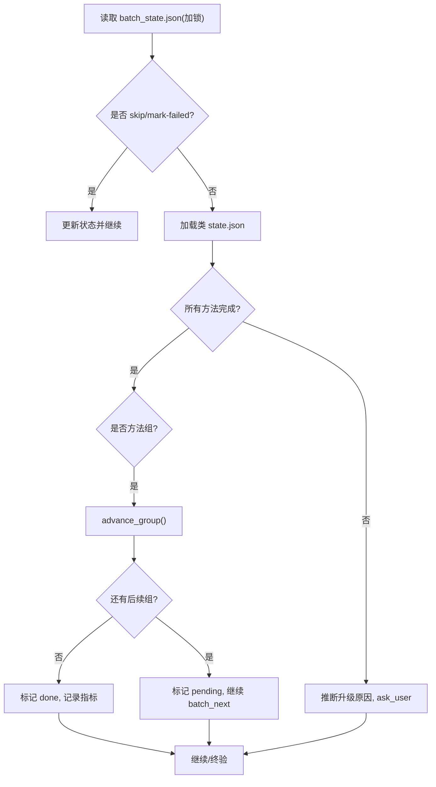
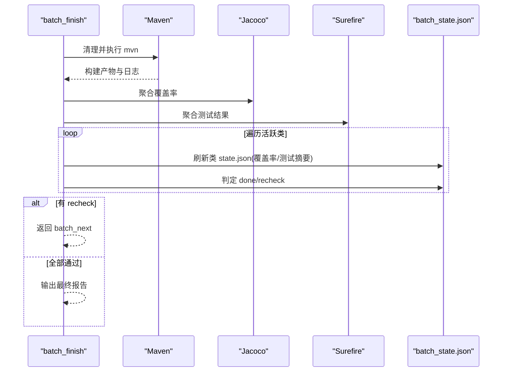
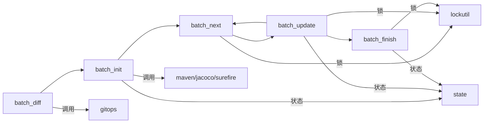

# 批量测试生成器

<cite>
**本文引用的文件**
- [batch_diff.py](file://batch-unit-test-generator/scripts/batch_diff.py)
- [batch_init.py](file://batch-unit-test-generator/scripts/batch_init.py)
- [batch_next.py](file://batch-unit-test-generator/scripts/batch_next.py)
- [batch_update.py](file://batch-unit-test-generator/scripts/batch_update.py)
- [batch_finish.py](file://batch-unit-test-generator/scripts/batch_finish.py)
- [config.py](file://batch-unit-test-generator/scripts/jaut/config.py)
- [worktree.py](file://batch-unit-test-generator/scripts/jaut/worktree.py)
- [gitops.py](file://batch-unit-test-generator/scripts/jaut/gitops.py)
- [state.py](file://batch-unit-test-generator/scripts/jaut/state.py)
- [lockutil.py](file://batch-unit-test-generator/scripts/jaut/lockutil.py)
- [diff-analysis.md](file://batch-unit-test-generator/references/diff-analysis.md)
</cite>

## 目录
1. [简介](#简介)
2. [项目结构](#项目结构)
3. [核心组件](#核心组件)
4. [架构总览](#架构总览)
5. [详细组件分析](#详细组件分析)
6. [依赖关系分析](#依赖关系分析)
7. [性能与并发](#性能与并发)
8. [故障排查指南](#故障排查指南)
9. [结论](#结论)
10. [附录：命令与配置](#附录命令与配置)

## 简介
本系统提供“基于 Git 分支差异的批量单元测试生成”能力，围绕工作树隔离、增量更新、状态管理与批处理生命周期（初始化→认领委派→交付落账→终验清理）构建。通过差异分析筛选候选类，按模块与覆盖率排序，分派子代理进行类内迭代，最终完成全量验证与报告输出。

## 项目结构
- 脚本层：batch_diff/init/next/update/finish 构成批处理主流程；jaut 提供配置、Git/Maven/Jacoco/Surefire、状态存储、锁工具等通用能力。
- 参考文档：差异过滤与排序规则、委派流程等说明。

图表来源
- [batch_diff.py:1-451](file://batch-unit-test-generator/scripts/batch_diff.py#L1-L451)
- [batch_init.py:1-446](file://batch-unit-test-generator/scripts/batch_init.py#L1-L446)
- [batch_next.py:1-178](file://batch-unit-test-generator/scripts/batch_next.py#L1-L178)
- [batch_update.py:1-301](file://batch-unit-test-generator/scripts/batch_update.py#L1-L301)
- [batch_finish.py:1-254](file://batch-unit-test-generator/scripts/batch_finish.py#L1-L254)
- [config.py:1-181](file://batch-unit-test-generator/scripts/jaut/config.py#L1-L181)
- [worktree.py:1-333](file://batch-unit-test-generator/scripts/jaut/worktree.py#L1-L333)
- [gitops.py:1-176](file://batch-unit-test-generator/scripts/jaut/gitops.py#L1-L176)
- [state.py:1-165](file://batch-unit-test-generator/scripts/jaut/state.py#L1-L165)
- [lockutil.py:1-56](file://batch-unit-test-generator/scripts/jaut/lockutil.py#L1-L56)

章节来源
- [batch_diff.py:1-451](file://batch-unit-test-generator/scripts/batch_diff.py#L1-L451)
- [batch_init.py:1-446](file://batch-unit-test-generator/scripts/batch_init.py#L1-L446)
- [batch_next.py:1-178](file://batch-unit-test-generator/scripts/batch_next.py#L1-L178)
- [batch_update.py:1-301](file://batch-unit-test-generator/scripts/batch_update.py#L1-L301)
- [batch_finish.py:1-254](file://batch-unit-test-generator/scripts/batch_finish.py#L1-L254)
- [config.py:1-181](file://batch-unit-test-generator/scripts/jaut/config.py#L1-L181)
- [worktree.py:1-333](file://batch-unit-test-generator/scripts/jaut/worktree.py#L1-L333)
- [gitops.py:1-176](file://batch-unit-test-generator/scripts/jaut/gitops.py#L1-L176)
- [state.py:1-165](file://batch-unit-test-generator/scripts/jaut/state.py#L1-L165)
- [lockutil.py:1-56](file://batch-unit-test-generator/scripts/jaut/lockutil.py#L1-L56)
- [diff-analysis.md:1-84](file://batch-unit-test-generator/references/diff-analysis.md#L1-L84)

## 核心组件
- 差异分析(batch_diff)：采集目标分支到 HEAD 的差异，过滤并生成候选清单，触发用户确认门禁。
- 基线构建(batch_init)：一次 install + 按需 mvn，聚合 Jacoco/Surefire，为每个确认类生成独立 state.json 与 batch_state.json，支持大类方法组拆分。
- 认领委派(batch_next)：读取 batch_state.json，标记首个 pending/recheck 为 in_progress，输出子代理委派指令。
- 交付落账(batch_update)：根据类 state.json 判定完成或继续，推进方法组或回退 recheck，统计轮次与升级原因。
- 终验(batch_finish)：全量 mvn 聚合，逐类刷新覆盖率与测试结果，达标确认 done，否则 recheck 重入队，最终输出报告。

章节来源
- [batch_diff.py:1-451](file://batch-unit-test-generator/scripts/batch_diff.py#L1-L451)
- [batch_init.py:1-446](file://batch-unit-test-generator/scripts/batch_init.py#L1-L446)
- [batch_next.py:1-178](file://batch-unit-test-generator/scripts/batch_next.py#L1-L178)
- [batch_update.py:1-301](file://batch-unit-test-generator/scripts/batch_update.py#L1-L301)
- [batch_finish.py:1-254](file://batch-unit-test-generator/scripts/batch_finish.py#L1-L254)

## 架构总览
批处理以“状态机+文件锁”驱动，保证多进程安全与断点续跑。

图表来源
- [batch_diff.py:295-442](file://batch-unit-test-generator/scripts/batch_diff.py#L295-L442)
- [batch_init.py:62-318](file://batch-unit-test-generator/scripts/batch_init.py#L62-L318)
- [batch_next.py:53-159](file://batch-unit-test-generator/scripts/batch_next.py#L53-L159)
- [batch_update.py:55-209](file://batch-unit-test-generator/scripts/batch_update.py#L55-L209)
- [batch_finish.py:50-198](file://batch-unit-test-generator/scripts/batch_finish.py#L50-L198)
- [lockutil.py:34-56](file://batch-unit-test-generator/scripts/jaut/lockutil.py#L34-L56)

## 详细组件分析

### 差异分析(batch_diff)
- 差异采集：自动探测目标分支(master/main/develop)，优先三点 merge-base，失败回退两点；收集增删行数。
- 过滤链：仅 src/main/java → 剔除测试类/包/模块描述 → pom jacoco excludes → 接口/枚举/注解启发式 → 用户 exclude-glob。
- 模块定位与已有测试探测：复用 maven/javasrc 工具。
- 排序策略：预排序用于展示；实际顺序在 batch_init 阶段依据覆盖率与差异行数决定。
- 输出：保存候选清单至 workdir，触发 ask_user 确认范围与门槛。

图表来源
- [batch_diff.py:198-277](file://batch-unit-test-generator/scripts/batch_diff.py#L198-L277)
- [batch_diff.py:327-400](file://batch-unit-test-generator/scripts/batch_diff.py#L327-L400)
- [diff-analysis.md:1-84](file://batch-unit-test-generator/references/diff-analysis.md#L1-L84)

章节来源
- [batch_diff.py:198-442](file://batch-unit-test-generator/scripts/batch_diff.py#L198-L442)
- [diff-analysis.md:1-84](file://batch-unit-test-generator/references/diff-analysis.md#L1-L84)

### 基线构建(batch_init)
- 输入：候选清单、阈值、Jacoco 版本、排除模式。
- 安装与构建：多模块一次 install；按需 mvn 聚合 Jacoco/Surefire。
- 类级 state.json：为每个确认类创建独立 workdir，记录 git 基线、覆盖率、方法表、探索模式（大类）。
- 大类拆分：pending 方法数超阈值时分组，每组独立委派。
- 输出：batch_state.json 与首个委派指令给 batch_next。

图表来源
- [batch_init.py:62-318](file://batch-unit-test-generator/scripts/batch_init.py#L62-L318)

章节来源
- [batch_init.py:62-318](file://batch-unit-test-generator/scripts/batch_init.py#L62-L318)

### 认领委派(batch_next)
- 读取并锁定 batch_state.json，优先恢复 in_progress 类（断点续跑），否则取首个 pending/recheck。
- 标记 in_progress，计算剩余预算，输出委派指令（包含 worktree、FQCN、类 workdir、scripts 路径、门槛、预算、方法组信息）。
- 无待认领类则转入 batch_finish。

图表来源
- [batch_next.py:53-159](file://batch-unit-test-generator/scripts/batch_next.py#L53-L159)
- [lockutil.py:34-56](file://batch-unit-test-generator/scripts/jaut/lockutil.py#L34-L56)

章节来源
- [batch_next.py:53-159](file://batch-unit-test-generator/scripts/batch_next.py#L53-L159)

### 交付落账(batch_update)
- 支持显式指定类、跳过/失败标记。
- 读类 state.json 判定：
  - 全部完成：若方法组模式则推进下一组，否则标记 done，记录 final_rate/rounds_used。
  - 仍有 pending：推断升级原因（类级/方法级轮次耗尽、连续失败、覆盖率停滞），返回 ask_user 决策。
- 统计完成进度，继续 batch_next 或进入 batch_finish。

图表来源
- [batch_update.py:55-209](file://batch-unit-test-generator/scripts/batch_update.py#L55-L209)

章节来源
- [batch_update.py:55-209](file://batch-unit-test-generator/scripts/batch_update.py#L55-L209)

### 终验(batch_finish)
- 清理旧报告，按需 mvn 全量聚合 Jacoco/Surefire。
- 对每个非 skipped 类刷新覆盖率与测试结果：
  - 达标且测试绿 → 确认 done；
  - 否则 → 标记 recheck，并将未达标方法打回 pending，重置轨迹。
- 有 recheck 则回到 batch_next；全部通过则输出批量最终报告。

图表来源
- [batch_finish.py:50-198](file://batch-unit-test-generator/scripts/batch_finish.py#L50-L198)

章节来源
- [batch_finish.py:50-198](file://batch-unit-test-generator/scripts/batch_finish.py#L50-L198)

### 工作树隔离机制
- 工作树容器：在仓库上级目录维护 <dir>.worktrees 容器，统一管理多个工作树。
- 新建/清理：预检 base_ref、分支检出冲突；清理时强制 remove 并 prune，保留分支元数据。
- 变更检测：检查工作区未提交变更，避免带入新 worktree。
- 适用场景：不同任务并行时互不干扰，避免覆盖彼此的工作区。

章节来源
- [worktree.py:1-333](file://batch-unit-test-generator/scripts/jaut/worktree.py#L1-L333)

### 状态管理与并发安全
- 原子写入：state.json 与 batch_state.json 均采用临时文件 + fsync + os.replace，防止半截状态破坏。
- 文件锁：使用 lockutil.batch_lock 对 batch_state.json 加独占锁；StateStore.locked 对类 state.json 加锁，跨平台兼容 POSIX/Windows。
- 断点续跑：in_progress 可被 batch_next 恢复；支持 reset-claim 复位僵死状态。

章节来源
- [state.py:77-165](file://batch-unit-test-generator/scripts/jaut/state.py#L77-L165)
- [lockutil.py:34-56](file://batch-unit-test-generator/scripts/jaut/lockutil.py#L34-L56)
- [batch_next.py:66-110](file://batch-unit-test-generator/scripts/batch_next.py#L66-L110)
- [batch_update.py:68-93](file://batch-unit-test-generator/scripts/batch_update.py#L68-L93)
- [batch_finish.py:63-66](file://batch-unit-test-generator/scripts/batch_finish.py#L63-L66)

## 依赖关系分析
- 脚本间依赖：batch_diff → batch_init → batch_next ↔ batch_update → batch_finish。
- 通用库依赖：config（阈值/预算/路径）、gitops（基线/分支）、maven/jacoco/surefire（构建与报告）、state/lockutil（状态与锁）、worktree（工作树管理）。
- 外部工具：git、mvn、jacoco、surefire。

图表来源
- [batch_diff.py:1-451](file://batch-unit-test-generator/scripts/batch_diff.py#L1-L451)
- [batch_init.py:1-446](file://batch-unit-test-generator/scripts/batch_init.py#L1-L446)
- [batch_next.py:1-178](file://batch-unit-test-generator/scripts/batch_next.py#L1-L178)
- [batch_update.py:1-301](file://batch-unit-test-generator/scripts/batch_update.py#L1-L301)
- [batch_finish.py:1-254](file://batch-unit-test-generator/scripts/batch_finish.py#L1-L254)
- [config.py:1-181](file://batch-unit-test-generator/scripts/jaut/config.py#L1-L181)
- [gitops.py:1-176](file://batch-unit-test-generator/scripts/jaut/gitops.py#L1-L176)
- [state.py:1-165](file://batch-unit-test-generator/scripts/jaut/state.py#L1-L165)
- [lockutil.py:1-56](file://batch-unit-test-generator/scripts/jaut/lockutil.py#L1-L56)

章节来源
- [batch_diff.py:1-451](file://batch-unit-test-generator/scripts/batch_diff.py#L1-L451)
- [batch_init.py:1-446](file://batch-unit-test-generator/scripts/batch_init.py#L1-L446)
- [batch_next.py:1-178](file://batch-unit-test-generator/scripts/batch_next.py#L1-L178)
- [batch_update.py:1-301](file://batch-unit-test-generator/scripts/batch_update.py#L1-L301)
- [batch_finish.py:1-254](file://batch-unit-test-generator/scripts/batch_finish.py#L1-L254)
- [config.py:1-181](file://batch-unit-test-generator/scripts/jaut/config.py#L1-L181)
- [gitops.py:1-176](file://batch-unit-test-generator/scripts/jaut/gitops.py#L1-L176)
- [state.py:1-165](file://batch-unit-test-generator/scripts/jaut/state.py#L1-L165)
- [lockutil.py:1-56](file://batch-unit-test-generator/scripts/jaut/lockutil.py#L1-L56)

## 性能与并发
- 构建优化：
  - 一次 install + 按需 mvn，减少重复编译。
  - 清理旧报告后再构建，避免脏数据影响。
  - 多模块聚合解析覆盖率与测试结果，降低 IO 开销。
- 并发控制：
  - 通过文件锁保证 batch_state.json 的串行访问，避免竞态。
  - 类级 state.json 使用独立锁，支持细粒度并发。
  - 工作树隔离确保不同任务互不干扰。
- 大规模项目建议：
  - 合理设置阈值与排除模式，减少候选类数量。
  - 使用 sort-policy=module-coverage 优先处理低覆盖率类，快速提升整体质量。
  - 对大类启用方法组拆分，降低单次任务复杂度。
  - 调整预算参数（类级/方法级轮次）与超时，平衡效率与稳定性。

[本节为通用指导，无需具体文件引用]

## 故障排查指南
- 常见错误与处理：
  - 未找到 mvn：检查 PATH 或环境变量；查看 mvn.log 定位失败原因。
  - 状态文件缺失：先运行 batch_init 生成 batch_state.json；必要时删除残留 .lock 文件。
  - 分支检出冲突：使用 worktree 工具预检，避免外部占用目标分支。
  - 测试失败/覆盖率不达标：查看 surefire 报告与 Jacoco 明细，调整实现或测试。
- 诊断要点：
  - 查看各阶段日志与 artifacts（mvn.log、batch-mvn.log）。
  - 检查 batch_state.json 中类的状态、轮次、升级原因。
  - 使用 --skip-mvn 跳过构建进行 mock 测试，聚焦逻辑正确性。

章节来源
- [batch_init.py:115-154](file://batch-unit-test-generator/scripts/batch_init.py#L115-L154)
- [batch_finish.py:74-99](file://batch-unit-test-generator/scripts/batch_finish.py#L74-L99)
- [state.py:93-128](file://batch-unit-test-generator/scripts/jaut/state.py#L93-L128)
- [lockutil.py:34-56](file://batch-unit-test-generator/scripts/jaut/lockutil.py#L34-L56)

## 结论
本系统以“差异分析→基线构建→认领委派→交付落账→终验报告”的完整生命周期，结合工作树隔离与文件锁，实现了稳定、可扩展的批量单元测试生成。通过合理的配置与最佳实践，可在大型代码库中高效提升覆盖率与测试质量。

[本节为总结，无需具体文件引用]

## 附录：命令与配置

### 核心命令
- batch-init
  - 作用：基线构建，生成 batch_state.json 与类 state.json，准备委派。
  - 关键参数：--project-root、--classes(all|top:N|FQCN,...)、--threshold、--target、--coverage-exclude、--jacoco-version、--workdir。
  - 输出：batch_state.json、mvn.log、首个委派指令（由 batch_next 承接）。
  - 参考路径：[batch_init.py:50-60](file://batch-unit-test-generator/scripts/batch_init.py#L50-L60), [batch_init.py:62-318](file://batch-unit-test-generator/scripts/batch_init.py#L62-L318)

- batch-next
  - 作用：认领下一类，输出子代理委派指令；支持断点续跑与复位僵死 in_progress。
  - 关键参数：--project-root、--reset-claim、--workdir。
  - 输出：委派指令（worktree/FQCN/类workdir/scripts/门槛/预算/方法组）。
  - 参考路径：[batch_next.py:46-51](file://batch-unit-test-generator/scripts/batch_next.py#L46-L51), [batch_next.py:53-159](file://batch-unit-test-generator/scripts/batch_next.py#L53-L159)

- batch-update
  - 作用：子代理完成后落账，判定完成/继续/升级，推进方法组或回退 recheck。
  - 关键参数：--project-root、--fqcn、--skip-class、--reason、--mark-failed、--workdir。
  - 输出：更新 batch_state.json，继续 batch_next 或进入 batch_finish。
  - 参考路径：[batch_update.py:44-53](file://batch-unit-test-generator/scripts/batch_update.py#L44-L53), [batch_update.py:55-209](file://batch-unit-test-generator/scripts/batch_update.py#L55-L209)

- batch-finish
  - 作用：批量终验，全量 mvn 聚合，刷新覆盖率与测试结果，输出最终报告。
  - 关键参数：--project-root、--skip-mvn、--workdir。
  - 输出：批量最终报告；如有 recheck 则返回 batch_next。
  - 参考路径：[batch_finish.py:43-48](file://batch-unit-test-generator/scripts/batch_finish.py#L43-L48), [batch_finish.py:50-198](file://batch-unit-test-generator/scripts/batch_finish.py#L50-L198)

### 配置选项
- 覆盖率与测试
  - DEFAULT_THRESHOLD：默认覆盖率门槛（%）。
  - DEFAULT_JACOCO_VERSION：Jacoco 版本。
  - ASSERTION_FAILURE_TYPE_PREFIXES：断言失败异常类型前缀。
  - 参考路径：[config.py:53-66](file://batch-unit-test-generator/scripts/jaut/config.py#L53-L66)

- 迭代预算与升级
  - NO_IMPROVEMENT_ROUNDS：连续 N 轮无提升触发升级。
  - TEST_FAIL_STREAK_ROUNDS：连续 N 轮测试失败触发升级。
  - METHOD_ROUND_BUDGET：单方法最大迭代轮次。
  - GLOBAL_ROUND_BUDGET：全局最大轮次。
  - RESUME_GRANT_ROUNDS：继续时追加预算轮数。
  - 参考路径：[config.py:71-78](file://batch-unit-test-generator/scripts/jaut/config.py#L71-L78)

- 批量专用
  - JAVA_UT_BATCH_CLASS_ROUND_BUDGET：类级总预算（环境变量覆盖）。
  - BATCH_STATE_FILENAME：批次状态文件名。
  - CLASSES_SUBDIR：类工作目录子目录名。
  - LARGE_CLASS_DIFF_THRESHOLD / LARGE_CLASS_METHOD_THRESHOLD / METHOD_GROUP_SIZE：大类检测与方法组拆分阈值。
  - EXPLORATION_MODE_MULTIPLIER：探索模式预算倍数。
  - 参考路径：[config.py:143-168](file://batch-unit-test-generator/scripts/jaut/config.py#L143-L168)

- Maven 执行
  - MVN_TIMEOUT_ENV：超时环境变量。
  - MVN_KILL_GRACE_SECONDS：优雅终止宽限秒数。
  - POST_EOF_WAIT_SECONDS：EOF 后等待退出秒数。
  - MVN_PROGRESS_INTERVAL_SECONDS / MVN_PROGRESS_FILENAME：进度报告间隔与文件。
  - MVN_ALWAYS_FLAGS：忽略测试失败的必带参数。
  - 参考路径：[config.py:83-97](file://batch-unit-test-generator/scripts/jaut/config.py#L83-L97)

- 工作树
  - WORKTREE_CONTAINER_SUFFIX / WORKTREE_NAME_SUFFIX / WORKTREE_DEFAULT_NEW_SENTINEL / WORKTREE_NAME_DISALLOWED_CHARS：工作树命名与容器规则。
  - 参考路径：[config.py:135-139](file://batch-unit-test-generator/scripts/jaut/config.py#L135-L139)

章节来源
- [batch_init.py:50-60](file://batch-unit-test-generator/scripts/batch_init.py#L50-L60)
- [batch_next.py:46-51](file://batch-unit-test-generator/scripts/batch_next.py#L46-L51)
- [batch_update.py:44-53](file://batch-unit-test-generator/scripts/batch_update.py#L44-L53)
- [batch_finish.py:43-48](file://batch-unit-test-generator/scripts/batch_finish.py#L43-L48)
- [config.py:53-168](file://batch-unit-test-generator/scripts/jaut/config.py#L53-L168)