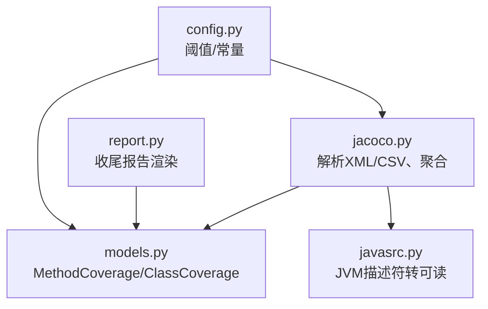
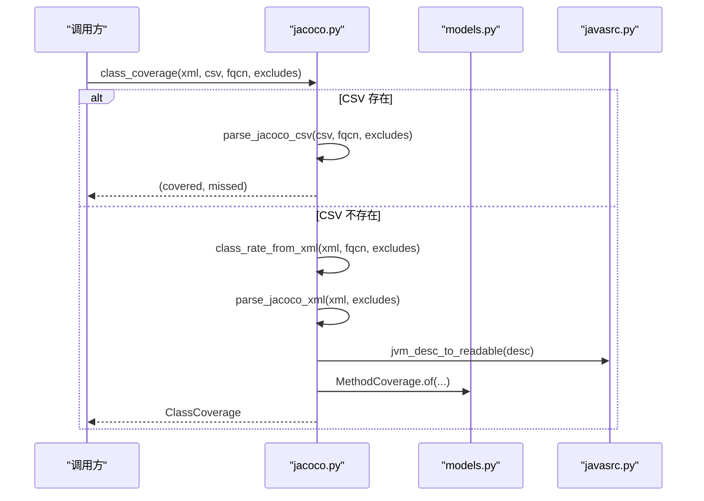
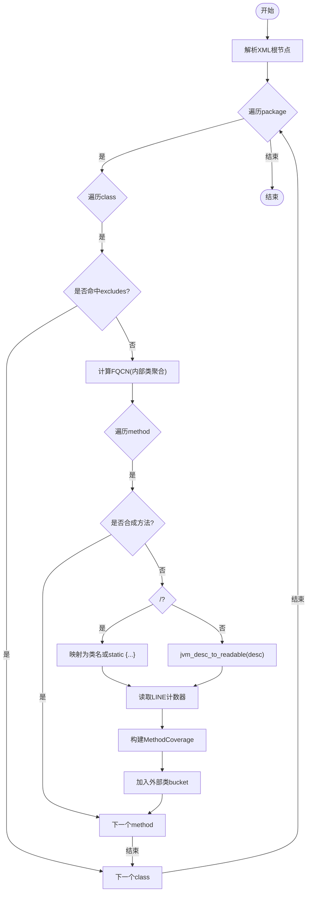
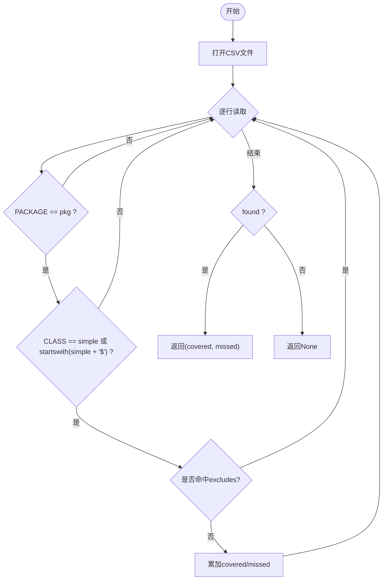
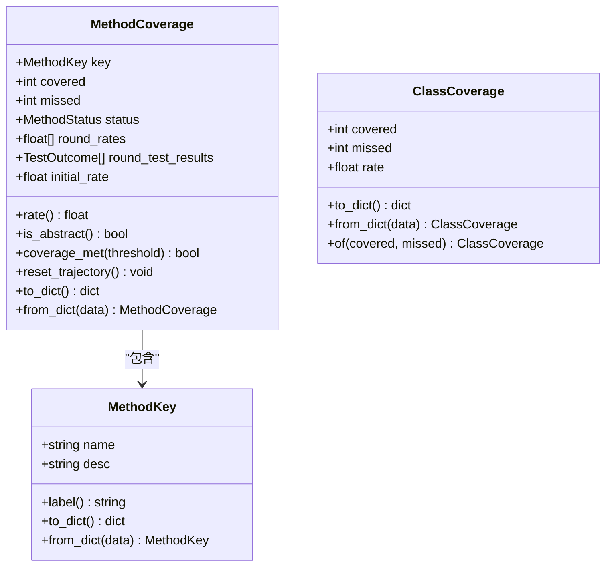
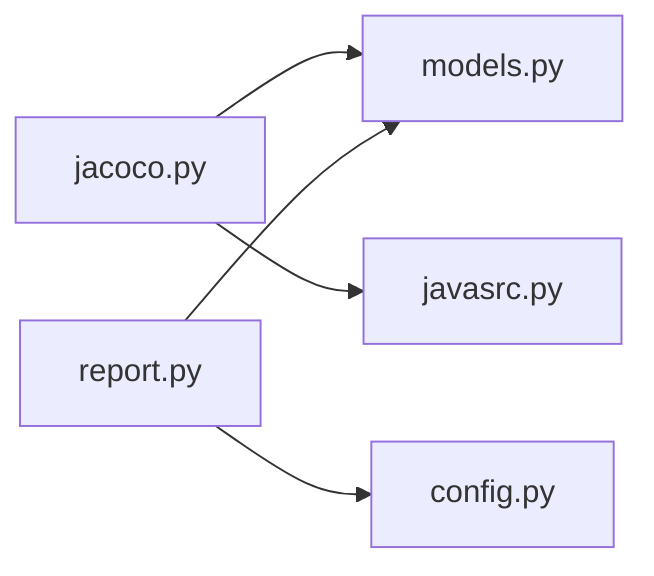

# JaCoCo 覆盖率集成

<cite>
**本文引用的文件**
- [jacoco.py](file://batch-unit-test-generator/scripts/jaut/jacoco.py)
- [models.py](file://batch-unit-test-generator/scripts/jaut/models.py)
- [javasrc.py](file://batch-unit-test-generator/scripts/jaut/javasrc.py)
- [report.py](file://batch-unit-test-generator/scripts/jaut/report.py)
- [config.py](file://batch-unit-test-generator/scripts/jaut/config.py)
- [test_jacoco.py](file://batch-unit-test-generator/tests/test_jacoco.py)
</cite>

## 目录
1. [简介](#简介)
2. [项目结构](#项目结构)
3. [核心组件](#核心组件)
4. [架构总览](#架构总览)
5. [详细组件分析](#详细组件分析)
6. [依赖关系分析](#依赖关系分析)
7. [性能考虑](#性能考虑)
8. [故障排除指南](#故障排除指南)
9. [结论](#结论)
10. [附录](#附录)

## 简介
本文件面向 JaCoCo 覆盖率数据解析与集成的实现，聚焦 XML 与 CSV 两种报告格式的解析原理、内部类聚合机制、排除模式匹配、合成方法过滤、覆盖率数据模型以及性能优化与故障排除。目标是帮助读者理解并正确使用现有实现，同时提供扩展与排障参考。

## 项目结构
JaCoCo 覆盖率相关逻辑集中在 jaut 子模块中：
- jacoco.py：负责解析 JaCoCo XML/CSV、方法级与类级覆盖率聚合、多模块聚合、路径定位等。
- models.py：定义覆盖率领域模型（MethodKey、MethodCoverage、ClassCoverage 等）与通用工具函数 coverage_rate。
- javasrc.py：提供 JVM 描述符人读化等源码侧辅助能力，被 jacoco 用于将 desc 转为可读形式。
- report.py：基于 state.json 渲染收尾报告，使用覆盖率历史与方法轨迹信息。
- config.py：全局常量与阈值配置，如默认门槛、抽象方法视为达标等。
- tests/test_jacoco.py：覆盖内部类聚合、排除模式、合成方法过滤、XML/CSV 行为等用例。

图表来源
- [jacoco.py:1-248](file://batch-unit-test-generator/scripts/jaut/jacoco.py#L1-L248)
- [models.py:1-693](file://batch-unit-test-generator/scripts/jaut/models.py#L1-L693)
- [javasrc.py:1-397](file://batch-unit-test-generator/scripts/jaut/javasrc.py#L1-L397)
- [report.py:1-219](file://batch-unit-test-generator/scripts/jaut/report.py#L1-L219)
- [config.py:1-181](file://batch-unit-test-generator/scripts/jaut/config.py#L1-L181)

章节来源
- [jacoco.py:1-248](file://batch-unit-test-generator/scripts/jaut/jacoco.py#L1-L248)
- [models.py:1-693](file://batch-unit-test-generator/scripts/jaut/models.py#L1-L693)
- [javasrc.py:1-397](file://batch-unit-test-generator/scripts/jaut/javasrc.py#L1-L397)
- [report.py:1-219](file://batch-unit-test-generator/scripts/jaut/report.py#L1-L219)
- [config.py:1-181](file://batch-unit-test-generator/scripts/jaut/config.py#L1-L181)

## 核心组件
- 覆盖率原语与模型
  - coverage_rate(covered, missed)：当 covered+missed==0 时返回 100.0（抽象/接口方法视为达标）。
  - MethodKey(name, desc)：方法唯一键，label() 输出 name(desc)。
  - MethodCoverage(key, covered, missed, status, round_rates, round_test_results, initial_rate)：方法覆盖率及迭代轨迹。
  - ClassCoverage(covered, missed, rate)：类级行覆盖率（含内部类聚合）。
- JaCoCo 解析器
  - parse_jacoco_xml(xml_path, excludes)：解析方法级行覆盖率，内部类聚合到外部类 FQCN；跳过合成方法；<init>/<clinit> 特殊处理。
  - parse_jacoco_csv(csv_path, fqcn, excludes)：解析类级行覆盖率，支持内部类 '$' 聚合与排除。
  - class_coverage(xml_path, csv_path, fqcn, parsed_xml, excludes)：优先 CSV，缺失回退 XML 聚合。
  - aggregate_jacoco_xml / aggregate_class_coverage：多模块合并。
- 排除与合成方法过滤
  - is_excluded(full_name, excludes)：fnmatch 匹配完整类名（含 $），'*' 可跨 '.' 与 '$' 段。
  - _is_synthetic_method(name)：过滤 lambda/access/bridge 等合成方法，保留 <init>/<clinit>。
- 路径与报告
  - report_paths(project_root, module)：定位 target/site/jacoco/jacoco.xml 与 .csv。
  - render_finish_report / render_batch_finish_report：基于 state.json 渲染最终报告。

章节来源
- [models.py:24-30](file://batch-unit-test-generator/scripts/jaut/models.py#L24-L30)
- [models.py:81-205](file://batch-unit-test-generator/scripts/jaut/models.py#L81-L205)
- [jacoco.py:44-61](file://batch-unit-test-generator/scripts/jaut/jacoco.py#L44-L61)
- [jacoco.py:74-181](file://batch-unit-test-generator/scripts/jaut/jacoco.py#L74-L181)
- [jacoco.py:187-248](file://batch-unit-test-generator/scripts/jaut/jacoco.py#L187-L248)
- [javasrc.py:34-68](file://batch-unit-test-generator/scripts/jaut/javasrc.py#L34-L68)
- [report.py:81-115](file://batch-unit-test-generator/scripts/jaut/report.py#L81-L115)

## 架构总览
下图展示从 JaCoCo 报告到覆盖率模型的解析流程，以及 CSV/XML 的优先级与回退策略。

图表来源
- [jacoco.py:170-181](file://batch-unit-test-generator/scripts/jaut/jacoco.py#L170-L181)
- [jacoco.py:136-167](file://batch-unit-test-generator/scripts/jaut/jacoco.py#L136-L167)
- [javasrc.py:34-68](file://batch-unit-test-generator/scripts/jaut/javasrc.py#L34-L68)
- [models.py:182-205](file://batch-unit-test-generator/scripts/jaut/models.py#L182-L205)

## 详细组件分析

### XML 解析与方法级覆盖率
- 遍历 XML 的 package/class/method 节点，提取 LINE 计数器得到 covered/missed。
- 内部类聚合：按 simple 名称拆分 "$"，将内部类方法归入外部类 FQCN。
- 合成方法过滤：包含 "$" 且非 <init>/<clinit> 的方法被忽略。
- 特殊方法映射：<init> -> 类简单名；<clinit> -> "static {...}"。
- desc 人读化：委托 javasrc.jvm_desc_to_readable。

图表来源
- [jacoco.py:74-133](file://batch-unit-test-generator/scripts/jaut/jacoco.py#L74-L133)
- [javasrc.py:34-68](file://batch-unit-test-generator/scripts/jaut/javasrc.py#L34-L68)

章节来源
- [jacoco.py:74-133](file://batch-unit-test-generator/scripts/jaut/jacoco.py#L74-L133)
- [javasrc.py:34-68](file://batch-unit-test-generator/scripts/jaut/javasrc.py#L34-L68)

### CSV 解析与类级覆盖率聚合
- 读取 CSV 的 CLASS 列，匹配 PACKAGE 与 simple 名称或 simple$ 前缀（内部类）。
- 对命中的行累加 LINE_COVERED/LINE_MISSED。
- 支持 excludes 在聚合前过滤具体内部类。
- 未找到目标类返回 None，由调用方回退 XML 聚合。

图表来源
- [jacoco.py:136-158](file://batch-unit-test-generator/scripts/jaut/jacoco.py#L136-L158)

章节来源
- [jacoco.py:136-158](file://batch-unit-test-generator/scripts/jaut/jacoco.py#L136-L158)

### 内部类聚合机制与 '$' 符号处理
- XML：simple = class.name.rsplit("/", 1)[-1]，outer = simple.split("$")[0]，fqcn = pkg + "." + outer。
- CSV：匹配 simple 或 simple$*，聚合所有内部类行。
- 排除模式在聚合前生效，可按完整类名精确排除单个内部类。

章节来源
- [jacoco.py:95-101](file://batch-unit-test-generator/scripts/jaut/jacoco.py#L95-L101)
- [jacoco.py:143-156](file://batch-unit-test-generator/scripts/jaut/jacoco.py#L143-L156)

### 排除模式匹配算法（fnmatch）
- 使用 fnmatchcase 对完整类名（含 '$'）进行匹配，'*' 可跨包段与内部类段。
- 语义与 JaCoCo 官方 excludes 一致，支持精确排除内部类或通配整个包。

章节来源
- [jacoco.py:54-61](file://batch-unit-test-generator/scripts/jaut/jacoco.py#L54-L61)
- [test_jacoco.py:93-114](file://batch-unit-test-generator/tests/test_jacoco.py#L93-L114)

### 合成方法过滤逻辑
- 判定规则：名称包含 "$" 且不是 <init> 或 <clinit> 即视为合成方法。
- 过滤掉 lambda$...、access$...、bridge$... 等编译器生成方法，避免污染覆盖率统计。

章节来源
- [jacoco.py:44-52](file://batch-unit-test-generator/scripts/jaut/jacoco.py#L44-L52)
- [test_jacoco.py:146-183](file://batch-unit-test-generator/tests/test_jacoco.py#L146-L183)

### 覆盖率数据模型说明
- MethodKey：name + desc 作为唯一键，label() 输出 name(desc)。
- MethodCoverage：记录 covered/missed、status、round_rates、initial_rate 等，rate 通过 coverage_rate 计算。
- ClassCoverage：记录 covered/missed/rate，of(covered, missed) 构造实例。
- coverage_rate：当 total==0 时返回 ABSTRACT_METHOD_COVERAGE（100.0）。

图表来源
- [models.py:81-205](file://batch-unit-test-generator/scripts/jaut/models.py#L81-L205)

章节来源
- [models.py:81-205](file://batch-unit-test-generator/scripts/jaut/models.py#L81-L205)

### 多模块聚合
- aggregate_jacoco_xml：遍历各模块的 jacoco.xml，合并为 {fqcn: [MethodCoverage]}。
- aggregate_class_coverage：遍历各模块 CSV/XML 求和，单模块退化到 class_coverage。

章节来源
- [jacoco.py:187-248](file://batch-unit-test-generator/scripts/jaut/jacoco.py#L187-L248)

## 依赖关系分析
- jacoco.py 依赖：
  - models.py：MethodCoverage、ClassCoverage、MethodKey、coverage_rate。
  - javasrc.py：jvm_desc_to_readable。
  - logutil：日志记录。
  - fnmatch：排除模式匹配。
- report.py 依赖：
  - models.py：State、MethodStatus、ClassCoverage。
  - config.py：批量预算等常量。

图表来源
- [jacoco.py:18-26](file://batch-unit-test-generator/scripts/jaut/jacoco.py#L18-L26)
- [report.py:21-29](file://batch-unit-test-generator/scripts/jaut/report.py#L21-L29)

章节来源
- [jacoco.py:18-26](file://batch-unit-test-generator/scripts/jaut/jacoco.py#L18-L26)
- [report.py:21-29](file://batch-unit-test-generator/scripts/jaut/report.py#L21-L29)

## 性能考虑
- 增量解析与缓存
  - class_coverage 支持传入 parsed_xml 参数，避免重复解析 XML，适合批量场景复用已解析结果。
  - 多模块聚合时，先尝试 CSV（更快），失败再回退 XML。
- 大文件处理
  - CSV 采用流式 DictReader 逐行读取，内存友好。
  - XML 使用 ElementTree 迭代器遍历，避免一次性加载全部树结构带来的开销。
- 合成方法与排除提前过滤
  - 在解析过程中尽早过滤合成方法与排除项，减少后续处理量。
- 建议
  - 在批量模式下尽量复用 parsed_xml，减少 I/O 与解析成本。
  - 对超大 XML 可考虑分块或流式解析（当前实现已较高效）。
  - 合理设置 excludes，减少无关类的解析与聚合。

章节来源
- [jacoco.py:161-181](file://batch-unit-test-generator/scripts/jaut/jacoco.py#L161-L181)
- [jacoco.py:136-158](file://batch-unit-test-generator/scripts/jaut/jacoco.py#L136-L158)
- [test_jacoco.py:199-205](file://batch-unit-test-generator/tests/test_jacoco.py#L199-L205)

## 故障排除指南
- XML 解析失败
  - 现象：parse_jacoco_xml 返回空 dict。
  - 原因：文件不存在、格式畸形、权限问题。
  - 处理：检查路径与权限；确保 XML 完整；必要时降级为 CSV 或跳过该类。
  - 参考：异常捕获与空返回逻辑。
- CSV 格式异常
  - 现象：parse_jacoco_csv 返回 None。
  - 原因：文件不存在、字段缺失、类型错误。
  - 处理：校验 CSV 头与字段；确保编码 UTF-8；检查 PACKAGE/CLASS/LINE_* 列。
- 内部类聚合异常
  - 现象：内部类方法未归入外部类。
  - 原因：包名或类名不匹配、excludes 误伤。
  - 处理：核对 FQCN 与 simple 名称；调整 excludes 模式。
- 合成方法污染
  - 现象：覆盖率中出现 lambda/access/bridge 方法。
  - 原因：过滤逻辑未生效或名称不符合预期。
  - 处理：确认 _is_synthetic_method 规则；检查方法名是否包含 "$"。
- 多模块聚合缺失
  - 现象：aggregate_class_coverage 未找到覆盖率数据。
  - 原因：模块路径错误或报告未生成。
  - 处理：验证 report_paths 生成的路径；检查 target/site/jacoco 是否存在。

章节来源
- [jacoco.py:74-86](file://batch-unit-test-generator/scripts/jaut/jacoco.py#L74-L86)
- [jacoco.py:136-158](file://batch-unit-test-generator/scripts/jaut/jacoco.py#L136-L158)
- [test_jacoco.py:59-72](file://batch-unit-test-generator/tests/test_jacoco.py#L59-L72)
- [test_jacoco.py:185-197](file://batch-unit-test-generator/tests/test_jacoco.py#L185-L197)

## 结论
该实现提供了稳健的 JaCoCo XML/CSV 解析能力，支持内部类聚合、排除模式匹配、合成方法过滤与多模块聚合。通过清晰的模型设计与性能优化策略，能够在大规模项目中稳定运行。结合测试用例与报告渲染，形成了完整的覆盖率集成闭环。

## 附录
- 覆盖率阈值与状态
  - DEFAULT_THRESHOLD=80.0，ABSTRACT_METHOD_COVERAGE=100.0。
  - 方法状态：pending/done/skipped。
- 报告渲染
  - render_finish_report 基于 state.json 的 coverage_history 与 final_test_summary 输出。
  - 批量模式提供类内完成报告与最终报告。

章节来源
- [config.py:53-58](file://batch-unit-test-generator/scripts/jaut/config.py#L53-L58)
- [report.py:81-115](file://batch-unit-test-generator/scripts/jaut/report.py#L81-L115)
- [report.py:121-219](file://batch-unit-test-generator/scripts/jaut/report.py#L121-L219)