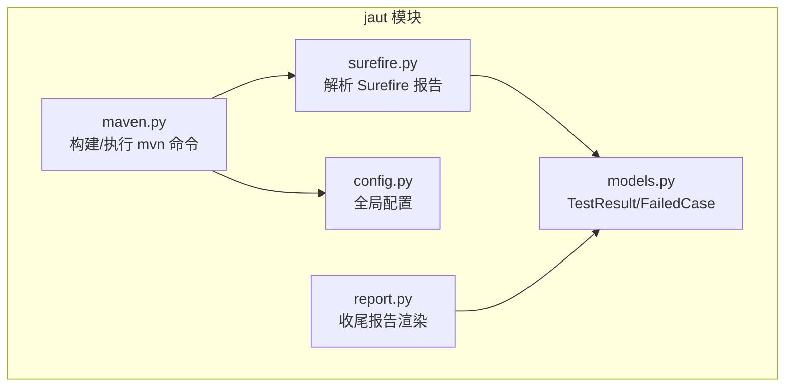
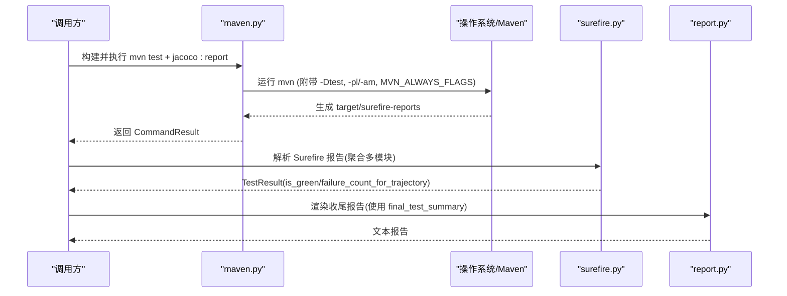
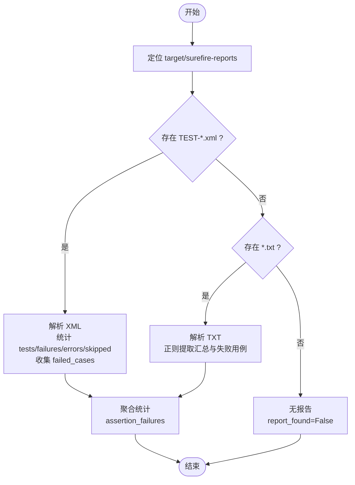
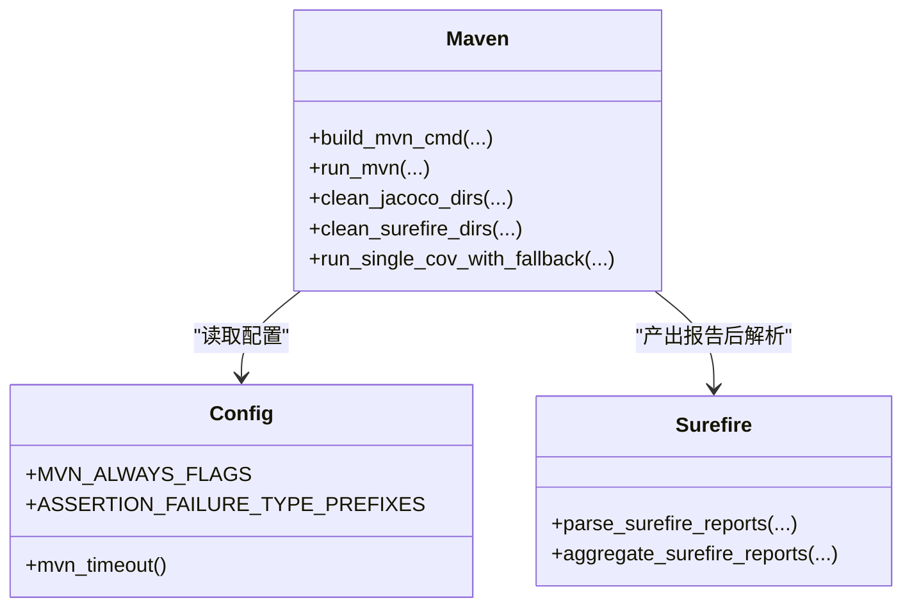
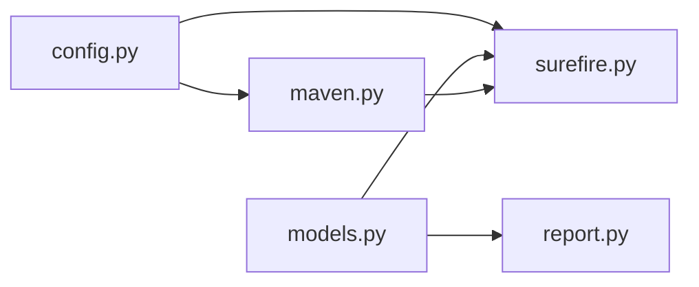

# Surefire 测试执行器

<cite>
**本文引用的文件**
- [surefire.py](file://batch-unit-test-generator/scripts/jaut/surefire.py)
- [surefire.py](file://java-unit-test-generator/scripts/jaut/surefire.py)
- [models.py](file://batch-unit-test-generator/scripts/jaut/models.py)
- [config.py](file://batch-unit-test-generator/scripts/jaut/config.py)
- [maven.py](file://batch-unit-test-generator/scripts/jaut/maven.py)
- [report.py](file://batch-unit-test-generator/scripts/jaut/report.py)
- [test_surefire.py](file://batch-unit-test-generator/tests/test_surefire.py)
- [test_maven.py](file://batch-unit-test-generator/tests/test_maven.py)
</cite>

## 目录
1. [简介](#简介)
2. [项目结构](#项目结构)
3. [核心组件](#核心组件)
4. [架构总览](#架构总览)
5. [详细组件分析](#详细组件分析)
6. [依赖关系分析](#依赖关系分析)
7. [性能考虑](#性能考虑)
8. [故障排除指南](#故障排除指南)
9. [结论](#结论)
10. [附录](#附录)

## 简介
本文件围绕 Maven Surefire 插件在本仓库中的集成与使用，聚焦测试发现、执行与结果收集机制；解释测试执行环境配置（JVM 参数、类路径与工作目录）；深入解析测试结果（用例发现、状态判断、失败信息提取）；说明并行执行策略与报告生成（HTML/XML）；提供错误处理机制与性能调优建议，并给出常见问题的排查清单。

## 项目结构
Surefire 相关能力集中在 jaut 子模块中：
- surefire 模块负责解析 Surefire 产物（XML/TXT），输出统一的 TestResult。
- maven 模块负责构建 mvn 命令、执行测试、清理旧报告、降级覆盖率采集等。
- models 模块定义测试结果的领域模型（TestResult、FailedCase 等）。
- config 模块集中配置（超时、Maven 必带参数、断言异常前缀等）。
- report 模块渲染收尾报告，引用最终测试汇总数据。
- tests 覆盖 surefire 解析与 maven 执行的边界场景。

图表来源
- [surefire.py:1-170](file://batch-unit-test-generator/scripts/jaut/surefire.py#L1-L170)
- [maven.py:248-285](file://batch-unit-test-generator/scripts/jaut/maven.py#L248-L285)
- [config.py:81-97](file://batch-unit-test-generator/scripts/jaut/config.py#L81-L97)
- [models.py:210-281](file://batch-unit-test-generator/scripts/jaut/models.py#L210-L281)
- [report.py:81-115](file://batch-unit-test-generator/scripts/jaut/report.py#L81-L115)

章节来源
- [surefire.py:1-170](file://batch-unit-test-generator/scripts/jaut/surefire.py#L1-L170)
- [maven.py:248-285](file://batch-unit-test-generator/scripts/jaut/maven.py#L248-L285)
- [config.py:81-97](file://batch-unit-test-generator/scripts/jaut/config.py#L81-L97)
- [models.py:210-281](file://batch-unit-test-generator/scripts/jaut/models.py#L210-L281)
- [report.py:81-115](file://batch-unit-test-generator/scripts/jaut/report.py#L81-L115)

## 核心组件
- Surefire 报告解析器：读取 target/surefire-reports 下的 XML/TXT，聚合统计 tests/failures/errors/skipped，提取 failed_cases，计算 assertion_failures，并以 fail-closed 语义判定是否“通过”。
- Maven 执行器：构建 mvn test + jacoco:report 或 prepare-agent/test/report 命令，注入 -Dtest 指定测试类，多模块时追加 -pl/-am，统一附加 MVN_ALWAYS_FLAGS，并在执行前后清理旧报告。
- 模型与配置：TestResult/FailedCase 承载测试结果；config 提供超时、Maven 必带参数、断言异常类型前缀等。
- 收尾报告：基于 state.json 的 final_test_summary 渲染人类可读的最终报告。

章节来源
- [surefire.py:45-93](file://batch-unit-test-generator/scripts/jaut/surefire.py#L45-L93)
- [maven.py:248-285](file://batch-unit-test-generator/scripts/jaut/maven.py#L248-L285)
- [models.py:210-281](file://batch-unit-test-generator/scripts/jaut/models.py#L210-L281)
- [config.py:59-97](file://batch-unit-test-generator/scripts/jaut/config.py#L59-L97)
- [report.py:81-115](file://batch-unit-test-generator/scripts/jaut/report.py#L81-L115)

## 架构总览
Surefire 在整体流程中的位置如下：
- 构建阶段：maven 模块根据 pom 是否已配置 jacoco-maven-plugin 选择不同命令路径，确保每次执行前清理旧覆盖率与测试报告。
- 执行阶段：以 -Dtest 精确指定测试类，支持单/多模块；统一附加忽略测试失败的标志，由 Surefire 报告作为唯一判定依据。
- 解析阶段：surefire 模块优先解析 XML，回退到 TXT；聚合多模块结果，fail-closed 判定。
- 报告阶段：将最终测试汇总写入 state.final_test_summary，用于收尾报告渲染。

图表来源
- [maven.py:248-285](file://batch-unit-test-generator/scripts/jaut/maven.py#L248-L285)
- [surefire.py:45-93](file://batch-unit-test-generator/scripts/jaut/surefire.py#L45-L93)
- [report.py:81-115](file://batch-unit-test-generator/scripts/jaut/report.py#L81-L115)

## 详细组件分析

### Surefire 报告解析
- 报告路径：target/surefire-reports；支持模块级路径拼接。
- 解析优先级：TEST-*.xml > *.txt；无法解析计入 parse_errors。
- 统计项：tests/failures/errors/skipped；failed_cases 记录每个失败用例的 class/method/type/message。
- 断言失败：基于 config.ASSERTION_FAILURE_TYPE_PREFIXES 识别 assertion_failures。
- 聚合：aggregate_surefire_reports 合并多模块结果，保留 fail-closed 语义。

图表来源
- [surefire.py:26-69](file://batch-unit-test-generator/scripts/jaut/surefire.py#L26-L69)
- [surefire.py:96-170](file://batch-unit-test-generator/scripts/jaut/surefire.py#L96-L170)

章节来源
- [surefire.py:26-93](file://batch-unit-test-generator/scripts/jaut/surefire.py#L26-L93)
- [surefire.py:96-170](file://batch-unit-test-generator/scripts/jaut/surefire.py#L96-L170)
- [models.py:210-281](file://batch-unit-test-generator/scripts/jaut/models.py#L210-L281)
- [config.py:59-66](file://batch-unit-test-generator/scripts/jaut/config.py#L59-L66)

### Maven 执行与 Surefire 集成
- 命令构建：build_mvn_cmd 根据 pom 是否包含 jacoco-maven-plugin 选择不同命令；始终添加 -Dtest=...；多模块时追加 -pl/-am；统一附加 MVN_ALWAYS_FLAGS。
- 执行与超时：run_mvn 委托 run_command，默认超时来自 config.mvn_timeout()；支持传入自定义 timeout。
- 报告清理：clean_jacoco_dirs/clean_surefire_dirs 在执行前清理旧产物，防止误读历史结果；清理失败会记录警告并返回未清理目录列表。
- 降级方案：fast-single-cov.sh 失败时自动降级到 mvn test jacoco:report，并备份日志便于排查。

图表来源
- [maven.py:248-285](file://batch-unit-test-generator/scripts/jaut/maven.py#L248-L285)
- [maven.py:319-324](file://batch-unit-test-generator/scripts/jaut/maven.py#L319-L324)
- [maven.py:601-641](file://batch-unit-test-generator/scripts/jaut/maven.py#L601-L641)
- [config.py:81-97](file://batch-unit-test-generator/scripts/jaut/config.py#L81-L97)
- [surefire.py:45-93](file://batch-unit-test-generator/scripts/jaut/surefire.py#L45-L93)

章节来源
- [maven.py:248-285](file://batch-unit-test-generator/scripts/jaut/maven.py#L248-L285)
- [maven.py:319-324](file://batch-unit-test-generator/scripts/jaut/maven.py#L319-L324)
- [maven.py:601-641](file://batch-unit-test-generator/scripts/jaut/maven.py#L601-L641)
- [config.py:81-97](file://batch-unit-test-generator/scripts/jaut/config.py#L81-L97)

### 测试结果判定与轨迹记录
- is_green：fail-closed，要求 report_found=True、parse_errors=0、failures=0、errors=0、无 failed_cases，且 uncleaned_dirs=False。
- failure_count_for_trajectory：真实失败/错误时返回 max(failures, 1)，否则在不绿情况下至少记 1，避免被误判为绿轮。
- 断言失败计数：基于 FailedCase.is_assertion 与配置的前缀匹配。

章节来源
- [models.py:210-281](file://batch-unit-test-generator/scripts/jaut/models.py#L210-L281)
- [config.py:59-66](file://batch-unit-test-generator/scripts/jaut/config.py#L59-L66)

### 报告生成
- 收尾报告：render_finish_report 从 state.final_test_summary 取测试汇总，渲染 Tests/Failures/Errors/Skipped 等指标。
- 批量模式：render_batch_finish_report 汇总各类 before→after 覆盖率与状态。

章节来源
- [report.py:81-115](file://batch-unit-test-generator/scripts/jaut/report.py#L81-L115)
- [report.py:144-219](file://batch-unit-test-generator/scripts/jaut/report.py#L144-L219)

## 依赖关系分析
- surefire 依赖 models.TestResult/FailedCase 与 config 的断言异常前缀。
- maven 依赖 config 的 MVN_ALWAYS_FLAGS、超时、PRUNE_DIRS；依赖 proc.run_command 执行外部命令；依赖 models.State 进行缓存与状态管理。
- report 依赖 models.State 渲染最终报告。

图表来源
- [config.py:81-97](file://batch-unit-test-generator/scripts/jaut/config.py#L81-L97)
- [models.py:210-281](file://batch-unit-test-generator/scripts/jaut/models.py#L210-L281)
- [maven.py:248-285](file://batch-unit-test-generator/scripts/jaut/maven.py#L248-L285)
- [surefire.py:45-93](file://batch-unit-test-generator/scripts/jaut/surefire.py#L45-L93)
- [report.py:81-115](file://batch-unit-test-generator/scripts/jaut/report.py#L81-L115)

章节来源
- [config.py:81-97](file://batch-unit-test-generator/scripts/jaut/config.py#L81-L97)
- [models.py:210-281](file://batch-unit-test-generator/scripts/jaut/models.py#L210-L281)
- [maven.py:248-285](file://batch-unit-test-generator/scripts/jaut/maven.py#L248-L285)
- [surefire.py:45-93](file://batch-unit-test-generator/scripts/jaut/surefire.py#L45-L93)
- [report.py:81-115](file://batch-unit-test-generator/scripts/jaut/report.py#L81-L115)

## 性能考虑
- 超时控制：通过环境变量 JAVA_UT_MVN_TIMEOUT 或默认值控制 mvn 超时；支持传入自定义 timeout。
- 报告清理：执行前清理 JaCoCo 与 Surefire 报告，避免陈旧数据影响；清理失败需关注占用问题。
- 多模块优化：多模块时使用 -pl/-am 精准构建；必要时可跳过 -am 以提升速度（依赖预装时）。
- 降级策略：fast-single-cov.sh 失败时自动降级到 mvn test jacoco:report，保证覆盖率采集成功率。
- 进程进度：配置了 mvn 进度输出间隔与进度文件，防止主 Agent 误判进程无响应。

章节来源
- [config.py:81-90](file://batch-unit-test-generator/scripts/jaut/config.py#L81-L90)
- [maven.py:319-324](file://batch-unit-test-generator/scripts/jaut/maven.py#L319-L324)
- [maven.py:601-641](file://batch-unit-test-generator/scripts/jaut/maven.py#L601-L641)
- [maven.py:464-533](file://batch-unit-test-generator/scripts/jaut/maven.py#L464-L533)

## 故障排除指南
- 编译失败：解析 mvn.log 中的编译错误行，定位文件/行列与消息；若为编译错误，优先修复代码而非重试测试。
- 测试失败：查看 Surefire 报告中的 failed_cases，按 summary_line 快速定位类与方法；断言失败可通过类型前缀识别。
- 报告缺失/不可解析：若 report_found=False 或 parse_errors>0，检查 target/surefire-reports 是否存在及可读；清理失败会导致本轮结果不可信。
- 超时：确认 JAVA_UT_MVN_TIMEOUT 设置是否合理；必要时增大超时或拆分测试集。
- 多模块路径：确保 module 参数正确拼接至 target/surefire-reports；根模块使用 "."。
- 降级日志：fast-single-cov.sh 失败时会备份日志，结合末尾日志定位原因（如 argLine 写死导致 exec 未生成）。

章节来源
- [maven.py:46-84](file://batch-unit-test-generator/scripts/jaut/maven.py#L46-L84)
- [surefire.py:45-93](file://batch-unit-test-generator/scripts/jaut/surefire.py#L45-L93)
- [surefire.py:96-170](file://batch-unit-test-generator/scripts/jaut/surefire.py#L96-L170)
- [maven.py:464-533](file://batch-unit-test-generator/scripts/jaut/maven.py#L464-L533)
- [test_maven.py:513-549](file://batch-unit-test-generator/tests/test_maven.py#L513-L549)

## 结论
本实现以 Surefire 报告为唯一判定依据，采用 fail-closed 策略确保质量闸门不被绕过；通过统一的 Maven 命令构建与清理机制，保障测试执行的一致性与可重复性；借助模型化结果与配置集中化管理，提升可维护性与可扩展性；同时提供降级与日志备份，增强鲁棒性。建议在大规模项目中结合多模块与超时策略，持续优化执行效率与稳定性。

## 附录
- 关键入口函数路径参考：
  - 构建 mvn 命令：[build_mvn_cmd:248-285](file://batch-unit-test-generator/scripts/jaut/maven.py#L248-L285)
  - 执行 mvn：[run_mvn:319-324](file://batch-unit-test-generator/scripts/jaut/maven.py#L319-L324)
  - 清理 Surefire 报告：[clean_surefire_dirs:623-641](file://batch-unit-test-generator/scripts/jaut/maven.py#L623-L641)
  - 解析 Surefire 报告：[parse_surefire_reports:45-69](file://batch-unit-test-generator/scripts/jaut/surefire.py#L45-L69)
  - 聚合多模块报告：[aggregate_surefire_reports:72-93](file://batch-unit-test-generator/scripts/jaut/surefire.py#L72-L93)
  - 收尾报告渲染：[render_finish_report:81-115](file://batch-unit-test-generator/scripts/jaut/report.py#L81-L115)