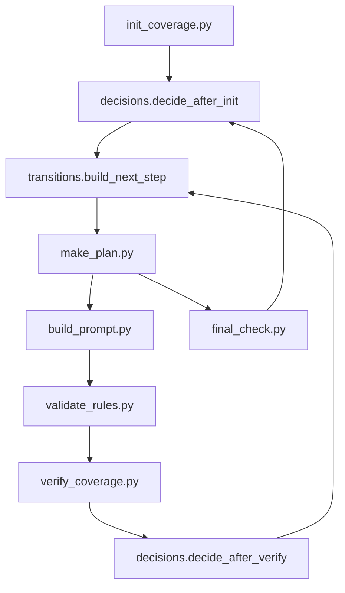
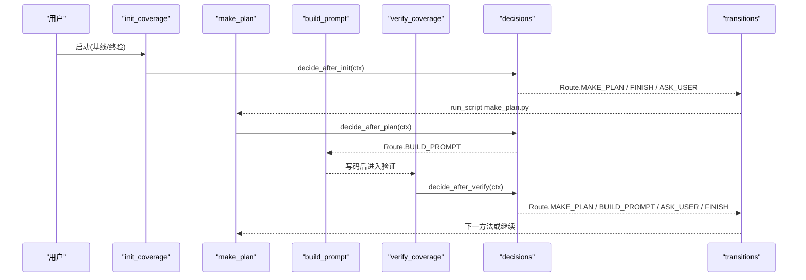
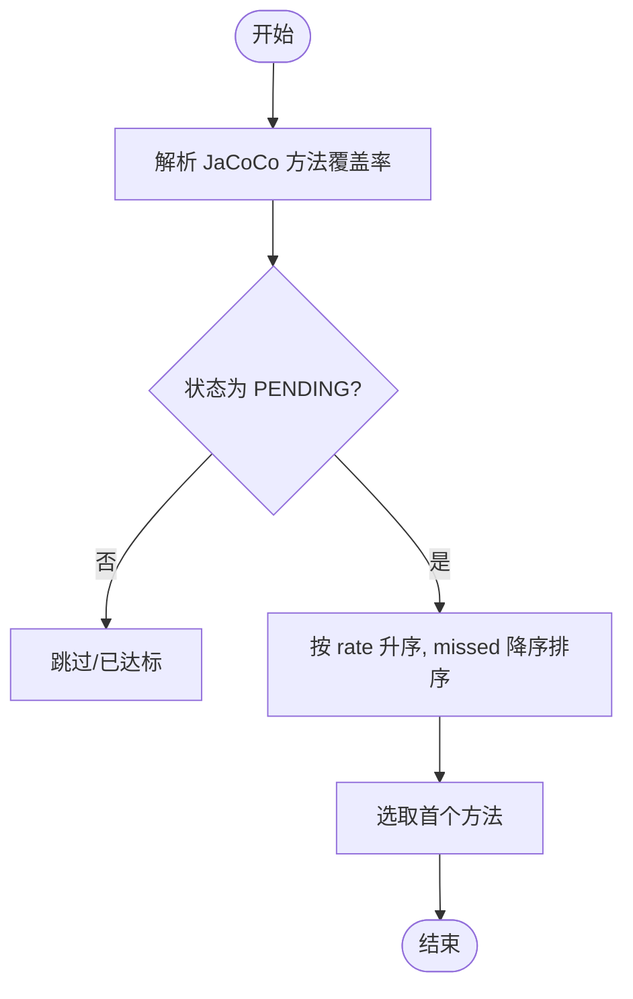
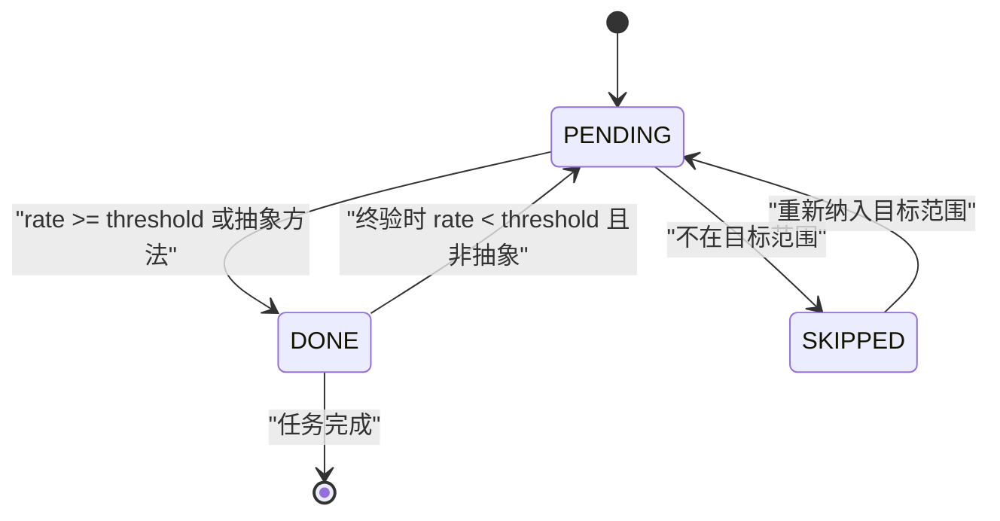
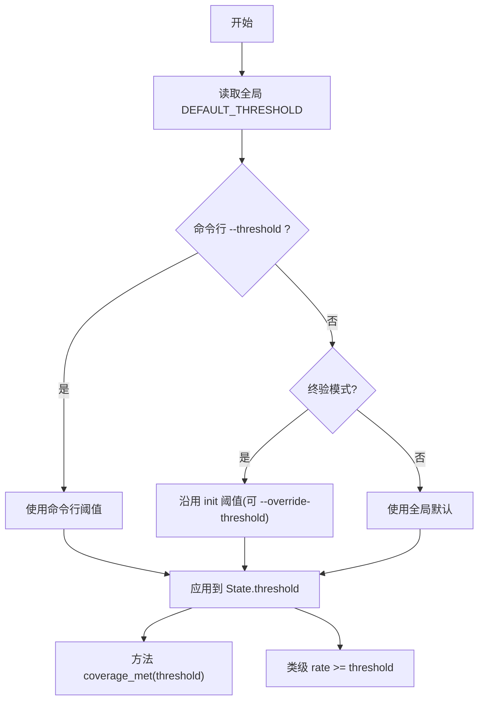
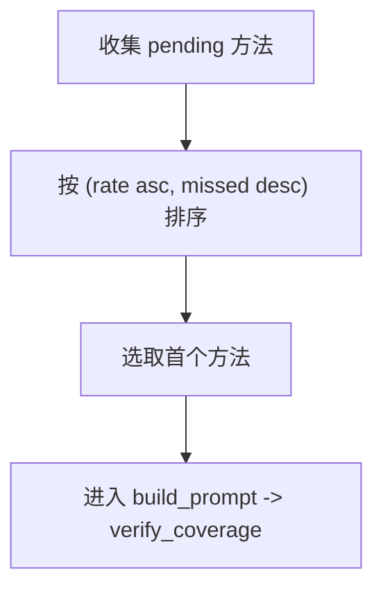
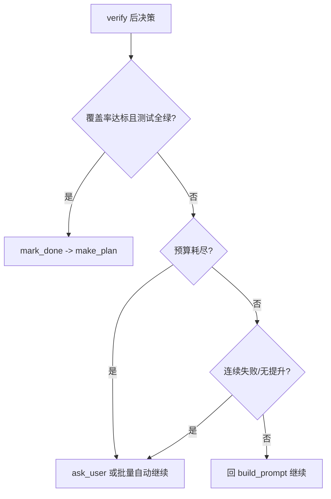
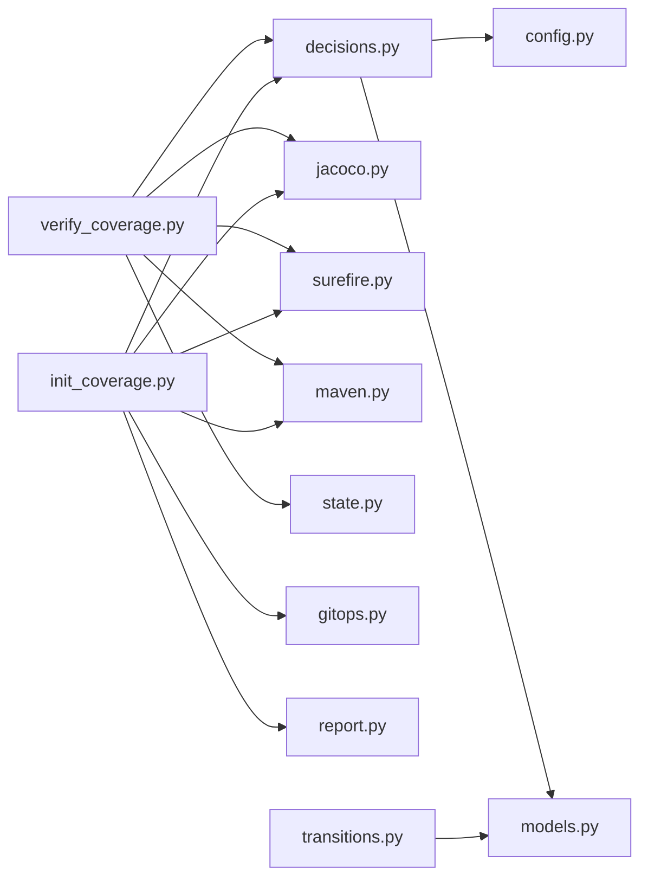

# 覆盖率迭代算法

<cite>
**本文引用的文件**
- [transitions.py](file://batch-unit-test-generator/scripts/jaut/transitions.py)
- [state.py](file://batch-unit-test-generator/scripts/jaut/state.py)
- [decisions.py](file://batch-unit-test-generator/scripts/jaut/decisions.py)
- [config.py](file://batch-unit-test-generator/scripts/jaut/config.py)
- [models.py](file://batch-unit-test-generator/scripts/jaut/models.py)
- [jacoco.py](file://batch-unit-test-generator/scripts/jaut/jacoco.py)
- [report.py](file://batch-unit-test-generator/scripts/jaut/report.py)
- [verify_coverage.py](file://batch-unit-test-generator/scripts/verify_coverage.py)
- [build_prompt.py](file://batch-unit-test-generator/scripts/build_prompt.py)
- [init_coverage.py](file://batch-unit-test-generator/scripts/init_coverage.py)
</cite>

## 目录
1. [简介](#简介)
2. [项目结构](#项目结构)
3. [核心组件](#核心组件)
4. [架构总览](#架构总览)
5. [详细组件分析](#详细组件分析)
6. [依赖关系分析](#依赖关系分析)
7. [性能考虑](#性能考虑)
8. [故障排除指南](#故障排除指南)
9. [结论](#结论)
10. [附录](#附录)

## 简介
本文件系统化阐述覆盖率迭代算法，围绕“未覆盖代码识别、优先级排序、测试生成决策、状态机迁移、阈值判断、终止条件、性能优化与调试监控”展开。该算法以“方法级增量改进”为核心：每轮聚焦一个待覆盖方法，运行测试并采集覆盖率，依据双条件（覆盖率达标且测试全绿）推进或回退；当预算耗尽或不收敛时升级给用户决策，支持批量模式下的自动继续与探索模式预算翻倍。

## 项目结构
覆盖率迭代由一组脚本与 jaut 模块协作完成：
- 入口脚本：init_coverage（基线/终验）、make_plan（计划阶段）、build_prompt（提示词组装）、verify_coverage（单方法验证）、final_check（全量终验）
- 决策层：decisions（纯函数决策）、transitions（路由到具体脚本）
- 数据与配置：models（领域模型）、config（全局常量与阈值）、state（状态持久化）
- 覆盖率解析：jacoco（JaCoCo XML/CSV 解析）
- 报告：report（收尾报告渲染）

图表来源
- [init_coverage.py:121-337](file://batch-unit-test-generator/scripts/init_coverage.py#L121-L337)
- [decisions.py:439-538](file://batch-unit-test-generator/scripts/jaut/decisions.py#L439-L538)
- [transitions.py:41-68](file://batch-unit-test-generator/scripts/jaut/transitions.py#L41-L68)
- [verify_coverage.py:58-205](file://batch-unit-test-generator/scripts/verify_coverage.py#L58-L205)

章节来源
- [init_coverage.py:121-337](file://batch-unit-test-generator/scripts/init_coverage.py#L121-L337)
- [decisions.py:439-538](file://batch-unit-test-generator/scripts/jaut/decisions.py#L439-L538)
- [transitions.py:41-68](file://batch-unit-test-generator/scripts/jaut/transitions.py#L41-L68)
- [verify_coverage.py:58-205](file://batch-unit-test-generator/scripts/verify_coverage.py#L58-L205)

## 核心组件
- 覆盖率原语与模型：coverage_rate、MethodCoverage、ClassCoverage、TestResult、State、Decision
- 决策函数：decide_after_init、decide_after_plan、decide_after_verify
- 状态存储：StateStore（原子写入、文件锁、schema 迁移）
- JaCoCo 解析：parse_jacoco_xml/csv、class_coverage、aggregate_*
- 路由与协议：transitions 将 Decision.route 解析为 next_step 命令
- 报告：finish 报告与批量报告渲染

章节来源
- [models.py:24-30](file://batch-unit-test-generator/scripts/jaut/models.py#L24-L30)
- [models.py:123-179](file://batch-unit-test-generator/scripts/jaut/models.py#L123-L179)
- [models.py:182-205](file://batch-unit-test-generator/scripts/jaut/models.py#L182-L205)
- [models.py:243-281](file://batch-unit-test-generator/scripts/jaut/models.py#L243-L281)
- [models.py:313-348](file://batch-unit-test-generator/scripts/jaut/models.py#L313-L348)
- [state.py:77-165](file://batch-unit-test-generator/scripts/jaut/state.py#L77-L165)
- [jacoco.py:74-182](file://batch-unit-test-generator/scripts/jaut/jacoco.py#L74-L182)
- [transitions.py:41-68](file://batch-unit-test-generator/scripts/jaut/transitions.py#L41-L68)
- [report.py:81-115](file://batch-unit-test-generator/scripts/jaut/report.py#L81-L115)

## 架构总览
覆盖率迭代采用“计划-构建-验证”闭环：
- init_coverage：建立基线或执行终验，判定是否进入计划阶段
- make_plan：选择下一个待覆盖方法（优先级排序）
- build_prompt：为当前方法组装 LLM 提示词，产出 write_code 指令
- validate_rules：规则校验通过后进入 verify_coverage
- verify_coverage：定向复跑测试与覆盖率采集，记录观测并决策
- final_check：队列清空后全量复核类级覆盖率

图表来源
- [init_coverage.py:121-337](file://batch-unit-test-generator/scripts/init_coverage.py#L121-L337)
- [decisions.py:637-672](file://batch-unit-test-generator/scripts/jaut/decisions.py#L637-L672)
- [verify_coverage.py:58-205](file://batch-unit-test-generator/scripts/verify_coverage.py#L58-L205)
- [transitions.py:41-68](file://batch-unit-test-generator/scripts/jaut/transitions.py#L41-L68)

## 详细组件分析

### 未覆盖代码识别与优先级排序
- 未覆盖识别：通过 JaCoCo XML/CSV 解析目标类的方法行覆盖率，抽象/接口方法（covered+missed==0）视为已达标
- 优先级排序：对 pending 方法按“覆盖率升序、并列按 missed 行数降序”排序，选出首个作为当前目标
- 选择逻辑：sort_failing -> select_next_method

图表来源
- [jacoco.py:74-133](file://batch-unit-test-generator/scripts/jaut/jacoco.py#L74-L133)
- [decisions.py:76-85](file://batch-unit-test-generator/scripts/jaut/decisions.py#L76-L85)

章节来源
- [jacoco.py:74-133](file://batch-unit-test-generator/scripts/jaut/jacoco.py#L74-L133)
- [decisions.py:76-85](file://batch-unit-test-generator/scripts/jaut/decisions.py#L76-L85)

### 状态机转换逻辑（PENDING -> COVERED）
- 方法状态：PENDING、DONE、SKIPPED
- 迁移条件：
  - DONE：方法覆盖率 >= threshold 或抽象/接口方法
  - SKIPPED：不在 --method 范围内或终验模式下非目标范围
  - PENDING：初始或未达标
- 状态更新：在 _build_method_entries 中根据基线/终验模式设置状态；verify 阶段 mark_done 时置为 DONE

图表来源
- [init_coverage.py:340-387](file://batch-unit-test-generator/scripts/init_coverage.py#L340-L387)
- [models.py:35-41](file://batch-unit-test-generator/scripts/jaut/models.py#L35-L41)
- [verify_coverage.py:187-191](file://batch-unit-test-generator/scripts/verify_coverage.py#L187-L191)

章节来源
- [init_coverage.py:340-387](file://batch-unit-test-generator/scripts/init_coverage.py#L340-L387)
- [models.py:35-41](file://batch-unit-test-generator/scripts/jaut/models.py#L35-L41)
- [verify_coverage.py:187-191](file://batch-unit-test-generator/scripts/verify_coverage.py#L187-L191)

### 覆盖率阈值判断机制
- 全局配置：DEFAULT_THRESHOLD=80.0，可通过命令行 --threshold 覆盖
- 按类配置：State.threshold 持久化，终验模式默认沿用 init 时的门槛，除非显式 --override-threshold
- 方法级判定：MethodCoverage.coverage_met(threshold) 结合抽象方法豁免
- 类级判定：ClassCoverage.rate >= threshold

图表来源
- [config.py:53-57](file://batch-unit-test-generator/scripts/jaut/config.py#L53-L57)
- [init_coverage.py:252-259](file://batch-unit-test-generator/scripts/init_coverage.py#L252-L259)
- [models.py:145-146](file://batch-unit-test-generator/scripts/jaut/models.py#L145-L146)

章节来源
- [config.py:53-57](file://batch-unit-test-generator/scripts/jaut/config.py#L53-L57)
- [init_coverage.py:252-259](file://batch-unit-test-generator/scripts/init_coverage.py#L252-L259)
- [models.py:145-146](file://batch-unit-test-generator/scripts/jaut/models.py#L145-L146)

### 测试用例生成优先级算法
- 选择策略：优先处理覆盖率最低、未覆盖行数最多的方法
- 复杂度考量：间接通过 missed 行数反映复杂度；若需更细粒度，可在 sort_failing 扩展 key
- 历史覆盖率：round_rates 用于检测无提升轨迹，影响升级决策而非直接排序

图表来源
- [decisions.py:76-85](file://batch-unit-test-generator/scripts/jaut/decisions.py#L76-L85)

章节来源
- [decisions.py:76-85](file://batch-unit-test-generator/scripts/jaut/decisions.py#L76-L85)

### 迭代终止条件
- 覆盖率达标且测试全绿：done -> make_plan 取下一个方法或 finish
- 最大迭代次数：
  - 单方法预算：METHOD_ROUND_BUDGET + method_round_bonus
  - 全局预算：GLOBAL_ROUND_BUDGET + global_round_bonus
  - 批量模式：class_round_used < batch_class_round_budget() 自动继续
- 资源限制：连续失败/无提升触发 ask_user，避免无限循环
- 终验不绿且无可修复方法：达到 FINAL_CHECK_FAIL_STREAK_LIMIT 升级

图表来源
- [decisions.py:183-287](file://batch-unit-test-generator/scripts/jaut/decisions.py#L183-L287)
- [config.py:71-78](file://batch-unit-test-generator/scripts/jaut/config.py#L71-L78)
- [verify_coverage.py:187-205](file://batch-unit-test-generator/scripts/verify_coverage.py#L187-L205)

章节来源
- [decisions.py:183-287](file://batch-unit-test-generator/scripts/jaut/decisions.py#L183-L287)
- [config.py:71-78](file://batch-unit-test-generator/scripts/jaut/config.py#L71-L78)
- [verify_coverage.py:187-205](file://batch-unit-test-generator/scripts/verify_coverage.py#L187-L205)

### 性能优化策略
- 增量编译：fast-single-cov.sh 仅编译/测试目标类，减少全量构建开销
- 缓存机制：
  - jacoco_config_cache：缓存 JaCoCo 配置探测结果
  - parsed_xml：复用解析结果避免重复 IO
- 并行处理：
  - 批量模式：多类并行处理（主流程协调），子代理内按组推进
  - 文件锁：StateStore.locked 保证并发安全
- Maven 超时与进度：MVN_TIMEOUT_ENV、MVN_PROGRESS_INTERVAL_SECONDS 防止长时间挂起

章节来源
- [jacoco.py:161-182](file://batch-unit-test-generator/scripts/jaut/jacoco.py#L161-L182)
- [models.py:406-407](file://batch-unit-test-generator/scripts/jaut/models.py#L406-L407)
- [state.py:93-128](file://batch-unit-test-generator/scripts/jaut/state.py#L93-L128)
- [config.py:83-90](file://batch-unit-test-generator/scripts/jaut/config.py#L83-L90)

### 调试与监控
- 日志：setup_logger 输出到 workdir/logs，关键步骤记录覆盖率变化、测试状态、路由信息
- 指标：metrics 包含 iteration、global_iteration、before/after、threshold、tests_run/failures/errors/skipped/tests_green
- 产物：mvn.log、surefire-reports、coverage.json、state.json
- 报告：render_finish_report 汇总 before→after、测试统计、清理提醒

章节来源
- [verify_coverage.py:151-164](file://batch-unit-test-generator/scripts/verify_coverage.py#L151-L164)
- [decisions.py:346-368](file://batch-unit-test-generator/scripts/jaut/decisions.py#L346-L368)
- [report.py:81-115](file://batch-unit-test-generator/scripts/jaut/report.py#L81-L115)

## 依赖关系分析
- decisions 依赖 config、models，提供纯函数决策
- verify_coverage 依赖 maven、surefire、jacoco、decisions、state
- init_coverage 依赖 javasrc、maven、surefire、jacoco、decisions、gitops、report
- transitions 依赖 models.protocol，将 Decision 路由为 next_step

图表来源
- [decisions.py:30-41](file://batch-unit-test-generator/scripts/jaut/decisions.py#L30-L41)
- [verify_coverage.py:44-48](file://batch-unit-test-generator/scripts/verify_coverage.py#L44-L48)
- [init_coverage.py:45-49](file://batch-unit-test-generator/scripts/init_coverage.py#L45-L49)
- [transitions.py:15-16](file://batch-unit-test-generator/scripts/jaut/transitions.py#L15-L16)

章节来源
- [decisions.py:30-41](file://batch-unit-test-generator/scripts/jaut/decisions.py#L30-L41)
- [verify_coverage.py:44-48](file://batch-unit-test-generator/scripts/verify_coverage.py#L44-L48)
- [init_coverage.py:45-49](file://batch-unit-test-generator/scripts/init_coverage.py#L45-L49)
- [transitions.py:15-16](file://batch-unit-test-generator/scripts/jaut/transitions.py#L15-L16)

## 性能考虑
- 避免重复解析：传入 parsed_xml 复用 JaCoCo XML 解析结果
- 快速路径：CSV 优先于 XML 聚合类级覆盖率
- 超时控制：Maven 执行带超时与进程组管理，防止卡死
- 批量模式：类级预算与探索模式倍数提升吞吐

章节来源
- [jacoco.py:170-182](file://batch-unit-test-generator/scripts/jaut/jacoco.py#L170-L182)
- [config.py:83-90](file://batch-unit-test-generator/scripts/jaut/config.py#L83-L90)
- [config.py:147-168](file://batch-unit-test-generator/scripts/jaut/config.py#L147-L168)

## 故障排除指南
- 迭代停滞：
  - 检查连续失败/无提升轨迹：test_failure_streak、no_improvement
  - 确认预算是否耗尽：METHOD_ROUND_BUDGET、GLOBAL_ROUND_BUDGET
  - 批量模式自动继续：_batch_auto_grant 与 class_round_used
- 覆盖率不增长：
  - 确认测试是否真正执行：surefire report_found、parse_errors
  - 检查 surefire 目录清理失败：uncleaned 标志影响测试结果可信度
  - 抽象/接口方法豁免：is_abstract 导致无需测试
- 环境/依赖问题：
  - mvn 失败区分编译错误与环境错误：compile_errors 路由到 write_code
  - 覆盖率报告缺失：xml_path 不存在时报错并附 mvn.log

章节来源
- [decisions.py:65-70](file://batch-unit-test-generator/scripts/jaut/decisions.py#L65-L70)
- [decisions.py:46-62](file://batch-unit-test-generator/scripts/jaut/decisions.py#L46-L62)
- [decisions.py:302-314](file://batch-unit-test-generator/scripts/jaut/decisions.py#L302-L314)
- [verify_coverage.py:103-149](file://batch-unit-test-generator/scripts/verify_coverage.py#L103-L149)
- [verify_coverage.py:151-168](file://batch-unit-test-generator/scripts/verify_coverage.py#L151-L168)

## 结论
覆盖率迭代算法通过“方法级增量改进 + 双条件判定 + 预算与升级机制”，在保证测试质量的前提下高效提升覆盖率。其设计强调：
- 纯函数决策与可测试性
- 原子状态持久化与并发安全
- 灵活的阈值与批量模式支持
- 完善的调试与报告能力

建议在生产环境中结合批量模式与探索模式，合理配置预算与阈值，利用日志与指标持续优化迭代效率。

## 附录
- 关键配置项：DEFAULT_THRESHOLD、METHOD_ROUND_BUDGET、GLOBAL_ROUND_BUDGET、NO_IMPROVEMENT_ROUNDS、TEST_FAIL_STREAK_ROUNDS、FINAL_CHECK_FAIL_STREAK_LIMIT、RESUME_GRANT_ROUNDS
- 关键模型：MethodCoverage、ClassCoverage、TestResult、State、Decision
- 关键脚本：init_coverage、make_plan、build_prompt、verify_coverage、final_check

章节来源
- [config.py:53-78](file://batch-unit-test-generator/scripts/jaut/config.py#L53-L78)
- [models.py:123-179](file://batch-unit-test-generator/scripts/jaut/models.py#L123-L179)
- [models.py:182-205](file://batch-unit-test-generator/scripts/jaut/models.py#L182-L205)
- [models.py:243-281](file://batch-unit-test-generator/scripts/jaut/models.py#L243-L281)
- [models.py:313-348](file://batch-unit-test-generator/scripts/jaut/models.py#L313-L348)