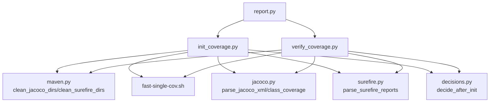
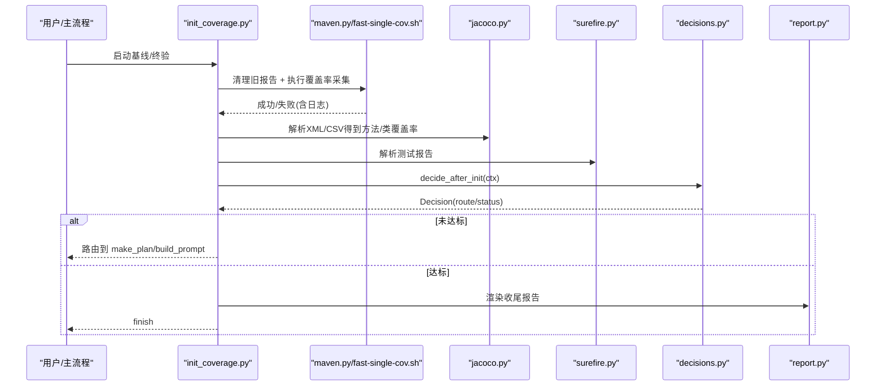
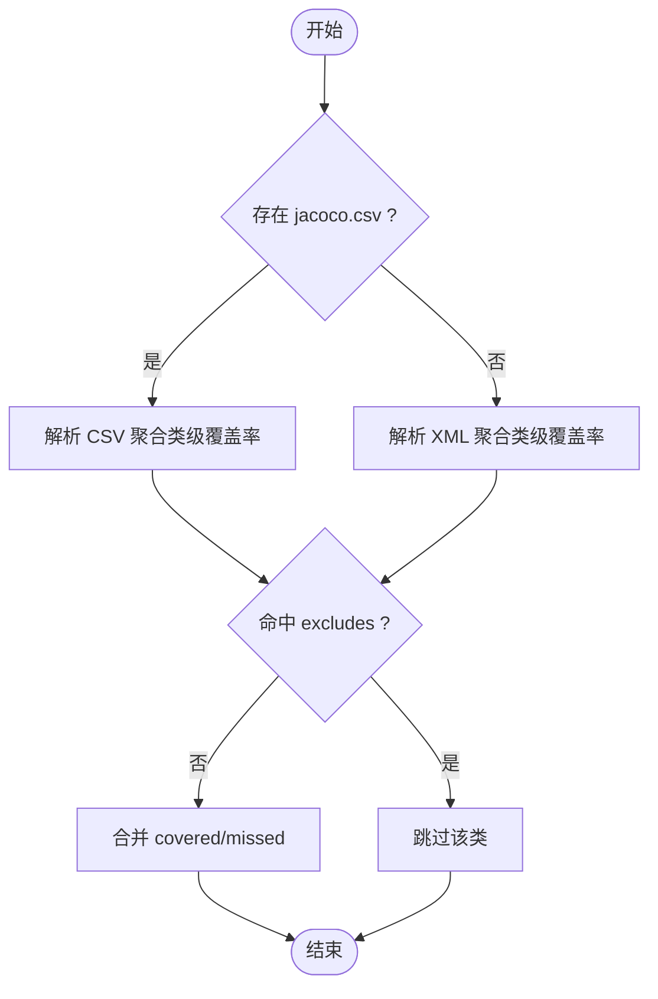
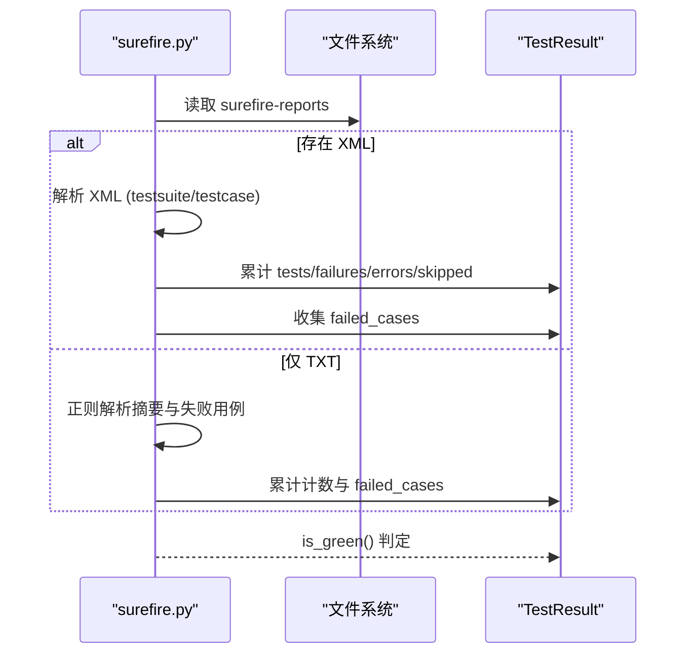
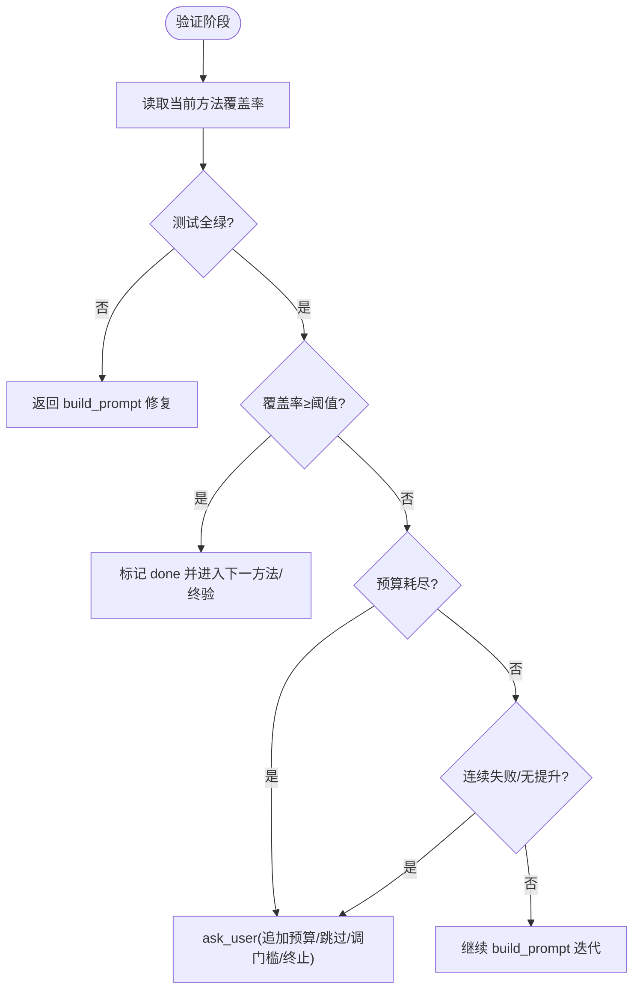
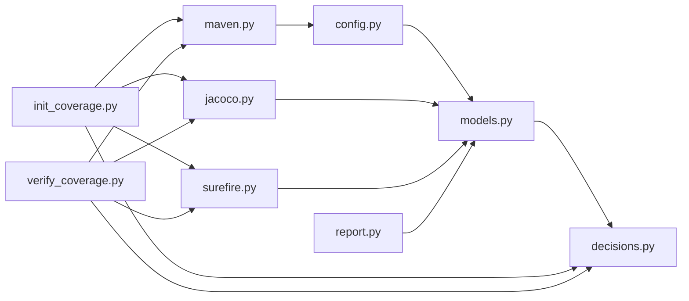

# 覆盖率驱动生成机制

<cite>
**本文引用的文件**
- [jacoco.py](file://batch-unit-test-generator/scripts/jaut/jacoco.py)
- [surefire.py](file://batch-unit-test-generator/scripts/jaut/surefire.py)
- [report.py](file://batch-unit-test-generator/scripts/jaut/report.py)
- [decisions.py](file://batch-unit-test-generator/scripts/jaut/decisions.py)
- [config.py](file://batch-unit-test-generator/scripts/jaut/config.py)
- [models.py](file://batch-unit-test-generator/scripts/jaut/models.py)
- [verify_coverage.py](file://batch-unit-test-generator/scripts/verify_coverage.py)
- [init_coverage.py](file://batch-unit-test-generator/scripts/init_coverage.py)
- [maven.py](file://batch-unit-test-generator/scripts/jaut/maven.py)
- [fast-single-cov.sh](file://batch-unit-test-generator/scripts/jacoco/fast-single-cov.sh)
</cite>

## 目录
1. [简介](#简介)
2. [项目结构](#项目结构)
3. [核心组件](#核心组件)
4. [架构总览](#架构总览)
5. [详细组件分析](#详细组件分析)
6. [依赖关系分析](#依赖关系分析)
7. [性能考虑](#性能考虑)
8. [故障排除指南](#故障排除指南)
9. [结论](#结论)
10. [附录](#附录)

## 简介
本文件面向“覆盖率驱动生成”的完整实现，围绕 JaCoCo 覆盖率采集、Surefire 测试执行与报告解析、阈值判定与迭代策略展开。系统通过脚本编排完成：
- 基线建立与终验（init_coverage）
- 逐方法补测与收敛判断（verify_coverage + decisions）
- Surefire 结果解析（surefire.py）
- JaCoCo 覆盖率解析与聚合（jacoco.py）
- 报告渲染（report.py）
- Maven/JaCoCo 命令构建与降级执行（maven.py + fast-single-cov.sh）

该机制支持全局与按类配置覆盖率门槛、增量改进策略、批量模式预算控制与自动继续，并提供完善的失败回退与可观测性。

## 项目结构
关键路径与职责：
- scripts/jaut：覆盖率驱动的核心逻辑（模型、配置、决策、解析、报告、Maven集成等）
- scripts：入口脚本（init_coverage、verify_coverage）
- scripts/jacoco/fast-single-cov.sh：快速单类覆盖率采集脚本（编译+测试+JaCoCo）

图表来源
- [init_coverage.py:121-337](file://batch-unit-test-generator/scripts/init_coverage.py#L121-L337)
- [verify_coverage.py:58-205](file://batch-unit-test-generator/scripts/verify_coverage.py#L58-L205)
- [maven.py:601-640](file://batch-unit-test-generator/scripts/jaut/maven.py#L601-L640)
- [fast-single-cov.sh:121-200](file://batch-unit-test-generator/scripts/jacoco/fast-single-cov.sh#L121-L200)
- [jacoco.py:74-181](file://batch-unit-test-generator/scripts/jaut/jacoco.py#L74-L181)
- [surefire.py:45-93](file://batch-unit-test-generator/scripts/jaut/surefire.py#L45-L93)
- [decisions.py:439-672](file://batch-unit-test-generator/scripts/jaut/decisions.py#L439-L672)
- [report.py:81-219](file://batch-unit-test-generator/scripts/jaut/report.py#L81-L219)

章节来源
- [init_coverage.py:1-462](file://batch-unit-test-generator/scripts/init_coverage.py#L1-L462)
- [verify_coverage.py:1-281](file://batch-unit-test-generator/scripts/verify_coverage.py#L1-L281)
- [maven.py:1-641](file://batch-unit-test-generator/scripts/jaut/maven.py#L1-L641)
- [fast-single-cov.sh:1-200](file://batch-unit-test-generator/scripts/jacoco/fast-single-cov.sh#L1-L200)
- [jacoco.py:1-248](file://batch-unit-test-generator/scripts/jaut/jacoco.py#L1-L248)
- [surefire.py:1-170](file://batch-unit-test-generator/scripts/jaut/surefire.py#L1-L170)
- [decisions.py:1-672](file://batch-unit-test-generator/scripts/jaut/decisions.py#L1-L672)
- [report.py:1-219](file://batch-unit-test-generator/scripts/jaut/report.py#L1-L219)

## 核心组件
- 覆盖率解析（jacoco.py）：从 jacoco.xml 解析方法级行覆盖率；从 jacoco.csv 聚合类级行覆盖率（含内部类 $ 聚合），支持 excludes 过滤。
- 测试结果解析（surefire.py）：解析 surefire-reports XML/TXT，fail-closed 判定是否全绿，收集失败用例。
- 决策引擎（decisions.py）：基于覆盖率与测试结果的阈值判定、升级策略、预算控制、批量模式自动继续。
- 状态与模型（models.py）：MethodCoverage、ClassCoverage、TestResult、Decision、State 等类型化数据模型。
- 配置中心（config.py）：默认阈值、预算、超时、Maven 参数、批量模式配置等单一事实源。
- 报告渲染（report.py）：finish 收尾报告、批量类内完成报告、批量最终报告。
- Maven 集成（maven.py + fast-single-cov.sh）：命令构建、清理旧报告、快速单类覆盖率采集、降级方案。

章节来源
- [jacoco.py:1-248](file://batch-unit-test-generator/scripts/jaut/jacoco.py#L1-L248)
- [surefire.py:1-170](file://batch-unit-test-generator/scripts/jaut/surefire.py#L1-L170)
- [decisions.py:1-672](file://batch-unit-test-generator/scripts/jaut/decisions.py#L1-L672)
- [models.py:1-693](file://batch-unit-test-generator/scripts/jaut/models.py#L1-L693)
- [config.py:1-181](file://batch-unit-test-generator/scripts/jaut/config.py#L1-L181)
- [report.py:1-219](file://batch-unit-test-generator/scripts/jaut/report.py#L1-L219)
- [maven.py:1-641](file://batch-unit-test-generator/scripts/jaut/maven.py#L1-L641)
- [fast-single-cov.sh:1-200](file://batch-unit-test-generator/scripts/jacoco/fast-single-cov.sh#L1-L200)

## 架构总览
覆盖率驱动的端到端流程如下：
- init_coverage：建立基线、首次覆盖率采集、方法表构建、门槛判定，未达标进入 make_plan。
- verify_coverage：定向复跑目标测试类，采集覆盖率与测试结果，记录轨迹，交由 decisions.decide_after_verify 做双条件判定。
- decisions：依据阈值、预算、连续失败/无提升等规则输出下一步路由（build_prompt / finish / ask_user / final_check）。
- maven/fast-single-cov.sh：负责编译、运行测试、注入 JaCoCo agent、生成 XML/CSV/HTML 报告，并支持降级到 mvn test jacoco:report。
- report：在 finish 或批量完成时渲染报告，包含 before→after 对比、测试汇总与收尾提醒。

图表来源
- [init_coverage.py:121-337](file://batch-unit-test-generator/scripts/init_coverage.py#L121-L337)
- [maven.py:326-533](file://batch-unit-test-generator/scripts/jaut/maven.py#L326-L533)
- [fast-single-cov.sh:121-200](file://batch-unit-test-generator/scripts/jacoco/fast-single-cov.sh#L121-L200)
- [jacoco.py:74-181](file://batch-unit-test-generator/scripts/jaut/jacoco.py#L74-L181)
- [surefire.py:45-93](file://batch-unit-test-generator/scripts/jaut/surefire.py#L45-L93)
- [decisions.py:439-539](file://batch-unit-test-generator/scripts/jaut/decisions.py#L439-L539)
- [report.py:81-115](file://batch-unit-test-generator/scripts/jaut/report.py#L81-L115)

## 详细组件分析

### JaCoCo 覆盖率解析与聚合
- 方法级行覆盖率：解析 jacoco.xml，跳过合成方法（lambda/access/bridge），将 <init> 映射为类简单名，<clinit> 映射为静态块标识，方法唯一键为 name+desc。
- 类级行覆盖率：优先使用 jacoco.csv 聚合 LINE_COVERED/LINE_MISSED（含内部类 $ 行），若不存在则回退到 XML 聚合。
- 排除策略：excludes 以 fnmatch 匹配完整类名（含 $ 内部类），在聚合前生效，命中类不进入方法表与类级统计。
- 多模块聚合：遍历各模块 jacoco.xml/csv 求和，缺失时回退 XML 聚合。

图表来源
- [jacoco.py:136-181](file://batch-unit-test-generator/scripts/jaut/jacoco.py#L136-L181)
- [jacoco.py:187-248](file://batch-unit-test-generator/scripts/jaut/jacoco.py#L187-L248)

章节来源
- [jacoco.py:1-248](file://batch-unit-test-generator/scripts/jaut/jacoco.py#L1-L248)

### Surefire 测试执行与结果解析
- 报告路径：target/surefire-reports，优先解析 TEST-*.xml，回退 *.txt。
- 计数与失败：testsuite 属性与 testcase 子元素统计；failure/error 子元素收集 FailedCase。
- fail-closed：报告缺失/不可解析/存在失败用例一律按不绿计，防止绕过闸门。
- 聚合：多模块下累加 tests/failures/errors/skipped/failed_cases。

图表来源
- [surefire.py:26-93](file://batch-unit-test-generator/scripts/jaut/surefire.py#L26-L93)
- [surefire.py:96-170](file://batch-unit-test-generator/scripts/jaut/surefire.py#L96-L170)
- [models.py:243-281](file://batch-unit-test-generator/scripts/jaut/models.py#L243-L281)

章节来源
- [surefire.py:1-170](file://batch-unit-test-generator/scripts/jaut/surefire.py#L1-L170)
- [models.py:243-281](file://batch-unit-test-generator/scripts/jaut/models.py#L243-L281)

### 覆盖率驱动迭代算法
- 未覆盖代码识别：通过 jacoco.xml 方法级覆盖率与 exclude 过滤，构建 pending/done/skipped 方法表。
- 优先级排序：sort_failing 对 pending 方法按覆盖率升序、missed 行数降序排序，select_next_method 取首个。
- 增量改进策略：
  - 双条件达标（覆盖率≥threshold 且测试全绿）→ done，进入下一个方法或终验。
  - 预算耗尽（单方法/全局）→ ask_user，支持追加预算窗口（RESUME_GRANT_ROUNDS）。
  - 连续失败/无提升 → ask_user，批量模式下预算内自动继续。
  - 测试不绿 → build_prompt 修复失败用例；覆盖率未达标 → build_prompt 继续迭代。
- 批量模式：class_round_used 跟踪类级轮次，探索模式预算翻倍；预算内升级点自动继续并复位轨迹。

图表来源
- [decisions.py:76-85](file://batch-unit-test-generator/scripts/jaut/decisions.py#L76-L85)
- [decisions.py:183-343](file://batch-unit-test-generator/scripts/jaut/decisions.py#L183-L343)
- [decisions.py:637-672](file://batch-unit-test-generator/scripts/jaut/decisions.py#L637-L672)
- [config.py:71-78](file://batch-unit-test-generator/scripts/jaut/config.py#L71-L78)

章节来源
- [decisions.py:1-672](file://batch-unit-test-generator/scripts/jaut/decisions.py#L1-L672)
- [config.py:1-181](file://batch-unit-test-generator/scripts/jaut/config.py#L1-L181)

### 覆盖率阈值配置
- 全局配置：DEFAULT_THRESHOLD=80.0，可通过 --threshold 覆盖；终验模式默认沿用 init 时的门槛，除非显式 --override-threshold。
- 按类配置：coverage_excludes 支持 fnmatch 模式（如 com.foo.User$Builder、*$MapperImpl），在解析与聚合前生效，避免生成代码/内部类干扰统计。
- 抽象/接口方法：covered+missed==0 视为 100% 达标，无需测试。

章节来源
- [config.py:53-57](file://batch-unit-test-generator/scripts/jaut/config.py#L53-L57)
- [init_coverage.py:67-76](file://batch-unit-test-generator/scripts/init_coverage.py#L67-L76)
- [jacoco.py:54-61](file://batch-unit-test-generator/scripts/jaut/jacoco.py#L54-L61)
- [models.py:24-29](file://batch-unit-test-generator/scripts/jaut/models.py#L24-L29)

### 覆盖率报告解读指南
- 行覆盖率：来自 jacoco.xml 的 LINE 计数器；类级聚合优先 CSV，否则 XML 兜底。
- 分支覆盖率：当前实现聚焦行覆盖率；如需分支覆盖率，可在 jacoco 报告中扩展解析逻辑。
- 方法覆盖率：方法级行覆盖率用于逐方法推进；抽象/接口方法直接视为达标。
- 报告内容：finish 报告包含初始/最终类级覆盖率、方法 before→after、测试汇总、收尾提醒；批量报告包含各类 before→after、达标/跳过/失败清单。

章节来源
- [report.py:81-219](file://batch-unit-test-generator/scripts/jaut/report.py#L81-L219)
- [jacoco.py:74-181](file://batch-unit-test-generator/scripts/jaut/jacoco.py#L74-L181)
- [models.py:123-205](file://batch-unit-test-generator/scripts/jaut/models.py#L123-L205)

### Maven 与 Surefire 集成
- 命令构建：检测 pom.xml 中是否已配置 jacoco-maven-plugin；未配置则动态挂载 prepare-agent + report。
- 必带参数：-Dsurefire.failIfNoSpecifiedTests=false、-Dmaven.test.failure.ignore=true、-DfailIfNoTests=false，确保失败轮仍产出覆盖率报告，由 surefire 做唯一判定。
- 清理旧报告：每次执行前清理 target/site/jacoco、target/jacoco.exec、target/surefire-reports，防止陈旧数据影响。
- 快速路径与降级：优先 fast-single-cov.sh（编译+测试+JaCoCo），失败时根据日志判断是否值得降级到 mvn test jacoco:report。

章节来源
- [maven.py:248-316](file://batch-unit-test-generator/scripts/jaut/maven.py#L248-L316)
- [maven.py:326-533](file://batch-unit-test-generator/scripts/jaut/maven.py#L326-L533)
- [maven.py:601-640](file://batch-unit-test-generator/scripts/jaut/maven.py#L601-L640)
- [fast-single-cov.sh:121-200](file://batch-unit-test-generator/scripts/jacoco/fast-single-cov.sh#L121-L200)

## 依赖关系分析
- 低耦合高内聚：models/config 为底层基础，上层脚本（init/verify）组合 jacoco/surefire/maven/decisions/report。
- 外部依赖：Maven、JaCoCo CLI/Agent、Surefire 插件；通过 resolve_tool 与脚本路径管理。
- 潜在循环依赖：无；decisions 纯函数，不修改状态；状态持久化由入口脚本落地。

图表来源
- [config.py:1-181](file://batch-unit-test-generator/scripts/jaut/config.py#L1-L181)
- [models.py:1-693](file://batch-unit-test-generator/scripts/jaut/models.py#L1-L693)
- [decisions.py:1-672](file://batch-unit-test-generator/scripts/jaut/decisions.py#L1-L672)
- [jacoco.py:1-248](file://batch-unit-test-generator/scripts/jaut/jacoco.py#L1-L248)
- [surefire.py:1-170](file://batch-unit-test-generator/scripts/jaut/surefire.py#L1-L170)
- [maven.py:1-641](file://batch-unit-test-generator/scripts/jaut/maven.py#L1-L641)
- [init_coverage.py:1-462](file://batch-unit-test-generator/scripts/init_coverage.py#L1-L462)
- [verify_coverage.py:1-281](file://batch-unit-test-generator/scripts/verify_coverage.py#L1-L281)
- [report.py:1-219](file://batch-unit-test-generator/scripts/jaut/report.py#L1-L219)

## 性能考虑
- 增量编译：fast-single-cov.sh 支持 --no-am 跳过依赖模块编译（verify 阶段依赖已预装时使用）。
- 缓存策略：maven.parse_jacoco_config 缓存 pom.xml 修改时间，避免重复扫描；state.jacoco_config_cache 持久化缓存。
- 并行执行：Maven 命令通过 forkCount=1 保证 JaCoCo agent 正确注入；如需并行，需评估 JaCoCo exec 写入冲突。
- 报告清理：每次执行前清理 jacoco/surefire 目录，避免陈旧数据导致误判。
- 降级方案：fast-single-cov.sh 失败时自动降级到 mvn test jacoco:report，提高鲁棒性。

章节来源
- [maven.py:167-197](file://batch-unit-test-generator/scripts/jaut/maven.py#L167-L197)
- [maven.py:326-533](file://batch-unit-test-generator/scripts/jaut/maven.py#L326-L533)
- [fast-single-cov.sh:121-200](file://batch-unit-test-generator/scripts/jacoco/fast-single-cov.sh#L121-L200)

## 故障排除指南
- 覆盖率数据不准确：
  - 检查 excludes 是否误命中目标类（is_excluded 校验）。
  - 确认 CSV/XML 报告存在且未被占用（clean_jacoco_dirs 清理）。
  - 内部类聚合是否正确（$ 分隔处理）。
- 测试执行失败：
  - Surefire 报告缺失或无法解析（parse_errors 计入失败）。
  - 测试类名/包路径不匹配（fast-single-cov.sh 会提示 No tests were executed）。
  - 编译错误（parse_compile_errors 提取并路由 write_code 自愈）。
- 迭代不收敛：
  - 连续失败/无提升触发 ask_user，检查测试质量与覆盖率瓶颈。
  - 预算耗尽时追加预算窗口（RESUME_GRANT_ROUNDS）或调整门槛。
- 批量模式异常：
  - class_round_used 超过预算时自动继续或升级，检查 exploration_mode 倍数。
  - 多模块聚合时确认各模块 jacoco.xml/csv 存在。

章节来源
- [jacoco.py:54-61](file://batch-unit-test-generator/scripts/jaut/jacoco.py#L54-L61)
- [surefire.py:96-170](file://batch-unit-test-generator/scripts/jaut/surefire.py#L96-L170)
- [maven.py:46-84](file://batch-unit-test-generator/scripts/jaut/maven.py#L46-L84)
- [decisions.py:243-273](file://batch-unit-test-generator/scripts/jaut/decisions.py#L243-L273)
- [config.py:71-78](file://batch-unit-test-generator/scripts/jaut/config.py#L71-L78)

## 结论
本机制通过 JaCoCo 覆盖率采集与 Surefire 测试解析，结合严格的阈值判定与迭代策略，实现了自动化、可配置的单元测试生成与验证。其优势包括：
- 精确的方法级与类级覆盖率解析，支持内部类聚合与排除。
- 健壮的测试执行与报告解析，fail-closed 确保安全性。
- 灵活的阈值与预算控制，支持批量模式与自动继续。
- 完善的降级与可观测性，便于问题定位与性能优化。

建议在生产环境中结合缓存与增量编译策略，合理设置阈值与预算，定期审查覆盖率报告，持续改进测试质量。

## 附录
- 环境变量：
  - JAVA_UT_MVN_TIMEOUT：Maven 超时秒数。
  - JAVA_UT_BATCH_CLASS_ROUND_BUDGET：批量模式类级预算。
- 退出码：
  - 0：正常完成。
  - 1：需要继续处理。
  - 2：执行错误。
  - 3：状态/协议错误。

章节来源
- [config.py:83-97](file://batch-unit-test-generator/scripts/jaut/config.py#L83-L97)
- [config.py:44-48](file://batch-unit-test-generator/scripts/jaut/config.py#L44-L48)
- [config.py:143-156](file://batch-unit-test-generator/scripts/jaut/config.py#L143-L156)