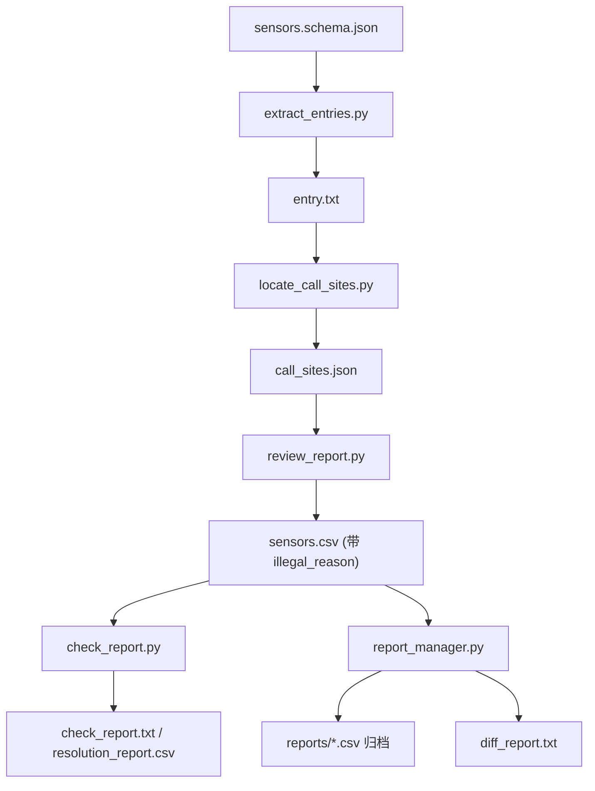
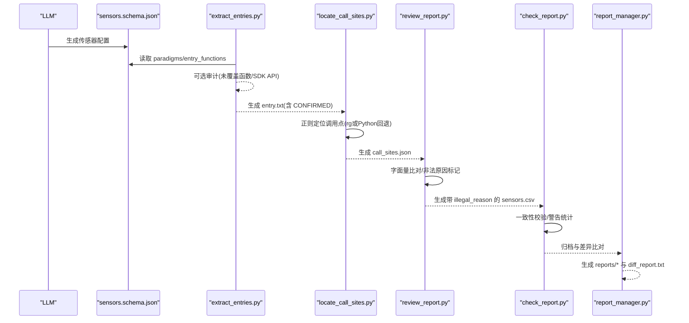
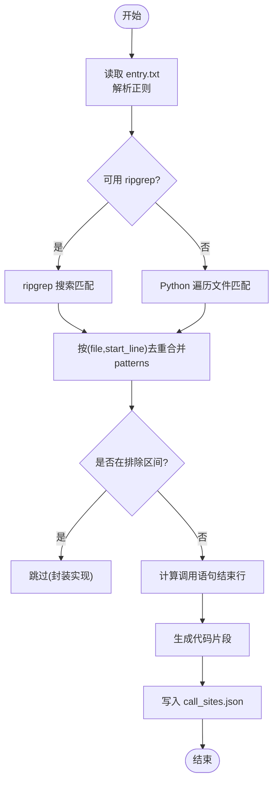
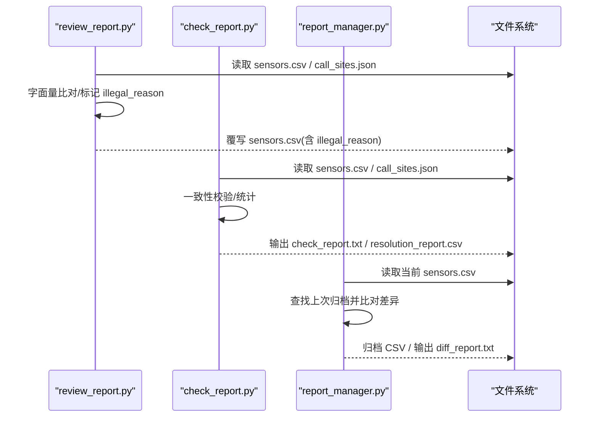
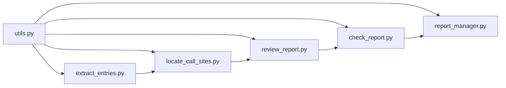

# 埋点分析工具

<cite>
**本文引用的文件**
- [sensors.schema.json](file://sensors-analyze/sensors.schema.json)
- [CLAUDE.md](file://sensors-analyze/CLAUDE.md)
- [extract_entries.py](file://sensors-analyze/scripts/extract_entries.py)
- [locate_call_sites.py](file://sensors-analyze/scripts/locate_call_sites.py)
- [check_report.py](file://sensors-analyze/scripts/check_report.py)
- [review_report.py](file://sensors-analyze/scripts/review_report.py)
- [report_manager.py](file://sensors-analyze/scripts/report_manager.py)
- [utils.py](file://sensors-analyze/scripts/utils.py)
- [trigger-eval.json](file://sensors-analyze/trigger-eval.json)
- [问题.txt](file://sensors-analyze/问题.txt)
</cite>

## 目录
1. [简介](#简介)
2. [项目结构](#项目结构)
3. [核心组件](#核心组件)
4. [架构总览](#架构总览)
5. [详细组件分析](#详细组件分析)
6. [依赖关系分析](#依赖关系分析)
7. [性能与大规模代码库策略](#性能与大规模代码库策略)
8. [API 参考](#api-参考)
9. [集成方式（CI/CD）](#集成方式cicd)
10. [故障排除指南](#故障排除指南)
11. [结论](#结论)
12. [附录：使用示例](#附录使用示例)

## 简介
本工具是一套面向任意代码库的“埋点审计与分析”技能，目标是在不修改目标代码的前提下，自动发现并梳理埋点实现范式、定位调用点、追踪上报字段取值，并输出可归档、可对比、可复核的分析产物。工具采用“LLM + Python 脚本”的确定性流水线：LLM 产出规范化的传感器配置（JSON Schema），Python 脚本负责扫描、定位、校验、归档与差异比对。

该工具聚焦六个业务字段：page_name、first_biz_id、second_biz_id、first_biz_name、second_biz_name、event。所有脚本仅使用标准库，避免第三方运行时依赖；在搜索阶段优先使用 ripgrep（rg），无 rg 时回退到纯 Python 扫描。

**章节来源**
- [CLAUDE.md:11-22](file://sensors-analyze/CLAUDE.md#L11-L22)
- [问题.txt:1-17](file://sensors-analyze/问题.txt#L1-L17)

## 项目结构
- sensors-analyze：技能根目录
  - sensors.schema.json：传感器配置的 JSON Schema，定义范式、调用链、入口函数、SDK API 等
  - CLAUDE.md：工作流说明、命令、约束与输出格式约定
  - trigger-eval.json：触发条件评估用例
  - scripts：核心脚本集合
    - extract_entries.py：从 sensors.json 提取入口正则候选，生成 entry.txt
    - locate_call_sites.py：按 entry.txt 的正则定位调用点，生成 call_sites.json
    - review_report.py：预审 CSV，追加 illegal_reason 列，生成 review_report.txt
    - check_report.py：校验一致性，生成 check_report.txt 与 resolution_report.csv
    - report_manager.py：CSV 归档与版本差异比对，生成 diff_report.txt
    - utils.py：日志、next_step、rg 可用性检测等共享工具

**图表来源**
- [CLAUDE.md:11-22](file://sensors-analyze/CLAUDE.md#L11-L22)
- [extract_entries.py:188-303](file://sensors-analyze/scripts/extract_entries.py#L188-L303)
- [locate_call_sites.py:230-342](file://sensors-analyze/scripts/locate_call_sites.py#L230-L342)
- [review_report.py:239-361](file://sensors-analyze/scripts/review_report.py#L239-L361)
- [check_report.py:47-247](file://sensors-analyze/scripts/check_report.py#L47-L247)
- [report_manager.py:243-331](file://sensors-analyze/scripts/report_manager.py#L243-L331)

**章节来源**
- [CLAUDE.md:53-69](file://sensors-analyze/CLAUDE.md#L53-L69)

## 核心组件
- 传感器配置系统（JSON Schema）
  - 描述埋点开发范式、调用链路、入口函数、SDK API、数据流转标注等
  - 用于驱动后续脚本进行入口提取、调用点定位与完整性验证
- 自动发现机制
  - 基于 Schema 中 entry_functions.grep_pattern 的正则匹配
  - 支持 ripgrep 加速与纯 Python 回退
  - 自动排除 wrapper/hook 自身定义体，减少误报
- 完整性验证
  - 检查 CSV 行数是否覆盖全部调用点
  - 校验 file 字段与 call_sites.json 的一致性
  - 禁止动态占位符，强制具体值
  - 必填非空字段为空时产生 WARN 并输出 resolution_report.csv
- 报告管理与版本漂移防护
  - 归档带时间戳的 CSV
  - 与上一版本比对新增/删除/修改行，输出差异报告供人工复核

**章节来源**
- [sensors.schema.json:1-262](file://sensors-analyze/sensors.schema.json#L1-L262)
- [CLAUDE.md:53-69](file://sensors-analyze/CLAUDE.md#L53-L69)
- [check_report.py:4-18](file://sensors-analyze/scripts/check_report.py#L4-L18)
- [report_manager.py:1-18](file://sensors-analyze/scripts/report_manager.py#L1-L18)

## 架构总览
下图展示了从 LLM 产出 Schema 到最终归档与差异报告的完整流程，以及各脚本之间的输入输出关系。

**图表来源**
- [CLAUDE.md:11-22](file://sensors-analyze/CLAUDE.md#L11-L22)
- [extract_entries.py:188-303](file://sensors-analyze/scripts/extract_entries.py#L188-L303)
- [locate_call_sites.py:230-342](file://sensors-analyze/scripts/locate_call_sites.py#L230-L342)
- [review_report.py:239-361](file://sensors-analyze/scripts/review_report.py#L239-L361)
- [check_report.py:47-247](file://sensors-analyze/scripts/check_report.py#L47-L247)
- [report_manager.py:243-331](file://sensors-analyze/scripts/report_manager.py#L243-L331)

## 详细组件分析

### 传感器配置系统（JSON Schema）
- 顶层对象包含 meta 与 paradigms
  - meta：项目级元信息（project_path、language、analyzed_at、sdk_summary、global_sdk_apis）
  - paradigms：每种埋点范式的详细描述
- 范式（paradigm）关键字段
  - id/name/category/description/reference_location
  - call_chain：从功能页到 SDK API 的调用链路，每层包含 order、layer、symbol、location、description、data_flow
  - entry_functions：入口函数/标识列表，包含 name、kind、location、grep_pattern、signature、note
  - sdk_apis：该范式最终调用的 SDK API 列表，含 name、purpose、parameters、usage_location
- 位置（location）：file、start_line、end_line
- 调用链步骤（callChainStep）：order、layer、symbol、location、description、data_flow（字段来源/变换/透传/合并/丢弃）
- 入口函数（entryFunction）：grep_pattern 是后续脚本定位调用点的核心依据
- SDK API（sdkApi）：name、signature、purpose、parameters、usage_location

复杂度与影响
- 范式越多、调用链越深，后续定位与追踪成本越高
- data_flow 标注有助于 LLM 在第 4 步追踪字段取值来源
- grep_pattern 质量直接影响第 3 步召回率与误报率

**章节来源**
- [sensors.schema.json:1-262](file://sensors-analyze/sensors.schema.json#L1-L262)

### 自动发现机制：扫描算法、调用点定位与完整性验证
- 入口提取（extract_entries.py）
  - 从 sensors.json 的 paradigms 中提取 entry_functions 的 grep_pattern，生成 entry.txt
  - 支持 --audit 模式：独立扫描代码库，发现未被覆盖的传感器相关函数与 SDK API 调用点
  - 输出 next_step 提示人工确认后再进入下一步
- 调用点定位（locate_call_sites.py）
  - 读取 entry.txt 中的正则，优先使用 ripgrep 搜索，否则回退到 Python 遍历
  - 构建排除区间：wrapper/hook 入口的定义体范围，避免将封装实现误判为业务调用点
  - 计算多行调用语句的结束行，生成 snippet 便于后续 LLM 分析
  - 去重规则：同一 (file, start_line) 合并 patterns
- 完整性验证（check_report.py）
  - 校验 CSV 行数是否覆盖全部调用点
  - 校验 file 字段格式与 call_sites.json 对应关系
  - 禁止动态占位符（如 <动态:...>、<变量:...>、<unknown> 等）
  - 必填非空字段为空时产生 WARN，并输出 resolution_report.csv 供人工复核
  - 退出码：0=PASS，2=FAIL，3=WARN，1=异常

**图表来源**
- [locate_call_sites.py:230-342](file://sensors-analyze/scripts/locate_call_sites.py#L230-L342)
- [utils.py:47-51](file://sensors-analyze/scripts/utils.py#L47-L51)

**章节来源**
- [extract_entries.py:188-303](file://sensors-analyze/scripts/extract_entries.py#L188-L303)
- [locate_call_sites.py:230-342](file://sensors-analyze/scripts/locate_call_sites.py#L230-L342)
- [check_report.py:47-247](file://sensors-analyze/scripts/check_report.py#L47-L247)

### 分析报告生成：指标统计、问题识别与可视化展示
- 预审（review_report.py）
  - 读取 sensors.csv，追加 illegal_reason 列
  - 结构校验：file 指向的文件是否存在、行号范围是否有效、必填字段是否为空
  - 代码级字面量比对：提取字符串字面量，判断 CSV 字段值是否有匹配或可从字面量推断
  - 输出 review_report.txt 摘要与覆写后的 sensors.csv
- 校验（check_report.py）
  - 统计必填非空字段解析情况，计算未解析比例
  - 若未解析比例超过阈值（例如 30%），建议人工深入复核
  - 输出 check_report.txt 与 resolution_report.csv
- 归档与差异（report_manager.py）
  - 生成带时间戳的 CSV 归档文件
  - 与上一版本比对新增/删除/修改行，输出 diff_report.txt
  - 防漂移：通过差异报告引导人工复核变更

**图表来源**
- [review_report.py:239-361](file://sensors-analyze/scripts/review_report.py#L239-L361)
- [check_report.py:47-247](file://sensors-analyze/scripts/check_report.py#L47-L247)
- [report_manager.py:243-331](file://sensors-analyze/scripts/report_manager.py#L243-L331)

**章节来源**
- [review_report.py:239-361](file://sensors-analyze/scripts/review_report.py#L239-L361)
- [check_report.py:47-247](file://sensors-analyze/scripts/check_report.py#L47-L247)
- [report_manager.py:243-331](file://sensors-analyze/scripts/report_manager.py#L243-L331)

### 与其他系统的集成方式（CI/CD 流水线）
- 触发条件
  - 当请求涉及“盘点/梳理/验证现有埋点实现”时触发；不涉及错误监控、A/B 测试、IoT 传感器、通用架构分析等场景
- CI/CD 集成建议
  - Step 1：LLM 生成 sensors.json（需通过 Schema 校验）
  - Step 2：运行 extract_entries.py --audit（可选）生成 entry.txt
  - Step 3：人工确认 entry.txt（添加 # CONFIRMED）
  - Step 4：运行 locate_call_sites.py 生成 call_sites.json
  - Step 5：LLM 逐条分析并生成 sensors.csv
  - Step 6：运行 review_report.py 与 check_report.py 进行预审与校验
  - Step 7：运行 report_manager.py 归档并生成差异报告
  - 失败分支：根据 exit code 决定阻断或告警（0 PASS，2 FAIL，3 WARN，1 异常）

**章节来源**
- [trigger-eval.json:1-90](file://sensors-analyze/trigger-eval.json#L1-L90)
- [CLAUDE.md:23-47](file://sensors-analyze/CLAUDE.md#L23-L47)

## 依赖关系分析
- 模块耦合
  - 所有脚本通过 utils.py 统一日志与 next_step 输出，降低重复代码
  - locate_call_sites.py 依赖 ripgrep 提升性能，无 rg 时回退 Python 扫描
  - review_report.py 与 check_report.py 共同消费 sensors.csv 与 call_sites.json
  - report_manager.py 消费 sensors.csv 并维护历史归档与差异报告
- 外部依赖
  - 仅标准库；ripgrep 为可选外部工具
- 循环依赖
  - 无循环依赖；单向数据流：Schema → entry.txt → call_sites.json → sensors.csv → 报告/归档

**图表来源**
- [utils.py:1-51](file://sensors-analyze/scripts/utils.py#L1-L51)
- [extract_entries.py:188-303](file://sensors-analyze/scripts/extract_entries.py#L188-L303)
- [locate_call_sites.py:230-342](file://sensors-analyze/scripts/locate_call_sites.py#L230-L342)
- [review_report.py:239-361](file://sensors-analyze/scripts/review_report.py#L239-L361)
- [check_report.py:47-247](file://sensors-analyze/scripts/check_report.py#L47-L247)
- [report_manager.py:243-331](file://sensors-analyze/scripts/report_manager.py#L243-L331)

**章节来源**
- [utils.py:1-51](file://sensors-analyze/scripts/utils.py#L1-L51)

## 性能与大规模代码库策略
- 搜索性能
  - 优先使用 ripgrep（rg）进行正则搜索，显著降低扫描时间
  - 无 rg 时回退到 Python 遍历，支持自定义后缀白名单（DEFAULT_EXTS）
- 文件缓存
  - locate_call_sites.py 对同一文件内容做缓存，避免重复读取
- 排除区间
  - 自动排除 wrapper/hook 入口的定义体，减少误报与无效匹配
- 大规模处理建议
  - 分模块/子目录分批执行（通过调整 root 参数）
  - 合理编写 grep_pattern，提高召回率同时降低误报
  - 利用 --audit 模式提前发现遗漏的入口函数与 SDK API 调用点
  - 关注未解析字段比例，超过阈值时集中人工复核

[本节提供通用指导，不直接分析具体文件]

## API 参考
以下列出各脚本的命令行接口与关键行为，便于集成与扩展。

- extract_entries.py
  - 作用：从 sensors.json 提取入口正则候选，生成 entry.txt
  - 关键参数：--sensors、--out、--log、--audit、--root
  - 行为：支持审计模式，输出 next_step 提示
  - 参考路径：[extract_entries.py:188-303](file://sensors-analyze/scripts/extract_entries.py#L188-L303)

- locate_call_sites.py
  - 作用：按 entry.txt 的正则定位调用点，生成 call_sites.json
  - 关键参数：--entry、--root、--out、--exts、--sensors、--log
  - 行为：需要 entry.txt 包含 # CONFIRMED；优先 rg，回退 Python；排除 wrapper/hook 定义体
  - 参考路径：[locate_call_sites.py:230-342](file://sensors-analyze/scripts/locate_call_sites.py#L230-L342)

- review_report.py
  - 作用：预审 sensors.csv，追加 illegal_reason 列，生成 review_report.txt
  - 关键参数：--csv、--sites、--root、--out、--log
  - 行为：字面量比对、非法原因标记、覆写 sensors.csv
  - 参考路径：[review_report.py:239-361](file://sensors-analyze/scripts/review_report.py#L239-L361)

- check_report.py
  - 作用：校验 call_sites.json 与 sensors.csv 的一致性，生成 check_report.txt 与 resolution_report.csv
  - 关键参数：--sites、--csv、--out、--resolution-report、--log
  - 行为：禁止动态占位符；必填非空字段为空时 WARN；退出码 0/2/3/1
  - 参考路径：[check_report.py:47-247](file://sensors-analyze/scripts/check_report.py#L47-L247)

- report_manager.py
  - 作用：CSV 归档与版本差异比对，生成 diff_report.txt
  - 关键参数：--csv、--reports-dir、--diff-only、--log、--out
  - 行为：归档带时间戳的 CSV；比对新增/删除/修改；防漂移
  - 参考路径：[report_manager.py:243-331](file://sensors-analyze/scripts/report_manager.py#L243-L331)

- utils.py
  - 作用：共享工具（日志、next_step、rg 可用性检测）
  - 关键函数：setup_logging、next_step、original_stderr、check_rg_available
  - 参考路径：[utils.py:1-51](file://sensors-analyze/scripts/utils.py#L1-L51)

**章节来源**
- [extract_entries.py:188-303](file://sensors-analyze/scripts/extract_entries.py#L188-L303)
- [locate_call_sites.py:230-342](file://sensors-analyze/scripts/locate_call_sites.py#L230-L342)
- [review_report.py:239-361](file://sensors-analyze/scripts/review_report.py#L239-L361)
- [check_report.py:47-247](file://sensors-analyze/scripts/check_report.py#L47-L247)
- [report_manager.py:243-331](file://sensors-analyze/scripts/report_manager.py#L243-L331)
- [utils.py:1-51](file://sensors-analyze/scripts/utils.py#L1-L51)

## 集成方式（CI/CD）
- 触发条件
  - 当请求涉及“盘点/梳理/验证现有埋点实现”时触发；不涉及错误监控、A/B 测试、IoT 传感器、通用架构分析等场景
- 流水线步骤
  - 生成 sensors.json（需通过 Schema 校验）
  - 运行 extract_entries.py 生成 entry.txt（可选 --audit）
  - 人工确认 entry.txt（添加 # CONFIRMED）
  - 运行 locate_call_sites.py 生成 call_sites.json
  - LLM 逐条分析并生成 sensors.csv
  - 运行 review_report.py 与 check_report.py
  - 运行 report_manager.py 归档并生成差异报告
- 失败分支
  - 根据 exit code 决定阻断或告警（0 PASS，2 FAIL，3 WARN，1 异常）

**章节来源**
- [trigger-eval.json:1-90](file://sensors-analyze/trigger-eval.json#L1-L90)
- [CLAUDE.md:23-47](file://sensors-analyze/CLAUDE.md#L23-L47)

## 故障排除指南
- 常见问题
  - entry.txt 未包含 # CONFIRMED：locate_call_sites.py 会拒绝执行
  - sensors.json 缺少 paradigms 或 entry_functions：extract_entries.py 会报错
  - 动态占位符出现在 CSV：check_report.py 判定为 ERROR
  - 必填非空字段为空：check_report.py 产生 WARN 并输出 resolution_report.csv
  - 文件不存在或行号范围无效：review_report.py 标记 illegal_reason
- 处理建议
  - 检查 entry.txt 是否已人工确认
  - 修正 sensors.json 的 paradigms 与 entry_functions
  - 将动态值替换为具体值，或继续追踪上游直到找到具体值
  - 根据 resolution_report.csv 与 diff_report.txt 进行人工复核

**章节来源**
- [locate_call_sites.py:257-260](file://sensors-analyze/scripts/locate_call_sites.py#L257-L260)
- [extract_entries.py:206-218](file://sensors-analyze/scripts/extract_entries.py#L206-L218)
- [check_report.py:100-145](file://sensors-analyze/scripts/check_report.py#L100-L145)
- [review_report.py:177-236](file://sensors-analyze/scripts/review_report.py#L177-L236)

## 结论
本工具通过“LLM 产出 Schema + Python 脚本自动化”的方式，实现了埋点自动发现、调用点定位、字段取值追踪与完整性验证，并提供归档与差异比对能力，确保分析结果可追溯、可对比、可复核。对于数据驱动开发的团队，该工具能有效支撑埋点治理、字典建设与质量门禁。

[本节总结性内容，不直接分析具体文件]

## 附录：使用示例
- 基础流程
  - 生成 sensors.json 并通过 Schema 校验
  - 运行 extract_entries.py 生成 entry.txt（可选 --audit）
  - 人工确认 entry.txt（添加 # CONFIRMED）
  - 运行 locate_call_sites.py 生成 call_sites.json
  - LLM 逐条分析并生成 sensors.csv
  - 运行 review_report.py 与 check_report.py
  - 运行 report_manager.py 归档并生成差异报告
- 命令参考
  - 校验 Schema：python3 -c "import json; d=json.load(open('sensors.json')); json.load(open('sensors.schema.json'))" && echo "OK"
  - 提取入口：python3 scripts/extract_entries.py --sensors sensors.json --out entry.txt [--audit --root <target-codebase>]
  - 定位调用点：python3 scripts/locate_call_sites.py --entry entry.txt --root <target-codebase> --sensors sensors.json --out call_sites.json
  - 校验报告：python3 scripts/check_report.py --sites call_sites.json --csv sensors.csv --out check_report.txt
  - 预审报告：python3 scripts/review_report.py --csv sensors.csv --sites call_sites.json --root <target-codebase> --out review_report.txt
  - 归档与差异：python3 scripts/report_manager.py --csv sensors.csv [--diff-only]

**章节来源**
- [CLAUDE.md:23-47](file://sensors-analyze/CLAUDE.md#L23-L47)