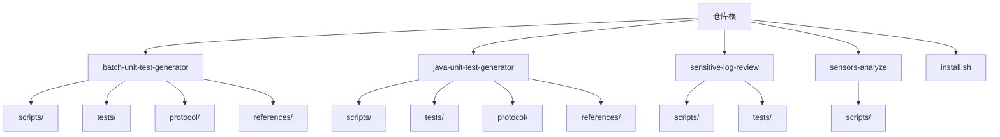
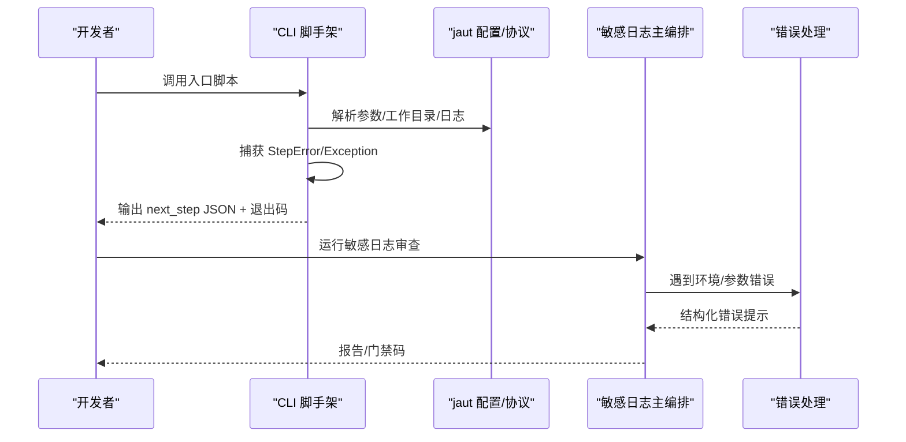
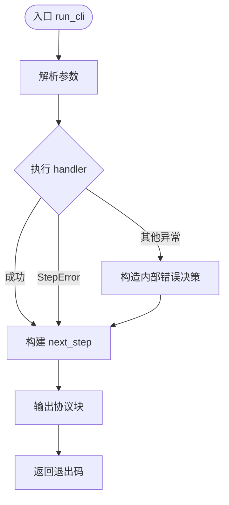
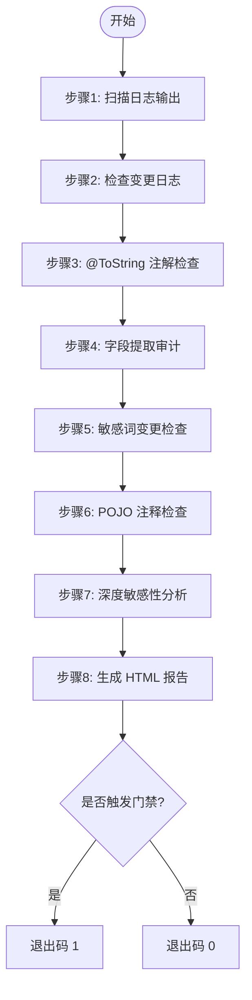
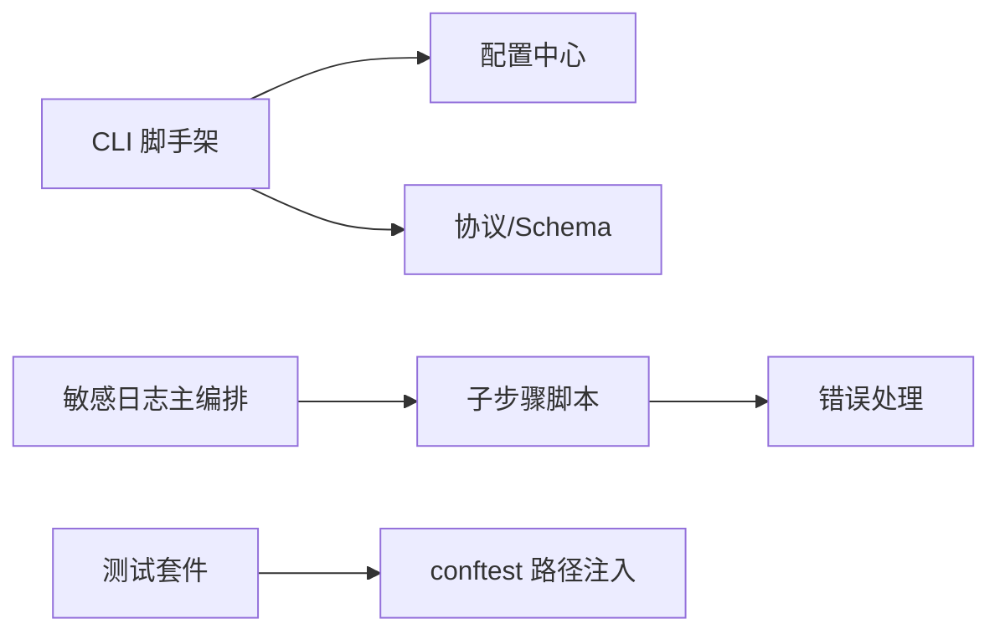

# 代码规范与质量

<cite>
**本文引用的文件**
- [README.md](file://README.md)
- [AGENTS.md](file://AGENTS.md)
- [CLAUDE.md](file://CLAUDE.md)
- [install.sh](file://install.sh)
- [batch-unit-test-generator/scripts/jaut/cli.py](file://batch-unit-test-generator/scripts/jaut/cli.py)
- [java-unit-test-generator/scripts/jaut/config.py](file://java-unit-test-generator/scripts/jaut/config.py)
- [sensitive-log-review/scripts/main.py](file://sensitive-log-review/scripts/main.py)
- [sensitive-log-review/scripts/common/errors.py](file://sensitive-log-review/scripts/common/errors.py)
- [batch-unit-test-generator/tests/conftest.py](file://batch-unit-test-generator/tests/conftest.py)
- [java-unit-test-generator/.gitignore](file://java-unit-test-generator/.gitignore)
</cite>

## 目录
1. [简介](#简介)
2. [项目结构](#项目结构)
3. [核心组件](#核心组件)
4. [架构总览](#架构总览)
5. [详细组件分析](#详细组件分析)
6. [依赖关系分析](#依赖关系分析)
7. [性能考虑](#性能考虑)
8. [故障排查指南](#故障排查指南)
9. [结论](#结论)
10. [附录](#附录)

## 简介
本文件为 ping-skills 仓库制定统一的代码规范与质量保证流程，覆盖 Python 代码风格、命名约定、导入顺序、注释规范；代码审查流程与 Pull Request 检查清单；版本控制最佳实践（分支策略、提交信息、标签管理）；代码质量检查工具配置与使用（静态分析、格式化、安全扫描）；重构与优化原则；文档编写标准与模板；依赖管理与版本兼容性要求；以及可维护性与可读性最佳实践。目标是确保团队风格一致、提升代码质量与协作效率。

## 项目结构
仓库由多个“技能”组成，每个技能自包含：SKILL.md（触发与工作流）、references/ 与 protocol/（规则与协议）、scripts/（Python 驱动脚本）、tests/（pytest 套件）。根目录提供安装脚本 install.sh，用于将技能复制到目标项目的 .claude/.qwen/.qoder/.opencode 目录下，并清理测试与缓存等非必要文件。

图表来源
- [AGENTS.md:5-14](file://AGENTS.md#L5-L14)
- [CLAUDE.md:5-14](file://CLAUDE.md#L5-L14)
- [install.sh:145-204](file://install.sh#L145-L204)

章节来源
- [AGENTS.md:5-14](file://AGENTS.md#L5-L14)
- [CLAUDE.md:5-14](file://CLAUDE.md#L5-L14)
- [install.sh:145-204](file://install.sh#L145-L204)

## 核心组件
- 统一 CLI 脚手架：收敛参数解析、日志初始化、异常到协议块的转换、决策路由与退出码输出。
- 配置中心：集中定义阈值、超时、路径模板、协议常量与枚举，避免散落字面量。
- 敏感日志审查编排：多链路并行执行子步骤，汇总结果并生成报告，按门禁规则决定 CI 通过与否。
- 错误与诊断：结构化错误码与修复建议，便于快速定位与修复环境问题。
- 测试基础设施：各技能 tests/conftest.py 将 scripts/ 加入 sys.path，保证测试可导入模块。

章节来源
- [batch-unit-test-generator/scripts/jaut/cli.py:1-129](file://batch-unit-test-generator/scripts/jaut/cli.py#L1-L129)
- [java-unit-test-generator/scripts/jaut/config.py:1-172](file://java-unit-test-generator/scripts/jaut/config.py#L1-L172)
- [sensitive-log-review/scripts/main.py:1-200](file://sensitive-log-review/scripts/main.py#L1-L200)
- [sensitive-log-review/scripts/common/errors.py:1-100](file://sensitive-log-review/scripts/common/errors.py#L1-L100)
- [batch-unit-test-generator/tests/conftest.py:1-11](file://batch-unit-test-generator/tests/conftest.py#L1-L11)

## 架构总览
整体采用“脚本驱动 + 协议通信”的架构：Python 脚本作为入口，遵循 NEXT_STEP 协议在 stdout 输出 JSON 块，以退出码表达状态（0=完成，1=继续，2=脚本错误，3=状态/协议错误）。单元测试生成类技能通过 jaut 引擎协调 Maven/Surefire/JaCoCo，敏感日志审查通过多步骤流水线产出 HTML 报告与门禁码。

图表来源
- [batch-unit-test-generator/scripts/jaut/cli.py:95-129](file://batch-unit-test-generator/scripts/jaut/cli.py#L95-L129)
- [java-unit-test-generator/scripts/jaut/config.py:34-48](file://java-unit-test-generator/scripts/jaut/config.py#L34-L48)
- [sensitive-log-review/scripts/main.py:1-200](file://sensitive-log-review/scripts/main.py#L1-L200)
- [sensitive-log-review/scripts/common/errors.py:18-100](file://sensitive-log-review/scripts/common/errors.py#L18-L100)

## 详细组件分析

### 统一 CLI 脚手架（NEXT_STEP 协议封装）
- 职责：统一 argparse 构建、--workdir/--project-root 解析、logger 初始化、异常转协议块、决策路由与 emit、返回退出码。
- 关键模式：StepError 区分可预期错误与内部异常；EmitContext 承载 next_step 所需上下文；run_cli 兜底所有异常并输出协议块。
- 复杂度：O(1) 参数解析与路由；异常处理为常数级分支。
- 优化点：日志初始化失败不影响协议输出；路由异常兜底为 ask_user，增强鲁棒性。

图表来源
- [batch-unit-test-generator/scripts/jaut/cli.py:95-129](file://batch-unit-test-generator/scripts/jaut/cli.py#L95-L129)

章节来源
- [batch-unit-test-generator/scripts/jaut/cli.py:1-129](file://batch-unit-test-generator/scripts/jaut/cli.py#L1-L129)

### 配置中心（阈值/预算/超时/协议）
- 职责：集中定义路径、协议常量、覆盖率阈值、迭代预算、Maven 超时、日志格式等。
- 关键模式：环境变量覆盖默认值（如方法轮次预算、全局轮次预算、Maven 超时），函数式暴露以便测试期动态改写。
- 复杂度：读取环境变量 O(1)，类型校验与回退逻辑 O(1)。
- 优化点：集中管理行为准绳，减少散落字面量，便于审计与变更影响评估。

章节来源
- [java-unit-test-generator/scripts/jaut/config.py:1-172](file://java-unit-test-generator/scripts/jaut/config.py#L1-L172)

### 敏感日志审查编排（多链路并行）
- 职责：编排多个子步骤（日志扫描、变更日志检查、@ToString 注解检查、字段提取审计、敏感词检查、POJO 注释检查、深度敏感性分析），最终生成 HTML 报告与门禁码。
- 关键模式：线程池并行执行链路；子脚本通过 SUMMARY 行聚合计数；统计已处理文件数用于失败率告警。
- 复杂度：并行度取决于 CPU 核数；文件扫描与子进程调用为主要开销。
- 优化点：changed-only 模式仅扫描变更集，降低 IO 与解析成本；严格退出码契约保障 CI 门禁。

图表来源
- [sensitive-log-review/scripts/main.py:1-200](file://sensitive-log-review/scripts/main.py#L1-L200)

章节来源
- [sensitive-log-review/scripts/main.py:1-200](file://sensitive-log-review/scripts/main.py#L1-L200)

### 错误与诊断（结构化错误码与建议）
- 职责：定义常见错误码与分步修复建议，统一输出到 stderr，保持既有退出码契约。
- 关键模式：ErrorCode 枚举 + 目录映射；format_error 组装标题、位置、详情与建议；print_error 输出。
- 复杂度：查找与格式化 O(1)。
- 优化点：纯文本输出，CI 友好；不改变调用方控制流，便于渐进迁移。

章节来源
- [sensitive-log-review/scripts/common/errors.py:1-100](file://sensitive-log-review/scripts/common/errors.py#L1-L100)

### 测试基础设施（conftest 与隔离）
- 职责：将 scripts/ 加入 sys.path，使测试可直接导入模块；各技能独立 conftest 保证隔离。
- 关键模式：相对路径计算与条件插入，避免重复添加。
- 复杂度：启动时 O(1)。
- 优化点：配合 .gitignore 忽略 pytest 缓存，保持仓库整洁。

章节来源
- [batch-unit-test-generator/tests/conftest.py:1-11](file://batch-unit-test-generator/tests/conftest.py#L1-L11)
- [java-unit-test-generator/.gitignore:1-3](file://java-unit-test-generator/.gitignore#L1-L3)

## 依赖关系分析
- 脚本间耦合：unit-test 技能共享 jaut 引擎但存在两份副本且已分化，修改需同时 diff 两套并运行各自测试套件。
- 外部依赖：Maven/Surefire/JaCoCo、checkstyle jar、Java 运行时；通过环境变量与配置集中管理超时与版本。
- 协议依赖：NEXT_STEP 协议与 schema 约束脚本输出与状态流转。

图表来源
- [batch-unit-test-generator/scripts/jaut/cli.py:95-129](file://batch-unit-test-generator/scripts/jaut/cli.py#L95-L129)
- [java-unit-test-generator/scripts/jaut/config.py:34-48](file://java-unit-test-generator/scripts/jaut/config.py#L34-L48)
- [sensitive-log-review/scripts/main.py:1-200](file://sensitive-log-review/scripts/main.py#L1-L200)
- [batch-unit-test-generator/tests/conftest.py:1-11](file://batch-unit-test-generator/tests/conftest.py#L1-L11)

章节来源
- [CLAUDE.md:49-51](file://CLAUDE.md#L49-L51)
- [java-unit-test-generator/scripts/jaut/config.py:101-118](file://java-unit-test-generator/scripts/jaut/config.py#L101-L118)

## 性能考虑
- 并行化：敏感日志审查使用线程池并行执行多链路，缩短端到端时间。
- 增量扫描：changed-only 模式仅处理变更集，显著降低 IO 与解析成本。
- 超时与进度：Maven 执行设置超时与进度输出，防止长时间无响应；对 git 命令设置超时避免 NFS/网络挂起。
- 资源裁剪：install.sh 在安装时移除 tests/__pycache__/.pytest_cache/test.log 等，减小目标项目体积。

章节来源
- [sensitive-log-review/scripts/main.py:1-200](file://sensitive-log-review/scripts/main.py#L1-L200)
- [java-unit-test-generator/scripts/jaut/config.py:101-118](file://java-unit-test-generator/scripts/jaut/config.py#L101-L118)
- [install.sh:176-186](file://install.sh#L176-L186)

## 故障排查指南
- 退出码含义：
  - 0：正常完成
  - 1：需要继续（如覆盖率未达标）或触发门禁
  - 2：脚本执行错误（环境缺失、命令失败、内部异常）
  - 3：状态/协议错误（state 缺失、参数缺失）
- 常见问题定位：
  - 找不到 java 命令：安装 JRE/JDK 并将 java 加入 PATH。
  - 分支名非法或不存在：核对 --branch 参数并在仓库中确认分支存在。
  - 规则 JSON 损坏：修复语法后验证。
  - 输出目录不可写：检查权限与磁盘空间，或更换输出目录。
  - checkstyle jar SHA256 不符：从可信源重新获取或同步更新基线文件。
- 调试建议：
  - 使用 verbose 模式查看子脚本输出。
  - 检查 state.json 与 coverage.json 是否存在且可解析。
  - 在本地先运行单测套件，再提交 PR。

章节来源
- [batch-unit-test-generator/scripts/jaut/cli.py:25-46](file://batch-unit-test-generator/scripts/jaut/cli.py#L25-L46)
- [java-unit-test-generator/scripts/jaut/config.py:44-48](file://java-unit-test-generator/scripts/jaut/config.py#L44-L48)
- [sensitive-log-review/scripts/common/errors.py:18-100](file://sensitive-log-review/scripts/common/errors.py#L18-L100)

## 结论
本规范基于仓库现有实现与约定，明确了 Python 代码风格、命名与导入顺序、注释规范；定义了代码审查流程与 PR 检查清单；制定了版本控制最佳实践；提供了质量检查工具的配置与使用建议；给出重构与优化原则、文档编写标准、依赖管理与兼容性要求；以及可维护性与可读性最佳实践。遵循这些规范将显著提升团队协作效率与代码质量。

## 附录

### Python 代码风格与命名约定
- 缩进：4 空格。
- 导入顺序：优先 from __future__ import annotations；标准库、第三方、本地模块分组；避免循环导入。
- 命名：函数/模块/文件使用 snake_case；类使用 PascalCase；测试文件命名为 test_<subject>.py。
- 路径：优先 pathlib，避免 os.path。
- 注释：中文为主；模块/函数/类需提供清晰 docstring；复杂逻辑附行内注释说明意图与边界。
- 参考：仓库约定与示例实现。

章节来源
- [AGENTS.md:30-35](file://AGENTS.md#L30-L35)
- [batch-unit-test-generator/scripts/jaut/cli.py:1-23](file://batch-unit-test-generator/scripts/jaut/cli.py#L1-L23)

### 代码审查流程与 Pull Request 检查清单
- 提交信息：简短祈使句，带作用域，例如 sensitive-log-review: fix log-print false positive。
- PR 描述：说明变更内容、受影响技能、运行的测试套件、链接 issue、附带 CLI 输出或截图（行为变更时）。
- 检查清单：
  - 新增/修改脚本是否通过对应技能的 pytest 套件
  - 是否符合命名与导入约定
  - 是否更新了 SKILL.md/README.md/references/ 与脚本行为一致
  - 是否维护了退出码契约与协议字段
  - 是否避免修改生产代码与 pom.xml/state.json（仅限测试文件）
- 参考：仓库约定。

章节来源
- [AGENTS.md:47-49](file://AGENTS.md#L47-L49)
- [CLAUDE.md:41-47](file://CLAUDE.md#L41-L47)

### 版本控制最佳实践
- 分支策略：功能分支命名清晰，合并前确保单测通过；涉及共享 jaut 引擎变更需同时 diff 两套并运行各自套件。
- 提交信息：祈使句、作用域明确、避免无意义提交。
- 标签管理：对重要里程碑打标签；发布前回归全量测试。
- 参考：仓库约定与工程实践。

章节来源
- [CLAUDE.md:49-51](file://CLAUDE.md#L49-L51)

### 代码质量检查工具配置与使用
- 静态分析与格式化：当前仓库未配置 linter/formatter；请遵循现有风格与 docstring 约定，必要时引入 flake8/black/isort 并纳入 CI。
- 安全扫描：建议在 CI 中加入依赖漏洞扫描（如 pip-audit）与二进制校验（checkstyle jar SHA256）。
- 测试：pytest 套件位于各技能 tests/；通过 conftest 注入 scripts/ 路径；建议增加覆盖率门槛。
- 参考：仓库约定与安装脚本行为。

章节来源
- [AGENTS.md:30-39](file://AGENTS.md#L30-L39)
- [batch-unit-test-generator/tests/conftest.py:1-11](file://batch-unit-test-generator/tests/conftest.py#L1-L11)
- [sensitive-log-review/scripts/common/errors.py:74-80](file://sensitive-log-review/scripts/common/errors.py#L74-L80)

### 重构与优化指导原则
- 单一事实源：将阈值/预算/超时/路径模板/协议常量集中在配置中心，禁止散落字面量。
- 解耦与复用：将通用逻辑下沉至 common/ 或 jaut 公共模块；避免重复实现。
- 可测试性：为关键函数编写单测；使用夹具与 mock 隔离外部依赖。
- 渐进式改进：优先修复高影响问题（稳定性、性能、安全性），再优化可读性。
- 参考：仓库约定与实现模式。

章节来源
- [java-unit-test-generator/scripts/jaut/config.py:1-172](file://java-unit-test-generator/scripts/jaut/config.py#L1-L172)
- [sensitive-log-review/scripts/main.py:1-200](file://sensitive-log-review/scripts/main.py#L1-L200)

### 文档编写标准与模板
- 文档语言：中文为主；SKILL.md/README.md/references/ 为用户契约，需与脚本行为（标志、退出码、协议字段）保持一致。
- 模板要点：
  - 名称与描述：SKILL.md frontmatter 携带 name 与 description
  - 触发与工作流：明确触发条件与步骤
  - 参数与退出码：列出 CLI 标志与退出码语义
  - 示例：提供 CLI 输出或截图
- 参考：仓库约定。

章节来源
- [CLAUDE.md:61-64](file://CLAUDE.md#L61-L64)
- [AGENTS.md:14-14](file://AGENTS.md#L14-L14)

### 依赖管理与版本兼容性
- 脚本依赖：Python 标准库；测试依赖 pytest；外部工具（Maven/Surefire/JaCoCo/checkstyle）通过配置与环境变量管理。
- 版本兼容：固定关键版本（如 JaCoCo、checkstyle jar），并通过 SHA256 校验；环境变量覆盖默认超时与预算。
- 安装与清理：install.sh 复制 skill 并清理非必要文件，确保目标项目整洁。
- 参考：仓库约定与实现。

章节来源
- [CLAUDE.md:16-34](file://CLAUDE.md#L16-L34)
- [java-unit-test-generator/scripts/jaut/config.py:101-118](file://java-unit-test-generator/scripts/jaut/config.py#L101-L118)
- [install.sh:176-186](file://install.sh#L176-L186)

### 可维护性与可读性最佳实践
- 模块化：按职责拆分脚本与模块；common/ 存放共享逻辑。
- 错误处理：统一错误码与建议，输出到 stderr，保持退出码契约。
- 日志与可观测性：结构化日志与进度输出，便于定位问题。
- 测试覆盖：针对失败路径、退出码与协议 next_step 块进行覆盖。
- 参考：仓库约定与实现。

章节来源
- [sensitive-log-review/scripts/common/errors.py:1-100](file://sensitive-log-review/scripts/common/errors.py#L1-L100)
- [AGENTS.md:37-39](file://AGENTS.md#L37-L39)