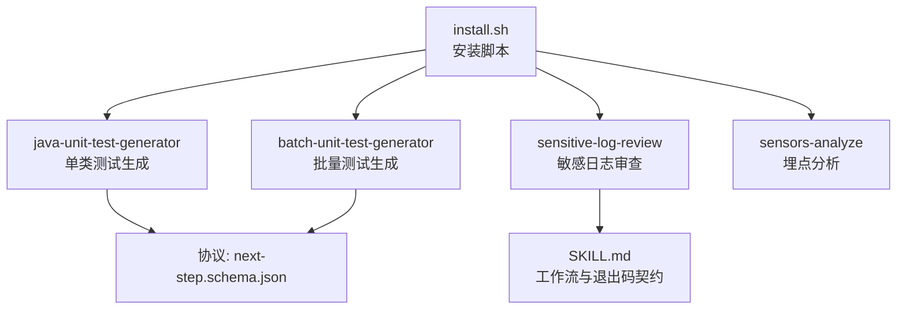
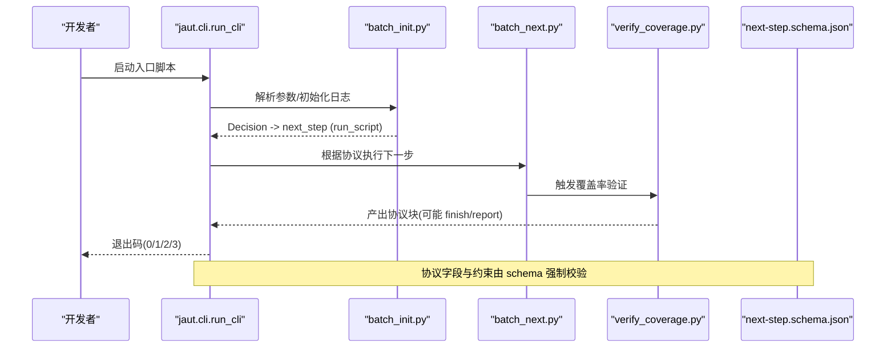
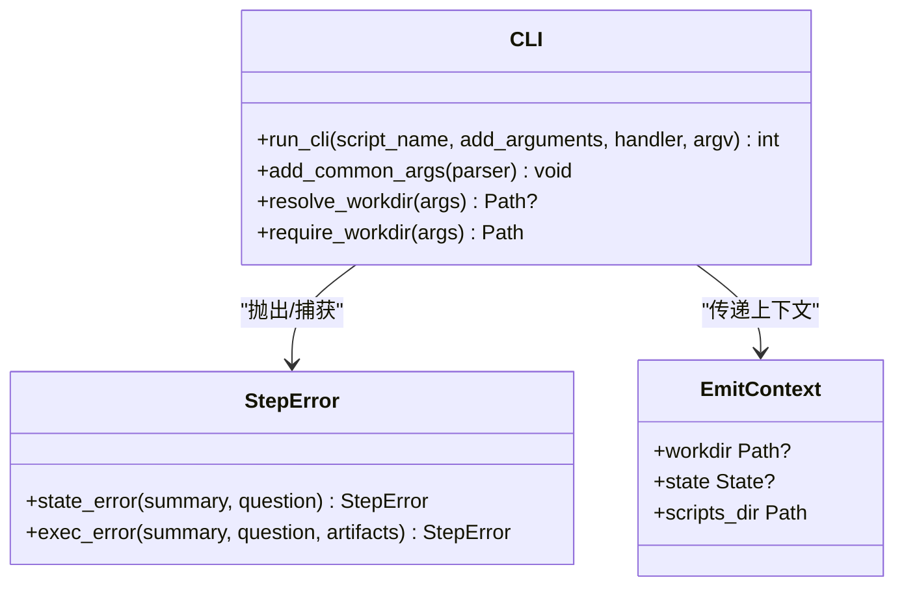
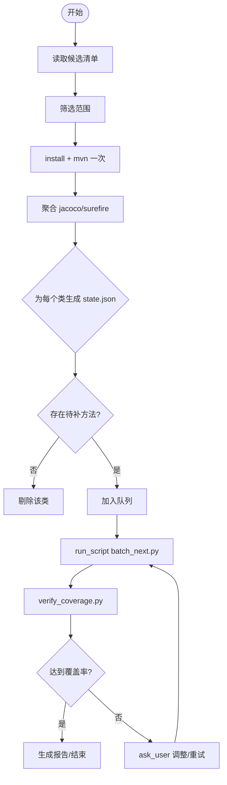
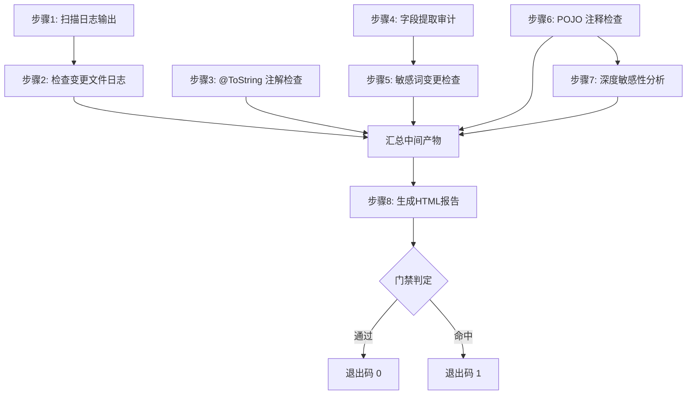
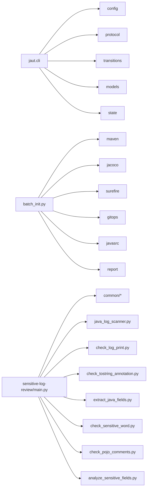

# 开发指南

<cite>
**本文引用的文件**
- [README.md](file://README.md)
- [AGENTS.md](file://AGENTS.md)
- [CLAUDE.md](file://CLAUDE.md)
- [install.sh](file://install.sh)
- [sensitive-log-review/SKILL.md](file://sensitive-log-review/SKILL.md)
- [java-unit-test-generator/protocol/next-step.schema.json](file://java-unit-test-generator/protocol/next-step.schema.json)
- [batch-unit-test-generator/protocol/next-step.schema.json](file://batch-unit-test-generator/protocol/next-step.schema.json)
- [sensitive-log-review/scripts/main.py](file://sensitive-log-review/scripts/main.py)
- [java-unit-test-generator/scripts/jaut/cli.py](file://java-unit-test-generator/scripts/jaut/cli.py)
- [batch-unit-test-generator/scripts/batch_init.py](file://batch-unit-test-generator/scripts/batch_init.py)
- [sensitive-log-review/tests/conftest.py](file://sensitive-log-review/tests/conftest.py)
- [java-unit-test-generator/tests/conftest.py](file://java-unit-test-generator/tests/conftest.py)
- [batch-unit-test-generator/scripts/jaut/logutil.py](file://batch-unit-test-generator/scripts/jaut/logutil.py)
- [java-unit-test-generator/scripts/jaut/logutil.py](file://java-unit-test-generator/scripts/jaut/logutil.py)
- [batch-unit-test-generator/scripts/batch_update.py](file://batch-unit-test-generator/scripts/batch_update.py)
- [batch-unit-test-generator/scripts/verify_coverage.py](file://batch-unit-test-generator/scripts/verify_coverage.py)
</cite>

## 目录
1. [简介](#简介)
2. [项目结构](#项目结构)
3. [核心组件](#核心组件)
4. [架构总览](#架构总览)
5. [详细组件分析](#详细组件分析)
6. [依赖关系分析](#依赖关系分析)
7. [性能考虑](#性能考虑)
8. [故障排除指南](#故障排除指南)
9. [结论](#结论)
10. [附录](#附录)

## 简介
本指南面向希望参与 ping-skills 项目的开发者，覆盖技能（skill）开发的标准流程、命名与代码风格、测试策略、调试技巧、质量保障、新技能从需求到上线的完整示例、性能分析与优化建议，以及贡献代码的流程与规范。仓库包含四个相互独立的“技能”：单元测试生成（单类/批量）、敏感日志审查、埋点分析等。每个技能自包含脚本、协议与测试，安装到目标工程后由外部工具调用。

## 项目结构
- 根级说明与命令入口
  - AGENTS.md：仓库级约定、构建/测试命令、编码风格、NEXT_STEP 协议要点、提交与 PR 规范。
  - CLAUDE.md：对 Claude Code 的补充说明，含架构、协议、各技能职责与运行方式。
  - install.sh：将技能安装到目标工程的统一脚本，支持多工具与交互式选择。
- 四大技能
  - java-unit-test-generator：为单个 Java 类生成 JUnit5+Mockito 测试，直至达到覆盖率门槛。
  - batch-unit-test-generator：基于分支差异批量处理多个类，委托子代理逐类执行。
  - sensitive-log-review：审计 Java 变更是否向日志输出敏感信息，产出 HTML 报告与 CI 门禁退出码。
  - sensors-analyze：盘点埋点调用并生成 CSV 清单，配合 LLM 与脚本完成校验。

**图表来源**
- [install.sh:1-289](file://install.sh#L1-L289)
- [java-unit-test-generator/protocol/next-step.schema.json:1-195](file://java-unit-test-generator/protocol/next-step.schema.json#L1-L195)
- [batch-unit-test-generator/protocol/next-step.schema.json:1-195](file://batch-unit-test-generator/protocol/next-step.schema.json#L1-L195)
- [sensitive-log-review/SKILL.md:1-288](file://sensitive-log-review/SKILL.md#L1-L288)

**章节来源**
- [AGENTS.md:1-50](file://AGENTS.md#L1-L50)
- [CLAUDE.md:1-65](file://CLAUDE.md#L1-L65)
- [install.sh:1-289](file://install.sh#L1-L289)

## 核心组件
- 统一 CLI 框架（jaut.cli）
  - 收敛参数解析、日志初始化、异常到协议块的转换、决策路由与协议输出。
  - 定义 StepError（可预期错误）与 EmitContext（emit 阶段上下文），统一 exit code 语义。
- NEXT_STEP 协议
  - 每个脚本在 stdout 末尾输出被标记包裹的 JSON 块，字段包括 script、status、exit_code、summary、artifacts、metrics、next_step 等。
  - next_step.type 支持 run_script/write_code/ask_user/finish；write_code 时附带 on_complete 回调。
  - 冲突优先级：Schema > references/UnitTestRules.md > SKILL.md > LLM 判断。
- 批量基线（batch_init）
  - 一次 install + 一次 mvn 聚合 jacoco/surefire，为每个候选类生成 state.json，剔除无待补方法类，排序后交由 batch_next 逐类委派。
- 敏感日志审查主流程（main.py）
  - 四链路并行编排步骤 1~8，汇总中间产物并生成 HTML 报告；遵循严格的退出码契约用于 CI 门禁。

**章节来源**
- [java-unit-test-generator/scripts/jaut/cli.py:1-129](file://java-unit-test-generator/scripts/jaut/cli.py#L1-L129)
- [java-unit-test-generator/protocol/next-step.schema.json:1-195](file://java-unit-test-generator/protocol/next-step.schema.json#L1-L195)
- [batch-unit-test-generator/scripts/batch_init.py:1-200](file://batch-unit-test-generator/scripts/batch_init.py#L1-L200)
- [sensitive-log-review/scripts/main.py:1-200](file://sensitive-log-review/scripts/main.py#L1-L200)
- [sensitive-log-review/SKILL.md:1-288](file://sensitive-log-review/SKILL.md#L1-L288)

## 架构总览
下图展示了两个测试生成技能围绕 NEXT_STEP 协议的协作关系，以及敏感日志审查的流水线编排。

**图表来源**
- [java-unit-test-generator/scripts/jaut/cli.py:1-129](file://java-unit-test-generator/scripts/jaut/cli.py#L1-L129)
- [batch-unit-test-generator/scripts/batch_init.py:1-200](file://batch-unit-test-generator/scripts/batch_init.py#L1-L200)
- [batch-unit-test-generator/scripts/verify_coverage.py:235-246](file://batch-unit-test-generator/scripts/verify_coverage.py#L235-L246)
- [java-unit-test-generator/protocol/next-step.schema.json:1-195](file://java-unit-test-generator/protocol/next-step.schema.json#L1-L195)

## 详细组件分析

### 组件A：NEXT_STEP 协议与 CLI 框架
- 协议要点
  - 必须字段：protocol_version、script、status、exit_code、summary、artifacts、next_step。
  - next_step.type 枚举：run_script/write_code/ask_user/finish；不同 type 要求不同必填字段。
  - write_code 时必须提供 on_complete（script+params），保存测试文件后需按协议执行。
- CLI 框架
  - 统一入口 run_cli：参数解析、StepError 捕获、路由构建、协议输出与退出码返回。
  - 日志隔离：通过 setup_logger 将日志写入 workdir/logs，避免污染 stdout。

**图表来源**
- [java-unit-test-generator/scripts/jaut/cli.py:1-129](file://java-unit-test-generator/scripts/jaut/cli.py#L1-L129)
- [java-unit-test-generator/scripts/jaut/logutil.py:1-75](file://java-unit-test-generator/scripts/jaut/logutil.py#L1-L75)

**章节来源**
- [java-unit-test-generator/scripts/jaut/cli.py:1-129](file://java-unit-test-generator/scripts/jaut/cli.py#L1-L129)
- [java-unit-test-generator/scripts/jaut/logutil.py:1-75](file://java-unit-test-generator/scripts/jaut/logutil.py#L1-L75)
- [java-unit-test-generator/protocol/next-step.schema.json:1-195](file://java-unit-test-generator/protocol/next-step.schema.json#L1-L195)

### 组件B：批量测试生成（batch_init → batch_next → verify_coverage）
- 基线阶段（batch_init）
  - 读取候选清单，记录 git 基线，一次性 install/mvn，聚合 jacoco/surefire，为每个类生成 state.json，剔除无待补方法类，输出首个认领任务给 batch_next。
- 迭代阶段（batch_next/verify_coverage）
  - 逐类驱动 LLM 写测试，完成后执行 on_complete 进行规则校验与覆盖率验证，记录 round_rates 与测试结果，必要时 ask_user 调整阈值或继续。

**图表来源**
- [batch-unit-test-generator/scripts/batch_init.py:1-200](file://batch-unit-test-generator/scripts/batch_init.py#L1-L200)
- [batch-unit-test-generator/scripts/verify_coverage.py:235-246](file://batch-unit-test-generator/scripts/verify_coverage.py#L235-L246)
- [batch-unit-test-generator/scripts/batch_update.py:251-263](file://batch-unit-test-generator/scripts/batch_update.py#L251-L263)

**章节来源**
- [batch-unit-test-generator/scripts/batch_init.py:1-200](file://batch-unit-test-generator/scripts/batch_init.py#L1-L200)
- [batch-unit-test-generator/scripts/verify_coverage.py:235-246](file://batch-unit-test-generator/scripts/verify_coverage.py#L235-L246)
- [batch-unit-test-generator/scripts/batch_update.py:251-263](file://batch-unit-test-generator/scripts/batch_update.py#L251-L263)

### 组件C：敏感日志审查流水线（main.py）
- 四链路并行编排
  - 链路A：步骤1 扫描日志输出 → 步骤2 变更日志检查
  - 链路B：步骤3 @ToString 注解检查
  - 链路C：步骤4 字段提取审计 → 步骤5 敏感词变更检查
  - 链路D：步骤6 POJO 注释检查 → 步骤7 深度敏感性分析（规则初筛 + LLM 语义复核）
  - 汇合：步骤8 生成 HTML 报告
- 退出码契约
  - 0=通过，1=触发门禁（默认 violation,sensitive），2=执行错误；CI 可直接依赖。

**图表来源**
- [sensitive-log-review/scripts/main.py:1-200](file://sensitive-log-review/scripts/main.py#L1-L200)
- [sensitive-log-review/SKILL.md:1-288](file://sensitive-log-review/SKILL.md#L1-L288)

**章节来源**
- [sensitive-log-review/scripts/main.py:1-200](file://sensitive-log-review/scripts/main.py#L1-L200)
- [sensitive-log-review/SKILL.md:1-288](file://sensitive-log-review/SKILL.md#L1-L288)

### 组件D：日志与测试配置
- 日志工具（logutil）
  - 仅写文件日志到 <workdir>/logs/<script>.log，禁止控制台输出，确保 stdout 仅承载协议块。
- pytest 配置（conftest）
  - 将 scripts 目录加入 sys.path，使 common 包与入口脚本可导入。

**章节来源**
- [batch-unit-test-generator/scripts/jaut/logutil.py:1-75](file://batch-unit-test-generator/scripts/jaut/logutil.py#L1-L75)
- [java-unit-test-generator/scripts/jaut/logutil.py:1-75](file://java-unit-test-generator/scripts/jaut/logutil.py#L1-L75)
- [sensitive-log-review/tests/conftest.py:1-9](file://sensitive-log-review/tests/conftest.py#L1-L9)
- [java-unit-test-generator/tests/conftest.py:1-11](file://java-unit-test-generator/tests/conftest.py#L1-L11)

## 依赖关系分析
- 模块内耦合
  - jaut.cli 依赖 config、protocol、transitions、models、state；统一封装入口逻辑。
  - batch_init 依赖 maven、jacoco、surefire、gitops、javasrc、report 等子模块。
  - main.py 依赖 common.*（dictionary、errors、paths、pojo_config、git_utils）与各子脚本。
- 跨模块/外部依赖
  - 测试生成技能共享 jaut 引擎但已分叉维护，修改时需同时 diff 两套并运行各自套件。
  - 敏感日志审查依赖 Java Runtime（Checkstyle jar）、Python 3.10+、Git。

**图表来源**
- [java-unit-test-generator/scripts/jaut/cli.py:1-129](file://java-unit-test-generator/scripts/jaut/cli.py#L1-L129)
- [batch-unit-test-generator/scripts/batch_init.py:1-200](file://batch-unit-test-generator/scripts/batch_init.py#L1-L200)
- [sensitive-log-review/scripts/main.py:1-200](file://sensitive-log-review/scripts/main.py#L1-L200)

**章节来源**
- [java-unit-test-generator/scripts/jaut/cli.py:1-129](file://java-unit-test-generator/scripts/jaut/cli.py#L1-L129)
- [batch-unit-test-generator/scripts/batch_init.py:1-200](file://batch-unit-test-generator/scripts/batch_init.py#L1-L200)
- [sensitive-log-review/scripts/main.py:1-200](file://sensitive-log-review/scripts/main.py#L1-L200)

## 性能考虑
- 批量测试生成
  - 一次 install + 一次 mvn 聚合，减少重复构建开销；按需收集测试类列表，避免全量编译。
  - 使用 round_rates 轨迹与接近门槛判断，避免无效迭代；连续无提升时自动提示升级或终止。
- 敏感日志审查
  - 四链路并行执行，目标全流程 <60s；失败文件统计与严格模式控制 CI 行为。
  - 词典分层与规则初筛保证快速确定性判定，LLM 语义复核作为补充不阻塞门禁。
- 日志与 I/O
  - 文件日志隔离，stdout 仅承载协议；避免控制台输出干扰自动化解析。

[本节为通用性能讨论，无需特定文件引用]

## 故障排除指南
- 退出码与错误分类
  - 测试生成技能：0=完成，1=继续，2=脚本错误，3=状态/协议错误；StepError 区分可预期错误与内部异常。
  - 敏感日志审查：0=通过，1=门禁拦截，2=执行错误；--doctor 仅环境诊断。
- 常见问题定位
  - 缺少 --workdir/--project-root：CLI 会抛出状态错误并引导补充参数。
  - mvn 未找到或安装失败：查看 install.log/mvn.log 并确认 PATH 与多模块配置。
  - 覆盖率数据缺失：检查 jacoco.xml 聚合结果与排除模式；必要时调整 coverage-exclude。
  - 词典误报/漏报：维护四层词典（whitelist/blacklist/core/extended），更新版本头并回归测试。
- 调试技巧
  - 启用 verbose 输出查看子命令与摘要；查看 <workdir>/logs/*.log 获取详细日志。
  - 使用 --strict-mode 将解析失败计入门禁；CI 场景用 --run-id 隔离并行产物。

**章节来源**
- [java-unit-test-generator/scripts/jaut/cli.py:1-129](file://java-unit-test-generator/scripts/jaut/cli.py#L1-L129)
- [batch-unit-test-generator/scripts/jaut/logutil.py:1-75](file://batch-unit-test-generator/scripts/jaut/logutil.py#L1-L75)
- [sensitive-log-review/SKILL.md:1-288](file://sensitive-log-review/SKILL.md#L1-L288)

## 结论
本指南梳理了 ping-skills 的核心架构与开发流程，明确了协议、脚本编排、测试与调试方法。遵循统一的 CLI 框架与 NEXT_STEP 协议，可高效扩展新技能；借助并行流水线与严格退出码契约，可在 CI 中稳定落地质量门禁。建议在新增功能时同步更新 SKILL.md、协议与测试，保持文档与实现一致。

## 附录
- 安装与运行
  - 安装技能：./install.sh <claude|qwen|qoder|opencode|all> [skill,...] [project-dir]
  - 运行测试：cd <skill> && python3 -m pytest tests/
- 编码风格与命名
  - 4空格缩进；优先 from __future__ import annotations 与 pathlib；函数/模块 snake_case，类 PascalCase；测试文件 test_<subject>.py。
- 贡献流程
  - 提交信息采用简短祈使句；PR 描述变更、影响技能、运行套件情况、链接 issue，附 CLI 输出或截图；保持 README/SKILL.md 与脚本行为一致。

**章节来源**
- [AGENTS.md:1-50](file://AGENTS.md#L1-L50)
- [CLAUDE.md:1-65](file://CLAUDE.md#L1-L65)
- [install.sh:1-289](file://install.sh#L1-L289)