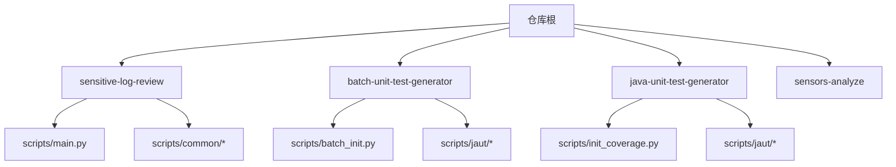
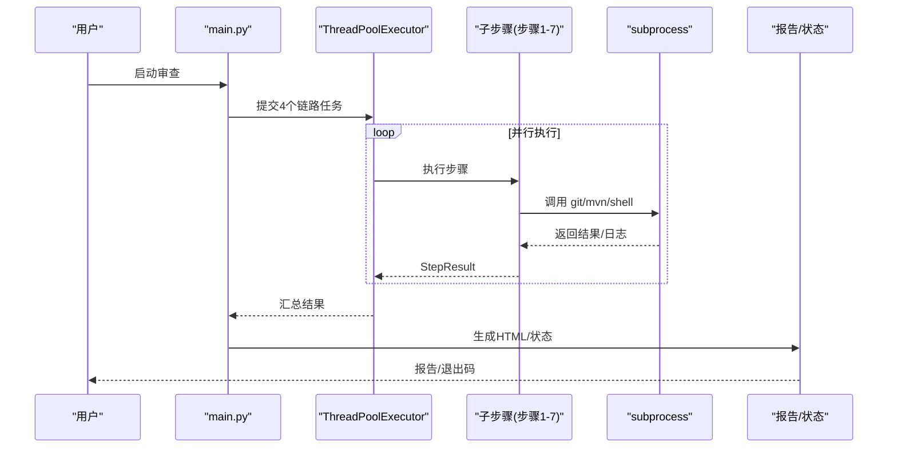
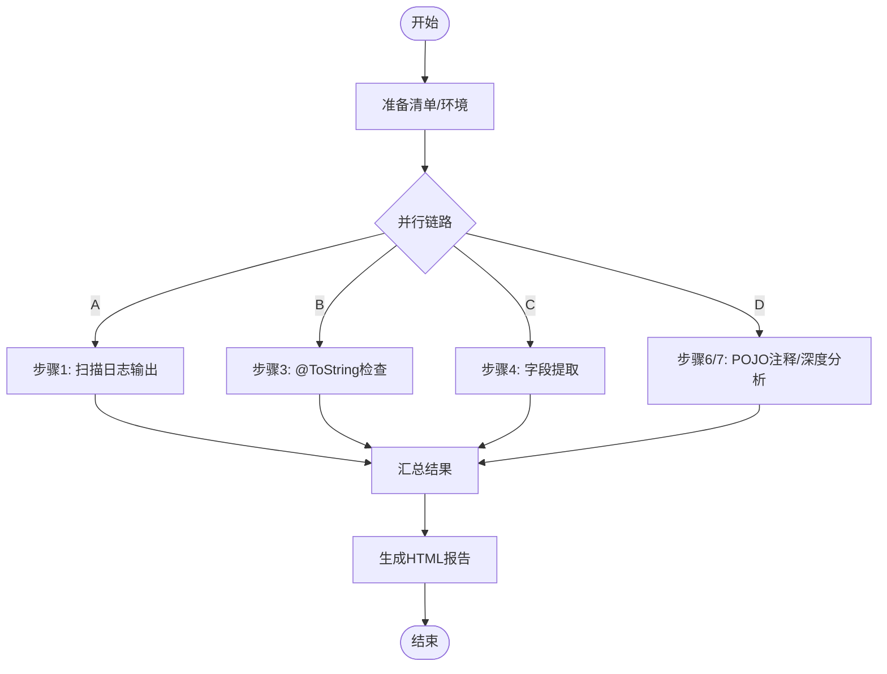
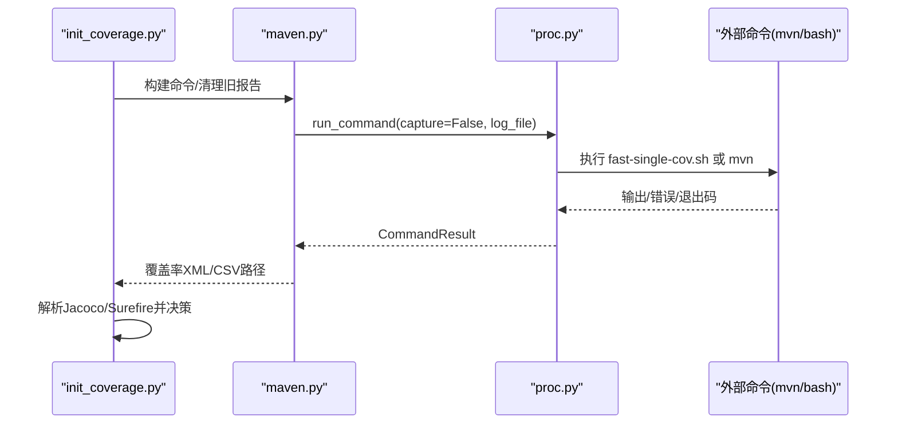
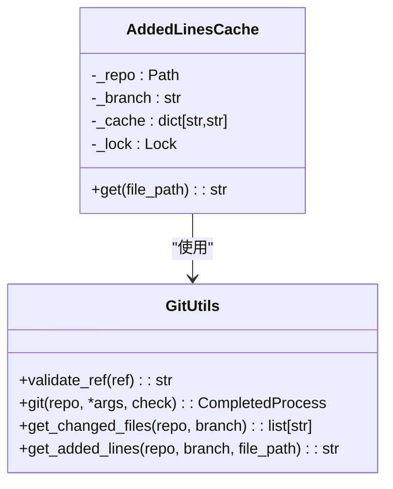
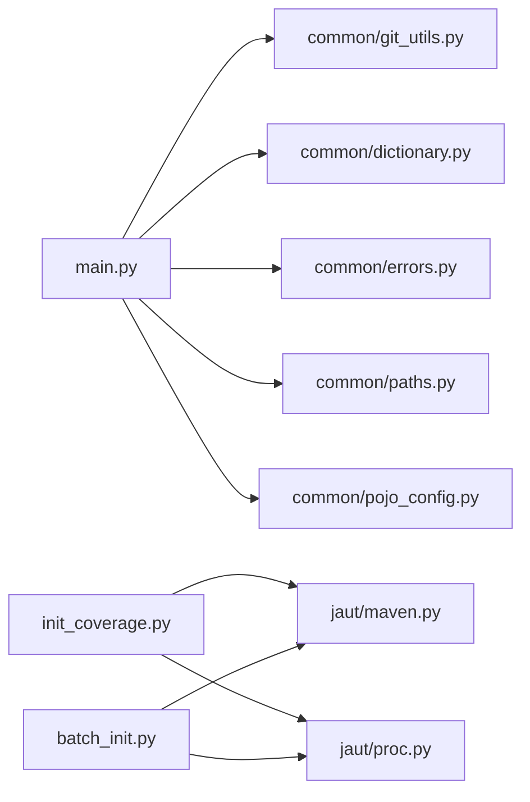

# 性能分析与优化

<cite>
**本文引用的文件**
- [README.md](file://README.md)
- [AGENTS.md](file://AGENTS.md)
- [sensitive-log-review/scripts/main.py](file://sensitive-log-review/scripts/main.py)
- [sensitive-log-review/scripts/common/git_utils.py](file://sensitive-log-review/scripts/common/git_utils.py)
- [batch-unit-test-generator/scripts/batch_init.py](file://batch-unit-test-generator/scripts/batch_init.py)
- [java-unit-test-generator/scripts/init_coverage.py](file://java-unit-test-generator/scripts/init_coverage.py)
- [batch-unit-test-generator/scripts/jaut/maven.py](file://batch-unit-test-generator/scripts/jaut/maven.py)
- [batch-unit-test-generator/scripts/jaut/proc.py](file://batch-unit-test-generator/scripts/jaut/proc.py)
- [java-unit-test-generator/tests/test_proc.py](file://java-unit-test-generator/tests/test_proc.py)
</cite>

## 目录
1. [简介](#简介)
2. [项目结构](#项目结构)
3. [核心组件](#核心组件)
4. [架构总览](#架构总览)
5. [详细组件分析](#详细组件分析)
6. [依赖关系分析](#依赖关系分析)
7. [性能考量与优化建议](#性能考量与优化建议)
8. [故障排查指南](#故障排查指南)
9. [结论](#结论)
10. [附录](#附录)

## 简介
本指南面向 ping-skills 仓库中的 Python 脚本，聚焦性能分析与优化。仓库由多个独立“技能”组成，每个技能包含 Python 驱动脚本、测试与规则配置。典型场景包括：
- 敏感信息日志审查（多步骤流水线并行执行）
- Java 单元测试覆盖率基线建立与批量补测（Maven/JaCoCo/Surefire 集成）
- 大量子进程调用（git、mvn、shell 脚本）与 I/O 密集型报告生成

目标是在高负载下保持良好性能与响应速度，并提供可操作的诊断方法与优化策略。

## 项目结构
仓库根目录包含多个技能目录，每个技能自包含：
- scripts：Python 驱动脚本与工具模块
- tests：pytest 测试套件
- references/protocol/rules：规则与协议定义
- SKILL.md：技能触发与工作流说明

**图表来源**
- [AGENTS.md:5-14](file://AGENTS.md#L5-L14)

**章节来源**
- [AGENTS.md:5-14](file://AGENTS.md#L5-L14)

## 核心组件
- 敏感信息日志审查主流程：四链路并行编排，子脚本通过 subprocess 执行，产出 HTML 报告
- Maven/JaCoCo/Surefire 集成：构建命令构建、清理旧报告、单类覆盖率快速采集与降级方案
- 进程与命令执行封装：统一捕获输出、超时控制、流式日志写入、跨平台进程组管理
- Git 工具封装：安全分支名校验、变更文件获取、新增行缓存避免重复 fork

这些组件共同构成 I/O 密集与外部命令调用的核心路径，是性能优化的重点。

**章节来源**
- [sensitive-log-review/scripts/main.py:187-297](file://sensitive-log-review/scripts/main.py#L187-L297)
- [batch-unit-test-generator/scripts/jaut/maven.py:248-323](file://batch-unit-test-generator/scripts/jaut/maven.py#L248-L323)
- [batch-unit-test-generator/scripts/jaut/proc.py:172-201](file://batch-unit-test-generator/scripts/jaut/proc.py#L172-L201)
- [sensitive-log-review/scripts/common/git_utils.py:36-109](file://sensitive-log-review/scripts/common/git_utils.py#L36-L109)

## 架构总览
整体执行流程如下：
- 主脚本解析参数与环境，准备清单与产物目录
- 按链路分组并行执行子步骤（线程池）
- 子步骤通过 subprocess 调用外部命令（git、mvn、shell）
- 聚合结果并生成 HTML 报告或状态文件

**图表来源**
- [sensitive-log-review/scripts/main.py:777-786](file://sensitive-log-review/scripts/main.py#L777-L786)
- [sensitive-log-review/scripts/main.py:353-505](file://sensitive-log-review/scripts/main.py#L353-L505)

**章节来源**
- [sensitive-log-review/scripts/main.py:732-800](file://sensitive-log-review/scripts/main.py#L732-L800)

## 详细组件分析

### 并发与并行：线程池与子进程
- 使用 ThreadPoolExecutor 将四个链路并行化，提升端到端耗时
- 子步骤内部通过 subprocess.run 或 Popen 调用外部命令，支持超时与流式日志
- Windows/POSIX 下设置进程组标志，便于信号传播与进程树管理

**图表来源**
- [sensitive-log-review/scripts/main.py:276-297](file://sensitive-log-review/scripts/main.py#L276-L297)
- [sensitive-log-review/scripts/main.py:353-505](file://sensitive-log-review/scripts/main.py#L353-L505)

**章节来源**
- [sensitive-log-review/scripts/main.py:777-786](file://sensitive-log-review/scripts/main.py#L777-L786)
- [batch-unit-test-generator/scripts/jaut/proc.py:191-201](file://batch-unit-test-generator/scripts/jaut/proc.py#L191-L201)

### Maven/JaCoCo 集成与命令执行
- 构建 mvn test + jacoco:report 或 fast-single-cov.sh 命令，优先快速路径
- 每次执行前清理 target/site/jacoco 与 surefire-reports，避免陈旧数据影响
- 失败时自动降级到 mvn test jacoco:report，并备份快速路径日志以便排查
- 多模块场景使用 -pl/-am 精准指定模块，减少无关编译

**图表来源**
- [java-unit-test-generator/scripts/init_coverage.py:212-245](file://java-unit-test-generator/scripts/init_coverage.py#L212-L245)
- [batch-unit-test-generator/scripts/jaut/maven.py:326-375](file://batch-unit-test-generator/scripts/jaut/maven.py#L326-L375)
- [batch-unit-test-generator/scripts/jaut/proc.py:172-188](file://batch-unit-test-generator/scripts/jaut/proc.py#L172-L188)

**章节来源**
- [batch-unit-test-generator/scripts/jaut/maven.py:601-640](file://batch-unit-test-generator/scripts/jaut/maven.py#L601-L640)
- [java-unit-test-generator/scripts/init_coverage.py:292-341](file://java-unit-test-generator/scripts/init_coverage.py#L292-L341)

### Git 工具封装与缓存
- 统一通过 git -C <repo> 执行，防止选项注入
- 分支名正则校验，拒绝以“-”开头及包含“..”的引用
- 新增行内容按文件缓存，避免重复 fork git 进程，提升批量处理效率

**图表来源**
- [sensitive-log-review/scripts/common/git_utils.py:26-109](file://sensitive-log-review/scripts/common/git_utils.py#L26-L109)

**章节来源**
- [sensitive-log-review/scripts/common/git_utils.py:57-109](file://sensitive-log-review/scripts/common/git_utils.py#L57-L109)

### 批量基线与终验
- 批量基线阶段一次 install + 一次全量 mvn，为所有候选类生成 state.json 与 batch_state.json
- 单类基线/终验模式：记录 git 基线、清理旧报告、fast-single-cov.sh 采集覆盖率、解析 Jacoco/Surefire 并决策
- 终验模式保留既有进度与轨迹计数，连续不绿且无待修复方法时提示人工介入

**章节来源**
- [batch-unit-test-generator/scripts/batch_init.py:62-167](file://batch-unit-test-generator/scripts/batch_init.py#L62-L167)
- [java-unit-test-generator/scripts/init_coverage.py:122-167](file://java-unit-test-generator/scripts/init_coverage.py#L122-L167)
- [java-unit-test-generator/scripts/init_coverage.py:259-341](file://java-unit-test-generator/scripts/init_coverage.py#L259-L341)

## 依赖关系分析
- main.py 依赖 common 模块（字典、错误、Git、路径、POJO配置）
- maven.py 依赖 proc.py 进行命令执行，依赖 config/logutil/models
- init_coverage.py 依赖 jaut 包（config/decisions/gitops/jacoco/javasrc/maven/report/surefire/state）
- 测试覆盖进程执行行为（Windows/POSIX 进程组标志、超时与捕获）

**图表来源**
- [sensitive-log-review/scripts/main.py:41-70](file://sensitive-log-review/scripts/main.py#L41-L70)
- [java-unit-test-generator/scripts/init_coverage.py:46-50](file://java-unit-test-generator/scripts/init_coverage.py#L46-L50)
- [batch-unit-test-generator/scripts/batch_init.py:38-45](file://batch-unit-test-generator/scripts/batch_init.py#L38-L45)

**章节来源**
- [sensitive-log-review/scripts/main.py:41-70](file://sensitive-log-review/scripts/main.py#L41-L70)
- [java-unit-test-generator/scripts/init_coverage.py:46-50](file://java-unit-test-generator/scripts/init_coverage.py#L46-L50)
- [batch-unit-test-generator/scripts/batch_init.py:38-45](file://batch-unit-test-generator/scripts/batch_init.py#L38-L45)

## 性能考量与优化建议

### CPU 密集型任务识别与优化
- 热点定位：使用 cProfile 对主入口函数或关键步骤（如 HTML 渲染、覆盖率解析、方法表构建）进行剖析，识别高耗时函数
- 字符串拼接与转义：HTML 报告中大量 escape 与字符串拼接，考虑分块渲染与缓冲，减少中间对象创建
- 正则匹配：在日志扫描与编译错误解析中使用高效正则，避免回溯灾难；必要时预编译正则表达式

### I/O 密集型操作优化
- 子进程调用：统一通过 proc.run_command 执行，启用超时与流式日志，避免阻塞与内存膨胀
- 文件读取：批量读取大文件时使用迭代器逐行处理，避免一次性加载；对频繁访问的文件使用缓存（如 AddedLinesCache）
- 清理旧报告：在执行前清理 target/site/jacoco 与 surefire-reports，避免误读历史数据导致逻辑判断偏差

### 并发与并行
- 线程池：四链路并行执行，合理设置 max_workers（当前为 4），根据 CPU/IO 特性调整
- 进程组管理：Windows 使用 CREATE_NEW_PROCESS_GROUP，POSIX 使用 start_new_session，确保信号正确传播
- 异步编程：当前实现以多线程为主，若后续引入网络请求或长耗时 I/O，可评估 asyncio 与 aiohttp/asyncpg 等库

### 内存管理与垃圾回收
- 大对象生命周期：HTML 报告生成过程中临时字符串较大，及时释放引用；避免全局变量累积状态
- 日志与产物：流式写日志，限制单次写入大小；定期清理临时文件与进度文件
- 缓存策略：AddedLinesCache 使用线程锁保护，避免竞争；谨慎设置缓存上限与失效策略

### 文件操作与网络请求优化
- 文件操作：使用 pathlib 替代 os.path；批量遍历目录时过滤无关目录（如 PRUNE_DIRS）
- 网络请求：当前仓库未直接发起网络请求；若未来需要，建议使用连接池与超时控制，避免阻塞

### 数据库查询与缓存策略
- 当前仓库未直接使用数据库；若引入 SQLite/PostgreSQL 等，应使用连接池、事务批处理与索引优化
- 缓存策略：对昂贵查询结果进行缓存（内存/磁盘），结合版本号或时间戳失效

### 日志记录的性能影响
- 日志级别：生产环境降低日志级别，仅记录必要信息；调试时开启详细日志
- 日志写入：流式写入，避免同步阻塞；对高频日志进行采样或合并
- 结构化日志：便于检索与分析，但注意序列化开销

### 基准测试与监控指标
- 基准测试：对关键路径（覆盖率采集、HTML 渲染、方法表构建）编写 pytest-benchmark 用例，跟踪回归
- 监控指标：记录每步耗时、子进程超时次数、错误率、报告大小；CI 中收集并告警

### 常见性能问题诊断与解决方案
- 子进程超时：检查 mvn 构建是否卡住，增加超时阈值或优化依赖安装
- 报告陈旧：确保执行前清理 target 目录，避免误判
- 分支名注入风险：使用 validate_ref 校验，防止恶意参数
- 缓存失效：AddedLinesCache 键规范化，避免相对/绝对路径差异导致缓存命中失败

**章节来源**
- [batch-unit-test-generator/scripts/jaut/proc.py:172-201](file://batch-unit-test-generator/scripts/jaut/proc.py#L172-L201)
- [java-unit-test-generator/tests/test_proc.py:78-110](file://java-unit-test-generator/tests/test_proc.py#L78-L110)
- [sensitive-log-review/scripts/common/git_utils.py:26-33](file://sensitive-log-review/scripts/common/git_utils.py#L26-L33)
- [batch-unit-test-generator/scripts/jaut/maven.py:601-640](file://batch-unit-test-generator/scripts/jaut/maven.py#L601-L640)

## 故障排查指南
- 子进程执行失败：查看 mvn.log 与 fast-single-cov.sh 日志备份，确认是否为编译/测试失败或工具缺失
- 覆盖率报告缺失：检查 target/site/jacoco 是否存在 XML/CSV，确认 JaCoCo 插件配置与版本
- 分支/引用非法：使用 validate_ref 校验，修正传入参数
- 输出目录不可写：检查权限与路径合法性，必要时切换运行用户或目录

**章节来源**
- [batch-unit-test-generator/scripts/jaut/maven.py:464-533](file://batch-unit-test-generator/scripts/jaut/maven.py#L464-L533)
- [sensitive-log-review/scripts/main.py:582-702](file://sensitive-log-review/scripts/main.py#L582-L702)

## 结论
ping-skills 的 Python 脚本以 I/O 与外部命令调用为主，性能瓶颈集中在子进程执行、文件读写与报告生成。通过合理的并发设计、缓存策略、命令执行封装与清理机制，可在高负载下保持稳定性能。建议结合 cProfile、pytest-benchmark 与结构化日志持续优化，并在 CI 中纳入性能回归检测。

## 附录
- 工具推荐：cProfile（CPU 剖析）、line_profiler（行级剖析）、memory_profiler（内存剖析）
- 并发模型：多线程（适合 I/O 密集）、多进程（适合 CPU 密集）、异步（适合网络/长耗时 I/O）
- 最佳实践：最小化全局状态、避免阻塞 I/O、合理使用缓存与连接池、严格超时与错误处理