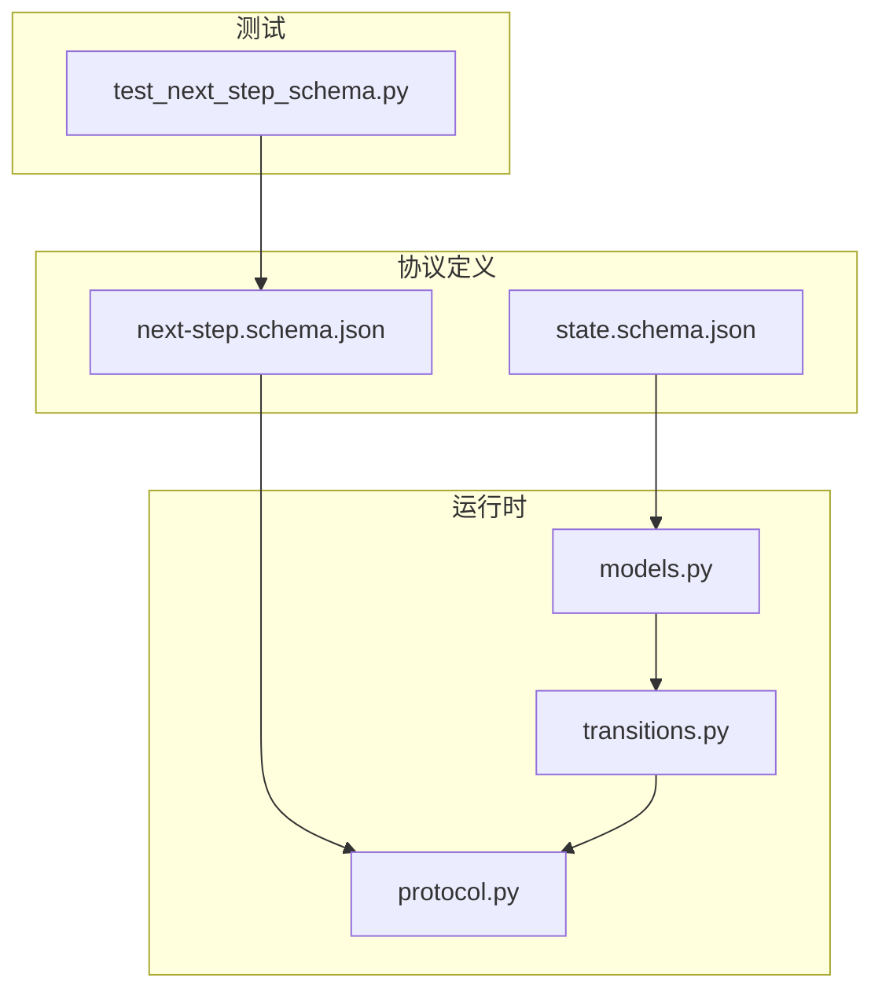
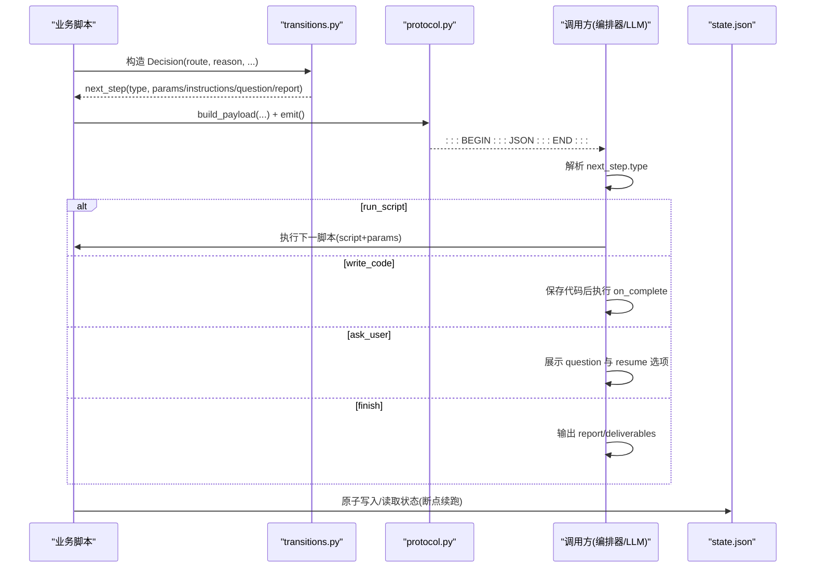
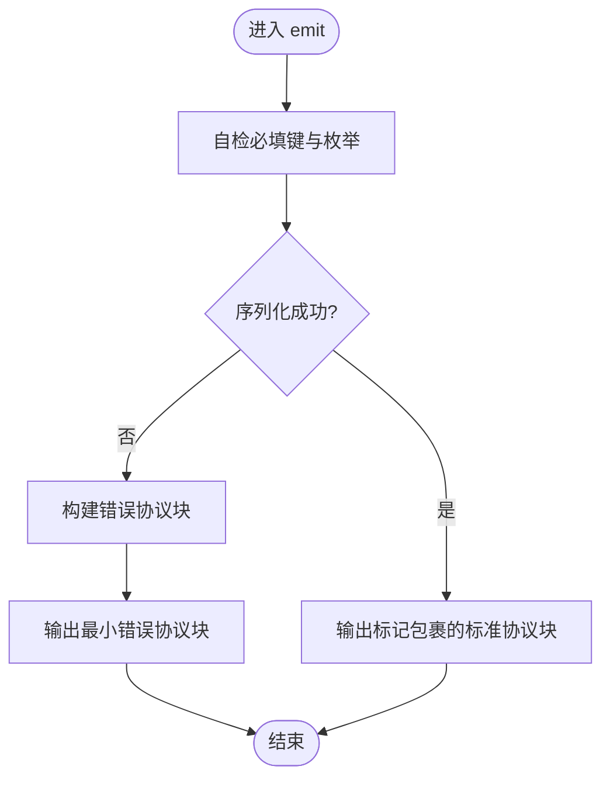
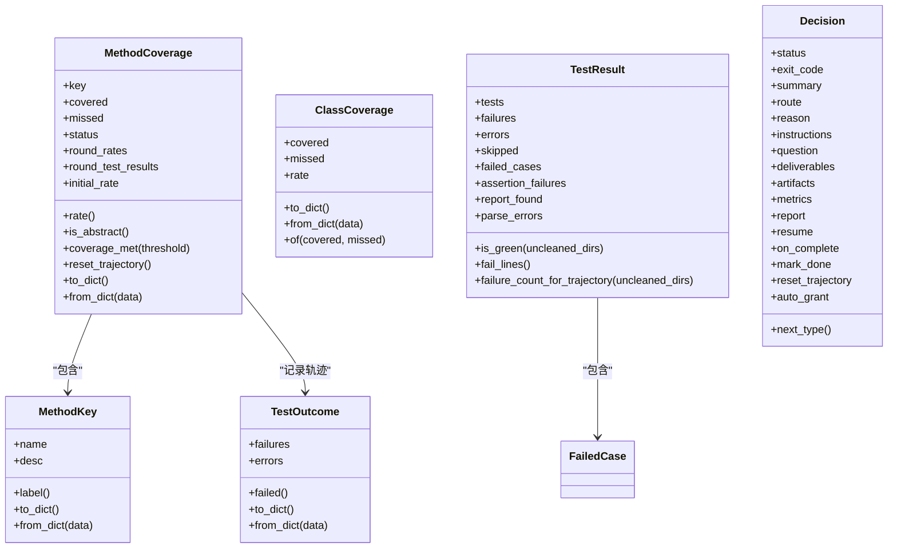
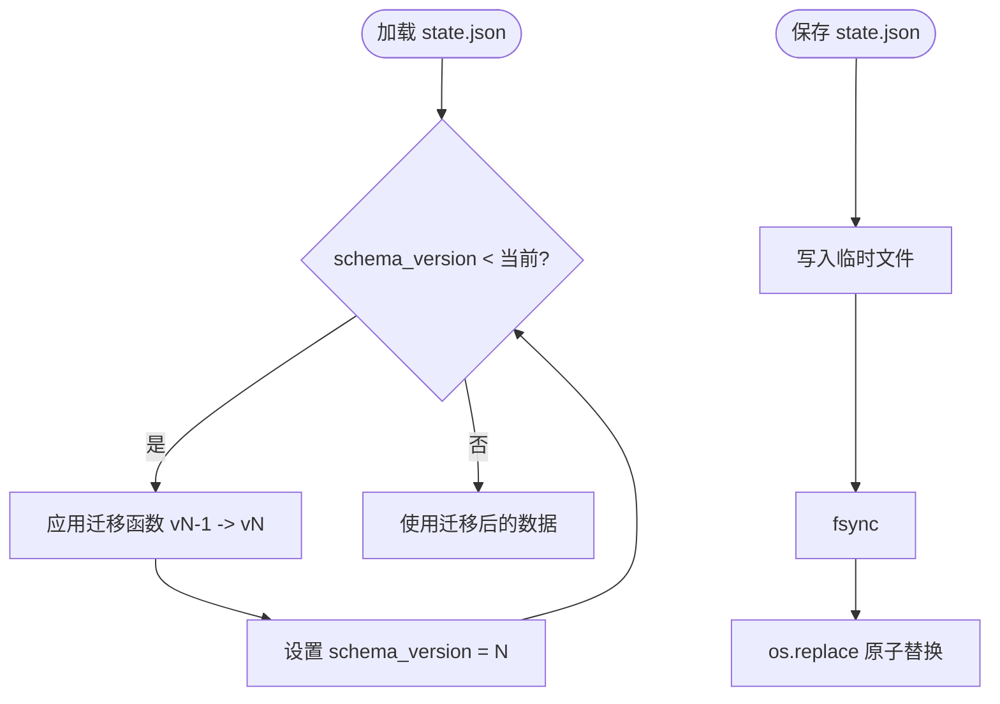
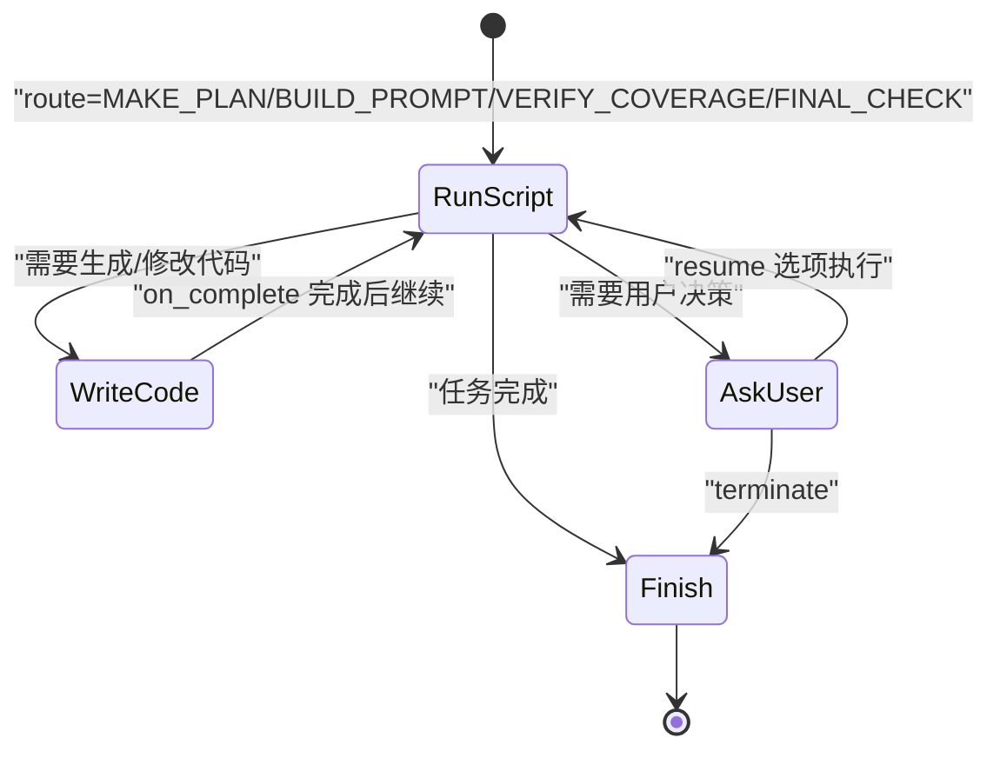
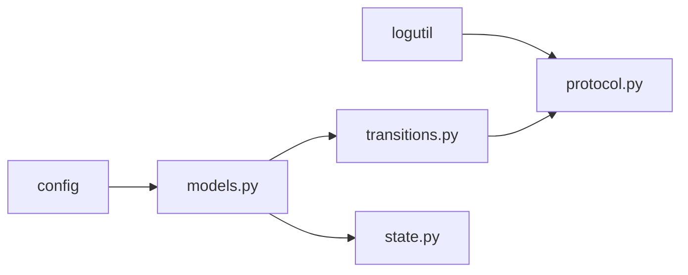

# NEXT_STEP 协议实现

<cite>
**本文引用的文件**
- [batch-unit-test-generator/protocol/next-step.schema.json](file://batch-unit-test-generator/protocol/next-step.schema.json)
- [batch-unit-test-generator/protocol/state.schema.json](file://batch-unit-test-generator/protocol/state.schema.json)
- [java-unit-test-generator/protocol/next-step.schema.json](file://java-unit-test-generator/protocol/next-step.schema.json)
- [java-unit-test-generator/protocol/state.schema.json](file://java-unit-test-generator/protocol/state.schema.json)
- [batch-unit-test-generator/scripts/jaut/protocol.py](file://batch-unit-test-generator/scripts/jaut/protocol.py)
- [java-unit-test-generator/scripts/jaut/protocol.py](file://java-unit-test-generator/scripts/jaut/protocol.py)
- [batch-unit-test-generator/scripts/jaut/transitions.py](file://batch-unit-test-generator/scripts/jaut/transitions.py)
- [java-unit-test-generator/scripts/jaut/transitions.py](file://java-unit-test-generator/scripts/jaut/transitions.py)
- [batch-unit-test-generator/scripts/jaut/models.py](file://batch-unit-test-generator/scripts/jaut/models.py)
- [java-unit-test-generator/scripts/jaut/models.py](file://java-unit-test-generator/scripts/jaut/models.py)
- [batch-unit-test-generator/tests/test_next_step_schema.py](file://batch-unit-test-generator/tests/test_next_step_schema.py)
- [java-unit-test-generator/tests/test_next_step_schema.py](file://java-unit-test-generator/tests/test_next_step_schema.py)
</cite>

## 目录
1. [简介](#简介)
2. [项目结构](#项目结构)
3. [核心组件](#核心组件)
4. [架构总览](#架构总览)
5. [详细组件分析](#详细组件分析)
6. [依赖关系分析](#依赖关系分析)
7. [性能考虑](#性能考虑)
8. [故障排查指南](#故障排查指南)
9. [结论](#结论)
10. [附录：使用示例与最佳实践](#附录使用示例与最佳实践)

## 简介
本文件为 ping-skills 项目中 NEXT_STEP 协议的完整实现文档，覆盖 batch-unit-test-generator 与 java-unit-test-generator 两套技能。NEXT_STEP 是脚本与调用方（LLM/编排器）之间的唯一契约：每个脚本在 stdout 末尾输出被标记包裹的 JSON 协议块，调用方仅解析该块以驱动工作流。协议包含消息格式、状态机路由、错误处理、状态持久化与恢复、并发控制、扩展与兼容性说明，以及调试技巧与常见问题解决方案。

## 项目结构
- 协议定义位于 protocol 目录，分别维护 next-step.schema.json 与 state.schema.json，用于约束协议负载与断点续跑状态。
- 运行时逻辑位于 scripts/jaut 目录：
  - protocol.py：协议负载构建、轻量自检与 stdout 输出。
  - transitions.py：声明式工作流路由，将决策转换为具体 next_step。
  - models.py：领域模型（覆盖率、测试结果、决策、状态等）。
- tests 目录包含对协议 Schema 的结构性验证用例。



图表来源
- [batch-unit-test-generator/protocol/next-step.schema.json:1-195](file://batch-unit-test-generator/protocol/next-step.schema.json#L1-L195)
- [batch-unit-test-generator/protocol/state.schema.json:1-161](file://batch-unit-test-generator/protocol/state.schema.json#L1-L161)
- [batch-unit-test-generator/scripts/jaut/protocol.py:1-105](file://batch-unit-test-generator/scripts/jaut/protocol.py#L1-L105)
- [batch-unit-test-generator/scripts/jaut/transitions.py:1-128](file://batch-unit-test-generator/scripts/jaut/transitions.py#L1-L128)
- [batch-unit-test-generator/scripts/jaut/models.py:1-693](file://batch-unit-test-generator/scripts/jaut/models.py#L1-L693)
- [batch-unit-test-generator/tests/test_next_step_schema.py:1-66](file://batch-unit-test-generator/tests/test_next_step_schema.py#L1-L66)

章节来源
- [batch-unit-test-generator/protocol/next-step.schema.json:1-195](file://batch-unit-test-generator/protocol/next-step.schema.json#L1-L195)
- [batch-unit-test-generator/protocol/state.schema.json:1-161](file://batch-unit-test-generator/protocol/state.schema.json#L1-L161)
- [batch-unit-test-generator/scripts/jaut/protocol.py:1-105](file://batch-unit-test-generator/scripts/jaut/protocol.py#L1-L105)
- [batch-unit-test-generator/scripts/jaut/transitions.py:1-128](file://batch-unit-test-generator/scripts/jaut/transitions.py#L1-L128)
- [batch-unit-test-generator/scripts/jaut/models.py:1-693](file://batch-unit-test-generator/scripts/jaut/models.py#L1-L693)
- [batch-unit-test-generator/tests/test_next_step_schema.py:1-66](file://batch-unit-test-generator/tests/test_next_step_schema.py#L1-L66)

## 核心组件
- 协议负载构建与输出：负责组装标准字段、执行轻量自检、并以标记包裹输出到 stdout。
- 工作流路由：将内部决策（Route）映射为 next_step.type 及参数，集中管理 run_script 目标脚本与参数拼装。
- 领域模型：统一覆盖率、测试结果、决策与状态的数据结构，提供序列化/反序列化与兼容逻辑。
- 状态存储：原子写入 state.json，支持跨进程锁、迁移与默认值填充，保障断点续跑。

章节来源
- [batch-unit-test-generator/scripts/jaut/protocol.py:1-105](file://batch-unit-test-generator/scripts/jaut/protocol.py#L1-L105)
- [java-unit-test-generator/scripts/jaut/protocol.py:1-105](file://java-unit-test-generator/scripts/jaut/protocol.py#L1-L105)
- [batch-unit-test-generator/scripts/jaut/transitions.py:1-128](file://batch-unit-test-generator/scripts/jaut/transitions.py#L1-L128)
- [java-unit-test-generator/scripts/jaut/transitions.py:1-126](file://java-unit-test-generator/scripts/jaut/transitions.py#L1-L126)
- [batch-unit-test-generator/scripts/jaut/models.py:1-693](file://batch-unit-test-generator/scripts/jaut/models.py#L1-L693)
- [java-unit-test-generator/scripts/jaut/models.py:1-499](file://java-unit-test-generator/scripts/jaut/models.py#L1-L499)

## 架构总览
NEXT_STEP 协议贯穿“脚本 → 协议层 → 调用方”的闭环：
- 脚本产生 Decision，由 transitions 解析为 next_step。
- protocol 构建负载并输出到 stdout。
- 调用方解析标记块中的 JSON，根据 next_step.type 决定下一步动作（运行脚本、生成代码、询问用户或结束）。
- 状态通过 state.json 持久化，支持断点续跑与并发安全。



图表来源
- [batch-unit-test-generator/scripts/jaut/transitions.py:41-68](file://batch-unit-test-generator/scripts/jaut/transitions.py#L41-L68)
- [batch-unit-test-generator/scripts/jaut/protocol.py:28-105](file://batch-unit-test-generator/scripts/jaut/protocol.py#L28-L105)
- [batch-unit-test-generator/scripts/jaut/models.py:314-348](file://batch-unit-test-generator/scripts/jaut/models.py#L314-L348)

## 详细组件分析

### 协议负载与输出（protocol.py）
- 负载构建：统一协议版本、脚本名、状态、退出码、摘要、产物、指标与 next_step。
- 轻量自检：校验必填键与枚举取值，非法仅告警不阻断。
- 输出规范：在 stdout 末尾输出被标记包裹的 JSON；若序列化失败，降级输出错误协议块以避免调用方无限等待。



图表来源
- [batch-unit-test-generator/scripts/jaut/protocol.py:59-105](file://batch-unit-test-generator/scripts/jaut/protocol.py#L59-L105)
- [java-unit-test-generator/scripts/jaut/protocol.py:59-105](file://java-unit-test-generator/scripts/jaut/protocol.py#L59-L105)

章节来源
- [batch-unit-test-generator/scripts/jaut/protocol.py:1-105](file://batch-unit-test-generator/scripts/jaut/protocol.py#L1-L105)
- [java-unit-test-generator/scripts/jaut/protocol.py:1-105](file://java-unit-test-generator/scripts/jaut/protocol.py#L1-L105)

### 工作流路由（transitions.py）
- 路由表：集中声明 run_script 的目标脚本与参数拼装规则，消除分散硬编码。
- 类型映射：Route 与 next_step.type 一一对应（run_script/write_code/finish/ask_user）。
- 参数补全：自动注入 --workdir，确保调用方可逐字执行 resume/on_complete 命令。

```mermaid
classDiagram
class Route {
<<enum>>
MAKE_PLAN
BUILD_PROMPT
VERIFY_COVERAGE
FINAL_CHECK
WRITE_CODE
FINISH
ASK_USER
}
class Decision {
+status
+exit_code
+summary
+route
+reason
+instructions
+question
+deliverables
+artifacts
+metrics
+report
+resume
+on_complete
}
class RouteContext {
+scripts_dir
+workdir
+state
}
Decision --> Route : "携带"
transitions.build_next_step(Decision, RouteContext) --> dict : "next_step"
```

图表来源
- [batch-unit-test-generator/scripts/jaut/models.py:43-76](file://batch-unit-test-generator/scripts/jaut/models.py#L43-L76)
- [batch-unit-test-generator/scripts/jaut/transitions.py:41-68](file://batch-unit-test-generator/scripts/jaut/transitions.py#L41-L68)
- [java-unit-test-generator/scripts/jaut/transitions.py:39-66](file://java-unit-test-generator/scripts/jaut/transitions.py#L39-L66)

章节来源
- [batch-unit-test-generator/scripts/jaut/transitions.py:1-128](file://batch-unit-test-generator/scripts/jaut/transitions.py#L1-L128)
- [java-unit-test-generator/scripts/jaut/transitions.py:1-126](file://java-unit-test-generator/scripts/jaut/transitions.py#L1-L126)
- [batch-unit-test-generator/scripts/jaut/models.py:43-76](file://batch-unit-test-generator/scripts/jaut/models.py#L43-L76)

### 领域模型（models.py）
- 覆盖率原语：抽象/接口方法视为达标；方法级覆盖率轨迹与测试结果轨迹用于升级判定。
- 决策产物：Decision 承载路由、提示词、问题、交付物、产物、指标与收尾报告。
- 状态模型：State 描述项目根、阈值、目标类/方法、模块、JaCoCo 版本、覆盖率历史、迭代预算、批量模式等，并提供 to_dict/from_dict 与向后兼容。



图表来源
- [batch-unit-test-generator/scripts/jaut/models.py:77-348](file://batch-unit-test-generator/scripts/jaut/models.py#L77-L348)
- [java-unit-test-generator/scripts/jaut/models.py:77-341](file://java-unit-test-generator/scripts/jaut/models.py#L77-L341)

章节来源
- [batch-unit-test-generator/scripts/jaut/models.py:1-693](file://batch-unit-test-generator/scripts/jaut/models.py#L1-L693)
- [java-unit-test-generator/scripts/jaut/models.py:1-499](file://java-unit-test-generator/scripts/jaut/models.py#L1-L499)

### 状态持久化与恢复（state.json）
- 原子写入：临时文件 + fsync + os.replace，避免半截状态破坏断点续跑。
- 并发控制：独立 .lock 文件 + fcntl/msvcrt 锁，保护 load→修改→save 的原子性。
- 迁移管道：按 schema_version 顺序迁移旧状态至当前版本，缺失键填充默认值，保证向后兼容。
- 关键语义：iteration/global_iteration 控制方法与全局预算；coverage_history/test_history 记录轨迹；final_checked/final_check_fail_streak 防止终验空转。



图表来源
- [batch-unit-test-generator/scripts/jaut/state.py:43-75](file://batch-unit-test-generator/scripts/jaut/state.py#L43-L75)
- [batch-unit-test-generator/scripts/jaut/state.py:93-157](file://batch-unit-test-generator/scripts/jaut/state.py#L93-L157)
- [batch-unit-test-generator/scripts/jaut/models.py:474-517](file://batch-unit-test-generator/scripts/jaut/models.py#L474-L517)

章节来源
- [batch-unit-test-generator/scripts/jaut/state.py:1-165](file://batch-unit-test-generator/scripts/jaut/state.py#L1-L165)
- [batch-unit-test-generator/scripts/jaut/models.py:353-517](file://batch-unit-test-generator/scripts/jaut/models.py#L353-L517)

### 状态机模式与应用
- 状态定义：next_step.type 构成显式状态（run_script/write_code/ask_user/finish），由 Route 驱动。
- 状态转换：transitions 依据 Decision.route 选择 next_step.type，并补齐必要字段（script/params/instructions/question/report）。
- 状态持久化：state.json 记录 iteration/global_iteration、覆盖率轨迹、测试轨迹与批量模式标志，支撑断点续跑与预算控制。
- 恢复机制：load 时迁移并填充默认值；locked 上下文保护并发读写；异常路径输出错误协议块避免死等。
- 并发控制：文件锁 + 原子替换，避免多进程竞争导致状态损坏。



图表来源
- [batch-unit-test-generator/scripts/jaut/models.py:43-76](file://batch-unit-test-generator/scripts/jaut/models.py#L43-L76)
- [batch-unit-test-generator/scripts/jaut/transitions.py:41-68](file://batch-unit-test-generator/scripts/jaut/transitions.py#L41-L68)

章节来源
- [batch-unit-test-generator/scripts/jaut/transitions.py:1-128](file://batch-unit-test-generator/scripts/jaut/transitions.py#L1-L128)
- [batch-unit-test-generator/scripts/jaut/models.py:43-76](file://batch-unit-test-generator/scripts/jaut/models.py#L43-L76)

## 依赖关系分析
- protocol.py 依赖 config 与 logutil，产出标准化负载并通过 stdout 暴露给调用方。
- transitions.py 依赖 models 中的 Decision/Route/State，集中解析 run_script 路径与参数。
- models.py 为 L0 层，仅依赖 config，禁止反向依赖上层模块，保证低耦合。
- state.py 依赖 models.State 进行序列化/反序列化，并使用系统级锁实现并发安全。



图表来源
- [batch-unit-test-generator/scripts/jaut/protocol.py:1-105](file://batch-unit-test-generator/scripts/jaut/protocol.py#L1-L105)
- [batch-unit-test-generator/scripts/jaut/transitions.py:1-128](file://batch-unit-test-generator/scripts/jaut/transitions.py#L1-L128)
- [batch-unit-test-generator/scripts/jaut/models.py:1-693](file://batch-unit-test-generator/scripts/jaut/models.py#L1-L693)
- [batch-unit-test-generator/scripts/jaut/state.py:1-165](file://batch-unit-test-generator/scripts/jaut/state.py#L1-L165)

章节来源
- [batch-unit-test-generator/scripts/jaut/protocol.py:1-105](file://batch-unit-test-generator/scripts/jaut/protocol.py#L1-L105)
- [batch-unit-test-generator/scripts/jaut/transitions.py:1-128](file://batch-unit-test-generator/scripts/jaut/transitions.py#L1-L128)
- [batch-unit-test-generator/scripts/jaut/models.py:1-693](file://batch-unit-test-generator/scripts/jaut/models.py#L1-L693)
- [batch-unit-test-generator/scripts/jaut/state.py:1-165](file://batch-unit-test-generator/scripts/jaut/state.py#L1-L165)

## 性能考虑
- 协议输出仅在 stdout 末尾打印一次，避免多余 I/O。
- 状态写入采用临时文件 + fsync + 原子替换，降低写放大与崩溃风险。
- 覆盖率与测试轨迹仅记录必要字段，减少序列化体积。
- 路由集中管理，减少重复字符串拼接与路径计算。

[本节为通用指导，无需特定文件引用]

## 故障排查指南
- 协议序列化失败：emit 会降级输出错误协议块，检查日志中警告信息，确认 payload 字段类型与枚举合法。
- 缺少必填键：self_check 会记录警告，补充缺失字段后重试。
- 非法 status/type：确保 status 与 next_step.type 符合配置允许集合。
- 状态文件损坏：state.json 读取失败视为缺失，调用方按状态错误流转；检查 .lock 残留与权限。
- 并发冲突：出现锁超时或残留锁，清理 .lock 文件后重试。

章节来源
- [batch-unit-test-generator/scripts/jaut/protocol.py:59-105](file://batch-unit-test-generator/scripts/jaut/protocol.py#L59-L105)
- [batch-unit-test-generator/scripts/jaut/state.py:93-157](file://batch-unit-test-generator/scripts/jaut/state.py#L93-L157)

## 结论
NEXT_STEP 协议通过明确的 Schema、集中的路由与稳健的状态持久化，实现了脚本与调用方之间稳定、可扩展的工作流协作。其设计兼顾了向前兼容、并发安全与可观测性，适用于批量与单类单元测试生成的复杂场景。

[本节为总结，无需特定文件引用]

## 附录：使用示例与最佳实践

### 消息发送、接收、解析与处理
- 发送端（脚本）：
  - 构造 Decision，交由 transitions 生成 next_step。
  - 调用 protocol.build_payload 与 emit 输出协议块。
- 接收端（调用方）：
  - 解析 :::BEGIN:::/:::END::: 包裹的 JSON。
  - 根据 next_step.type 执行对应动作：run_script 执行 script+params；write_code 保存代码后执行 on_complete；ask_user 展示 question 与 resume 选项；finish 输出 report/deliverables。

章节来源
- [batch-unit-test-generator/scripts/jaut/transitions.py:41-68](file://batch-unit-test-generator/scripts/jaut/transitions.py#L41-L68)
- [batch-unit-test-generator/scripts/jaut/protocol.py:28-105](file://batch-unit-test-generator/scripts/jaut/protocol.py#L28-L105)

### JSON Schema 字段含义与约束
- next-step.schema.json：
  - 顶层必填：protocol_version/script/status/exit_code/summary/artifacts/next_step。
  - next_step.type：run_script/write_code/ask_user/finish。
  - run_script：需 script/params。
  - write_code：需 instructions/on_complete。
  - ask_user：需 question；resume 条目含 option/label，非 terminate 需 script/params。
  - finish：除 select_worktree/batch_diff/batch_init 外需 report。
- state.schema.json：
  - 必填：schema_version/project_root/threshold/target_class/module/iteration/global_iteration/methods。
  - 覆盖率与测试轨迹：methods[].round_rates/round_test_results；class_coverage.rate。
  - 批量模式：batch_mode/class_round_used/exploration_mode（batch skill）。

章节来源
- [batch-unit-test-generator/protocol/next-step.schema.json:1-195](file://batch-unit-test-generator/protocol/next-step.schema.json#L1-L195)
- [batch-unit-test-generator/protocol/state.schema.json:1-161](file://batch-unit-test-generator/protocol/state.schema.json#L1-L161)
- [java-unit-test-generator/protocol/next-step.schema.json:1-195](file://java-unit-test-generator/protocol/next-step.schema.json#L1-L195)
- [java-unit-test-generator/protocol/state.schema.json:1-151](file://java-unit-test-generator/protocol/state.schema.json#L1-L151)

### 状态机模式要点
- 状态：next_step.type 表示当前步骤类型。
- 转换：transitions 基于 Decision.route 决定下一步。
- 持久化：state.json 记录 iteration/global_iteration、覆盖率/测试轨迹与批量模式标志。
- 恢复：load 时迁移并填充默认值；locked 上下文保护并发读写。
- 并发：文件锁 + 原子替换，避免竞态条件。

章节来源
- [batch-unit-test-generator/scripts/jaut/transitions.py:41-68](file://batch-unit-test-generator/scripts/jaut/transitions.py#L41-L68)
- [batch-unit-test-generator/scripts/jaut/state.py:93-157](file://batch-unit-test-generator/scripts/jaut/state.py#L93-L157)
- [batch-unit-test-generator/scripts/jaut/models.py:353-517](file://batch-unit-test-generator/scripts/jaut/models.py#L353-L517)

### 协议扩展与兼容性
- 新增 next_step.type：需在 Route 与 _ROUTE_TO_NEXT_TYPE 中映射，并在 transitions 中处理分支。
- 新增状态字段：在 State.from_dict 中提供默认值，必要时添加迁移函数。
- 兼容性：Schema 使用 allOf/if-then 表达条件约束；测试用例验证条件分支行为。

章节来源
- [batch-unit-test-generator/scripts/jaut/models.py:43-76](file://batch-unit-test-generator/scripts/jaut/models.py#L43-L76)
- [batch-unit-test-generator/scripts/jaut/state.py:43-75](file://batch-unit-test-generator/scripts/jaut/state.py#L43-L75)
- [batch-unit-test-generator/tests/test_next_step_schema.py:17-66](file://batch-unit-test-generator/tests/test_next_step_schema.py#L17-L66)
- [java-unit-test-generator/tests/test_next_step_schema.py:17-66](file://java-unit-test-generator/tests/test_next_step_schema.py#L17-L66)

### 调试技巧与常见问题
- 启用日志：protocol.self_check 会记录缺失键与非法枚举，便于快速定位。
- 查看协议输出：捕获 stdout 中 :::BEGIN:::/:::END::: 包裹的 JSON，验证 next_step.type 与字段完整性。
- 状态文件检查：确认 state.json 存在且可解析；如损坏，删除后重新初始化。
- 锁文件清理：如遇残留 .lock，确认无其他进程后手动删除。
- Schema 验证：使用 jsonschema 对代表性 payload 进行验证，确保条件分支满足要求。

章节来源
- [batch-unit-test-generator/scripts/jaut/protocol.py:59-105](file://batch-unit-test-generator/scripts/jaut/protocol.py#L59-L105)
- [batch-unit-test-generator/scripts/jaut/state.py:93-157](file://batch-unit-test-generator/scripts/jaut/state.py#L93-L157)
- [batch-unit-test-generator/tests/test_next_step_schema.py:41-66](file://batch-unit-test-generator/tests/test_next_step_schema.py#L41-L66)
- [java-unit-test-generator/tests/test_next_step_schema.py:41-66](file://java-unit-test-generator/tests/test_next_step_schema.py#L41-L66)