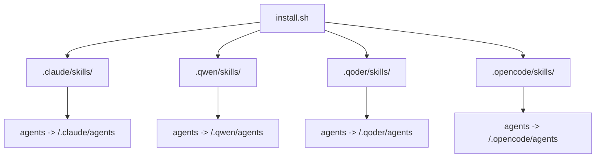
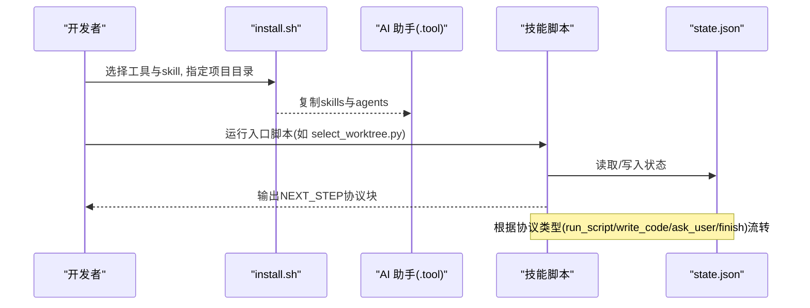
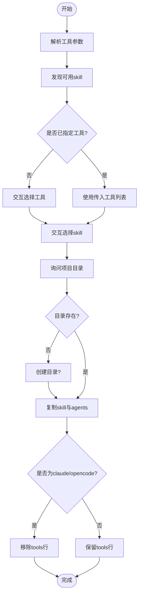
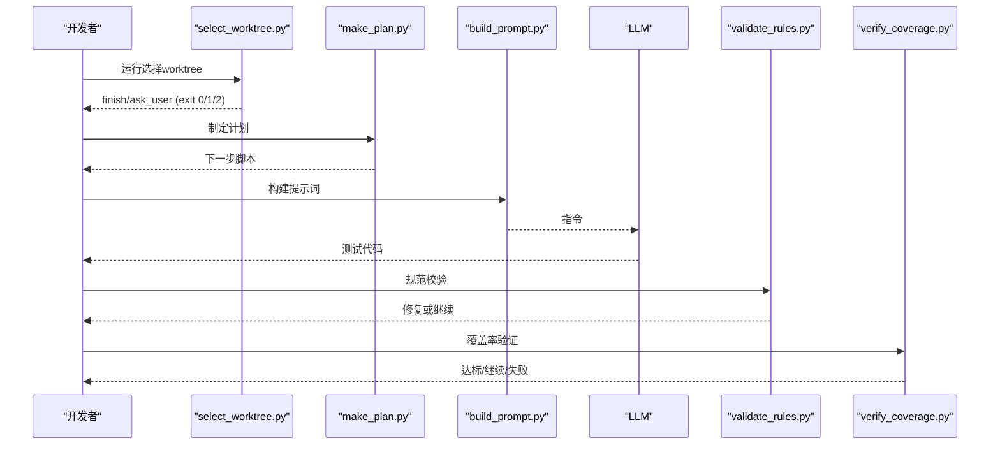
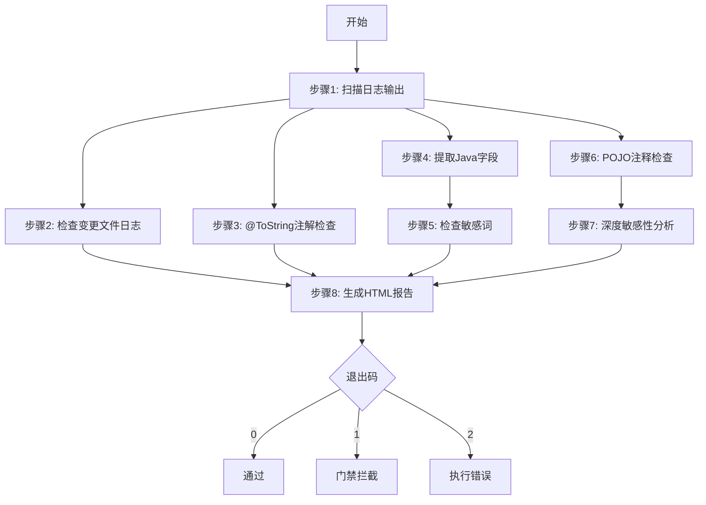
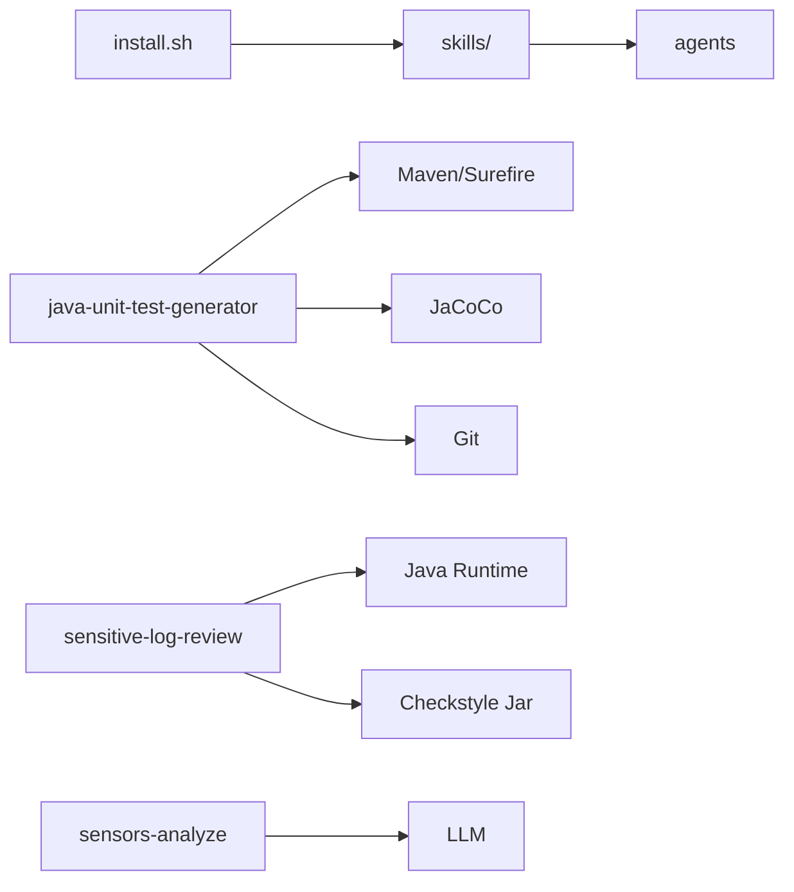

# 开发工作流程

<cite>
**本文引用的文件**
- [install.sh](file://install.sh)
- [AGENTS.md](file://AGENTS.md)
- [CLAUDE.md](file://CLAUDE.md)
- [sensitive-log-review/SKILL.md](file://sensitive-log-review/SKILL.md)
- [sensitive-log-review/scripts/main.py](file://sensitive-log-review/scripts/main.py)
- [sensitive-log-review/scripts/common/errors.py](file://sensitive-log-review/scripts/common/errors.py)
- [java-unit-test-generator/protocol/next-step.schema.json](file://java-unit-test-generator/protocol/next-step.schema.json)
- [batch-unit-test-generator/protocol/next-step.schema.json](file://batch-unit-test-generator/protocol/next-step.schema.json)
- [java-unit-test-generator/scripts/select_worktree.py](file://java-unit-test-generator/scripts/select_worktree.py)
- [java-unit-test-generator/scripts/jaut/config.py](file://java-unit-test-generator/scripts/jaut/config.py)
- [batch-unit-test-generator/scripts/validate_rules.py](file://batch-unit-test-generator/scripts/validate_rules.py)
</cite>

## 目录
1. [简介](#简介)
2. [项目结构](#项目结构)
3. [核心组件](#核心组件)
4. [架构总览](#架构总览)
5. [详细组件分析](#详细组件分析)
6. [依赖关系分析](#依赖关系分析)
7. [性能与内存注意事项](#性能与内存注意事项)
8. [故障排查指南](#故障排查指南)
9. [结论](#结论)
10. [附录：常用操作清单](#附录：常用操作清单)

## 简介
本工作流文档面向在 ping-skills 仓库中开发、安装、测试与部署“技能”的工程师。仓库包含四个自包含的技能，分别用于单元测试生成、批量单元测试生成、敏感日志审查与埋点分析。每个技能由 SKILL.md（触发与工作流）、references/与 protocol/（规则与协议）、scripts/（Python 驱动脚本）和 tests/（pytest）组成。通过 install.sh 可将技能一键安装到目标项目的 .claude/.qwen/.qoder/.opencode/skills 目录下，并在不同 AI 助手环境中进行测试与集成。

## 项目结构
- 根目录提供统一的安装脚本 install.sh，支持选择工具（claude/qwen/qoder/opencode/all），并自动复制 skill 与 agents 目录到目标项目对应位置，同时清理非必要文件并按目标工具处理 frontmatter 中的 tools 行。
- 各技能独立组织：
  - java-unit-test-generator：单类 JUnit5+Mockito 测试生成，遵循 NEXT_STEP 协议，状态保存在 state.json。
  - batch-unit-test-generator：基于分支差异批量生成测试，复用 jaut 引擎但存在独立副本。
  - sensitive-log-review：多阶段扫描与报告生成，严格退出码契约便于 CI 门禁。
  - sensors-analyze：LLM/Python 混合流水线，产出传感器调用清单与校验报告。
- 统一约定：脚本使用 Python 标准库；tests 使用 pytest；文档与注释以中文为主；SKILL.md 为对外契约，需与脚本行为保持一致。

**图表来源**
- [install.sh:144-204](file://install.sh#L144-L204)
- [install.sh:274-286](file://install.sh#L274-L286)

**章节来源**
- [AGENTS.md:5-14](file://AGENTS.md#L5-L14)
- [CLAUDE.md:16-34](file://CLAUDE.md#L16-L34)
- [install.sh:1-289](file://install.sh#L1-L289)

## 核心组件
- 安装器 install.sh：发现 skill、解析工具参数、交互式选择、复制与清理、按工具策略处理 SKILL.md 的 tools 行、复制 agents 目录。
- 单元测试生成技能（java/batch）：基于 NEXT_STEP 协议的脚本编排，状态持久化，覆盖率阈值驱动迭代，Maven/Surefire/JaCoCo 集成。
- 敏感日志审查技能（sensitive-log-review）：多阶段并行扫描、HTML 报告生成、CI 门禁退出码契约。
- 埋点分析技能（sensors-analyze）：LLM 产出 + 确定性脚本校验，输出 CSV/JSON 产物。

**章节来源**
- [CLAUDE.md:36-64](file://CLAUDE.md#L36-L64)
- [sensitive-log-review/SKILL.md:31-57](file://sensitive-log-review/SKILL.md#L31-L57)
- [java-unit-test-generator/protocol/next-step.schema.json:1-195](file://java-unit-test-generator/protocol/next-step.schema.json#L1-L195)
- [batch-unit-test-generator/protocol/next-step.schema.json:1-195](file://batch-unit-test-generator/protocol/next-step.schema.json#L1-L195)

## 架构总览
- 安装阶段：运行 install.sh，选择工具与 skill，复制到目标项目，清理测试与缓存，按需移除 SKILL.md 的 tools 行。
- 执行阶段：
  - 单元测试生成：select_worktree → init_coverage → make_plan → build_prompt → LLM write_code → validate_rules → verify_coverage（循环直至达标或达到预算）。
  - 敏感日志审查：主脚本编排多个子步骤，并行执行，汇总结果生成 HTML 报告，依据退出码决定 CI 门禁。
- 协议与状态：NEXT_STEP 协议定义脚本间通信格式；state.json 保存工作流状态，支持断点续跑。

**图表来源**
- [install.sh:144-204](file://install.sh#L144-L204)
- [java-unit-test-generator/scripts/select_worktree.py:1-200](file://java-unit-test-generator/scripts/select_worktree.py#L1-L200)
- [java-unit-test-generator/protocol/next-step.schema.json:66-177](file://java-unit-test-generator/protocol/next-step.schema.json#L66-L177)

**章节来源**
- [CLAUDE.md:36-64](file://CLAUDE.md#L36-L64)
- [java-unit-test-generator/scripts/select_worktree.py:1-200](file://java-unit-test-generator/scripts/select_worktree.py#L1-L200)

## 详细组件分析

### 安装流程（install.sh）
- 功能要点：
  - 发现所有非隐藏、非 agents 的 skill 目录。
  - 解析工具参数（all 或逗号/空格分隔列表），支持交互选择。
  - 复制 skill 到目标项目对应工具的 skills 目录，清理测试与缓存。
  - 对 claude/opencode 删除 SKILL.md 与 agents/*.md 的第一个 tools 行；qwen/qoder 保留。
  - 复制 agents 目录至目标项目对应工具的 agents 目录。
- 典型用法：
  - 无参交互：./install.sh
  - 指定工具与 skill：./install.sh qwen java-unit-test-generator /path/to/project
  - 全部安装：./install.sh all /path/to/project

**图表来源**
- [install.sh:14-27](file://install.sh#L14-L27)
- [install.sh:29-55](file://install.sh#L29-L55)
- [install.sh:57-92](file://install.sh#L57-L92)
- [install.sh:94-129](file://install.sh#L94-L129)
- [install.sh:131-204](file://install.sh#L131-L204)
- [install.sh:210-286](file://install.sh#L210-L286)

**章节来源**
- [install.sh:1-289](file://install.sh#L1-L289)

### 单元测试生成（java-unit-test-generator）
- 关键脚本：
  - select_worktree.py：第一步确认/新建 worktree，前置检查 CodeGraph 索引与 MCP 连接，输出 NEXT_STEP 协议。
  - jaut/config.py：集中配置阈值、超时、预算、协议常量等。
- 协议：
  - next-step.schema.json：定义协议字段、状态、next_step.type、resume 选项、on_complete 回调等。
- 工作流：
  - 选择 worktree → 初始化覆盖率 → 制定计划 → 构建提示词 → LLM 写代码 → 规范校验 → 覆盖率验证 → 循环直至达标或达到预算。
- 错误与升级：
  - 连续失败轮次触发 ask_user 或终止；接近门槛时抑制误报；批量模式有自动继续与升级逻辑。

**图表来源**
- [java-unit-test-generator/scripts/select_worktree.py:1-200](file://java-unit-test-generator/scripts/select_worktree.py#L1-L200)
- [java-unit-test-generator/protocol/next-step.schema.json:66-177](file://java-unit-test-generator/protocol/next-step.schema.json#L66-L177)
- [java-unit-test-generator/scripts/jaut/config.py:35-99](file://java-unit-test-generator/scripts/jaut/config.py#L35-L99)
- [batch-unit-test-generator/scripts/validate_rules.py:114-134](file://batch-unit-test-generator/scripts/validate_rules.py#L114-L134)

**章节来源**
- [java-unit-test-generator/scripts/select_worktree.py:1-200](file://java-unit-test-generator/scripts/select_worktree.py#L1-L200)
- [java-unit-test-generator/protocol/next-step.schema.json:1-195](file://java-unit-test-generator/protocol/next-step.schema.json#L1-L195)
- [java-unit-test-generator/scripts/jaut/config.py:1-172](file://java-unit-test-generator/scripts/jaut/config.py#L1-L172)
- [batch-unit-test-generator/scripts/validate_rules.py:114-134](file://batch-unit-test-generator/scripts/validate_rules.py#L114-L134)

### 敏感日志审查（sensitive-log-review）
- 主脚本 main.py：编排多阶段扫描，并行执行链路 A/B/C/D，最终生成 HTML 报告。
- 退出码契约：0=通过，1=门禁拦截，2=执行错误；支持 --fail-on 自定义类别。
- 子步骤：
  - 步骤1：扫描日志输出（java_log_scanner.py）
  - 步骤2：检查变更文件日志（check_log_print.py）
  - 步骤3：@ToString 注解检查（check_tostring_annotation.py）
  - 步骤4：提取 Java 字段（extract_java_fields.py）
  - 步骤5：检查敏感词（check_sensitive_word.py）
  - 步骤6：POJO 注释检查（check_pojo_comments.py）
  - 步骤7：深度敏感性分析（analyze_sensitive_fields.py + LLM 语义复核）
  - 步骤8：生成 HTML 报告
- 错误处理：common/errors.py 提供统一错误码与修复建议模板，结构化输出到 stderr。

**图表来源**
- [sensitive-log-review/scripts/main.py:1-22](file://sensitive-log-review/scripts/main.py#L1-L22)
- [sensitive-log-review/SKILL.md:70-157](file://sensitive-log-review/SKILL.md#L70-L157)
- [sensitive-log-review/scripts/common/errors.py:18-99](file://sensitive-log-review/scripts/common/errors.py#L18-L99)

**章节来源**
- [sensitive-log-review/scripts/main.py:1-200](file://sensitive-log-review/scripts/main.py#L1-L200)
- [sensitive-log-review/SKILL.md:31-57](file://sensitive-log-review/SKILL.md#L31-L57)
- [sensitive-log-review/scripts/common/errors.py:1-99](file://sensitive-log-review/scripts/common/errors.py#L1-L99)

### 埋点分析（sensors-analyze）
- 职责：LLM 产出 sensors.json 与 traces CSV 行，确定性脚本提取条目、定位调用点、校验报告。
- 约束：不修改目标代码库；CSV 值不含动态占位符；entry.txt 需要人工确认标记。
- 输出：sensors.csv 与相关中间产物。

**章节来源**
- [CLAUDE.md:57-64](file://CLAUDE.md#L57-L64)

## 依赖关系分析
- 安装器依赖 shell 环境，复制文件并清理无关内容。
- 单元测试生成技能依赖 Maven、Surefire、JaCoCo、Git 与 LLM；状态通过 state.json 持久化。
- 敏感日志审查依赖 Python、Java Runtime、Git、Checkstyle jar；产物为中间 list 与 HTML 报告。
- 埋点分析依赖 Python 与 LLM；输出 CSV/JSON。

**图表来源**
- [install.sh:144-204](file://install.sh#L144-L204)
- [java-unit-test-generator/scripts/jaut/config.py:101-118](file://java-unit-test-generator/scripts/jaut/config.py#L101-L118)
- [sensitive-log-review/SKILL.md:158-196](file://sensitive-log-review/SKILL.md#L158-L196)

**章节来源**
- [AGENTS.md:16-28](file://AGENTS.md#L16-L28)
- [CLAUDE.md:36-64](file://CLAUDE.md#L36-L64)

## 性能与内存注意事项
- 单元测试生成：
  - 预算控制：全局与单方法轮次上限可通过环境变量调整；接近门槛时抑制无提升升级，避免无效迭代。
  - 超时管理：Maven 命令带超时与优雅终止机制，防止长时间挂起。
  - 剪枝目录：遍历项目时跳过 .git、target、node_modules 等目录，减少 IO 与解析开销。
- 敏感日志审查：
  - 并行链路：A/B/C/D 四链路并行执行，目标全流程 <60s；失败文件分片记录，严格模式下以退出码 2 结束。
  - 词典分层：四层优先级（whitelist > blacklist > core > extended），命中即违规或仅提示，降低误报与漏报。
  - 输出目录策略：跨平台自动解析，支持 CI 并行隔离（--run-id）。
- 通用建议：
  - 避免全量扫描大仓库；优先使用变更集扫描。
  - 合理设置覆盖率阈值与轮次预算，避免无限迭代。
  - 使用 --strict-mode 与 --doctor 进行环境与数据一致性检查。

**章节来源**
- [java-unit-test-generator/scripts/jaut/config.py:51-99](file://java-unit-test-generator/scripts/jaut/config.py#L51-L99)
- [java-unit-test-generator/scripts/jaut/config.py:101-118](file://java-unit-test-generator/scripts/jaut/config.py#L101-L118)
- [sensitive-log-review/scripts/main.py:1-22](file://sensitive-log-review/scripts/main.py#L1-L22)
- [sensitive-log-review/SKILL.md:198-213](file://sensitive-log-review/SKILL.md#L198-L213)

## 故障排查指南
- 安装失败：
  - 检查目标目录是否存在与权限；确认工具名称正确；查看 install.sh 输出的警告与错误信息。
- 单元测试生成：
  - CodeGraph 索引缺失：执行 codegraph init 后重试；MCP 未连接需等待或重新安装。
  - 规范校验失败：根据 validate_rules 输出逐条修复；批量模式可自动继续或升级。
  - 覆盖率不达标：调整阈值或增加测试覆盖；注意抽象/接口方法默认 100% 覆盖。
- 敏感日志审查：
  - 退出码 2：检查 Java/Git/Checkstyle 环境；查看 common/errors.py 的错误码与修复建议。
  - 门禁拦截：根据 --fail-on 类别定位问题；使用 --doctor 进行环境诊断。
  - 输出目录不可写：更换 -o 路径或设置 SLR_OUTPUT_DIR。
- 埋点分析：
  - 遵循约束：不修改目标代码；CSV 值不含动态占位符；entry.txt 需人工确认。

**章节来源**
- [java-unit-test-generator/scripts/select_worktree.py:162-200](file://java-unit-test-generator/scripts/select_worktree.py#L162-L200)
- [batch-unit-test-generator/scripts/validate_rules.py:114-134](file://batch-unit-test-generator/scripts/validate_rules.py#L114-L134)
- [sensitive-log-review/scripts/common/errors.py:18-99](file://sensitive-log-review/scripts/common/errors.py#L18-L99)
- [sensitive-log-review/SKILL.md:51-57](file://sensitive-log-review/SKILL.md#L51-L57)

## 结论
ping-skills 提供了标准化的技能开发与安装流程，通过 install.sh 简化部署，通过 NEXT_STEP 协议实现脚本与 LLM 的协作，通过严格的退出码与错误处理保障 CI 稳定性。遵循本文的工作流程与最佳实践，可有效提升开发效率与质量。

## 附录：常用操作清单
- 安装技能：
  - 交互安装：./install.sh
  - 指定工具与 skill：./install.sh qwen java-unit-test-generator /path/to/project
  - 全部安装：./install.sh all /path/to/project
- 运行测试：
  - 进入技能目录：cd sensitive-log-review
  - 运行套件：python3 -m pytest tests/
  - 运行单测：python3 -m pytest tests/test_cli.py::test_x
- 执行技能：
  - 单元测试生成：按 SKILL.md 指引运行 select_worktree.py 等脚本
  - 敏感日志审查：python scripts/main.py --branch develop -o ./review-output
  - 埋点分析：按 sensors-analyze/CLAUDE.md 指引执行

**章节来源**
- [AGENTS.md:16-28](file://AGENTS.md#L16-L28)
- [CLAUDE.md:16-34](file://CLAUDE.md#L16-L34)
- [sensitive-log-review/SKILL.md:10-29](file://sensitive-log-review/SKILL.md#L10-L29)