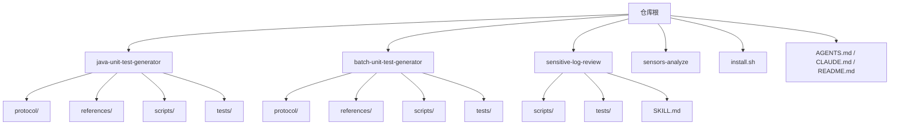
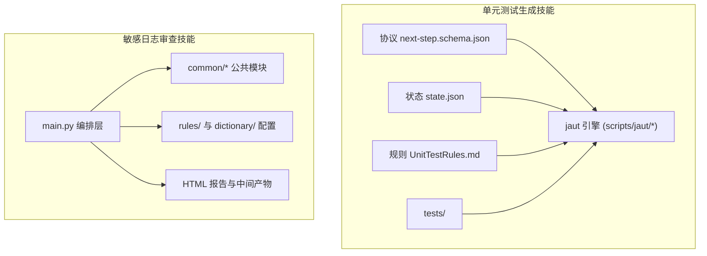
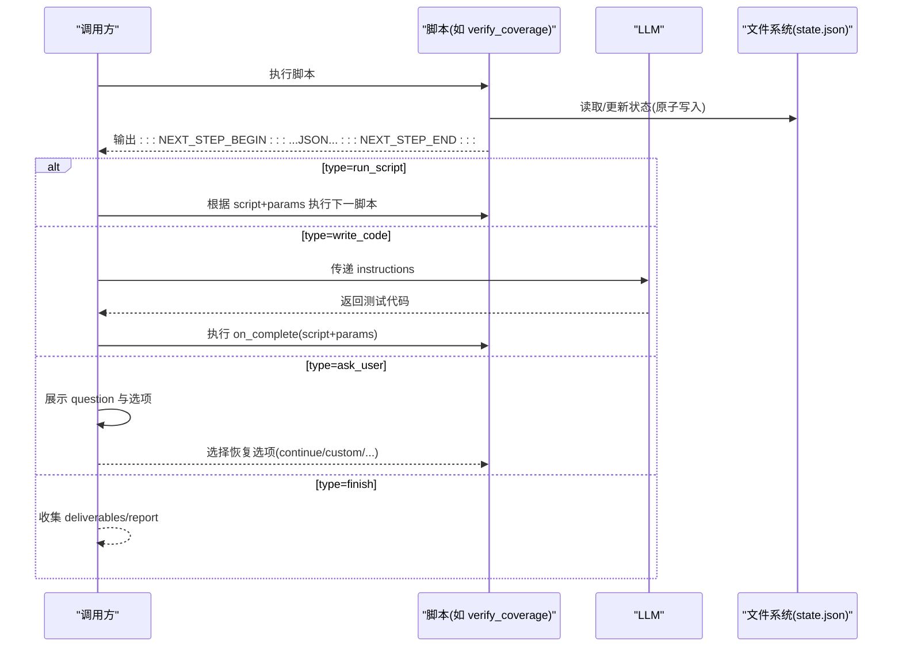
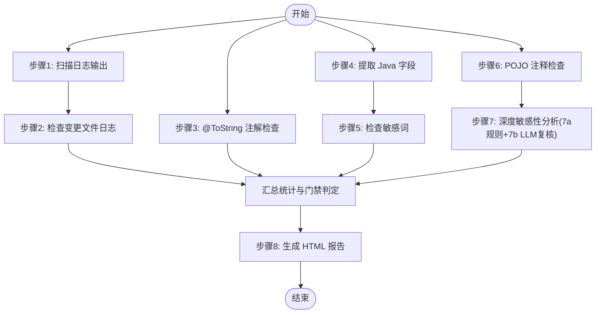
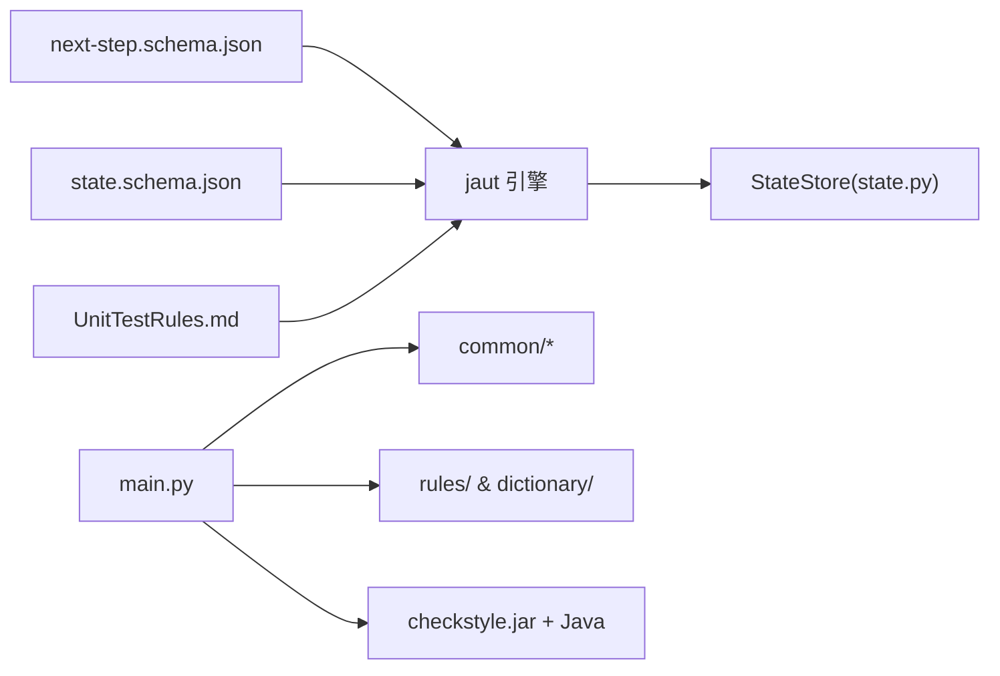

# 技能开发指南

<cite>
**本文引用的文件**
- [README.md](file://README.md)
- [AGENTS.md](file://AGENTS.md)
- [CLAUDE.md](file://CLAUDE.md)
- [install.sh](file://install.sh)
- [sensitive-log-review/SKILL.md](file://sensitive-log-review/SKILL.md)
- [java-unit-test-generator/protocol/next-step.schema.json](file://java-unit-test-generator/protocol/next-step.schema.json)
- [java-unit-test-generator/protocol/state.schema.json](file://java-unit-test-generator/protocol/state.schema.json)
- [batch-unit-test-generator/references/UnitTestRules.md](file://batch-unit-test-generator/references/UnitTestRules.md)
- [sensitive-log-review/scripts/main.py](file://sensitive-log-review/scripts/main.py)
- [sensitive-log-review/tests/conftest.py](file://sensitive-log-review/tests/conftest.py)
- [sensitive-log-review/scripts/common/errors.py](file://sensitive-log-review/scripts/common/errors.py)
- [java-unit-test-generator/scripts/jaut/state.py](file://java-unit-test-generator/scripts/jaut/state.py)
</cite>

## 目录
1. [简介](#简介)
2. [项目结构](#项目结构)
3. [核心组件](#核心组件)
4. [架构总览](#架构总览)
5. [详细组件分析](#详细组件分析)
6. [依赖关系分析](#依赖关系分析)
7. [性能考虑](#性能考虑)
8. [故障排查指南](#故障排查指南)
9. [结论](#结论)
10. [附录](#附录)

## 简介
本指南面向希望在 ping-skills 仓库中开发高质量“技能”的工程师。该仓库包含多个自包含的技能（如单元测试生成、敏感日志审查、埋点分析等），每个技能由 SKILL.md（触发与流程）、references/（规则与参考）、protocol/（协议与状态 Schema）、scripts/（Python 驱动脚本）和 tests/（pytest 测试套件）组成。本文从标准结构、NEXT_STEP 协议、状态机模式、完整开发流程、CLI 设计、错误处理、日志记录、配置管理、AI 集成与触发机制，到部署安装最佳实践，提供系统化说明，帮助开发者独立交付可维护、可测试、可集成的技能模块。

## 项目结构
仓库采用“按技能分目录”的组织方式，每个顶级目录是一个独立的技能，彼此解耦，便于单独安装、测试与维护。根目录提供统一的安装脚本与仓库级规范。

- 每个技能遵循统一约定：SKILL.md 描述触发词与工作流；references/ 存放规则文档；protocol/ 定义协议与状态 JSON Schema；scripts/ 为 Python 驱动；tests/ 为 pytest 用例。
- 根级 install.sh 支持将任意 skill 安装到目标项目的 .claude/.qwen/.qoder/.opencode/skills 下，并自动清理非必要文件。

章节来源
- [AGENTS.md:5-14](file://AGENTS.md#L5-L14)
- [CLAUDE.md:5-14](file://CLAUDE.md#L5-L14)
- [install.sh:145-204](file://install.sh#L145-L204)

## 核心组件
- 协议与状态
  - NEXT_STEP 协议：脚本在 stdout 末尾输出被标记包裹的 JSON 块，声明下一步动作（运行脚本、写代码、询问用户、完成）。
  - state.json 状态：持久化工作进度、覆盖率轨迹、迭代预算等，支持断点续跑与向后兼容。
- 驱动脚本
  - 单元测试生成类技能：通过 jaut 引擎编排 select_worktree → init_coverage → make_plan → build_prompt → LLM 写码 → validate_rules → verify_coverage 的循环。
  - 敏感日志审查：多阶段流水线（日志扫描、注解检查、字段提取、敏感词检查、POJO 注释检查、深度分析、报告生成），并行链路提升吞吐。
- 规则与参考
  - references/ 中的规则文档是权威约束（例如 UnitTestRules.md），冲突时以 Schema > 规则 > SKILL.md > LLM 判断为准。
- 测试与配置
  - tests/ 使用 pytest；conftest.py 将 scripts/ 加入 sys.path，确保 common 包可导入。
  - 配置集中在 rules/ 与词典文件，变更需遵循版本头递增与门禁策略。

章节来源
- [java-unit-test-generator/protocol/next-step.schema.json:1-195](file://java-unit-test-generator/protocol/next-step.schema.json#L1-L195)
- [java-unit-test-generator/protocol/state.schema.json:1-151](file://java-unit-test-generator/protocol/state.schema.json#L1-L151)
- [batch-unit-test-generator/references/UnitTestRules.md:1-200](file://batch-unit-test-generator/references/UnitTestRules.md#L1-L200)
- [sensitive-log-review/tests/conftest.py:1-9](file://sensitive-log-review/tests/conftest.py#L1-L9)

## 架构总览
技能整体由“协议 + 状态 + 脚本 + 规则 + 测试”构成闭环。单元测试生成类技能通过 NEXT_STEP 协议驱动 LLM 与脚本协作，形成状态机式的工作流；敏感日志审查则以主脚本编排多子步骤，产出结构化产物与 HTML 报告。

图表来源
- [java-unit-test-generator/protocol/next-step.schema.json:1-195](file://java-unit-test-generator/protocol/next-step.schema.json#L1-L195)
- [java-unit-test-generator/protocol/state.schema.json:1-151](file://java-unit-test-generator/protocol/state.schema.json#L1-L151)
- [batch-unit-test-generator/references/UnitTestRules.md:1-200](file://batch-unit-test-generator/references/UnitTestRules.md#L1-L200)
- [sensitive-log-review/scripts/main.py:1-200](file://sensitive-log-review/scripts/main.py#L1-L200)

## 详细组件分析

### 单元测试生成技能：NEXT_STEP 协议与状态机
- 协议要点
  - 每个脚本结束时在 stdout 末尾输出被 :::NEXT_STEP_BEGIN:::/:::NEXT_STEP_END::: 包裹的 JSON 块，包含 protocol_version、script、status、exit_code、summary、artifacts、metrics、next_step 等字段。
  - next_step.type 可为 run_script、write_code、ask_user、finish；不同 type 要求不同的必填字段（如 write_code 需要 instructions 与 on_complete）。
  - 退出码约定：0=完成，1=继续（正常流转信号），2=脚本错误，3=状态/协议错误。
- 状态管理
  - state.json 保存项目根、覆盖率阈值、目标类/方法、Maven 模块、迭代计数、覆盖率历史、测试结果轨迹等。
  - StateStore 实现原子写入（临时文件 + os.replace + fsync）与跨进程锁（POSIX fcntl 或 Windows msvcrt），保证断点续跑安全。
  - 支持 schema_version 迁移，旧文件缺失键时填充默认值，保持向后兼容。
- 典型工作流
  - select_worktree → init_coverage → make_plan → build_prompt → LLM 写码 → validate_rules → verify_coverage（批量版在外层再套 batch_diff → batch_init → batch_next → batch_update → batch_finish）。
  - 冲突优先级：Schema > references/UnitTestRules.md > SKILL.md > LLM 判断。

图表来源
- [java-unit-test-generator/protocol/next-step.schema.json:1-195](file://java-unit-test-generator/protocol/next-step.schema.json#L1-L195)
- [java-unit-test-generator/scripts/jaut/state.py:77-165](file://java-unit-test-generator/scripts/jaut/state.py#L77-L165)

章节来源
- [java-unit-test-generator/protocol/next-step.schema.json:1-195](file://java-unit-test-generator/protocol/next-step.schema.json#L1-L195)
- [java-unit-test-generator/protocol/state.schema.json:1-151](file://java-unit-test-generator/protocol/state.schema.json#L1-L151)
- [java-unit-test-generator/scripts/jaut/state.py:77-165](file://java-unit-test-generator/scripts/jaut/state.py#L77-L165)
- [batch-unit-test-generator/references/UnitTestRules.md:1-200](file://batch-unit-test-generator/references/UnitTestRules.md#L1-L200)

### 敏感日志审查技能：流水线编排与产物契约
- 编排层 main.py
  - 四链路并行：A(日志扫描→变更日志检查)、B(@ToString 检查)、C(字段提取→敏感词检查)、D(POJO 注释检查→深度分析)，最终汇合生成 HTML 报告。
  - 退出码契约：0=通过，1=触发门禁（基于 --fail-on 类别），2=执行错误。
  - 输出目录策略：优先 -o/--output-dir，其次环境变量 SLR_OUTPUT_DIR，最后系统临时目录；CI 可用 --run-id 隔离并行产物。
- 公共模块与规则
  - common/ 提供路径、文本、Git、字典、错误、失败汇总、Java 词法分析等能力。
  - rules/ 与 dictionary/ 集中配置规则与词典，词典分层优先级：whitelist > blacklist > core > extended。
- 产物格式
  - 中间产物包括 log-print-ok.list、log-print-violation.list、miss-tostring-annotation.list、all-fields.list、sensitive.results、unqualified.results、pojo-changed.list、pojo-miss-comments.txt、failed-files.list 等。
  - 最终分析结果 analyze-sensitize.result 包含字段级判定与行号信息。

图表来源
- [sensitive-log-review/scripts/main.py:1-200](file://sensitive-log-review/scripts/main.py#L1-L200)
- [sensitive-log-review/SKILL.md:70-157](file://sensitive-log-review/SKILL.md#L70-L157)

章节来源
- [sensitive-log-review/scripts/main.py:1-200](file://sensitive-log-review/scripts/main.py#L1-L200)
- [sensitive-log-review/SKILL.md:31-69](file://sensitive-log-review/SKILL.md#L31-L69)
- [sensitive-log-review/SKILL.md:158-263](file://sensitive-log-review/SKILL.md#L158-L263)

### 新技能完整开发流程
- 需求分析与范围界定
  - 明确技能目标、输入输出、依赖环境、CI 集成点与门禁策略。
  - 确定是否采用 NEXT_STEP 协议（适合 LLM 参与的多轮迭代任务）或纯脚本流水线（如敏感日志审查）。
- 架构设计与协议定义
  - 若涉及 LLM 协作，定义 next-step.schema.json 与 state.schema.json，明确状态字段、迁移策略与原子写入。
  - 编写 references/ 规则文档，作为机器强校验与软约束的来源。
- 实现与模块化
  - 将通用能力下沉至 scripts/common/，避免重复实现；脚本保持 stdlib-only（测试除外）。
  - 设计 CLI：参数清晰、--help 友好、退出码契约稳定。
- 测试与质量保障
  - 为每个关键模块编写 pytest 用例；conftest.py 注入 scripts/ 到 sys.path。
  - 覆盖成功路径、失败路径、边界条件与协议 next_step 分支。
- 集成与部署
  - 使用 install.sh 将技能安装到目标项目的 .tool/skills 目录，按需剥离 tests/ 与非必要文件。
  - 在 CI 中依据退出码与产物进行门禁与报告归档。

章节来源
- [AGENTS.md:16-45](file://AGENTS.md#L16-L45)
- [CLAUDE.md:16-64](file://CLAUDE.md#L16-L64)
- [install.sh:210-289](file://install.sh#L210-L289)

### 命令行接口设计、错误处理、日志与配置
- CLI 设计
  - 每个入口脚本支持 --help；参数命名一致（如 -o/--output-dir、--branch、--repo、--full-scan）。
  - 敏感日志审查主脚本提供 --doctor 环境诊断、--strict-mode 严格模式、--run-id 并行隔离。
- 错误处理
  - 统一错误码与修复建议模板（E001-E007），输出到 stderr，不改变退出码契约。
  - 常见错误包括非 git 仓库、找不到 java、分支非法、规则 JSON 损坏、输出目录不可写、jar 校验失败等。
- 日志记录
  - 脚本内部使用模块级 logger；编排层在主流程中打印命令与输出摘要，便于定位问题。
- 配置管理
  - 规则与词典集中管理，词典分层优先级明确；修改需递增版本头，避免漂移。

章节来源
- [sensitive-log-review/scripts/common/errors.py:1-100](file://sensitive-log-review/scripts/common/errors.py#L1-L100)
- [sensitive-log-review/SKILL.md:158-213](file://sensitive-log-review/SKILL.md#L158-L213)
- [sensitive-log-review/scripts/main.py:112-180](file://sensitive-log-review/scripts/main.py#L112-L180)

### 技能与 AI 助手的集成方式与触发机制
- 触发机制
  - 每个技能的 SKILL.md frontmatter 携带 name 与 description（触发文本）；工具（Claude/Qwen/Qoder/OpenCode）据此识别与加载。
  - install.sh 在安装时针对不同工具决定是否保留 tools: 行（qoder/qwen 保留，claude/opencode 剥离）。
- 集成方式
  - 单元测试生成类技能通过 NEXT_STEP 协议让 LLM 在指定步骤写码，并在完成后执行 on_complete 脚本进行终验。
  - 敏感日志审查技能无需 LLM 参与核心流程，但可在 7b 语义复核阶段由 AI 补充人工判断。

章节来源
- [CLAUDE.md:61-64](file://CLAUDE.md#L61-L64)
- [install.sh:176-204](file://install.sh#L176-L204)
- [java-unit-test-generator/protocol/next-step.schema.json:66-177](file://java-unit-test-generator/protocol/next-step.schema.json#L66-L177)

### 技能部署与安装最佳实践
- 安装命令
  - ./install.sh <claude|qwen|qoder|opencode|all> [skill,skill] [project-dir]
  - 无参交互模式支持多选工具与技能；支持 ~ 展开与目录创建提示。
- 安装行为
  - 复制到 <project>/.<tool>/skills/<name>，同时复制 agents/（如有）；删除 tests/、__pycache__/、.pytest_cache/、test.log。
  - 对 claude/opencode 剥离 SKILL.md 与 agents/*.md 的首个 tools: 行，避免不被支持的字段。
- CI 集成
  - 使用退出码契约进行门禁；结合 --run-id 实现并行隔离；归档 HTML 报告与中间产物。

章节来源
- [CLAUDE.md:16-34](file://CLAUDE.md#L16-L34)
- [install.sh:145-204](file://install.sh#L145-L204)
- [install.sh:210-289](file://install.sh#L210-L289)

## 依赖关系分析
- 单元测试生成技能
  - 依赖协议与状态 Schema、jaut 引擎（cli/config/decisions/gitops/jacoco/javasrc/logutil/maven/models/proc/prompt/protocol/report/rules/state/surefire/transitions/worktree）、规则文档与测试套件。
  - 状态存储 StateStore 提供原子写入与跨进程锁，确保并发安全。
- 敏感日志审查技能
  - 依赖 main.py 编排层、common/ 公共模块、rules/ 与 dictionary/ 配置、checkstyle jar 与 Java Runtime。
  - 测试套件通过 conftest.py 注入 scripts/ 到 sys.path，确保 common 包可导入。

图表来源
- [java-unit-test-generator/protocol/next-step.schema.json:1-195](file://java-unit-test-generator/protocol/next-step.schema.json#L1-L195)
- [java-unit-test-generator/protocol/state.schema.json:1-151](file://java-unit-test-generator/protocol/state.schema.json#L1-L151)
- [batch-unit-test-generator/references/UnitTestRules.md:1-200](file://batch-unit-test-generator/references/UnitTestRules.md#L1-L200)
- [java-unit-test-generator/scripts/jaut/state.py:77-165](file://java-unit-test-generator/scripts/jaut/state.py#L77-L165)
- [sensitive-log-review/scripts/main.py:1-200](file://sensitive-log-review/scripts/main.py#L1-L200)

章节来源
- [java-unit-test-generator/scripts/jaut/state.py:77-165](file://java-unit-test-generator/scripts/jaut/state.py#L77-L165)
- [sensitive-log-review/tests/conftest.py:1-9](file://sensitive-log-review/tests/conftest.py#L1-L9)

## 性能考虑
- 单元测试生成
  - 覆盖率与测试执行开销较大，建议合理设置阈值与全局预算，利用 state.json 的 round_rates 与 final_check_fail_streak 防止空转。
  - 批量场景通过外层批处理脚本减少上下文切换成本。
- 敏感日志审查
  - 四链路并行显著缩短端到端时间；全量扫描较慢，建议在 CI 中使用 changed-only 模式。
  - 词典与规则文件应精简且命中准确，降低误报与重算成本。

[本节为通用指导，不直接分析具体文件]

## 故障排查指南
- 常见问题与修复
  - 非 git 仓库：确认 -r 指向仓库根；执行 git status 验证。
  - 找不到 java：安装 JRE/JDK 并加入 PATH；仅影响 POJO 注释检查。
  - 分支名非法或不存在：核对 --branch 参数；执行 git branch -a 确认。
  - 规则 JSON 损坏：修复语法后使用 json.tool 验证。
  - 输出目录不可写：更换 -o 或设置 SLR_OUTPUT_DIR。
  - checkstyle jar 校验失败：重新获取可信源或同步更新 sha256 基线。
- 调试建议
  - 使用 --verbose 查看子脚本命令与输出摘要。
  - 检查 failed-files.list 与中间产物，定位失败步骤。
  - 对于 NEXT_STEP 协议，检查 stdout 末尾的协议块与 exit_code。

章节来源
- [sensitive-log-review/scripts/common/errors.py:18-100](file://sensitive-log-review/scripts/common/errors.py#L18-L100)
- [sensitive-log-review/scripts/main.py:112-180](file://sensitive-log-review/scripts/main.py#L112-L180)

## 结论
ping-skills 提供了标准化的技能开发与集成范式：以协议与状态为核心，以脚本与规则为支撑，以测试与安装为保障。遵循本指南，开发者可以高效构建高质量的技能模块，并与 AI 助手无缝集成，满足代码质量与安全合规的自动化需求。

[本节为总结性内容，不直接分析具体文件]

## 附录
- 快速命令
  - 安装：./install.sh <tool> [skill,...] [project-dir]
  - 测试：cd <skill> && python3 -m pytest tests/
  - 单测：python3 -m pytest tests/test_cli.py::test_x
- 参考文件
  - 仓库规范：AGENTS.md、CLAUDE.md
  - 安装脚本：install.sh
  - 技能示例：sensitive-log-review/SKILL.md
  - 协议与状态：next-step.schema.json、state.schema.json
  - 规则文档：UnitTestRules.md
  - 编排与公共模块：main.py、common/*

[本节为索引性内容，不直接分析具体文件]