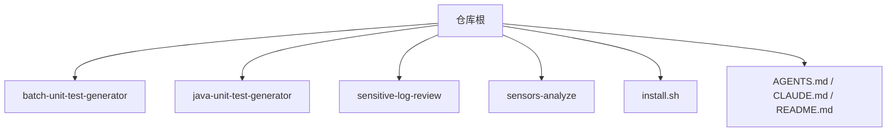
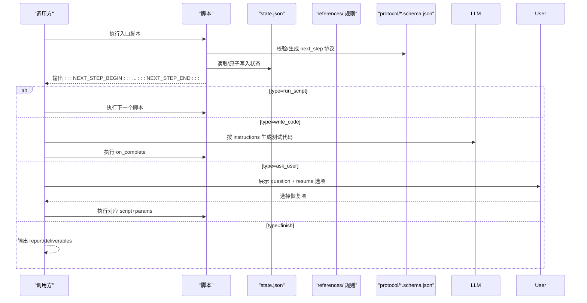
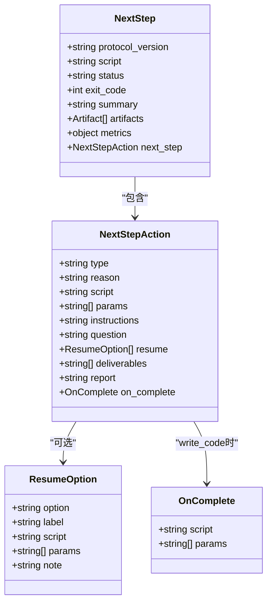
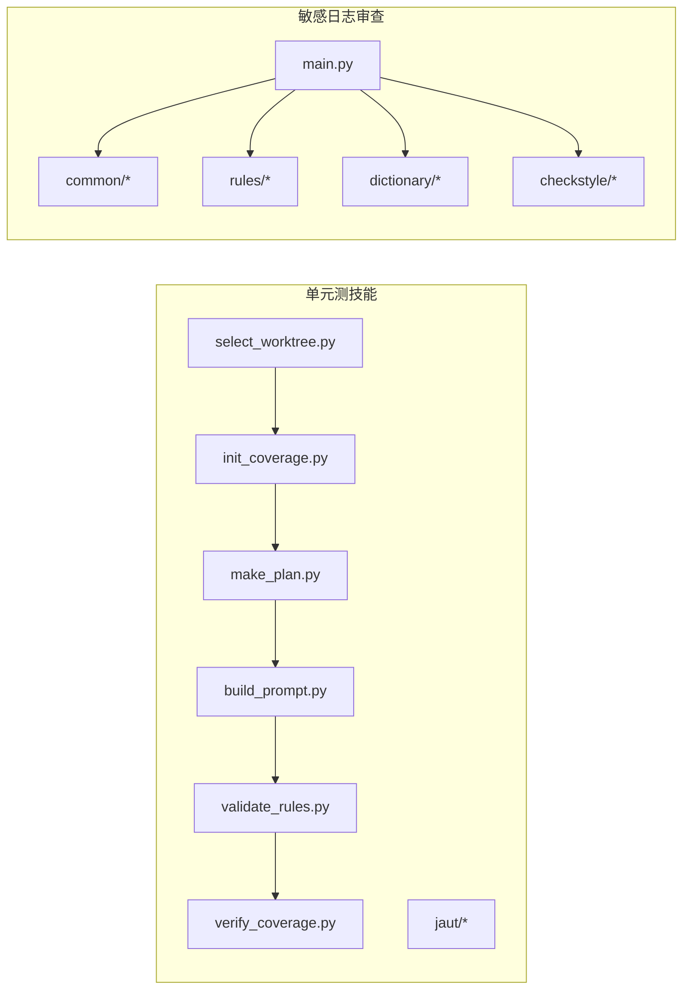
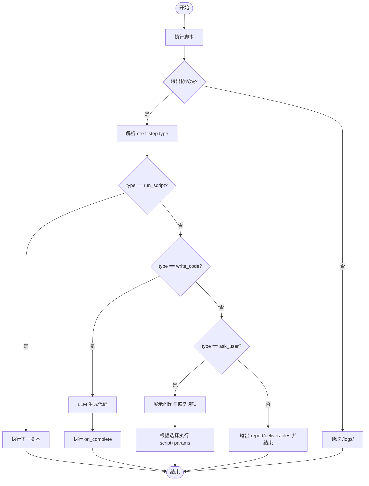
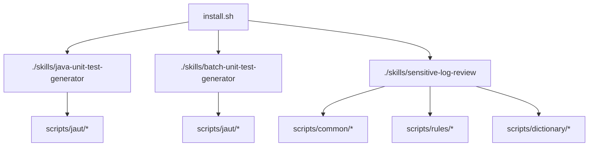

# 技能标准结构

<cite>
**本文引用的文件**
- [README.md](file://README.md)
- [AGENTS.md](file://AGENTS.md)
- [CLAUDE.md](file://CLAUDE.md)
- [install.sh](file://install.sh)
- [sensitive-log-review/SKILL.md](file://sensitive-log-review/SKILL.md)
- [batch-unit-test-generator/protocol/next-step.schema.json](file://batch-unit-test-generator/protocol/next-step.schema.json)
- [batch-unit-test-generator/protocol/state.schema.json](file://batch-unit-test-generator/protocol/state.schema.json)
- [java-unit-test-generator/protocol/next-step.schema.json](file://java-unit-test-generator/protocol/next-step.schema.json)
- [java-unit-test-generator/protocol/state.schema.json](file://java-unit-test-generator/protocol/state.schema.json)
- [batch-unit-test-generator/references/UnitTestRules.md](file://batch-unit-test-generator/references/UnitTestRules.md)
- [java-unit-test-generator/references/workflow-details.md](file://java-unit-test-generator/references/workflow-details.md)
- [batch-unit-test-generator/tests/conftest.py](file://batch-unit-test-generator/tests/conftest.py)
- [sensitive-log-review/tests/conftest.py](file://sensitive-log-review/tests/conftest.py)
</cite>

## 目录
1. [简介](#简介)
2. [项目结构](#项目结构)
3. [核心组件](#核心组件)
4. [架构总览](#架构总览)
5. [详细组件分析](#详细组件分析)
6. [依赖关系分析](#依赖关系分析)
7. [性能与工程化考量](#性能与工程化考量)
8. [故障排查指南](#故障排查指南)
9. [结论](#结论)
10. [附录：新技能目录最佳实践](#附录新技能目录最佳实践)

## 简介
本文件为 ping-skills 项目的“技能标准结构”文档，面向希望新增或维护技能的开发者。内容覆盖每个技能目录的标准组织方式、协议定义、规则文档管理、脚本组织、测试结构与命名约定，以及目录间依赖和数据流向；同时给出权限、编码、版本控制等工程化要求，帮助快速搭建可维护的技能框架。

## 项目结构
仓库包含多个独立的“技能”目录，每个技能自包含提示与工作流说明、协议与规则、驱动脚本与测试套件。根级提供安装脚本与通用规范说明。

**图表来源**
- [install.sh:145-204](file://install.sh#L145-L204)
- [AGENTS.md:5-14](file://AGENTS.md#L5-L14)
- [CLAUDE.md:5-14](file://CLAUDE.md#L5-L14)

**章节来源**
- [AGENTS.md:5-14](file://AGENTS.md#L5-L14)
- [CLAUDE.md:5-14](file://CLAUDE.md#L5-L14)
- [install.sh:145-204](file://install.sh#L145-L204)

## 核心组件
- SKILL.md：每个技能的入口说明，包含名称、描述、触发词、工作流、退出码契约、输出格式、依赖与使用场景等。
- protocol/：协议与状态 JSON Schema，用于脚本间通信与断点续跑。
- references/：规则与流程说明（如单元测试编写规则、工作流细节）。
- scripts/：Python 驱动脚本与工具链（如 Maven/JaCoCo/Checkstyle 集成）。
- tests/：pytest 测试套件，conftest.py 将 scripts/ 加入 sys.path。

**章节来源**
- [AGENTS.md:5-14](file://AGENTS.md#L5-L14)
- [CLAUDE.md:5-14](file://CLAUDE.md#L5-L14)

## 架构总览
技能通过统一的 NEXT_STEP 协议在脚本与 LLM 之间协作：脚本执行后在 stdout 末尾输出被标记包裹的 JSON 协议块，调用方据此决定下一步动作（运行脚本、让 LLM 写代码、询问用户或直接结束）。状态持久化在 state.json，支持断点续跑。

**图表来源**
- [batch-unit-test-generator/protocol/next-step.schema.json:1-195](file://batch-unit-test-generator/protocol/next-step.schema.json#L1-L195)
- [java-unit-test-generator/protocol/next-step.schema.json:1-195](file://java-unit-test-generator/protocol/next-step.schema.json#L1-L195)
- [batch-unit-test-generator/protocol/state.schema.json:1-161](file://batch-unit-test-generator/protocol/state.schema.json#L1-L161)
- [java-unit-test-generator/protocol/state.schema.json:1-151](file://java-unit-test-generator/protocol/state.schema.json#L1-L151)
- [CLAUDE.md:38-48](file://CLAUDE.md#L38-L48)

## 详细组件分析

### 协议与状态（protocol/）
- next-step.schema.json：定义脚本输出的协议载荷，包括协议版本、脚本名、状态、退出码、摘要、产物、指标与下一步动作（run_script/write_code/ask_user/finish），并对不同 type 附加必填字段（如 write_code 需要 instructions 与 on_complete）。
- state.schema.json：定义断点续跑的状态结构，包括项目根、覆盖率门槛、目标类/方法、模块、迭代计数、覆盖率轨迹、测试结果轨迹、计划、批量模式标志等，并保证向后兼容（缺失键填充默认值）。

**图表来源**
- [batch-unit-test-generator/protocol/next-step.schema.json:1-195](file://batch-unit-test-generator/protocol/next-step.schema.json#L1-L195)
- [java-unit-test-generator/protocol/next-step.schema.json:1-195](file://java-unit-test-generator/protocol/next-step.schema.json#L1-L195)

**章节来源**
- [batch-unit-test-generator/protocol/next-step.schema.json:1-195](file://batch-unit-test-generator/protocol/next-step.schema.json#L1-L195)
- [java-unit-test-generator/protocol/next-step.schema.json:1-195](file://java-unit-test-generator/protocol/next-step.schema.json#L1-L195)
- [batch-unit-test-generator/protocol/state.schema.json:1-161](file://batch-unit-test-generator/protocol/state.schema.json#L1-L161)
- [java-unit-test-generator/protocol/state.schema.json:1-151](file://java-unit-test-generator/protocol/state.schema.json#L1-L151)

### 规则与参考文档（references/）
- batch-unit-test-generator/references/UnitTestRules.md：单元测试编写的权威规则，区分软约束与机器强校验，明确禁止修改非测试类、异常路径验证方式、测试必须真实通过等。
- java-unit-test-generator/references/workflow-details.md：工作流详细说明，涵盖 select_worktree/init_coverage/NEXT_STEP 协议/退出码/日志位置/Maven 超时处理等。

**章节来源**
- [batch-unit-test-generator/references/UnitTestRules.md:1-200](file://batch-unit-test-generator/references/UnitTestRules.md#L1-L200)
- [java-unit-test-generator/references/workflow-details.md:1-141](file://java-unit-test-generator/references/workflow-details.md#L1-L141)

### 脚本组织（scripts/）
- 单元测技能（java/batch）：以 Python 脚本为主，封装 CLI、状态机、Maven/Surefire/JaCoCo 集成、工作树操作、协议与报告等；共享引擎 jaut/ 在各技能中独立副本且存在差异。
- 敏感日志审查（sensitive-log-review）：主入口 main.py 编排多阶段扫描器，公共逻辑集中在 common/，规则与词典位于 rules/ 与 dictionary/，外部工具 Checkstyle 置于 checkstyle/。

**图表来源**
- [CLAUDE.md:38-55](file://CLAUDE.md#L38-L55)
- [sensitive-log-review/SKILL.md:158-196](file://sensitive-log-review/SKILL.md#L158-L196)

**章节来源**
- [CLAUDE.md:38-55](file://CLAUDE.md#L38-L55)
- [sensitive-log-review/SKILL.md:158-196](file://sensitive-log-review/SKILL.md#L158-L196)

### 测试组织（tests/）
- 统一使用 pytest，conftest.py 将 scripts/ 加入 sys.path，使测试可直接导入脚本与公共包。
- 命名约定：test_<subject>.py，用例函数 test_<behavior>。

**章节来源**
- [batch-unit-test-generator/tests/conftest.py:1-11](file://batch-unit-test-generator/tests/conftest.py#L1-L11)
- [sensitive-log-review/tests/conftest.py:1-9](file://sensitive-log-review/tests/conftest.py#L1-L9)
- [AGENTS.md:30-39](file://AGENTS.md#L30-L39)

### 数据流向与依赖关系
- 脚本 → 协议：每个脚本结束时输出 next-step 协议块，供调用方解析并路由。
- 脚本 → 状态：读写 state.json 记录进度、覆盖率轨迹与预算计数，支持断点续跑。
- 脚本 → 规则：validate_rules 依据 references/UnitTestRules.md 进行强校验；敏感日志审查依据 rules/ 与 dictionary/ 判定。
- 脚本 → 外部工具：Maven/Surefire/JaCoCo/Checkstyle 等，产出日志与报告作为 artifacts。

**图表来源**
- [java-unit-test-generator/references/workflow-details.md:58-122](file://java-unit-test-generator/references/workflow-details.md#L58-L122)
- [batch-unit-test-generator/protocol/next-step.schema.json:66-177](file://batch-unit-test-generator/protocol/next-step.schema.json#L66-L177)

**章节来源**
- [java-unit-test-generator/references/workflow-details.md:58-122](file://java-unit-test-generator/references/workflow-details.md#L58-L122)
- [batch-unit-test-generator/protocol/next-step.schema.json:66-177](file://batch-unit-test-generator/protocol/next-step.schema.json#L66-L177)

## 依赖关系分析
- 技能内依赖：脚本依赖 protocol/schema 与 references/rules；敏感日志审查依赖 common/、rules/、dictionary/ 与外部 Checkstyle。
- 跨技能共享：两个单元测技能各自复制 jaut 引擎，存在差异，变更需同步双份并分别运行测试。
- 安装与部署：install.sh 将 skill 复制到目标项目的 .<tool>/skills/<name>，剥离 tests/__pycache__/.pytest_cache/test.log，并按工具类型决定是否保留 SKILL.md 中的 tools 行。

**图表来源**
- [install.sh:145-204](file://install.sh#L145-L204)
- [CLAUDE.md:49-55](file://CLAUDE.md#L49-L55)

**章节来源**
- [install.sh:145-204](file://install.sh#L145-L204)
- [CLAUDE.md:49-55](file://CLAUDE.md#L49-L55)

## 性能与工程化考量
- 协议优先：以 schema > rules > SKILL.md > LLM 判断的优先级避免歧义，确保自动化稳定。
- 断点续跑：state.json 原子写入，支持中断恢复；过程日志位于 <workdir>/logs/<script>.log。
- 门禁与退出码：单元测技能遵循 0/1/2/3 退出码；敏感日志审查遵循 0/1/2 退出码，CI 可直接依赖。
- 依赖最小化：脚本仅使用 Python 标准库；测试依赖 pytest。
- 安装裁剪：install.sh 自动剔除测试与缓存，减少部署体积。

**章节来源**
- [CLAUDE.md:38-55](file://CLAUDE.md#L38-L55)
- [sensitive-log-review/SKILL.md:31-56](file://sensitive-log-review/SKILL.md#L31-L56)
- [java-unit-test-generator/references/workflow-details.md:99-132](file://java-unit-test-generator/references/workflow-details.md#L99-L132)
- [install.sh:176-186](file://install.sh#L176-L186)

## 故障排查指南
- 协议块缺失：若脚本崩溃/超时导致无协议块，读取 <workdir>/logs/<script>.log 尾部与 summary，向用户报告错误并终止，禁止自行猜测 next_step 或手动修改 state.json。
- 退出码含义：
  - 单元测技能：0=完成，1=继续，2=脚本错误，3=状态/协议错误。
  - 敏感日志审查：0=通过，1=门禁拦截，2=执行错误。
- 常见错误：环境检查失败、规则/词典损坏、jar 校验失败等，会输出结构化错误码与建议修复步骤。

**章节来源**
- [java-unit-test-generator/references/workflow-details.md:115-132](file://java-unit-test-generator/references/workflow-details.md#L115-L132)
- [sensitive-log-review/SKILL.md:31-56](file://sensitive-log-review/SKILL.md#L31-L56)

## 结论
ping-skills 通过标准化的目录结构、严格的协议与规则、清晰的脚本组织与完善的测试体系，实现了可复用、可维护、可集成的技能生态。遵循本文档的组织方式与工程化要求，可以快速搭建符合团队规范的新技能，并确保在不同工具与 CI 环境中稳定运行。

## 附录：新技能目录最佳实践
- 目录结构建议
  - SKILL.md：包含 name、description、触发词、工作流、退出码、输出格式、依赖与使用场景。
  - protocol/：放置 next-step.schema.json 与 state.schema.json（如适用）。
  - references/：存放规则与流程说明（如 UnitTestRules.md、workflow-details.md）。
  - scripts/：Python 驱动脚本与工具链；公共逻辑放入 scripts/common/。
  - tests/：pytest 套件，conftest.py 将 scripts/ 加入 sys.path。
- 协议与状态
  - 所有脚本在 stdout 末尾输出被 :::NEXT_STEP_BEGIN:::/:::NEXT_STEP_END::: 包裹的 JSON 协议块。
  - 状态文件 state.json 由 StateStore 原子写入，支持断点续跑与向后兼容。
- 规则与校验
  - 将强校验规则放在 references/，并在脚本中严格实现；冲突时遵循 Schema > Rules > SKILL.md > 判断。
- 脚本与测试
  - 脚本保持依赖最小化（仅 stdlib），CLI 支持 --help。
  - 测试命名 test_<subject>.py，用例 test_<behavior>，覆盖失败路径与退出码。
- 工程化要求
  - 权限：确保脚本可执行；CI 中具备必要的外部依赖（Java/Git/Python）。
  - 编码：统一 UTF-8；中文注释与文档保持一致。
  - 版本控制：提交信息短促祈使句；PR 描述变更影响、运行套件与示例输出；保持 SKILL.md/README 与脚本行为一致。
  - 安装：使用 install.sh 将技能复制到目标项目，自动剥离非必要文件。

**章节来源**
- [AGENTS.md:5-14](file://AGENTS.md#L5-L14)
- [CLAUDE.md:5-14](file://CLAUDE.md#L5-L14)
- [AGENTS.md:30-49](file://AGENTS.md#L30-L49)
- [install.sh:145-204](file://install.sh#L145-L204)