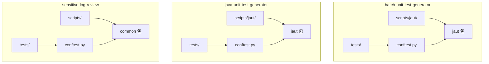
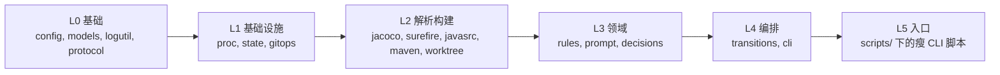
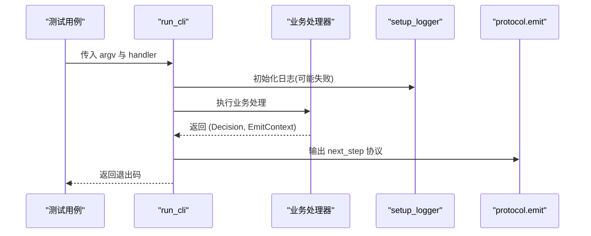
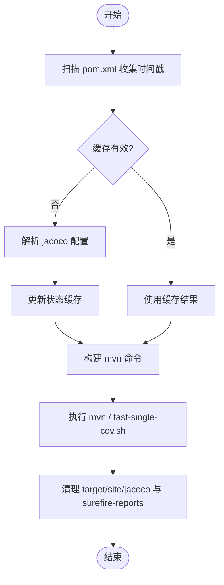
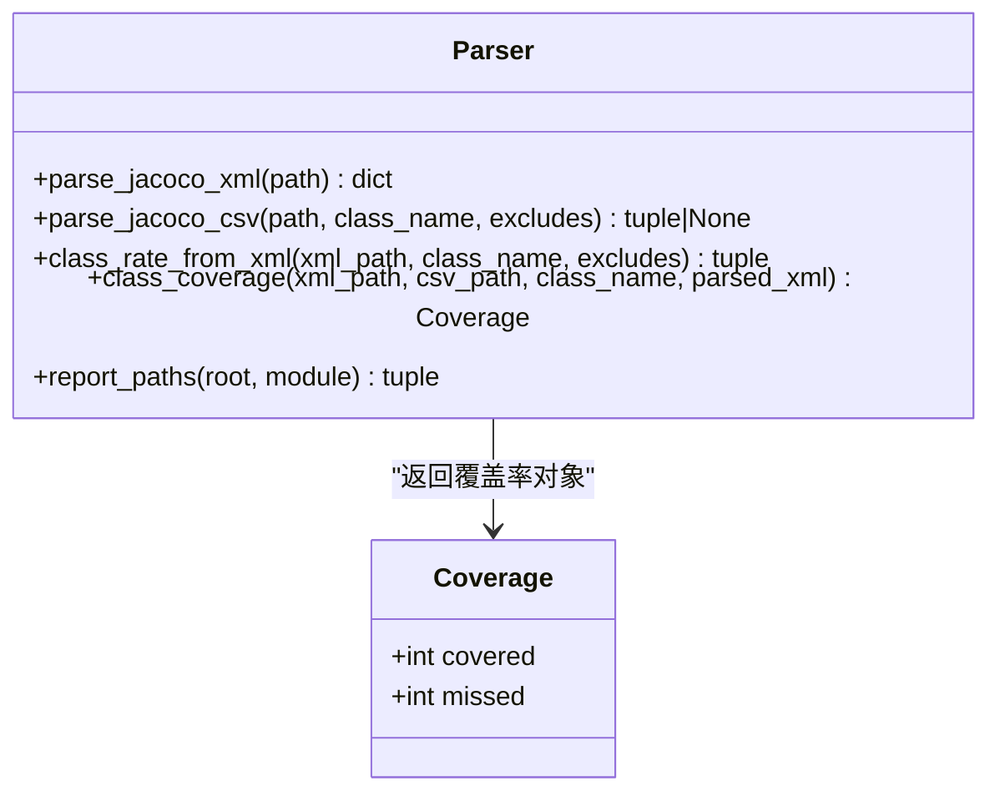
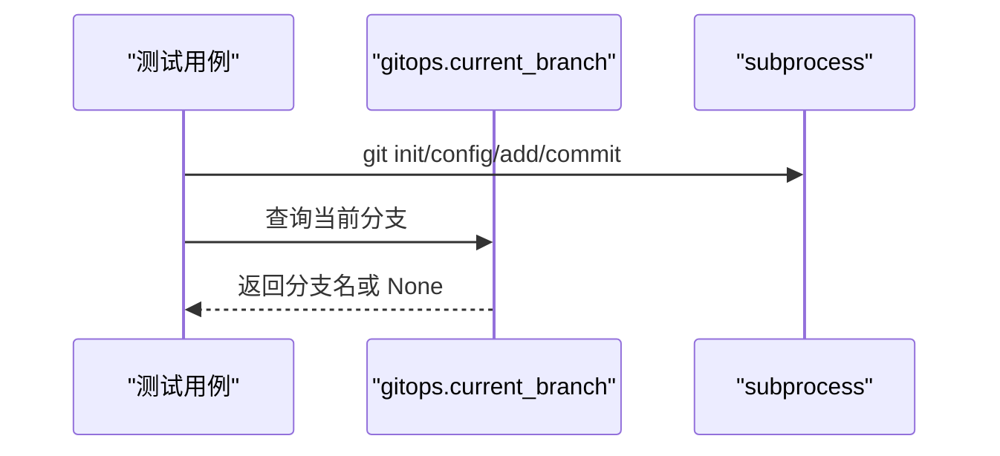
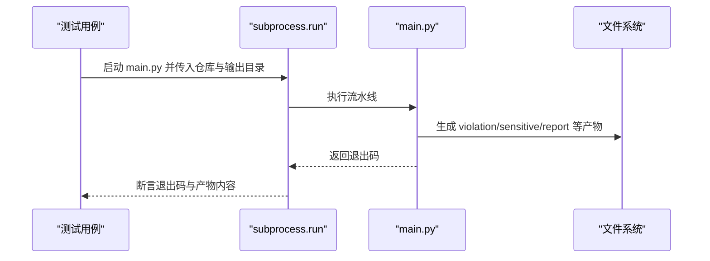
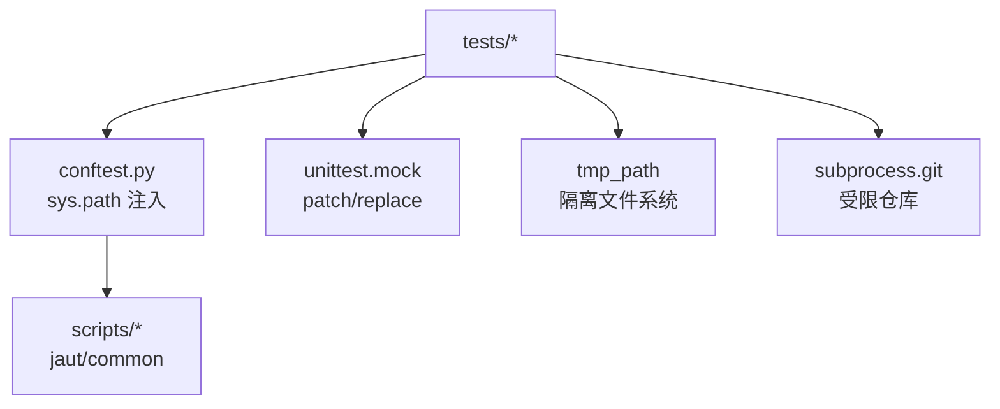

# 测试策略与实践

<cite>
**本文引用的文件**
- [batch-unit-test-generator/tests/conftest.py](file://batch-unit-test-generator/tests/conftest.py)
- [java-unit-test-generator/tests/conftest.py](file://java-unit-test-generator/tests/conftest.py)
- [sensitive-log-review/tests/conftest.py](file://sensitive-log-review/tests/conftest.py)
- [batch-unit-test-generator/tests/test_cli.py](file://batch-unit-test-generator/tests/test_cli.py)
- [batch-unit-test-generator/tests/test_maven.py](file://batch-unit-test-generator/tests/test_maven.py)
- [batch-unit-test-generator/tests/test_jacoco.py](file://batch-unit-test-generator/tests/test_jacoco.py)
- [batch-unit-test-generator/tests/test_gitops.py](file://batch-unit-test-generator/tests/test_gitops.py)
- [sensitive-log-review/tests/test_integration.py](file://sensitive-log-review/tests/test_integration.py)
- [sensitive-log-review/tests/test_common.py](file://sensitive-log-review/tests/test_common.py)
- [batch-unit-test-generator/scripts/jaut/__init__.py](file://batch-unit-test-generator/scripts/jaut/__init__.py)
</cite>

## 目录
1. [简介](#简介)
2. [项目结构](#项目结构)
3. [核心组件](#核心组件)
4. [架构总览](#架构总览)
5. [详细组件分析](#详细组件分析)
6. [依赖关系分析](#依赖关系分析)
7. [性能考虑](#性能考虑)
8. [故障排查指南](#故障排查指南)
9. [结论](#结论)
10. [附录](#附录)

## 简介
本文件为 ping-skills 项目的测试策略与实践指南，面向 pytest 框架的使用、测试组织与最佳实践。内容覆盖单元测试、集成测试与端到端测试的编写规范；夹具（fixtures）设计与复用；CLI、文件系统、外部工具调用与网络请求的测试方法；Mock/Stub 对 Git、Maven、JaCoCo 等外部依赖的模拟；覆盖率测试配置与分析；异步与并行测试实现；测试数据与环境搭建；常见场景示例与调试技巧。目标是确保测试套件能稳定验证功能正确性与稳定性。

## 项目结构
仓库包含多个子工程，每个子工程均遵循“scripts + tests”的布局：
- batch-unit-test-generator：基于 jaut 脚本包的批量单测生成器，测试集中在 tests/ 下，conftest.py 将 scripts/ 加入 sys.path 以便导入 jaut 包。
- java-unit-test-generator：结构与前者类似，测试同样通过 conftest.py 注入脚本路径。
- sensitive-log-review：日志敏感信息审查工具，tests/ 下包含单元与端到端集成测试，conftest.py 将 scripts/common 等模块加入可导入路径。

**图表来源**
- [batch-unit-test-generator/tests/conftest.py:1-11](file://batch-unit-test-generator/tests/conftest.py#L1-L11)
- [java-unit-test-generator/tests/conftest.py:1-11](file://java-unit-test-generator/tests/conftest.py#L1-L11)
- [sensitive-log-review/tests/conftest.py:1-9](file://sensitive-log-review/tests/conftest.py#L1-L9)

**章节来源**
- [batch-unit-test-generator/tests/conftest.py:1-11](file://batch-unit-test-generator/tests/conftest.py#L1-L11)
- [java-unit-test-generator/tests/conftest.py:1-11](file://java-unit-test-generator/tests/conftest.py#L1-L11)
- [sensitive-log-review/tests/conftest.py:1-9](file://sensitive-log-review/tests/conftest.py#L1-L9)

## 核心组件
- CLI 流程与错误处理：test_cli.py 覆盖了 StepError、EmitContext、参数解析、工作目录解析、run_cli 主流程、日志初始化失败兜底、协议输出等关键路径。
- Maven 构建与 JaCoCo 集成：test_maven.py 覆盖 pom 扫描、Jacoco 配置检测、多模块识别、命令构建、执行封装、报告清理、编译错误解析、快速单测覆盖率脚本调用与降级方案。
- JaCoCo 覆盖率解析：test_jacoco.py 覆盖 XML/CSV 解析、内部类聚合、合成方法过滤、排除规则、报告路径选择与边界情况。
- Git 操作：test_gitops.py 使用真实 git 仓库验证分支查询、detached HEAD 与非仓库降级行为。
- 端到端集成：test_integration.py 通过 subprocess 运行 main.py，构造最小 git 仓库，验证完整流水线产物与退出码。
- 通用工具与数据：test_common.py 覆盖路径、文本、字典、POJO 配置、git_utils 校验等基础能力。

这些测试共同构成了从单元到集成的分层验证体系，确保各层职责清晰、耦合可控。

**章节来源**
- [batch-unit-test-generator/tests/test_cli.py:1-275](file://batch-unit-test-generator/tests/test_cli.py#L1-L275)
- [batch-unit-test-generator/tests/test_maven.py:1-800](file://batch-unit-test-generator/tests/test_maven.py#L1-L800)
- [batch-unit-test-generator/tests/test_jacoco.py:1-228](file://batch-unit-test-generator/tests/test_jacoco.py#L1-L228)
- [batch-unit-test-generator/tests/test_gitops.py:1-36](file://batch-unit-test-generator/tests/test_gitops.py#L1-L36)
- [sensitive-log-review/tests/test_integration.py:1-147](file://sensitive-log-review/tests/test_integration.py#L1-L147)
- [sensitive-log-review/tests/test_common.py:1-259](file://sensitive-log-review/tests/test_common.py#L1-L259)

## 架构总览
下图展示了 jaut 脚本包的层次化设计约束，以及测试如何围绕该约束进行分层验证。

**图表来源**
- [batch-unit-test-generator/scripts/jaut/__init__.py:1-23](file://batch-unit-test-generator/scripts/jaut/__init__.py#L1-L23)

**章节来源**
- [batch-unit-test-generator/scripts/jaut/__init__.py:1-23](file://batch-unit-test-generator/scripts/jaut/__init__.py#L1-L23)

## 详细组件分析

### CLI 测试与 run_cli 流程
- 目标：验证命令行参数解析、工作目录解析、错误类型映射、日志初始化失败不影响退出码、协议输出与过渡逻辑。
- 关键点：
  - StepError 携带 Decision，状态码与路由映射明确。
  - add_common_args 统一注入共享参数。
  - resolve_workdir/require_workdir 保证工作目录有效性。
  - run_cli 捕获异常并转换为退出码，同时输出 NEXT_STEP 协议块。

**图表来源**
- [batch-unit-test-generator/tests/test_cli.py:167-275](file://batch-unit-test-generator/tests/test_cli.py#L167-L275)

**章节来源**
- [batch-unit-test-generator/tests/test_cli.py:1-275](file://batch-unit-test-generator/tests/test_cli.py#L1-L275)

### Maven 构建与 JaCoCo 集成测试
- 目标：验证 pom 扫描、Jacoco 配置检测、多模块识别、命令构建、执行封装、报告清理、编译错误解析、快速单测覆盖率脚本调用与降级方案。
- 关键点：
  - _collect_pom_mtimes/_pom_mtimes_valid 提供缓存失效判断。
  - parse_jacoco_config 支持强制刷新与状态缓存更新。
  - build_mvn_cmd 根据 Jacoco 配置动态拼接参数，避免重复 prepare-agent。
  - run_mvn/run_fast_single_cov 封装外部命令执行与超时控制。
  - clean_jacoco_dirs/clean_surefire_dirs 清理中间产物。
  - parse_compile_errors/is_compile_error 解析 mvn.log 中的编译错误。

**图表来源**
- [batch-unit-test-generator/tests/test_maven.py:120-283](file://batch-unit-test-generator/tests/test_maven.py#L120-L283)
- [batch-unit-test-generator/tests/test_maven.py:364-446](file://batch-unit-test-generator/tests/test_maven.py#L364-L446)
- [batch-unit-test-generator/tests/test_maven.py:451-540](file://batch-unit-test-generator/tests/test_maven.py#L451-L540)
- [batch-unit-test-generator/tests/test_maven.py:559-631](file://batch-unit-test-generator/tests/test_maven.py#L559-L631)
- [batch-unit-test-generator/tests/test_maven.py:657-730](file://batch-unit-test-generator/tests/test_maven.py#L657-L730)

**章节来源**
- [batch-unit-test-generator/tests/test_maven.py:1-800](file://batch-unit-test-generator/tests/test_maven.py#L1-L800)

### JaCoCo 覆盖率解析测试
- 目标：验证 XML/CSV 解析、内部类聚合、合成方法过滤、排除规则、报告路径选择与边界情况。
- 关键点：
  - parse_jacoco_xml 聚合内部类方法与特殊方法（<init>/<clinit>），过滤 lambda/access/bridge 合成方法。
  - class_coverage 优先 CSV，回退 XML；支持 excludes 与 parsed_xml 参数优化。
  - report_paths 按模块计算报告路径。

**图表来源**
- [batch-unit-test-generator/tests/test_jacoco.py:42-141](file://batch-unit-test-generator/tests/test_jacoco.py#L42-L141)
- [batch-unit-test-generator/tests/test_jacoco.py:143-228](file://batch-unit-test-generator/tests/test_jacoco.py#L143-L228)

**章节来源**
- [batch-unit-test-generator/tests/test_jacoco.py:1-228](file://batch-unit-test-generator/tests/test_jacoco.py#L1-L228)

### Git 操作测试
- 目标：在真实 git 仓库中验证 current_branch 的行为，包括正常分支、detached HEAD、非仓库降级。
- 关键点：
  - 使用 subprocess 调用 git 命令创建最小仓库。
  - 断言函数在非仓库或 detached 状态下返回 None。

**图表来源**
- [batch-unit-test-generator/tests/test_gitops.py:10-36](file://batch-unit-test-generator/tests/test_gitops.py#L10-L36)

**章节来源**
- [batch-unit-test-generator/tests/test_gitops.py:1-36](file://batch-unit-test-generator/tests/test_gitops.py#L1-L36)

### 端到端集成测试
- 目标：通过 subprocess 运行 main.py，构造最小 git 仓库，验证完整流水线产物与退出码。
- 关键点：
  - 使用 tmp_path 隔离仓库与输出目录。
  - 验证门禁触发/通过的退出码与关键产物文件。
  - 支持 --doctor 环境诊断模式。

**图表来源**
- [sensitive-log-review/tests/test_integration.py:22-50](file://sensitive-log-review/tests/test_integration.py#L22-L50)
- [sensitive-log-review/tests/test_integration.py:89-147](file://sensitive-log-review/tests/test_integration.py#L89-L147)

**章节来源**
- [sensitive-log-review/tests/test_integration.py:1-147](file://sensitive-log-review/tests/test_integration.py#L1-L147)

### 通用工具与数据测试
- 目标：覆盖路径、文本、字典、POJO 配置、git_utils 校验等基础能力。
- 关键点：
  - paths.get_output_dir 优先级：CLI > 环境变量 > 默认临时目录。
  - text.parse_list_line 兼容新旧格式与标签解析。
  - dictionary.SensitiveDicts 分类优先级：白名单 > 黑名单 > 核心 > 扩展。
  - pojo_config.is_pojo_file 基于目录与后缀匹配。

**章节来源**
- [sensitive-log-review/tests/test_common.py:1-259](file://sensitive-log-review/tests/test_common.py#L1-L259)

## 依赖关系分析
- 测试与脚本包依赖：
  - conftest.py 将 scripts/ 加入 sys.path，使 tests 可直接导入 jaut/common 等模块。
  - test_cli 依赖 jaut.cli、jaut.models；test_maven 依赖 jaut.maven、jaut.config、jaut.models；test_jacoco 依赖 jaut.jacoco、jaut.models.coverage_rate。
- 外部依赖模拟：
  - 使用 unittest.mock.patch 对 run_command、resolve_tool、setup_logger、protocol.emit 等进行替换，避免真实执行外部命令或写入日志。
  - 通过 tmp_path 构造临时文件与目录，隔离文件系统影响。
- 真实外部工具：
  - Git：在 test_gitops.py 与 test_integration.py 中使用真实 git 命令，但限制在 tmp_path 内，避免污染宿主环境。
  - Maven/JaCoCo：通过 patch 避免实际执行，仅在必要时检查脚本与 jar 存在性。

**图表来源**
- [batch-unit-test-generator/tests/conftest.py:1-11](file://batch-unit-test-generator/tests/conftest.py#L1-L11)
- [sensitive-log-review/tests/conftest.py:1-9](file://sensitive-log-review/tests/conftest.py#L1-L9)
- [batch-unit-test-generator/tests/test_maven.py:451-477](file://batch-unit-test-generator/tests/test_maven.py#L451-L477)
- [batch-unit-test-generator/tests/test_cli.py:187-275](file://batch-unit-test-generator/tests/test_cli.py#L187-L275)
- [batch-unit-test-generator/tests/test_gitops.py:10-36](file://batch-unit-test-generator/tests/test_gitops.py#L10-L36)
- [sensitive-log-review/tests/test_integration.py:22-50](file://sensitive-log-review/tests/test_integration.py#L22-L50)

**章节来源**
- [batch-unit-test-generator/tests/conftest.py:1-11](file://batch-unit-test-generator/tests/conftest.py#L1-L11)
- [java-unit-test-generator/tests/conftest.py:1-11](file://java-unit-test-generator/tests/conftest.py#L1-L11)
- [sensitive-log-review/tests/conftest.py:1-9](file://sensitive-log-review/tests/conftest.py#L1-L9)

## 性能考虑
- 缓存与增量：maven.parse_jacoco_config 使用状态缓存与时间戳校验，减少重复解析开销；测试覆盖缓存命中与失效场景。
- 命令执行超时：run_mvn/run_fast_single_cov 支持超时参数，测试验证 config.mvn_timeout 与显式传参的优先级。
- 报告清理：clean_jacoco_dirs/clean_surefire_dirs 及时清理中间产物，避免磁盘占用与后续干扰。
- 解析优化：jacoco.class_coverage 支持传入已解析的 parsed_xml，避免重复 XML 解析。

[本节为一般性指导，不直接分析具体文件]

## 故障排查指南
- CLI 日志初始化失败：run_cli 在 setup_logger 抛出异常时忽略并继续执行，确保退出码由业务逻辑决定。
- 外部命令不可用：build_mvn_cmd 在 resolve_tool 返回 None 时返回 None；run_mvn_test_with_jacoco 在未找到 mvn 时返回 ok=False。
- 覆盖率脚本缺失：run_fast_single_cov 检查脚本与 jar 存在性，缺失时返回 ok=False。
- 非仓库环境：gitops.current_branch 在非仓库或 detached HEAD 时返回 None，测试覆盖这些边界。
- 集成测试产物缺失：test_integration 断言关键产物文件存在且内容符合预期，便于定位流水线问题。

**章节来源**
- [batch-unit-test-generator/tests/test_cli.py:221-240](file://batch-unit-test-generator/tests/test_cli.py#L221-L240)
- [batch-unit-test-generator/tests/test_maven.py:425-430](file://batch-unit-test-generator/tests/test_maven.py#L425-L430)
- [batch-unit-test-generator/tests/test_maven.py:750-757](file://batch-unit-test-generator/tests/test_maven.py#L750-L757)
- [batch-unit-test-generator/tests/test_maven.py:692-718](file://batch-unit-test-generator/tests/test_maven.py#L692-L718)
- [batch-unit-test-generator/tests/test_gitops.py:23-36](file://batch-unit-test-generator/tests/test_gitops.py#L23-L36)
- [sensitive-log-review/tests/test_integration.py:89-147](file://sensitive-log-review/tests/test_integration.py#L89-L147)

## 结论
本测试策略以分层验证为核心，结合夹具复用、Mock/Stub 与临时文件系统，确保单元测试快速稳定、集成测试覆盖关键路径、端到端测试验证整体流程。通过缓存、超时与清理机制提升性能与可维护性。建议持续完善边界与异常场景覆盖，保持测试与实现的同步演进。

[本节为总结性内容，不直接分析具体文件]

## 附录

### 测试夹具（fixtures）设计与复用策略
- 路径注入：conftest.py 将 scripts/ 加入 sys.path，使所有测试可导入 jaut/common 等模块，避免在每个测试中重复设置。
- 临时仓库：test_integration 与 test_gitops 使用 tmp_path 构造最小 git 仓库，隔离测试环境。
- 资源准备：test_maven 中的 _ensure_jacoco_script 确保 jacoco agent/cli jar 存在并在测试后清理。
- 参数化：test_common 使用 @pytest.mark.parametrize 覆盖多种输入与边界条件。

**章节来源**
- [batch-unit-test-generator/tests/conftest.py:1-11](file://batch-unit-test-generator/tests/conftest.py#L1-L11)
- [java-unit-test-generator/tests/conftest.py:1-11](file://java-unit-test-generator/tests/conftest.py#L1-L11)
- [sensitive-log-review/tests/conftest.py:1-9](file://sensitive-log-review/tests/conftest.py#L1-L9)
- [batch-unit-test-generator/tests/test_maven.py:636-655](file://batch-unit-test-generator/tests/test_maven.py#L636-L655)
- [sensitive-log-review/tests/test_common.py:43-50](file://sensitive-log-review/tests/test_common.py#L43-L50)

### 外部依赖模拟（Mock/Stub）指南
- Git：使用 subprocess 在 tmp_path 内执行 git 命令，避免影响宿主仓库；对 gitops 函数断言返回值。
- Maven：patch run_command/resolve_tool，验证命令构建与参数传递；不实际执行 mvn。
- JaCoCo：通过 patch __file__ 与临时目录模拟脚本与 jar 存在性；断言 ok 标志与命令片段。
- CLI：patch setup_logger/protocol.emit，验证日志初始化失败不影响退出码与协议输出。

**章节来源**
- [batch-unit-test-generator/tests/test_gitops.py:10-36](file://batch-unit-test-generator/tests/test_gitops.py#L10-L36)
- [batch-unit-test-generator/tests/test_maven.py:451-477](file://batch-unit-test-generator/tests/test_maven.py#L451-L477)
- [batch-unit-test-generator/tests/test_maven.py:692-718](file://batch-unit-test-generator/tests/test_maven.py#L692-L718)
- [batch-unit-test-generator/tests/test_cli.py:187-275](file://batch-unit-test-generator/tests/test_cli.py#L187-L275)

### 覆盖率测试配置与分析方法
- 配置位置：scripts/jacoco/fast-single-cov.sh 与 lib/ 下的 jacocoagent.jar/jacococli.jar。
- 测试覆盖：test_maven 验证脚本与 jar 存在性、命令参数与超时；test_jacoco 验证 XML/CSV 解析与聚合。
- 分析要点：关注内部类聚合、合成方法过滤、排除规则与报告路径选择；确保覆盖率统计准确。

**章节来源**
- [batch-unit-test-generator/tests/test_maven.py:636-730](file://batch-unit-test-generator/tests/test_maven.py#L636-L730)
- [batch-unit-test-generator/tests/test_jacoco.py:42-141](file://batch-unit-test-generator/tests/test_jacoco.py#L42-L141)

### 异步测试与并行测试
- 异步测试：当前仓库未见 asyncio/async def 用例；如需引入，建议使用 pytest-asyncio 并隔离外部 I/O。
- 并行测试：可使用 pytest-xdist 并行执行；注意隔离文件系统（tmp_path）、避免共享状态与并发写冲突。

[本节为一般性指导，不直接分析具体文件]

### 测试数据管理与环境搭建
- 数据管理：使用 tmp_path 创建临时仓库与输出目录；通过 fixture 集中管理数据生命周期。
- 环境搭建：conftest.py 注入脚本路径；集成测试通过 subprocess 启动 main.py，传入仓库与输出目录。
- 最佳实践：避免硬编码路径；使用相对路径与常量；清理临时资源。

**章节来源**
- [sensitive-log-review/tests/test_integration.py:22-50](file://sensitive-log-review/tests/test_integration.py#L22-L50)
- [batch-unit-test-generator/tests/conftest.py:1-11](file://batch-unit-test-generator/tests/conftest.py#L1-L11)
- [sensitive-log-review/tests/conftest.py:1-9](file://sensitive-log-review/tests/conftest.py#L1-L9)

### 常见测试场景示例与调试技巧
- CLI 参数解析：参考 test_cli 中对 add_common_args 与 resolve_workdir 的断言。
- Maven 命令构建：参考 test_maven 中对 build_mvn_cmd 的参数组合与 always flags 验证。
- JaCoCo 解析：参考 test_jacoco 中对 XML/CSV 解析与 excludes 的断言。
- 调试技巧：使用 capsys 捕获 stdout/stderr；通过 patch 缩小测试范围；利用 tmp_path 隔离文件系统。

**章节来源**
- [batch-unit-test-generator/tests/test_cli.py:82-151](file://batch-unit-test-generator/tests/test_cli.py#L82-L151)
- [batch-unit-test-generator/tests/test_maven.py:364-446](file://batch-unit-test-generator/tests/test_maven.py#L364-L446)
- [batch-unit-test-generator/tests/test_jacoco.py:42-141](file://batch-unit-test-generator/tests/test_jacoco.py#L42-L141)