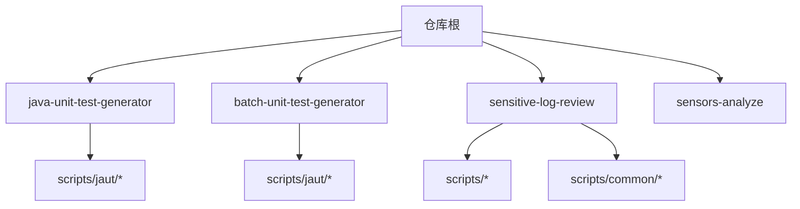
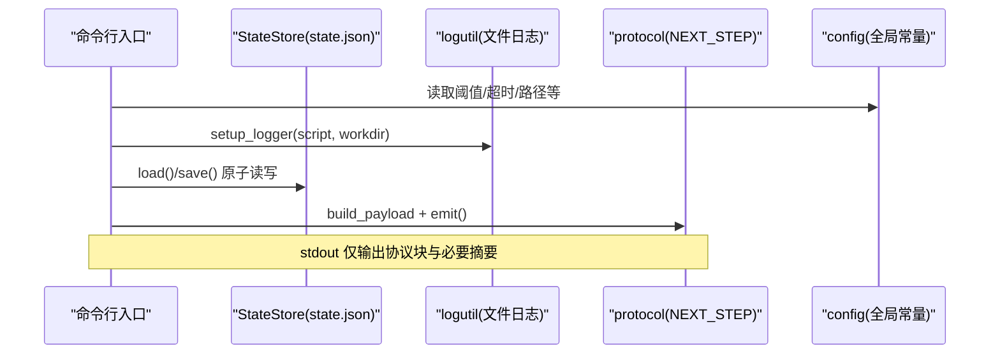
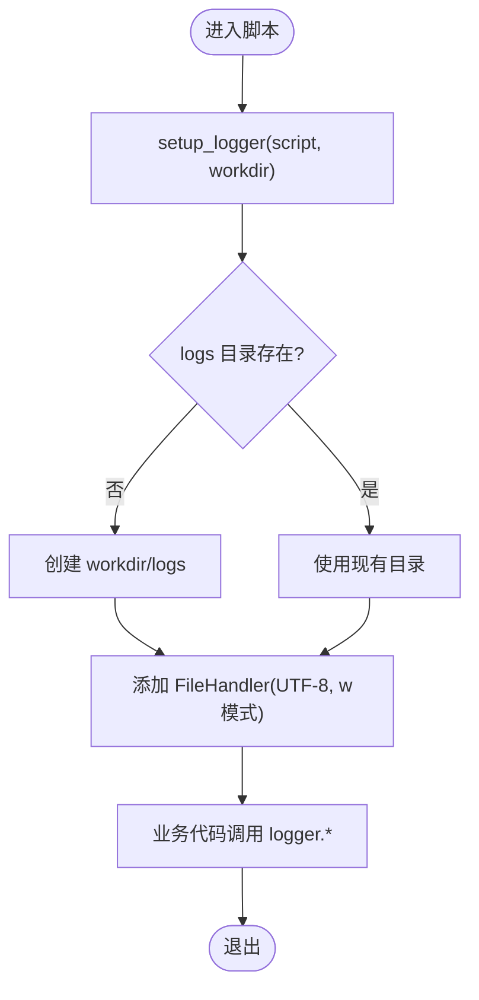
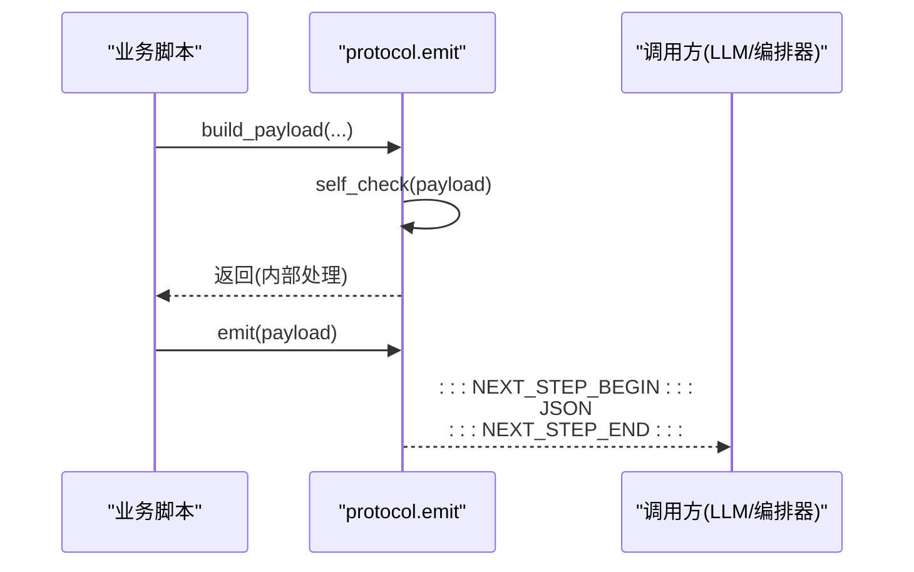
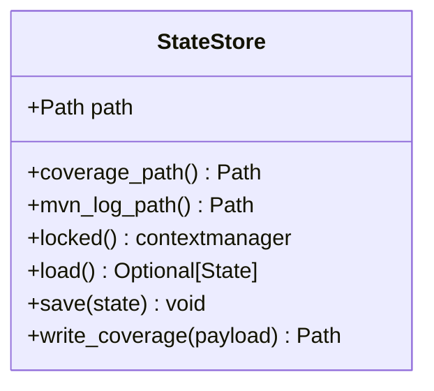
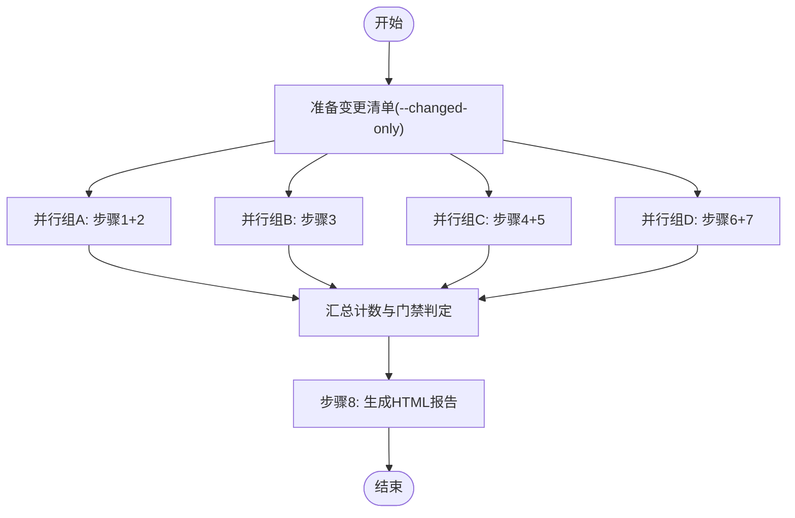
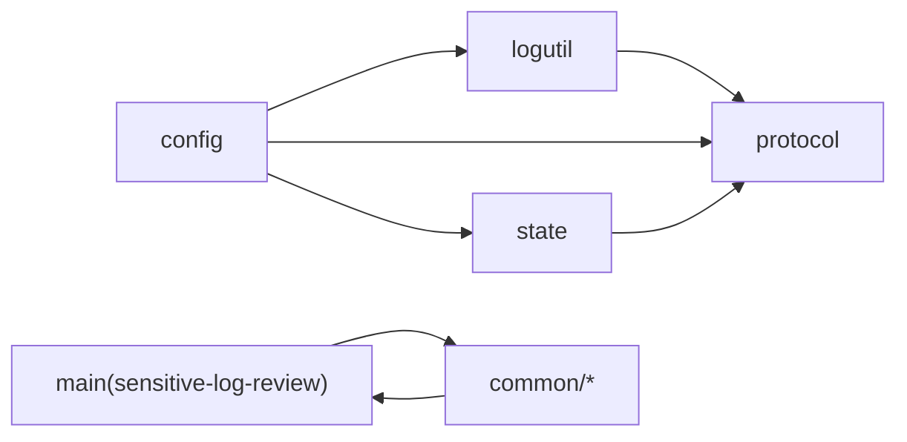

# 调试技巧与工具

<cite>
**本文引用的文件**
- [README.md](file://README.md)
- [CLAUDE.md](file://CLAUDE.md)
- [AGENTS.md](file://AGENTS.md)
- [install.sh](file://install.sh)
- [batch-unit-test-generator/scripts/jaut/logutil.py](file://batch-unit-test-generator/scripts/jaut/logutil.py)
- [java-unit-test-generator/scripts/jaut/logutil.py](file://java-unit-test-generator/scripts/jaut/logutil.py)
- [batch-unit-test-generator/scripts/jaut/config.py](file://batch-unit-test-generator/scripts/jaut/config.py)
- [java-unit-test-generator/scripts/jaut/config.py](file://java-unit-test-generator/scripts/jaut/config.py)
- [batch-unit-test-generator/scripts/jaut/protocol.py](file://batch-unit-test-generator/scripts/jaut/protocol.py)
- [java-unit-test-generator/scripts/jaut/state.py](file://java-unit-test-generator/scripts/jaut/state.py)
- [sensitive-log-review/scripts/main.py](file://sensitive-log-review/scripts/main.py)
- [sensitive-log-review/scripts/common/errors.py](file://sensitive-log-review/scripts/common/errors.py)
- [sensitive-log-review/scripts/common/failures.py](file://sensitive-log-review/scripts/common/failures.py)
- [sensitive-log-review/scripts/java_log_scanner.py](file://sensitive-log-review/scripts/java_log_scanner.py)
</cite>

## 目录
1. [简介](#简介)
2. [项目结构](#项目结构)
3. [核心组件](#核心组件)
4. [架构总览](#架构总览)
5. [详细组件分析](#详细组件分析)
6. [依赖关系分析](#依赖关系分析)
7. [性能考虑](#性能考虑)
8. [故障排查指南](#故障排查指南)
9. [结论](#结论)
10. [附录](#附录)

## 简介
本指南面向 ping-skills 仓库中的四个 agent skill（单元测试生成、批量单元测试生成、敏感日志审查、埋点分析），聚焦“如何高效调试”。内容覆盖：
- Python 调试器使用（pdb）与 IDE 调试配置要点
- 日志系统设计与使用（级别、格式化、输出目标）
- 复杂业务流程调试（状态机转换、文件操作、外部工具调用）
- 常见问题诊断（权限、路径、依赖冲突）
- AI 助手交互协议消息与状态同步调试
- 性能分析与瓶颈定位
- 远程调试与容器化环境调试技巧
- 常用调试工具与实用脚本

## 项目结构
该仓库由多个独立 skill 组成，每个 skill 包含 SKILL.md、references/、protocol/、scripts/、tests/。测试通过 pytest 在各自 skill 目录下运行；脚本为纯 Python stdlib（除测试外）。安装脚本将 skill 复制到目标项目的 .<tool>/skills 下并清理非必要文件。

**图表来源**
- [CLAUDE.md:5-14](file://CLAUDE.md#L5-L14)
- [AGENTS.md:5-14](file://AGENTS.md#L5-L14)

**章节来源**
- [CLAUDE.md:5-14](file://CLAUDE.md#L5-L14)
- [AGENTS.md:5-14](file://AGENTS.md#L5-L14)

## 核心组件
- 统一配置中心：集中阈值、预算、超时、路径模板、协议枚举等常量，便于调试时快速定位行为差异。
- 日志子系统：按脚本隔离写入 workdir/logs/<script>.log，避免污染 stdout（仅保留 NEXT_STEP 协议块与显式摘要）。
- 协议层：NEXT_STEP 协议负载构建、自检与 stdout 输出，确保 LLM/编排器可解析。
- 状态存储：state.json 原子读写与迁移，支持断点续跑与并发安全。
- 错误与失败记录：结构化错误码与修复建议；分片合并的失败清单，保证并行安全。
- 编排主流程：敏感日志审查的多链路并行执行、产物汇总与 HTML 报告生成。

**章节来源**
- [batch-unit-test-generator/scripts/jaut/config.py:11-131](file://batch-unit-test-generator/scripts/jaut/config.py#L11-L131)
- [java-unit-test-generator/scripts/jaut/config.py:11-151](file://java-unit-test-generator/scripts/jaut/config.py#L11-L151)
- [batch-unit-test-generator/scripts/jaut/logutil.py:1-76](file://batch-unit-test-generator/scripts/jaut/logutil.py#L1-L76)
- [java-unit-test-generator/scripts/jaut/logutil.py:1-76](file://java-unit-test-generator/scripts/jaut/logutil.py#L1-L76)
- [batch-unit-test-generator/scripts/jaut/protocol.py:1-105](file://batch-unit-test-generator/scripts/jaut/protocol.py#L1-L105)
- [java-unit-test-generator/scripts/jaut/state.py:1-165](file://java-unit-test-generator/scripts/jaut/state.py#L1-L165)
- [sensitive-log-review/scripts/common/errors.py:1-100](file://sensitive-log-review/scripts/common/errors.py#L1-L100)
- [sensitive-log-review/scripts/common/failures.py:1-101](file://sensitive-log-review/scripts/common/failures.py#L1-L101)
- [sensitive-log-review/scripts/main.py:1-800](file://sensitive-log-review/scripts/main.py#L1-L800)

## 架构总览
下图展示单元测试技能中“脚本 → 状态 → 协议”的关键交互，以及敏感日志审查的主编排流程。

**图表来源**
- [batch-unit-test-generator/scripts/jaut/config.py:11-131](file://batch-unit-test-generator/scripts/jaut/config.py#L11-L131)
- [batch-unit-test-generator/scripts/jaut/logutil.py:24-44](file://batch-unit-test-generator/scripts/jaut/logutil.py#L24-L44)
- [batch-unit-test-generator/scripts/jaut/protocol.py:28-105](file://batch-unit-test-generator/scripts/jaut/protocol.py#L28-L105)
- [java-unit-test-generator/scripts/jaut/state.py:77-165](file://java-unit-test-generator/scripts/jaut/state.py#L77-L165)

## 详细组件分析

### 日志子系统（logutil）
- 设计要点
  - 每个脚本一个专属 logger，写入 <workdir>/logs/<script>.log，不挂控制台 handler，确保 stdout 纯净。
  - 模块级兜底 logger 用于未 setup 时的工具函数调用，落盘到临时目录 common.log。
  - 日志格式与日期格式集中在 config 中统一管理。
- 调试建议
  - 遇到“看不到日志”：确认已调用 setup_logger 且 workdir 存在；检查 logs 子目录是否创建成功。
  - 遇到“stdout 被污染”：确认没有直接 print 到 stdout，只允许协议块与显式摘要。
  - 多进程/多线程：不同脚本/工作目录会复用缓存的 logger，避免重复 handler。

**图表来源**
- [batch-unit-test-generator/scripts/jaut/logutil.py:24-44](file://batch-unit-test-generator/scripts/jaut/logutil.py#L24-L44)
- [java-unit-test-generator/scripts/jaut/logutil.py:24-44](file://java-unit-test-generator/scripts/jaut/logutil.py#L24-L44)
- [batch-unit-test-generator/scripts/jaut/config.py:121-125](file://batch-unit-test-generator/scripts/jaut/config.py#L121-L125)

**章节来源**
- [batch-unit-test-generator/scripts/jaut/logutil.py:1-76](file://batch-unit-test-generator/scripts/jaut/logutil.py#L1-L76)
- [java-unit-test-generator/scripts/jaut/logutil.py:1-76](file://java-unit-test-generator/scripts/jaut/logutil.py#L1-L76)
- [batch-unit-test-generator/scripts/jaut/config.py:121-125](file://batch-unit-test-generator/scripts/jaut/config.py#L121-L125)

### 协议层（NEXT_STEP）
- 职责
  - 构建负载：协议版本、脚本名、状态、退出码、摘要、制品、指标、下一步动作。
  - 轻量自检：必填键、枚举值合法性，非法仅告警不阻断。
  - 输出：以标记包裹 JSON 块输出到 stdout，之后不应再打印任何内容。
- 调试建议
  - 若 LLM/编排器无法解析：检查 emit 前后是否有额外输出；查看 self_check 警告。
  - 序列化失败：协议层会降级输出错误协议块，便于快速定位问题。

**图表来源**
- [batch-unit-test-generator/scripts/jaut/protocol.py:28-105](file://batch-unit-test-generator/scripts/jaut/protocol.py#L28-L105)

**章节来源**
- [batch-unit-test-generator/scripts/jaut/protocol.py:1-105](file://batch-unit-test-generator/scripts/jaut/protocol.py#L1-L105)

### 状态存储（state.json）
- 设计要点
  - 原子写入：临时文件 + os.replace + fsync，避免半截状态破坏断点续跑。
  - 并发安全：跨平台文件锁（POSIX fcntl / Windows msvcrt），保护 load→修改→save。
  - 迁移管道：schema_version 顺序升级，缺失迁移时报错提示。
- 调试建议
  - 断点续跑异常：检查 state.json.lock 残留（超过 24h 会告警）；必要时手动清理。
  - 状态损坏：load 失败视为缺失，调用方可按状态错误流转（exit 3）。

**图表来源**
- [java-unit-test-generator/scripts/jaut/state.py:77-165](file://java-unit-test-generator/scripts/jaut/state.py#L77-L165)

**章节来源**
- [java-unit-test-generator/scripts/jaut/state.py:1-165](file://java-unit-test-generator/scripts/jaut/state.py#L1-L165)

### 敏感日志审查主流程（main.py）
- 设计要点
  - 四链路并行：步骤1/2、步骤3、步骤4/5、步骤6/7，最后步骤8生成 HTML 报告。
  - 产物管理：各步骤产出清单文件，最终汇总计数与门禁判定。
  - 环境诊断：--doctor 只做检查（Python、Java、Git、checkstyle jar、规则/词典文件、输出目录可写性）。
- 调试建议
  - 并行失败：查看 StepResult.ok/error 与汇总计数；关注 run_script 的返回码与 stderr。
  - 产物缺失：使用 print_result_table 列出产物清单，快速定位缺失环节。
  - 门禁误触发：核对 --fail-on 参数与各步骤 summary 计数。

**图表来源**
- [sensitive-log-review/scripts/main.py:187-298](file://sensitive-log-review/scripts/main.py#L187-L298)
- [sensitive-log-review/scripts/main.py:353-505](file://sensitive-log-review/scripts/main.py#L353-L505)

**章节来源**
- [sensitive-log-review/scripts/main.py:1-800](file://sensitive-log-review/scripts/main.py#L1-L800)

### 错误与失败记录
- 结构化错误：统一错误码与修复建议，stderr 输出，保持 CI 友好。
- 失败分片：各步骤独立写出 failed-files.<step>.part，主流程合并为 failed-files.list，行完整性校验防止损坏影响汇总。
- 调试建议
  - 权限/路径问题：结合 ErrorCode 的修复建议逐项排查。
  - 并行竞争：确认各步骤写入的是自己的分片，避免覆盖。

**章节来源**
- [sensitive-log-review/scripts/common/errors.py:1-100](file://sensitive-log-review/scripts/common/errors.py#L1-L100)
- [sensitive-log-review/scripts/common/failures.py:1-101](file://sensitive-log-review/scripts/common/failures.py#L1-L101)

### 外部工具调用与进度保护
- Maven 超时与进度：通过环境变量覆盖超时；定期输出 mvn_progress.json 防止主 Agent 误判无响应。
- Git 命令超时：防止 NFS/网络挂起导致阻塞。
- 调试建议
  - 长时间无输出：检查 MVN_PROGRESS_INTERVAL_SECONDS 与 mvn_progress.json 更新情况。
  - 超时策略：两段式终止（SIGTERM 宽限后 SIGKILL），必要时调整 MVN_KILL_GRACE_SECONDS。

**章节来源**
- [batch-unit-test-generator/scripts/jaut/config.py:81-118](file://batch-unit-test-generator/scripts/jaut/config.py#L81-L118)
- [java-unit-test-generator/scripts/jaut/config.py:101-131](file://java-unit-test-generator/scripts/jaut/config.py#L101-L131)
- [batch-unit-test-generator/scripts/jaut/config.py:128-131](file://batch-unit-test-generator/scripts/jaut/config.py#L128-L131)

## 依赖关系分析
- 配置依赖：两个 unit-test skills 共享 jaut 引擎但已分化，修改需同时 diff 两套并运行各自测试套件。
- 日志依赖：logutil 依赖 config 的日志格式与命名空间；module_logger 提供兜底能力。
- 协议依赖：protocol 依赖 config 的协议版本与枚举；emit 后禁止后续 stdout 输出。
- 状态依赖：state 依赖 config 的路径与 schema 版本；并发锁避免竞态。
- 编排依赖：main.py 依赖 common 工具与规则/词典文件；--doctor 严格检查环境。

**图表来源**
- [batch-unit-test-generator/scripts/jaut/config.py:11-131](file://batch-unit-test-generator/scripts/jaut/config.py#L11-L131)
- [batch-unit-test-generator/scripts/jaut/logutil.py:1-76](file://batch-unit-test-generator/scripts/jaut/logutil.py#L1-L76)
- [batch-unit-test-generator/scripts/jaut/protocol.py:1-105](file://batch-unit-test-generator/scripts/jaut/protocol.py#L1-L105)
- [java-unit-test-generator/scripts/jaut/state.py:1-165](file://java-unit-test-generator/scripts/jaut/state.py#L1-L165)
- [sensitive-log-review/scripts/main.py:1-800](file://sensitive-log-review/scripts/main.py#L1-L800)

**章节来源**
- [CLAUDE.md:49-51](file://CLAUDE.md#L49-L51)
- [AGENTS.md:41-45](file://AGENTS.md#L41-L45)

## 性能考虑
- 日志 I/O：按脚本隔离写入，避免大文件混写；必要时限制日志级别或采样。
- 并行度：敏感日志审查采用线程池并行四链路，注意资源争用（磁盘、JDK/Git）。
- 超时控制：Maven/Git 命令设置合理超时，避免长尾阻塞。
- 产物大小：HTML 报告含折叠详情，避免过大；必要时裁剪预览行数。

[本节为通用指导，无需特定文件引用]

## 故障排查指南

### 常见错误与修复
- 非 git 仓库：E001，确认 -r 指向仓库根目录。
- 找不到 java：E002，安装 JRE/JDK 并加入 PATH。
- 分支无效：E003，核对分支名与存在性。
- 规则 JSON 损坏：E004，修复语法并用 json.tool 验证。
- run-id 非法：E005，仅允许字母数字及有限符号，长度限制。
- 输出目录不可写：E006，检查权限与磁盘空间。
- checkstyle jar SHA256 不符：E007，重新获取或更新基线。

**章节来源**
- [sensitive-log-review/scripts/common/errors.py:18-100](file://sensitive-log-review/scripts/common/errors.py#L18-L100)

### 路径与权限问题
- 工作目录：默认位于 <project-root>/.agent/<skill-name>/，可通过环境变量或参数覆盖。
- 日志目录：workdir/logs/<script>.log，确保可写。
- 产物目录：敏感日志审查默认 SLR_OUTPUT_DIR 或系统临时目录，--run-id 用于并行隔离。

**章节来源**
- [batch-unit-test-generator/scripts/jaut/config.py:14-30](file://batch-unit-test-generator/scripts/jaut/config.py#L14-L30)
- [java-unit-test-generator/scripts/jaut/config.py:14-30](file://java-unit-test-generator/scripts/jaut/config.py#L14-L30)
- [sensitive-log-review/scripts/main.py:705-729](file://sensitive-log-review/scripts/main.py#L705-L729)

### 依赖冲突与环境问题
- 工具链：Python >= 3.10，Java 与 Git 可用性由 --doctor 检查。
- 规则/词典：必须存在且可解析，版本头建议补充。
- 安装脚本：install.sh 支持选择工具与 skill，自动剥离无关文件。

**章节来源**
- [sensitive-log-review/scripts/main.py:582-702](file://sensitive-log-review/scripts/main.py#L582-L702)
- [install.sh:1-289](file://install.sh#L1-L289)

### 与 AI 助手的交互调试（协议消息与状态同步）
- 协议块位置：stdout 末尾，以标记包裹 JSON 块；之后不应再有输出。
- 状态同步：state.json 原子写入，确保 LLM 与脚本对状态一致；resume 通过 workdir 恢复。
- 调试方法：捕获 stdout 与协议块；检查 next_step.type/status；查看日志与产物。

**章节来源**
- [batch-unit-test-generator/scripts/jaut/protocol.py:28-105](file://batch-unit-test-generator/scripts/jaut/protocol.py#L28-L105)
- [java-unit-test-generator/scripts/jaut/state.py:77-165](file://java-unit-test-generator/scripts/jaut/state.py#L77-L165)
- [CLAUDE.md:38-48](file://CLAUDE.md#L38-L48)

### 性能分析与瓶颈定位
- Maven 执行：监控 mvn_progress.json 与 mvn.log，识别慢阶段。
- 并行链路：观察线程池任务耗时，定位串行瓶颈（如文件 IO）。
- 扫描范围：--changed-only 减少扫描量；全量扫描时关注 Java 文件数量。

**章节来源**
- [batch-unit-test-generator/scripts/jaut/config.py:81-118](file://batch-unit-test-generator/scripts/jaut/config.py#L81-L118)
- [sensitive-log-review/scripts/main.py:165-175](file://sensitive-log-review/scripts/main.py#L165-L175)

### 调试工具与实用脚本
- pytest：在 skill 目录下运行 tests/，支持单文件/单用例过滤。
- install.sh：交互式选择工具与 skill，复制并清理非必要文件。
- main.py --doctor：环境诊断，快速发现工具链与配置问题。

**章节来源**
- [CLAUDE.md:16-34](file://CLAUDE.md#L16-L34)
- [AGENTS.md:16-28](file://AGENTS.md#L16-L28)
- [install.sh:1-289](file://install.sh#L1-L289)
- [sensitive-log-review/scripts/main.py:582-702](file://sensitive-log-review/scripts/main.py#L582-L702)

### 远程调试与容器化环境
- 远程调试：在目标容器中启动 Python 服务并暴露调试端口，IDE 连接远程解释器；确保日志输出到容器卷以便持久化。
- 容器内调试：挂载 workdir/logs 与产物目录，便于查看中间结果；使用 --doctor 预检环境。
- 网络与权限：确保容器内 Java/Git 可用，输出目录可写。

[本节为通用指导，无需特定文件引用]

## 结论
通过统一的配置、日志、协议与状态管理机制，ping-skills 提供了稳定可控的自动化流程。调试时应优先利用日志与协议块定位问题，结合 --doctor 与环境检查快速排除基础问题；对于复杂流程，借助并行链路产物与失败分片进行归因。遵循本文方法与图示，可显著提升问题定位效率。

[本节为总结，无需特定文件引用]

## 附录

### 快速排障清单
- 确认 workdir/logs 存在且可写
- 检查 stdout 是否仅包含协议块与必要摘要
- 使用 --doctor 验证环境与依赖
- 核对 state.json 与 schema_version，必要时清理残留锁
- 查看产物清单与失败分片，定位具体步骤

**章节来源**
- [batch-unit-test-generator/scripts/jaut/logutil.py:24-44](file://batch-unit-test-generator/scripts/jaut/logutil.py#L24-L44)
- [batch-unit-test-generator/scripts/jaut/protocol.py:74-105](file://batch-unit-test-generator/scripts/jaut/protocol.py#L74-L105)
- [sensitive-log-review/scripts/main.py:582-702](file://sensitive-log-review/scripts/main.py#L582-L702)
- [java-unit-test-generator/scripts/jaut/state.py:93-128](file://java-unit-test-generator/scripts/jaut/state.py#L93-L128)