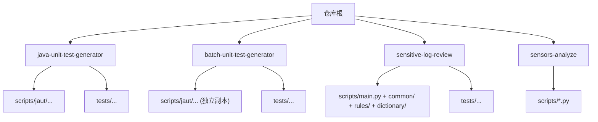
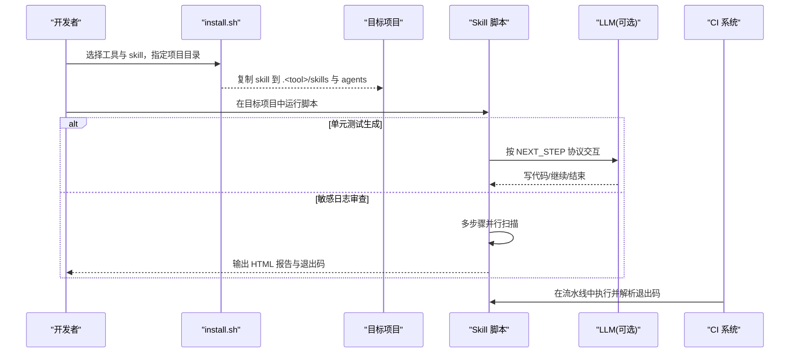
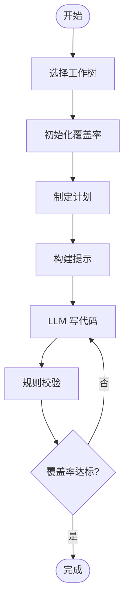
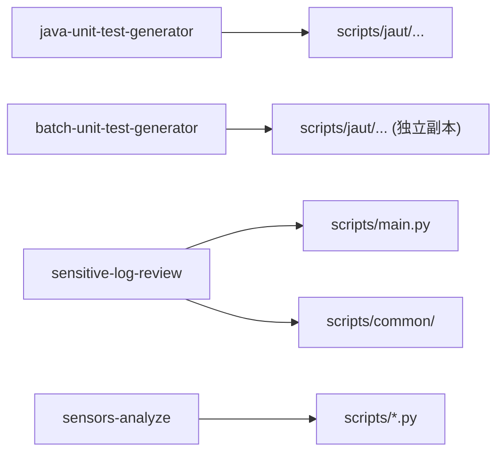

# 贡献指南

<cite>
**本文引用的文件**
- [README.md](file://README.md)
- [AGENTS.md](file://AGENTS.md)
- [CLAUDE.md](file://CLAUDE.md)
- [install.sh](file://install.sh)
- [sensitive-log-review/README.md](file://sensitive-log-review/README.md)
- [sensors-analyze/CLAUDE.md](file://sensors-analyze/CLAUDE.md)
- [java-unit-test-generator/scripts/validate_rules.py](file://java-unit-test-generator/scripts/validate_rules.py)
- [batch-unit-test-generator/scripts/validate_rules.py](file://batch-unit-test-generator/scripts/validate_rules.py)
- [java-unit-test-generator/tests/test_worktree.py](file://java-unit-test-generator/tests/test_worktree.py)
- [batch-unit-test-generator/tests/test_worktree.py](file://batch-unit-test-generator/tests/test_worktree.py)
</cite>

## 目录
1. [简介](#简介)
2. [项目结构](#项目结构)
3. [核心组件](#核心组件)
4. [架构总览](#架构总览)
5. [详细组件分析](#详细组件分析)
6. [依赖分析](#依赖分析)
7. [性能考虑](#性能考虑)
8. [故障排查指南](#故障排查指南)
9. [结论](#结论)
10. [附录](#附录)

## 简介
本贡献指南面向希望参与 ping-skills 项目的开发者与贡献者。该项目由四个独立的“技能（skill）”组成，每个 skill 都是自包含的 Python 工具与文档集合，用于在目标项目中安装并运行：
- java-unit-test-generator：为单个 Java 类生成 JUnit5 + Mockito 测试，直至满足 JaCoCo 覆盖率阈值
- batch-unit-test-generator：基于分支差异批量对多个类执行同样的测试生成流程
- sensitive-log-review：审计 Java 变更中的敏感信息泄露风险，输出 HTML 报告与 CI 门禁判定
- sensors-analyze：盘点与校验埋点调用，产出可追溯的 CSV 清单

本指南将帮助你完成环境搭建、依赖安装、开发工具配置；说明 Fork 与分支工作流、提交规范、合并策略；详述 Pull Request 的创建与审查要求；提供新功能开发的完整示例；并给出 Bug 报告与建议提交流程以及社区行为准则。

## 项目结构
仓库根目录不包含统一构建脚本，所有命令均在对应 skill 目录下执行。每个 skill 通常包含：
- SKILL.md：触发条件与工作流说明
- references/ 与 protocol/：规则与协议 JSON Schema
- scripts/：Python 驱动脚本（仅使用标准库）
- tests/：pytest 单测套件

**图表来源**
- [AGENTS.md:5-14](file://AGENTS.md#L5-L14)
- [CLAUDE.md:5-14](file://CLAUDE.md#L5-L14)

**章节来源**
- [AGENTS.md:5-14](file://AGENTS.md#L5-L14)
- [CLAUDE.md:5-14](file://CLAUDE.md#L5-L14)

## 核心组件
- 安装器 install.sh：支持选择目标工具（claude/qwen/qoder/opencode/all），交互式或命令行方式将 skill 复制到目标项目的 .<tool>/skills 与 .<tool>/agents 目录，并按目标工具清理不必要的行与目录。
- 单元测试生成引擎（jaut）：两个 unit-test skills 各自携带一份 jaut 引擎副本，存在分歧，修改共享逻辑需同时对比并运行两套单测。
- 敏感日志审查流水线：多步骤并行扫描，汇总生成 HTML 报告与门禁退出码。
- 埋点分析流水线：LLM 与 Python 协作，产出 sensors.json、entry.txt、call_sites.json、sensors.csv 等产物，并提供校验与归档。

**章节来源**
- [install.sh:1-289](file://install.sh#L1-L289)
- [CLAUDE.md:36-65](file://CLAUDE.md#L36-L65)
- [sensitive-log-review/README.md:30-55](file://sensitive-log-review/README.md#L30-L55)
- [sensors-analyze/CLAUDE.md:11-47](file://sensors-analyze/CLAUDE.md#L11-L47)

## 架构总览
整体采用“技能即工具”的架构：每个 skill 通过 install.sh 部署到目标项目，并在目标项目中以脚本形式运行。unit-test 系列遵循 NEXT_STEP 协议，通过状态机驱动 LLM 与脚本协作；sensitive-log-review 是多阶段并行扫描管线；sensors-analyze 是 LLM+脚本的混合流水线。

**图表来源**
- [install.sh:144-204](file://install.sh#L144-L204)
- [CLAUDE.md:38-48](file://CLAUDE.md#L38-L48)
- [sensitive-log-review/README.md:30-55](file://sensitive-log-review/README.md#L30-L55)

## 详细组件分析

### 安装与开发环境搭建
- 环境要求
  - Python 3.10+（部分脚本使用类型标注语法）
  - Git（用于变更计算与 worktree）
  - 单元测试生成：Java Runtime（运行 Maven/Surefire/JaCoCo）
  - 敏感日志审查：Checkstyle 13.7.0 jar（内置）、Java Runtime
  - 埋点分析：ripgrep（可选，回退到纯 Python grep）
- 安装方式
  - 在项目根目录运行 install.sh，选择工具与 skill，指定目标项目路径
  - 非 qoder/qwen 目标会移除 SKILL.md 中的 tools 行
  - 自动删除 tests、__pycache__、.pytest_cache、test.log 等非必要内容
- 本地测试
  - 进入具体 skill 目录，使用 pytest 运行全部或单个测试
  - 每个 skill 的 tests/conftest.py 会将 scripts 加入 sys.path，便于导入 common 模块

**章节来源**
- [AGENTS.md:16-28](file://AGENTS.md#L16-L28)
- [CLAUDE.md:16-34](file://CLAUDE.md#L16-L34)
- [install.sh:144-204](file://install.sh#L144-L204)
- [sensitive-log-review/README.md:57-111](file://sensitive-log-review/README.md#L57-L111)
- [sensors-analyze/CLAUDE.md:23-51](file://sensors-analyze/CLAUDE.md#L23-L51)

### 分支命名与提交规范
- 分支命名约定
  - 建议以功能或修复域前缀组织，如 feature/sensitive-log-review/xxx、fix/java-unit-test-generator/yyy
  - 避免特殊字符与过长名称，保持可读性
- 提交信息规范
  - 使用简短祈使句主题，带作用域，例如：sensitive-log-review: fix log-print false positive
  - 正文描述变更动机、影响范围、测试结果与 CLI 输出截图（如有行为变化）
- 合并策略
  - 推荐小步快跑、频繁 PR；PR 应关联 Issue 或需求编号
  - 合并前确保相关 skill 的单测通过，必要时运行全量套件

**章节来源**
- [AGENTS.md:47-49](file://AGENTS.md#L47-L49)

### Pull Request 流程与审查
- 创建 PR
  - 清晰描述变更内容与影响到的 skill
  - 列出已运行的测试套件与结果
  - 附带 CLI 输出或截图（行为变更时）
  - 同步更新 README.md 与 SKILL.md 中与脚本标志位和退出码相关的文档
- 审查要点
  - 是否符合 NEXT_STEP 协议与 Schema 优先原则
  - 是否只修改 src/test/java/**（单元测试生成场景）
  - 敏感日志审查的退出码契约与 --fail-on 配置是否正确
  - 埋点分析的约束是否遵守（不修改目标代码、CSV 无动态占位符等）
- 反馈处理
  - 根据审查意见增量提交，保持 PR 历史整洁
  - 若涉及共享逻辑变更，需同时对比两份 jaut 副本并运行两套单测

**章节来源**
- [AGENTS.md:47-49](file://AGENTS.md#L47-L49)
- [CLAUDE.md:38-51](file://CLAUDE.md#L38-L51)
- [sensitive-log-review/README.md:167-174](file://sensitive-log-review/README.md#L167-L174)
- [sensors-analyze/CLAUDE.md:59-69](file://sensors-analyze/CLAUDE.md#L59-L69)

### 代码风格与命名约定
- 缩进：4 空格
- 导入：优先 from __future__ import annotations，路径操作优先 pathlib
- 命名：函数/模块/文件 snake_case；类 PascalCase；测试文件 test_<subject>.py
- 依赖：脚本保持无第三方依赖（仅 pytest 用于测试）；公共逻辑放入 scripts/common/
- 格式化：未配置 linter/formatter，遵循现有代码风格与 docstring 风格

**章节来源**
- [AGENTS.md:30-35](file://AGENTS.md#L30-L35)

### 测试指南
- 使用 pytest，遵循现有框架与约定
- 新增测试应与相关逻辑相邻，用例命名 test_<behavior>
- 覆盖失败路径、退出码与协议 next_step 分支
- 注意：sensors-analyze 当前无测试套件

**章节来源**
- [AGENTS.md:37-39](file://AGENTS.md#L37-L39)

### 新功能开发全流程示例（以敏感日志审查为例）
- 需求分析
  - 明确要新增的检查维度或规则（如新增一类敏感词或新的日志模式）
  - 评估对退出码与 --fail-on 的影响
- 设计与实现
  - 在 scripts/rules/ 或 scripts/dictionary/ 中添加规则或词典条目
  - 如需新步骤，参考 main.py 的并行链路设计，新增步骤并确保错误处理与产物格式一致
  - 严格遵循退出码契约：0=通过，1=门禁拦截，2=执行错误
- 测试与验证
  - 编写或补充 pytest 用例，覆盖新增逻辑与边界情况
  - 本地运行全量单测，确认无回归
  - 使用 --doctor 检查环境，使用 --full-scan 验证全量扫描
- 文档更新
  - 更新 README.md 与 SKILL.md，同步参数、退出码与产物说明
- 提交流程
  - 提交符合规范的 commit，创建 PR，附上 CLI 输出与报告样例
  - 根据审查意见迭代，确保两套 jaut（如涉及）均通过

**章节来源**
- [sensitive-log-review/README.md:20-55](file://sensitive-log-review/README.md#L20-L55)
- [sensitive-log-review/README.md:167-174](file://sensitive-log-review/README.md#L167-L174)
- [sensitive-log-review/README.md:238-358](file://sensitive-log-review/README.md#L238-L358)

### 单元测试生成工作流（NEXT_STEP 协议）
- 典型循环：select_worktree → init_coverage → make_plan → build_prompt → LLM write_code → validate_rules → verify_coverage
- 协议要点：
  - 脚本 stdout 结尾输出 :::NEXT_STEP_BEGIN:::/:::NEXT_STEP_END::: JSON 块
  - exit codes：0=完成，1=继续，2=脚本错误，3=状态/协议错误
  - 冲突优先级：Schema > references/UnitTestRules.md > SKILL.md > LLM 判断
  - 硬边界：仅允许修改 src/test/java/**，禁止改动生产代码、pom.xml 或 state.json
- 双副本注意事项：
  - java-unit-test-generator 与 batch-unit-test-generator 各自维护 jaut 副本，修改共享逻辑需 diff 两者并运行两套单测

**图表来源**
- [CLAUDE.md:38-48](file://CLAUDE.md#L38-L48)

**章节来源**
- [CLAUDE.md:38-51](file://CLAUDE.md#L38-L51)
- [java-unit-test-generator/scripts/validate_rules.py:56-84](file://java-unit-test-generator/scripts/validate_rules.py#L56-L84)
- [batch-unit-test-generator/scripts/validate_rules.py:56-84](file://batch-unit-test-generator/scripts/validate_rules.py#L56-L84)

### 埋点分析工作流（sensors-analyze）
- 五步流程：
  1) LLM 产出 sensors.json（需通过 schema 校验）
  2) extract_entries.py 提取入口候选 entry.txt（需人工 # CONFIRMED）
  3) locate_call_sites.py 定位调用点 call_sites.json
  4) LLM 追踪调用链，填充 sensors.csv
  5) check_report.py 校验一致性，review_report.py 预审并追加 illegal_reason
  6) report_manager.py 归档与差异对比
- 关键约束：
  - 不修改目标代码库
  - CSV 字段必须为具体值，不允许动态占位符
  - page_name 等关键字段应为非空（空值产生 WARN）
  - 脚本仅使用标准库，prefer ripgrep 但可回退

**章节来源**
- [sensors-analyze/CLAUDE.md:11-47](file://sensors-analyze/CLAUDE.md#L11-L47)
- [sensors-analyze/CLAUDE.md:53-69](file://sensors-analyze/CLAUDE.md#L53-L69)

## 依赖分析
- 运行时依赖
  - Python 3.10+（类型标注语法）
  - Git（变更计算、worktree）
  - Java Runtime（单元测试生成与 Checkstyle）
  - Checkstyle 13.7.0 jar（敏感日志审查 POJO 注释检查）
  - ripgrep（埋点分析可选加速）
- 开发期依赖
  - pytest（测试套件）
- 内部依赖关系
  - 两个 unit-test skills 各自包含 jaut 引擎副本，存在分歧
  - sensitive-log-review 的 main.py 编排多个子脚本，common/ 提供共享能力
  - sensors-analyze 的脚本之间通过 JSON/CSV 文件传递中间产物

**图表来源**
- [CLAUDE.md:49-55](file://CLAUDE.md#L49-L55)
- [sensitive-log-review/README.md:95-108](file://sensitive-log-review/README.md#L95-L108)

**章节来源**
- [CLAUDE.md:49-55](file://CLAUDE.md#L49-L55)
- [sensitive-log-review/README.md:95-108](file://sensitive-log-review/README.md#L95-L108)

## 性能考虑
- 敏感日志审查默认仅扫描变更文件（--changed-only），速度更快；必要时使用 --full-scan 全量扫描
- 并行链路：main.py 使用线程池将八个步骤组织为四条并行链路，提升吞吐
- 埋点分析 prefer ripgrep，若无则回退到纯 Python grep，保证可用性
- 单元测试生成：通过 NEXT_STEP 协议减少无效迭代，聚焦写码与校验

[本节为通用指导，无需特定文件引用]

## 故障排查指南
- 敏感日志审查常见问题
  - 控制台中文乱码：设置 PYTHONIOENCODING=utf-8
  - 不是 git 仓库：显式传入 -r 指向仓库根
  - 找不到 java：安装 JRE/JDK 并确保 PATH
  - 变更检查无结果：指定正确的 --branch 或使用 --full-scan
  - 误报/漏报：按白名单/黑名单/词典层级调整，并递增版本头
  - CI 门禁失败：查看 HTML 报告与产物清单，定位具体文件与行号
  - run-id 非法字符：仅允许字母数字/._-，且首字符为字母数字，最长 64 字符
  - jar SHA256 校验失败：重新获取可信 jar 或同步更新基线
  - --doctor 诊断：逐项检查环境与依赖
- 单元测试生成问题
  - 状态/协议错误：检查 state.json 与协议字段，遵循 Schema 优先
  - 连续违规升级：达到上限后 ask_user 并携带 resume 选项
- 埋点分析问题
  - 未通过 schema：先校验 sensors.json
  - 未标记 # CONFIRMED：locate_call_sites.py 不会执行
  - CSV 含动态占位符：改为具体值或留空（产生 WARN）

**章节来源**
- [sensitive-log-review/README.md:361-483](file://sensitive-log-review/README.md#L361-L483)
- [java-unit-test-generator/scripts/validate_rules.py:56-84](file://java-unit-test-generator/scripts/validate_rules.py#L56-L84)
- [batch-unit-test-generator/scripts/validate_rules.py:56-84](file://batch-unit-test-generator/scripts/validate_rules.py#L56-L84)
- [sensors-analyze/CLAUDE.md:23-69](file://sensors-analyze/CLAUDE.md#L23-L69)

## 结论
ping-skills 提供了四个高度内聚、职责清晰的技能工具。贡献者应遵循统一的编码风格、测试规范与提交规范，理解各技能的协议与退出码契约，并在修改共享逻辑时兼顾双副本一致性。通过 install.sh 快速部署、pytest 保障质量、CLI 输出与报告辅助排障，能够高效地为项目做出贡献。

[本节为总结性内容，无需特定文件引用]

## 附录

### 环境搭建与依赖安装清单
- Python 3.10+
- Git 2.0+
- Java Runtime（单元测试生成与 Checkstyle）
- Checkstyle 13.7.0 jar（敏感日志审查）
- pytest（测试）
- ripgrep（埋点分析可选）

**章节来源**
- [AGENTS.md:16-28](file://AGENTS.md#L16-L28)
- [sensitive-log-review/README.md:57-67](file://sensitive-log-review/README.md#L57-L67)
- [sensors-analyze/CLAUDE.md:23-51](file://sensors-analyze/CLAUDE.md#L23-L51)

### 分支与提交规范速查
- 分支：feature/<domain>/<desc>、fix/<domain>/<desc>
- 提交：短祈使句主题，带作用域；正文描述动机、影响与测试结果
- 合并：小步快跑，关联 Issue，确保单测通过

**章节来源**
- [AGENTS.md:47-49](file://AGENTS.md#L47-L49)

### Pull Request 模板要点
- 变更描述与影响范围
- 受影响 skill 列表
- 已运行测试套件与结果
- CLI 输出或截图（行为变更）
- 文档同步说明（README/SKILL.md）

**章节来源**
- [AGENTS.md:47-49](file://AGENTS.md#L47-L49)

### 行为准则与沟通规范
- 尊重与包容：保持专业与友善的交流氛围
- 透明与协作：公开讨论决策依据，记录关键结论
- 质量优先：以测试与文档保障变更质量
- 安全合规：遵循金融领域敏感数据处理规范（如 JR/T 0171-2020）

[本节为通用准则，无需特定文件引用]