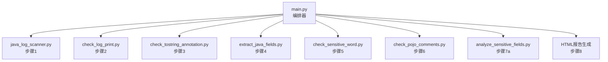
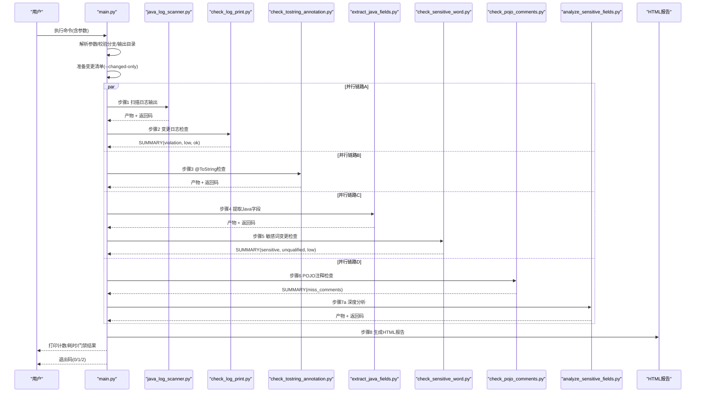
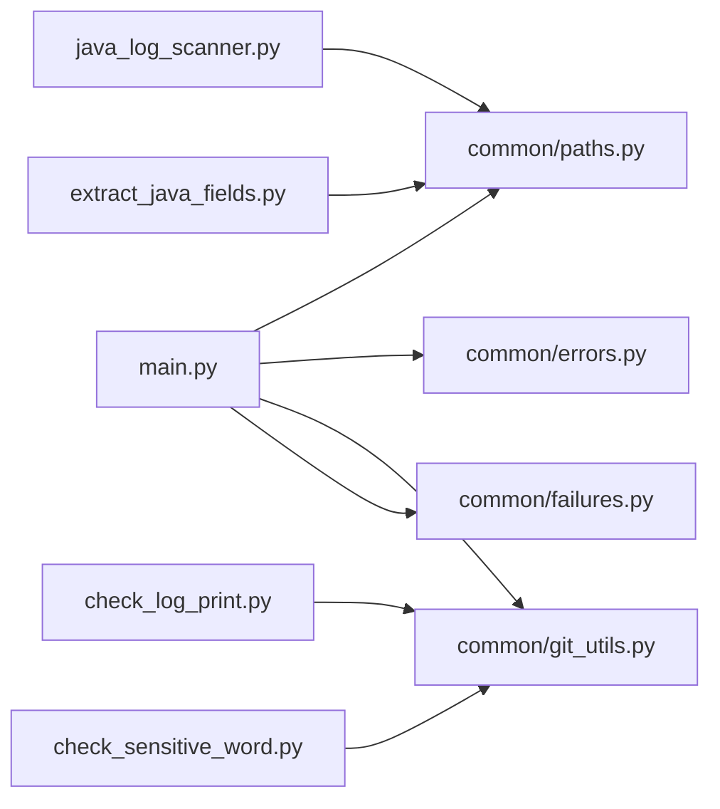

# 命令行接口

<cite>
**本文引用的文件**
- [main.py](file://sensitive-log-review/scripts/main.py)
- [check_log_print.py](file://sensitive-log-review/scripts/check_log_print.py)
- [check_sensitive_word.py](file://sensitive-log-review/scripts/check_sensitive_word.py)
- [extract_java_fields.py](file://sensitive-log-review/scripts/extract_java_fields.py)
- [java_log_scanner.py](file://sensitive-log-review/scripts/java_log_scanner.py)
- [paths.py](file://sensitive-log-review/scripts/common/paths.py)
- [errors.py](file://sensitive-log-review/scripts/common/errors.py)
- [README.md](file://sensitive-log-review/README.md)
- [SKILL.md](file://sensitive-log-review/SKILL.md)
</cite>

## 目录
1. [简介](#简介)
2. [项目结构](#项目结构)
3. [核心组件](#核心组件)
4. [架构总览](#架构总览)
5. [详细组件分析](#详细组件分析)
6. [依赖关系分析](#依赖关系分析)
7. [性能与并行执行](#性能与并行执行)
8. [故障排查指南](#故障排查指南)
9. [结论](#结论)
10. [附录：命令示例与CI模板](#附录命令示例与ci模板)

## 简介
本参考文档面向“敏感信息日志审查工具”的命令行接口，覆盖所有参数、运行模式、退出码契约、错误处理机制、--doctor 环境诊断、严格模式、批量与并行配置，以及 CI/CD 集成最佳实践。该工具围绕 Java 项目的日志输出合规性、@ToString 注解规范、字段命名与敏感性、POJO 注释完整性及深度敏感性分析，生成 HTML 报告并支持门禁判定。

## 项目结构
- 编排入口：scripts/main.py（四链路并行编排步骤1-8）
- 子脚本：
  - java_log_scanner.py（步骤1：扫描日志输出）
  - check_log_print.py（步骤2：变更日志检查）
  - check_tostring_annotation.py（步骤3：@ToString 注解检查）
  - extract_java_fields.py（步骤4：提取Java字段）
  - check_sensitive_word.py（步骤5：敏感词变更检查）
  - check_pojo_comments.py（步骤6：POJO 注释检查）
  - analyze_sensitive_fields.py（步骤7a：规则初筛）
- 公共模块：common/*（路径、词典、git、失败记录、错误码等）
- 规则与词典：rules/*、dictionary/*
- 产物：输出目录下的一系列 .list/.results/.fields/.html 文件

图表来源
- [main.py:187-269](file://sensitive-log-review/scripts/main.py#L187-L269)
- [main.py:353-505](file://sensitive-log-review/scripts/main.py#L353-L505)

章节来源
- [README.md:30-54](file://sensitive-log-review/README.md#L30-L54)
- [SKILL.md:70-157](file://sensitive-log-review/SKILL.md#L70-L157)

## 核心组件
- 编排器 main.py：解析参数、准备变更清单、四链路并行执行、汇总计数、生成报告、门禁判定与退出码决策。
- 子脚本：各自负责具体检查任务，通过 stdout 中的 SUMMARY 行或产物文件与编排器交互。
- 公共模块：
  - paths.py：输出目录策略与产物文件名常量
  - errors.py：统一错误码与修复建议
  - git_utils/pojo_config/dictionary/java_lexer/text/failures：仓库操作、POJO识别、词典加载、词法分析、失败记录等

章节来源
- [main.py:705-729](file://sensitive-log-review/scripts/main.py#L705-L729)
- [paths.py:1-69](file://sensitive-log-review/scripts/common/paths.py#L1-L69)
- [errors.py:18-100](file://sensitive-log-review/scripts/common/errors.py#L18-L100)

## 架构总览
主流程为“准备变更清单 → 四链路并行 → 汇总统计 → 生成报告 → 门禁判定”。

图表来源
- [main.py:187-269](file://sensitive-log-review/scripts/main.py#L187-L269)
- [main.py:777-856](file://sensitive-log-review/scripts/main.py#L777-L856)

## 详细组件分析

### 命令行参数（main.py）
- --branch/-b：目标分支名称，默认 master；用于 git diff 对比基准
- --root/-r：项目根目录/gi t仓库目录，默认当前目录
- --output-dir/-o：产物输出目录，优先级高于环境变量 SLR_OUTPUT_DIR
- --run-id：CI并行隔离的子目录名，仅允许安全字符集且首字符为字母数字，最长64位
- --fail-on：门禁计数项，逗号分隔；可选值包括 violation/sensitive/unqualified/tostring/tostring_sensitive/analyze/miss_comments/low；传空串关闭门禁
- --changed-only/--full-scan：切换仅变更扫描与全量扫描
- --strict-mode：存在读取/解析失败文件时以退出码2结束
- --doctor：环境诊断模式，优先于其他执行参数
- --verbose/-v：详细输出

章节来源
- [main.py:705-729](file://sensitive-log-review/scripts/main.py#L705-L729)
- [paths.py:44-63](file://sensitive-log-review/scripts/common/paths.py#L44-L63)

### 运行模式
- 变更扫描模式（默认 --changed-only）：基于 git diff 计算变更 Java/POJO 清单，仅扫描变更文件，速度快
- 全量扫描模式（--full-scan）：扫描全部 Java 文件，速度慢但覆盖面广

章节来源
- [main.py:11-13](file://sensitive-log-review/scripts/main.py#L11-L13)
- [main.py:300-322](file://sensitive-log-review/scripts/main.py#L300-L322)
- [README.md:50-53](file://sensitive-log-review/README.md#L50-L53)

### 退出码契约
- 0：通过（未触发 --fail-on 指定类别）
- 1：门禁触发（任一 --fail-on 类别计数 > 0）
- 2：执行错误（关键步骤失败、环境/参数/依赖问题、严格模式下存在失败文件）

章节来源
- [main.py:15-22](file://sensitive-log-review/scripts/main.py#L15-L22)
- [main.py:805-856](file://sensitive-log-review/scripts/main.py#L805-L856)
- [README.md:167-174](file://sensitive-log-review/README.md#L167-L174)

### 错误处理机制
- 结构化错误码 E001-E007：非 git 仓库、找不到 java、分支非法、规则 JSON 损坏、run-id 非法、输出目录不可写、jar SHA256 校验不符
- 各子脚本在异常时记录失败文件分片，最终汇总到 failed-files.list
- 严格模式下，存在失败文件即视为执行错误（退出码2）

章节来源
- [errors.py:18-100](file://sensitive-log-review/scripts/common/errors.py#L18-L100)
- [main.py:740-756](file://sensitive-log-review/scripts/main.py#L740-L756)
- [main.py:818-851](file://sensitive-log-review/scripts/main.py#L818-L851)

### --doctor 环境诊断
- 功能：逐项检查 Python/java/git 可用性、-r 是否为 git 仓库、checkstyle jar 存在性与 SHA256 校验、规则与词典文件可解析性、输出目录可写性、PYTHONIOENCODING
- 输出：[OK]/[FAIL]/[WARN] 标记的诊断清单
- 退出码：全部通过返回0，任一 FAIL 返回2（WARN不计入失败）
- 优先级：与其他执行参数同时传入时 doctor 优先

章节来源
- [main.py:533-702](file://sensitive-log-review/scripts/main.py#L533-L702)
- [README.md:459-469](file://sensitive-log-review/README.md#L459-L469)

### 严格模式
- 影响范围：当存在读取/解析失败文件（failedFiles > 0）时，以退出码2结束
- 默认行为：仅统计与展示，不影响退出码
- 适用场景：CI 中需严格拦截不完整扫描结果

章节来源
- [main.py:723-724](file://sensitive-log-review/scripts/main.py#L723-L724)
- [main.py:846-851](file://sensitive-log-review/scripts/main.py#L846-L851)
- [README.md:251-252](file://sensitive-log-review/README.md#L251-L252)

### 子脚本参数要点
- check_log_print.py：--repo/-b/--fail-on-low/-o/--run-id/-v；SUMMARY 包含 violation/low/ok
- check_sensitive_word.py：--repo/-b/--fail-on-low/-o/--run-id/-v；SUMMARY 包含 sensitive/low/unqualified
- extract_java_fields.py：project_root、--files/-o/--run-id；输出 all-fields.list/unqualified.fields/maybe-sensitive.fields
- java_log_scanner.py：project_root、--files/-o/--run-id；输出 log-print-ok.list/log-print-violation.list

章节来源
- [check_log_print.py:96-136](file://sensitive-log-review/scripts/check_log_print.py#L96-L136)
- [check_sensitive_word.py:113-153](file://sensitive-log-review/scripts/check_sensitive_word.py#L113-L153)
- [extract_java_fields.py:117-146](file://sensitive-log-review/scripts/extract_java_fields.py#L117-L146)
- [java_log_scanner.py:1-22](file://sensitive-log-review/scripts/java_log_scanner.py#L1-L22)

## 依赖关系分析
- main.py 依赖 common.* 提供路径、错误、git、失败记录等功能
- 子脚本通过 common.git_utils 获取变更文件，通过 common.paths 管理产物路径
- 规则与词典由 rules/* 与 dictionary/* 提供，被多个脚本共享

图表来源
- [main.py:41-75](file://sensitive-log-review/scripts/main.py#L41-L75)
- [paths.py:1-69](file://sensitive-log-review/scripts/common/paths.py#L1-L69)
- [errors.py:18-100](file://sensitive-log-review/scripts/common/errors.py#L18-L100)

章节来源
- [main.py:41-75](file://sensitive-log-review/scripts/main.py#L41-L75)
- [paths.py:1-69](file://sensitive-log-review/scripts/common/paths.py#L1-L69)

## 性能与并行执行
- 四链路并行：使用 ThreadPoolExecutor(max_workers=4) 并行执行链路A-D，目标全流程 <60s
- 变更扫描模式显著减少扫描范围，提升速度
- 失败文件超过已处理文件总数10%时醒目告警，提示结果可能不完整

章节来源
- [main.py:777-785](file://sensitive-log-review/scripts/main.py#L777-L785)
- [main.py:833-841](file://sensitive-log-review/scripts/main.py#L833-L841)
- [README.md:30-54](file://sensitive-log-review/README.md#L30-L54)

## 故障排查指南
- 控制台中文乱码：设置 PYTHONIOENCODING=utf-8
- 不是 git 仓库：确保 -r 指向包含 .git 的仓库根
- 找不到 java：安装 JRE/JDK 并确保 PATH 中包含 java
- 变更检查无结果：确认 --branch 正确、CI 完整历史检出、必要时使用 --full-scan
- run-id 非法：仅允许 [A-Za-z0-9._-]，首字符必须为字母或数字，最长64字符
- jar SHA256 校验失败：从可信源重新获取 jar 或更新基线文件
- --doctor 排障：逐项检查环境，按 [FAIL] 提示修复后重试

章节来源
- [README.md:363-469](file://sensitive-log-review/README.md#L363-L469)
- [errors.py:31-81](file://sensitive-log-review/scripts/common/errors.py#L31-L81)

## 结论
本工具的命令行接口提供了灵活的参数与环境控制能力，支持变更扫描与全量扫描两种模式，具备完善的退出码契约与结构化错误处理。--doctor 与 --strict-mode 分别用于环境诊断与严格拦截，配合 --run-id 实现 CI 并行隔离。通过四链路并行与产物化报告，可在保证性能的同时提供详尽的可审计结果。

## 附录：命令示例与CI模板

### 常用命令示例
- 基本变更检查（对比 master）：python scripts/main.py -r .
- 对比指定分支：python scripts/main.py -r . --branch develop
- 全量扫描：python scripts/main.py -r . --full-scan
- 指定输出目录：python scripts/main.py -r . -o ./review-output
- CI 并行隔离：python scripts/main.py -r . -o ./review-output --run-id build-1024
- 自定义门禁：python scripts/main.py -r . --fail-on violation,sensitive,unqualified
- 关闭门禁：python scripts/main.py -r . --fail-on ""
- 详细输出：python scripts/main.py -r . -v
- 环境诊断：python scripts/main.py --doctor -r .

章节来源
- [README.md:129-160](file://sensitive-log-review/README.md#L129-L160)

### CI/CD 集成最佳实践
- Jenkins Pipeline：设置 PYTHONIOENCODING=utf-8，使用 --branch origin/master，-o 指定输出目录，--run-id 隔离产物，依据退出码区分门禁与执行错误，归档产物
- GitHub Actions：checkout 使用 fetch-depth: 0，setup-python/setup-java，设置 env.PYTHONIOENCODING，运行审查并上传 artifact

章节来源
- [README.md:175-234](file://sensitive-log-review/README.md#L175-L234)