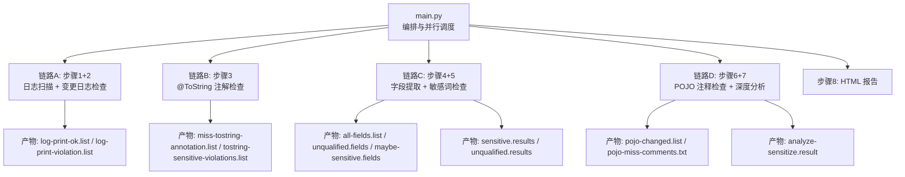
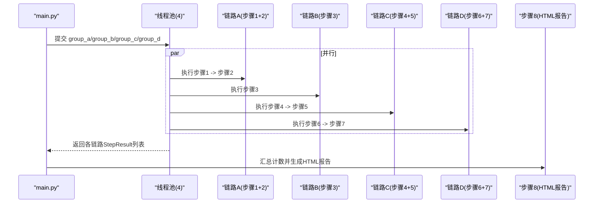
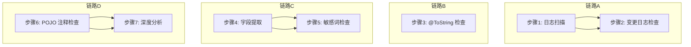
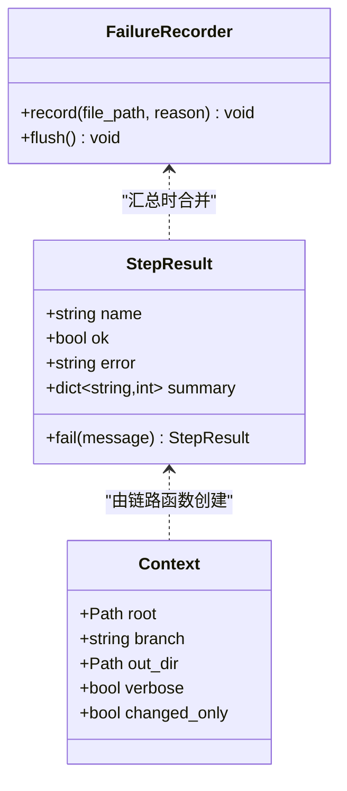
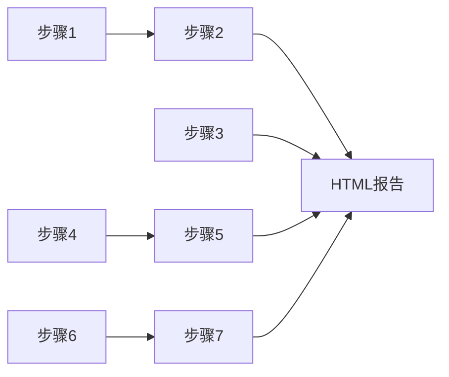

# 任务调度机制

<cite>
**本文引用的文件**
- [main.py](file://sensitive-log-review/scripts/main.py)
- [check_log_print.py](file://sensitive-log-review/scripts/check_log_print.py)
- [check_tostring_annotation.py](file://sensitive-log-review/scripts/check_tostring_annotation.py)
- [extract_java_fields.py](file://sensitive-log-review/scripts/extract_java_fields.py)
- [check_sensitive_word.py](file://sensitive-log-review/scripts/check_sensitive_word.py)
- [check_pojo_comments.py](file://sensitive-log-review/scripts/check_pojo_comments.py)
- [analyze_sensitive_fields.py](file://sensitive-log-review/scripts/analyze_sensitive_fields.py)
- [errors.py](file://sensitive-log-review/scripts/common/errors.py)
- [failures.py](file://sensitive-log-review/scripts/common/failures.py)
- [paths.py](file://sensitive-log-review/scripts/common/paths.py)
</cite>

## 目录
1. [简介](#简介)
2. [项目结构](#项目结构)
3. [核心组件](#核心组件)
4. [架构总览](#架构总览)
5. [详细组件分析](#详细组件分析)
6. [依赖关系分析](#依赖关系分析)
7. [性能考量](#性能考量)
8. [故障排查指南](#故障排查指南)
9. [结论](#结论)
10. [附录](#附录)

## 简介
本文件面向敏感信息审查工具的任务调度机制，系统性说明四链路并行执行模型（P1-6）与步骤间的依赖、数据交换、状态管理、错误传播、监控调试方法，并给出工作流图以展示任务执行时序。该机制通过线程池将四个相对独立的检查链路并发执行，最大化吞吐，同时保证产物一致性与结果可汇总。

## 项目结构
- 编排入口：scripts/main.py
- 子步骤脚本（独立 CLI，可单独运行）：
  - 日志扫描与变更匹配：java_log_scanner.py、check_log_print.py
  - @ToString 注解检查：check_tostring_annotation.py
  - 字段提取与审计：extract_java_fields.py
  - 敏感词与不合格字段检查：check_sensitive_word.py
  - POJO 注释检查：check_pojo_comments.py
  - 深度敏感性分析：analyze_sensitive_fields.py
- 公共模块：
  - paths.py：输出目录与产物文件名集中管理
  - failures.py：失败记录分片与合并
  - errors.py：统一错误码与修复建议

图表来源
- [main.py:276-297](file://sensitive-log-review/scripts/main.py#L276-L297)
- [paths.py:24-38](file://sensitive-log-review/scripts/common/paths.py#L24-L38)

章节来源
- [main.py:1-120](file://sensitive-log-review/scripts/main.py#L1-L120)
- [paths.py:1-69](file://sensitive-log-review/scripts/common/paths.py#L1-L69)

## 核心组件
- Context：流水线共享上下文，包含仓库根、目标分支、输出目录、是否仅变更扫描等。
- StepResult：单步骤执行结果对象，封装 ok、error、summary（计数键值对）。
- 四链路分组函数：group_a/group_b/group_c/group_d，分别封装串行依赖的步骤组合。
- 并行执行：ThreadPoolExecutor(max_workers=4)，提交四个链路任务，收集所有 StepResult。
- 门禁判定：基于 counts 字典与 --fail-on 配置，决定是否触发门禁。
- HTML 报告生成：读取各产物文件，渲染为结构化报告。

章节来源
- [main.py:83-110](file://sensitive-log-review/scripts/main.py#L83-L110)
- [main.py:276-297](file://sensitive-log-review/scripts/main.py#L276-L297)
- [main.py:777-856](file://sensitive-log-review/scripts/main.py#L777-L856)

## 架构总览
四链路并行模型（P1-6）：
- 链路A（步骤1+2）：先执行日志扫描，再基于变更进行日志违规检查；两者存在串行依赖。
- 链路B（步骤3）：独立检查 @ToString 注解缺失及其中字段命中敏感词的情况。
- 链路C（步骤4+5）：先提取 Java 字段并做命名规范与敏感性初筛，再基于变更过滤敏感/不合格字段。
- 链路D（步骤6+7）：先检查 POJO 注释（调用 checkstyle），再进行深度敏感性分析。
- 汇合后（步骤8）：汇总产物生成 HTML 报告。

图表来源
- [main.py:777-825](file://sensitive-log-review/scripts/main.py#L777-L825)

章节来源
- [main.py:276-297](file://sensitive-log-review/scripts/main.py#L276-L297)
- [main.py:777-825](file://sensitive-log-review/scripts/main.py#L777-L825)

## 详细组件分析

### 四链路并行执行模型（P1-6）
- 链路A（步骤1+2）：
  - 步骤1：调用 java_log_scanner.py 扫描日志输出，产出合规/违规清单。
  - 步骤2：调用 check_log_print.py，基于 git diff 新增行过滤，统计 violation/low/ok。
  - 依赖：步骤2依赖步骤1的产物。
- 链路B（步骤3）：
  - 步骤3：调用 check_tostring_annotation.py，检查 @ToString(of={...}) 缺失与其中字段命中敏感词。
  - 无外部依赖，完全独立。
- 链路C（步骤4+5）：
  - 步骤4：调用 extract_java_fields.py，提取字段并输出 all-fields/unqualified/maybe-sensitive。
  - 步骤5：调用 check_sensitive_word.py，基于 maybe-sensitive/unqualified 与 git diff 新增行过滤，输出 sensitive.results/unqualified.results。
  - 依赖：步骤5依赖步骤4的产物。
- 链路D（步骤6+7）：
  - 步骤6：调用 check_pojo_comments.py，校验 POJO 字段注释，输出 pojo-changed.list 与 pojo-miss-comments.txt。
  - 步骤7：调用 analyze_sensitive_fields.py，基于 pojo-changed.list 与规则进行深度分析，输出 analyze-sensitize.result。
  - 依赖：步骤7依赖步骤6的产物。

图表来源
- [main.py:276-297](file://sensitive-log-review/scripts/main.py#L276-L297)

章节来源
- [main.py:187-269](file://sensitive-log-review/scripts/main.py#L187-L269)
- [main.py:276-297](file://sensitive-log-review/scripts/main.py#L276-L297)

### 任务分组策略
- 串行依赖任务的组合方式：
  - 链路A：步骤1完成后立即执行步骤2，若步骤1失败则直接返回失败结果，跳过步骤2。
  - 链路C：步骤4完成后执行步骤5，若步骤4失败则跳过步骤5。
  - 链路D：步骤6与步骤7顺序执行，但当前实现中未对步骤6失败短路（仍会执行步骤7），建议在后续版本增加短路逻辑以提升效率。
- 并行独立任务的分配原则：
  - 四条链路之间无共享内存依赖，通过文件系统产物交换数据，因此可安全并行。
  - 使用 ThreadPoolExecutor(max_workers=4) 确保最大并发度等于链路数，避免资源争用。

章节来源
- [main.py:276-297](file://sensitive-log-review/scripts/main.py#L276-L297)
- [main.py:777-785](file://sensitive-log-review/scripts/main.py#L777-L785)

### 任务状态管理与错误传播
- StepResult 设计：
  - name：步骤名称，便于识别与汇总。
  - ok：布尔标志，表示步骤是否成功。
  - error：错误消息，用于诊断。
  - summary：计数键值对，供门禁判定与报告渲染使用。
- 错误传播机制：
  - 子脚本通过退出码表达错误（0/1/2），主流程根据 rc 设置 StepResult.fail。
  - 关键步骤失败（非 warn_only）将导致整体退出码 2。
  - 低置信提示（LOW/E）默认不触发门禁，可通过 --fail-on-low 开启。
- 失败文件记录：
  - 每个子步骤使用 FailureRecorder 记录解析/读取失败的文件，写入各自的分片文件。
  - main.py 在全部步骤结束后合并分片为 failed-files.list，并在报告中展示。

图表来源
- [main.py:83-110](file://sensitive-log-review/scripts/main.py#L83-L110)
- [failures.py:37-64](file://sensitive-log-review/scripts/common/failures.py#L37-L64)

章节来源
- [main.py:97-110](file://sensitive-log-review/scripts/main.py#L97-L110)
- [failures.py:1-101](file://sensitive-log-review/scripts/common/failures.py#L1-L101)
- [errors.py:18-100](file://sensitive-log-review/scripts/common/errors.py#L18-L100)

### 任务间数据传递方式
- 文件系统产物交换：
  - 各步骤将结果写入输出目录下的固定文件名（如 log-print-violation.list、maybe-sensitive.fields、pojo-changed.list 等）。
  - 路径常量集中在 paths.py，避免散布字面量。
- 内存中的上下文共享：
  - Context 对象在链路间共享仓库根、分支、输出目录等信息。
  - 变更清单（changed-java.files、changed-pojo.files）在准备阶段写入，供子脚本按需使用。
- 变更过滤机制：
  - check_log_print.py 与 check_sensitive_word.py 使用 AddedLinesCache 缓存 git diff 新增行，按内容或字段名过滤，减少误报。

章节来源
- [paths.py:24-38](file://sensitive-log-review/scripts/common/paths.py#L24-L38)
- [main.py:300-322](file://sensitive-log-review/scripts/main.py#L300-L322)
- [check_log_print.py:74-93](file://sensitive-log-review/scripts/check_log_print.py#L74-L93)
- [check_sensitive_word.py:71-90](file://sensitive-log-review/scripts/check_sensitive_word.py#L71-L90)

### 任务监控与调试方法
- 详细输出模式：
  - 通过 -v/--verbose 启用，打印命令、标准输出/错误、中间过程。
- 环境诊断：
  - --doctor 模式仅检查运行环境（Python/java/git/checkstyle jar/规则/词典/输出目录），不执行审查。
- 产物清单打印：
  - print_result_table 输出各产物文件是否存在及路径，便于快速定位。
- 失败文件告警：
  - 当失败文件数超过已处理文件总数的 10% 时，醒目告警并提示查看 failed-files.list。
- 严格模式：
  - --strict-mode 下，存在失败文件即视为执行错误（退出码 2）。

章节来源
- [main.py:533-702](file://sensitive-log-review/scripts/main.py#L533-L702)
- [main.py:508-530](file://sensitive-log-review/scripts/main.py#L508-L530)
- [main.py:818-841](file://sensitive-log-review/scripts/main.py#L818-L841)

## 依赖关系分析
- 组件耦合与内聚：
  - main.py 作为编排层，仅负责调度与汇总，业务逻辑下沉到各子脚本，内聚性良好。
  - 子脚本通过 paths.py 统一管理产物路径，降低耦合。
- 直接依赖：
  - 链路A依赖步骤1产物；链路C依赖步骤4产物；链路D依赖步骤6产物。
- 间接依赖：
  - 步骤5依赖步骤4产物并通过 git diff 过滤；步骤7依赖步骤6产物与规则文件。
- 外部依赖：
  - git、java（checkstyle）、checkstyle jar、规则 JSON、词典文件。
- 循环依赖：
  - 无循环依赖，链路间单向数据流。

图表来源
- [main.py:276-297](file://sensitive-log-review/scripts/main.py#L276-L297)
- [main.py:353-505](file://sensitive-log-review/scripts/main.py#L353-L505)

章节来源
- [main.py:276-297](file://sensitive-log-review/scripts/main.py#L276-L297)
- [paths.py:24-38](file://sensitive-log-review/scripts/common/paths.py#L24-L38)

## 性能考量
- 并行度：
  - 四链路并行，充分利用多核 CPU，目标全流程耗时 <60s。
- I/O 优化：
  - 产物文件采用追加/覆盖写，避免竞争；失败记录分片化，合并时一次性写入。
- 计算优化：
  - AddedLinesCache 缓存 git diff 新增行，减少重复进程调用。
  - 正则预编译（规则加载时）提升匹配性能。
- 可扩展性：
  - 新增检查步骤可按链路拆分，保持串行依赖最小化，便于扩展。

[本节提供一般性指导，无需特定文件分析]

## 故障排查指南
- 常见错误与修复建议：
  - 非 git 仓库：E001，确认 -r 指向仓库根。
  - 找不到 java：E002，安装 JRE/JDK 并加入 PATH。
  - 分支非法：E003，核对 --branch 参数。
  - 规则 JSON 损坏：E004，按行列位置修复。
  - run-id 非法：E005，仅允许字母数字/._-。
  - 输出目录不可写：E006，检查权限与空间。
  - checkstyle jar SHA256 不符：E007，重新获取或更新基线。
- 失败文件统计：
  - 查看 failed-files.list，定位读取/解析失败的文件与原因。
- 门禁触发：
  - 检查 counts 字典与 --fail-on 配置，确认是否因 low/sensitive/violation 等触发。
- 严格模式：
  - 启用 --strict-mode 可将失败文件视为执行错误，便于 CI 拦截。

章节来源
- [errors.py:18-100](file://sensitive-log-review/scripts/common/errors.py#L18-L100)
- [failures.py:79-101](file://sensitive-log-review/scripts/common/failures.py#L79-L101)
- [main.py:805-856](file://sensitive-log-review/scripts/main.py#L805-L856)

## 结论
本任务调度机制通过四链路并行模型有效提升了审查吞吐，同时借助文件系统产物交换与内存上下文共享，保证了数据一致性与结果可汇总。StepResult 与 FailureRecorder 提供了清晰的状态管理与错误传播机制。通过 --doctor、--verbose、严格模式等手段，提供了完善的监控与调试能力。建议在后续版本中对链路D增加步骤6失败短路逻辑，进一步提升效率。

[本节总结性内容，无需特定文件分析]

## 附录
- 产物文件清单：
  - log-print-ok.list、log-print-violation.list
  - miss-tostring-annotation.list、tostring-sensitive-violations.list
  - all-fields.list、unqualified.fields、maybe-sensitive.fields
  - sensitive.results、unqualified.results
  - pojo-changed.list、pojo-miss-comments.txt
  - analyze-sensitize.result
  - sensitive-log-review-report.html
  - failed-files.list

章节来源
- [paths.py:24-38](file://sensitive-log-review/scripts/common/paths.py#L24-L38)
- [main.py:508-530](file://sensitive-log-review/scripts/main.py#L508-L530)