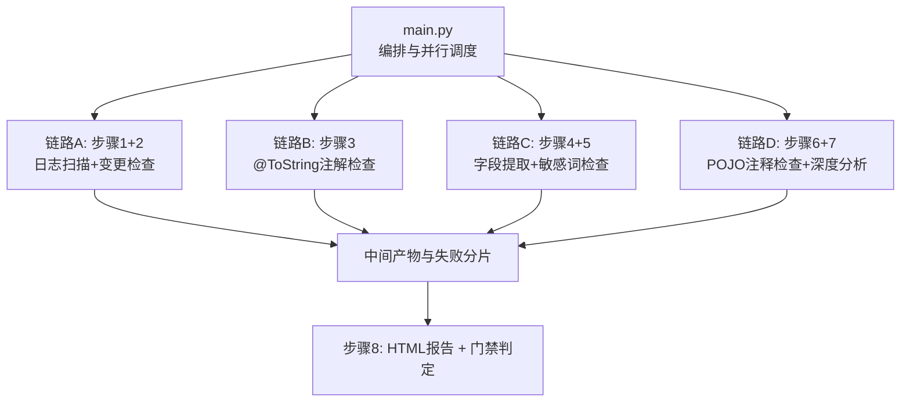
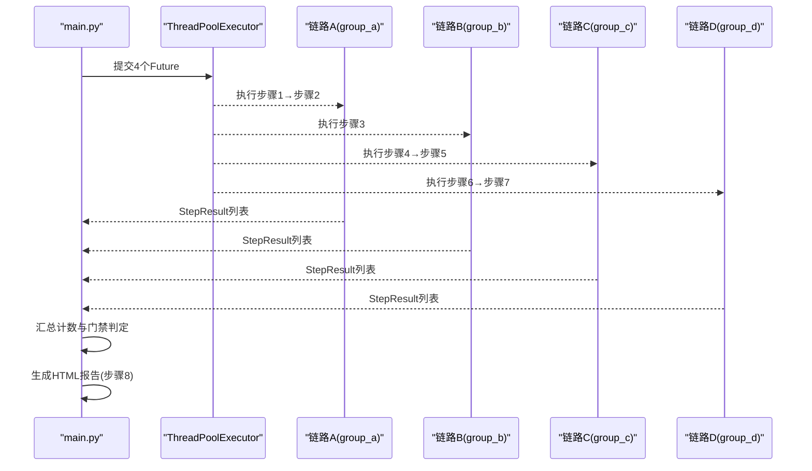
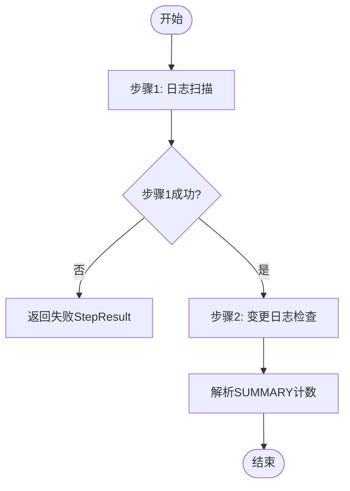
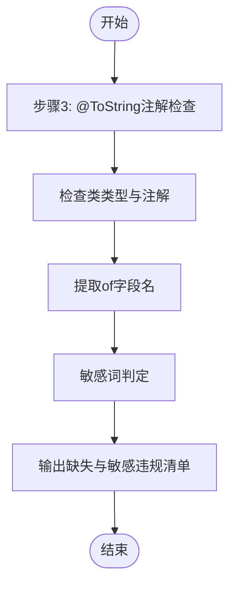
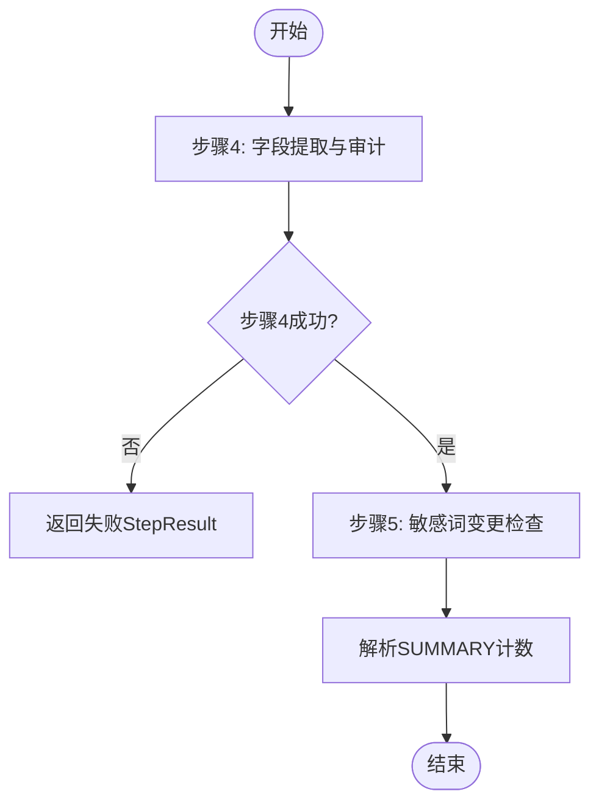
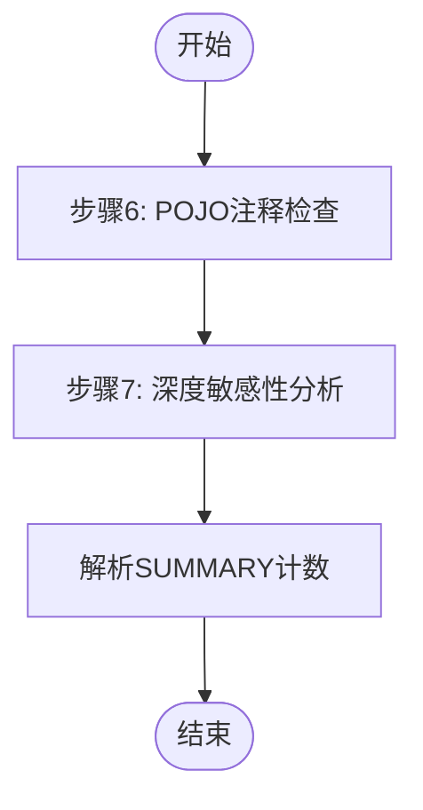
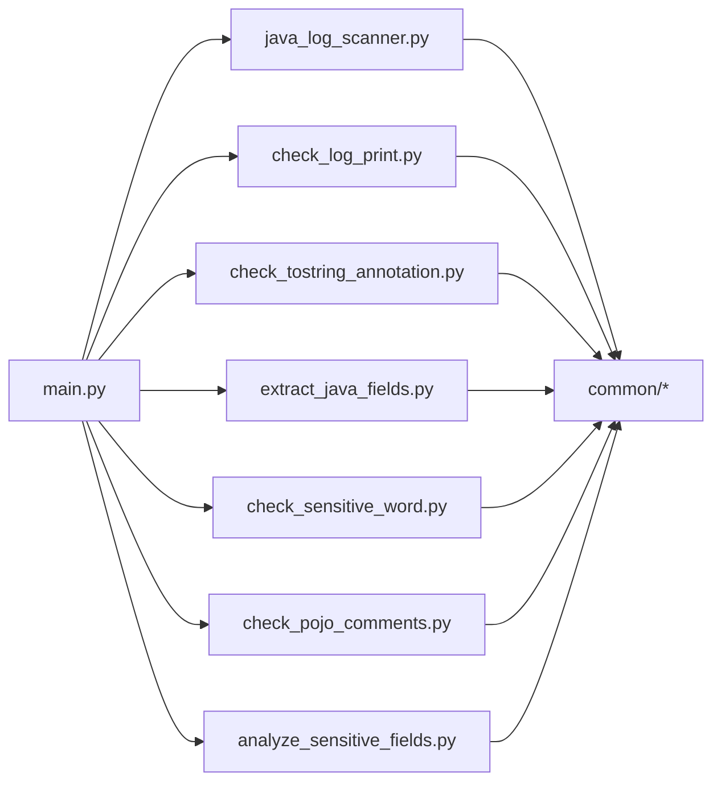

# 并行处理架构

<cite>
**本文引用的文件**
- [main.py](file://sensitive-log-review/scripts/main.py)
- [java_log_scanner.py](file://sensitive-log-review/scripts/java_log_scanner.py)
- [check_log_print.py](file://sensitive-log-review/scripts/check_log_print.py)
- [check_tostring_annotation.py](file://sensitive-log-review/scripts/check_tostring_annotation.py)
- [extract_java_fields.py](file://sensitive-log-review/scripts/extract_java_fields.py)
- [check_sensitive_word.py](file://sensitive-log-review/scripts/check_sensitive_word.py)
- [check_pojo_comments.py](file://sensitive-log-review/scripts/check_pojo_comments.py)
- [analyze_sensitive_fields.py](file://sensitive-log-review/scripts/analyze_sensitive_fields.py)
- [failures.py](file://sensitive-log-review/scripts/common/failures.py)
- [errors.py](file://sensitive-log-review/scripts/common/errors.py)
- [paths.py](file://sensitive-log-review/scripts/common/paths.py)
- [README.md](file://sensitive-log-review/README.md)
- [SKILL.md](file://sensitive-log-review/SKILL.md)
</cite>

## 目录
1. [简介](#简介)
2. [项目结构](#项目结构)
3. [核心组件](#核心组件)
4. [架构总览](#架构总览)
5. [详细组件分析](#详细组件分析)
6. [依赖关系分析](#依赖关系分析)
7. [性能考量](#性能考量)
8. [故障排查指南](#故障排查指南)
9. [结论](#结论)
10. [附录：扩展新并行链路示例](#附录：扩展新并行链路示例)

## 简介
本文件面向“敏感信息日志审查工具”的并行处理架构，围绕四链路并行设计（A/B/C/D）展开，系统性说明线程池管理、任务调度机制、结果聚合策略、错误处理与降级策略、并发安全性保证与资源管理机制，并提供性能优化建议与故障排查方法。同时给出如何扩展新的并行链路的实践指引。

该工具以 main.py 为编排层，使用线程池将八个步骤组织为四条并行链路，汇合后统一生成 HTML 报告并执行门禁判定。默认支持仅扫描变更文件的快速模式，也可回退到全量扫描。

**章节来源**
- [main.py:1-22](file://sensitive-log-review/scripts/main.py#L1-L22)
- [README.md:30-53](file://sensitive-log-review/README.md#L30-L53)

## 项目结构
- 编排层：scripts/main.py 负责参数解析、环境准备、四链路并行调度、结果汇总与报告生成。
- 检查脚本：各步骤对应独立脚本，职责单一，便于并行与复用。
- 公共模块：common 包提供路径管理、失败记录合并、结构化错误提示等能力。
- 规则与词典：rules 与 dictionary 目录存放规则配置与分层词典。
- 产物输出：所有中间产物与最终报告统一写入输出目录，支持 CI 并行隔离。

**图表来源**
- [main.py:276-298](file://sensitive-log-review/scripts/main.py#L276-L298)
- [main.py:777-785](file://sensitive-log-review/scripts/main.py#L777-L785)

**章节来源**
- [main.py:72-75](file://sensitive-log-review/scripts/main.py#L72-L75)
- [paths.py:1-69](file://sensitive-log-review/scripts/common/paths.py#L1-L69)

## 核心组件
- 线程池与任务提交：使用 ThreadPoolExecutor(max_workers=4) 提交四条链路任务，确保最大并发度可控。
- 链路分组：group_a/group_b/group_c/group_d 分别封装步骤序列，内部顺序执行，组间并行。
- 结果聚合：收集每个 StepResult 的 ok、error、summary，汇总计数并触发门禁。
- 失败记录：各子步骤通过 FailureRecorder 写分片，主流程结束后合并为 failed-files.list。
- 结构化错误：errors.py 定义错误码与修复建议模板，统一 stderr 输出。

**章节来源**
- [main.py:777-785](file://sensitive-log-review/scripts/main.py#L777-L785)
- [failures.py:1-101](file://sensitive-log-review/scripts/common/failures.py#L1-L101)
- [errors.py:18-100](file://sensitive-log-review/scripts/common/errors.py#L18-L100)

## 架构总览
四链路并行执行模型如下：
- 链路A：步骤1（日志扫描）→ 步骤2（变更日志检查）
- 链路B：步骤3（@ToString注解检查）
- 链路C：步骤4（字段提取）→ 步骤5（敏感词检查）
- 链路D：步骤6（POJO注释检查）→ 步骤7（深度敏感性分析）
- 汇合后：步骤8（HTML报告 + 门禁判定）

**图表来源**
- [main.py:276-298](file://sensitive-log-review/scripts/main.py#L276-L298)
- [main.py:777-785](file://sensitive-log-review/scripts/main.py#L777-L785)
- [main.py:353-505](file://sensitive-log-review/scripts/main.py#L353-L505)

**章节来源**
- [main.py:276-298](file://sensitive-log-review/scripts/main.py#L276-L298)
- [main.py:777-785](file://sensitive-log-review/scripts/main.py#L777-L785)

## 详细组件分析

### 链路A：日志扫描 + 变更检查
- 步骤1：java_log_scanner.py 扫描 Java 工程中的日志输出，检测 JSON 序列化、敏感词、System.out/printStackTrace 等违规，输出合规与违规清单。
- 步骤2：check_log_print.py 基于 git diff 新增行过滤，判断变更文件是否命中违规清单；低置信（LOW）默认不触发门禁，可通过参数调整。

**图表来源**
- [main.py:187-207](file://sensitive-log-review/scripts/main.py#L187-L207)
- [java_log_scanner.py:1-200](file://sensitive-log-review/scripts/java_log_scanner.py#L1-L200)
- [check_log_print.py:1-200](file://sensitive-log-review/scripts/check_log_print.py#L1-L200)

**章节来源**
- [main.py:187-207](file://sensitive-log-review/scripts/main.py#L187-L207)
- [java_log_scanner.py:1-200](file://sensitive-log-review/scripts/java_log_scanner.py#L1-L200)
- [check_log_print.py:1-200](file://sensitive-log-review/scripts/check_log_print.py#L1-L200)

### 链路B：@ToString注解检查
- 步骤3：check_tostring_annotation.py 检查 POJO 类是否正确使用 @ToString(of = {...})，并对注解中字段进行敏感词检查，输出缺失清单与敏感违规清单。

**图表来源**
- [main.py:210-222](file://sensitive-log-review/scripts/main.py#L210-L222)
- [check_tostring_annotation.py:1-200](file://sensitive-log-review/scripts/check_tostring_annotation.py#L1-L200)

**章节来源**
- [main.py:210-222](file://sensitive-log-review/scripts/main.py#L210-L222)
- [check_tostring_annotation.py:1-200](file://sensitive-log-review/scripts/check_tostring_annotation.py#L1-L200)

### 链路C：字段提取 + 敏感词检查
- 步骤4：extract_java_fields.py 提取 POJO 字段，进行命名规范审计与敏感性初筛，输出全部字段、不规范字段、可能敏感字段清单。
- 步骤5：check_sensitive_word.py 基于 git diff 新增行过滤，判断变更文件中敏感或不规范字段，输出结果清单与 SUMMARY 计数。

**图表来源**
- [main.py:225-245](file://sensitive-log-review/scripts/main.py#L225-L245)
- [extract_java_fields.py:1-200](file://sensitive-log-review/scripts/extract_java_fields.py#L1-L200)
- [check_sensitive_word.py:1-200](file://sensitive-log-review/scripts/check_sensitive_word.py#L1-L200)

**章节来源**
- [main.py:225-245](file://sensitive-log-review/scripts/main.py#L225-L245)
- [extract_java_fields.py:1-200](file://sensitive-log-review/scripts/extract_java_fields.py#L1-L200)
- [check_sensitive_word.py:1-200](file://sensitive-log-review/scripts/check_sensitive_word.py#L1-L200)

### 链路D：POJO注释检查 + 深度分析
- 步骤6：check_pojo_comments.py 获取变更 POJO 文件，运行 checkstyle 检查字段注释完整性，输出变更清单与注释问题清单。
- 步骤7：analyze_sensitive_fields.py 读取 pojo-changed.list，按结构化规则进行深度敏感性分析，输出 analyze-sensitize.result。

**图表来源**
- [main.py:248-269](file://sensitive-log-review/scripts/main.py#L248-L269)
- [check_pojo_comments.py:1-200](file://sensitive-log-review/scripts/check_pojo_comments.py#L1-L200)
- [analyze_sensitive_fields.py:1-189](file://sensitive-log-review/scripts/analyze_sensitive_fields.py#L1-L189)

**章节来源**
- [main.py:248-269](file://sensitive-log-review/scripts/main.py#L248-L269)
- [check_pojo_comments.py:1-200](file://sensitive-log-review/scripts/check_pojo_comments.py#L1-L200)
- [analyze_sensitive_fields.py:1-189](file://sensitive-log-review/scripts/analyze_sensitive_fields.py#L1-L189)

### 步骤8：HTML报告与门禁判定
- 读取各中间产物，渲染 HTML 报告（含折叠详情与转义），统计各类计数项，依据 --fail-on 决定是否触发门禁。
- 失败文件清单单独展示，不影响门禁口径（除非开启严格模式）。

**章节来源**
- [main.py:353-505](file://sensitive-log-review/scripts/main.py#L353-L505)
- [main.py:791-800](file://sensitive-log-review/scripts/main.py#L791-L800)

## 依赖关系分析
- 编排层 main.py 依赖各步骤脚本与 common 模块。
- 各步骤脚本共享 paths、failures、errors、git_utils、pojo_config、dictionary、java_lexer 等公共能力。
- 外部依赖：Java Runtime（Checkstyle）、Git、Python 3.10+。

**图表来源**
- [main.py:42-70](file://sensitive-log-review/scripts/main.py#L42-L70)
- [java_log_scanner.py:34-38](file://sensitive-log-review/scripts/java_log_scanner.py#L34-L38)
- [check_log_print.py:31-35](file://sensitive-log-review/scripts/check_log_print.py#L31-L35)
- [check_tostring_annotation.py:33-38](file://sensitive-log-review/scripts/check_tostring_annotation.py#L33-L38)
- [extract_java_fields.py:30-47](file://sensitive-log-review/scripts/extract_java_fields.py#L30-L47)
- [check_sensitive_word.py:29-40](file://sensitive-log-review/scripts/check_sensitive_word.py#L29-L40)
- [check_pojo_comments.py:30-34](file://sensitive-log-review/scripts/check_pojo_comments.py#L30-L34)
- [analyze_sensitive_fields.py:29-39](file://sensitive-log-review/scripts/analyze_sensitive_fields.py#L29-L39)

**章节来源**
- [main.py:42-70](file://sensitive-log-review/scripts/main.py#L42-L70)

## 性能考量
- 线程池大小：max_workers=4 匹配四链路并行，避免过度竞争 CPU/IO。
- 变更优先：默认 --changed-only 减少扫描范围，显著提升速度。
- 正则与词典缓存：日志扫描器对 logger_names 构建的正则使用 lru_cache，降低重复编译开销。
- 增量过滤：check_log_print 与 check_sensitive_word 使用 AddedLinesCache 基于 git diff 新增行过滤，减少无效匹配。
- 产物折叠：HTML 报告长列表默认折叠，提升可读性与渲染效率。
- 建议：
  - 在大型仓库中优先使用 --changed-only；必要时结合分支粒度缩小对比范围。
  - 合理设置 --fail-on 以减少不必要的门禁压力。
  - 保持词典与规则文件精简有效，避免过多误报导致后续处理负担。

[本节为通用性能讨论，无需特定文件引用]

## 故障排查指南
- 环境诊断：使用 --doctor 逐项检查 Python/java/git/jar/规则/词典/输出目录可写性，快速定位环境问题。
- 结构化错误：errors.py 提供 E001-E007 错误码与修复建议，stderr 输出清晰易读。
- 失败文件：failed-files.list 汇总各步骤读取/解析失败的文件与原因；可用 --strict-mode 将其作为门禁拦截条件。
- 常见错误：
  - 非 git 仓库：E001，确认 -r 指向仓库根。
  - java 不可用：E002，安装 JRE/JDK 并加入 PATH。
  - 分支非法：E003，核对 --branch 拼写与存在性。
  - 规则 JSON 损坏：E004，修复语法。
  - run-id 非法：E005，清洗变量。
  - 输出目录不可写：E006，检查权限与空间。
  - jar SHA256 不符：E007，重新获取或更新基线。

**章节来源**
- [errors.py:18-100](file://sensitive-log-review/scripts/common/errors.py#L18-L100)
- [failures.py:66-101](file://sensitive-log-review/scripts/common/failures.py#L66-L101)
- [README.md:459-482](file://sensitive-log-review/README.md#L459-L482)

## 结论
该并行处理架构通过四链路并行设计，将日志扫描、注解检查、字段提取与敏感词检查、POJO 注释与深度分析解耦，既保证了执行效率，又提升了可维护性与可扩展性。统一的失败记录与结构化错误机制增强了鲁棒性，HTML 报告与门禁判定提供了清晰的交付物与质量门槛。建议在 CI 中结合 --changed-only 与 --run-id 实现高效并行隔离，并根据业务需求灵活调整 --fail-on 与词典规则。

[本节为总结性内容，无需特定文件引用]

## 附录：扩展新并行链路示例
目标：在不破坏现有四链路的前提下，新增一条并行链路（例如“代码复杂度检查”），并确保其结果能汇入报告与门禁。

步骤要点：
- 新增脚本：在 scripts/ 下创建新脚本（如 check_complexity.py），实现单职责检查逻辑，遵循现有退出码契约（0/1/2）。
- 新增链路函数：在 main.py 中新增 group_e(ctx)，封装步骤序列（可串行或并行于自身内部）。
- 注册并行任务：在 main.py 的线程池提交处增加 new_future = executor.submit(group_e, ctx)。
- 结果聚合：若新步骤输出 SUMMARY 或产物文件，需在 main.py 汇总计数时纳入 counts 字典，并在 HTML 报告中展示。
- 失败记录：在新脚本中使用 FailureRecorder 记录失败文件，主流程结束后自动合并。
- 门禁联动：如需影响门禁，将新计数项加入 GATE_KEYS 与 --fail-on 可选值。

参考路径：
- 新增链路函数位置：[main.py:276-298](file://sensitive-log-review/scripts/main.py#L276-L298)
- 线程池提交位置：[main.py:777-785](file://sensitive-log-review/scripts/main.py#L777-L785)
- 结果汇总与门禁：[main.py:791-800](file://sensitive-log-review/scripts/main.py#L791-L800)
- 失败记录合并：[failures.py:79-101](file://sensitive-log-review/scripts/common/failures.py#L79-L101)

**章节来源**
- [main.py:276-298](file://sensitive-log-review/scripts/main.py#L276-L298)
- [main.py:777-785](file://sensitive-log-review/scripts/main.py#L777-L785)
- [main.py:791-800](file://sensitive-log-review/scripts/main.py#L791-L800)
- [failures.py:79-101](file://sensitive-log-review/scripts/common/failures.py#L79-L101)