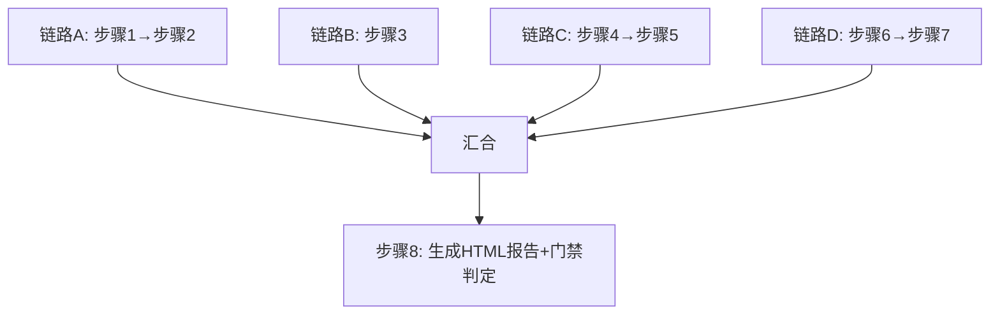
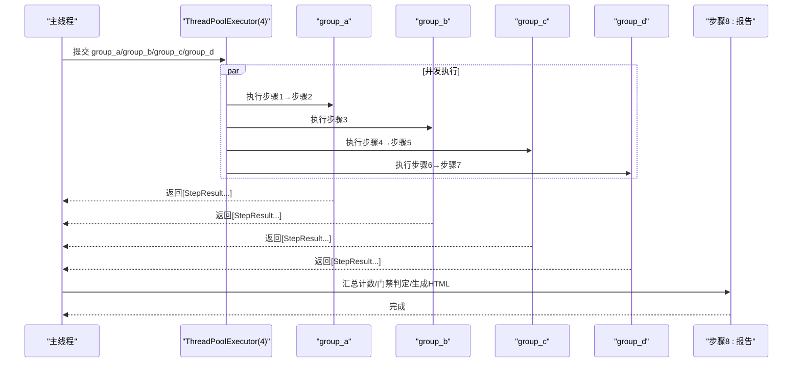
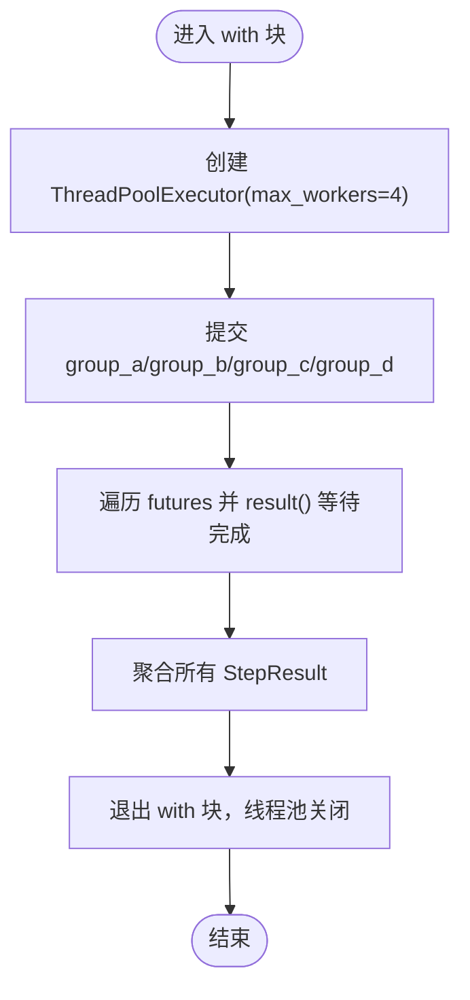
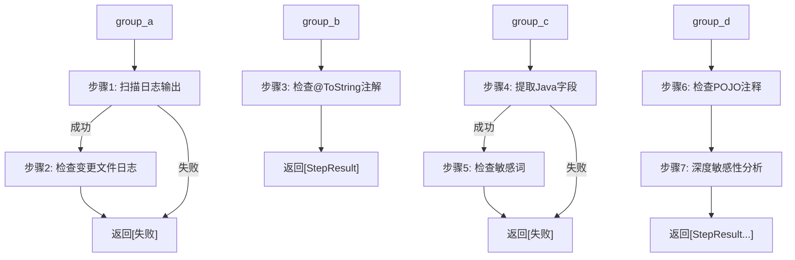
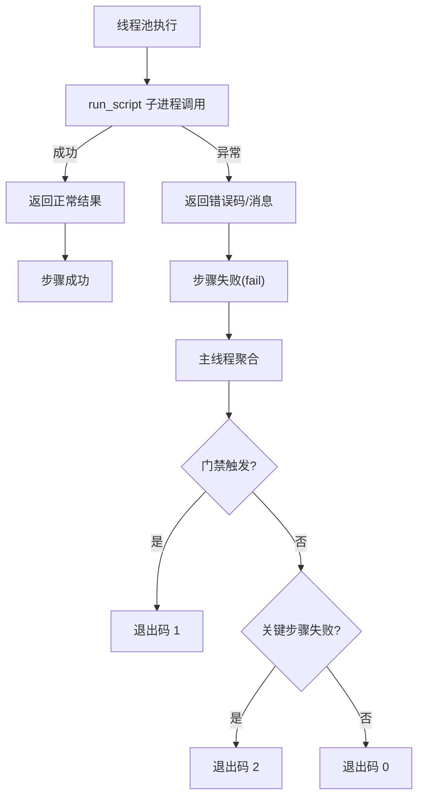
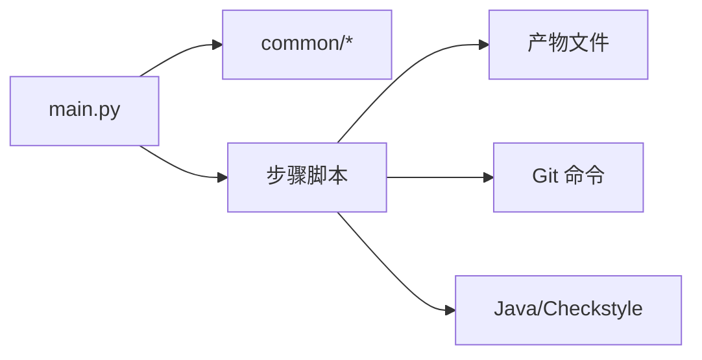

# 线程池管理

<cite>
**本文引用的文件**
- [main.py](file://sensitive-log-review/scripts/main.py)
- [README.md](file://sensitive-log-review/README.md)
- [SKILL.md](file://sensitive-log-review/SKILL.md)
- [test_integration.py](file://sensitive-log-review/tests/test_integration.py)
</cite>

## 目录
1. [简介](#简介)
2. [项目结构](#项目结构)
3. [核心组件](#核心组件)
4. [架构总览](#架构总览)
5. [详细组件分析](#详细组件分析)
6. [依赖关系分析](#依赖关系分析)
7. [性能考量与调优建议](#性能考量与调优建议)
8. [故障排查指南](#故障排查指南)
9. [结论](#结论)
10. [附录：扩展新并行任务的实践](#附录：扩展新并行任务的实践)

## 简介
本文件聚焦敏感信息审查工具的“线程池管理机制”，围绕 ThreadPoolExecutor 的配置、四链路并行执行（group_a/group_b/group_c/group_d）、共享上下文 Context 的只读访问模式、结果聚合策略、异常处理机制，以及性能调优与监控指标进行系统化说明。目标是帮助读者在不深入源码细节的前提下，理解并安全地扩展新的并行任务。

## 项目结构
该工具以 main.py 为编排入口，将八个步骤组织为四条并行链路，使用 ThreadPoolExecutor(max_workers=4) 并发执行，最终汇总生成 HTML 报告并进行门禁判定。四链路职责如下：
- 链路A：步骤1 扫描日志输出 → 步骤2 变更日志检查
- 链路B：步骤3 @ToString 注解检查
- 链路C：步骤4 提取Java字段 → 步骤5 敏感词变更检查
- 链路D：步骤6 POJO注释检查 → 步骤7 深度敏感性分析

图表来源
- [main.py:276-297](file://sensitive-log-review/scripts/main.py#L276-L297)
- [main.py:777-785](file://sensitive-log-review/scripts/main.py#L777-L785)

章节来源
- [main.py:1-22](file://sensitive-log-review/scripts/main.py#L1-L22)
- [README.md:30-53](file://sensitive-log-review/README.md#L30-L53)

## 核心组件
- 线程池：ThreadPoolExecutor(max_workers=4)，用于并发提交四条链路任务。
- 共享上下文：Context 对象，包含仓库根、分支、输出目录、是否仅变更扫描等只读配置。
- 步骤结果：StepResult 封装单步骤执行状态、错误信息与摘要计数。
- 并行链路：group_a/group_b/group_c/group_d 分别封装步骤序列及内部依赖关系。
- 结果聚合：主线程收集各 Future 的结果列表，统一统计计数、判定门禁、生成报告。

章节来源
- [main.py:83-109](file://sensitive-log-review/scripts/main.py#L83-L109)
- [main.py:276-297](file://sensitive-log-review/scripts/main.py#L276-L297)
- [main.py:777-785](file://sensitive-log-review/scripts/main.py#L777-L785)

## 架构总览
下图展示从主线程到线程池的四链路并发执行、结果聚合与报告生成的整体流程。

图表来源
- [main.py:777-785](file://sensitive-log-review/scripts/main.py#L777-L785)
- [main.py:276-297](file://sensitive-log-review/scripts/main.py#L276-L297)
- [main.py:353-505](file://sensitive-log-review/scripts/main.py#L353-L505)

## 详细组件分析

### 线程池配置与生命周期管理
- 配置要点
  - max_workers=4：匹配四条独立链路，避免过度竞争；同时兼顾 CPU 与 I/O 混合负载（子进程调用、文件读写、网络/磁盘 IO）。
  - with 语句自动关闭：确保线程池在任务完成后正确回收资源，避免僵尸线程。
- 生命周期
  - 创建：进入 with 块时初始化线程池。
  - 提交：submit(group, ctx) 将四条链路作为任务提交。
  - 等待：future.result() 阻塞获取每条链路的 StepResult 列表。
  - 清理：退出 with 块后，线程池优雅关闭，释放工作线程。

图表来源
- [main.py:777-785](file://sensitive-log-review/scripts/main.py#L777-L785)

章节来源
- [main.py:777-785](file://sensitive-log-review/scripts/main.py#L777-L785)

### 四链路提交与执行过程
- group_a：顺序执行步骤1和步骤2，若步骤1失败则短路返回。
- group_b：执行步骤3。
- group_c：顺序执行步骤4和步骤5，若步骤4失败则短路返回。
- group_d：顺序执行步骤6和步骤7。

图表来源
- [main.py:276-297](file://sensitive-log-review/scripts/main.py#L276-L297)

章节来源
- [main.py:276-297](file://sensitive-log-review/scripts/main.py#L276-L297)

### 线程安全保证与共享上下文
- 共享上下文 Context
  - 设计为只读配置对象，包含 root、branch、out_dir、verbose、changed_only 等属性。
  - 各链路通过参数传入，不修改其内容，避免竞态条件。
- 结果隔离
  - 每个链路返回独立的 StepResult 列表，主线程负责聚合，无共享可变状态。
- 产物文件
  - 各步骤写入输出目录下的不同产物文件，路径由 paths 模块统一管理，避免冲突。

章节来源
- [main.py:83-95](file://sensitive-log-review/scripts/main.py#L83-L95)
- [main.py:97-109](file://sensitive-log-review/scripts/main.py#L97-L109)

### 结果聚合策略
- 主线程收集所有链路的 StepResult 列表，构建 by_name 映射以便按步骤名取值。
- 汇总计数：从各步骤 summary 中提取门禁相关计数项（violation/sensitive/unqualified/tostring/tostring_sensitive/analyze/miss_comments/low）。
- 关键步骤失败判定：步骤3/6失败仅警告，其他关键步骤失败视为执行错误（退出码 2）。
- 门禁判定：根据 --fail-on 配置计算 gate_triggered，决定是否拦截。

章节来源
- [main.py:791-817](file://sensitive-log-review/scripts/main.py#L791-L817)

### 异常处理机制
- 线程内异常捕获
  - 子脚本执行通过 run_script 捕获 FileNotFoundError 与通用异常，返回错误码与消息。
  - 各步骤函数对非零返回码或特定错误码进行 fail() 标记。
- 主线程异常传播
  - future.result() 抛出异常时，主线程捕获并记录为“未预期异常”的 StepResult。
  - 顶层 try/except 捕获 KeyboardInterrupt、BrokenPipeError 与未预期异常，设置合适的退出码。

图表来源
- [main.py:112-130](file://sensitive-log-review/scripts/main.py#L112-L130)
- [main.py:777-785](file://sensitive-log-review/scripts/main.py#L777-L785)
- [main.py:805-856](file://sensitive-log-review/scripts/main.py#L805-L856)
- [main.py:859-875](file://sensitive-log-review/scripts/main.py#L859-L875)

章节来源
- [main.py:112-130](file://sensitive-log-review/scripts/main.py#L112-L130)
- [main.py:777-785](file://sensitive-log-review/scripts/main.py#L777-L785)
- [main.py:805-856](file://sensitive-log-review/scripts/main.py#L805-L856)
- [main.py:859-875](file://sensitive-log-review/scripts/main.py#L859-L875)

## 依赖关系分析
- 模块耦合
  - main.py 依赖 common 包中的 dictionary、errors、failures、git_utils、paths、pojo_config。
  - 各步骤脚本通过 base_cmd 构造命令前缀，统一输出目录与脚本路径。
- 外部依赖
  - Java Runtime（Checkstyle）用于步骤6。
  - Git 用于变更文件清单计算。
- 并发边界
  - 线程池隔离四条链路，避免相互干扰；产物文件通过路径隔离，无共享内存写操作。

图表来源
- [main.py:41-70](file://sensitive-log-review/scripts/main.py#L41-L70)
- [main.py:178-181](file://sensitive-log-review/scripts/main.py#L178-L181)

章节来源
- [main.py:41-70](file://sensitive-log-review/scripts/main.py#L41-L70)
- [main.py:178-181](file://sensitive-log-review/scripts/main.py#L178-L181)

## 性能考量与调优建议
- 线程池大小
  - max_workers=4 与四链路一一对应，适合当前流水线规模；若后续增加更多链路，可考虑动态调整或引入队列限流。
- I/O 密集优化
  - 子进程调用与文件读写占比较高，可通过减少不必要的文件读取、合并小文件写入、异步化长耗时步骤提升吞吐。
- 变更扫描模式
  - 默认 --changed-only 显著降低扫描范围；全量扫描仅在必要时启用。
- 监控指标
  - 总耗时 duration：用于评估端到端性能。
  - 失败文件数 failedFiles：反映解析健壮性，超过阈值告警。
  - 各步骤耗时：可在步骤函数中埋点记录，便于定位瓶颈。
  - 门禁触发项 gate_triggered：用于质量趋势分析。
- 资源清理
  - 使用 with 语句确保线程池关闭；产物文件写入异常时记录错误并继续生成报告（尽力而为）。

章节来源
- [main.py:777-785](file://sensitive-log-review/scripts/main.py#L777-L785)
- [main.py:822-841](file://sensitive-log-review/scripts/main.py#L822-L841)

## 故障排查指南
- 常见问题
  - 控制台中文乱码：设置 PYTHONIOENCODING=utf-8。
  - 不是 git 仓库：确保 -r 指向仓库根。
  - 找不到 java：安装 JRE/JDK 并确保 PATH。
  - 变更检查无结果：检查 --branch 与完整历史 fetch-depth。
  - jar SHA256 校验失败：核对 checkstyle jar 完整性。
  - failedFiles 警告：查看 failed-files.list 定位具体原因。
- 诊断模式
  - 使用 --doctor 逐项检查运行环境，快速定位问题。

章节来源
- [README.md:361-483](file://sensitive-log-review/README.md#L361-L483)
- [main.py:582-702](file://sensitive-log-review/scripts/main.py#L582-L702)

## 结论
该工具通过 ThreadPoolExecutor(max_workers=4) 实现四链路并行执行，结合只读 Context 与隔离的 StepResult 聚合，保证了线程安全与结果一致性。异常处理覆盖线程内外，提供清晰的退出码契约与报告输出。建议在保持当前并发模型的基础上，持续监控性能指标，按需优化 I/O 与子进程调用，并在扩展新链路时遵循相同的只读上下文与结果聚合规范。

## 附录：扩展新并行任务的实践
- 新增步骤函数
  - 参考现有步骤函数（如 stepX_...），封装命令构造、执行与结果解析，返回 StepResult。
- 纳入某条链路
  - 在对应 group_* 中添加顺序依赖与短路逻辑，确保失败时及时返回。
- 提交到线程池
  - 无需修改线程池配置，直接在新 group_* 中体现步骤顺序即可。
- 结果聚合
  - 若需计入门禁，需在 main 汇总阶段添加对应计数项。
- 测试验证
  - 使用集成测试框架验证端到端行为，确保产物与退出码符合预期。

章节来源
- [main.py:187-269](file://sensitive-log-review/scripts/main.py#L187-L269)
- [main.py:276-297](file://sensitive-log-review/scripts/main.py#L276-L297)
- [test_integration.py:89-147](file://sensitive-log-review/tests/test_integration.py#L89-L147)