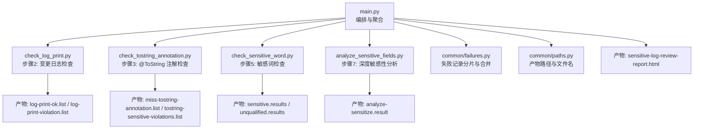
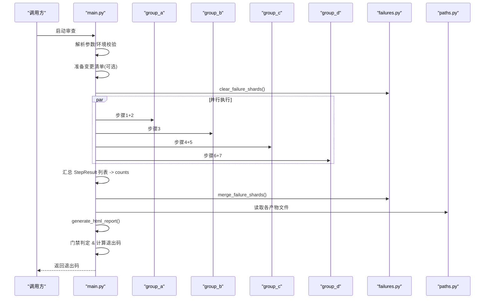
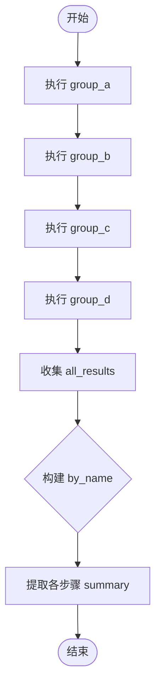
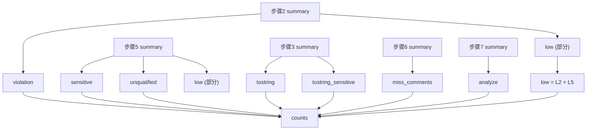
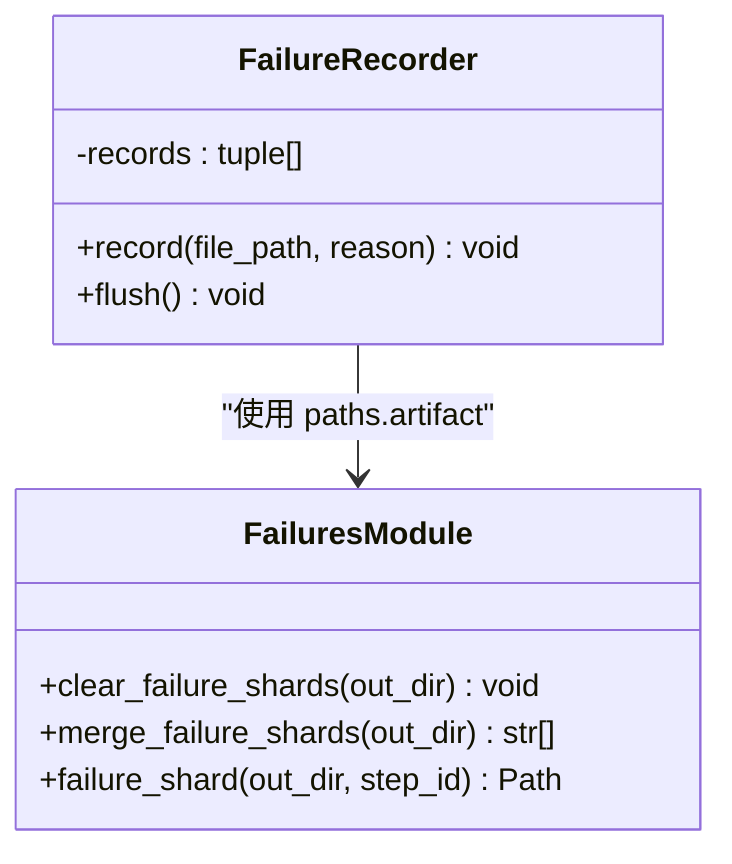
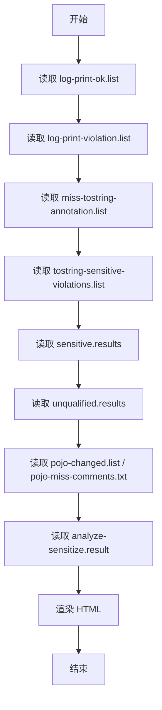
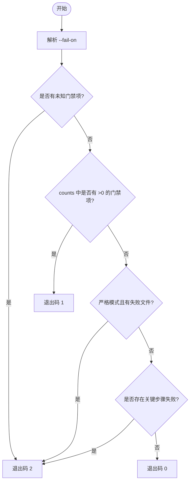
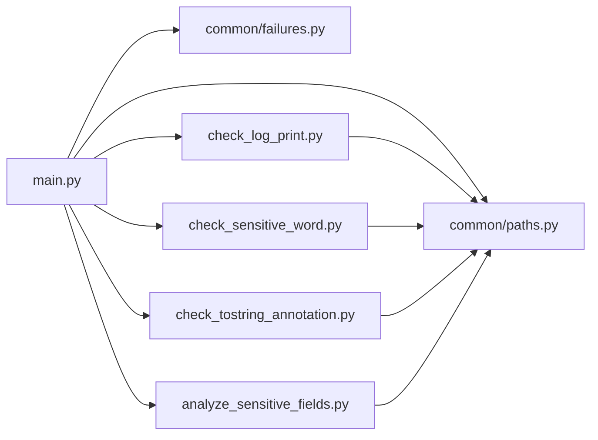
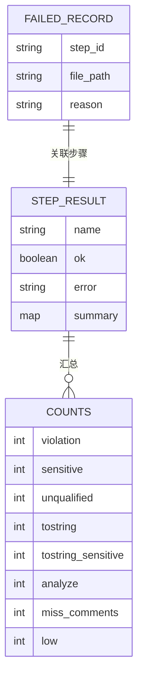
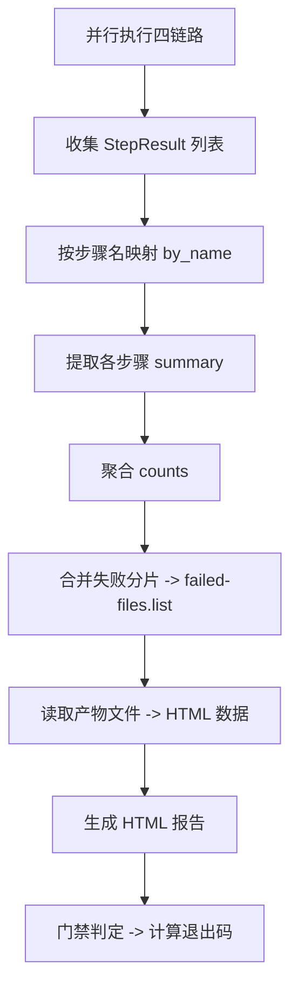

# 结果聚合策略

<cite>
**本文引用的文件**
- [main.py](file://sensitive-log-review/scripts/main.py)
- [failures.py](file://sensitive-log-review/scripts/common/failures.py)
- [paths.py](file://sensitive-log-review/scripts/common/paths.py)
- [check_log_print.py](file://sensitive-log-review/scripts/check_log_print.py)
- [check_sensitive_word.py](file://sensitive-log-review/scripts/check_sensitive_word.py)
- [check_tostring_annotation.py](file://sensitive-log-review/scripts/check_tostring_annotation.py)
- [analyze_sensitive_fields.py](file://sensitive-log-review/scripts/analyze_sensitive_fields.py)
</cite>

## 目录
1. [简介](#简介)
2. [项目结构](#项目结构)
3. [核心组件](#核心组件)
4. [架构总览](#架构总览)
5. [详细组件分析](#详细组件分析)
6. [依赖关系分析](#依赖关系分析)
7. [性能考虑](#性能考虑)
8. [故障排查指南](#故障排查指南)
9. [结论](#结论)
10. [附录](#附录)

## 简介
本文件面向“敏感信息审查工具”的结果聚合策略，系统性说明多链路结果的合并机制、计数统计的聚合算法、失败记录的分片存储与合并、HTML 报告的数据准备与渲染、门禁判断逻辑（含 fail-on 参数与退出码计算），以及结果验证与质量检查方法。文档同时提供数据结构图与聚合流程图，帮助读者快速理解从并行执行到最终报告与门禁判定的完整数据流。

## 项目结构
该工具采用“编排主脚本 + 多个独立子脚本”的架构：
- 编排层 main.py 负责四链路并行执行、StepResult 收集汇总、计数聚合、HTML 报告生成与门禁判定。
- 子脚本各自完成特定检查任务，输出产物文件并通过 stdout 的 SUMMARY 行上报计数。
- common 模块提供路径管理、失败记录分片、字典与规则加载等通用能力。

图表来源
- [main.py:187-297](file://sensitive-log-review/scripts/main.py#L187-L297)
- [failures.py:27-100](file://sensitive-log-review/scripts/common/failures.py#L27-L100)
- [paths.py:23-38](file://sensitive-log-review/scripts/common/paths.py#L23-L38)

章节来源
- [main.py:1-22](file://sensitive-log-review/scripts/main.py#L1-L22)
- [paths.py:1-69](file://sensitive-log-review/scripts/common/paths.py#L1-L69)

## 核心组件
- StepResult：封装单步骤执行结果（名称、是否成功、错误信息、摘要计数）。
- 四链路分组：group_a/group_b/group_c/group_d，分别串行或并行执行若干步骤，产出 StepResult 列表。
- 计数聚合：从各 StepResult.summary 中按 key 汇总得到 counts 字典。
- 失败记录分片：每个子脚本通过 FailureRecorder 写入 own shard；main 在结束时统一合并为 failed-files.list。
- HTML 报告：读取各产物文件并渲染为结构化 HTML，包含摘要网格、详情折叠与失败清单。
- 门禁判定：基于 --fail-on 参数与 counts 计算 gate_triggered，结合关键步骤失败决定退出码。

章节来源
- [main.py:97-144](file://sensitive-log-review/scripts/main.py#L97-L144)
- [main.py:276-297](file://sensitive-log-review/scripts/main.py#L276-L297)
- [main.py:791-803](file://sensitive-log-review/scripts/main.py#L791-L803)
- [failures.py:37-100](file://sensitive-log-review/scripts/common/failures.py#L37-L100)
- [main.py:353-505](file://sensitive-log-review/scripts/main.py#L353-L505)
- [main.py:809-856](file://sensitive-log-review/scripts/main.py#L809-L856)

## 架构总览
整体流程如下：
1. 解析参数与环境诊断（--doctor）。
2. 准备变更清单（--changed-only）。
3. 清理上一轮失败分片。
4. 四链路并行执行，收集 StepResult 列表。
5. 汇总计数 counts。
6. 合并失败分片为 failed-files.list。
7. 生成 HTML 报告。
8. 门禁判定与退出码计算。

图表来源
- [main.py:732-856](file://sensitive-log-review/scripts/main.py#L732-L856)
- [failures.py:66-100](file://sensitive-log-review/scripts/common/failures.py#L66-L100)
- [paths.py:44-68](file://sensitive-log-review/scripts/common/paths.py#L44-L68)

## 详细组件分析

### StepResult 列表的收集与处理流程
- 每个步骤函数返回 StepResult，包含 summary 字典（键值计数）与 ok 标志。
- group_* 将相关步骤串联执行，若前置步骤失败则短路返回。
- 四组通过线程池并发执行，收集 all_results。
- 后续通过 by_name 映射查找对应步骤的 summary，提取计数项。

图表来源
- [main.py:276-297](file://sensitive-log-review/scripts/main.py#L276-L297)
- [main.py:777-790](file://sensitive-log-review/scripts/main.py#L777-L790)

章节来源
- [main.py:97-144](file://sensitive-log-review/scripts/main.py#L97-L144)
- [main.py:276-297](file://sensitive-log-review/scripts/main.py#L276-L297)
- [main.py:777-790](file://sensitive-log-review/scripts/main.py#L777-L790)

### 计数统计的聚合算法
- 各子脚本通过 stdout 输出 SUMMARY 行，格式如 SUMMARY: violation=... low=... ok=...。
- main.py 使用 parse_summary 解析出键值对，填充到 StepResult.summary。
- 聚合阶段按步骤名定位 StepResult，并汇总 counts：
  - violation: 来自步骤2
  - sensitive/unqualified: 来自步骤5
  - tostring/tostring_sensitive: 来自步骤3
  - analyze: 来自步骤7
  - miss_comments: 来自步骤6
  - low: 步骤2与步骤5的 low 相加
- 注意：low 是跨链路的累加项，体现低置信提示总数。

图表来源
- [main.py:133-144](file://sensitive-log-review/scripts/main.py#L133-L144)
- [main.py:791-803](file://sensitive-log-review/scripts/main.py#L791-L803)

章节来源
- [main.py:133-144](file://sensitive-log-review/scripts/main.py#L133-L144)
- [main.py:791-803](file://sensitive-log-review/scripts/main.py#L791-L803)

### 失败记录的分片存储与合并机制
- 设计动机：多线程与多进程并发写同一文件会导致行撕裂或覆盖。
- 方案：每个步骤独立写出自己的分片文件 failed-files.<step>.part，避免竞争；无记录时清理旧分片保证幂等。
- 合并：merge_failure_shards 扫描所有分片，过滤有效行（至少两个制表符），写入 failed-files.list，并返回全部有效记录行。
- clear_failure_shards：运行前清理上一轮遗留分片与汇总文件，确保本次结果纯净。

图表来源
- [failures.py:27-100](file://sensitive-log-review/scripts/common/failures.py#L27-L100)
- [paths.py:66-68](file://sensitive-log-review/scripts/common/paths.py#L66-L68)

章节来源
- [failures.py:1-100](file://sensitive-log-review/scripts/common/failures.py#L1-L100)

### HTML 报告生成的数据准备与渲染逻辑
- 数据准备：read_artifact_lines 读取各产物文件的非空行，包括合规/违规清单、@ToString 缺失与敏感词违规、敏感字段、不规范字段、POJO 变更与注释问题、深度分析结果等。
- 渲染逻辑：render_pre 将内容转义后以 <pre> 展示，超过预览行数时提供 
 折叠查看完整清单。
- 报告内容：包含时间戳、项目信息、扫描模式、耗时、门禁结果、摘要网格、各章节详情与失败清单。

图表来源
- [main.py:329-351](file://sensitive-log-review/scripts/main.py#L329-L351)
- [main.py:353-505](file://sensitive-log-review/scripts/main.py#L353-L505)

章节来源
- [main.py:329-505](file://sensitive-log-review/scripts/main.py#L329-L505)

### 门禁判断逻辑与退出码计算
- 门禁项集合 GATE_KEYS：violation、sensitive、unqualified、tostring、tostring_sensitive、analyze、miss_comments、low。
- 解析 --fail-on 参数，校验未知项；gate_triggered 为 counts 中大于 0 的门禁项集合。
- 关键步骤失败：除步骤3与步骤6外，其他步骤失败视为关键错误，导致退出码 2。
- 严格模式：存在失败文件（failedFiles > 0）且开启 --strict-mode 时，退出码 2。
- 退出码：
  - 0：通过（--fail-on 指定的计数项全部为 0）
  - 1：触发门禁（任一指定计数项 > 0）
  - 2：执行错误（关键步骤失败或严格模式下有失败文件）

图表来源
- [main.py:79-80](file://sensitive-log-review/scripts/main.py#L79-L80)
- [main.py:809-856](file://sensitive-log-review/scripts/main.py#L809-L856)

章节来源
- [main.py:79-80](file://sensitive-log-review/scripts/main.py#L79-L80)
- [main.py:809-856](file://sensitive-log-review/scripts/main.py#L809-L856)

### 结果验证与质量检查方法
- 产物完整性：print_result_table 列出主要产物文件的存在性与路径，便于快速核对。
- 失败率告警：当 failedFiles 超过已处理文件总数的 10% 时醒目告警，提示检查结果可能不完整。
- 低置信提示：步骤2与步骤5的 low 计数用于区分低置信提示，默认不触发门禁，可通过 --fail-on-low 调整行为。
- 环境诊断：--doctor 模式检查 Python 版本、java/git 可用性、checkstyle jar 校验、规则与词典文件完整性、输出目录可写性等。

章节来源
- [main.py:508-531](file://sensitive-log-review/scripts/main.py#L508-L531)
- [main.py:831-841](file://sensitive-log-review/scripts/main.py#L831-L841)
- [check_log_print.py:1-22](file://sensitive-log-review/scripts/check_log_print.py#L1-L22)
- [check_sensitive_word.py:1-20](file://sensitive-log-review/scripts/check_sensitive_word.py#L1-L20)
- [main.py:534-703](file://sensitive-log-review/scripts/main.py#L534-L703)

## 依赖关系分析
- main.py 依赖 common.failures 进行失败记录分片与合并，依赖 common.paths 管理产物路径。
- 子脚本通过 common.git_utils 获取变更文件与新增行缓存，通过 common.text 进行文本规范化与解析。
- 子脚本之间无直接耦合，仅通过产物文件与 stdout SUMMARY 与 main.py 交互。

图表来源
- [main.py:41-70](file://sensitive-log-review/scripts/main.py#L41-L70)
- [check_log_print.py:31-35](file://sensitive-log-review/scripts/check_log_print.py#L31-L35)
- [check_sensitive_word.py:29-40](file://sensitive-log-review/scripts/check_sensitive_word.py#L29-L40)
- [check_tostring_annotation.py:33-38](file://sensitive-log-review/scripts/check_tostring_annotation.py#L33-L38)
- [analyze_sensitive_fields.py:29-39](file://sensitive-log-review/scripts/analyze_sensitive_fields.py#L29-L39)

章节来源
- [main.py:41-70](file://sensitive-log-review/scripts/main.py#L41-L70)

## 性能考虑
- 并行执行：四链路通过 ThreadPoolExecutor 并发执行，目标全流程 <60s。
- 增量扫描：--changed-only 模式仅处理变更文件，减少 IO 与计算量。
- 文本处理优化：清单匹配时对行进行一次性规范化，避免重复替换。
- 失败记录分片：避免并发写冲突，提升稳定性与幂等性。
- HTML 渲染：预览 + 折叠展示，降低大清单渲染开销。

[本节为一般性指导，无需具体文件分析]

## 故障排查指南
- 常见错误：
  - 分支无效：打印结构化错误提示（E003），退出码 2。
  - run-id 非法：打印结构化错误提示（E005），退出码 2。
  - 输出目录不可写：打印结构化错误提示（E006），退出码 2。
  - 规则文件损坏：打印结构化错误提示（E004），退出码 2。
- 失败文件过多：当 failedFiles 超过已处理文件总数 10% 时醒目告警，建议检查 failed-files.list。
- 低置信提示未触发门禁：确认是否设置 --fail-on-low 或已将 low 加入 --fail-on。
- 环境诊断：使用 --doctor 检查运行环境与依赖。

章节来源
- [main.py:705-729](file://sensitive-log-review/scripts/main.py#L705-L729)
- [main.py:732-756](file://sensitive-log-review/scripts/main.py#L732-L756)
- [main.py:831-841](file://sensitive-log-review/scripts/main.py#L831-L841)
- [main.py:534-703](file://sensitive-log-review/scripts/main.py#L534-L703)

## 结论
本工具通过四链路并行执行、StepResult 汇总、计数聚合、失败记录分片合并与 HTML 报告生成，实现了高效、稳定且可审计的敏感信息审查流程。门禁逻辑清晰，支持灵活配置与严格模式，便于在 CI/CD 中集成。通过产物完整性检查与失败率告警，进一步提升了结果的可信度与可维护性。

[本节为总结性内容，无需具体文件分析]

## 附录

### 数据结构图

图表来源
- [main.py:97-144](file://sensitive-log-review/scripts/main.py#L97-L144)
- [main.py:791-803](file://sensitive-log-review/scripts/main.py#L791-L803)
- [failures.py:37-100](file://sensitive-log-review/scripts/common/failures.py#L37-L100)

### 聚合流程图

图表来源
- [main.py:777-856](file://sensitive-log-review/scripts/main.py#L777-L856)
- [failures.py:66-100](file://sensitive-log-review/scripts/common/failures.py#L66-L100)