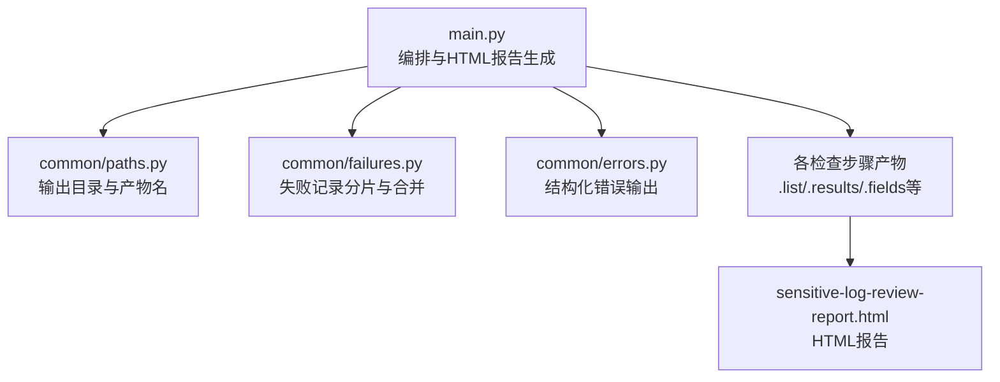
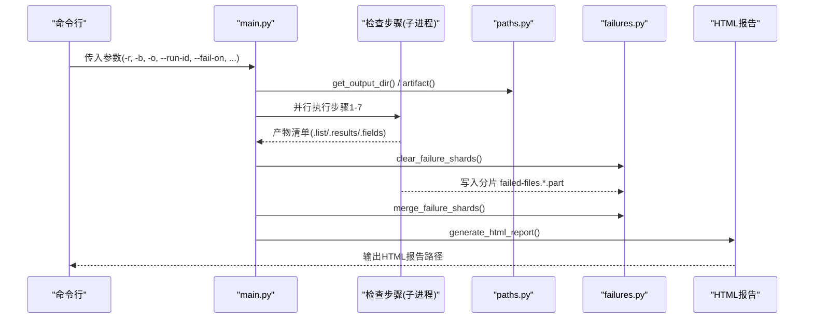
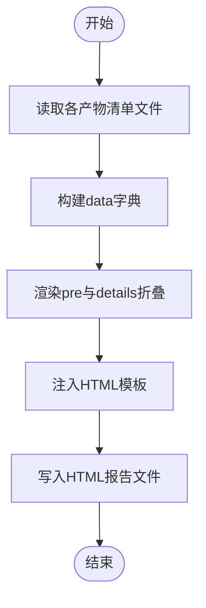
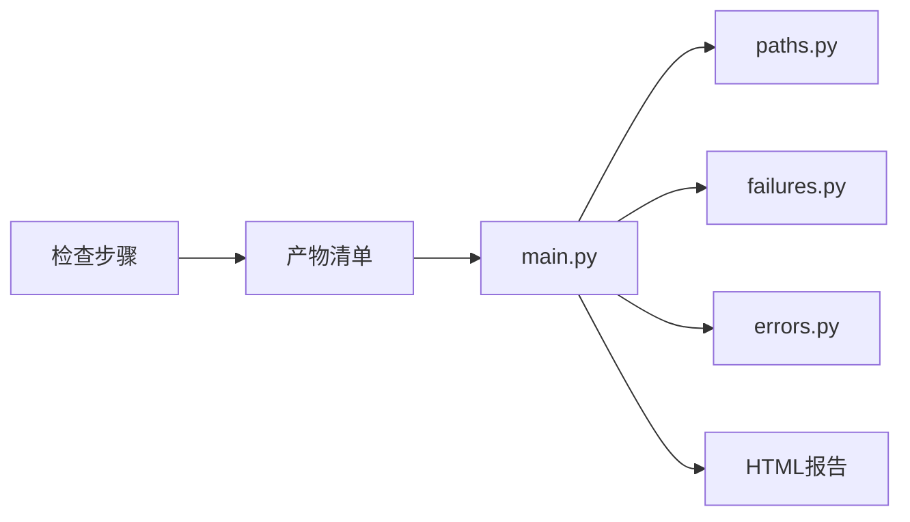

# 报告生成系统

<cite>
**本文引用的文件**
- [main.py](file://sensitive-log-review/scripts/main.py)
- [paths.py](file://sensitive-log-review/scripts/common/paths.py)
- [failures.py](file://sensitive-log-review/scripts/common/failures.py)
- [errors.py](file://sensitive-log-review/scripts/common/errors.py)
- [README.md](file://sensitive-log-review/README.md)
</cite>

## 目录
1. [简介](#简介)
2. [项目结构](#项目结构)
3. [核心组件](#核心组件)
4. [架构总览](#架构总览)
5. [详细组件分析](#详细组件分析)
6. [依赖关系分析](#依赖关系分析)
7. [性能考量](#性能考量)
8. [故障排查指南](#故障排查指南)
9. [结论](#结论)
10. [附录](#附录)

## 简介
本文件为敏感信息审查工具的“报告生成系统”提供系统化文档，聚焦 HTML 报告的生成机制、模板渲染与数据绑定、样式定制、内容组织（摘要统计、详细信息展示、折叠面板）、产物文件管理（命名约定、目录结构与生命周期）、数据聚合算法（计数、去重、排序）、可访问性与响应式布局、报告定制指南、CI/CD 集成中的上传归档机制，以及报告解读与常见问题诊断方法。

## 项目结构
报告生成系统位于 sensitive-log-review 模块中，由编排脚本 main.py 统一调度各检查步骤，产出多类清单文件，最终在步骤8生成 HTML 汇总报告；路径与产物名集中在 paths.py 管理；失败记录采用分片合并策略，见 failures.py；错误提示统一通过 errors.py 输出结构化信息。

图表来源
- [main.py:353-505](file://sensitive-log-review/scripts/main.py#L353-L505)
- [paths.py:23-68](file://sensitive-log-review/scripts/common/paths.py#L23-L68)
- [failures.py:27-100](file://sensitive-log-review/scripts/common/failures.py#L27-L100)
- [errors.py:18-100](file://sensitive-log-review/scripts/common/errors.py#L18-L100)

章节来源
- [main.py:1-120](file://sensitive-log-review/scripts/main.py#L1-L120)
- [paths.py:1-68](file://sensitive-log-review/scripts/common/paths.py#L1-L68)
- [failures.py:1-100](file://sensitive-log-review/scripts/common/failures.py#L1-L100)
- [errors.py:1-100](file://sensitive-log-review/scripts/common/errors.py#L1-L100)
- [README.md:1-120](file://sensitive-log-review/README.md#L1-L120)

## 核心组件
- 编排与报告生成：main.py 负责并行执行检查链路并生成 HTML 报告，包含摘要统计、详情区块与折叠面板。
- 产物与路径管理：paths.py 集中定义产物文件名与输出目录解析逻辑，支持 CI 并行隔离的 run-id。
- 失败记录管理：failures.py 实现进程安全的分片写入与合并，保证汇总结果完整。
- 错误提示：errors.py 提供统一错误码与修复建议模板，便于定位问题。

章节来源
- [main.py:329-505](file://sensitive-log-review/scripts/main.py#L329-L505)
- [paths.py:23-68](file://sensitive-log-review/scripts/common/paths.py#L23-L68)
- [failures.py:27-100](file://sensitive-log-review/scripts/common/failures.py#L27-L100)
- [errors.py:18-100](file://sensitive-log-review/scripts/common/errors.py#L18-L100)

## 架构总览
报告生成系统以 main.py 为中心，读取各步骤产出的清单文件，进行数据聚合与渲染，最终输出 HTML 报告。路径与产物名由 paths.py 统一管理；失败记录通过 failures.py 安全合并；错误信息通过 errors.py 标准化输出。

图表来源
- [main.py:732-800](file://sensitive-log-review/scripts/main.py#L732-L800)
- [paths.py:44-68](file://sensitive-log-review/scripts/common/paths.py#L44-L68)
- [failures.py:66-100](file://sensitive-log-review/scripts/common/failures.py#L66-L100)
- [main.py:353-505](file://sensitive-log-review/scripts/main.py#L353-L505)

## 详细组件分析

### HTML 报告生成机制
- 模板渲染：HTML 模板内嵌于 main.py 的字符串模板中，使用 f-string 将运行时数据注入到页面结构中。
- 数据绑定：通过 read_artifact_lines 读取各产物清单文件，构建 data 字典，再绑定到模板对应位置。
- 样式定制：内联 CSS 定义了响应式网格布局、卡片样式、警告色、成功色、代码块样式与折叠面板样式。
- 折叠面板：render_pre 对长列表进行预览 + details/summary 折叠，避免页面过长。

图表来源
- [main.py:329-351](file://sensitive-log-review/scripts/main.py#L329-L351)
- [main.py:353-505](file://sensitive-log-review/scripts/main.py#L353-L505)

章节来源
- [main.py:329-505](file://sensitive-log-review/scripts/main.py#L329-L505)

### 报告内容组织结构
- 摘要统计：顶部网格展示合规日志、违规日志、@ToString缺失、@ToString敏感词、敏感字段、不规范字段、深度分析命中、低置信提示等关键指标。
- 详细信息展示：按类别分节展示清单内容，如日志违规、注解缺失、敏感字段、POJO注释、深度分析等。
- 折叠面板：长列表默认显示前若干行，点击“查看全部 N 条”展开完整清单，提升可读性。

章节来源
- [main.py:378-497](file://sensitive-log-review/scripts/main.py#L378-L497)

### 产物文件管理系统
- 命名约定：所有产物文件名集中在 paths.py 定义，如 log-print-ok.list、log-print-violation.list、miss-tostring-annotation.list、tostring-sensitive-violations.list、all-fields.list、unqualified.fields、maybe-sensitive.fields、sensitive.results、unqualified.results、pojo-changed.list、pojo-miss-comments.txt、analyze-sensitize.result、failed-files.list、sensitive-log-review-report.html。
- 目录结构：输出目录优先级为 CLI 参数 > 环境变量 > 系统临时目录；支持 --run-id 隔离子目录，防止并行覆盖。
- 生命周期管理：运行前清理旧分片与汇总文件；各步骤独立写入分片；结束后合并为 failed-files.list；HTML 报告最后写入。

章节来源
- [paths.py:23-68](file://sensitive-log-review/scripts/common/paths.py#L23-L68)
- [failures.py:66-100](file://sensitive-log-review/scripts/common/failures.py#L66-L100)
- [main.py:770-776](file://sensitive-log-review/scripts/main.py#L770-L776)

### 报告数据聚合算法
- 计数统计：从各步骤 summary 或清单行数计算指标，如 violation、sensitive、unqualified、tostring、tostring_sensitive、analyze、miss_comments、low。
- 去重处理：清单文件每行代表一条记录，读取时过滤空行；失败记录分片合并时校验行完整性（至少两个制表符）。
- 排序逻辑：清单文件保持步骤输出顺序；HTML 展示按固定章节顺序排列；未对清单内部行做额外排序。

章节来源
- [main.py:791-800](file://sensitive-log-review/scripts/main.py#L791-L800)
- [failures.py:79-100](file://sensitive-log-review/scripts/common/failures.py#L79-L100)

### 可访问性与响应式布局
- 可访问性：HTML 使用语义化标签（h1/h2、ul/li、details/summary），标题语言设置为 zh-CN，确保基础可访问性。
- 响应式布局：CSS 使用 grid-template-columns: repeat(auto-fit, minmax(160px, 1fr)) 自适应卡片布局；容器最大宽度限制，适配不同屏幕尺寸。

章节来源
- [main.py:378-497](file://sensitive-log-review/scripts/main.py#L378-L497)

### 报告定制指南
- 样式修改：调整 main.py 中内联 CSS 的配色、字体、间距与布局规则。
- 内容扩展：在 data 字典中添加新字段，并在模板中插入对应区块；新增清单文件需在 paths.py 定义名称。
- 导出格式转换：当前仅生成 HTML；如需其他格式，可在 generate_html_report 后追加转换逻辑（如 PDF、Markdown）。

章节来源
- [main.py:353-505](file://sensitive-log-review/scripts/main.py#L353-L505)
- [paths.py:23-38](file://sensitive-log-review/scripts/common/paths.py#L23-L38)

### CI/CD 集成中的报告上传与归档
- 上传机制：CI 流水线将输出目录作为工件归档，如 Jenkins archiveArtifacts 或 GitHub Actions upload-artifact。
- 归档策略：建议使用 --run-id 隔离每次构建产物；HTML 报告与清单文件一并归档，便于回溯。
- 门禁集成：根据退出码决定流程分支（0 通过、1 门禁拦截、2 执行错误）；可通过 --fail-on 控制拦截项。

章节来源
- [README.md:175-234](file://sensitive-log-review/README.md#L175-L234)
- [paths.py:44-68](file://sensitive-log-review/scripts/common/paths.py#L44-L68)

### 报告解读指南
- 摘要区：关注违规日志、@ToString缺失、敏感字段、不规范字段、深度分析命中等关键指标。
- 详情区：逐项查看清单内容，定位具体文件与行号；失败文件区块用于排查读取/解析异常。
- 折叠面板：长列表先预览，需要时展开完整清单；避免信息过载。

章节来源
- [main.py:378-497](file://sensitive-log-review/scripts/main.py#L378-L497)

### 常见问题诊断方法
- 环境诊断：使用 --doctor 检查 Python/java/git、规则与词典文件、输出目录可写性等。
- 结构化错误：errors.py 提供错误码与修复建议，便于快速定位问题。
- 失败文件：failed-files.list 记录读取/解析失败的文件与原因；HTML 报告“失败文件”区块同步展示。

章节来源
- [main.py:533-702](file://sensitive-log-review/scripts/main.py#L533-L702)
- [errors.py:18-100](file://sensitive-log-review/scripts/common/errors.py#L18-L100)
- [failures.py:79-100](file://sensitive-log-review/scripts/common/failures.py#L79-L100)

## 依赖关系分析
- main.py 依赖 paths.py 获取输出目录与产物路径。
- main.py 依赖 failures.py 管理失败记录分片与合并。
- main.py 依赖 errors.py 输出结构化错误信息。
- 各检查步骤产出清单文件，被 main.py 读取并渲染到 HTML 报告中。

图表来源
- [main.py:353-505](file://sensitive-log-review/scripts/main.py#L353-L505)
- [paths.py:44-68](file://sensitive-log-review/scripts/common/paths.py#L44-L68)
- [failures.py:66-100](file://sensitive-log-review/scripts/common/failures.py#L66-L100)
- [errors.py:18-100](file://sensitive-log-review/scripts/common/errors.py#L18-L100)

章节来源
- [main.py:353-505](file://sensitive-log-review/scripts/main.py#L353-L505)
- [paths.py:44-68](file://sensitive-log-review/scripts/common/paths.py#L44-L68)
- [failures.py:66-100](file://sensitive-log-review/scripts/common/failures.py#L66-L100)
- [errors.py:18-100](file://sensitive-log-review/scripts/common/errors.py#L18-L100)

## 性能考量
- 并行执行：四链路并行减少整体耗时，适合 CI 场景。
- 变更扫描：默认仅扫描变更文件，提升速度；全量扫描适用于全面审计。
- 折叠面板：避免大列表导致页面加载缓慢，提升用户体验。
- 失败记录分片：进程安全写入，避免竞争条件，提高可靠性。

[本节为通用指导，不直接分析具体文件]

## 故障排查指南
- 环境诊断：运行 --doctor 检查依赖与环境配置。
- 错误码参考：根据 errors.py 的错误码与修复建议定位问题。
- 失败文件分析：查看 failed-files.list 与 HTML 报告“失败文件”区块，定位读取/解析异常。
- 门禁失败：根据控制台输出的门禁触发项与数量，结合 HTML 报告定位具体问题。

章节来源
- [main.py:533-702](file://sensitive-log-review/scripts/main.py#L533-L702)
- [errors.py:18-100](file://sensitive-log-review/scripts/common/errors.py#L18-L100)
- [failures.py:79-100](file://sensitive-log-review/scripts/common/failures.py#L79-L100)

## 结论
报告生成系统通过统一的编排与模板渲染机制，实现了高效、可靠且易读的 HTML 报告输出。产物文件管理与失败记录机制保障了数据的完整性与可追溯性。结合 CI/CD 集成，可实现自动化门禁与归档，满足敏感信息审查的合规需求。

[本节为总结性内容，不直接分析具体文件]

## 附录
- 常用命令：参考 README.md 的使用示例与参数说明。
- 产物清单：参考 paths.py 定义的产物文件名与含义。
- 错误码：参考 errors.py 的错误码与修复建议。

章节来源
- [README.md:127-254](file://sensitive-log-review/README.md#L127-L254)
- [paths.py:23-38](file://sensitive-log-review/scripts/common/paths.py#L23-L38)
- [errors.py:18-100](file://sensitive-log-review/scripts/common/errors.py#L18-L100)