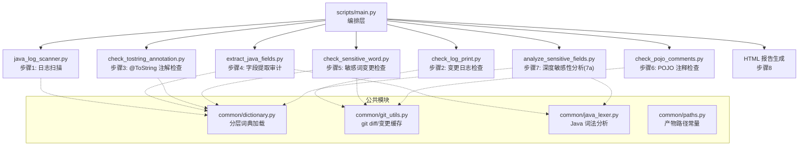
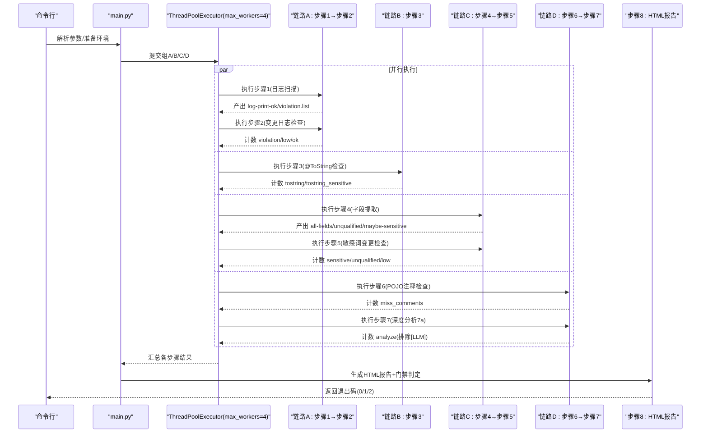
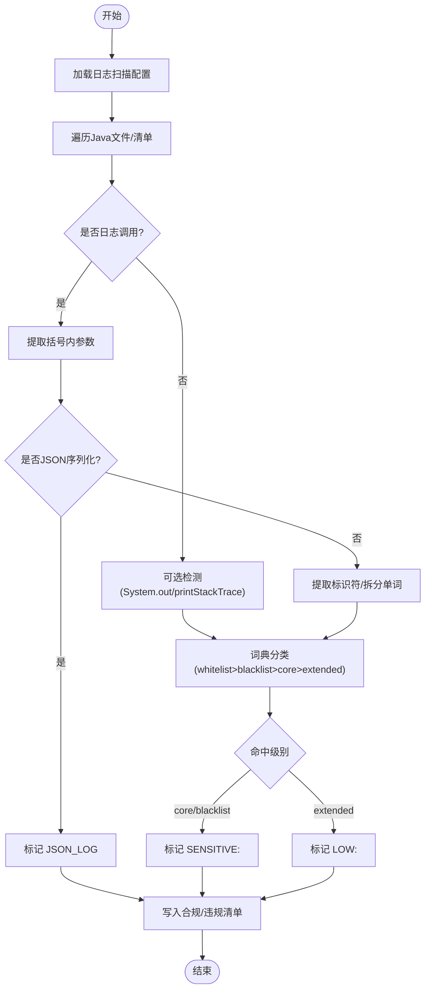
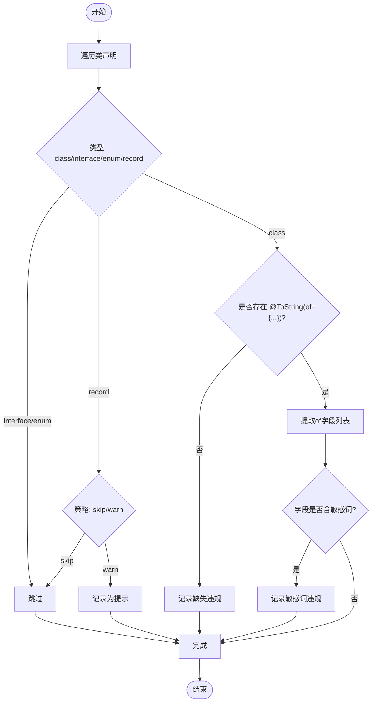
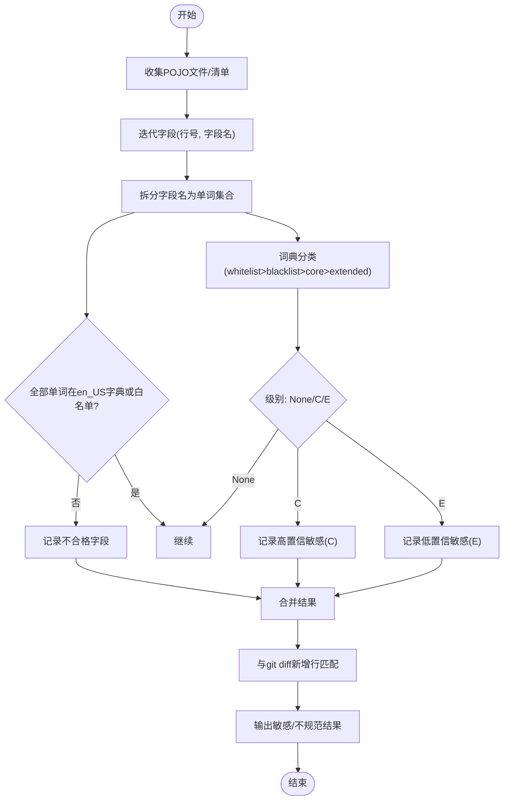
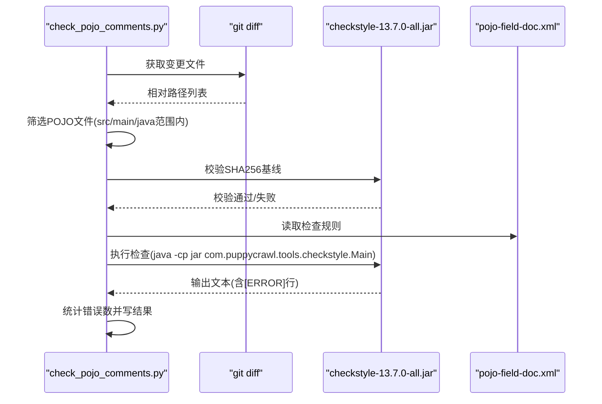
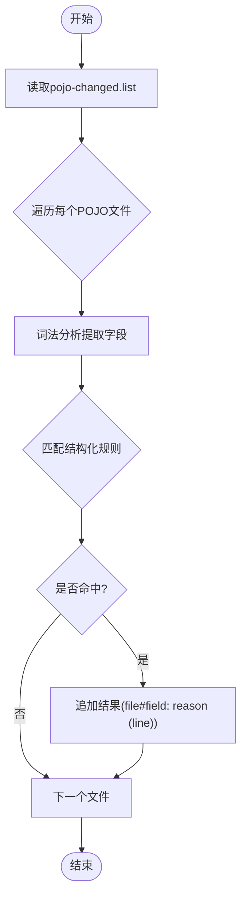
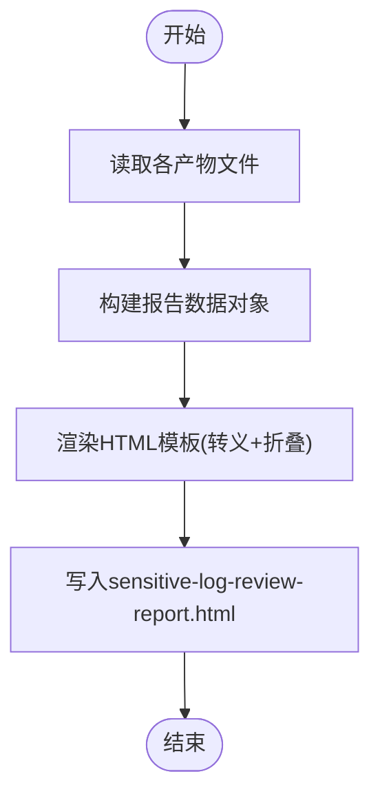
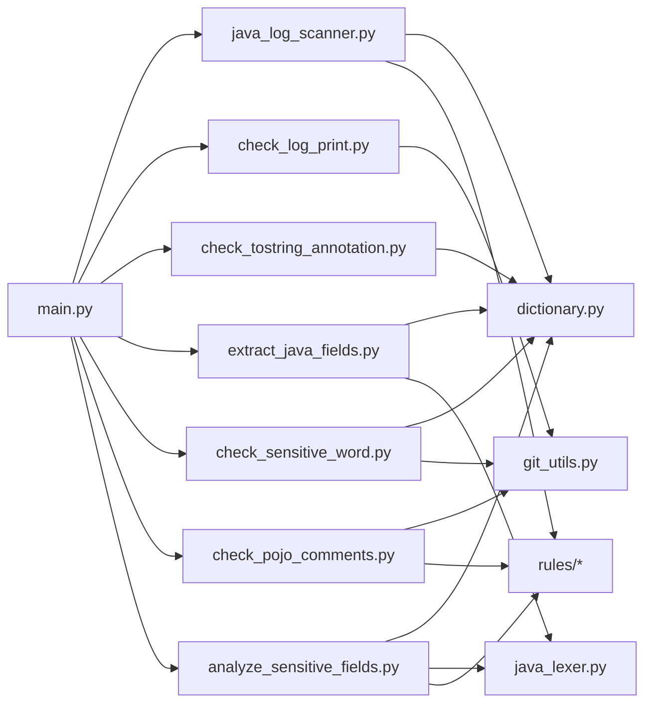

# 敏感信息审查工具

<cite>
**本文引用的文件**
- [README.md](file://sensitive-log-review/README.md)
- [SKILL.md](file://sensitive-log-review/SKILL.md)
- [main.py](file://sensitive-log-review/scripts/main.py)
- [java_log_scanner.py](file://sensitive-log-review/scripts/java_log_scanner.py)
- [check_log_print.py](file://sensitive-log-review/scripts/check_log_print.py)
- [extract_java_fields.py](file://sensitive-log-review/scripts/extract_java_fields.py)
- [check_sensitive_word.py](file://sensitive-log-review/scripts/check_sensitive_word.py)
- [check_tostring_annotation.py](file://sensitive-log-review/scripts/check_tostring_annotation.py)
- [analyze_sensitive_fields.py](file://sensitive-log-review/scripts/analyze_sensitive_fields.py)
- [check_pojo_comments.py](file://sensitive-log-review/scripts/check_pojo_comments.py)
- [dictionary.py](file://sensitive-log-review/scripts/common/dictionary.py)
- [log-scanner.json](file://sensitive-log-review/scripts/rules/log-scanner.json)
- [sensitive-field-rules.json](file://sensitive-log-review/scripts/rules/sensitive-field-rules.json)
- [pojo.config](file://sensitive-log-review/scripts/rules/pojo.config)
</cite>

## 目录
1. [简介](#简介)
2. [项目结构](#项目结构)
3. [核心组件](#核心组件)
4. [架构总览](#架构总览)
5. [详细组件分析](#详细组件分析)
6. [依赖关系分析](#依赖关系分析)
7. [性能考量](#性能考量)
8. [故障排查指南](#故障排查指南)
9. [结论](#结论)
10. [附录](#附录)

## 简介
本工具面向 Java 项目的“敏感信息日志审查”流水线，围绕“敏感数据不落日志”的核心目标，从四大检查维度对代码进行自动化审查，并生成 HTML 报告与 CI 门禁判定结果。其设计特别贴合银行金融业合规要求，依据 JR/T 0171-2020《个人金融信息保护技术规范》的敏感数据分类分级标准（C2/C3）构建规则体系。

主要能力：
- 日志扫描：检测日志语句中的敏感词与 JSON 序列化输出
- 字段分析：提取 POJO 字段并进行命名规范与敏感性审计
- POJO 注释检查：基于 Checkstyle 校验字段文档注释完整性
- 敏感词检测：分层词典匹配（白名单/黑名单/高置信/低置信），结合结构化规则初筛与 LLM 语义复核

执行模式：
- 默认变更检查：仅对比目标分支的变更 Java 文件，速度快
- 全量扫描：覆盖所有 Java 文件，适合离线或基线检查

## 项目结构
工具以 Python 脚本为主，采用“编排层 + 多步骤子脚本 + 公共模块 + 规则/词典”的分层组织方式。编排层 main.py 通过线程池将八个步骤组织为四条并行链路，最终汇总产出 HTML 报告与门禁判定。

图表来源
- [main.py:187-297](file://sensitive-log-review/scripts/main.py#L187-L297)
- [java_log_scanner.py:1-436](file://sensitive-log-review/scripts/java_log_scanner.py#L1-L436)
- [check_log_print.py:1-246](file://sensitive-log-review/scripts/check_log_print.py#L1-L246)
- [extract_java_fields.py:1-220](file://sensitive-log-review/scripts/extract_java_fields.py#L1-L220)
- [check_sensitive_word.py:1-262](file://sensitive-log-review/scripts/check_sensitive_word.py#L1-L262)
- [check_tostring_annotation.py:1-270](file://sensitive-log-review/scripts/check_tostring_annotation.py#L1-L270)
- [analyze_sensitive_fields.py:1-189](file://sensitive-log-review/scripts/analyze_sensitive_fields.py#L1-L189)
- [check_pojo_comments.py:1-273](file://sensitive-log-review/scripts/check_pojo_comments.py#L1-L273)
- [dictionary.py:1-143](file://sensitive-log-review/scripts/common/dictionary.py#L1-L143)

章节来源
- [README.md:20-53](file://sensitive-log-review/README.md#L20-L53)
- [SKILL.md:70-157](file://sensitive-log-review/SKILL.md#L70-L157)

## 核心组件
- 编排器 main.py：负责参数解析、环境准备、四链路并行调度、结果聚合、HTML 报告生成与门禁判定
- 日志扫描 java_log_scanner.py：识别日志调用、JSON 序列化、敏感词命中（core/blacklist/extended），输出合规/违规清单
- 变更日志检查 check_log_print.py：基于 git diff 新增行过滤，区分常规违规与低置信提示（LOW）
- 字段提取 extract_java_fields.py：提取 POJO 字段，进行命名规范与敏感性审计，输出全量/不合格/可能敏感清单
- 敏感词变更检查 check_sensitive_word.py：将字段审计结果与变更新增行匹配，输出敏感/不规范结果
- @ToString 检查 check_tostring_annotation.py：确保 POJO 使用 @ToString(of = {...})，并检查其中字段是否含敏感词
- 深度分析 analyze_sensitive_fields.py：基于结构化规则（JR/T 0171-2020）进行字段敏感性初筛（7a）
- POJO 注释检查 check_pojo_comments.py：调用 Checkstyle 校验字段注释完整性，并做 jar 完整性校验

章节来源
- [main.py:732-800](file://sensitive-log-review/scripts/main.py#L732-L800)
- [java_log_scanner.py:148-213](file://sensitive-log-review/scripts/java_log_scanner.py#L148-L213)
- [check_log_print.py:74-93](file://sensitive-log-review/scripts/check_log_print.py#L74-L93)
- [extract_java_fields.py:52-81](file://sensitive-log-review/scripts/extract_java_fields.py#L52-L81)
- [check_sensitive_word.py:71-99](file://sensitive-log-review/scripts/check_sensitive_word.py#L71-L99)
- [check_tostring_annotation.py:43-90](file://sensitive-log-review/scripts/check_tostring_annotation.py#L43-L90)
- [analyze_sensitive_fields.py:44-67](file://sensitive-log-review/scripts/analyze_sensitive_fields.py#L44-L67)
- [check_pojo_comments.py:108-138](file://sensitive-log-review/scripts/check_pojo_comments.py#L108-L138)

## 架构总览
工具采用“四链路并行”的流水线架构，最大化利用多线程提升整体吞吐，同时保证关键步骤失败时快速退出。

图表来源
- [main.py:777-786](file://sensitive-log-review/scripts/main.py#L777-L786)
- [main.py:187-297](file://sensitive-log-review/scripts/main.py#L187-L297)

章节来源
- [README.md:30-53](file://sensitive-log-review/README.md#L30-L53)
- [SKILL.md:70-157](file://sensitive-log-review/SKILL.md#L70-L157)

## 详细组件分析

### 日志扫描与变更检查（步骤1/2）
- 步骤1（java_log_scanner.py）：
  - 识别日志变量名（可配置），支持多行日志拼接
  - 检测 JSON 序列化输出（fastjson/Gson/Jackson/Hutool等）
  - 使用分层词典判定敏感词（core/blacklist/extended），输出合规与违规清单
- 步骤2（check_log_print.py）：
  - 基于 git diff 新增行过滤，仅保留当前分支新增内容
  - 区分常规违规与低置信提示（LOW），默认不触发门禁
  - 输出 SUMMARY 供主流程统计

图表来源
- [java_log_scanner.py:70-102](file://sensitive-log-review/scripts/java_log_scanner.py#L70-L102)
- [java_log_scanner.py:148-213](file://sensitive-log-review/scripts/java_log_scanner.py#L148-L213)
- [java_log_scanner.py:216-298](file://sensitive-log-review/scripts/java_log_scanner.py#L216-L298)
- [check_log_print.py:74-93](file://sensitive-log-review/scripts/check_log_print.py#L74-L93)

章节来源
- [java_log_scanner.py:1-436](file://sensitive-log-review/scripts/java_log_scanner.py#L1-L436)
- [check_log_print.py:1-246](file://sensitive-log-review/scripts/check_log_print.py#L1-L246)
- [log-scanner.json:1-7](file://sensitive-log-review/scripts/rules/log-scanner.json#L1-L7)

### @ToString 注解检查（步骤3）
- 检查类是否使用 @ToString(of = {...})，未使用或缺失 of 属性视为违规
- 支持全限定注解名（如 @lombok.ToString），排除 @ToStringBuilder 等
- 若存在 of 字段列表，进一步检查是否包含敏感词

图表来源
- [check_tostring_annotation.py:43-90](file://sensitive-log-review/scripts/check_tostring_annotation.py#L43-L90)
- [check_tostring_annotation.py:93-139](file://sensitive-log-review/scripts/check_tostring_annotation.py#L93-L139)

章节来源
- [check_tostring_annotation.py:1-270](file://sensitive-log-review/scripts/check_tostring_annotation.py#L1-L270)

### 字段提取与敏感词变更检查（步骤4/5）
- 步骤4（extract_java_fields.py）：
  - 使用词法分析器提取字段（支持多行声明/record组件/枚举常量）
  - 命名规范：拆分后的单词需在英文词典或技术缩写白名单中
  - 敏感性：基于分层词典判定（C/E级）
- 步骤5（check_sensitive_word.py）：
  - 将字段审计结果与 git diff 新增行匹配
  - 区分高置信敏感（阻塞）与低置信（默认不拦截）
  - 输出敏感/不规范结果清单

图表来源
- [extract_java_fields.py:52-81](file://sensitive-log-review/scripts/extract_java_fields.py#L52-L81)
- [extract_java_fields.py:149-201](file://sensitive-log-review/scripts/extract_java_fields.py#L149-L201)
- [check_sensitive_word.py:71-99](file://sensitive-log-review/scripts/check_sensitive_word.py#L71-L99)
- [check_sensitive_word.py:156-243](file://sensitive-log-review/scripts/check_sensitive_word.py#L156-L243)

章节来源
- [extract_java_fields.py:1-220](file://sensitive-log-review/scripts/extract_java_fields.py#L1-L220)
- [check_sensitive_word.py:1-262](file://sensitive-log-review/scripts/check_sensitive_word.py#L1-L262)

### POJO 注释检查（步骤6）
- 获取变更 POJO 文件清单
- 校验 Checkstyle jar 完整性（SHA256 基线）
- 运行 Checkstyle 规则检查字段注释完整性
- 统计错误行数并输出结果

图表来源
- [check_pojo_comments.py:81-95](file://sensitive-log-review/scripts/check_pojo_comments.py#L81-L95)
- [check_pojo_comments.py:108-138](file://sensitive-log-review/scripts/check_pojo_comments.py#L108-L138)
- [check_pojo_comments.py:141-143](file://sensitive-log-review/scripts/check_pojo_comments.py#L141-L143)

章节来源
- [check_pojo_comments.py:1-273](file://sensitive-log-review/scripts/check_pojo_comments.py#L1-L273)

### 深度敏感性分析（步骤7a/7b）
- 7a（analyze_sensitive_fields.py）：
  - 读取 pojo-changed.list 中的变更 POJO 文件
  - 复用词法分析器提取字段
  - 对照结构化规则（JR/T 0171-2020）判定敏感级别
  - 输出 analyze-sensitize.result
- 7b（AI 语义复核）：
  - 无脚本，由 AI 在 Skill 编排层执行
  - 读取 pojo-changed.list，逐个读取 POJO 全文（含注释）
  - 识别拼音命名/无意义命名/语义缩写背后的注释语义
  - 将复核结论追加到 analyze-sensitize.result，行首标注 [LLM]
  - 7b 结果不计入门禁统计

图表来源
- [analyze_sensitive_fields.py:44-67](file://sensitive-log-review/scripts/analyze_sensitive_fields.py#L44-L67)
- [analyze_sensitive_fields.py:70-93](file://sensitive-log-review/scripts/analyze_sensitive_fields.py#L70-L93)
- [SKILL.md:120-152](file://sensitive-log-review/SKILL.md#L120-L152)

章节来源
- [analyze_sensitive_fields.py:1-189](file://sensitive-log-review/scripts/analyze_sensitive_fields.py#L1-L189)
- [SKILL.md:120-152](file://sensitive-log-review/SKILL.md#L120-L152)

### HTML 报告生成（步骤8）
- 读取各步骤产物文件（合规/违规清单、@ToString 问题、敏感字段、POJO 注释问题、深度分析结果）
- 渲染 HTML 页面，包含摘要网格、折叠详情区块、失败文件区块
- 动态内容经 HTML 转义，防止 XSS
- 底部标注产物目录路径，便于定位原始数据

图表来源
- [main.py:353-505](file://sensitive-log-review/scripts/main.py#L353-L505)

章节来源
- [main.py:353-505](file://sensitive-log-review/scripts/main.py#L353-L505)

## 依赖关系分析
- 公共模块依赖：
  - dictionary.py：提供分层词典加载与分类逻辑（whitelist > blacklist > core > extended）
  - git_utils.py：提供 git diff 获取变更文件、新增行缓存
  - java_lexer.py：提供 Java 词法分析（字段/类/注解提取）
  - paths.py：提供产物路径常量与输出目录解析
- 规则与词典：
  - log-scanner.json：日志扫描器配置（logger_names、可选检测开关）
  - sensitive-field-rules.json：结构化敏感字段规则（类别/级别/正则/原因）
  - pojo.config：POJO 文件判定配置（目录名/文件名后缀）
  - dictionary/ 下的词典文件：敏感词四层优先级

图表来源
- [main.py:187-297](file://sensitive-log-review/scripts/main.py#L187-L297)
- [dictionary.py:1-143](file://sensitive-log-review/scripts/common/dictionary.py#L1-L143)
- [log-scanner.json:1-7](file://sensitive-log-review/scripts/rules/log-scanner.json#L1-L7)
- [sensitive-field-rules.json:1-45](file://sensitive-log-review/scripts/rules/sensitive-field-rules.json#L1-L45)
- [pojo.config:1-25](file://sensitive-log-review/scripts/rules/pojo.config#L1-L25)

章节来源
- [dictionary.py:1-143](file://sensitive-log-review/scripts/common/dictionary.py#L1-L143)
- [log-scanner.json:1-7](file://sensitive-log-review/scripts/rules/log-scanner.json#L1-L7)
- [sensitive-field-rules.json:1-45](file://sensitive-log-review/scripts/rules/sensitive-field-rules.json#L1-L45)
- [pojo.config:1-25](file://sensitive-log-review/scripts/rules/pojo.config#L1-L25)

## 性能考量
- 并行处理：使用 ThreadPoolExecutor(max_workers=4) 实现四链路并行，目标全流程 <60s
- 变更优先：默认 --changed-only 模式，仅扫描相对目标分支变更的 Java 文件，显著减少扫描范围
- 词典缓存：dictionary.py 使用模块级缓存（基于文件 mtime），避免重复加载大词典（如 en_US-large.txt）
- 正则优化：日志扫描器使用 lru_cache 缓存编译后的日志调用模式，同一配置只编译一次
- 增量过滤：check_log_print.py 与 check_sensitive_word.py 使用 AddedLinesCache 缓存 git diff 新增行，减少重复进程调用
- 失败文件隔离：各步骤通过 FailureRecorder 记录失败文件分片，最终汇总至 failed-files.list，不影响其他步骤

## 故障排查指南
- 控制台中文乱码：设置 PYTHONIOENCODING=utf-8（Windows 下建议）
- 不是 git 仓库：确保 -r/--root 指向包含 .git 的仓库目录
- 找不到 java 命令：安装 JRE/JDK 并确保 PATH 中包含 java
- 变更检查无结果：确认 --branch 指定正确的对比基准；CI 中需完整历史（fetch-depth: 0）
- 误报处理：将字段名加入 sensitive-words.whitelist，递增版本头后重新运行
- 漏报处理：高置信词根加入 sensitive-core.txt；必拦字段加入 sensitive-words.blacklist；泛用词加入 sensitive-extended.txt
- run-id 非法字符：仅允许 [A-Za-z0-9._-]，且不以符号开头，最长 64 字符
- jar SHA256 校验失败：从可信源重新获取 jar，或同步更新基线值
- --doctor 诊断：逐项检查运行环境，全部通过退出码 0，任一失败退出码 2

章节来源
- [README.md:361-483](file://sensitive-log-review/README.md#L361-L483)
- [SKILL.md:31-57](file://sensitive-log-review/SKILL.md#L31-L57)

## 结论
本工具通过四大检查维度与四链路并行架构，为银行金融业提供了系统化、可配置的敏感信息审查能力。其设计兼顾了准确性（结构化规则 + LLM 语义复核）、效率（变更优先 + 并行处理）与可维护性（分层词典 + 规则配置）。在实际使用中，建议结合 CI/CD 集成，利用退出码契约与 HTML 报告实现自动化门禁与人工复核闭环。

## 附录

### 命令行接口参考
- 基本用法：python scripts/main.py -r . -b master -o ./review-output
- 全量扫描：python scripts/main.py -r . --full-scan
- 环境诊断：python scripts/main.py --doctor -r .
- 详细输出：python scripts/main.py -r . -v
- 自定义门禁：python scripts/main.py -r . --fail-on violation,sensitive
- 关闭门禁：python scripts/main.py -r . --fail-on ""

章节来源
- [README.md:127-160](file://sensitive-log-review/README.md#L127-L160)
- [main.py:705-729](file://sensitive-log-review/scripts/main.py#L705-L729)

### 规则配置系统
- log-scanner.json：配置日志变量名与可选检测开关
- sensitive-field-rules.json：定义敏感数据分类规则（类别/级别/正则/原因）
- pojo.config：定义 POJO 文件判定规则（目录名/文件名后缀）
- 词典文件：四层优先级（whitelist > blacklist > core > extended），支持版本头管理

章节来源
- [log-scanner.json:1-7](file://sensitive-log-review/scripts/rules/log-scanner.json#L1-L7)
- [sensitive-field-rules.json:1-45](file://sensitive-log-review/scripts/rules/sensitive-field-rules.json#L1-L45)
- [pojo.config:1-25](file://sensitive-log-review/scripts/rules/pojo.config#L1-L25)
- [dictionary.py:1-143](file://sensitive-log-review/scripts/common/dictionary.py#L1-L143)

### 银行金融业合规要求与最佳实践
- 依据 JR/T 0171-2020 分类分级标准（C2/C3）构建规则体系
- 七大数据类别：身份鉴别信息、生物识别信息、金融账户信息、财产与信用信息、基本资料、交易与行为信息、密钥与证书
- 最佳实践：
  - 日志脱敏：避免直接输出敏感字段，使用脱敏函数或占位符
  - 注解规范：强制使用 @ToString(of = {...}) 控制 toString 输出
  - 字段命名：遵循英文词典规范，避免拼音/无意义命名
  - 注释完整：确保 POJO 字段具备文档注释，便于理解业务语义

章节来源
- [README.md:20-28](file://sensitive-log-review/README.md#L20-L28)
- [sensitive-field-rules.json:1-45](file://sensitive-log-review/scripts/rules/sensitive-field-rules.json#L1-L45)

### 实际使用示例
- PR/MR 合并前检查：python scripts/main.py -r . -b origin/master -o ./review-output
- CI 集成（Jenkins）：设置环境变量 PYTHONIOENCODING=utf-8，执行审查并归档产物
- CI 集成（GitHub Actions）：使用 actions/setup-java 安装 Java，actions/setup-python 安装 Python，执行审查并上传报告

章节来源
- [README.md:175-234](file://sensitive-log-review/README.md#L175-L234)