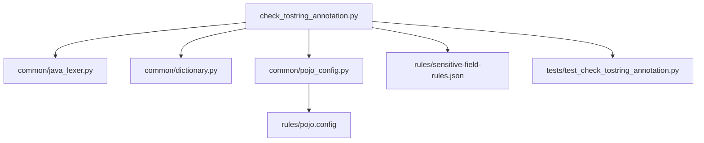
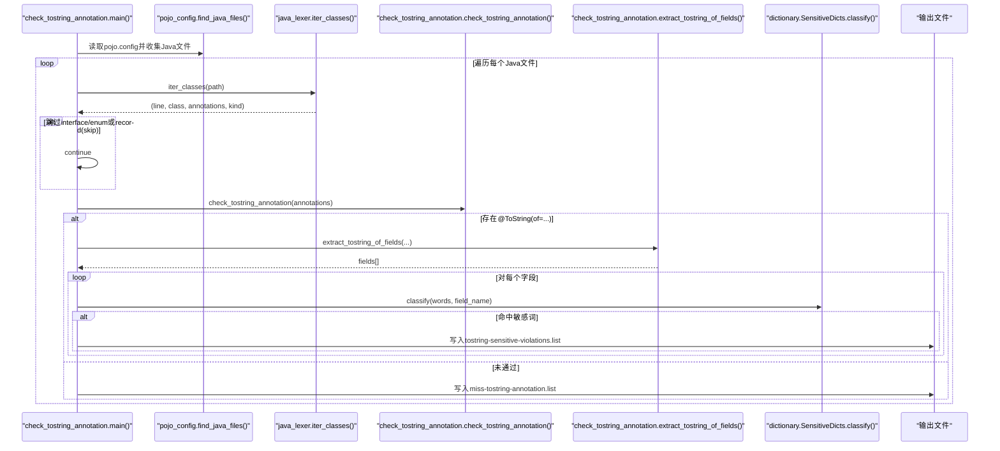
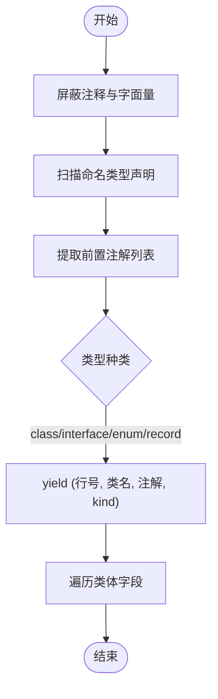
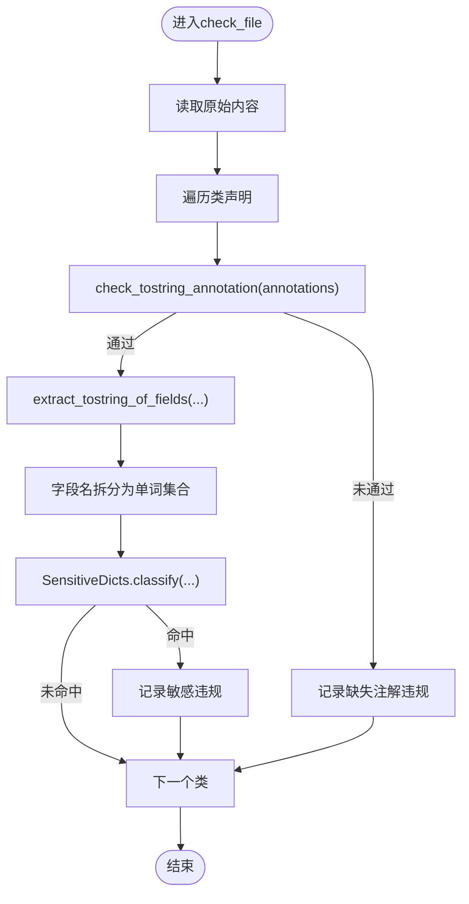
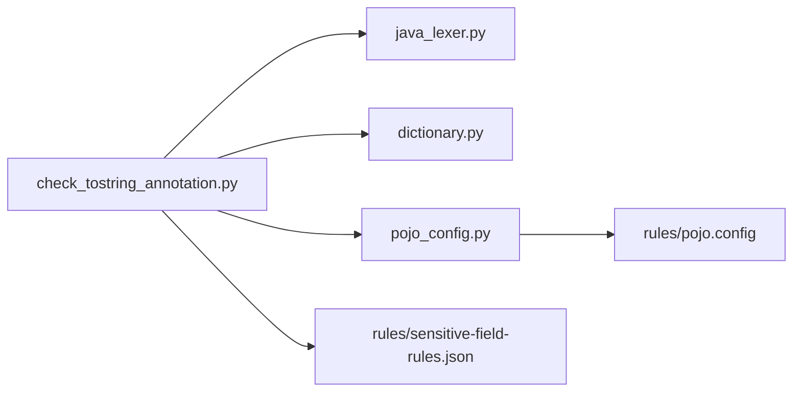

# @ToString注解检查

<cite>
**本文引用的文件**
- [check_tostring_annotation.py](file://sensitive-log-review/scripts/check_tostring_annotation.py)
- [java_lexer.py](file://sensitive-log-review/scripts/common/java_lexer.py)
- [dictionary.py](file://sensitive-log-review/scripts/common/dictionary.py)
- [pojo_config.py](file://sensitive-log-review/scripts/common/pojo_config.py)
- [pojo.config](file://sensitive-log-review/scripts/rules/pojo.config)
- [sensitive-field-rules.json](file://sensitive-log-review/scripts/rules/sensitive-field-rules.json)
- [README.md](file://sensitive-log-review/README.md)
- [test_check_tostring_annotation.py](file://sensitive-log-review/tests/test_check_tostring_annotation.py)
</cite>

## 目录
1. [简介](#简介)
2. [项目结构](#项目结构)
3. [核心组件](#核心组件)
4. [架构总览](#架构总览)
5. [详细组件分析](#详细组件分析)
6. [依赖关系分析](#依赖关系分析)
7. [性能考量](#性能考量)
8. [故障排查指南](#故障排查指南)
9. [结论](#结论)
10. [附录](#附录)

## 简介
本章节面向“@ToString注解检查”维度，系统性说明该检查如何基于Java AST（词法）解析识别类与注解、遍历字段并校验@ToString(of = {...})的合规性；同时解释敏感字段检测在toString输出中的落地方式、字段白名单验证算法、以及POJO配置文件结构与扩展方法。文档还包含常见违规场景分析与修复建议，并说明与其他检查维度的协作关系。

## 项目结构
@sensitive-log-review/scripts 下提供独立的“@ToString注解检查”脚本，配合公共模块完成AST解析、词典加载与POJO范围判定：
- 入口脚本：check_tostring_annotation.py
- 公共模块：
  - common/java_lexer.py：轻量级Java词法分析器，负责类声明迭代、前置注解提取、字段提取等
  - common/dictionary.py：分层敏感词典加载与分类判定
  - common/pojo_config.py：统一解析pojo.config，定位POJO文件范围
- 规则配置：
  - rules/pojo.config：POJO目录与文件名后缀匹配规则
  - rules/sensitive-field-rules.json：结构化敏感字段规则（供其他维度使用）
- 测试：tests/test_check_tostring_annotation.py：覆盖注解缺失、of属性、record策略、敏感词命中等用例

图表来源
- [check_tostring_annotation.py:1-270](file://sensitive-log-review/scripts/check_tostring_annotation.py#L1-L270)
- [java_lexer.py:1-654](file://sensitive-log-review/scripts/common/java_lexer.py#L1-L654)
- [dictionary.py:1-143](file://sensitive-log-review/scripts/common/dictionary.py#L1-L143)
- [pojo_config.py:1-127](file://sensitive-log-review/scripts/common/pojo_config.py#L1-L127)
- [pojo.config:1-25](file://sensitive-log-review/scripts/rules/pojo.config#L1-L25)
- [sensitive-field-rules.json:1-45](file://sensitive-log-review/scripts/rules/sensitive-field-rules.json#L1-L45)
- [test_check_tostring_annotation.py:1-146](file://sensitive-log-review/tests/test_check_tostring_annotation.py#L1-L146)

章节来源
- [README.md:20-53](file://sensitive-log-review/README.md#L20-L53)

## 核心组件
- 注解与类声明扫描：iter_classes() 从Java源中按命名类型声明迭代，返回行号、类名、前置注解列表与类型kind（class/interface/enum/record），并屏蔽注释与字面量以避免误判。
- 注解校验：check_tostring_annotation(annotations) 判断是否存在有效的@ToString或@lombok.ToString且包含of属性；否则返回未通过原因。
- 字段提取：extract_tostring_of_fields() 优先从原始内容正则提取@ToString(of = {...})中的字段名，回退到注解字符串解析；支持引号与无引号字段名。
- 敏感词检测：对每个字段名进行驼峰拆分得到单词集合，调用SensitiveDicts.classify()按优先级（whitelist > blacklist > core > extended）判定级别并记录违规。
- POJO范围判定：load_pojo_config() + find_java_files() 限定在src/main/java范围内，依据pojo.config的目录名与文件名后缀匹配收集待检Java文件。

章节来源
- [java_lexer.py:547-654](file://sensitive-log-review/scripts/common/java_lexer.py#L547-L654)
- [check_tostring_annotation.py:43-139](file://sensitive-log-review/scripts/check_tostring_annotation.py#L43-L139)
- [dictionary.py:80-132](file://sensitive-log-review/scripts/common/dictionary.py#L80-L132)
- [pojo_config.py:27-127](file://sensitive-log-review/scripts/common/pojo_config.py#L27-L127)

## 架构总览
下图展示从入口脚本到AST解析、字段提取、敏感词判定及产物输出的整体流程。

图表来源
- [check_tostring_annotation.py:180-251](file://sensitive-log-review/scripts/check_tostring_annotation.py#L180-L251)
- [java_lexer.py:599-633](file://sensitive-log-review/scripts/common/java_lexer.py#L599-L633)
- [dictionary.py:94-122](file://sensitive-log-review/scripts/common/dictionary.py#L94-L122)

## 详细组件分析

### Java AST解析过程（注解识别、字段遍历、方法调用分析）
- 注释与字面量屏蔽：_mask_comments_and_literals() 将注释、字符串、字符、文本块替换为空格，保持换行以维持行号准确性，避免误判关键字或字面量中的标识符。
- 类声明迭代：iter_classes() 使用预编译的正则匹配class/interface/enum/record声明，向前提取紧邻的注解列表（含带参注解），yield出行号、类名、注解数组与类型kind。
- 字段遍历：iter_fields() 维护花括号上下文栈，区分类型体与代码块，支持record组件、枚举常量、匿名类型体；遇到分号时尝试从语句中提取字段名，支持多字段声明、数组标记、注解前缀与修饰符。
- 方法调用分析：当前@ToString检查不直接分析方法调用；但AST层具备识别lambda、赋值、注解参数等上下文的能力，可用于未来扩展（例如检测toString内部是否调用了敏感方法）。

图表来源
- [java_lexer.py:84-173](file://sensitive-log-review/scripts/common/java_lexer.py#L84-L173)
- [java_lexer.py:180-290](file://sensitive-log-review/scripts/common/java_lexer.py#L180-L290)
- [java_lexer.py:599-633](file://sensitive-log-review/scripts/common/java_lexer.py#L599-L633)

章节来源
- [java_lexer.py:84-173](file://sensitive-log-review/scripts/common/java_lexer.py#L84-L173)
- [java_lexer.py:180-290](file://sensitive-log-review/scripts/common/java_lexer.py#L180-L290)
- [java_lexer.py:547-633](file://sensitive-log-review/scripts/common/java_lexer.py#L547-L633)

### @ToString注解工作原理（字段选择逻辑与敏感字段排除机制）
- 注解识别：check_tostring_annotation() 匹配@ToString或@lombok.ToString，要求必须包含of属性；否则视为未通过并给出原因。
- 字段选择：extract_tostring_of_fields() 优先从原始源码正则提取@ToString(of = {...})中的字段名，支持双引号、单引号与无引号形式；若失败则回退到注解字符串解析。
- 敏感字段排除：对每个字段名进行小写化后按[a-z]+拆分得到单词集合，调用SensitiveDicts.classify()进行分级判定；命中黑名单或高置信核心词即记录为敏感违规。
- 输出：通过则继续；未通过则记录到miss-tostring-annotation.list；敏感字段命中记录到tostring-sensitive-violations.list。

图表来源
- [check_tostring_annotation.py:43-139](file://sensitive-log-review/scripts/check_tostring_annotation.py#L43-L139)
- [dictionary.py:94-122](file://sensitive-log-review/scripts/common/dictionary.py#L94-L122)

章节来源
- [check_tostring_annotation.py:43-139](file://sensitive-log-review/scripts/check_tostring_annotation.py#L43-L139)
- [dictionary.py:94-122](file://sensitive-log-review/scripts/common/dictionary.py#L94-L122)

### 字段白名单验证算法（命名规范检查、类型推断、继承关系处理）
- 命名规范检查：字段名通过驼峰拆分得到单词集合，结合英文大词典与技术缩写白名单进行规范性判定（由其他维度实现，本维度复用字典能力）。
- 类型推断：AST层在字段提取时使用_looks_like_type()判断声明是否为类型（排除return/throw/new/case等关键字），并支持数组标记与泛型尖括号内的分隔处理。
- 继承关系处理：当前检查聚焦于当前类的@ToString注解与of字段；继承字段不在本维度显式处理，如需可基于iter_fields()向上追溯父类字段（需额外实现）。

章节来源
- [java_lexer.py:380-387](file://sensitive-log-review/scripts/common/java_lexer.py#L380-L387)
- [java_lexer.py:292-324](file://sensitive-log-review/scripts/common/java_lexer.py#L292-L324)
- [dictionary.py:135-143](file://sensitive-log-review/scripts/common/dictionary.py#L135-L143)

### 敏感词检测在toString方法中的应用（递归对象处理与循环引用防护）
- 应用点：本维度仅对@ToString(of = {...})中显式列出的字段名进行敏感词检测，不涉及运行时toString方法的递归对象遍历。
- 递归与循环引用：由于是静态检查，不执行对象图遍历，因此不存在运行时递归与循环引用问题；若未来扩展至运行时检查，应引入对象访问跟踪与深度限制以防止无限递归。

章节来源
- [check_tostring_annotation.py:116-131](file://sensitive-log-review/scripts/check_tostring_annotation.py#L116-L131)

### POJO配置文件结构与自定义规则扩展
- pojo.config结构：
  - [pojo-dir]：目录名清单（如 dto、vo、entity、model 等）
  - [pojo-file]：文件名后缀清单（如 dto.java、vo.java、properties.java 等）
- 解析行为：load_pojo_config() 支持INI风格两节，缺失或空节回退默认值；is_pojo_file() 限定在src/main/java范围内，采用目录名命中或文件名后缀命中任一条件即视为POJO。
- 扩展方法：
  - 新增目录或后缀：在pojo.config中添加对应条目
  - 调整判定范围：修改DEFAULT_DIRS/DEFAULT_SUFFIXES或重写is_pojo_file()逻辑
  - 结合CI：通过find_java_files()收集目标Java文件，传入check_file()进行批量检查

章节来源
- [pojo_config.py:27-127](file://sensitive-log-review/scripts/common/pojo_config.py#L27-L127)
- [pojo.config:1-25](file://sensitive-log-review/scripts/rules/pojo.config#L1-L25)

## 依赖关系分析
- check_tostring_annotation.py 依赖：
  - java_lexer.py：提供iter_classes()与check_tostring_annotation()
  - dictionary.py：提供SensitiveDicts与load_sensitive_dicts()
  - pojo_config.py：提供load_pojo_config()与find_java_files()
- 规则与词典：
  - sensitive-field-rules.json：结构化规则（供其他维度使用）
  - dictionary/ 下的敏感词与英文词典文件：用于敏感判定与命名规范

图表来源
- [check_tostring_annotation.py:1-270](file://sensitive-log-review/scripts/check_tostring_annotation.py#L1-L270)
- [java_lexer.py:1-654](file://sensitive-log-review/scripts/common/java_lexer.py#L1-L654)
- [dictionary.py:1-143](file://sensitive-log-review/scripts/common/dictionary.py#L1-L143)
- [pojo_config.py:1-127](file://sensitive-log-review/scripts/common/pojo_config.py#L1-L127)
- [pojo.config:1-25](file://sensitive-log-review/scripts/rules/pojo.config#L1-L25)
- [sensitive-field-rules.json:1-45](file://sensitive-log-review/scripts/rules/sensitive-field-rules.json#L1-L45)

章节来源
- [check_tostring_annotation.py:1-270](file://sensitive-log-review/scripts/check_tostring_annotation.py#L1-L270)

## 性能考量
- 正则预编译：IDENTIFIER_PATTERN、NAMED_TYPE_DECLARATION_RE、FIRST_FIELD_RE、EXTRA_FIELD_RE、ANNOTATION_NAME_RE 等模式在模块加载时预编译，减少重复构造开销。
- 注释与字面量屏蔽：一次性替换为空格，避免后续多次解析时的分支判断成本。
- 词典缓存：load_word_set() 基于文件mtime进行模块级缓存，多线程安全，避免重复读取大词典文件。
- 文件扫描：find_java_files() 使用rglob收集并按路径排序去重，适合大规模仓库。

[本节为通用性能讨论，无需特定文件分析]

## 故障排查指南
- 注解缺失或未包含of属性：
  - 现象：miss-tostring-annotation.list中出现“Missing @ToString annotation”或“Missing 'of' attribute in @ToString annotation”
  - 修复：为POJO类添加@ToString(of = {"字段1", "字段2"})，确保of属性显式列出要输出的字段
- record类型策略：
  - 现象：record默认跳过；--record-policy warn时降级提示并在原因中标注(record)
  - 修复：根据团队策略选择skip或warn，必要时为record补充@ToString(of = {...})
- 敏感词命中：
  - 现象：tostring-sensitive-violations.list中出现字段命中敏感词（级别blacklist/core/extended）
  - 修复：移除敏感字段或加入白名单（整名豁免），或调整敏感词词典
- 文件范围不正确：
  - 现象：未扫描到预期文件
  - 修复：确认pojo.config中目录与后缀配置正确，并确保文件位于src/main/java范围内

章节来源
- [check_tostring_annotation.py:116-139](file://sensitive-log-review/scripts/check_tostring_annotation.py#L116-L139)
- [test_check_tostring_annotation.py:17-90](file://sensitive-log-review/tests/test_check_tostring_annotation.py#L17-L90)
- [pojo_config.py:82-127](file://sensitive-log-review/scripts/common/pojo_config.py#L82-L127)

## 结论
@ToString注解检查通过轻量级Java词法分析，精准识别类声明与前置注解，强制要求@ToString(of = {...})显式控制输出字段，并结合分层敏感词典对字段名进行敏感词检测。该维度与日志输出合规、字段命名规范、敏感字段分析、POJO注释检查等维度协同工作，形成完整的敏感信息日志审查流水线。通过pojo.config灵活扩展POJO范围，借助测试用例保障行为稳定，满足银行金融业监管合规需求。

[本节为总结性内容，无需特定文件分析]

## 附录
- 与其他检查维度的协作关系：
  - 日志输出合规：步骤1/2扫描日志语句与变更文件，与本维度共同防止敏感信息落入日志
  - 字段命名规范：步骤4提取字段并进行命名规范校验，与本维度共同提升字段质量
  - 敏感字段分析：步骤7a/7b对字段进行结构化规则初筛与语义复核，与本维度互补
  - POJO注释检查：步骤6确保字段文档完整性，辅助理解字段用途
- 常用命令参考：
  - 变更检查：python scripts/main.py -r . -b master -o ./review-output
  - 全量扫描：python scripts/main.py -r . --full-scan
  - CI并行隔离：python scripts/main.py -r . -o ./review-output --run-id build-1024

章节来源
- [README.md:20-53](file://sensitive-log-review/README.md#L20-L53)
- [README.md:127-160](file://sensitive-log-review/README.md#L127-L160)