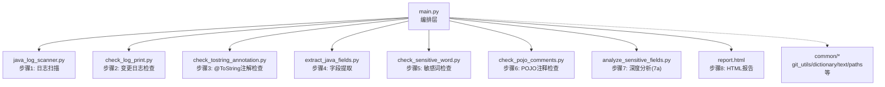
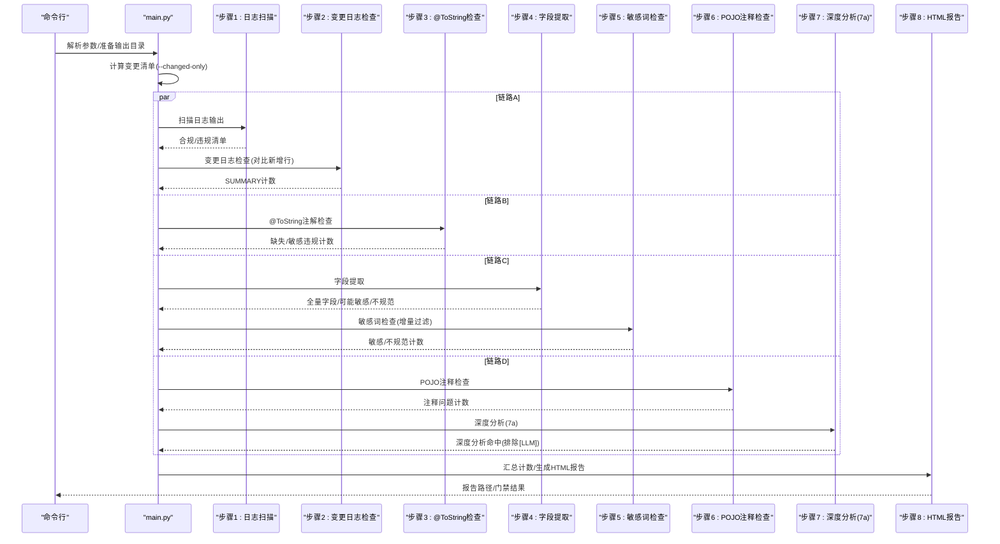
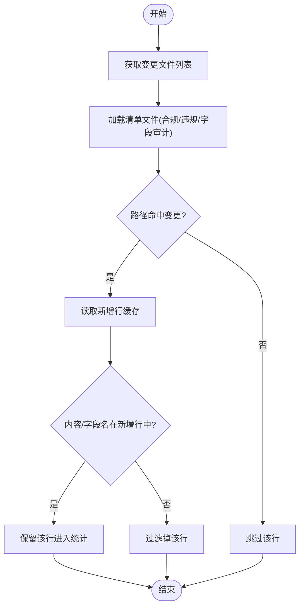
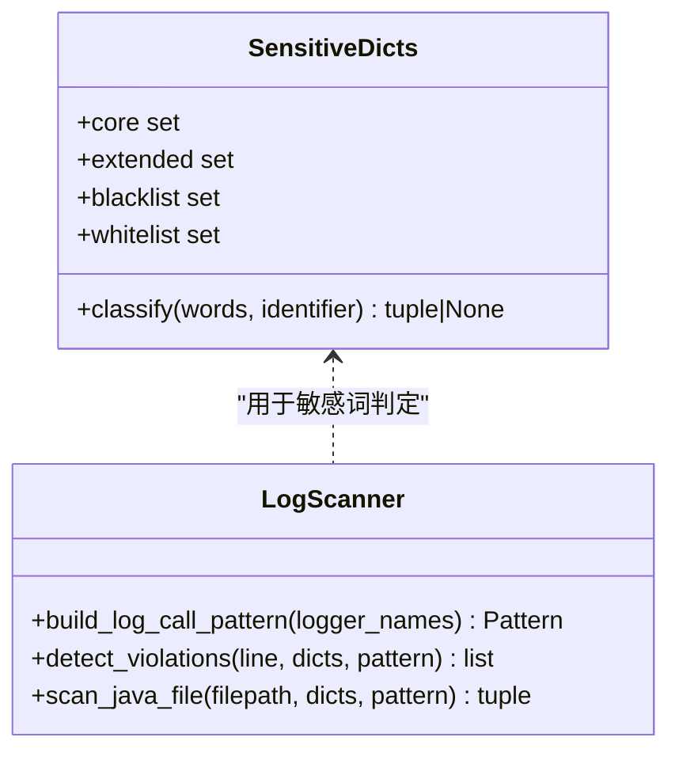
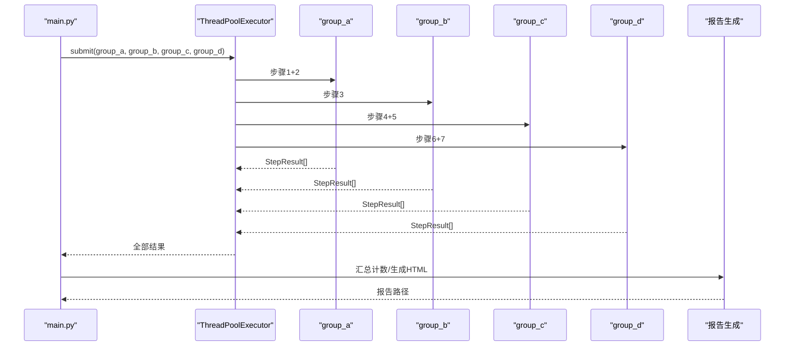
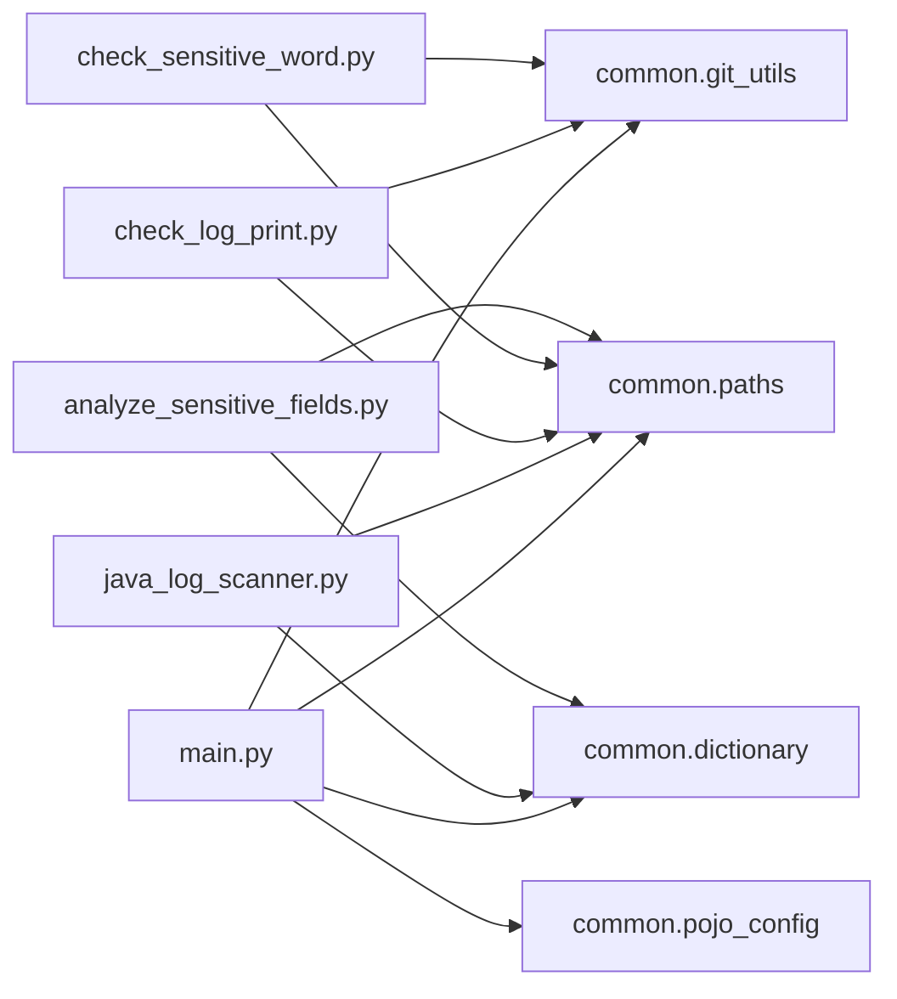

# 变更日志检查

<cite>
**本文引用的文件**
- [README.md](file://sensitive-log-review/README.md)
- [SKILL.md](file://sensitive-log-review/SKILL.md)
- [main.py](file://sensitive-log-review/scripts/main.py)
- [java_log_scanner.py](file://sensitive-log-review/scripts/java_log_scanner.py)
- [check_log_print.py](file://sensitive-log-review/scripts/check_log_print.py)
- [check_sensitive_word.py](file://sensitive-log-review/scripts/check_sensitive_word.py)
- [analyze_sensitive_fields.py](file://sensitive-log-review/scripts/analyze_sensitive_fields.py)
- [git_utils.py](file://sensitive-log-review/scripts/common/git_utils.py)
- [dictionary.py](file://sensitive-log-review/scripts/common/dictionary.py)
- [log-scanner.json](file://sensitive-log-review/scripts/rules/log-scanner.json)
</cite>

## 目录
1. [简介](#简介)
2. [项目结构](#项目结构)
3. [核心组件](#核心组件)
4. [架构总览](#架构总览)
5. [详细组件分析](#详细组件分析)
6. [依赖关系分析](#依赖关系分析)
7. [性能与可扩展性](#性能与可扩展性)
8. [故障排查指南](#故障排查指南)
9. [结论](#结论)
10. [附录：配置与CI/CD集成](#附录配置与cicd集成)

## 简介
本文档围绕“变更日志检查”这一目标，系统化说明基于 Git 差异分析的敏感日志输出识别方法、增量扫描机制、变更范围控制、与主流程的并行集成、结果聚合与报告生成，以及配置选项、CI/CD 集成示例与最佳实践。该能力以 Java 代码为对象，结合分层词典与结构化规则，对变更中的日志输出进行合规性审查，并输出可审计的 HTML 报告与门禁判定。

## 项目结构
敏感信息日志审查工具位于 sensitive-log-review 模块，采用“编排层 + 多步骤脚本 + 公共库”的分层组织方式：
- 编排层：main.py 负责参数解析、环境诊断、并行链路调度、结果汇总与报告生成
- 检查脚本：分别实现日志扫描、变更日志检查、字段提取、敏感词检查、POJO 注释检查、深度敏感性分析等步骤
- 公共库：common 提供 git 调用封装、词典加载、路径与文本处理、失败记录、Java 词法分析等
- 规则与词典：rules 与 dictionary 提供检测规则与分层词典

图表来源
- [main.py:187-297](file://sensitive-log-review/scripts/main.py#L187-L297)
- [java_log_scanner.py:359-417](file://sensitive-log-review/scripts/java_log_scanner.py#L359-L417)
- [check_log_print.py:139-227](file://sensitive-log-review/scripts/check_log_print.py#L139-L227)
- [check_sensitive_word.py:156-243](file://sensitive-log-review/scripts/check_sensitive_word.py#L156-L243)
- [analyze_sensitive_fields.py:127-170](file://sensitive-log-review/scripts/analyze_sensitive_fields.py#L127-L170)

章节来源
- [README.md:1-125](file://sensitive-log-review/README.md#L1-L125)
- [SKILL.md:70-157](file://sensitive-log-review/SKILL.md#L70-L157)

## 核心组件
- 变更清单准备：通过 git diff 获取相对目标分支的变更 Java 文件清单，并筛选出 POJO 文件清单，供后续步骤增量扫描使用
- 日志扫描器：识别日志调用、JSON 序列化输出、System.out/printStackTrace（可选），并结合分层词典判定违规标签
- 变更日志检查：将日志扫描产物与当前分支新增行进行匹配，仅保留真正新增的违规内容，区分高置信与低置信提示
- 敏感词检查：对字段级审计产物执行同样的增量过滤，输出敏感与不规范字段结果
- 深度分析（7a）：基于结构化规则（源自 JR/T 0171-2020）对 POJO 字段进行敏感级别判定
- 报告与门禁：汇总各步骤计数，生成 HTML 报告，依据 --fail-on 策略决定是否触发门禁

章节来源
- [main.py:300-322](file://sensitive-log-review/scripts/main.py#L300-L322)
- [java_log_scanner.py:148-213](file://sensitive-log-review/scripts/java_log_scanner.py#L148-L213)
- [check_log_print.py:58-93](file://sensitive-log-review/scripts/check_log_print.py#L58-L93)
- [check_sensitive_word.py:58-90](file://sensitive-log-review/scripts/check_sensitive_word.py#L58-L90)
- [analyze_sensitive_fields.py:44-93](file://sensitive-log-review/scripts/analyze_sensitive_fields.py#L44-L93)

## 架构总览
编排层将八个步骤组织为四条并行链路，最大化利用并发提升效率；最终统一生成报告与门禁判定。

图表来源
- [main.py:276-297](file://sensitive-log-review/scripts/main.py#L276-L297)
- [main.py:353-505](file://sensitive-log-review/scripts/main.py#L353-L505)

章节来源
- [README.md:30-53](file://sensitive-log-review/README.md#L30-L53)
- [SKILL.md:70-157](file://sensitive-log-review/SKILL.md#L70-L157)

## 详细组件分析

### Git 差异分析与新增行识别
- 变更文件清单：通过 git diff --name-only 获取变更 Java 文件列表，并进行路径规范化
- 新增行缓存：AddedLinesCache 按文件缓存 git diff 新增行，避免重复 fork 进程，支持多线程共享
- 增量过滤：在 check_log_print 与 check_sensitive_word 中，将清单行内容与新增行进行匹配，确保仅对真正新增的内容进行判定

图表来源
- [git_utils.py:57-109](file://sensitive-log-review/scripts/common/git_utils.py#L57-L109)
- [check_log_print.py:58-93](file://sensitive-log-review/scripts/check_log_print.py#L58-L93)
- [check_sensitive_word.py:58-90](file://sensitive-log-review/scripts/check_sensitive_word.py#L58-L90)

章节来源
- [git_utils.py:57-109](file://sensitive-log-review/scripts/common/git_utils.py#L57-L109)
- [check_log_print.py:139-227](file://sensitive-log-review/scripts/check_log_print.py#L139-L227)
- [check_sensitive_word.py:156-243](file://sensitive-log-review/scripts/check_sensitive_word.py#L156-L243)

### 敏感日志输出识别与基线对比逻辑
- 日志调用识别：根据配置的 logger_names 构建正则，匹配 log/logger/LOG/LOGGER 等变量的 info/debug/warn/error/fatal 调用
- JSON 序列化检测：识别 fastjson、org.json、Gson、Jackson、Hutool 等常见序列化模式，标记 JSON_LOG
- 可选检测：System.out/err 与 printStackTrace 可通过配置开关启用，默认关闭以减少噪音
- 分层词典判定：白名单豁免 > 黑名单必拦 > core 高置信 > extended 低置信；输出标签如 SENSITIVE:word / LOW:word
- 基线对比：通过 AddedLinesCache 仅比对新增行，避免历史代码干扰；check_log_print 将违规分为常规违规与低置信提示，默认不触发门禁

图表来源
- [dictionary.py:80-132](file://sensitive-log-review/scripts/common/dictionary.py#L80-L132)
- [java_log_scanner.py:70-103](file://sensitive-log-review/scripts/java_log_scanner.py#L70-L103)
- [java_log_scanner.py:148-213](file://sensitive-log-review/scripts/java_log_scanner.py#L148-L213)

章节来源
- [java_log_scanner.py:148-213](file://sensitive-log-review/scripts/java_log_scanner.py#L148-L213)
- [dictionary.py:80-132](file://sensitive-log-review/scripts/common/dictionary.py#L80-L132)
- [log-scanner.json:1-7](file://sensitive-log-review/scripts/rules/log-scanner.json#L1-L7)

### 变更范围控制：全量扫描与仅变更文件扫描
- 仅变更文件（默认）：通过 prepare_changed_manifests 计算变更 Java 与 POJO 清单，后续步骤传入 --files 限制扫描范围，速度快
- 全量扫描：--full-scan 覆盖 --changed-only，对所有 Java 文件执行扫描，适合首次部署或回归验证
- 变更清单持久化：changed-java.files 与 changed-pojo.files 作为中间产物，便于调试与复用

章节来源
- [main.py:300-322](file://sensitive-log-review/scripts/main.py#L300-L322)
- [java_log_scanner.py:318-378](file://sensitive-log-review/scripts/java_log_scanner.py#L318-L378)

### 与主流程的集成：并行执行、结果聚合与报告生成
- 并行链路：四组任务 group_a/group_b/group_c/group_d 通过 ThreadPoolExecutor(max_workers=4) 并行执行
- 结果聚合：各步骤返回 StepResult，包含名称、是否成功、错误信息与 SUMMARY 计数；main 汇总 counts 并判断门禁
- 报告生成：读取各产物文件，渲染 HTML，长列表折叠展示，底部标注产物目录；失败文件单独区块展示

图表来源
- [main.py:276-297](file://sensitive-log-review/scripts/main.py#L276-L297)
- [main.py:777-785](file://sensitive-log-review/scripts/main.py#L777-L785)
- [main.py:353-505](file://sensitive-log-review/scripts/main.py#L353-L505)

章节来源
- [main.py:276-297](file://sensitive-log-review/scripts/main.py#L276-L297)
- [main.py:777-785](file://sensitive-log-review/scripts/main.py#L777-L785)
- [main.py:353-505](file://sensitive-log-review/scripts/main.py#L353-L505)

### 深度敏感性分析（7a 规则初筛）
- 输入：pojo-changed.list（变更 POJO 文件清单）
- 过程：使用 java_lexer 提取字段，对照 rules/sensitive-field-rules.json 的结构化规则（类别、级别、正则模式、原因）进行匹配
- 输出：analyze-sensitize.result，格式为 file_path#field_name: reason (line line_no)
- 注意：7b 语义复核由 AI 执行体完成，结果以 [LLM] 前缀追加到同一文件，不计入门禁统计

章节来源
- [analyze_sensitive_fields.py:44-93](file://sensitive-log-review/scripts/analyze_sensitive_fields.py#L44-L93)
- [analyze_sensitive_fields.py:127-170](file://sensitive-log-review/scripts/analyze_sensitive_fields.py#L127-L170)
- [SKILL.md:120-152](file://sensitive-log-review/SKILL.md#L120-L152)

## 依赖关系分析
- main.py 依赖 common.paths、common.git_utils、common.dictionary、common.pojo_config 等公共模块
- 各检查脚本通过 common.git_utils 统一执行 git 命令，并通过 common.failures 记录失败文件
- 词典加载通过 common.dictionary 提供线程安全与 mtime 失效缓存，避免重复 IO
- 规则文件与词典文件位于 scripts/rules 与 scripts/dictionary，供各脚本共享

图表来源
- [main.py:41-70](file://sensitive-log-review/scripts/main.py#L41-L70)
- [java_log_scanner.py:34-38](file://sensitive-log-review/scripts/java_log_scanner.py#L34-L38)
- [check_log_print.py:31-35](file://sensitive-log-review/scripts/check_log_print.py#L31-L35)
- [check_sensitive_word.py:29-40](file://sensitive-log-review/scripts/check_sensitive_word.py#L29-L40)
- [analyze_sensitive_fields.py:29-39](file://sensitive-log-review/scripts/analyze_sensitive_fields.py#L29-L39)

章节来源
- [main.py:41-70](file://sensitive-log-review/scripts/main.py#L41-L70)
- [git_utils.py:1-124](file://sensitive-log-review/scripts/common/git_utils.py#L1-L124)
- [dictionary.py:1-143](file://sensitive-log-review/scripts/common/dictionary.py#L1-L143)

## 性能与可扩展性
- 并发优化：四链路并行执行，减少端到端耗时；AddedLinesCache 缓存新增行，降低 git 进程 fork 次数
- 词典缓存：基于文件 mtime 的模块级缓存，避免重复读取大词典（如 en_US-large.txt）
- 增量扫描：默认仅扫描变更文件，显著降低扫描规模；全量扫描适用于回归场景
- 可扩展点：
  - 日志变量名与检测开关可在 rules/log-scanner.json 中调整
  - 敏感词分层词典可按需维护，遵循版本头规范
  - 结构化规则可在 rules/sensitive-field-rules.json 中扩展类别与模式

章节来源
- [main.py:777-785](file://sensitive-log-review/scripts/main.py#L777-L785)
- [git_utils.py:85-109](file://sensitive-log-review/scripts/common/git_utils.py#L85-L109)
- [dictionary.py:31-77](file://sensitive-log-review/scripts/common/dictionary.py#L31-L77)
- [java_log_scanner.py:318-378](file://sensitive-log-review/scripts/java_log_scanner.py#L318-L378)

## 故障排查指南
- 非 git 仓库：resolve_repo 校验失败，输出结构化错误 E001，退出码 2
- 分支名非法：validate_ref 拒绝以 - 开头或包含 .. 的引用，输出 E003，退出码 2
- 规则文件损坏：JSON 解析失败输出 E004，指出行列位置，退出码 2
- jar 校验失败：checkstyle jar SHA256 与基线不一致输出 E007，退出码 2
- 失败文件统计：failed-files.list 记录读取/解析失败的文件与原因，默认不计入门禁；--strict-mode 开启时以退出码 2 结束
- 中文乱码：Windows 下设置 PYTHONIOENCODING=utf-8，避免控制台输出异常

章节来源
- [git_utils.py:112-124](file://sensitive-log-review/scripts/common/git_utils.py#L112-L124)
- [main.py:582-702](file://sensitive-log-review/scripts/main.py#L582-L702)
- [analyze_sensitive_fields.py:44-67](file://sensitive-log-review/scripts/analyze_sensitive_fields.py#L44-L67)
- [README.md:361-483](file://sensitive-log-review/README.md#L361-L483)

## 结论
本方案通过 Git 差异分析、分层词典与结构化规则，实现了针对 Java 项目的敏感日志输出变更检查。其核心优势在于：
- 增量扫描与新增行匹配，精准定位变更影响
- 并行链路编排，提升执行效率
- 分层词典与结构化规则，兼顾准确性与可维护性
- 完善的报告与门禁机制，便于 CI/CD 集成与合规审计

## 附录：配置与CI/CD集成

### 配置选项说明
- 日志扫描配置（rules/log-scanner.json）：
  - logger_names：识别的日志变量名列表
  - detect_system_out：是否检测 System.out/err
  - detect_print_stack_trace：是否检测 printStackTrace
- 词典维护（scripts/dictionary）：
  - 四层优先级：whitelist > blacklist > core > extended
  - 版本头规范：每个词典文件头部 # version: YYYY-MM-DD.N，修改时递增
- 结构化规则（rules/sensitive-field-rules.json）：
  - category/level/patterns/reason 定义敏感数据分类与匹配规则
- 主流程参数（main.py）：
  - --branch/-b：目标分支（默认 master）
  - --root/-r：项目根目录（必须为 git 仓库）
  - --output-dir/-o：输出目录（最高优先级）
  - --run-id：并行隔离子目录名（CI 场景）
  - --fail-on：门禁计数项（默认 violation,sensitive；空串关闭门禁）
  - --changed-only/--full-scan：仅变更文件/全量扫描
  - --strict-mode：严格模式（存在失败文件即退出码 2）
  - --doctor：环境诊断模式（只检查不执行）
  - -v/--verbose：详细输出

章节来源
- [log-scanner.json:1-7](file://sensitive-log-review/scripts/rules/log-scanner.json#L1-L7)
- [README.md:238-358](file://sensitive-log-review/README.md#L238-L358)
- [SKILL.md:31-68](file://sensitive-log-review/SKILL.md#L31-L68)

### CI/CD 集成示例
- Jenkins Declarative Pipeline：
  - 设置环境变量 PYTHONIOENCODING=utf-8
  - 执行 main.py，指定 -r . -b origin/master -o ./review-output --run-id "${BUILD_TAG}" --fail-on violation,sensitive
  - 归档 review-output/** 产物
- GitHub Actions：
  - 使用 actions/checkout@v4 并设置 fetch-depth: 0
  - 使用 actions/setup-python@v5 与 actions/setup-java@v4
  - 执行 main.py，指定 -r . -b origin/${{ github.base_ref || 'master' }} -o ./review-output --run-id "${{ github.run_id }}"
  - 使用 actions/upload-artifact@v4 上传报告

章节来源
- [README.md:175-234](file://sensitive-log-review/README.md#L175-L234)

### 最佳实践指导
- 始终显式传入 -r .，避免从其他目录调用导致扫错位置
- CI 中使用 --run-id 隔离并行运行产物，避免覆盖
- 默认仅变更文件扫描，必要时使用 --full-scan 进行回归
- 词典维护遵循版本头规范，避免漂移
- 误报处理：加入 whitelist；漏报处理：追加 core/blacklist/extended 或扩展结构化规则
- 严格模式下启用 --strict-mode，确保失败文件不影响门禁

章节来源
- [README.md:127-166](file://sensitive-log-review/README.md#L127-L166)
- [README.md:397-417](file://sensitive-log-review/README.md#L397-L417)
- [README.md:418-483](file://sensitive-log-review/README.md#L418-L483)