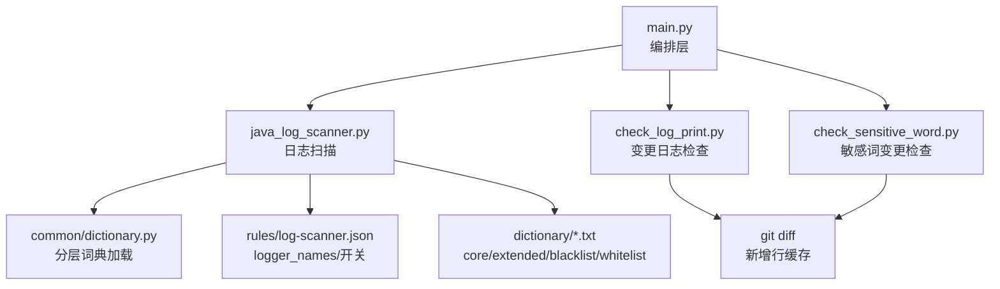
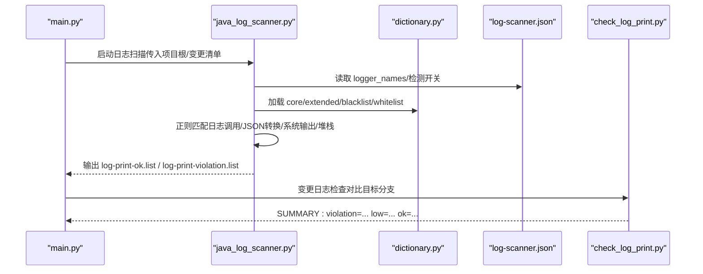
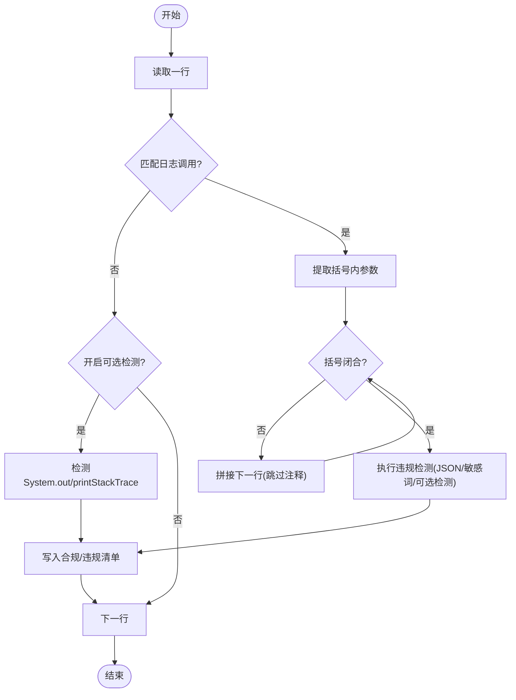
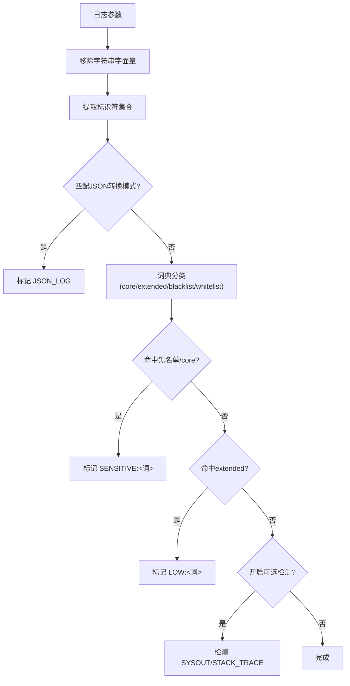
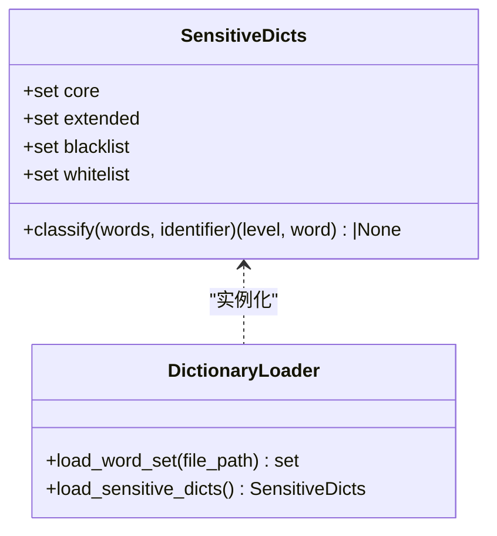
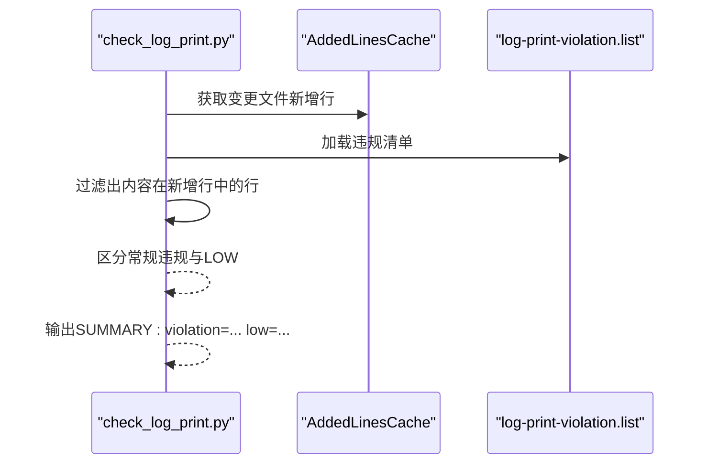
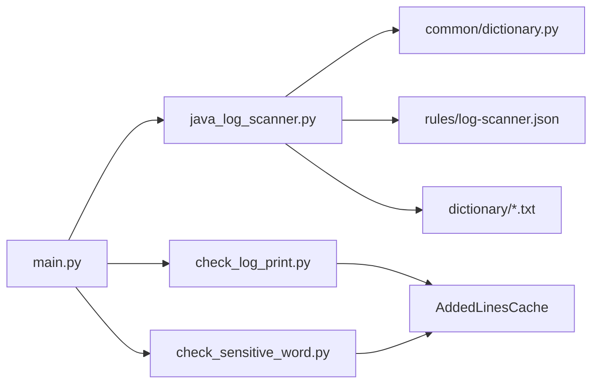

# 日志扫描检查

<cite>
**本文引用的文件**
- [README.md](file://sensitive-log-review/README.md)
- [SKILL.md](file://sensitive-log-review/SKILL.md)
- [main.py](file://sensitive-log-review/scripts/main.py)
- [java_log_scanner.py](file://sensitive-log-review/scripts/java_log_scanner.py)
- [check_log_print.py](file://sensitive-log-review/scripts/check_log_print.py)
- [check_sensitive_word.py](file://sensitive-log-review/scripts/check_sensitive_word.py)
- [dictionary.py](file://sensitive-log-review/scripts/common/dictionary.py)
- [log-scanner.json](file://sensitive-log-review/scripts/rules/log-scanner.json)
- [sensitive-core.txt](file://sensitive-log-review/scripts/dictionary/sensitive-core.txt)
- [sensitive-extended.txt](file://sensitive-log-review/scripts/dictionary/sensitive-extended.txt)
- [sensitive-words.blacklist](file://sensitive-log-review/scripts/dictionary/sensitive-words.blacklist)
- [sensitive-words.whitelist](file://sensitive-log-review/scripts/dictionary/sensitive-words.whitelist)
</cite>

## 目录
1. [简介](#简介)
2. [项目结构](#项目结构)
3. [核心组件](#核心组件)
4. [架构总览](#架构总览)
5. [详细组件分析](#详细组件分析)
6. [依赖关系分析](#依赖关系分析)
7. [性能考量](#性能考量)
8. [故障排查指南](#故障排查指南)
9. [结论](#结论)
10. [附录：配置与示例](#附录配置与示例)

## 简介
本仓库提供面向 Java 项目的“敏感信息日志审查”能力，围绕“敏感数据不落日志”的目标，从多个维度对代码进行静态扫描与规则判定，最终输出 HTML 报告并支持 CI 门禁。本文聚焦“日志扫描检查”维度，深入解释正则匹配机制、JSON 转换检测、敏感词分层词典匹配、上下文分析算法、日志调用识别逻辑（含 logger 变量名配置、多行日志处理、括号闭合检测），以及违规类型 JSON_LOG、SENSITIVE、LOW、SYSOUT、STACK_TRACE 的工作原理与触发条件；同时说明敏感词词典加载机制（core、extended、blacklist、whitelist 四层优先级）和配置选项（logger_names、可选检测项开关、性能优化建议），并提供实际场景的修复指引。

## 项目结构
与日志扫描直接相关的脚本与配置集中在 sensitive-log-review 模块中：
- 编排入口：scripts/main.py（四链路并行编排步骤1~8）
- 日志扫描器：scripts/java_log_scanner.py（正则匹配、词典判定、输出清单）
- 变更比对：scripts/check_log_print.py（基于 git diff 过滤变更命中）
- 敏感词变更比对：scripts/check_sensitive_word.py（字段级变更命中）
- 公共词典：scripts/common/dictionary.py（分层词典加载与 classify）
- 规则配置：scripts/rules/log-scanner.json（logger_names、可选检测开关）
- 词典文件：scripts/dictionary/*（core/extended/blacklist/whitelist）

图表来源
- [main.py:187-269](file://sensitive-log-review/scripts/main.py#L187-L269)
- [java_log_scanner.py:148-213](file://sensitive-log-review/scripts/java_log_scanner.py#L148-L213)
- [dictionary.py:80-132](file://sensitive-log-review/scripts/common/dictionary.py#L80-L132)
- [log-scanner.json:1-7](file://sensitive-log-review/scripts/rules/log-scanner.json#L1-L7)

章节来源
- [README.md:20-53](file://sensitive-log-review/README.md#L20-L53)
- [SKILL.md:70-157](file://sensitive-log-review/SKILL.md#L70-L157)

## 核心组件
- 日志扫描器（java_log_scanner.py）：负责识别日志调用、提取参数、执行正则匹配与词典判定，输出合规/违规清单。
- 变更日志检查（check_log_print.py）：将扫描产物与当前分支新增行做交集过滤，区分常规违规与低置信提示（LOW）。
- 敏感词变更检查（check_sensitive_word.py）：对字段级审计结果做变更过滤，拆分高/低置信敏感与非规范命名。
- 分层词典（dictionary.py）：按优先级 whitelist > blacklist > core > extended 判定敏感级别，并支持整名豁免/必拦。
- 规则配置（log-scanner.json）：定义 logger_names、是否检测 System.out/printStackTrace。

章节来源
- [java_log_scanner.py:1-22](file://sensitive-log-review/scripts/java_log_scanner.py#L1-L22)
- [check_log_print.py:1-22](file://sensitive-log-review/scripts/check_log_print.py#L1-L22)
- [check_sensitive_word.py:1-20](file://sensitive-log-review/scripts/check_sensitive_word.py#L1-L20)
- [dictionary.py:1-12](file://sensitive-log-review/scripts/common/dictionary.py#L1-L12)
- [log-scanner.json:1-7](file://sensitive-log-review/scripts/rules/log-scanner.json#L1-L7)

## 架构总览
日志扫描检查在编排层被组织为“步骤1：扫描日志输出 → 步骤2：变更日志检查”，并与其它链路并行执行。步骤1使用正则与词典完成逐行检测，步骤2结合 git diff 仅保留新增行中的命中，从而降低噪音并提高准确性。

图表来源
- [main.py:187-207](file://sensitive-log-review/scripts/main.py#L187-L207)
- [java_log_scanner.py:70-102](file://sensitive-log-review/scripts/java_log_scanner.py#L70-L102)
- [dictionary.py:125-132](file://sensitive-log-review/scripts/common/dictionary.py#L125-L132)
- [check_log_print.py:139-227](file://sensitive-log-review/scripts/check_log_print.py#L139-L227)

## 详细组件分析

### 日志调用识别逻辑
- logger 变量名配置：通过 rules/log-scanner.json 的 logger_names 指定哪些变量名视为日志对象（如 log/logger/LOG/LOGGER 等），构建日志调用匹配的正则表达式，并对同一配置进行 lru_cache 编译缓存，避免重复开销。
- 多行日志处理：当检测到日志调用但括号未闭合时，会拼接后续行直到括号完全闭合，再统一进行违规检测，确保跨行日志不被误判。
- 括号闭合检测：实现一个状态机，跳过字符串字面量与转义字符，统计括号深度，判断是否完全闭合。

图表来源
- [java_log_scanner.py:90-102](file://sensitive-log-review/scripts/java_log_scanner.py#L90-L102)
- [java_log_scanner.py:105-145](file://sensitive-log-review/scripts/java_log_scanner.py#L105-L145)
- [java_log_scanner.py:216-298](file://sensitive-log-review/scripts/java_log_scanner.py#L216-L298)

章节来源
- [log-scanner.json:1-7](file://sensitive-log-review/scripts/rules/log-scanner.json#L1-L7)
- [java_log_scanner.py:70-102](file://sensitive-log-review/scripts/java_log_scanner.py#L70-L102)
- [java_log_scanner.py:105-145](file://sensitive-log-review/scripts/java_log_scanner.py#L105-L145)
- [java_log_scanner.py:216-298](file://sensitive-log-review/scripts/java_log_scanner.py#L216-L298)

### 正则表达式匹配机制
- JSON 转换模式检测：预编译的正则匹配常见对象转 JSON 的方法调用（如 fastjson、org.json、Gson、Jackson、Hutool、XmlUtils 等），一旦在日志参数中出现即标记 JSON_LOG。
- 标识符提取：从日志参数中提取变量/方法调用标识符，排除字符串字面量，避免常量文本干扰。
- 可选检测项：若开启 detect_system_out/detect_print_stack_trace，则在非日志调用行也检测 System.out/err 与 printStackTrace。

图表来源
- [java_log_scanner.py:44-65](file://sensitive-log-review/scripts/java_log_scanner.py#L44-L65)
- [java_log_scanner.py:148-213](file://sensitive-log-review/scripts/java_log_scanner.py#L148-L213)

章节来源
- [java_log_scanner.py:44-65](file://sensitive-log-review/scripts/java_log_scanner.py#L44-L65)
- [java_log_scanner.py:148-213](file://sensitive-log-review/scripts/java_log_scanner.py#L148-L213)

### 敏感词分层词典匹配与上下文分析
- 四层优先级：whitelist（整名豁免）> blacklist（整名或拆分词命中，最高严重级）> core（高置信，命中即违规）> extended（低置信，仅标记 LOW）。
- 上下文分析：先从日志参数中提取标识符，拆分单词后与词典匹配；同时对行级（去除字符串常量）进行多词短语匹配（如“bank account”），补充单词匹配的盲区。
- 词典加载：使用线程安全缓存，基于文件路径与 mtime 失效策略，避免重复解析大词典（如 en_US-large.txt）。

图表来源
- [dictionary.py:80-132](file://sensitive-log-review/scripts/common/dictionary.py#L80-L132)
- [dictionary.py:52-77](file://sensitive-log-review/scripts/common/dictionary.py#L52-L77)

章节来源
- [dictionary.py:80-132](file://sensitive-log-review/scripts/common/dictionary.py#L80-L132)
- [dictionary.py:52-77](file://sensitive-log-review/scripts/common/dictionary.py#L52-L77)

### 违规检测类型与触发条件
- JSON_LOG：日志参数中包含对象转 JSON 的常见方法调用（fastjson/org.json/Gson/Jackson/Hutool/XmlUtils 等）。
- SENSITIVE：日志参数中的标识符经词典判定命中黑名单或 core 层（高置信），或行级多词短语命中 core。
- LOW：日志参数中的标识符命中 extended 层（低置信），默认不触发门禁，可显式加入 fail-on。
- SYSOUT：开启 detect_system_out 时，检测到 System.out/err 打印。
- STACK_TRACE：开启 detect_print_stack_trace 时，检测到 printStackTrace 调用。

章节来源
- [java_log_scanner.py:148-213](file://sensitive-log-review/scripts/java_log_scanner.py#L148-L213)
- [log-scanner.json:1-7](file://sensitive-log-review/scripts/rules/log-scanner.json#L1-L7)

### 变更比对与门禁判定
- check_log_print.py：将步骤1的清单与当前分支新增行做交集过滤，仅保留内容出现在新增行中的记录；tags 全部为 LOW:* 的低置信提示默认不触发门禁，可通过 --fail-on-low 打开。
- check_sensitive_word.py：对字段级审计结果做变更过滤，拆分高/低置信敏感与非规范命名，输出 sensitive.results/unqualified.results。

图表来源
- [check_log_print.py:74-93](file://sensitive-log-review/scripts/check_log_print.py#L74-L93)
- [check_log_print.py:139-227](file://sensitive-log-review/scripts/check_log_print.py#L139-L227)

章节来源
- [check_log_print.py:74-93](file://sensitive-log-review/scripts/check_log_print.py#L74-L93)
- [check_log_print.py:139-227](file://sensitive-log-review/scripts/check_log_print.py#L139-L227)

## 依赖关系分析
- 主流程依赖：main.py 调用 java_log_scanner.py、check_log_print.py、check_sensitive_word.py，并通过 common/dictionary.py 加载词典。
- 规则与词典：log-scanner.json 控制日志变量名与可选检测开关；dictionary/* 提供分层敏感词。
- Git 集成：check_log_print.py 与 check_sensitive_word.py 使用 AddedLinesCache 缓存 git diff 新增行，减少进程调用开销。

图表来源
- [main.py:187-269](file://sensitive-log-review/scripts/main.py#L187-L269)
- [java_log_scanner.py:34-38](file://sensitive-log-review/scripts/java_log_scanner.py#L34-L38)
- [check_log_print.py:24-35](file://sensitive-log-review/scripts/check_log_print.py#L24-L35)
- [check_sensitive_word.py:24-40](file://sensitive-log-review/scripts/check_sensitive_word.py#L24-L40)

章节来源
- [main.py:187-269](file://sensitive-log-review/scripts/main.py#L187-L269)
- [java_log_scanner.py:34-38](file://sensitive-log-review/scripts/java_log_scanner.py#L34-L38)
- [check_log_print.py:24-35](file://sensitive-log-review/scripts/check_log_print.py#L24-L35)
- [check_sensitive_word.py:24-40](file://sensitive-log-review/scripts/check_sensitive_word.py#L24-L40)

## 性能考量
- 正则编译缓存：日志调用匹配的正则按 logger_names 元组进行 lru_cache，避免重复编译。
- 词典文件缓存：基于文件路径与 mtime 的模块级缓存，大词典（如 en_US-large.txt）只解析一次，修改后自动失效。
- 多行日志拼接：仅在需要时拼接后续行，减少不必要的字符串操作。
- 变更比对缓存：AddedLinesCache 缓存每文件新增行，减少 git diff 进程调用次数。
- 可选检测开关：detect_system_out/detect_print_stack_trace 默认关闭，避免全量扫描带来的噪音与性能损耗。

章节来源
- [java_log_scanner.py:90-102](file://sensitive-log-review/scripts/java_log_scanner.py#L90-L102)
- [dictionary.py:52-77](file://sensitive-log-review/scripts/common/dictionary.py#L52-L77)
- [check_log_print.py:74-93](file://sensitive-log-review/scripts/check_log_print.py#L74-L93)
- [check_sensitive_word.py:71-90](file://sensitive-log-review/scripts/check_sensitive_word.py#L71-L90)

## 故障排查指南
- 中文乱码：设置 PYTHONIOENCODING=utf-8（Windows 下尤为重要）。
- 不是 git 仓库：确保 -r 指向包含 .git 的仓库目录。
- 找不到 java 命令：步骤6（POJO 注释检查）依赖 Java Runtime；安装并确保 PATH 可用。
- 无变更结果：确认目标分支引用完整（CI 中 fetch-depth: 0），或使用 --full-scan。
- run-id 非法：仅允许字母数字/._-，且不以符号开头，最长 64 字符。
- jar SHA256 校验失败：检查 checkstyle jar 完整性或同步更新基线。
- failedFiles 警告：查看 failed-files.list 定位失败原因；严格模式下存在失败文件以退出码 2 结束。

章节来源
- [README.md:361-483](file://sensitive-log-review/README.md#L361-L483)

## 结论
日志扫描检查通过“正则匹配 + 分层词典 + 上下文分析 + 变更比对”的组合，实现对日志输出的精细化管控。其设计兼顾准确性与性能：正则与词典缓存、多行日志智能拼接、可选检测开关、变更新增行过滤等手段有效降低误报与开销。配合灵活的配置与清晰的违规类型，可在银行金融等高合规要求场景中稳定运行，并无缝集成至 CI/CD 门禁。

## 附录：配置与示例

### 配置选项详解
- logger_names：自定义日志变量名列表（如 log/logger/LOG/LOGGER/LogHelper/LogUtil），用于构建日志调用匹配正则。
- detect_system_out：是否检测 System.out/err 输出（默认关闭，噪音大）。
- detect_print_stack_trace：是否检测 printStackTrace（默认关闭，噪音大）。
- 可选检测项开关：通过 rules/log-scanner.json 控制；开启后在非日志调用行也会检测 SYSOUT/STACK_TRACE。
- 性能优化建议：
  - 保持 logger_names 精确，避免过宽匹配导致误报。
  - 默认关闭可选检测项，按需开启。
  - 使用 --changed-only（默认）仅扫描变更文件；必要时使用 --full-scan。
  - 利用 AddedLinesCache 与词典缓存提升性能。

章节来源
- [log-scanner.json:1-7](file://sensitive-log-review/scripts/rules/log-scanner.json#L1-L7)
- [java_log_scanner.py:70-102](file://sensitive-log-review/scripts/java_log_scanner.py#L70-L102)
- [README.md:267-309](file://sensitive-log-review/README.md#L267-L309)

### 实际违规场景与修复方法（示例指引）
- JSON_LOG：日志中将对象转为 JSON 后打印。修复：脱敏后再序列化，或直接输出关键字段。
- SENSITIVE：日志参数中的标识符命中黑名单或 core 层。修复：替换为脱敏值或移除敏感字段。
- LOW：日志参数中的标识符命中 extended 层。修复：评估是否为业务必需，必要时调整词典或脱敏。
- SYSOUT：使用 System.out/err 打印。修复：改用日志框架并配置脱敏。
- STACK_TRACE：调用 printStackTrace。修复：使用日志框架记录异常，避免堆栈泄露。

章节来源
- [java_log_scanner.py:148-213](file://sensitive-log-review/scripts/java_log_scanner.py#L148-L213)
- [README.md:418-425](file://sensitive-log-review/README.md#L418-L425)