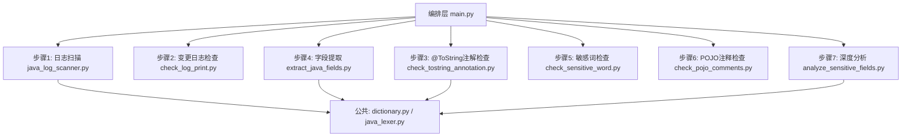
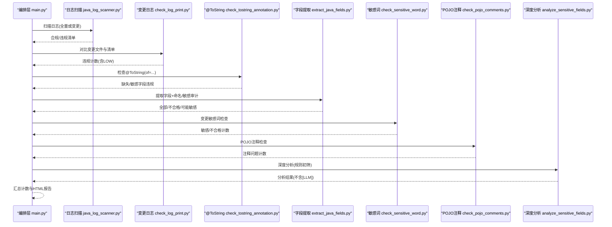
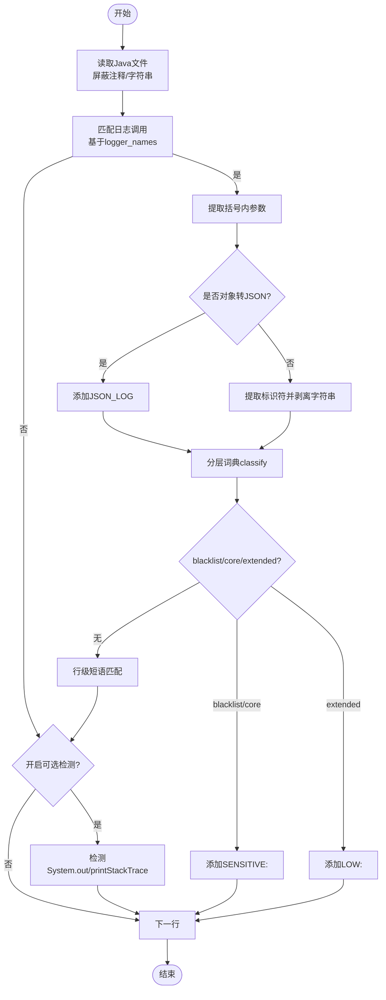
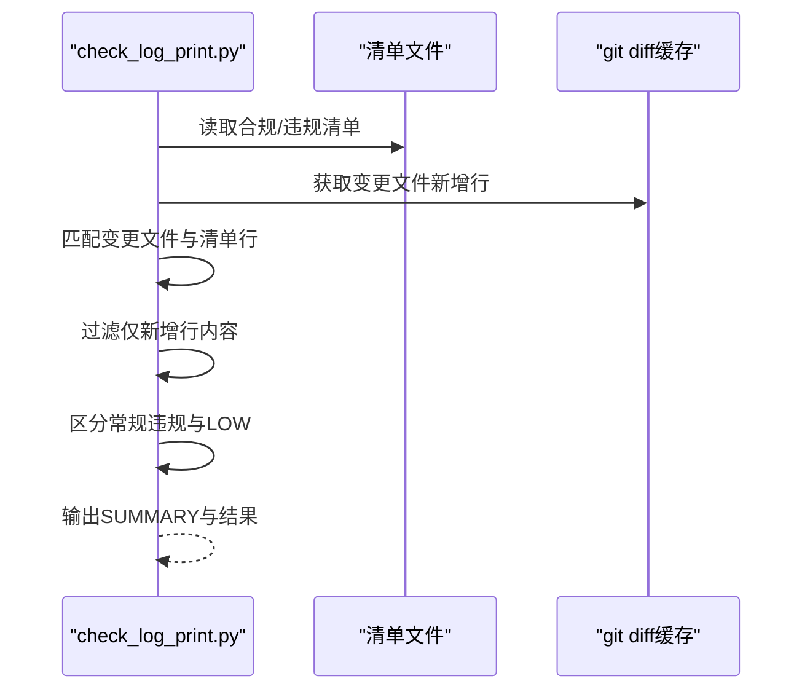
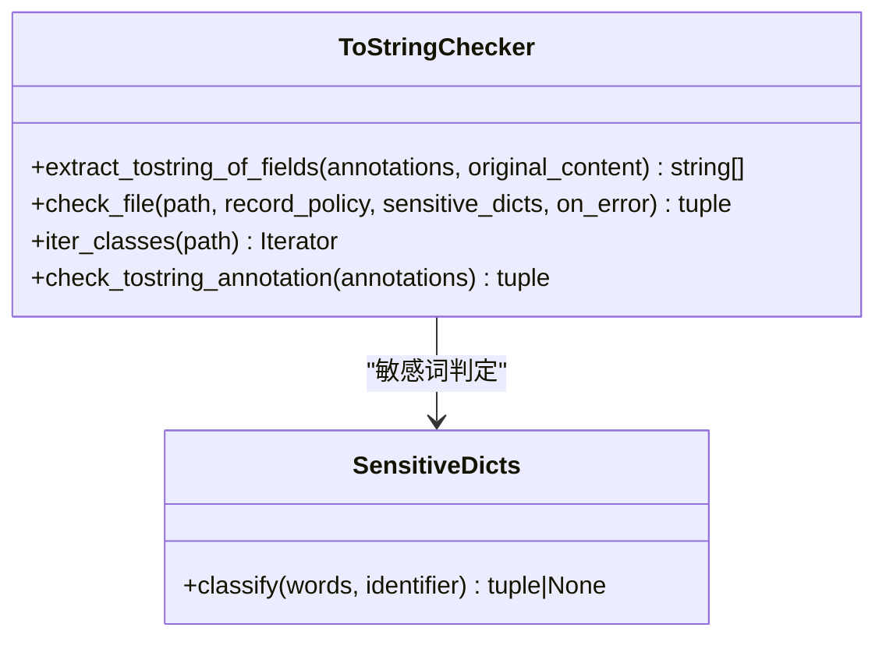
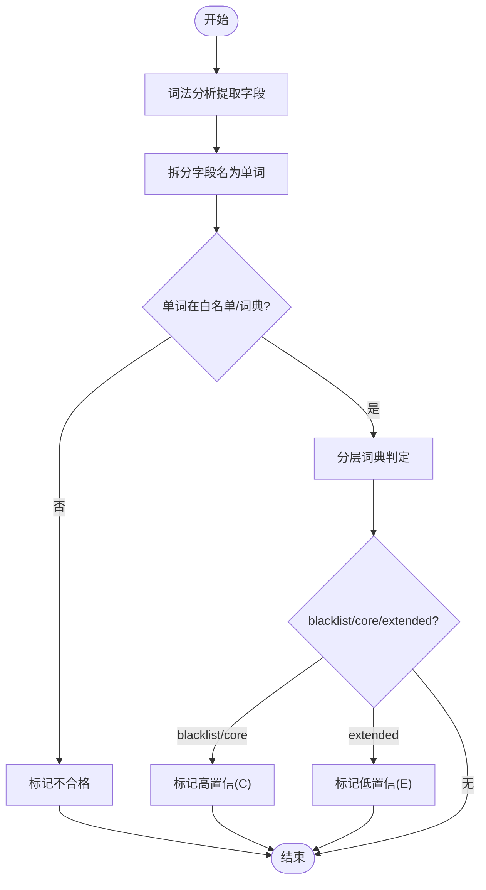
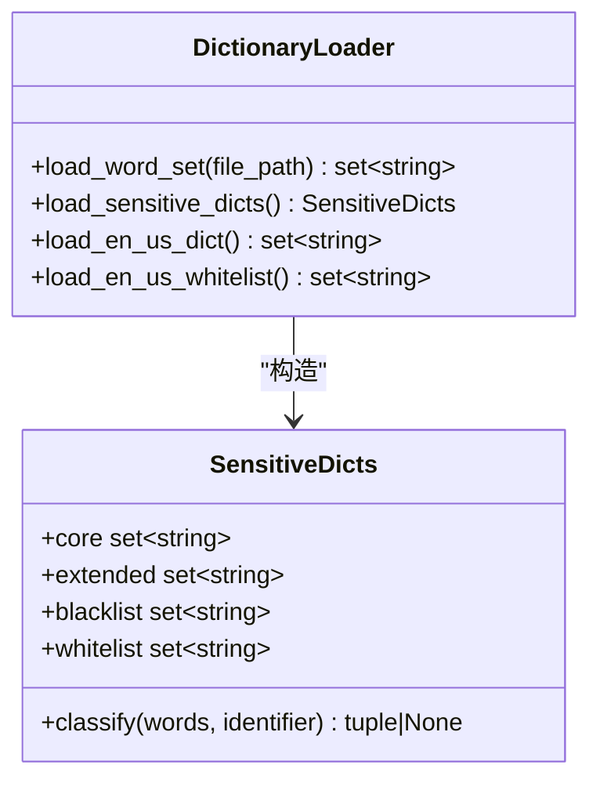
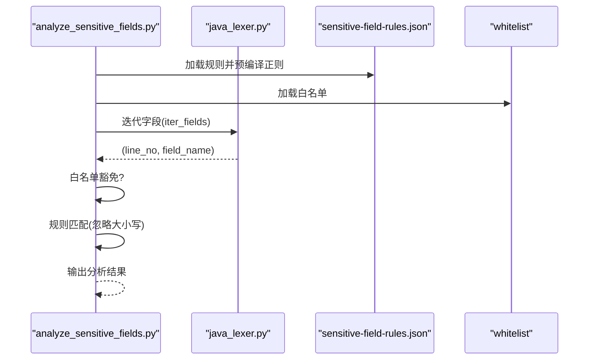
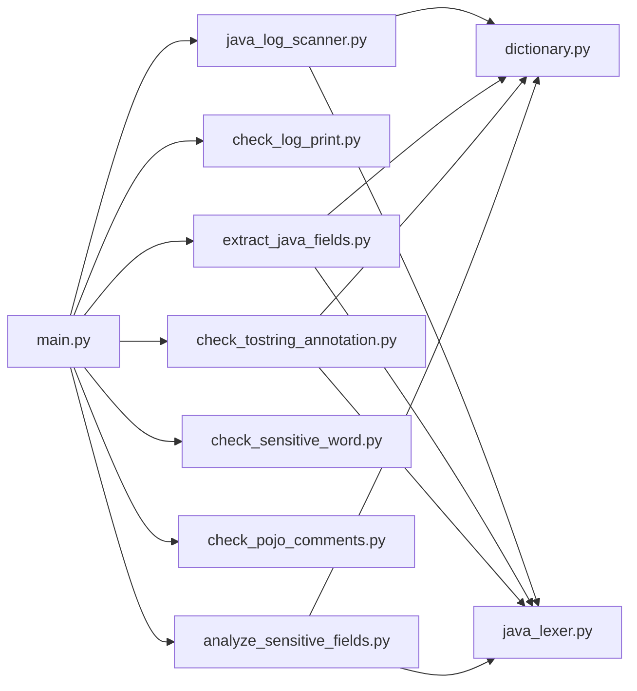

# 检查维度详解

<cite>
**本文引用的文件**
- [README.md](file://sensitive-log-review/README.md)
- [SKILL.md](file://sensitive-log-review/SKILL.md)
- [main.py](file://sensitive-log-review/scripts/main.py)
- [java_log_scanner.py](file://sensitive-log-review/scripts/java_log_scanner.py)
- [check_log_print.py](file://sensitive-log-review/scripts/check_log_print.py)
- [check_tostring_annotation.py](file://sensitive-log-review/scripts/check_tostring_annotation.py)
- [extract_java_fields.py](file://sensitive-log-review/scripts/extract_java_fields.py)
- [check_sensitive_word.py](file://sensitive-log-review/scripts/check_sensitive_word.py)
- [analyze_sensitive_fields.py](file://sensitive-log-review/scripts/analyze_sensitive_fields.py)
- [dictionary.py](file://sensitive-log-review/scripts/common/dictionary.py)
- [java_lexer.py](file://sensitive-log-review/scripts/common/java_lexer.py)
- [log-scanner.json](file://sensitive-log-review/scripts/rules/log-scanner.json)
- [sensitive-field-rules.json](file://sensitive-log-review/scripts/rules/sensitive-field-rules.json)
- [pojo.config](file://sensitive-log-review/scripts/rules/pojo.config)
</cite>

## 目录
1. [简介](#简介)
2. [项目结构](#项目结构)
3. [核心组件](#核心组件)
4. [架构总览](#架构总览)
5. [详细组件分析](#详细组件分析)
6. [依赖关系分析](#依赖关系分析)
7. [性能考量](#性能考量)
8. [故障排查指南](#故障排查指南)
9. [结论](#结论)
10. [附录](#附录)

## 简介
本文件围绕敏感信息审查工具的四大检查维度，系统化说明其工作原理与实现细节：日志扫描检查、变更日志检查、@ToString注解检查、字段提取审计，以及敏感词检查系统与POJO注释检查、深度敏感性分析。文档同时给出配置选项与自定义规则扩展方法，帮助使用者在合规与可维护性之间取得平衡。

## 项目结构
该工具以“编排层 + 多步骤脚本 + 公共模块 + 规则/词典”的方式组织：
- 编排层：统一入口 main.py，负责并行调度四条链路并汇总报告
- 检查脚本：分别实现日志扫描、变更比对、注解检查、字段提取、敏感词检查、POJO注释检查、深度分析
- 公共模块：字典加载、Java词法解析、路径/失败记录等通用能力
- 规则与词典：日志扫描配置、敏感字段规则、POJO识别配置、分层词典

图表来源
- [main.py:187-269](file://sensitive-log-review/scripts/main.py#L187-L269)
- [java_log_scanner.py:148-298](file://sensitive-log-review/scripts/java_log_scanner.py#L148-L298)
- [check_log_print.py:58-93](file://sensitive-log-review/scripts/check_log_print.py#L58-L93)
- [check_tostring_annotation.py:43-139](file://sensitive-log-review/scripts/check_tostring_annotation.py#L43-L139)
- [extract_java_fields.py:52-81](file://sensitive-log-review/scripts/extract_java_fields.py#L52-L81)
- [check_sensitive_word.py:58-90](file://sensitive-log-review/scripts/check_sensitive_word.py#L58-L90)
- [analyze_sensitive_fields.py:44-93](file://sensitive-log-review/scripts/analyze_sensitive_fields.py#L44-L93)

章节来源
- [README.md:20-53](file://sensitive-log-review/README.md#L20-L53)
- [SKILL.md:70-157](file://sensitive-log-review/SKILL.md#L70-L157)

## 核心组件
- 日志扫描器：基于正则匹配日志调用、对象转JSON输出、敏感词命中（分层词典），支持可选检测 System.out/printStackTrace
- 变更日志检查：将清单行与 git diff 新增行交叉过滤，区分常规违规与低置信提示
- @ToString注解检查：解析类声明与前置注解，校验是否显式控制 toString 输出字段，并对注解中字段进行敏感词检测
- 字段提取审计：使用轻量级 Java 词法分析器提取字段，结合英文词典与技术缩写白名单做命名规范检查，并结合分层词典判定可能敏感字段
- 敏感词检查系统：四层优先级（白名单 > 黑名单 > 高置信 > 低置信），支持整名与拆分词匹配，提供误报豁免与低置信提示
- POJO注释检查：通过 Checkstyle 对变更 POJO 字段的文档注释完整性进行检查
- 深度敏感性分析：基于结构化规则（JR/T 0171-2020）进行字段名模式匹配；后续由 AI 执行体进行语义复核（不计入门禁）

章节来源
- [java_log_scanner.py:148-213](file://sensitive-log-review/scripts/java_log_scanner.py#L148-L213)
- [check_log_print.py:58-93](file://sensitive-log-review/scripts/check_log_print.py#L58-L93)
- [check_tostring_annotation.py:43-139](file://sensitive-log-review/scripts/check_tostring_annotation.py#L43-L139)
- [extract_java_fields.py:52-81](file://sensitive-log-review/scripts/extract_java_fields.py#L52-L81)
- [check_sensitive_word.py:58-90](file://sensitive-log-review/scripts/check_sensitive_word.py#L58-L90)
- [analyze_sensitive_fields.py:44-93](file://sensitive-log-review/scripts/analyze_sensitive_fields.py#L44-L93)
- [dictionary.py:80-132](file://sensitive-log-review/scripts/common/dictionary.py#L80-L132)
- [java_lexer.py:180-289](file://sensitive-log-review/scripts/common/java_lexer.py#L180-L289)

## 架构总览
编排层将八个步骤组织为四条并行链路，最终汇合生成 HTML 报告与门禁判定：
- 链路A：步骤1 扫描日志输出 → 步骤2 变更文件日志检查
- 链路B：步骤3 @ToString 注解检查
- 链路C：步骤4 提取Java字段 → 步骤5 敏感词变更检查
- 链路D：步骤6 POJO注释检查 → 步骤7 深度敏感性分析

图表来源
- [main.py:187-269](file://sensitive-log-review/scripts/main.py#L187-L269)
- [java_log_scanner.py:359-417](file://sensitive-log-review/scripts/java_log_scanner.py#L359-L417)
- [check_log_print.py:139-227](file://sensitive-log-review/scripts/check_log_print.py#L139-L227)
- [check_tostring_annotation.py:180-251](file://sensitive-log-review/scripts/check_tostring_annotation.py#L180-L251)
- [extract_java_fields.py:149-201](file://sensitive-log-review/scripts/extract_java_fields.py#L149-L201)
- [check_sensitive_word.py:156-243](file://sensitive-log-review/scripts/check_sensitive_word.py#L156-L243)
- [analyze_sensitive_fields.py:127-170](file://sensitive-log-review/scripts/analyze_sensitive_fields.py#L127-L170)

## 详细组件分析

### 日志扫描检查（正则匹配、上下文分析与违规检测）
- 工作原理
  - 读取 Java 源文件，屏蔽注释与字符串字面量，避免误判
  - 构建日志调用正则（基于配置的 logger_names），定位日志方法调用
  - 若检测到对象转 JSON 的常见模式（如 toJson、writeValueAsString 等），标记 JSON_LOG
  - 从日志参数中提取标识符，剥离字符串常量后，按单词拆分并调用分层词典 classify，判定 core/blacklist/extended
  - 可选检测 System.out/printStackTrace
  - 多行日志拼接：当括号未闭合时继续拼接后续行，确保跨行日志完整检测
- 违规检测算法要点
  - 先尝试黑名单/高置信命中，再回退到低置信提示
  - 行级短语匹配：对包含空格的敏感短语在去除字符串常量后的行内查找
- 配置项
  - rules/log-scanner.json：logger_names、detect_system_out、detect_print_stack_trace
- 输出
  - log-print-ok.list：合规日志
  - log-print-violation.list：违规日志，带标签（JSON_LOG、SENSITIVE:*、LOW:*、SYSOUT、STACK_TRACE）

图表来源
- [java_log_scanner.py:148-213](file://sensitive-log-review/scripts/java_log_scanner.py#L148-L213)
- [java_log_scanner.py:216-298](file://sensitive-log-review/scripts/java_log_scanner.py#L216-L298)
- [log-scanner.json:1-7](file://sensitive-log-review/scripts/rules/log-scanner.json#L1-L7)

章节来源
- [java_log_scanner.py:148-213](file://sensitive-log-review/scripts/java_log_scanner.py#L148-L213)
- [java_log_scanner.py:216-298](file://sensitive-log-review/scripts/java_log_scanner.py#L216-L298)
- [log-scanner.json:1-7](file://sensitive-log-review/scripts/rules/log-scanner.json#L1-L7)

### 变更日志检查（识别新增敏感日志输出）
- 工作机制
  - 读取步骤1产出的合规/违规清单
  - 匹配当前分支与目标分支的变更文件集合
  - 仅保留内容出现在 git diff 新增行中的清单行（AddedLinesCache）
  - 区分常规违规与低置信（LOW）违规；默认 LOW 不触发门禁，可通过 --fail-on-low 打开
- 输出与统计
  - 控制台输出 SUMMARY: violation=<n> low=<n> ok=<n>
  - 仅当存在常规违规或开启低置信拦截时返回非零退出码

图表来源
- [check_log_print.py:58-93](file://sensitive-log-review/scripts/check_log_print.py#L58-L93)
- [check_log_print.py:139-227](file://sensitive-log-review/scripts/check_log_print.py#L139-L227)

章节来源
- [check_log_print.py:58-93](file://sensitive-log-review/scripts/check_log_print.py#L58-L93)
- [check_log_print.py:139-227](file://sensitive-log-review/scripts/check_log_print.py#L139-L227)

### @ToString注解检查（注解解析、字段白名单验证、敏感词检测）
- 工作原理
  - 使用 Java 词法分析器 iter_classes 提取类声明及其前置注解
  - 检查是否存在有效的 @ToString(of = {...})；若无则记录缺失
  - 若存在，解析 of 属性中的字段名列表（支持引号包裹或直接字段名）
  - 对每个字段进行敏感词检测（拆分单词 + 整名匹配），记录敏感字段违规
- 策略
  - interface/enum 一律跳过
  - record 默认跳过，可通过 --record-policy warn 降级为提示
- 输出
  - miss-tostring-annotation.list：缺失注解清单
  - tostring-sensitive-violations.list：@ToString(of=...) 中字段命中敏感词

图表来源
- [check_tostring_annotation.py:43-139](file://sensitive-log-review/scripts/check_tostring_annotation.py#L43-L139)
- [check_tostring_annotation.py:180-251](file://sensitive-log-review/scripts/check_tostring_annotation.py#L180-L251)
- [java_lexer.py:599-653](file://sensitive-log-review/scripts/common/java_lexer.py#L599-L653)
- [dictionary.py:80-132](file://sensitive-log-review/scripts/common/dictionary.py#L80-L132)

章节来源
- [check_tostring_annotation.py:43-139](file://sensitive-log-review/scripts/check_tostring_annotation.py#L43-L139)
- [check_tostring_annotation.py:180-251](file://sensitive-log-review/scripts/check_tostring_annotation.py#L180-L251)
- [java_lexer.py:599-653](file://sensitive-log-review/scripts/common/java_lexer.py#L599-L653)
- [dictionary.py:80-132](file://sensitive-log-review/scripts/common/dictionary.py#L80-L132)

### 字段提取审计（Java AST解析、字段类型推断、命名规范检查）
- 工作原理
  - 使用轻量级 Java 词法分析器 iter_fields 提取类体内字段（支持 record 组件、枚举常量、匿名类型）
  - 命名规范检查：将字段名拆分为单词，判断是否在英文词典或技术缩写白名单中
  - 敏感字段审计：调用分层词典 classify，标记高置信（C）或低置信（E）
- 输出
  - all-fields.list：全部字段
  - unqualified.fields：命名不规范字段
  - maybe-sensitive.fields：可能敏感字段（含等级与命中词）

图表来源
- [extract_java_fields.py:52-81](file://sensitive-log-review/scripts/extract_java_fields.py#L52-L81)
- [extract_java_fields.py:149-201](file://sensitive-log-review/scripts/extract_java_fields.py#L149-L201)
- [java_lexer.py:180-289](file://sensitive-log-review/scripts/common/java_lexer.py#L180-L289)
- [dictionary.py:80-132](file://sensitive-log-review/scripts/common/dictionary.py#L80-L132)

章节来源
- [extract_java_fields.py:52-81](file://sensitive-log-review/scripts/extract_java_fields.py#L52-L81)
- [extract_java_fields.py:149-201](file://sensitive-log-review/scripts/extract_java_fields.py#L149-L201)
- [java_lexer.py:180-289](file://sensitive-log-review/scripts/common/java_lexer.py#L180-L289)
- [dictionary.py:80-132](file://sensitive-log-review/scripts/common/dictionary.py#L80-L132)

### 敏感词检查系统（词典加载、模糊匹配、误报过滤）
- 词典加载
  - 分层词典：core（高置信）、extended（低置信）、blacklist（整名必拦）、whitelist（整名豁免）
  - 英文词典与技术缩写白名单用于命名规范检查
  - 文件级缓存与线程安全访问，支持热更新（mtime变化失效）
- 匹配策略
  - 整名优先：whitelist 豁免、blacklist 最高级别
  - 拆分词匹配：core 高置信、extended 低置信
  - 行级短语匹配：针对含空格的敏感短语在去除字符串常量后的行内查找
- 误报过滤
  - 白名单整名豁免
  - 低置信仅标记 [LOW]，默认不触发门禁
  - 失败文件记录与汇总，不影响门禁统计（可严格模式拦截）

图表来源
- [dictionary.py:31-77](file://sensitive-log-review/scripts/common/dictionary.py#L31-L77)
- [dictionary.py:80-132](file://sensitive-log-review/scripts/common/dictionary.py#L80-L132)
- [dictionary.py:125-142](file://sensitive-log-review/scripts/common/dictionary.py#L125-L142)

章节来源
- [dictionary.py:31-77](file://sensitive-log-review/scripts/common/dictionary.py#L31-L77)
- [dictionary.py:80-132](file://sensitive-log-review/scripts/common/dictionary.py#L80-L132)
- [dictionary.py:125-142](file://sensitive-log-review/scripts/common/dictionary.py#L125-L142)

### POJO注释检查与深度敏感性分析
- POJO注释检查
  - 通过 Checkstyle 对变更 POJO 字段的文档注释完整性进行检查
  - 输出 pojo-changed.list 与 pojo-miss-comments.txt
- 深度敏感性分析（7a 规则初筛）
  - 读取 pojo-changed.list 中的变更 POJO 文件
  - 复用词法分析器提取字段，对照 rules/sensitive-field-rules.json 的结构化规则（源自 JR/T 0171-2020）
  - 预编译正则，逐条规则匹配字段名（忽略大小写），首次命中即止
  - 输出 analyze-sensitize.result（不含 [LLM] 行）
- 7b 语义复核（AI 执行体）
  - 由 AI 在 Skill 编排层执行，读取字段注释与分类清单，补充拼音/无意义命名/语义缩写的盲区
  - 结果以 [LLM] 前缀追加到 analyze-sensitize.result，不计入门禁统计

图表来源
- [analyze_sensitive_fields.py:44-93](file://sensitive-log-review/scripts/analyze_sensitive_fields.py#L44-L93)
- [analyze_sensitive_fields.py:127-170](file://sensitive-log-review/scripts/analyze_sensitive_fields.py#L127-L170)
- [java_lexer.py:180-289](file://sensitive-log-review/scripts/common/java_lexer.py#L180-L289)
- [sensitive-field-rules.json:1-45](file://sensitive-log-review/scripts/rules/sensitive-field-rules.json#L1-L45)

章节来源
- [analyze_sensitive_fields.py:44-93](file://sensitive-log-review/scripts/analyze_sensitive_fields.py#L44-L93)
- [analyze_sensitive_fields.py:127-170](file://sensitive-log-review/scripts/analyze_sensitive_fields.py#L127-L170)
- [sensitive-field-rules.json:1-45](file://sensitive-log-review/scripts/rules/sensitive-field-rules.json#L1-L45)

## 依赖关系分析
- 编排层 main.py 依赖各检查脚本与公共模块
- 检查脚本依赖公共模块：dictionary.py（词典加载与判定）、java_lexer.py（字段/类声明提取）、paths/git_utils/failures/errors（路径、Git、失败记录、错误码）
- 规则与词典文件被多个脚本共享，保证一致性与可维护性

图表来源
- [main.py:187-269](file://sensitive-log-review/scripts/main.py#L187-L269)
- [java_log_scanner.py:359-417](file://sensitive-log-review/scripts/java_log_scanner.py#L359-L417)
- [check_log_print.py:139-227](file://sensitive-log-review/scripts/check_log_print.py#L139-L227)
- [check_tostring_annotation.py:180-251](file://sensitive-log-review/scripts/check_tostring_annotation.py#L180-L251)
- [extract_java_fields.py:149-201](file://sensitive-log-review/scripts/extract_java_fields.py#L149-L201)
- [check_sensitive_word.py:156-243](file://sensitive-log-review/scripts/check_sensitive_word.py#L156-L243)
- [analyze_sensitive_fields.py:127-170](file://sensitive-log-review/scripts/analyze_sensitive_fields.py#L127-L170)

章节来源
- [main.py:187-269](file://sensitive-log-review/scripts/main.py#L187-L269)
- [dictionary.py:80-132](file://sensitive-log-review/scripts/common/dictionary.py#L80-L132)
- [java_lexer.py:180-289](file://sensitive-log-review/scripts/common/java_lexer.py#L180-L289)

## 性能考量
- 并行执行：编排层使用 ThreadPoolExecutor(max_workers=4) 并行执行四条链路，提升整体吞吐
- 正则缓存：日志调用正则基于 lru_cache 缓存，避免重复编译
- 词典缓存：词表文件基于 mtime 缓存，修改后自动失效，减少重复 IO
- 增量扫描：默认 --changed-only 模式仅处理变更文件，显著降低扫描范围
- 失败文件记录：读取/解析失败文件单独记录，不影响主流程，支持严格模式拦截

章节来源
- [main.py:777-785](file://sensitive-log-review/scripts/main.py#L777-L785)
- [java_log_scanner.py:90-102](file://sensitive-log-review/scripts/java_log_scanner.py#L90-L102)
- [dictionary.py:31-77](file://sensitive-log-review/scripts/common/dictionary.py#L31-L77)
- [README.md:50-53](file://sensitive-log-review/README.md#L50-L53)

## 故障排查指南
- 环境诊断：使用 --doctor 逐项检查 Python/java/git/jar/规则/词典/输出目录，快速定位环境问题
- 失败文件：查看 failed-files.list 与 HTML 报告的“失败文件”区块，定位读取/解析失败原因
- 门禁失败：根据控制台 SUMMARY 与产物文件（如 log-print-violation.list、sensitive.results）定位具体违规
- 误报处理：将确认安全的字段加入敏感词白名单（整名豁免），递增版本头后重新运行
- 漏报处理：高置信词根追加至 sensitive-core.txt，泛用但需提示的词放入 sensitive-extended.txt，结构性规则调整 sensitive-field-rules.json

章节来源
- [README.md:361-483](file://sensitive-log-review/README.md#L361-L483)
- [SKILL.md:198-213](file://sensitive-log-review/SKILL.md#L198-L213)

## 结论
该工具通过四大检查维度与两层互补的深度分析，形成从静态规则到语义复核的完整闭环。借助分层词典、结构化规则与轻量级 Java 词法分析，既保证了 CI 门禁的可复现性与高性能，又为人工复核提供了丰富的上下文与提示。使用者可通过规则与词典的灵活配置，持续优化误报与漏报平衡。

## 附录
- 配置选项与扩展方法
  - 日志扫描配置：rules/log-scanner.json（logger_names、detect_system_out、detect_print_stack_trace）
  - 敏感字段规则：rules/sensitive-field-rules.json（类别、级别、patterns、reason）
  - POJO识别配置：rules/pojo.config（pojo-dir、pojo-file）
  - 词典维护：sensitive-core.txt、sensitive-extended.txt、sensitive-words.blacklist、sensitive-words.whitelist、en_US-large.txt、en_US.whitelist
  - 门禁项：--fail-on 自定义拦截类别（violation、sensitive、unqualified、tostring、analyze、miss_comments、low）
  - 扫描模式：--changed-only（默认）与 --full-scan
  - 严格模式：--strict-mode 存在失败文件时以退出码 2 结束
  - 并行隔离：--run-id 指定隔离子目录名

章节来源
- [README.md:238-338](file://sensitive-log-review/README.md#L238-L338)
- [SKILL.md:158-213](file://sensitive-log-review/SKILL.md#L158-L213)
- [log-scanner.json:1-7](file://sensitive-log-review/scripts/rules/log-scanner.json#L1-L7)
- [sensitive-field-rules.json:1-45](file://sensitive-log-review/scripts/rules/sensitive-field-rules.json#L1-L45)
- [pojo.config:1-25](file://sensitive-log-review/scripts/rules/pojo.config#L1-L25)