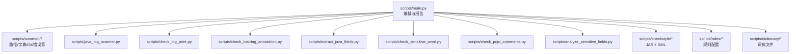
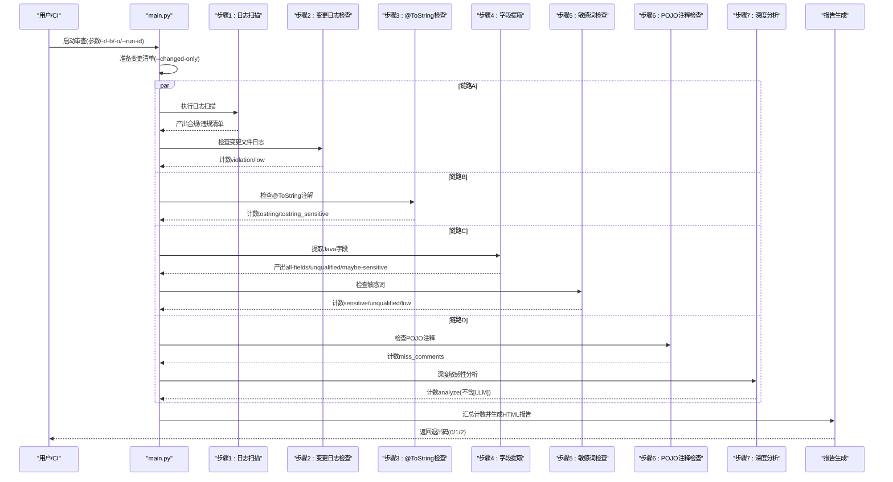
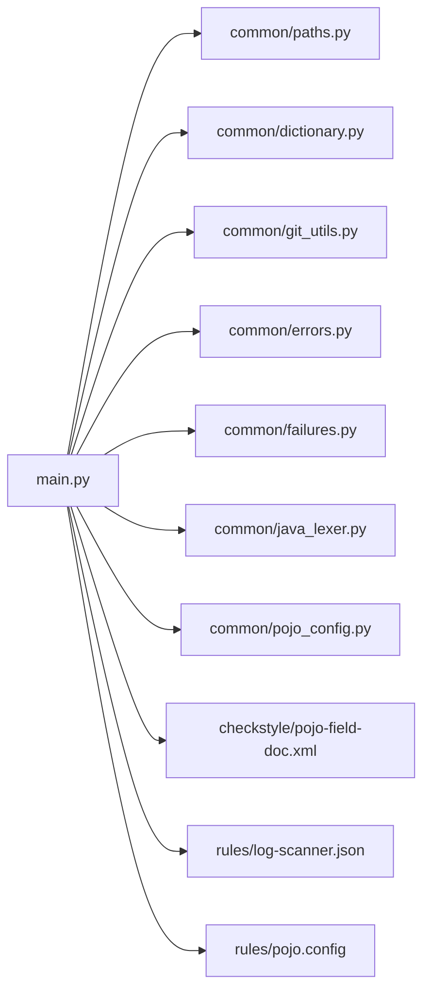

# 环境设置与部署

<cite>
**本文引用的文件**
- [README.md](file://sensitive-log-review/README.md)
- [SKILL.md](file://sensitive-log-review/SKILL.md)
- [main.py](file://sensitive-log-review/scripts/main.py)
- [paths.py](file://sensitive-log-review/scripts/common/paths.py)
- [pojo-field-doc.xml](file://sensitive-log-review/scripts/checkstyle/pojo-field-doc.xml)
- [checkstyle-13.7.0-all.jar.sha256](file://sensitive-log-review/scripts/checkstyle/checkstyle-13.7.0-all.jar.sha256)
- [log-scanner.json](file://sensitive-log-review/scripts/rules/log-scanner.json)
- [pojo.config](file://sensitive-log-review/scripts/rules/pojo.config)
- [install.sh](file://install.sh)
</cite>

## 目录
1. [简介](#简介)
2. [项目结构](#项目结构)
3. [核心组件](#核心组件)
4. [架构总览](#架构总览)
5. [详细组件分析](#详细组件分析)
6. [依赖关系分析](#依赖关系分析)
7. [性能考虑](#性能考虑)
8. [故障排除指南](#故障排除指南)
9. [结论](#结论)
10. [附录](#附录)

## 简介
本指南面向“敏感信息日志审查工具”的环境设置与部署，覆盖系统要求、依赖项安装、Checkstyle JAR 获取与校验、环境变量配置、Windows/Linux 特殊要求、容器化与编排、CI/CD 集成、性能调优与资源限制、生产监控与日志收集，以及常见问题排查。该工具基于 Python 脚本编排多个检查步骤，并调用 Checkstyle（Java）完成 POJO 字段注释检查，最终生成 HTML 报告与门禁判定结果。

## 项目结构
敏感信息审查工具位于 sensitive-log-review 目录下，核心入口为 scripts/main.py，负责并行编排各检查步骤；公共模块在 scripts/common；规则与词典在 scripts/rules 与 scripts/dictionary；Checkstyle 相关工件在 scripts/checkstyle。

图表来源
- [main.py:1-120](file://sensitive-log-review/scripts/main.py#L1-L120)
- [paths.py:1-69](file://sensitive-log-review/scripts/common/paths.py#L1-L69)

章节来源
- [README.md:87-111](file://sensitive-log-review/README.md#L87-L111)
- [SKILL.md:158-196](file://sensitive-log-review/SKILL.md#L158-L196)

## 核心组件
- 编排主程序：scripts/main.py，负责参数解析、变更清单准备、四链路并行执行、HTML 报告生成与门禁判定。
- 输出目录策略：scripts/common/paths.py，统一输出目录解析、产物文件名常量、run-id 隔离。
- 规则与词典：scripts/rules 与 scripts/dictionary，控制日志扫描器行为、POJO 识别、敏感词判定与命名规范。
- Checkstyle 集成：scripts/checkstyle/pojo-field-doc.xml 定义字段注释检查规则，配合 checkstyle-13.7.0-all.jar 运行。

章节来源
- [main.py:705-729](file://sensitive-log-review/scripts/main.py#L705-L729)
- [paths.py:20-69](file://sensitive-log-review/scripts/common/paths.py#L20-L69)
- [pojo-field-doc.xml:1-23](file://sensitive-log-review/scripts/checkstyle/pojo-field-doc.xml#L1-L23)
- [log-scanner.json:1-7](file://sensitive-log-review/scripts/rules/log-scanner.json#L1-L7)
- [pojo.config:1-25](file://sensitive-log-review/scripts/rules/pojo.config#L1-L25)

## 架构总览
工具以 main.py 为编排中心，将八个步骤组织为四条并行链路，最后汇总生成报告与门禁判定。关键流程如下：

图表来源
- [main.py:187-269](file://sensitive-log-review/scripts/main.py#L187-L269)
- [main.py:276-322](file://sensitive-log-review/scripts/main.py#L276-L322)
- [main.py:353-505](file://sensitive-log-review/scripts/main.py#L353-L505)

## 详细组件分析

### 环境与依赖安装
- Python 版本：3.10+（使用 X | None 类型标注语法）。
- Java Runtime：用于运行 Checkstyle 13.7.0（POJO 注释检查）。
- Git：2.0+（所有 git 调用经 git -C <repo> 贯通）。
- pytest：仅开发/单测需要，生产运行无第三方 Python 依赖。

章节来源
- [README.md:59-85](file://sensitive-log-review/README.md#L59-L85)
- [SKILL.md:158-166](file://sensitive-log-review/SKILL.md#L158-L166)

### Checkstyle JAR 获取、校验与部署
- JAR 位置：scripts/checkstyle/checkstyle-13.7.0-all.jar。
- 基线校验：scripts/checkstyle/checkstyle-13.7.0-all.jar.sha256 提供 SHA256 基线值。
- 部署建议：
  - 从可信源下载对应版本的 Checkstyle 全量包。
  - 将 JAR 与 .sha256 一同放入 scripts/checkstyle 目录。
  - 运行 --doctor 模式验证 JAR 存在性与 SHA256 一致性。
- 升级注意：若有意升级 Checkstyle 版本，需同步更新 .sha256 基线值并回归单测。

章节来源
- [README.md:448-458](file://sensitive-log-review/README.md#L448-L458)
- [checkstyle-13.7.0-all.jar.sha256:1-2](file://sensitive-log-review/scripts/checkstyle/checkstyle-13.7.0-all.jar.sha256#L1-L2)
- [main.py:612-633](file://sensitive-log-review/scripts/main.py#L612-L633)

### 环境变量与路径配置
- 输出目录优先级：
  1) CLI -o/--output-dir（最高优先级）
  2) 环境变量 SLR_OUTPUT_DIR
  3) 系统临时目录下的 sensitive-log-review 子目录（Windows：%LOCALAPPDATA%\Temp\sensitive-log-review；Linux/macOS：/tmp/sensitive-log-review）
- run-id 隔离：CI 并行场景通过 --run-id 追加隔离子目录，仅允许安全字符集且首字符必须字母数字。
- 编码设置：Windows 下建议设置 PYTHONIOENCODING=utf-8，避免控制台中文乱码。

章节来源
- [paths.py:20-63](file://sensitive-log-review/scripts/common/paths.py#L20-L63)
- [README.md:113-123](file://sensitive-log-review/README.md#L113-L123)
- [README.md:68-85](file://sensitive-log-review/README.md#L68-L85)

### Windows 与 Linux 平台特殊要求
- Windows：
  - 设置 PYTHONIOENCODING=utf-8。
  - 路径建议使用正斜杠或引号包裹含空格的路径。
- Linux/macOS：
  - 默认输出目录位于 /tmp/sensitive-log-review。
  - CI 中确保 PATH 包含 java 与 git。

章节来源
- [README.md:68-85](file://sensitive-log-review/README.md#L68-L85)
- [paths.py:6-8](file://sensitive-log-review/scripts/common/paths.py#L6-L8)

### Docker 容器化部署方案
- 基础镜像：选择包含 Python 3.10+、JRE 17（或更高）、Git 的镜像（如 eclipse-temurin:17-jre 或官方 python 镜像搭配 apt 安装 jre）。
- 工作目录：/app，复制 sensitive-log-review 目录到容器内。
- 环境变量：
  - PYTHONIOENCODING=utf-8
  - SLR_OUTPUT_DIR=/app/review-output（可选）
- 卷挂载：
  - 将宿主仓库目录挂载至容器内指定路径，并通过 -r 指向该路径。
  - 将 review-output 目录挂载到宿主机以便归档报告。
- 命令示例（概念性）：
  - docker run --rm -v /host/repo:/repo -e PYTHONIOENCODING=utf-8 -e SLR_OUTPUT_DIR=/app/review-output -w /app python:3.11-slim bash -c "python scripts/main.py -r /repo -b origin/master -o /app/review-output --run-id $BUILD_ID"

说明：以上为通用容器化思路，具体镜像与命令可按团队规范调整。

### Kubernetes 编排配置
- Deployment：
  - 使用包含 Python、JRE、Git 的镜像。
  - 设置环境变量 PYTHONIOENCODING、SLR_OUTPUT_DIR。
  - 挂载 PVC 或 HostPath 作为 /repo 与 /review-output。
- Job/CronJob：
  - 针对 PR/MR 触发 Job，执行审查命令并产出报告。
  - 通过 sidecar 或 initContainer 拉取代码与依赖。
- 资源限制：
  - requests/limits 设置 CPU 与内存上限，避免影响节点稳定性。
- 健康检查：
  - 可通过探针检查 /review-output 是否可写及 java/git 可用性。

说明：以下为概念性编排建议，实际 YAML 按集群策略定制。

### CI/CD 流水线集成
- Jenkins（Declarative Pipeline）：
  - 设置 PYTHONIOENCODING=utf-8。
  - 执行 main.py，传入 -r、-b、-o、--run-id、--fail-on。
  - 归档 review-output 产物。
- GitHub Actions：
  - 使用 actions/setup-python 与 actions/setup-java。
  - checkout 时 fetch-depth: 0 保证完整历史。
  - 设置 PYTHONIOENCODING=utf-8，执行审查并上传 artifact。

章节来源
- [README.md:177-234](file://sensitive-log-review/README.md#L177-L234)

### 性能调优参数与资源限制
- 扫描模式：
  - --changed-only（默认）：仅扫描变更 Java 文件，速度快。
  - --full-scan：全量扫描所有 Java 文件，速度较慢但覆盖全面。
- 并发与线程：
  - 编排层使用 ThreadPoolExecutor(max_workers=4) 组织四条并行链路，目标全流程 <60s。
- 严格模式：
  - --strict-mode：存在读取/解析失败文件（failedFiles > 0）时以退出码 2 结束，适合 CI 严格拦截。
- 资源限制建议：
  - 在容器/CI 中限制 CPU 与内存，避免大仓库全量扫描导致超时。
  - 合理设置 JVM 堆大小（如需在容器中运行额外 Java 任务）。

章节来源
- [main.py:4-22](file://sensitive-log-review/scripts/main.py#L4-L22)
- [main.py:719-728](file://sensitive-log-review/scripts/main.py#L719-L728)
- [README.md:30-53](file://sensitive-log-review/README.md#L30-L53)

### 生产环境的监控与日志收集
- 监控指标：
  - 退出码分布（0/1/2），门禁触发类别与数量。
  - failedFiles 数量与占比，严格模式下应趋近于 0。
  - 各步骤耗时与总耗时，定位慢步骤。
- 日志收集：
  - 捕获 main.py 的标准输出与标准错误，记录命令参数与环境变量（脱敏后）。
  - 归档 review-output 中的 HTML 报告与中间产物（.list/.results/.fields）。
- 告警策略：
  - 当退出码为 2 或 failedFiles 超过阈值时触发告警。
  - 门禁频繁触发时通知安全与研发负责人。

说明：本节为通用实践建议，可根据团队监控体系实现。

## 依赖关系分析
- 外部依赖：Python、Java Runtime、Git。
- 内部依赖：
  - main.py 依赖 common 模块（paths、dictionary、git_utils、errors、failures、java_lexer、pojo_config）。
  - 规则与词典驱动各检查脚本的行为。
  - Checkstyle 通过 java -jar 调用，XML 配置文件决定字段注释检查规则。

图表来源
- [main.py:41-75](file://sensitive-log-review/scripts/main.py#L41-L75)
- [paths.py:1-69](file://sensitive-log-review/scripts/common/paths.py#L1-L69)
- [pojo-field-doc.xml:1-23](file://sensitive-log-review/scripts/checkstyle/pojo-field-doc.xml#L1-L23)
- [log-scanner.json:1-7](file://sensitive-log-review/scripts/rules/log-scanner.json#L1-L7)
- [pojo.config:1-25](file://sensitive-log-review/scripts/rules/pojo.config#L1-L25)

章节来源
- [SKILL.md:167-196](file://sensitive-log-review/SKILL.md#L167-L196)

## 性能考虑
- 优先使用 --changed-only 减少扫描范围。
- 在 CI 中缓存 Python 与 Java 依赖，缩短构建时间。
- 对大型仓库启用 --full-scan 时需评估时间与资源消耗。
- 使用 --strict-mode 提升质量门槛，但需关注失败文件率。

## 故障排除指南
- 控制台中文乱码：设置 PYTHONIOENCODING=utf-8。
- 不是 git 仓库：显式传 -r 指向仓库根目录。
- 找不到 java 命令：安装 JRE/JDK 并确保 PATH 包含 java。
- 变更检查无结果：确认分支基准与完整历史（fetch-depth: 0），或使用 --full-scan。
- jar SHA256 校验失败：重新获取可信 JAR 或更新基线值。
- run-id 非法字符：仅允许安全字符集且首字符必须字母数字。
- failedFiles 警告：查看 failed-files.list 与 HTML 报告的失败文件区块，修复后重跑；必要时开启 --strict-mode。

章节来源
- [README.md:361-482](file://sensitive-log-review/README.md#L361-L482)

## 结论
本指南提供了敏感信息日志审查工具的完整环境设置与部署方案，涵盖依赖安装、Checkstyle JAR 校验、环境变量配置、跨平台注意事项、容器化与编排、CI/CD 集成、性能调优与生产监控。遵循本文档可快速搭建稳定可靠的审查流水线，保障代码中的敏感信息不泄露到日志。

## 附录

### 安装与部署脚本
- install.sh：用于将 skill 安装到指定项目的工具目录（如 .qoder/skills），支持交互式选择与批量安装。

章节来源
- [install.sh:1-288](file://install.sh#L1-L288)

### 快速参考命令
- 基本用法：python scripts/main.py -r . -b master -o ./review-output
- 环境诊断：python scripts/main.py --doctor -r .
- 关闭门禁：--fail-on ""

章节来源
- [README.md:485-496](file://sensitive-log-review/README.md#L485-L496)