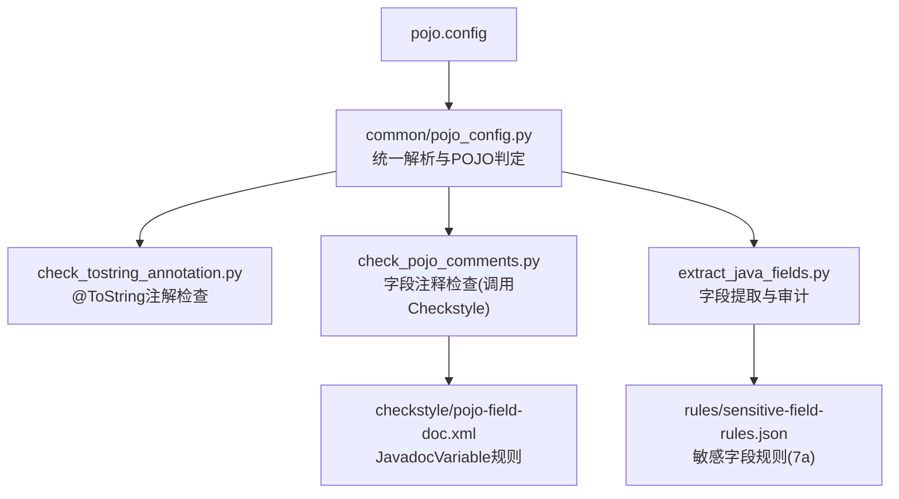
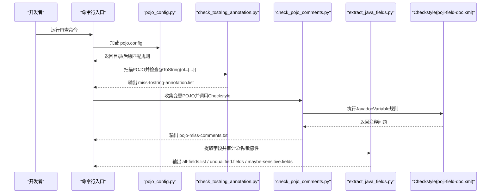
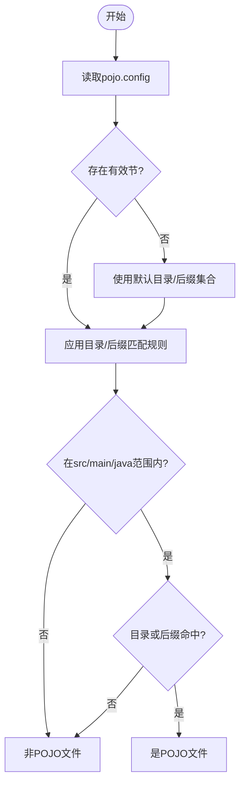
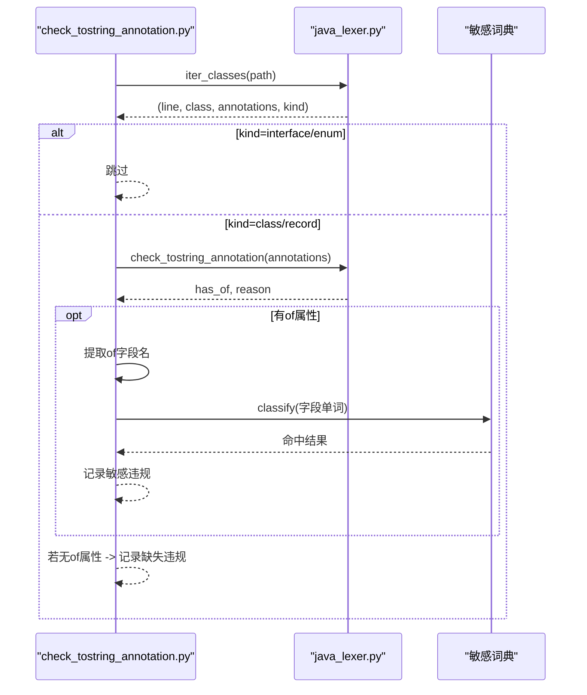
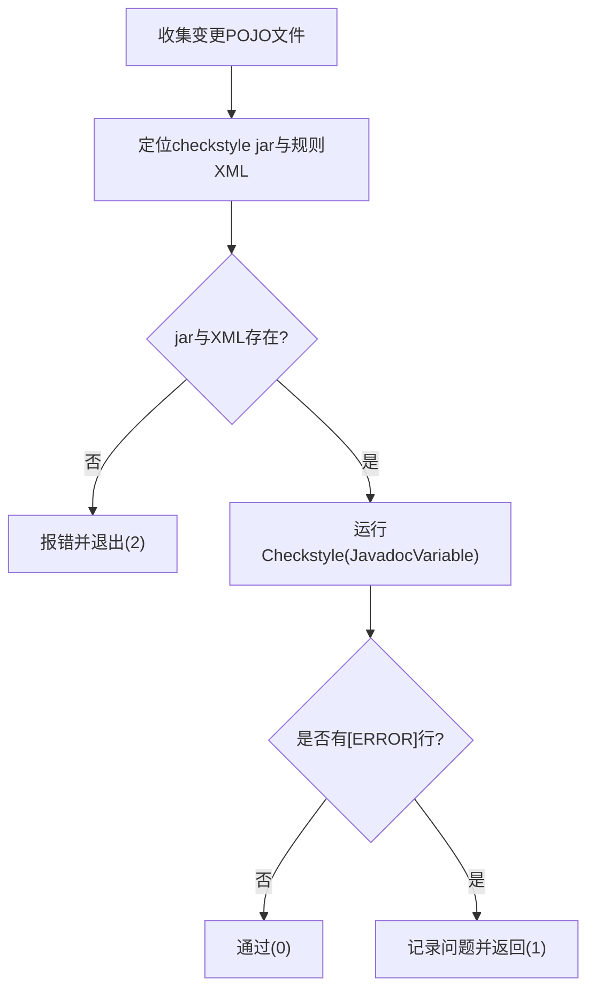
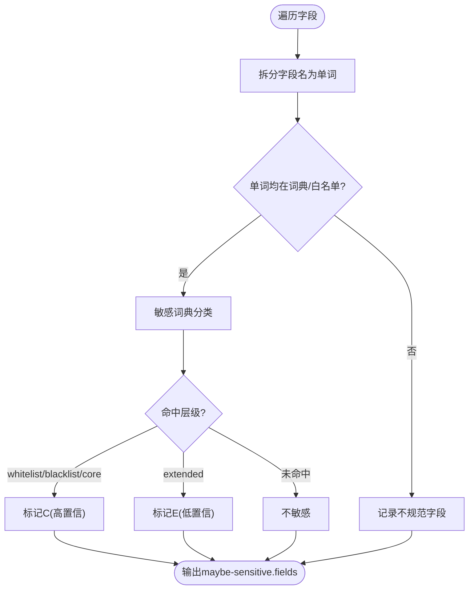
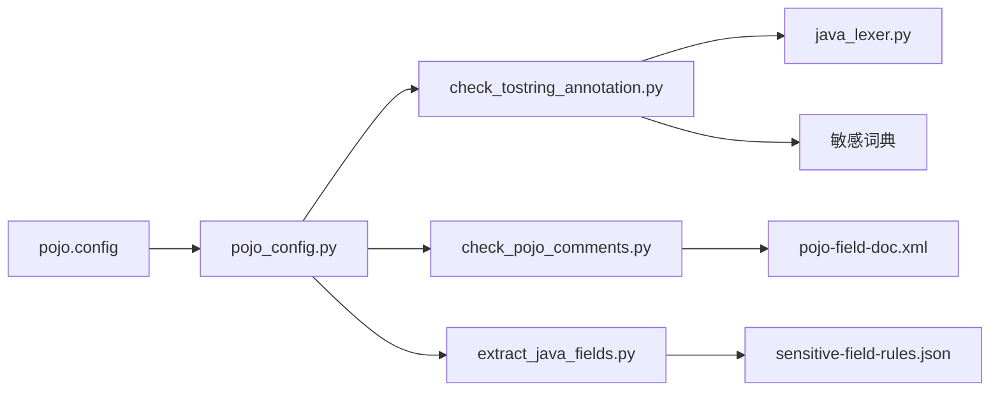

# POJO注释配置

<cite>
**本文引用的文件**
- [pojo.config](file://sensitive-log-review/scripts/rules/pojo.config)
- [pojo_config.py](file://sensitive-log-review/scripts/common/pojo_config.py)
- [check_tostring_annotation.py](file://sensitive-log-review/scripts/check_tostring_annotation.py)
- [java_lexer.py](file://sensitive-log-review/scripts/common/java_lexer.py)
- [check_pojo_comments.py](file://sensitive-log-review/scripts/check_pojo_comments.py)
- [pojo-field-doc.xml](file://sensitive-log-review/scripts/checkstyle/pojo-field-doc.xml)
- [extract_java_fields.py](file://sensitive-log-review/scripts/extract_java_fields.py)
- [sensitive-field-rules.json](file://sensitive-log-review/scripts/rules/sensitive-field-rules.json)
- [README.md](file://sensitive-log-review/README.md)
- [SKILL.md](file://sensitive-log-review/SKILL.md)
</cite>

## 目录
1. [简介](#简介)
2. [项目结构](#项目结构)
3. [核心组件](#核心组件)
4. [架构总览](#架构总览)
5. [详细组件分析](#详细组件分析)
6. [依赖关系分析](#依赖关系分析)
7. [性能与可扩展性](#性能与可扩展性)
8. [故障排查指南](#故障排查指南)
9. [结论](#结论)
10. [附录：配置示例与银行金融业模板](#附录配置示例与银行金融业模板)

## 简介
本文件面向“POJO注释配置”的完整说明，覆盖以下目标：
- pojo.config 文件格式与语法（类级别、字段级别的规则定义）
- @ToString 注解检查机制与 toString 生成规则、字段过滤策略
- POJO 数据模型验证规则（必填字段、数据类型约束、业务规则）
- 不同业务场景下的配置示例
- 银行金融业领域模型的配置模板（账户信息、交易记录、客户资料等）

该能力由敏感日志审查工具链提供，通过统一解析 pojo.config 识别 POJO 文件，结合 Checkstyle 与自定义脚本对 POJO 字段注释、@ToString 使用、字段命名与敏感性进行校验。

## 项目结构
与 POJO 注释配置直接相关的文件与职责如下：
- rules/pojo.config：声明 POJO 所在目录名与文件名后缀匹配规则
- common/pojo_config.py：唯一解析器，统一判定 POJO 文件范围（src/main/java 内 + 目录/后缀命中）
- checkstyle/pojo-field-doc.xml：Checkstyle 规则，要求字段具备文档注释
- check_tostring_annotation.py：检查是否使用 @ToString(of = {...})，并校验其中字段是否命中敏感词
- check_pojo_comments.py：基于 Checkstyle 检查变更 POJO 字段的文档注释完整性
- extract_java_fields.py：提取字段并进行命名规范与敏感性审计
- rules/sensitive-field-rules.json：结构化敏感字段规则（用于深度分析）

图表来源
- [pojo.config:1-25](file://sensitive-log-review/scripts/rules/pojo.config#L1-L25)
- [pojo_config.py:27-71](file://sensitive-log-review/scripts/common/pojo_config.py#L27-L71)
- [check_tostring_annotation.py:43-139](file://sensitive-log-review/scripts/check_tostring_annotation.py#L43-L139)
- [check_pojo_comments.py:108-138](file://sensitive-log-review/scripts/check_pojo_comments.py#L108-L138)
- [pojo-field-doc.xml:16-20](file://sensitive-log-review/scripts/checkstyle/pojo-field-doc.xml#L16-L20)
- [extract_java_fields.py:52-81](file://sensitive-log-review/scripts/extract_java_fields.py#L52-L81)
- [sensitive-field-rules.json:1-45](file://sensitive-log-review/scripts/rules/sensitive-field-rules.json#L1-L45)

章节来源
- [pojo.config:1-25](file://sensitive-log-review/scripts/rules/pojo.config#L1-L25)
- [pojo_config.py:27-127](file://sensitive-log-review/scripts/common/pojo_config.py#L27-L127)
- [README.md:285-309](file://sensitive-log-review/README.md#L285-L309)

## 核心组件
- POJO 文件判定器（pojo_config.py）
  - 解析 pojo.config 的两节：[pojo-dir] 与 [pojo-file]
  - 默认值兜底：当配置缺失或为空时回退内置目录/后缀集合
  - 限定扫描范围：仅在 src/main/java 路径段内生效
  - 提供 is_pojo_file() 与 find_java_files() 供各脚本复用

- @ToString 注解检查（check_tostring_annotation.py）
  - 要求 POJO 类使用 @ToString(of = {...}) 显式控制输出字段
  - 支持全限定注解名（如 @lombok.ToString），排除 @ToStringBuilder 等
  - 抽取 of 中的字段名，并与敏感词典比对，输出违规清单

- POJO 字段注释检查（check_pojo_comments.py）
  - 通过 Checkstyle 的 JavadocVariable 模块强制字段具备文档注释
  - 忽略 logger/log 等特定字段名模式
  - 仅针对变更 POJO 文件执行，产物写入 pojo-miss-comments.txt

- 字段提取与审计（extract_java_fields.py）
  - 提取全部字段，输出 all-fields.list
  - 命名规范审计：拆分驼峰后单词需存在于英文词典或技术缩写白名单
  - 敏感性审计：按分层词典判定高置信/低置信敏感字段

章节来源
- [pojo_config.py:27-127](file://sensitive-log-review/scripts/common/pojo_config.py#L27-L127)
- [check_tostring_annotation.py:43-139](file://sensitive-log-review/scripts/check_tostring_annotation.py#L43-L139)
- [check_pojo_comments.py:108-138](file://sensitive-log-review/scripts/check_pojo_comments.py#L108-L138)
- [extract_java_fields.py:52-81](file://sensitive-log-review/scripts/extract_java_fields.py#L52-L81)

## 架构总览
下图展示了从配置到检查执行的端到端流程：

图表来源
- [pojo_config.py:27-127](file://sensitive-log-review/scripts/common/pojo_config.py#L27-L127)
- [check_tostring_annotation.py:180-251](file://sensitive-log-review/scripts/check_tostring_annotation.py#L180-L251)
- [check_pojo_comments.py:183-254](file://sensitive-log-review/scripts/check_pojo_comments.py#L183-L254)
- [extract_java_fields.py:149-201](file://sensitive-log-review/scripts/extract_java_fields.py#L149-L201)
- [pojo-field-doc.xml:16-20](file://sensitive-log-review/scripts/checkstyle/pojo-field-doc.xml#L16-L20)

## 详细组件分析

### pojo.config 格式与语法
- 文件位置：scripts/rules/pojo.config
- 两节结构：
  - [pojo-dir]：目录名命中清单（小写匹配）
  - [pojo-file]：文件名后缀命中清单（小写匹配）
- 解析行为：
  - 忽略空行与注释行
  - 若配置缺失或为空节，回退默认目录/后缀集合
  - 去重并保持顺序（后缀列表）
- 判定范围：
  - 仅限 src/main/java 之后的路径段参与目录匹配
  - 最终判定为：位于 src/main/java 内且（目录命中 or 后缀命中）

图表来源
- [pojo_config.py:27-71](file://sensitive-log-review/scripts/common/pojo_config.py#L27-L71)
- [pojo_config.py:82-113](file://sensitive-log-review/scripts/common/pojo_config.py#L82-L113)

章节来源
- [pojo.config:1-25](file://sensitive-log-review/scripts/rules/pojo.config#L1-L25)
- [pojo_config.py:27-127](file://sensitive-log-review/scripts/common/pojo_config.py#L27-L127)

### @ToString 注解检查机制
- 检查目标：POJO 类必须使用 @ToString(of = {...}) 显式指定输出字段
- 支持注解形式：
  - @ToString
  - @lombok.ToString（全限定名）
  - 排除 @ToStringBuilder 等非目标注解
- 字段过滤策略：
  - 优先从原始文件中正则提取 of 中的字段名（兼容引号与无引号）
  - 若失败则回退到注解文本中解析
  - 将字段名按驼峰拆分为单词，与敏感词典比对，命中即记录违规
- 处理策略：
  - interface/enum 跳过
  - record 默认 skip；可通过 --record-policy warn 降级为提示
- 输出：
  - miss-tostring-annotation.list：缺失或不规范的 @ToString
  - tostring-sensitive-violations.list：of 中字段命中敏感词

图表来源
- [check_tostring_annotation.py:43-139](file://sensitive-log-review/scripts/check_tostring_annotation.py#L43-L139)
- [java_lexer.py:636-653](file://sensitive-log-review/scripts/common/java_lexer.py#L636-L653)

章节来源
- [check_tostring_annotation.py:43-139](file://sensitive-log-review/scripts/check_tostring_annotation.py#L43-L139)
- [java_lexer.py:636-653](file://sensitive-log-review/scripts/common/java_lexer.py#L636-L653)

### POJO 字段注释检查（Checkstyle）
- 规则来源：checkstyle/pojo-field-doc.xml
- 核心规则：JavadocVariable 要求所有访问修饰符的字段具备文档注释
- 忽略模式：log|logger 等字段名可忽略
- 执行方式：
  - 仅对变更 POJO 文件执行
  - 通过子进程调用 Checkstyle jar，输出写入 pojo-miss-comments.txt
- 退出码：
  - 0：通过或无变更
  - 1：发现注释违规
  - 2：执行错误（依赖缺失、jar校验失败等）

图表来源
- [check_pojo_comments.py:42-78](file://sensitive-log-review/scripts/check_pojo_comments.py#L42-L78)
- [check_pojo_comments.py:108-138](file://sensitive-log-review/scripts/check_pojo_comments.py#L108-L138)
- [pojo-field-doc.xml:16-20](file://sensitive-log-review/scripts/checkstyle/pojo-field-doc.xml#L16-L20)

章节来源
- [check_pojo_comments.py:108-138](file://sensitive-log-review/scripts/check_pojo_comments.py#L108-L138)
- [pojo-field-doc.xml:16-20](file://sensitive-log-review/scripts/checkstyle/pojo-field-doc.xml#L16-L20)

### 字段提取与审计（命名规范与敏感性）
- 字段提取：遍历 POJO 文件，输出 all-fields.list
- 命名规范：
  - 将字段名按驼峰拆分，逐词校验是否在英文词典或技术缩写白名单
  - 不合格字段输出至 unqualified.fields
- 敏感性审计：
  - 使用分层词典（whitelist > blacklist > core > extended）
  - 高置信（blacklist/core）标记为 C，低置信（extended）标记为 E
  - 输出 maybe-sensitive.fields
- 与业务规则集成：
  - 7a 规则初筛：依据 sensitive-field-rules.json 的正则模式判定类别与级别

图表来源
- [extract_java_fields.py:52-81](file://sensitive-log-review/scripts/extract_java_fields.py#L52-L81)
- [sensitive-field-rules.json:1-45](file://sensitive-log-review/scripts/rules/sensitive-field-rules.json#L1-L45)

章节来源
- [extract_java_fields.py:52-81](file://sensitive-log-review/scripts/extract_java_fields.py#L52-L81)
- [sensitive-field-rules.json:1-45](file://sensitive-log-review/scripts/rules/sensitive-field-rules.json#L1-L45)

## 依赖关系分析
- 配置层：pojo.config 决定哪些 Java 文件被视为 POJO
- 解析层：pojo_config.py 提供统一的判定逻辑与文件查找
- 检查层：
  - @ToString 检查：check_tostring_annotation.py 依赖 java_lexer.py 与敏感词典
  - 注释检查：check_pojo_comments.py 依赖 Checkstyle 与 pojo-field-doc.xml
  - 字段审计：extract_java_fields.py 依赖 java_lexer.py、词典与规则 JSON
- 外部依赖：
  - Java Runtime（运行 Checkstyle）
  - Git（获取变更文件）
  - Python 3.10+

图表来源
- [pojo_config.py:27-127](file://sensitive-log-review/scripts/common/pojo_config.py#L27-L127)
- [check_tostring_annotation.py:180-251](file://sensitive-log-review/scripts/check_tostring_annotation.py#L180-L251)
- [check_pojo_comments.py:183-254](file://sensitive-log-review/scripts/check_pojo_comments.py#L183-L254)
- [extract_java_fields.py:149-201](file://sensitive-log-review/scripts/extract_java_fields.py#L149-L201)

章节来源
- [pojo_config.py:27-127](file://sensitive-log-review/scripts/common/pojo_config.py#L27-L127)
- [check_tostring_annotation.py:180-251](file://sensitive-log-review/scripts/check_tostring_annotation.py#L180-L251)
- [check_pojo_comments.py:183-254](file://sensitive-log-review/scripts/check_pojo_comments.py#L183-L254)
- [extract_java_fields.py:149-201](file://sensitive-log-review/scripts/extract_java_fields.py#L149-L201)

## 性能与可扩展性
- 性能优化点
  - 变更模式（--changed-only）：仅扫描 git diff 产出的 Java 文件，显著降低扫描时间
  - 统一 POJO 判定：避免重复实现，减少误判与开销
  - 词典与规则集中管理：便于缓存与快速匹配
- 可扩展性建议
  - 扩展 pojo.config：新增目录名或后缀以适配新模块命名约定
  - 扩展敏感规则：在 sensitive-field-rules.json 增加新的类别与正则模式
  - 扩展 Checkstyle 规则：在 pojo-field-doc.xml 添加更多字段级检查项
  - 扩展 @ToString 策略：根据业务需求调整 record 策略或字段过滤逻辑

[本节为通用指导，无需具体文件引用]

## 故障排查指南
- 找不到 pojo.config 或配置为空
  - 现象：POJO 判定回退默认值，可能漏扫或误扫
  - 处理：确保 scripts/rules/pojo.config 存在且包含有效节
  - 参考：[pojo_config.py:27-71](file://sensitive-log-review/scripts/common/pojo_config.py#L27-L71)
- Checkstyle 依赖缺失或 jar 校验失败
  - 现象：步骤6失败，退出码2
  - 处理：安装 Java Runtime，确保 checkstyle jar 存在且 SHA256 基线一致
  - 参考：[check_pojo_comments.py:42-78](file://sensitive-log-review/scripts/check_pojo_comments.py#L42-L78)
- @ToString 检查误报/漏报
  - 现象：tostring 违规清单异常
  - 处理：确认注解形式（支持全限定名），检查 of 字段名是否与敏感词典命中
  - 参考：[check_tostring_annotation.py:43-139](file://sensitive-log-review/scripts/check_tostring_annotation.py#L43-L139)
- 字段命名规范误报
  - 现象：unqualified.fields 过多
  - 处理：将技术缩写加入 en_US.whitelist，或修正字段命名
  - 参考：[extract_java_fields.py:52-81](file://sensitive-log-review/scripts/extract_java_fields.py#L52-L81)
- CI 门禁失败如何定位
  - 现象：退出码1
  - 处理：查看控制台末尾计数项与 HTML 报告，定位具体文件与行号
  - 参考：[README.md:255-266](file://sensitive-log-review/README.md#L255-L266)

章节来源
- [check_pojo_comments.py:42-78](file://sensitive-log-review/scripts/check_pojo_comments.py#L42-L78)
- [check_tostring_annotation.py:43-139](file://sensitive-log-review/scripts/check_tostring_annotation.py#L43-L139)
- [extract_java_fields.py:52-81](file://sensitive-log-review/scripts/extract_java_fields.py#L52-L81)
- [README.md:255-266](file://sensitive-log-review/README.md#L255-L266)

## 结论
本方案通过统一的 pojo.config 解析与多脚本协作，实现了：
- 明确的 POJO 文件识别边界（src/main/java + 目录/后缀匹配）
- 严格的 @ToString 注解使用规范与字段过滤策略
- 强制的字段文档注释要求（Checkstyle）
- 字段命名规范与敏感性审计（分层词典与结构化规则）
- 面向银行金融业的可扩展规则体系（JR/T 0171-2020 分类）

建议在项目中持续维护 pojo.config 与敏感规则，并结合 CI 门禁保障代码质量与安全合规。

[本节为总结，无需具体文件引用]

## 附录：配置示例与银行金融业模板

### pojo.config 配置要点
- [pojo-dir]：列出 POJO 所在目录名（如 dto、vo、entity、model、reqvo、respvo 等）
- [pojo-file]：列出 POJO 文件名后缀（如 dto.java、vo.java、entity.java、properties.java 等）
- 判定规则：文件必须在 src/main/java 内，且满足目录命中或后缀命中之一

章节来源
- [pojo.config:1-25](file://sensitive-log-review/scripts/rules/pojo.config#L1-L25)
- [pojo_config.py:27-71](file://sensitive-log-review/scripts/common/pojo_config.py#L27-L71)

### @ToString 配置与字段过滤策略
- 要求：POJO 类必须使用 @ToString(of = {...}) 显式指定输出字段
- 支持：@ToString 与 @lombok.ToString
- 过滤：of 中的字段名将按驼峰拆分并与敏感词典比对，命中即记录违规
- 策略：record 类型默认跳过，可通过 --record-policy warn 降级为提示

章节来源
- [check_tostring_annotation.py:43-139](file://sensitive-log-review/scripts/check_tostring_annotation.py#L43-L139)
- [java_lexer.py:636-653](file://sensitive-log-review/scripts/common/java_lexer.py#L636-L653)

### POJO 字段注释与数据模型验证
- 字段注释：通过 Checkstyle 的 JavadocVariable 强制字段具备文档注释
- 必填字段：当前工具链未实现“必填字段”语义校验，需在业务层或框架层补充（如 Bean Validation）
- 数据类型约束：当前工具链未实现类型约束校验，建议在 DTO/VO 层使用框架注解（如 @NotNull、@Size）
- 业务规则验证：可在服务层或校验框架中实现，工具链侧重安全与合规检查

章节来源
- [pojo-field-doc.xml:16-20](file://sensitive-log-review/scripts/checkstyle/pojo-field-doc.xml#L16-L20)
- [check_pojo_comments.py:108-138](file://sensitive-log-review/scripts/check_pojo_comments.py#L108-L138)

### 银行金融业领域模型配置模板（示例）
以下为常见实体的字段建议与配置思路（不展示具体代码内容，仅提供字段命名与注释建议）：
- 账户信息（Account）
  - 字段：accountNo、bankCode、branchCode、balance、currency、status
  - 注释：每个字段需具备清晰文档注释（金额、币种、状态枚举含义）
  - @ToString：仅输出必要字段（如 accountNo、status），避免余额等敏感信息
  - 敏感规则：accountNo、balance 属于金融账户信息（C3/C2）
- 交易记录（Transaction）
  - 字段：transactionId、amount、currency、counterpartyAccount、channel、timestamp
  - 注释：明确金额单位、渠道含义、时间戳格式
  - @ToString：仅输出 transactionId、channel、timestamp，脱敏 counterpartyAccount
  - 敏感规则：counterpartyAccount、amount 属于交易与财产信息（C2/C3）
- 客户资料（Customer）
  - 字段：customerId、name、idCard、phone、email、address、riskLevel
  - 注释：证件号、联系方式、地址需明确用途与脱敏策略
  - @ToString：仅输出 customerId、name、riskLevel，避免 idCard、phone、email
  - 敏感规则：idCard、phone、email 属于基本资料（C2/C3）

章节来源
- [sensitive-field-rules.json:1-45](file://sensitive-log-review/scripts/rules/sensitive-field-rules.json#L1-L45)
- [README.md:285-309](file://sensitive-log-review/README.md#L285-L309)