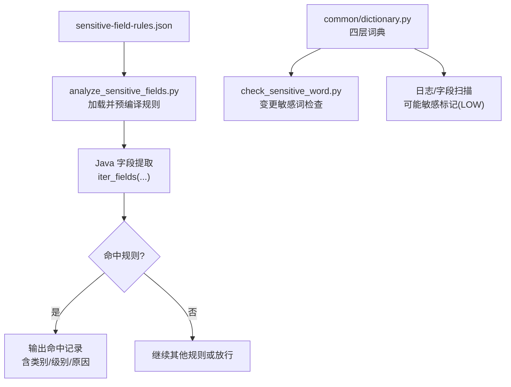
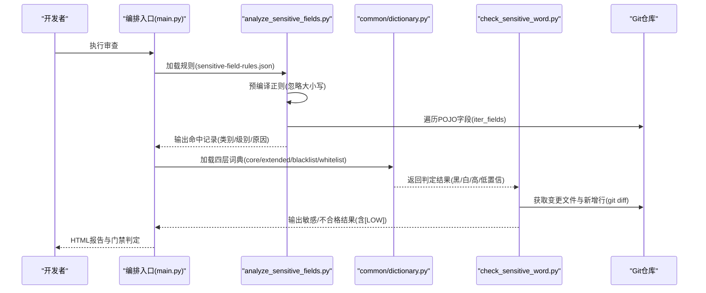
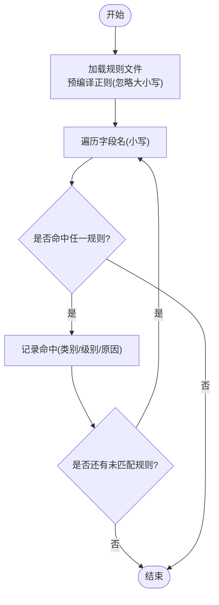
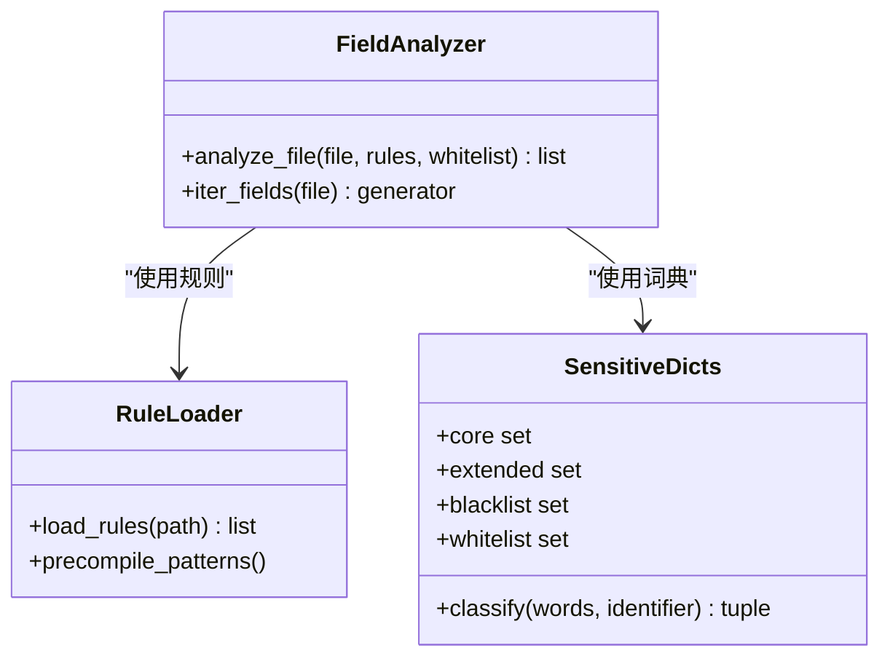
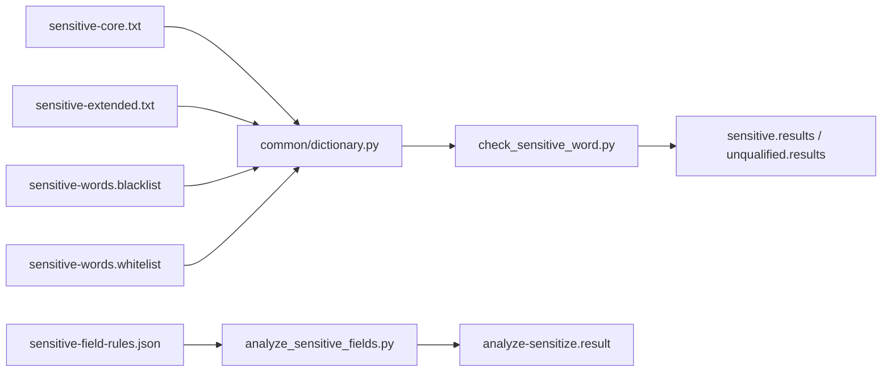

# 敏感字段规则配置

<cite>
**本文引用的文件**
- [sensitive-field-rules.json](file://sensitive-log-review/scripts/rules/sensitive-field-rules.json)
- [analyze_sensitive_fields.py](file://sensitive-log-review/scripts/analyze_sensitive_fields.py)
- [check_sensitive_word.py](file://sensitive-log-review/scripts/check_sensitive_word.py)
- [dictionary.py](file://sensitive-log-review/scripts/common/dictionary.py)
- [sensitive-core.txt](file://sensitive-log-review/scripts/dictionary/sensitive-core.txt)
- [sensitive-extended.txt](file://sensitive-log-review/scripts/dictionary/sensitive-extended.txt)
- [sensitive-words.whitelist](file://sensitive-log-review/scripts/dictionary/sensitive-words.whitelist)
- [sensitive-words.blacklist](file://sensitive-log-review/scripts/dictionary/sensitive-words.blacklist)
- [README.md](file://sensitive-log-review/README.md)
- [SKILL.md](file://sensitive-log-review/SKILL.md)
</cite>

## 目录
1. [简介](#简介)
2. [项目结构](#项目结构)
3. [核心组件](#核心组件)
4. [架构总览](#架构总览)
5. [详细组件分析](#详细组件分析)
6. [依赖关系分析](#依赖关系分析)
7. [性能考量](#性能考量)
8. [故障排查指南](#故障排查指南)
9. [结论](#结论)
10. [附录：配置示例与合规场景](#附录配置示例与合规场景)

## 简介
本文件为“敏感字段规则配置”的权威说明，聚焦于敏感字段规则配置文件 sensitive-field-rules.json 的结构定义、匹配算法、分类体系与优先级策略，并结合银行金融业合规要求（如 JR/T 0171-2020）提供落地实践。文档同时覆盖字段类型识别、正则表达式匹配模式、精确/模糊/上下文感知匹配策略，以及完整的配置示例与合规场景指引。

## 项目结构
敏感字段规则相关能力由“规则配置 + 解析执行 + 词典分层判定”三部分构成：
- 规则配置：sensitive-field-rules.json 定义类别、级别、正则模式与原因描述。
- 解析执行：analyze_sensitive_fields.py 加载并预编译规则，对 Java POJO 字段进行初筛。
- 词典分层：common/dictionary.py 实现四层词典（白名单 > 黑名单 > 高置信 core > 低置信 extended），用于字段命名与日志扫描时的敏感判定。

图表来源
- [sensitive-field-rules.json:1-45](file://sensitive-log-review/scripts/rules/sensitive-field-rules.json#L1-L45)
- [analyze_sensitive_fields.py:44-93](file://sensitive-log-review/scripts/analyze_sensitive_fields.py#L44-L93)
- [dictionary.py:80-132](file://sensitive-log-review/scripts/common/dictionary.py#L80-L132)
- [check_sensitive_word.py:58-110](file://sensitive-log-review/scripts/check_sensitive_word.py#L58-L110)

章节来源
- [README.md:267-309](file://sensitive-log-review/README.md#L267-L309)
- [SKILL.md:120-152](file://sensitive-log-review/SKILL.md#L120-L152)

## 核心组件
- 敏感字段规则文件 sensitive-field-rules.json：以 JSON 数组形式定义规则条目，每条包含 category（类别）、level（敏感级别）、patterns（正则模式数组）、reason（命中原因）。
- 规则加载器 analyze_sensitive_fields.py：读取规则文件，预编译正则（忽略大小写），按顺序匹配字段名，首次命中即止。
- 词典系统 common/dictionary.py：实现四层优先级判定（whitelist > blacklist > core > extended），支持整名豁免与拆分单词匹配。
- 变更敏感词检查 check_sensitive_word.py：结合 git diff 新增行过滤，输出高/低置信结果，支持门禁策略。

章节来源
- [sensitive-field-rules.json:1-45](file://sensitive-log-review/scripts/rules/sensitive-field-rules.json#L1-L45)
- [analyze_sensitive_fields.py:44-93](file://sensitive-log-review/scripts/analyze_sensitive_fields.py#L44-L93)
- [dictionary.py:80-132](file://sensitive-log-review/scripts/common/dictionary.py#L80-L132)
- [check_sensitive_word.py:58-110](file://sensitive-log-review/scripts/check_sensitive_word.py#L58-L110)

## 架构总览
敏感字段审查采用“规则初筛 + 词典分层 + 语义复核”的分层架构：
- 7a 规则初筛：基于结构化正则规则的确定性分析，可作 CI 门禁。
- 词典分层：在字段命名与日志扫描阶段，通过四层词典快速判定高/低置信敏感。
- 7b LLM 语义复核：理解注释与上下文，补漏判拼音/无意义命名等盲区，不计入门禁统计。

图表来源
- [analyze_sensitive_fields.py:44-93](file://sensitive-log-review/scripts/analyze_sensitive_fields.py#L44-L93)
- [dictionary.py:80-132](file://sensitive-log-review/scripts/common/dictionary.py#L80-L132)
- [check_sensitive_word.py:156-243](file://sensitive-log-review/scripts/check_sensitive_word.py#L156-L243)
- [SKILL.md:120-152](file://sensitive-log-review/SKILL.md#L120-L152)

## 详细组件分析

### 敏感字段规则文件结构（sensitive-field-rules.json）
- 数据结构：JSON 数组，每个元素代表一条规则。
- 字段含义：
  - category：数据类别（如身份鉴别信息、生物识别信息、金融账户信息等）。
  - level：敏感级别（C3/C2 或混合），依据 JR/T 0171-2020。
  - patterns：正则模式数组，匹配时统一忽略大小写。
  - reason：命中时输出的原因描述，便于审计与定位。
- 匹配语义：按规则顺序匹配，首次命中即停止；一个字段最多产生一条命中记录。

图表来源
- [sensitive-field-rules.json:1-45](file://sensitive-log-review/scripts/rules/sensitive-field-rules.json#L1-L45)
- [analyze_sensitive_fields.py:44-93](file://sensitive-log-review/scripts/analyze_sensitive_fields.py#L44-L93)

章节来源
- [sensitive-field-rules.json:1-45](file://sensitive-log-review/scripts/rules/sensitive-field-rules.json#L1-L45)
- [analyze_sensitive_fields.py:44-93](file://sensitive-log-review/scripts/analyze_sensitive_fields.py#L44-L93)
- [README.md:294-309](file://sensitive-log-review/README.md#L294-L309)

### 字段类型识别与分类体系
- 分类维度：身份鉴别信息、生物识别信息、金融账户信息、财产与信用信息、基本资料、交易与行为信息、密钥与证书等。
- 级别划分：C3（高敏，如密码、验证码、卡号）、C2（中敏，如联系方式、地址、交易信息），部分类别允许混合级别。
- 分类来源：遵循 JR/T 0171-2020 个人金融信息保护技术规范，确保合规一致性。

章节来源
- [sensitive-field-rules.json:1-45](file://sensitive-log-review/scripts/rules/sensitive-field-rules.json#L1-L45)
- [README.md:294-309](file://sensitive-log-review/README.md#L294-L309)
- [SKILL.md:214-219](file://sensitive-log-review/SKILL.md#L214-L219)

### 正则表达式匹配模式与优先级
- 匹配策略：
  - 精确匹配：针对完整字段名或拆分后的单词（词典层）。
  - 模糊匹配：基于正则表达式（规则层），支持子串与变体（如 card.?no）。
  - 上下文感知：LLM 语义复核（7b）结合注释与命名语义，处理拼音/缩写/无意义命名。
- 优先级：
  - 规则层：按规则顺序匹配，首次命中即止。
  - 词典层：白名单 > 黑名单 > 高置信 core > 低置信 extended。
  - 门禁策略：高置信默认触发门禁，低置信默认仅提示（可通过参数调整）。

章节来源
- [analyze_sensitive_fields.py:44-93](file://sensitive-log-review/scripts/analyze_sensitive_fields.py#L44-L93)
- [dictionary.py:80-132](file://sensitive-log-review/scripts/common/dictionary.py#L80-L132)
- [check_sensitive_word.py:93-110](file://sensitive-log-review/scripts/check_sensitive_word.py#L93-L110)
- [SKILL.md:120-152](file://sensitive-log-review/SKILL.md#L120-L152)

### 字段匹配算法实现原理
- 精确匹配：词典层对拆分后的单词进行集合查找，时间复杂度 O(1)。
- 模糊匹配：规则层使用预编译的正则表达式进行搜索，时间复杂度取决于字段长度与正则复杂度。
- 上下文感知：7b 步骤由 AI 执行体读取字段注释与上下文，进行语义判断，非确定但补漏能力强。

图表来源
- [dictionary.py:80-132](file://sensitive-log-review/scripts/common/dictionary.py#L80-L132)
- [analyze_sensitive_fields.py:44-93](file://sensitive-log-review/scripts/analyze_sensitive_fields.py#L44-L93)

章节来源
- [dictionary.py:80-132](file://sensitive-log-review/scripts/common/dictionary.py#L80-L132)
- [analyze_sensitive_fields.py:44-93](file://sensitive-log-review/scripts/analyze_sensitive_fields.py#L44-L93)

## 依赖关系分析
- 规则文件依赖：sensitive-field-rules.json 被 analyze_sensitive_fields.py 加载并预编译。
- 词典依赖：common/dictionary.py 加载四类词典文件，供 check_sensitive_word.py 与日志扫描使用。
- 变更检测依赖：check_sensitive_word.py 依赖 git diff 获取变更文件与新增行，结合词典结果输出门禁判定。

图表来源
- [analyze_sensitive_fields.py:44-93](file://sensitive-log-review/scripts/analyze_sensitive_fields.py#L44-L93)
- [dictionary.py:21-28](file://sensitive-log-review/scripts/common/dictionary.py#L21-L28)
- [check_sensitive_word.py:58-110](file://sensitive-log-review/scripts/check_sensitive_word.py#L58-L110)

章节来源
- [analyze_sensitive_fields.py:44-93](file://sensitive-log-review/scripts/analyze_sensitive_fields.py#L44-L93)
- [dictionary.py:21-28](file://sensitive-log-review/scripts/common/dictionary.py#L21-L28)
- [check_sensitive_word.py:58-110](file://sensitive-log-review/scripts/check_sensitive_word.py#L58-L110)

## 性能考量
- 规则预编译：正则表达式在加载时预编译，避免重复编译开销。
- 词典缓存：词典文件按路径与修改时间缓存，减少重复读取。
- 增量扫描：默认仅扫描变更文件，提升流水线速度。
- 并行编排：main.py 使用线程池并行执行多条链路，缩短整体耗时。

章节来源
- [analyze_sensitive_fields.py:44-67](file://sensitive-log-review/scripts/analyze_sensitive_fields.py#L44-L67)
- [dictionary.py:31-77](file://sensitive-log-review/scripts/common/dictionary.py#L31-L77)
- [README.md:30-53](file://sensitive-log-review/README.md#L30-L53)

## 故障排查指南
- 规则文件损坏：若 JSON 格式错误或正则编译失败，将输出结构化错误并退出码 2。
- 词典文件缺失：缺失词典文件将被忽略，不影响其他功能。
- Git 仓库问题：非 git 仓库或分支校验失败将导致执行错误。
- 失败文件统计：读取/解析失败的文件会记录到 failed-files.list，默认不计入门禁，可启用严格模式拦截。

章节来源
- [analyze_sensitive_fields.py:44-67](file://sensitive-log-review/scripts/analyze_sensitive_fields.py#L44-L67)
- [check_sensitive_word.py:156-182](file://sensitive-log-review/scripts/check_sensitive_word.py#L156-L182)
- [README.md:459-482](file://sensitive-log-review/README.md#L459-L482)

## 结论
敏感字段规则配置通过结构化规则文件与分层词典机制，实现了高效、可维护且符合监管要求的敏感信息识别。结合规则初筛与语义复核，既能保证 CI 门禁的稳定性，又能覆盖复杂命名与上下文场景。建议定期维护规则与词典，确保与业务演进和合规要求同步。

## 附录：配置示例与合规场景

### 配置示例
- 身份鉴别信息：添加 password、otp、captcha 等正则模式，级别设为 C3。
- 金融账户信息：添加 card.?no、account.?no、balance 等模式，级别设为 C3/C2。
- 基本资料：添加 id.?card、phone、email 等模式，级别设为 C2/C3。
- 密钥与证书：添加 private.?key、secret.?key、token 等模式，级别设为 C3。

章节来源
- [sensitive-field-rules.json:1-45](file://sensitive-log-review/scripts/rules/sensitive-field-rules.json#L1-L45)
- [README.md:294-309](file://sensitive-log-review/README.md#L294-L309)

### 银行金融业合规场景
- 客户隐私保护：对姓名、身份证号、手机号等基础信息进行 C2/C3 分级管控，禁止明文日志输出。
- 交易数据安全：对交易号、支付流水、余额等字段实施强脱敏，确保传输与存储安全。
- 凭证与密钥管理：对私钥、令牌、会话标识等高敏字段实施最高级别防护，禁止任何形式泄露。

章节来源
- [README.md:294-309](file://sensitive-log-review/README.md#L294-L309)
- [SKILL.md:214-219](file://sensitive-log-review/SKILL.md#L214-L219)