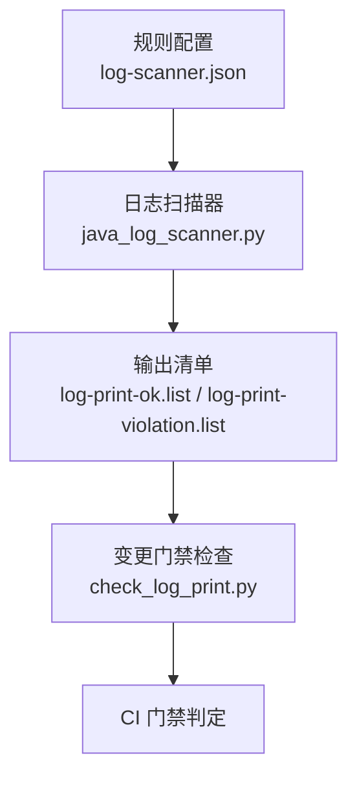
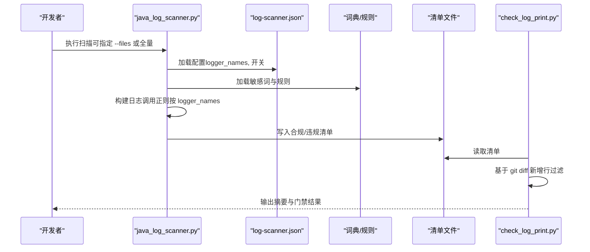
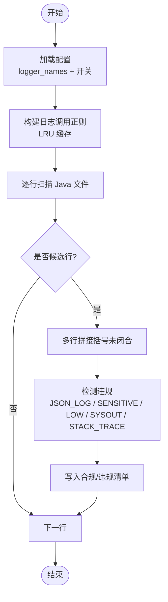
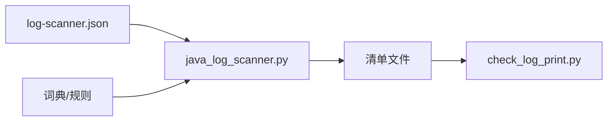

# 日志扫描规则配置

<cite>
**本文引用的文件**
- [log-scanner.json](file://sensitive-log-review/scripts/rules/log-scanner.json)
- [java_log_scanner.py](file://sensitive-log-review/scripts/java_log_scanner.py)
- [check_log_print.py](file://sensitive-log-review/scripts/check_log_print.py)
- [README.md](file://sensitive-log-review/README.md)
- [sensitive-field-rules.json](file://sensitive-log-review/scripts/rules/sensitive-field-rules.json)
- [test_java_log_scanner.py](file://sensitive-log-review/tests/test_java_log_scanner.py)
</cite>

## 目录
1. [简介](#简介)
2. [项目结构](#项目结构)
3. [核心组件](#核心组件)
4. [架构总览](#架构总览)
5. [详细组件分析](#详细组件分析)
6. [依赖关系分析](#依赖关系分析)
7. [性能考虑](#性能考虑)
8. [故障排查指南](#故障排查指南)
9. [结论](#结论)
10. [附录：银行金融业审计场景配置案例](#附录银行金融业审计场景配置案例)

## 简介
本文件面向 Java 项目的“敏感信息日志审查”流水线中的“日志扫描规则配置”，聚焦于 log-scanner.json 的结构与选项，说明如何配置 logger_names、detect_system_out、detect_print_stack_trace 等开关，以适配不同项目的编码规范。同时提供常见日志框架（SLF4J、Log4j、Java Util Logging）的配置思路、正则表达式最佳实践、匹配效率优化建议，以及银行金融业特定审计场景的落地示例。

## 项目结构
该能力位于 sensitive-log-review 模块中，关键文件包括：
- 规则配置：scripts/rules/log-scanner.json
- 扫描实现：scripts/java_log_scanner.py
- 变更门禁：scripts/check_log_print.py
- 文档与流程：README.md
- 敏感字段规则：scripts/rules/sensitive-field-rules.json
- 单测用例：tests/test_java_log_scanner.py

图表来源
- [log-scanner.json:1-7](file://sensitive-log-review/scripts/rules/log-scanner.json#L1-L7)
- [java_log_scanner.py:70-103](file://sensitive-log-review/scripts/java_log_scanner.py#L70-L103)
- [check_log_print.py:139-227](file://sensitive-log-review/scripts/check_log_print.py#L139-L227)

章节来源
- [README.md:267-358](file://sensitive-log-review/README.md#L267-L358)

## 核心组件
- 规则配置文件 log-scanner.json
  - logger_names：定义哪些变量名被视为日志对象，用于匹配日志调用点。
  - detect_system_out：是否检测 System.out/System.err 输出（默认关闭）。
  - detect_print_stack_trace：是否检测 printStackTrace() 调用（默认关闭）。
- 日志扫描器 java_log_scanner.py
  - 加载并解析规则配置，构建日志调用匹配的正则。
  - 支持多行日志拼接、字符串常量剥离、JSON 序列化检测、敏感词分层判定。
  - 可选开启 System.out 与 printStackTrace 检测。
- 变更门禁 check_log_print.py
  - 读取步骤1产出的清单，结合 git diff 新增行过滤，区分常规违规与低置信提示，决定是否触发门禁。

章节来源
- [log-scanner.json:1-7](file://sensitive-log-review/scripts/rules/log-scanner.json#L1-L7)
- [java_log_scanner.py:70-103](file://sensitive-log-review/scripts/java_log_scanner.py#L70-L103)
- [check_log_print.py:139-227](file://sensitive-log-review/scripts/check_log_print.py#L139-L227)

## 架构总览
日志扫描与门禁的整体流程如下：

图表来源
- [java_log_scanner.py:328-417](file://sensitive-log-review/scripts/java_log_scanner.py#L328-L417)
- [check_log_print.py:139-227](file://sensitive-log-review/scripts/check_log_print.py#L139-L227)

## 详细组件分析

### 规则配置：log-scanner.json
- 字段说明
  - logger_names：数组，包含将被识别为日志对象的变量名（如 log、logger、LOG、LOGGER、LogHelper、LogUtil）。这些名称将参与构建日志调用匹配的正则。
  - detect_system_out：布尔值，控制是否检测 System.out/System.err 输出。默认 false，避免噪音。
  - detect_print_stack_trace：布尔值，控制是否检测 printStackTrace()。默认 false，避免噪音。
- 行为要点
  - 若配置文件缺失或 JSON 损坏，将回退到默认配置并告警。
  - 仅当 logger_names 列表有效时才会构建日志调用匹配模式；否则使用默认列表。
  - 可选检测项仅在对应开关开启时生效。

章节来源
- [log-scanner.json:1-7](file://sensitive-log-review/scripts/rules/log-scanner.json#L1-L7)
- [java_log_scanner.py:70-88](file://sensitive-log-review/scripts/java_log_scanner.py#L70-L88)

### 日志扫描器：java_log_scanner.py
- 配置加载与缓存
  - load_scanner_config：读取并校验配置，返回合并后的配置字典。
  - build_log_call_pattern：根据 logger_names 构建日志调用匹配的正则，并使用 LRU 缓存减少重复编译。
- 匹配与检测
  - 支持多行日志调用拼接（括号闭合判断）。
  - 从日志参数中提取标识符，排除字符串字面量，避免误判。
  - 检测 JSON 序列化输出（fastjson、org.json、Gson、Jackson、Hutool 等）。
  - 分层敏感词判定：core/blacklist 高置信标记 SENSITIVE，extended 低置信标记 LOW。
  - 可选检测：System.out/System.err 输出与 printStackTrace()。
- 输出
  - 合规清单：log-print-ok.list
  - 违规清单：log-print-violation.list（含标签 TAGS）

图表来源
- [java_log_scanner.py:90-103](file://sensitive-log-review/scripts/java_log_scanner.py#L90-L103)
- [java_log_scanner.py:131-213](file://sensitive-log-review/scripts/java_log_scanner.py#L131-L213)
- [java_log_scanner.py:216-298](file://sensitive-log-review/scripts/java_log_scanner.py#L216-L298)

章节来源
- [java_log_scanner.py:70-103](file://sensitive-log-review/scripts/java_log_scanner.py#L70-L103)
- [java_log_scanner.py:131-213](file://sensitive-log-review/scripts/java_log_scanner.py#L131-L213)
- [java_log_scanner.py:216-298](file://sensitive-log-review/scripts/java_log_scanner.py#L216-L298)

### 变更门禁：check_log_print.py
- 功能
  - 读取步骤1产出的清单文件，匹配当前分支与目标分支的变更文件。
  - 基于 git diff 新增行过滤，仅保留真正新增的内容。
  - 区分常规违规与低置信提示（LOW），默认不触发门禁；可通过 --fail-on-low 开启。
- 输出
  - 控制台摘要：SUMMARY: violation=<n> low=<n> ok=<n>
  - 退出码：0 通过，1 触发门禁，2 执行错误

章节来源
- [check_log_print.py:139-227](file://sensitive-log-review/scripts/check_log_print.py#L139-L227)

## 依赖关系分析
- 规则配置驱动扫描行为：logger_names 决定日志调用匹配范围；两个开关控制可选检测。
- 扫描器依赖词典与规则：敏感词分层（core/blacklist/extended）与结构化规则（sensitive-field-rules.json）共同决定命中级别。
- 门禁依赖清单与 git diff：仅对新增行进行匹配，降低误报与噪音。

图表来源
- [log-scanner.json:1-7](file://sensitive-log-review/scripts/rules/log-scanner.json#L1-L7)
- [java_log_scanner.py:70-103](file://sensitive-log-review/scripts/java_log_scanner.py#L70-L103)
- [check_log_print.py:139-227](file://sensitive-log-review/scripts/check_log_print.py#L139-L227)

章节来源
- [sensitive-field-rules.json:1-45](file://sensitive-log-review/scripts/rules/sensitive-field-rules.json#L1-L45)
- [README.md:267-358](file://sensitive-log-review/README.md#L267-L358)

## 性能考虑
- 正则表达式编写最佳实践
  - 使用 re.escape 对 logger_names 进行转义后拼接，避免特殊字符导致匹配异常。
  - 利用 LRU 缓存（_build_log_call_pattern_cached）避免重复编译同一配置的正则。
  - 预编译常用正则（JSON_CONVERSION_PATTERN、IDENTIFIER_PATTERN、STRING_LITERAL_PATTERN 等），减少重复开销。
- 匹配效率优化
  - 先快速筛选候选行（日志调用或可选检测项），再进入复杂处理（多行拼接、敏感词分类）。
  - 在敏感词判定前剥离字符串字面量，避免对常量文本进行无谓匹配。
  - 仅对开启的可选检测项执行相应正则搜索，减少不必要的计算。
- 扫描范围优化
  - 优先使用 --changed-only 模式，仅扫描变更文件；必要时使用 --full-scan。
  - CI 并行场景使用 --run-id 隔离输出目录，避免产物覆盖与竞争。

章节来源
- [java_log_scanner.py:90-103](file://sensitive-log-review/scripts/java_log_scanner.py#L90-L103)
- [java_log_scanner.py:131-213](file://sensitive-log-review/scripts/java_log_scanner.py#L131-L213)
- [java_log_scanner.py:216-298](file://sensitive-log-review/scripts/java_log_scanner.py#L216-L298)
- [README.md:267-358](file://sensitive-log-review/README.md#L267-L358)

## 故障排查指南
- 配置问题
  - 配置文件缺失或 JSON 损坏：将回退到默认配置并告警。检查 log-scanner.json 语法与字段类型。
- 扫描问题
  - 非 UTF-8 编码文件：脚本使用 errors='replace' 解码，避免静默丢字节导致漏检。
  - 多行日志未闭合：扫描器会尝试拼接后续行直至括号闭合；若仍失败，检查代码格式。
- 门禁问题
  - 无变更结果：确认目标分支引用完整（fetch-depth: 0），或使用 --full-scan。
  - 低置信提示过多：可通过 --fail-on-low 调整门禁策略，或优化词典与规则。

章节来源
- [java_log_scanner.py:70-88](file://sensitive-log-review/scripts/java_log_scanner.py#L70-L88)
- [java_log_scanner.py:216-298](file://sensitive-log-review/scripts/java_log_scanner.py#L216-L298)
- [check_log_print.py:139-227](file://sensitive-log-review/scripts/check_log_print.py#L139-L227)
- [README.md:385-424](file://sensitive-log-review/README.md#L385-L424)

## 结论
log-scanner.json 提供了灵活的日志扫描规则配置，通过 logger_names 精准定位日志调用点，配合可选检测开关控制噪音。结合词典与结构化规则，可实现高置信与低置信的分层判定，并通过变更门禁机制在 CI 中形成质量防线。遵循正则最佳实践与性能优化建议，可在大规模项目中保持高效稳定的扫描效果。

## 附录：银行金融业审计场景配置案例

### 适配不同日志框架的 logger_names 配置
- SLF4J（推荐）
  - 常见变量名：log、logger、LOG、LOGGER
  - 配置示例：在 logger_names 中添加 ["log", "logger", "LOG", "LOGGER"]
  - 说明：SLF4J 通常通过 LoggerFactory.getLogger(...) 获取实例，变量命名多为小写或大写常量。
- Log4j2
  - 常见变量名：log、logger、LOG、LOGGER
  - 配置示例：同上
  - 说明：Log4j2 也常使用静态 Logger 实例，命名风格与 SLF4J 类似。
- Java Util Logging (JUL)
  - 常见变量名：logger、Logger、log
  - 配置示例：添加 ["logger", "Logger", "log"]
  - 说明：JUL 通过 Logger.getLogger(...) 获取实例，注意大小写差异。

章节来源
- [log-scanner.json:1-7](file://sensitive-log-review/scripts/rules/log-scanner.json#L1-L7)
- [test_java_log_scanner.py:31-66](file://sensitive-log-review/tests/test_java_log_scanner.py#L31-L66)

### 启用可选检测项
- detect_system_out
  - 作用：检测 System.out/System.err 输出，适用于禁止直接打印的场景。
  - 建议：默认关闭，仅在严格模式下开启，避免噪音。
- detect_print_stack_trace
  - 作用：检测 printStackTrace() 调用，防止堆栈信息泄露。
  - 建议：默认关闭，仅在安全审计阶段开启。

章节来源
- [log-scanner.json:1-7](file://sensitive-log-review/scripts/rules/log-scanner.json#L1-L7)
- [java_log_scanner.py:60-63](file://sensitive-log-review/scripts/java_log_scanner.py#L60-L63)
- [java_log_scanner.py:148-213](file://sensitive-log-review/scripts/java_log_scanner.py#L148-L213)

### 银行金融业特定审计场景
- 身份鉴别信息（C3）
  - 规则来源：sensitive-field-rules.json 中“身份鉴别信息”类别，包含 password、passwd、pwd、cvn*、cvv*、otp、sms.?code、verify.?code、captcha 等模式。
  - 配置建议：确保 logger_names 覆盖项目使用的日志变量名，以便准确捕获相关日志。
- 金融账户信息（C3/C2）
  - 规则来源：sensitive-field-rules.json 中“金融账户信息”类别，包含 card.?no、card.?num、account.?no、acct、balance、bank.?card 等模式。
  - 配置建议：结合词典中的 core/blacklist/extended 层级，提升命中精度。
- 基本资料（C2/C3）
  - 规则来源：sensitive-field-rules.json 中“基本资料”类别，包含 id.?card、identity、passport、phone、mobile、email、address 等模式。
  - 配置建议：对泛用词（如 code、name、type）谨慎加入 core，避免误报。

章节来源
- [sensitive-field-rules.json:1-45](file://sensitive-log-review/scripts/rules/sensitive-field-rules.json#L1-L45)
- [README.md:294-309](file://sensitive-log-review/README.md#L294-L309)

### 完整配置示例（概念性说明）
- 基础配置
  - logger_names：["log", "logger", "LOG", "LOGGER"]
  - detect_system_out：false
  - detect_print_stack_trace：false
- 严格审计配置
  - logger_names：["log", "logger", "LOG", "LOGGER", "LogHelper", "LogUtil"]
  - detect_system_out：true
  - detect_print_stack_trace：true
- 自定义日志框架配置
  - 针对 JUL：logger_names：["logger", "Logger", "log"]
  - 针对自研日志工具：添加对应变量名（如 LogUtil、LogHelper）

章节来源
- [log-scanner.json:1-7](file://sensitive-log-review/scripts/rules/log-scanner.json#L1-L7)
- [test_java_log_scanner.py:56-66](file://sensitive-log-review/tests/test_java_log_scanner.py#L56-L66)