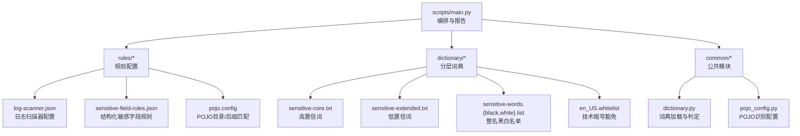
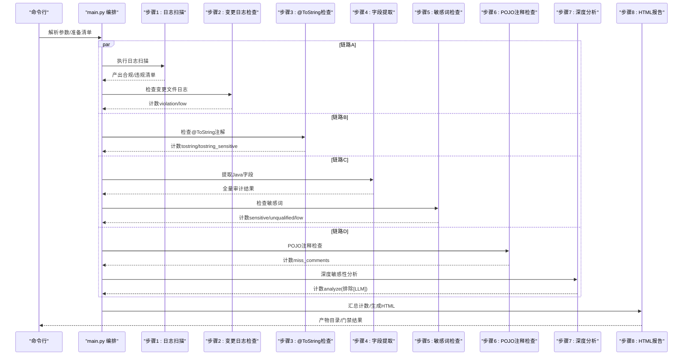
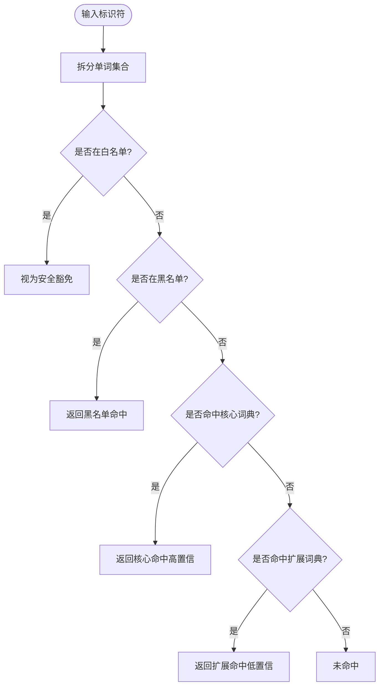
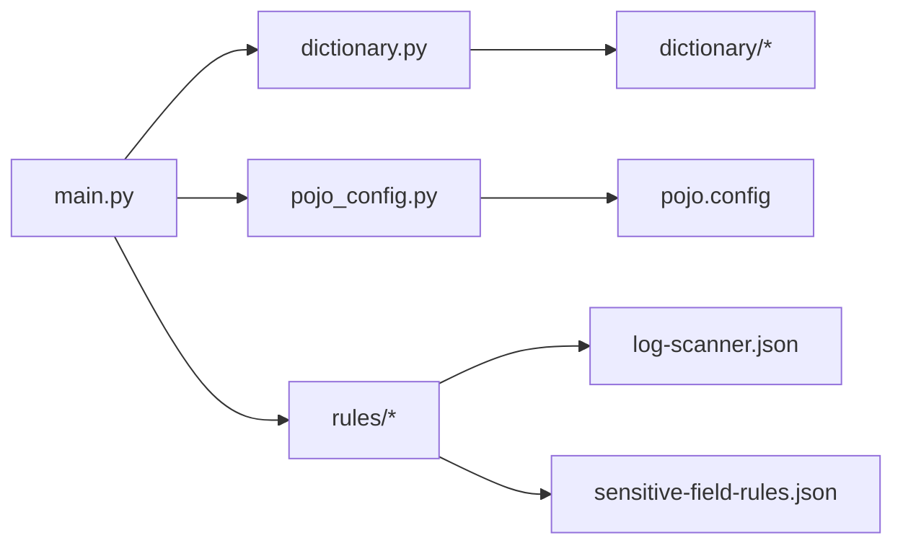

# 规则配置系统

<cite>
**本文引用的文件**
- [README.md](file://sensitive-log-review/README.md)
- [SKILL.md](file://sensitive-log-review/SKILL.md)
- [main.py](file://sensitive-log-review/scripts/main.py)
- [dictionary.py](file://sensitive-log-review/scripts/common/dictionary.py)
- [pojo_config.py](file://sensitive-log-review/scripts/common/pojo_config.py)
- [log-scanner.json](file://sensitive-log-review/scripts/rules/log-scanner.json)
- [pojo.config](file://sensitive-log-review/scripts/rules/pojo.config)
- [sensitive-field-rules.json](file://sensitive-log-review/scripts/rules/sensitive-field-rules.json)
- [sensitive-core.txt](file://sensitive-log-review/scripts/dictionary/sensitive-core.txt)
- [sensitive-extended.txt](file://sensitive-log-review/scripts/dictionary/sensitive-extended.txt)
- [sensitive-words.whitelist](file://sensitive-log-review/scripts/dictionary/sensitive-words.whitelist)
- [sensitive-words.blacklist](file://sensitive-log-review/scripts/dictionary/sensitive-words.blacklist)
- [en_US.whitelist](file://sensitive-log-review/scripts/dictionary/en_US.whitelist)
</cite>

## 目录
1. [简介](#简介)
2. [项目结构](#项目结构)
3. [核心组件](#核心组件)
4. [架构总览](#架构总览)
5. [详细组件分析](#详细组件分析)
6. [依赖关系分析](#依赖关系分析)
7. [性能与优化](#性能与优化)
8. [故障排查指南](#故障排查指南)
9. [结论](#结论)
10. [附录：配置示例与迁移指南](#附录配置示例与迁移指南)

## 简介
本文件面向“敏感信息审查工具”的规则配置系统，聚焦 JSON 规则文件结构与语法、词典系统的实现机制、版本控制与向后兼容、规则编写最佳实践、动态加载与热重载支持、规则验证与调试方法，以及银行金融业合规场景的配置案例。该工具围绕“敏感数据不落日志”的目标，提供从日志扫描、字段命名规范、@ToString 注解检查到深度敏感性分析的完整流水线，并通过 HTML 报告与门禁退出码集成 CI/CD。

## 项目结构
敏感信息审查工具位于 sensitive-log-review 目录，核心脚本与公共模块在 scripts 下，规则与词典分别位于 rules 与 dictionary 子目录。主编排脚本 main.py 通过线程池将多个步骤组织为四条并行链路，最终汇总生成报告与门禁判定。

图表来源
- [main.py:1-800](file://sensitive-log-review/scripts/main.py#L1-L800)
- [dictionary.py:1-143](file://sensitive-log-review/scripts/common/dictionary.py#L1-L143)
- [pojo_config.py:1-127](file://sensitive-log-review/scripts/common/pojo_config.py#L1-L127)
- [log-scanner.json:1-7](file://sensitive-log-review/scripts/rules/log-scanner.json#L1-L7)
- [sensitive-field-rules.json:1-45](file://sensitive-log-review/scripts/rules/sensitive-field-rules.json#L1-L45)
- [pojo.config:1-25](file://sensitive-log-review/scripts/rules/pojo.config#L1-L25)
- [sensitive-core.txt:1-93](file://sensitive-log-review/scripts/dictionary/sensitive-core.txt#L1-L93)
- [sensitive-extended.txt:1-230](file://sensitive-log-review/scripts/dictionary/sensitive-extended.txt#L1-L230)
- [sensitive-words.whitelist:1-12](file://sensitive-log-review/scripts/dictionary/sensitive-words.whitelist#L1-L12)
- [sensitive-words.blacklist:1-13](file://sensitive-log-review/scripts/dictionary/sensitive-words.blacklist#L1-L13)
- [en_US.whitelist:1-41](file://sensitive-log-review/scripts/dictionary/en_US.whitelist#L1-L41)

章节来源
- [README.md:1-497](file://sensitive-log-review/README.md#L1-L497)
- [SKILL.md:1-288](file://sensitive-log-review/SKILL.md#L1-L288)

## 核心组件
- 规则配置系统
  - 日志扫描器配置（JSON）：定义日志变量名、是否检测 System.out 与 printStackTrace。
  - POJO 配置文件（INI 风格）：定义 POJO 目录名与文件名后缀匹配规则。
  - 结构化敏感字段规则（JSON 数组）：按类别、级别、正则模式与原因描述进行命中判定。
- 词典系统
  - 四层优先级：白名单 > 黑名单 > 核心词典 > 扩展词典。
  - 核心词典：高置信敏感词，命中即违规。
  - 扩展词典：低置信上下文词，命中仅标记提示，默认不触发门禁。
  - 整名黑白名单：对完整字段名进行精确匹配，用于豁免或必拦。
  - 英文词典与技术缩写白名单：用于字段命名规范检查的驼峰拆分验证与豁免。
- 版本控制机制
  - 词典文件头部包含 # version: YYYY-MM-DD.N 版本头，修改时递增版本号。
  - 诊断流程会校验版本头存在性并给出建议。
- 动态加载与热重载
  - 词典加载基于文件路径与 mtime 缓存；文件修改后缓存自动失效，无需重启进程即可生效。
  - 多线程环境下使用锁保证缓存读写安全。
- 规则验证与调试
  - 提供 --doctor 环境诊断，逐项检查 Python/java/git、规则与词典文件、输出目录可写性等。
  - 结构化错误码与修复建议输出至 stderr，便于定位问题。

章节来源
- [main.py:1-800](file://sensitive-log-review/scripts/main.py#L1-L800)
- [dictionary.py:1-143](file://sensitive-log-review/scripts/common/dictionary.py#L1-L143)
- [pojo_config.py:1-127](file://sensitive-log-review/scripts/common/pojo_config.py#L1-L127)
- [log-scanner.json:1-7](file://sensitive-log-review/scripts/rules/log-scanner.json#L1-L7)
- [sensitive-field-rules.json:1-45](file://sensitive-log-review/scripts/rules/sensitive-field-rules.json#L1-L45)
- [pojo.config:1-25](file://sensitive-log-review/scripts/rules/pojo.config#L1-L25)
- [sensitive-core.txt:1-93](file://sensitive-log-review/scripts/dictionary/sensitive-core.txt#L1-L93)
- [sensitive-extended.txt:1-230](file://sensitive-log-review/scripts/dictionary/sensitive-extended.txt#L1-L230)
- [sensitive-words.whitelist:1-12](file://sensitive-log-review/scripts/dictionary/sensitive-words.whitelist#L1-L12)
- [sensitive-words.blacklist:1-13](file://sensitive-log-review/scripts/dictionary/sensitive-words.blacklist#L1-L13)
- [en_US.whitelist:1-41](file://sensitive-log-review/scripts/dictionary/en_US.whitelist#L1-L41)

## 架构总览
主编排层将八个步骤组织为四条并行链路，最终汇合生成 HTML 报告与门禁判定。规则与词典作为外部配置被各步骤共享，词典采用分层优先级与缓存机制保障性能与一致性。

图表来源
- [main.py:178-298](file://sensitive-log-review/scripts/main.py#L178-L298)
- [main.py:353-505](file://sensitive-log-review/scripts/main.py#L353-L505)

章节来源
- [SKILL.md:70-157](file://sensitive-log-review/SKILL.md#L70-L157)
- [README.md:30-53](file://sensitive-log-review/README.md#L30-L53)

## 详细组件分析

### 日志扫描规则（log-scanner.json）
- 作用：定义哪些变量名被视为日志对象，是否检测 System.out 与 printStackTrace。
- 关键字段：
  - logger_names：字符串数组，指定日志变量名集合。
  - detect_system_out：布尔值，控制是否检测 System.out。
  - detect_print_stack_trace：布尔值，控制是否检测 printStackTrace()。
- 行为说明：开启 System.out 与 printStackTrace 检测会增加噪音，默认关闭。

章节来源
- [log-scanner.json:1-7](file://sensitive-log-review/scripts/rules/log-scanner.json#L1-L7)
- [README.md:269-284](file://sensitive-log-review/README.md#L269-L284)

### POJO 配置（pojo.config）
- 作用：统一判定 POJO 文件的目录与后缀匹配规则。
- 节与键：
  - [pojo-dir]：目录名命中清单（如 dto、vo、entity、model 等）。
  - [pojo-file]：文件名后缀命中清单（如 dto.java、vo.java、properties.java 等）。
- 判定逻辑：文件需位于 src/main/java 范围内，且满足目录名命中或文件名后缀命中之一。

章节来源
- [pojo.config:1-25](file://sensitive-log-review/scripts/rules/pojo.config#L1-L25)
- [pojo_config.py:27-127](file://sensitive-log-review/scripts/common/pojo_config.py#L27-L127)
- [README.md:285-293](file://sensitive-log-review/README.md#L285-L293)

### 敏感字段规则（sensitive-field-rules.json）
- 作用：7a 规则初筛的结构化规则，源自 JR/T 0171-2020。
- 数据结构：
  - category：数据类别（如身份鉴别信息、生物识别信息等）。
  - level：敏感级别（C3/C2 或混合）。
  - patterns：正则模式数组，编译时忽略大小写。
  - reason：命中时的原因描述。
- 匹配语义：按规则顺序匹配，首次命中即止；一个字段最多产生一条命中记录。

章节来源
- [sensitive-field-rules.json:1-45](file://sensitive-log-review/scripts/rules/sensitive-field-rules.json#L1-L45)
- [README.md:294-306](file://sensitive-log-review/README.md#L294-L306)

### 词典系统与分类判定
- 分层优先级：whitelist（整名豁免）> blacklist（整名必拦）> core（高置信）> extended（低置信）。
- 核心词典（sensitive-core.txt）：高置信敏感词，命中即违规。
- 扩展词典（sensitive-extended.txt）：低置信上下文词，命中仅标记提示，默认不触发门禁。
- 整名黑白名单：
  - whitelist：完整字段名豁免（忽略大小写）。
  - blacklist：完整字段名或拆分词命中，最高严重级。
- 英文词典与技术缩写白名单：用于字段命名规范检查的驼峰拆分验证与豁免。

图表来源
- [dictionary.py:80-132](file://sensitive-log-review/scripts/common/dictionary.py#L80-L132)

章节来源
- [dictionary.py:1-143](file://sensitive-log-review/scripts/common/dictionary.py#L1-L143)
- [sensitive-core.txt:1-93](file://sensitive-log-review/scripts/dictionary/sensitive-core.txt#L1-L93)
- [sensitive-extended.txt:1-230](file://sensitive-log-review/scripts/dictionary/sensitive-extended.txt#L1-L230)
- [sensitive-words.whitelist:1-12](file://sensitive-log-review/scripts/dictionary/sensitive-words.whitelist#L1-L12)
- [sensitive-words.blacklist:1-13](file://sensitive-log-review/scripts/dictionary/sensitive-words.blacklist#L1-L13)
- [en_US.whitelist:1-41](file://sensitive-log-review/scripts/dictionary/en_US.whitelist#L1-L41)

### 版本控制与向后兼容
- 版本头规范：每个词典文件头部包含 # version: YYYY-MM-DD.N，修改时需递增版本号。
- 诊断校验：--doctor 会检查版本头是否存在，缺失时给出警告与建议。
- 向后兼容：新增词条与规则应遵循维护原则，避免破坏既有判定；泛用词不得加入核心词典以减少误报。

章节来源
- [README.md:311-338](file://sensitive-log-review/README.md#L311-L338)
- [SKILL.md:198-213](file://sensitive-log-review/SKILL.md#L198-L213)
- [main.py:544-666](file://sensitive-log-review/scripts/main.py#L544-L666)

### 动态加载与热重载
- 缓存策略：词典加载基于文件路径与 mtime 缓存；同一进程内同一词典文件只解析一次。
- 热重载：文件修改后缓存自动失效，无需重启进程即可生效。
- 线程安全：多线程环境下使用锁保护缓存读写。

章节来源
- [dictionary.py:31-77](file://sensitive-log-review/scripts/common/dictionary.py#L31-L77)

### 规则验证与调试
- 环境诊断：--doctor 逐项检查运行环境与配置，全部通过返回 0，任一失败返回 2。
- 结构化错误：常见错误以错误码（E001-E007）与修复建议输出至 stderr。
- 产物查看：HTML 报告与中间产物文件（如 log-print-violation.list、sensitive.results）便于定位问题。

章节来源
- [README.md:459-469](file://sensitive-log-review/README.md#L459-L469)
- [SKILL.md:31-57](file://sensitive-log-review/SKILL.md#L31-L57)
- [main.py:533-702](file://sensitive-log-review/scripts/main.py#L533-L702)

## 依赖关系分析
- 主编排脚本依赖公共模块与规则/词典配置。
- 公共模块提供词典加载、POJO 判定、Git 操作、路径解析等功能。
- 规则与词典作为外部配置，被多步骤共享，确保一致性与可维护性。

图表来源
- [main.py:41-75](file://sensitive-log-review/scripts/main.py#L41-L75)
- [dictionary.py:21-28](file://sensitive-log-review/scripts/common/dictionary.py#L21-L28)
- [pojo_config.py:16-24](file://sensitive-log-review/scripts/common/pojo_config.py#L16-L24)

章节来源
- [main.py:1-800](file://sensitive-log-review/scripts/main.py#L1-L800)
- [dictionary.py:1-143](file://sensitive-log-review/scripts/common/dictionary.py#L1-L143)
- [pojo_config.py:1-127](file://sensitive-log-review/scripts/common/pojo_config.py#L1-L127)

## 性能与优化
- 并行执行：四链路并行，目标全流程 <60s。
- 变更扫描：默认仅扫描相对目标分支变更的 Java 文件，提升速度。
- 词典缓存：基于 mtime 的模块级缓存，减少重复解析开销。
- 正则优化：结构化规则中的 patterns 编译时忽略大小写，建议避免过度复杂的正则表达式。
- 资源限制：严格模式下对失败文件进行拦截，避免大规模解析失败影响整体性能。

章节来源
- [SKILL.md:158-165](file://sensitive-log-review/SKILL.md#L158-L165)
- [README.md:50-53](file://sensitive-log-review/README.md#L50-L53)
- [dictionary.py:31-77](file://sensitive-log-review/scripts/common/dictionary.py#L31-L77)

## 故障排查指南
- 控制台中文乱码：设置 PYTHONIOENCODING=utf-8。
- 不是 git 仓库：显式传入 -r 指向仓库根目录。
- 找不到 java 命令：安装 JRE/JDK 并确保 PATH 中可用。
- 变更检查无结果：指定正确的对比基准分支或使用 --full-scan。
- 误报处理：将字段名加入白名单并递增版本头。
- 漏报处理：追加词条至核心/扩展词典或调整结构化规则。
- 门禁失败排查：查看控制台末尾计数项与 HTML 报告定位具体问题。
- run-id 非法字符：清洗 CI 变量后再传入。
- jar SHA256 校验告警：重新获取可信 jar 或同步更新基线值。
- failedFiles 警告：打开失败文件清单定位原因，必要时启用 --strict-mode。

章节来源
- [README.md:363-483](file://sensitive-log-review/README.md#L363-L483)
- [SKILL.md:31-57](file://sensitive-log-review/SKILL.md#L31-L57)

## 结论
规则配置系统通过 JSON 规则与分层词典实现了灵活、可扩展的敏感信息审查能力。版本控制与动态加载保障了配置的可维护性与运行时热更新。结合 --doctor 与环境诊断，能够快速定位问题并优化规则。针对银行金融业场景，结构化规则与分类标准提供了合规依据，配合 CI/CD 门禁形成自动化质量防线。

## 附录：配置示例与迁移指南

### JSON 规则文件示例
- 日志扫描器配置（log-scanner.json）
  - 字段：logger_names、detect_system_out、detect_print_stack_trace。
  - 用途：控制日志变量识别与额外输出检测开关。
- 结构化敏感字段规则（sensitive-field-rules.json）
  - 字段：category、level、patterns、reason。
  - 用途：按类别与级别定义正则模式，命中后输出原因描述。

章节来源
- [log-scanner.json:1-7](file://sensitive-log-review/scripts/rules/log-scanner.json#L1-L7)
- [sensitive-field-rules.json:1-45](file://sensitive-log-review/scripts/rules/sensitive-field-rules.json#L1-L45)

### 词典维护示例
- 新增高置信敏感词：追加至 sensitive-core.txt。
- 新增低置信上下文词：追加至 sensitive-extended.txt。
- 确认误报：将完整字段名加入 sensitive-words.whitelist。
- 确认必拦：将完整字段名加入 sensitive-words.blacklist。
- 技术缩写豁免：将缩写加入 en_US.whitelist。
- 版本头递增：每次修改后递增 # version: 版本号。

章节来源
- [sensitive-core.txt:1-93](file://sensitive-log-review/scripts/dictionary/sensitive-core.txt#L1-L93)
- [sensitive-extended.txt:1-230](file://sensitive-log-review/scripts/dictionary/sensitive-extended.txt#L1-L230)
- [sensitive-words.whitelist:1-12](file://sensitive-log-review/scripts/dictionary/sensitive-words.whitelist#L1-L12)
- [sensitive-words.blacklist:1-13](file://sensitive-log-review/scripts/dictionary/sensitive-words.blacklist#L1-L13)
- [en_US.whitelist:1-41](file://sensitive-log-review/scripts/dictionary/en_US.whitelist#L1-L41)

### 银行金融业合规规则配置案例
- 身份鉴别信息（C3）：密码、验证码、卡片验证值等。
- 生物识别信息（C3）：人脸、指纹、虹膜、声纹等。
- 金融账户信息（C3/C2）：卡号、账号、余额等。
- 财产与信用信息（C2/C3）：收入、信用评分、贷款、资产等。
- 基本资料（C2/C3）：证件、联系方式、地址等。
- 交易与行为信息（C2）：交易、订单、支付等。
- 密钥与证书（C3）：私钥、令牌、证书等。

章节来源
- [sensitive-field-rules.json:1-45](file://sensitive-log-review/scripts/rules/sensitive-field-rules.json#L1-L45)
- [README.md:294-306](file://sensitive-log-review/README.md#L294-L306)

### 迁移指南
- 从旧版规则迁移：确保结构化规则符合当前 schema（category、level、patterns、reason）。
- 词典迁移：将历史词条分类至 core/extended，避免泛用词进入核心词典。
- 版本管理：每次修改后递增版本头，并在 CI 中校验版本头存在性。
- 回归测试：运行单测与 --doctor 验证配置正确性与环境可用性。

章节来源
- [README.md:311-338](file://sensitive-log-review/README.md#L311-L338)
- [SKILL.md:198-213](file://sensitive-log-review/SKILL.md#L198-L213)
- [main.py:533-702](file://sensitive-log-review/scripts/main.py#L533-L702)