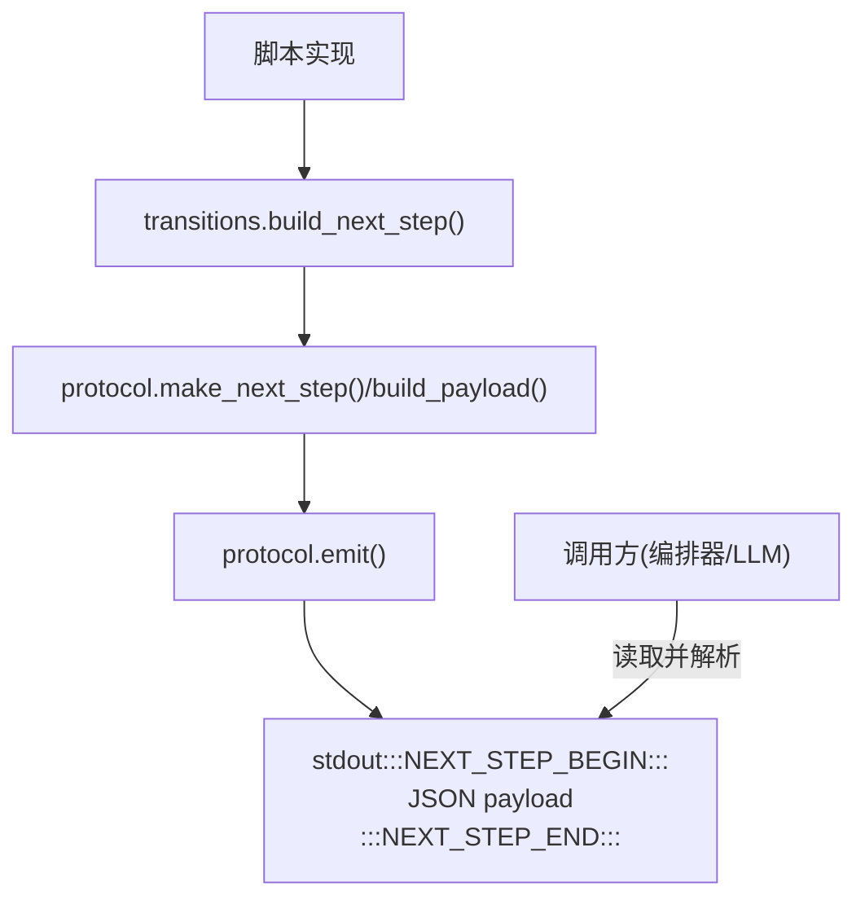
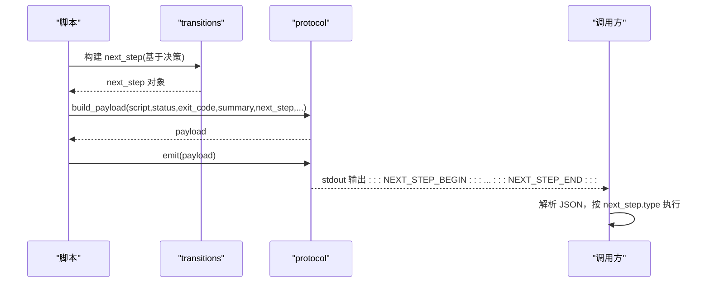
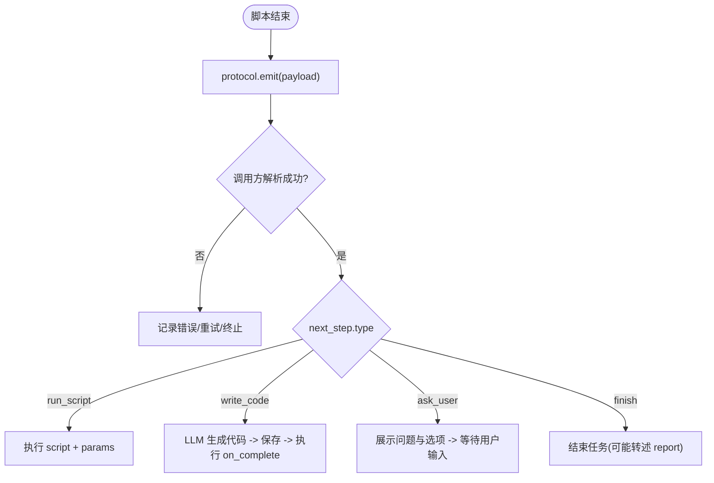
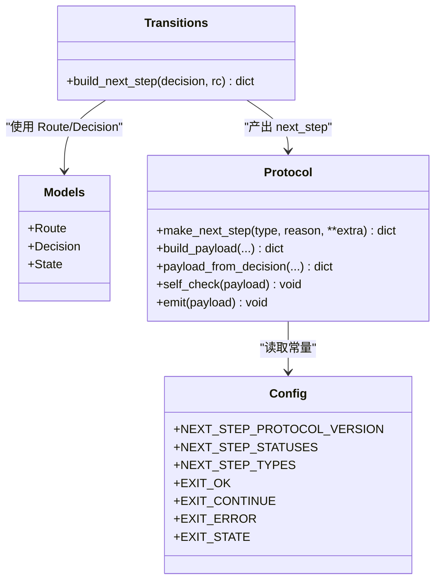

# NEXT_STEP 协议

<cite>
**本文引用的文件**
- [batch-unit-test-generator/protocol/next-step.schema.json](file://batch-unit-test-generator/protocol/next-step.schema.json)
- [java-unit-test-generator/protocol/next-step.schema.json](file://java-unit-test-generator/protocol/next-step.schema.json)
- [batch-unit-test-generator/scripts/jaut/protocol.py](file://batch-unit-test-generator/scripts/jaut/protocol.py)
- [java-unit-test-generator/scripts/jaut/protocol.py](file://java-unit-test-generator/scripts/jaut/protocol.py)
- [batch-unit-test-generator/scripts/jaut/config.py](file://batch-unit-test-generator/scripts/jaut/config.py)
- [java-unit-test-generator/scripts/jaut/config.py](file://java-unit-test-generator/scripts/jaut/config.py)
- [batch-unit-test-generator/scripts/jaut/transitions.py](file://batch-unit-test-generator/scripts/jaut/transitions.py)
- [java-unit-test-generator/scripts/jaut/transitions.py](file://java-unit-test-generator/scripts/jaut/transitions.py)
- [batch-unit-test-generator/tests/test_next_step_schema.py](file://batch-unit-test-generator/tests/test_next_step_schema.py)
- [java-unit-test-generator/tests/test_next_step_schema.py](file://java-unit-test-generator/tests/test_next_step_schema.py)
- [batch-unit-test-generator/scripts/jaut/models.py](file://batch-unit-test-generator/scripts/jaut/models.py)
- [java-unit-test-generator/scripts/jaut/models.py](file://java-unit-test-generator/scripts/jaut/models.py)
</cite>

## 目录
1. [简介](#简介)
2. [项目结构](#项目结构)
3. [核心组件](#核心组件)
4. [架构总览](#架构总览)
5. [详细组件分析](#详细组件分析)
6. [依赖关系分析](#依赖关系分析)
7. [性能与健壮性](#性能与健壮性)
8. [故障排查指南](#故障排查指南)
9. [结论](#结论)
10. [附录：JSON Schema 参考与示例](#附录json-schema-参考与示例)

## 简介
NEXT_STEP 协议是脚本（实现者）与调用方（编排器/LLM）之间的唯一契约。每个脚本在标准输出末尾输出一个被标记包裹的 JSON 块，调用方仅解析该块以决定下一步动作。协议通过 JSON Schema 严格约束负载结构，并通过配置集中管理版本、枚举与退出码等常量，确保跨脚本、跨技能的一致性与可演进性。

## 项目结构
- 协议定义位于各技能的 protocol 目录下，使用 JSON Schema draft-07 描述负载结构。
- 运行时由 scripts/jaut/protocol.py 提供负载构建、自检与输出；scripts/jaut/config.py 集中管理协议版本、状态与类型枚举；scripts/jaut/transitions.py 将领域决策映射为 next_step 对象；scripts/jaut/models.py 提供领域模型与路由到 next_step.type 的映射。

图表来源
- [batch-unit-test-generator/scripts/jaut/transitions.py:39-68](file://batch-unit-test-generator/scripts/jaut/transitions.py#L39-L68)
- [batch-unit-test-generator/scripts/jaut/protocol.py:22-43](file://batch-unit-test-generator/scripts/jaut/protocol.py#L22-L43)
- [batch-unit-test-generator/scripts/jaut/protocol.py:74-104](file://batch-unit-test-generator/scripts/jaut/protocol.py#L74-L104)

章节来源
- [batch-unit-test-generator/protocol/next-step.schema.json:1-195](file://batch-unit-test-generator/protocol/next-step.schema.json#L1-L195)
- [java-unit-test-generator/protocol/next-step.schema.json:1-195](file://java-unit-test-generator/protocol/next-step.schema.json#L1-L195)
- [batch-unit-test-generator/scripts/jaut/config.py:32-48](file://batch-unit-test-generator/scripts/jaut/config.py#L32-L48)
- [java-unit-test-generator/scripts/jaut/config.py:32-48](file://java-unit-test-generator/scripts/jaut/config.py#L32-L48)

## 核心组件
- 协议负载（Payload）：包含协议版本、脚本名、状态、退出码、摘要、产物、指标与 next_step。
- next_step：声明下一步动作类型及参数，支持 run_script、write_code、ask_user、finish。
- 运行时工具：
  - protocol.py：构建负载、轻量自检、输出带标记的 JSON 块，并在序列化失败时降级输出错误协议。
  - config.py：集中管理协议版本、状态枚举、next_step 类型枚举与退出码。
  - transitions.py：将领域决策（Route）转换为具体 next_step。
  - models.py：定义 Route 与 next_step.type 的映射，以及领域数据模型。

章节来源
- [batch-unit-test-generator/scripts/jaut/protocol.py:17-104](file://batch-unit-test-generator/scripts/jaut/protocol.py#L17-L104)
- [batch-unit-test-generator/scripts/jaut/config.py:32-48](file://batch-unit-test-generator/scripts/jaut/config.py#L32-L48)
- [batch-unit-test-generator/scripts/jaut/transitions.py:39-68](file://batch-unit-test-generator/scripts/jaut/transitions.py#L39-L68)
- [batch-unit-test-generator/scripts/jaut/models.py:43-75](file://batch-unit-test-generator/scripts/jaut/models.py#L43-L75)

## 架构总览
协议采用“脚本产出 + 调用方消费”的双向解耦设计：
- 脚本侧：负责业务逻辑与决策，最终产出 next_step 并输出协议块。
- 调用方侧：解析协议块，根据 type 执行相应动作（运行脚本、生成代码、询问用户或结束任务）。

图表来源
- [batch-unit-test-generator/scripts/jaut/transitions.py:39-68](file://batch-unit-test-generator/scripts/jaut/transitions.py#L39-L68)
- [batch-unit-test-generator/scripts/jaut/protocol.py:28-43](file://batch-unit-test-generator/scripts/jaut/protocol.py#L28-L43)
- [batch-unit-test-generator/scripts/jaut/protocol.py:74-104](file://batch-unit-test-generator/scripts/jaut/protocol.py#L74-L104)

## 详细组件分析

### 消息格式规范（Payload）
- 顶层必填字段：protocol_version、script、status、exit_code、summary、artifacts、next_step。
- protocol_version：固定字符串，当前为 1.0。
- script：产出本协议块的脚本文件名。
- status：success / empty / failed / needs_input。
- exit_code：0=正常完成；1=需要继续处理；2=脚本执行错误；3=状态/协议错误。
- summary：面向调用方的一句话结论。
- artifacts：产物列表，每项含 path 与 kind（如 worktree、coverage、mvn_log、surefire_report、test_file）。
- metrics：可选量化指标（覆盖率、轮次、测试计数等）。
- next_step：见下文。

章节来源
- [batch-unit-test-generator/protocol/next-step.schema.json:6-65](file://batch-unit-test-generator/protocol/next-step.schema.json#L6-L65)
- [java-unit-test-generator/protocol/next-step.schema.json:6-65](file://java-unit-test-generator/protocol/next-step.schema.json#L6-L65)

### next_step 类型与参数
- run_script：
  - 必需：type="run_script"、reason、script（下一个脚本绝对路径）、params（命令行参数数组）。
  - 可选：instructions（附加说明）。
- write_code：
  - 必需：type="write_code"、reason、instructions（交给 LLM 的完整提示词）、on_complete（完成后命令，含 script 与 params）。
- ask_user：
  - 必需：type="ask_user"、reason、question（向用户提出的问题）。
  - 可选：resume（恢复选项数组），每项含 option、label，非 terminate 时必须携带 script 与 params；note 用于需用户补充的值或动作说明。
- finish：
  - 必需：type="finish"、reason。
  - 可选：deliverables（交付物路径列表）、report（收尾报告文本，某些脚本必须携带）。

条件约束：
- 当 next_step.type 为 run_script 时，必须携带 script 与 params。
- 当 next_step.type 为 write_code 时，必须携带 instructions 与 on_complete。
- 当 next_step.type 为 ask_user 时，必须携带 question。
- 对于非白名单脚本（batch 中排除 select_worktree.py、batch_diff.py、batch_init.py；java 中排除 select_worktree.py），若 next_step.type 为 finish，则必须携带 report。

章节来源
- [batch-unit-test-generator/protocol/next-step.schema.json:66-177](file://batch-unit-test-generator/protocol/next-step.schema.json#L66-L177)
- [batch-unit-test-generator/protocol/next-step.schema.json:179-193](file://batch-unit-test-generator/protocol/next-step.schema.json#L179-L193)
- [java-unit-test-generator/protocol/next-step.schema.json:66-177](file://java-unit-test-generator/protocol/next-step.schema.json#L66-L177)
- [java-unit-test-generator/protocol/next-step.schema.json:179-193](file://java-unit-test-generator/protocol/next-step.schema.json#L179-L193)

### 通信模式与生命周期
- 脚本执行结束时，统一通过 protocol.emit 输出协议块。
- 调用方解析协议块后，依据 next_step.type 执行：
  - run_script：以提供的 script 与 params 启动下一脚本。
  - write_code：将 instructions 交给 LLM 生成代码，保存后执行 on_complete。
  - ask_user：展示 question 与 resume 选项，等待用户选择后按选项恢复执行。
  - finish：结束任务，必要时转述 report 内容。

图表来源
- [batch-unit-test-generator/scripts/jaut/protocol.py:74-104](file://batch-unit-test-generator/scripts/jaut/protocol.py#L74-L104)
- [batch-unit-test-generator/scripts/jaut/transitions.py:39-68](file://batch-unit-test-generator/scripts/jaut/transitions.py#L39-L68)

### 版本管理与兼容性
- 协议版本：protocol_version 固定为 "1.0"，由 config.NEXT_STEP_PROTOCOL_VERSION 管理。
- 向后兼容策略：
  - 运行时不依赖第三方 jsonschema，仅在 emit 前做轻量自检（必填键与枚举值），不符记 warning 不阻断。
  - 对未知字段采用 additionalProperties 控制（顶层禁止额外属性，但 next_step 允许扩展以便未来扩展）。
  - 条件约束（allOf/if-then）保证关键场景的完整性（如 finish 必须携带 report）。
- 升级路径：
  - 新增 next_step 字段或扩展 resume.option 枚举时，保持旧客户端忽略未知字段的能力。
  - 变更必填字段时需同步更新 schema 的条件约束，并通过测试用例验证。

章节来源
- [batch-unit-test-generator/scripts/jaut/config.py:32-48](file://batch-unit-test-generator/scripts/jaut/config.py#L32-L48)
- [batch-unit-test-generator/protocol/next-step.schema.json:1-195](file://batch-unit-test-generator/protocol/next-step.schema.json#L1-L195)
- [batch-unit-test-generator/tests/test_next_step_schema.py:17-65](file://batch-unit-test-generator/tests/test_next_step_schema.py#L17-L65)

### 错误处理机制
- 轻量自检：emit 前检查必填键与枚举取值，非法值仅告警。
- 序列化失败降级：
  - 捕获 TypeError/ValueError，构造错误协议块（status="failed", exit_code=EXIT_ERROR, next_step.type="ask_user"），避免调用方无限等待。
  - 若错误协议也无法序列化，输出最小 JSON 兜底。
- CLI 层异常兜底：
  - 任何未捕获异常转为内部错误 Decision（route=ASK_USER），再经 transitions 构建 next_step 并输出协议块。

章节来源
- [batch-unit-test-generator/scripts/jaut/protocol.py:59-104](file://batch-unit-test-generator/scripts/jaut/protocol.py#L59-L104)
- [batch-unit-test-generator/scripts/jaut/cli.py:89-128](file://batch-unit-test-generator/scripts/jaut/cli.py#L89-L128)

### 调试方法
- 查看 stdout 中的协议块（被 :::NEXT_STEP_BEGIN:::/:::NEXT_STEP_END::: 包裹）。
- 检查日志中的自检警告（缺失必填键、非法 status/type）。
- 确认 exit_code 与 status 的一致性：
  - 0=success/empty，1=needs_input/continue，2=failed（执行错误），3=failed（状态/协议错误）。
- 使用测试用例验证 schema 条件分支（如 finish 是否携带 report）。

章节来源
- [batch-unit-test-generator/scripts/jaut/protocol.py:59-104](file://batch-unit-test-generator/scripts/jaut/protocol.py#L59-L104)
- [batch-unit-test-generator/tests/test_next_step_schema.py:17-65](file://batch-unit-test-generator/tests/test_next_step_schema.py#L17-L65)

## 依赖关系分析
- config 提供协议常量（版本、状态、类型、退出码）。
- models 定义 Route 与 next_step.type 的映射。
- transitions 将领域决策转换为 next_step。
- protocol 负责负载构建与输出。
- 测试覆盖 schema 条件约束与行为一致性。

图表来源
- [batch-unit-test-generator/scripts/jaut/config.py:32-48](file://batch-unit-test-generator/scripts/jaut/config.py#L32-L48)
- [batch-unit-test-generator/scripts/jaut/models.py:43-75](file://batch-unit-test-generator/scripts/jaut/models.py#L43-L75)
- [batch-unit-test-generator/scripts/jaut/transitions.py:39-68](file://batch-unit-test-generator/scripts/jaut/transitions.py#L39-L68)
- [batch-unit-test-generator/scripts/jaut/protocol.py:22-43](file://batch-unit-test-generator/scripts/jaut/protocol.py#L22-L43)

章节来源
- [batch-unit-test-generator/scripts/jaut/config.py:32-48](file://batch-unit-test-generator/scripts/jaut/config.py#L32-L48)
- [batch-unit-test-generator/scripts/jaut/models.py:43-75](file://batch-unit-test-generator/scripts/jaut/models.py#L43-L75)
- [batch-unit-test-generator/scripts/jaut/transitions.py:39-68](file://batch-unit-test-generator/scripts/jaut/transitions.py#L39-L68)
- [batch-unit-test-generator/scripts/jaut/protocol.py:22-43](file://batch-unit-test-generator/scripts/jaut/protocol.py#L22-L43)

## 性能与健壮性
- 轻量自检避免引入重型校验库，降低运行时开销。
- 序列化失败降级确保调用方不会阻塞。
- 条件约束减少无效负载传输，提升解析效率。
- 建议：
  - 尽量精简 artifacts 与 metrics，仅保留必要信息。
  - 合理设置 exit_code 与 status，便于调用方快速分流。

[本节为通用指导，不直接分析具体文件]

## 故障排查指南
- 协议块未出现：检查脚本是否在最后阶段调用 protocol.emit，且之后无其他 stdout 输出。
- 解析失败：确认协议块被正确标记包裹，且 JSON 合法。
- 缺少必填字段：查看自检警告日志，补齐缺失字段。
- finish 未携带 report：确认脚本不在白名单内，并按 schema 条件添加 report。
- 序列化为空或错误：检查 payload 数据结构是否符合预期，必要时启用更详细的日志。

章节来源
- [batch-unit-test-generator/scripts/jaut/protocol.py:59-104](file://batch-unit-test-generator/scripts/jaut/protocol.py#L59-L104)
- [batch-unit-test-generator/tests/test_next_step_schema.py:17-65](file://batch-unit-test-generator/tests/test_next_step_schema.py#L17-L65)

## 结论
NEXT_STEP 协议通过严格的 JSON Schema、集中的配置常量与健壮的运行时工具，实现了脚本与调用方之间清晰、可扩展、可演进的通信契约。四种 next_step 类型覆盖了自动化流水线的主要场景，配合条件约束与错误降级机制，保证了系统的鲁棒性与可维护性。

[本节为总结，不直接分析具体文件]

## 附录：JSON Schema 参考与示例

### 顶层字段说明
- protocol_version：固定 "1.0"。
- script：脚本文件名。
- status：success / empty / failed / needs_input。
- exit_code：0 / 1 / 2 / 3。
- summary：一句话结论。
- artifacts：产物数组，每项含 path 与 kind。
- metrics：可选指标对象。
- next_step：下一步动作对象。

章节来源
- [batch-unit-test-generator/protocol/next-step.schema.json:6-65](file://batch-unit-test-generator/protocol/next-step.schema.json#L6-L65)
- [java-unit-test-generator/protocol/next-step.schema.json:6-65](file://java-unit-test-generator/protocol/next-step.schema.json#L6-L65)

### next_step 字段说明
- type：run_script / write_code / ask_user / finish。
- reason：原因说明。
- run_script：script（绝对路径）、params（参数数组）。
- write_code：instructions（提示词）、on_complete（script+params）。
- ask_user：question（问题）、resume（选项数组，terminate 无 script/params）。
- finish：deliverables（交付物路径）、report（收尾报告，部分脚本必须携带）。

章节来源
- [batch-unit-test-generator/protocol/next-step.schema.json:66-177](file://batch-unit-test-generator/protocol/next-step.schema.json#L66-L177)
- [java-unit-test-generator/protocol/next-step.schema.json:66-177](file://java-unit-test-generator/protocol/next-step.schema.json#L66-L177)

### 条件约束
- run_script 必须携带 script 与 params。
- write_code 必须携带 instructions 与 on_complete。
- ask_user 必须携带 question。
- 非白名单脚本的 finish 必须携带 report。

章节来源
- [batch-unit-test-generator/protocol/next-step.schema.json:163-177](file://batch-unit-test-generator/protocol/next-step.schema.json#L163-L177)
- [batch-unit-test-generator/protocol/next-step.schema.json:179-193](file://batch-unit-test-generator/protocol/next-step.schema.json#L179-L193)
- [java-unit-test-generator/protocol/next-step.schema.json:163-177](file://java-unit-test-generator/protocol/next-step.schema.json#L163-L177)
- [java-unit-test-generator/protocol/next-step.schema.json:179-193](file://java-unit-test-generator/protocol/next-step.schema.json#L179-L193)

### 示例（路径引用）
- run_script 示例：参见 transitions 构建 run_script 的路径与参数组装。
- write_code 示例：参见 transitions 注入 on_complete 的默认行为。
- ask_user 示例：参见 resume 选项的构造与 note 的使用。
- finish 示例：参见 report 的条件要求与白名单例外。

章节来源
- [batch-unit-test-generator/scripts/jaut/transitions.py:39-68](file://batch-unit-test-generator/scripts/jaut/transitions.py#L39-L68)
- [java-unit-test-generator/scripts/jaut/transitions.py:39-68](file://java-unit-test-generator/scripts/jaut/transitions.py#L39-L68)
- [batch-unit-test-generator/tests/test_next_step_schema.py:17-65](file://batch-unit-test-generator/tests/test_next_step_schema.py#L17-L65)
- [java-unit-test-generator/tests/test_next_step_schema.py:17-65](file://java-unit-test-generator/tests/test_next_step_schema.py#L17-L65)